# Data Science Theory — the map before the code

*Data Science · Theory · SPEC-DS-14*

## One sentence, then a 140-year-old graph

Here's the whole subject, reduced to one line you could say at a dinner table without losing
anyone: **data science and machine learning are, underneath every buzzword, finding the numbers
in a formula that best describe the data you have.** That's it. Everything else in this chapter —
every acronym, every diagram, every Greek letter — is either a way to get better data to feed that
formula, a way to fit it, or a way to check whether you can trust the fit.

That idea is older than computers. In 1886, the English polymath Francis Galton was measuring the
heights of parents and their grown children and noticed something odd: very tall parents tended to
have children who were tall, but usually *not as tall as they were* — and very short parents had
children who were short, but usually *not as short*. Each generation drifted back toward the
population's average height. Galton called the effect "regression" — the children's heights
*regressed* toward the mean — and the name stuck to the entire family of techniques for fitting a
line through data, right up through the `LinearRegression` you'll `import` a few chapters from now
([source: Wikipedia, "Regression toward the
mean"](https://en.wikipedia.org/wiki/Regression_toward_the_mean), checked 2026-09-03 — citing
Galton's 1886 paper *Regression towards mediocrity in hereditary stature*, based on measurements of
928 adult children and their parents). A 19th-century biologist trying to explain heredity is where
half the vocabulary in this chapter comes from.

You wouldn't start reading a new codebase file-by-file with no architecture diagram — you'd want
the map first: what are the major components, what talks to what, which names you'll keep bumping
into. This chapter is that map for data science. It defines, in one place, every concept the
curriculum's worked-example chapters put into practice: a plain-language intuition first, a
one-line "why it matters" second, a Java-shaped analogy where one genuinely helps, and a **forward
link** to the chapter that runs it on real code and real data.

**How to use this chapter:** skim it once, end to end, before you touch any worked example. Don't
try to memorize it. When a term resurfaces two chapters from now, come back here for the
one-paragraph refresher, then follow the link to see it in action. This chapter intentionally
stays light on derivations and code — one exception in Section 5 gets a real script and real
plots, because "bias–variance trade-off" and "overfitting" are much easier to *see* than to be
told about.

## The spine every chapter hangs on

Every worked-example chapter in this curriculum — wine, taxis, Titanic, forecasts, all of it —
walks the same seven-step loop. This is the map to keep coming back to; every section below will
re-show it with the piece that section covers marked:

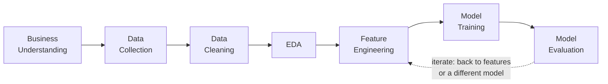

**Business understanding** — what question are you actually answering, and what does "good enough"
look like. **Data collection** — get the historical `(X, y)` pairs. **Cleaning** — throw out or fix
the rows that would poison the fit. **EDA** (exploratory data analysis) — look at the data before
you model it, the way you'd read logs before debugging. **Feature engineering** — turn raw columns
into ones a model can actually use. **Model training** — fit the formula. **Model evaluation** —
find out, honestly, whether it works. Then, usually, you loop back and try again with a better
feature or a different model family. This chapter's six numbered sections below map onto that same
loop — Section 1 sets up the vocabulary that spans every box, Sections 2–6 walk the boxes roughly
left to right.

And here's the same loop compressed into one more picture — not the *process* this time, but how
the *ideas* in this chapter relate to each other, which is the shape the rest of the chapter
follows:

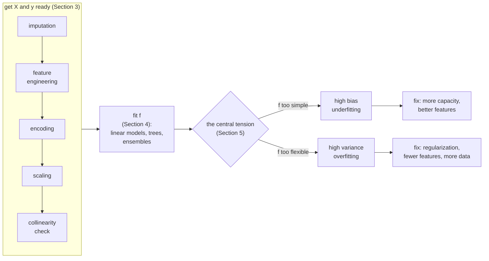

## 1. The shape of a supervised-learning problem

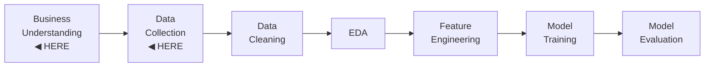

Every chapter from here on is some variation of the same setup, so it's worth naming precisely
once — this is the vocabulary that spans the entire map above, not just its first two boxes:

- **`X`** — the **features** (also called predictors, independent variables, or the *design
  matrix*). Think of `X` as a table: one row per example (a passenger, a taxi trip, a patient),
  one column per measured attribute. In pandas/NumPy terms this is a DataFrame or 2D array — a
  columnar, vectorised collection, closer to "a stream over primitive arrays where the loop runs
  in C" than to a Java `List<Map<String, Object>>`.
- **`y`** — the **target** (also called the label, or the dependent variable) — the thing you're
  trying to predict. A single column: a price, a class, a count.
- **Supervised learning** means you have both `X` *and* `y` for a set of historical examples —
  you know the "right answer" while you fit the model, the same way a test case gives you the
  expected output before you write the function it's checking. The model's job is to learn a
  function `f` such that `f(X) ≈ y` on data it has seen, in a way that also holds on data it
  hasn't.
- **Train vs. serve** is a build/runtime split, not a data split (that's the next chapter's
  subject): **training** is the offline step where you fit `f` against historical `(X, y)` pairs
  — closer to compiling and optimizing an artifact than to running it. **Serving** is calling
  `f(X_new)` in production, where you have `X_new` but not the true `y` yet — that's what you're
  trying to find out.
- **Generalisation** is the property that actually matters: does `f` work on `X` it never saw
  during training? A model that only reproduces its training data is as useless as a service that
  only passes the unit tests it was written against and falls over on real traffic.

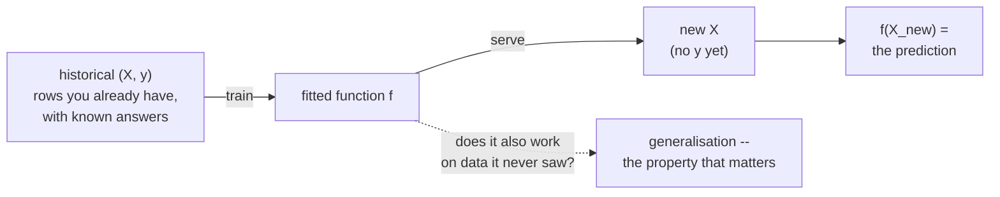

**Why it matters:** every other concept in this chapter is either a way to prepare `X` and `y`
better, a way to fit `f`, or a way to honestly measure whether `f` generalises. Losing sight of
that shape is the fastest way to get lost in a worked example's code.

**Forward link:** [Train / Validation / Holdout — Why We Split, and Data
Leakage](../03-worked-examples/04-train-valid-holdout-split.md) turns "generalisation" into a concrete
discipline: how to measure it honestly, and the ways that discipline breaks.

## 2. Statistics foundations

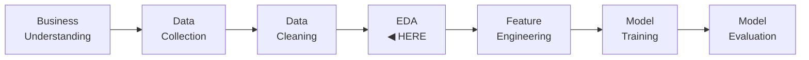

Before you ever fit a model, someone always asks a version of "is this real, or am I imagining a
pattern in noise?" — the same instinct as not trusting a single flaky-looking test failure until
you've re-run it enough times to rule out randomness. That instinct has a formal name and a small
toolkit:

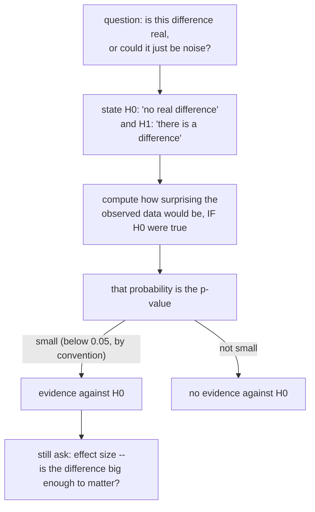

- **Hypothesis testing** — state a **null hypothesis** (`H0`, usually "there is no real
  difference/effect") and an **alternative** (`H1`, "there is"), then compute how surprising your
  observed data would be *if `H0` were actually true*. *Why it matters:* it's the disciplined
  version of "does this feature actually separate the classes" or "does this dataset actually have
  a skew worth handling," instead of eyeballing a chart and guessing.
- **p-value** — the probability of seeing data at least this extreme *if `H0` were true*. A small
  p-value (conventionally below 0.05, though that threshold is a convention, not a law of nature)
  is evidence against `H0`. **Common misread, worth fixing now:** the p-value is *not* "the
  probability `H0` is true" — it's a statement about the data, conditioned on `H0`, not a
  statement about `H0` itself. *Why it matters:* getting this backwards is the single most common
  statistics mistake in industry write-ups, and it directly overstates how sure you should be.
- **Effect size** — *how big* the difference actually is, independent of sample size. A p-value
  answers "is this real?"; effect size answers "does it matter?" With enough data, even a
  practically meaningless difference can produce a tiny p-value — statistical significance is not
  the same thing as practical significance, the same way a benchmark showing a statistically
  significant 0.001ms latency improvement doesn't mean you should ship it. *Why it matters:* a
  p-value alone can talk you into shipping a change that isn't worth the code-review time.

**Forward link:** [Hypothesis Testing &
EDA](../03-worked-examples/01-hypothesis-testing-and-eda.md) runs a real t-test and chi-square test,
with p-values and effect sizes computed on an actual dataset.

## 3. Data preparation

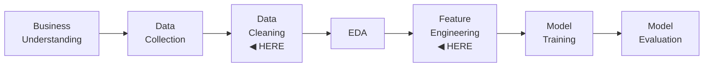

Getting `X` into a shape a model can actually learn from is most of the real work in a data
science project — the pipeline below is the order these five ideas usually get applied in:

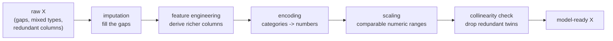

- **Imputation** — filling in missing values. Real data has holes: a sensor didn't report a
  reading, a form field was left blank. Unlike a Java `Optional<T>` that lets downstream code
  gracefully branch on absence, most ML estimators either throw on a `NaN` or silently produce
  garbage. Strategies range from simple (fill with the column mean/median/most-frequent value) to
  smarter (K-nearest-neighbours imputation, model-based imputation) to "don't just fill it, also
  *flag* it" (an indicator column recording *that* a value was missing — sometimes the missingness
  itself is signal). *Why it matters:* an estimator that throws on the first `NaN` takes your whole
  pipeline down with it — imputation is the difference between a pipeline that runs and one that
  doesn't.
  **Forward link:** [Imputation](../03-worked-examples/02-imputation.md).
- **Feature engineering** — deriving new columns from raw ones so the pattern is easier for a
  model to find. Think of it as a service layer that transforms a raw request DTO into a richer
  domain object before your business logic runs: raw GPS coordinates alone tell a linear model
  little, but engineering them into a distance and a congestion-zone bucket hands the model
  signal it can actually use. *Why it matters:* it's usually the single highest-leverage step in
  the whole pipeline — a better feature can beat a fancier model outright.
  **Forward link:** [Regression — NYC Taxi Fare
  Prediction](../03-worked-examples/05-regression-nyc-taxi.md).
- **Encoding** — turning categorical columns into numbers a model can consume. **One-hot
  encoding** creates one binary column per category — the safe default for *nominal* (unordered)
  categories like a payment method, at the cost of extra columns. **Ordinal encoding** maps each
  category to a single integer that preserves order — compact, and correct for a truly *ordered*
  category (`low` < `medium` < `high`), but silently invents a false ordering if you apply it to a
  nominal one (there's no meaningful sense in which `red < green < blue`). *Why it matters:*
  picking the wrong one doesn't crash anything — it just quietly teaches the model a relationship
  that isn't real.
  **Forward link:** [Regression — NYC Taxi Fare
  Prediction](../03-worked-examples/05-regression-nyc-taxi.md).
- **Feature scaling** — putting numeric columns on comparable ranges. `StandardScaler`
  standardises each column to mean 0, standard deviation 1; `MinMaxScaler` rescales into a fixed
  range like `[0, 1]`. This matters for models that measure distance or use gradient-based
  optimisation (KNN, linear/logistic regression, neural nets) — a column measured in thousands
  will dominate one measured in single digits purely by coincidence of units. Tree-based models
  (decision trees, Random Forest, gradient boosting) are scale-**invariant**: they split on a
  per-feature threshold, and any monotonic rescaling of a column leaves the resulting tree
  unchanged. *Why it matters:* skip it where it's needed and a column's *units*, not its
  *signal*, end up deciding how much weight it gets.
  **Forward link:** [Regression — NYC Taxi Fare
  Prediction](../03-worked-examples/05-regression-nyc-taxi.md).
- **Collinearity** — when two or more features carry almost the same information (highly
  correlated with each other, not just with the target). `X` is your table of independent
  variables/features; `y` is the label — worth anchoring that vocabulary here before it's used
  everywhere. Collinearity doesn't usually hurt a tree ensemble's raw predictive accuracy, but it
  makes a linear model's coefficients unstable and hard to interpret (small changes in the data
  can flip which of two correlated features "gets credit" for an effect), and it undermines clean
  feature selection. Diagnosed with a correlation heatmap (pairwise) and **VIF** (Variance
  Inflation Factor, which catches multi-feature collinearity a pairwise heatmap can miss). *Why it
  matters:* it's the reason "which feature mattered" can flip between two runs of the exact same
  model on the exact same data, just from a random seed change.
  **Forward link:** [Collinearity](../03-worked-examples/03-collinearity.md).

## 4. Models — regression, classification, and ensembles

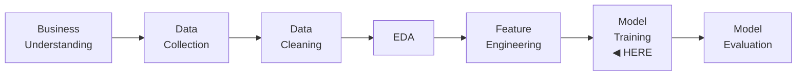

Two questions decide which model family you reach for: what shape is `y`, and how flexible does
`f` need to be?

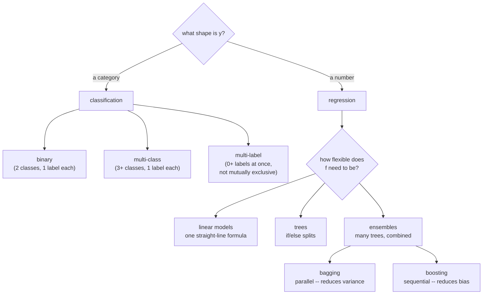

- **Regression vs. classification** — same supervised-learning machinery, different shape of
  `y`. **Regression** predicts a continuous number (a fare in dollars, a temperature).
  **Classification** predicts a discrete category. Different `y` types need different metrics —
  RMSE doesn't make sense for a category, and accuracy doesn't make sense for a price. *Why it
  matters:* picking a regression metric for a classifier (or vice versa) produces a number that
  compiles fine and means nothing.
  - **Binary classification** — exactly two mutually exclusive classes (e.g. survived / did not).
    **Forward link:** [Classification — Titanic](../03-worked-examples/06-classification-titanic.md).
  - **Multi-class classification** — more than two mutually exclusive classes; each example gets
    exactly one label.
  - **Multi-label classification** — each example can carry zero, one, or several labels
    *simultaneously* (they're not mutually exclusive) — tagging an article with several topics at
    once, rather than sorting it into one bucket.
    **Forward link (both):**
    [Multi-class & Multi-label Classification](../03-worked-examples/07-multiclass-multilabel.md).
- **Linear models** — fit a straight-line (or hyperplane) relationship between `X` and `y`:
  `LinearRegression` for regression, `LogisticRegression` for classification (its name is
  historical — despite "Regression," it's a classifier). Fast to fit, and the coefficients are
  directly interpretable ("a one-unit increase in this feature moves the prediction by this
  much") — but they only capture linear relationships unless you engineer non-linear features
  in first. *Why it matters:* it's usually the cheapest model to try first, and when the truth
  really is close to linear, nothing else beats it (a real example of exactly this shows up in
  the taxi chapter linked below).
- **Trees** — split the feature space with a sequence of `if/else` decisions on individual
  features, exactly like a chain of if-statements. Trees capture non-linear relationships and
  feature interactions natively, need no scaling, and are easy to reason about one split at a
  time — but a single tree overfits easily (Section 5), which is why in practice you rarely use
  just one. *Why it matters:* it's the model family that needs the least data preparation, which
  makes it a good first non-linear baseline.
- **Ensembles — bagging vs. boosting.** An ensemble combines many models into one prediction.
  The two dominant strategies solve *different* halves of the error budget (Section 5 defines
  bias and variance precisely; the short version here is enough to place them on the map):

  | | **Bagging** (Bootstrap **Agg**regat**ing**) | **Boosting** |
  |---|---|---|
  | How the models are trained | **Independently, in parallel** — each on its own random bootstrap sample (a sample drawn *with replacement* from the training data) | **Sequentially** — each new model specifically targets the errors the ensemble has made so far |
  | Combined by | Averaging (regression) or voting (classification) | Weighted sum, built up additively |
  | Primarily reduces | **Variance** — averaging cancels out each individual model's idiosyncratic overfitting | **Bias** — each stage explicitly corrects what previous stages got wrong |
  | Base learner | Strong, high-variance learners (e.g. full-depth decision trees) | Weak learners (e.g. shallow trees / "stumps") |
  | Classic example | Random Forest | Gradient Boosting / `HistGradientBoostingRegressor` |
  | Java-shaped analogy | Running the same flaky test suite against several random subsets of your fixtures and averaging the pass rate — smooths out any one subset's idiosyncrasies | A series of code-review passes, each one specifically targeting the bugs the *previous* pass missed, instead of re-reviewing everything from scratch |

  *(Definitions and the bias/variance attribution grounded in
  [research/NOTE-14-ds-theory-definitions.md](../../research/NOTE-14-ds-theory-definitions.md),
  checked 2026-09-02.)* Boosting is often the stronger performer on tabular data precisely because
  it directly attacks bias, but it's sequential (harder to parallelise), more sensitive to
  hyperparameters, and can overfit if left unconstrained; bagging is cheaper, easier to
  parallelise, and more robust out of the box, at the cost of not doing much for bias. *Why it
  matters:* "which ensemble should I reach for" has a real, data-dependent answer, and the taxi
  chapter below shows the two neck-and-neck on real numbers rather than asserting a winner.
  **Forward link:** [Regression — NYC Taxi Fare
  Prediction](../03-worked-examples/05-regression-nyc-taxi.md) compares a Random Forest against
  `HistGradientBoostingRegressor` head-to-head and explains *why* boosting tends to win there;
  [Class Imbalance](../03-worked-examples/08-class-imbalance.md) uses a voting ensemble to predict a
  minority class.

The table above says *what* each strategy does. Watch *how* — on numbers small enough to check by
hand — before Section 5 formalises the bias/variance vocabulary both of them are built around.

#### Bagging, step by step

**Step 1 — draw N bootstrap samples, with replacement.** Start from one small training set of 8
rows (labelled 1–8). "With replacement" means each draw is independent — the same row can be picked
twice, and some rows won't be picked at all:

| Bootstrap sample | Rows drawn | Rows missing |
|---|---|---|
| Sample A | 1, 1, 3, 4, 4, 6, 7, 8 | 2, 5 |
| Sample B | 2, 2, 3, 3, 5, 6, 7, 8 | 1, 4 |
| Sample C | 1, 2, 4, 5, 5, 6, 8, 8 | 3, 7 |

Each sample is still 8 rows — same size as the original, just a different resample. *Why it
matters:* the chance a specific row is never drawn across 8 draws-with-replacement is
$(1-\tfrac{1}{8})^8 \approx 0.343$ — roughly a third of rows are missing from any one bootstrap
sample, which is exactly what forces the three trees below to disagree with each other even though
they're all trained on overlapping data.

**Step 2 — fit one model per sample, independently, in parallel.** Nothing about fitting tree A
depends on tree B or tree C — they could run on three separate threads, or three separate machines,
with zero coordination between them.

**Step 3 — combine by averaging (regression) or majority vote (classification).**

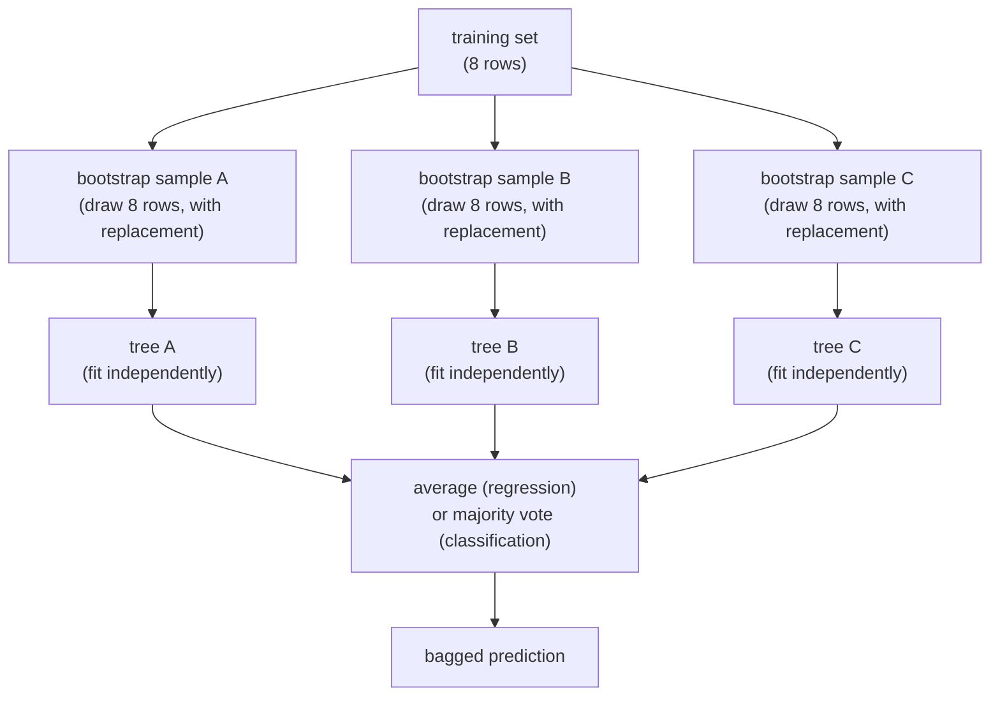

Now the payoff, with real numbers. Say the true value for one test point is `y = 10`. Because each
tree saw a different resample, each makes a different, largely independent error:

| Model | Prediction | Error |
|---|---|---|
| Tree A | 11 | +1 |
| Tree B | 8 | -2 |
| Tree C | 12 | +2 |
| **Average** | **(11 + 8 + 12) / 3 = 10.33** | **+0.33** |

No single tree was close to right, but the average's error (+0.33) is smaller than every individual
tree's error. That's the same **variance** Section 5.2 defines — how much the individual predictions
disagree with each other (11, 8, 12: a spread of 4) — being tamed by averaging instead of by
switching to a less flexible model. Independent mistakes partly cancel when you average them; a
*shared* mistake (all three trees trained on the same biased sample) would not have cancelled at
all. This is exactly the mechanism behind the DS-8 result: `BalancedBaggingClassifier`
([Class Imbalance](../03-worked-examples/08-class-imbalance.md)) fixed a single noisy undersample
(PR-AUC had crashed to 0.16) by running that same undersample-and-fit step 25 independent times and
averaging the results — one unlucky draw stops dominating the answer.

#### Boosting, step by step

Boosting's loop is sequential, not parallel — each stage depends directly on the output of the one
before it. Trace three rounds of AdaBoost (the original reweighting scheme) on 5 points, `P1`–`P5`,
with true labels `y = [+1, +1, -1, -1, +1]`.

```mermaid
flowchart LR
    TRAIN["5 points<br/>(equal weights, 1/5 each)"] --> H1["stump 1<br/>(fit on current weights)"]
    H1 --> ERR1["score its errors<br/>(weighted error)"]
    ERR1 --> RW1["reweight:<br/>wrong points heavier,<br/>right points lighter"]
    RW1 --> H2["stump 2<br/>(fit on reweighted data)"]
    H2 --> ERR2["score its errors<br/>(weighted error)"]
    ERR2 --> RW2["reweight again"]
    RW2 --> H3["stump 3<br/>(fit on reweighted data)"]
    H3 --> COMBINE["weighted vote:<br/>a1*h1 + a2*h2 + a3*h3"]
    COMBINE --> OUT["boosted prediction"]
```

**Step 1 — fit a weak stump, find what it got wrong.** Every point starts with equal weight
$w_i = 1/5 = 0.2$. Stump 1 predicts `h1 = [+1, +1, +1, -1, +1]` — wrong only on `P3`. Its
*weighted* error is the total weight of the points it got wrong: $\varepsilon_1 = w_3 = 0.2$.

**Step 2 — turn that error into a vote weight, and reweight the points.** AdaBoost's original
weight-update rule [source: Wikipedia — AdaBoost](https://en.wikipedia.org/wiki/AdaBoost) (checked
2026-09-03):

$$\alpha_m = \tfrac{1}{2}\ln\!\left(\dfrac{1-\varepsilon_m}{\varepsilon_m}\right), \qquad
w_i \leftarrow w_i \cdot e^{-\alpha_m y_i h_m(x_i)} \text{, then renormalise so the weights sum to } 1$$

In plain language: $\alpha_m$ ("how much this stump's vote counts") grows as its error shrinks; the
update multiplies a *correctly* classified point's weight by $e^{-\alpha_m}$ (shrink it) and a
*misclassified* point's weight by $e^{+\alpha_m}$ (grow it). For round 1: $\alpha_1 =
\tfrac{1}{2}\ln(4) \approx 0.693$. Applying the update and renormalising:

| Point | Weight before round 1 | Weight after round 1 |
|---|---|---|
| P1, P2, P4, P5 (correct) | 0.200 each | 0.125 each |
| P3 (wrong) | 0.200 | **0.500** |

One misclassified point now carries as much weight as the other four combined — the next stump is
forced to pay attention to it.

**Step 3 — fit the next stump on the reweighted data, repeat.** Stump 2 (`h2 = [-1, +1, -1, -1,
+1]`) is fit on those new weights; it fixes `P3` but misses `P1` (weight 0.125), so
$\varepsilon_2 = 0.125$ and $\alpha_2 = \tfrac{1}{2}\ln(7) \approx 0.973$. Reweighting again pushes
`P1` up to 0.500. Stump 3 (`h3 = [+1, -1, -1, -1, +1]`) is fit on *that*; it fixes `P1` but misses
`P2` (weight $1/14 \approx 0.071$), so $\varepsilon_3 \approx 0.071$ and $\alpha_3 =
\tfrac{1}{2}\ln(13) \approx 1.282$.

**Step 4 — combine by a weighted vote, not a simple average.** The final prediction is
$\mathrm{sign}(\alpha_1 h_1(x) + \alpha_2 h_2(x) + \alpha_3 h_3(x))$. Watch the *combined* training
error move as each stage is added:

| Stages combined | Combined vote gets wrong | Training error |
|---|---|---|
| just `h1` | P3 | 20% |
| `h1` + `h2` (weighted by α1, α2) | P1 | 20% |
| `h1` + `h2` + `h3` (weighted by α1, α2, α3) | *none* | **0%** |

Check the last row by hand for `P1`: $0.693(+1) + 0.973(-1) + 1.282(+1) = 1.002 \to \text{sign} =
+1$, matching its true label `+1`. Notice the raw training error didn't fall on *every* round — it's
still 20% after round 2, just a *different* point wrong — what's shrinking every round is each
stump's own weighted error ($\varepsilon$: 0.200 → 0.125 → 0.071), which is what eventually drags
the combined vote to zero. That's boosting's "iterate toward perfection" loop, made concrete.

**The other flavour — gradient boosting fits the residual instead of reweighting.** Rather than
reweighting points, gradient boosting fits each new stump directly to the ensemble's *current
errors* — "the estimator $h_m$ is fitted to predict the negative gradients of the samples" [source:
scikit-learn User Guide — Gradient Boosting](https://scikit-learn.org/stable/modules/ensemble.html)
(checked 2026-09-03), and for squared-error loss the negative gradient is exactly the residual
$y_i - F_{m-1}(x_i)$. Four points, `y = [4, 7, 9, 12]`, starting from the flat baseline
$F_0 = \bar y = 8$:

| Point | y | $F_0$ | residual $r_0 = y - F_0$ |
|---|---|---|---|
| 1 | 4 | 8 | -4 |
| 2 | 7 | 8 | -1 |
| 3 | 9 | 8 | +1 |
| 4 | 12 | 8 | +4 |

A stump splits these residuals into two groups and predicts each group's mean:
`h1 = [-2.5, -2.5, +2.5, +2.5]`. Add it straight in ($F_1 = F_0 + h_1$): $F_1 = [5.5, 5.5, 10.5,
10.5]$, new residuals $r_1 = [-1.5, +1.5, -1.5, +1.5]$. The sum of squared errors — "how wrong the
model is, in total" — drops from $\sum r_0^2 = 16+1+1+16=34$ to $\sum r_1^2 = 1.5^2 \times 4 = 9$
after a *single* stump; fitting the next stump on `r1` shrinks it again. Same "iterate toward the
answer" pattern as AdaBoost, just a different correction (fit the residual, instead of reweighting
and voting).

#### One glance: parallel + vote vs. sequential + correct

| | Bagging | Boosting |
|---|---|---|
| Shape | fans out — every tree trained at once, independently | chains — every stump trained after seeing the last one's mistakes |
| Fixes | **variance** (independent errors partly cancel on average) | **bias** (each stage directly corrects what's still wrong) |
| What you just watched | 3 trees, each off by a different amount, average closer than any one of them alone | training error 20% → 20% → 0% as weighted stumps stack up |

Same taxonomy the table above already drew — now with the gears turning.

## 5. The central tension — overfitting, bias–variance, and regularization

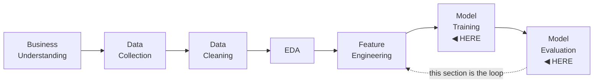

Every model-fitting decision above is ultimately in service of one trade-off. This section is the
one place in the chapter with real code and real plots, because this idea is much easier to *see*
than to be told about.

### 5.1 Overfitting and underfitting — watch it fail first

Picture the naive move: pick the most flexible model you can and let it fit the training data as
closely as possible. Surely more flexibility can only help? Run that experiment for real, on a
1-D curve with a *known* answer, and watch it go wrong.

**Overfitting** is what happens when a model memorises the noise and idiosyncrasies of its
*specific* training set instead of learning the pattern that generalises — training error keeps
falling while validation error stalls, then gets *worse*. **Underfitting** is the opposite failure:
the model is too simple to capture the real pattern, and both training and validation error stay
high. The tell for each is the same shape you'd use to diagnose a build that passes locally but
fails in CI: compare performance on data the model trained on versus data it didn't.

The script that generated this chapter's plots
([`code/bias_variance_overfitting.py`](code/bias_variance_overfitting.py)) builds a small
synthetic 1-D regression problem with a *known* true function — a sine wave — specifically so
"how wrong is the model" can be measured against ground truth instead of eyeballed:

```python
import numpy as np


def true_function(x: np.ndarray) -> np.ndarray:
    """The ground-truth signal the models are trying to recover -- unknown to the
    models, known to us so we can measure error directly."""
    return np.sin(1.5 * np.pi * x)


def make_dataset(n: int, seed: int) -> tuple[np.ndarray, np.ndarray]:
    """Draw n points x ~ Uniform(0, 1), y = true_function(x) + Gaussian noise."""
    rng = np.random.default_rng(seed)
    x = np.sort(rng.uniform(0, 1, size=n))
    y = true_function(x) + rng.normal(scale=0.3, size=n)
    return x, y
```

It then sweeps **model complexity** — the degree of a polynomial fit through
`PolynomialFeatures` + `LinearRegression` in a `Pipeline` — from 1 (a straight line) to 15 (a
wildly flexible curve), fitting on a training split and scoring on both splits at every degree:

```python
from sklearn.linear_model import LinearRegression
from sklearn.metrics import root_mean_squared_error
from sklearn.model_selection import train_test_split
from sklearn.pipeline import Pipeline
from sklearn.preprocessing import PolynomialFeatures

x, y = make_dataset(n=120, seed=42)
x_train, x_val, y_train, y_val = train_test_split(x, y, test_size=0.3, random_state=42)

degrees = list(range(1, 16))
train_rmse, val_rmse = [], []
for degree in degrees:
    model = Pipeline([
        ("poly", PolynomialFeatures(degree=degree, include_bias=False)),
        ("linreg", LinearRegression()),
    ])
    model.fit(x_train.reshape(-1, 1), y_train)
    train_rmse.append(root_mean_squared_error(y_train, model.predict(x_train.reshape(-1, 1))))
    val_rmse.append(root_mean_squared_error(y_val, model.predict(x_val.reshape(-1, 1))))
```

`Pipeline`, `train_test_split`, and `root_mean_squared_error` are all tabulated in
[research/NOTE-5-sklearn-core-apis.md](../../research/NOTE-5-sklearn-core-apis.md) (checked
2026-09-02) — note in particular that `root_mean_squared_error` is the canonical RMSE function
since scikit-learn 1.4, and the older `mean_squared_error(..., squared=False)` pattern no longer
works on the pinned 1.9.0. `PolynomialFeatures` itself isn't one of NOTE-5's tabulated APIs; its
signature (`degree=2, *, interaction_only=False, include_bias=True, order='C'`) was verified
directly against this project's installed scikit-learn 1.9.0 via
`inspect.signature(PolynomialFeatures.__init__)` and cross-checked against the [official
docs](https://scikit-learn.org/stable/modules/generated/sklearn.preprocessing.PolynomialFeatures.html)
(checked 2026-09-02).


Reading it left to right: at degree 1 (a straight line trying to fit a sine wave) both errors are
high — **underfitting**. By degree 3–4 both have dropped and roughly agree — the model has enough
flexibility to capture the real curve without chasing noise. Past that point training error keeps
inching down (the model can always fit its *own* training points better by adding flexibility) while
validation error flattens and then creeps back up — the model is starting to fit noise specific to
the training split, i.e. **overfitting**. The gap that opens up between the two lines past the
minimum *is* overfitting, made visible.

### 5.2 The bias–variance decomposition

Formally, a model's expected prediction error decomposes into three parts
([research/NOTE-14-ds-theory-definitions.md](../../research/NOTE-14-ds-theory-definitions.md),
checked 2026-09-02):

$$E[\text{error}] = \text{Bias}^2 + \text{Variance} + \text{Irreducible error}$$

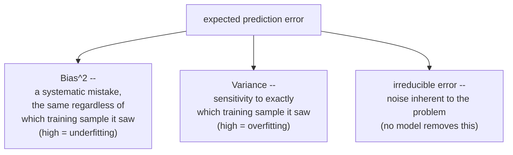

- **Bias** — "the model's average systematic miss." Error from a model too simple to
  represent the true relationship: it makes the same kind of systematic mistake regardless of
  which training sample it saw. High bias = underfitting.
- **Variance** — error from a model too sensitive to exactly which training sample it happened to
  see: retrain it on a slightly different sample and its predictions swing. High variance =
  overfitting.
- **Irreducible error** — noise inherent to the problem itself (measurement error, genuine
  randomness). No model, however good, removes this term.

The **bias–variance trade-off**
([research/NOTE-14-ds-theory-definitions.md](../../research/NOTE-14-ds-theory-definitions.md)):
simple, low-capacity models tend toward high bias and low variance; flexible, high-capacity models
tend toward low bias and high variance. Reducing one typically increases the other, so the goal
isn't to eliminate either — it's to find the complexity that minimises their *sum*. That's exactly
what the minimum of the overfitting curve above is pointing at.

To make bias and variance visible as two *separate* quantities rather than one combined error
number, [`code/bias_variance_overfitting.py`](code/bias_variance_overfitting.py) draws 25
**bootstrap resamples** (random samples drawn *with replacement* from the same 30-point training
set — the same resampling mechanism bagging uses in Section 4) and fits both a low-complexity
model (degree 1) and a high-complexity model (degree 15) to each resample:

```python
import numpy as np

rng = np.random.default_rng(42)
x_base, y_base = make_dataset(n=30, seed=42)
x_grid = np.linspace(0, 1, 200).reshape(-1, 1)

n_bootstraps = 25
preds = np.zeros((n_bootstraps, x_grid.shape[0]))
for b in range(n_bootstraps):
    idx = rng.integers(0, len(x_base), size=len(x_base))  # bootstrap resample
    x_b, y_b = x_base[idx], y_base[idx]
    # fit a model of the chosen degree to (x_b, y_b), predict on x_grid, store in preds[b]

mean_pred = preds.mean(axis=0)
bias_sq = float(np.mean((mean_pred - true_function(x_grid.ravel())) ** 2))
variance = float(np.mean(preds.var(axis=0)))
```

`bias_sq` measures how far the *average* prediction (across all 25 resamples) sits from the true
function; `variance` measures how much the 25 individual predictions disagree with *each other*.


Read the two panels side by side. On the **left** (degree 1), the 25 thin blue lines are almost
indistinguishable from each other — different training samples barely change the fit at all
(**variance = 0.015**) — but every one of them is the wrong *shape* for a sine wave, so even their
average (dashed red) sits visibly off the true curve (**bias² = 0.187**). On the **right** (degree
15), the fits track the true curve closely through the *middle* of the range but swing violently
near the edges, where a high-degree polynomial has the least data to constrain it — a small change
in which 30 points got resampled produces a completely different curve out there. That disagreement
is **variance = 0.528**, roughly 35× higher than the simple model's.

**Worth being honest about a wrinkle in these exact numbers:** bias² for the degree-15 model
(0.228) came out slightly *higher*, not lower, than the degree-1 model's (0.187) — which looks odd
if you expected "more flexible = strictly less biased." What's happening is that those wild
boundary swings pull the *average* of the 25 curves away from the truth too, not just the
individual curves — so on this small, 30-point sample, the extra flexibility isn't paying for
itself even on average. That's not a contradiction of the theory; it's the theory working exactly
as advertised: a high-capacity model trained on too little data doesn't reliably buy you lower
bias, it mostly buys you variance. The reliable, always-true signature of overfitting in this
picture is the variance explosion (the spread of thin lines), not any particular bias number — and
that's the number to watch when you're diagnosing a real model.

### 5.3 Regularization — fighting variance directly

**Regularization** fights high variance in a linear model by penalising large coefficients,
shrinking the model's effective capacity without changing which features it's allowed to look at
([research/NOTE-14-ds-theory-definitions.md](../../research/NOTE-14-ds-theory-definitions.md),
checked 2026-09-02):

- **L2 regularization (Ridge)** adds a penalty proportional to the *sum of squared* coefficients:

  $$\lambda \sum_i w_i^2$$

  This shrinks every coefficient toward zero **proportionally**, but rarely all the way to exactly
  zero. Good default when you believe most features carry some real signal, or when features are
  collinear (Section 3) — it spreads the "credit" across correlated features instead of
  arbitrarily picking one.
- **L1 regularization (Lasso)** adds a penalty proportional to the *sum of absolute* coefficients:

  $$\lambda \sum_i |w_i|$$

  Because that penalty has a sharp "corner" at zero (piecewise-linear, not smooth,
  unlike L2's smooth bowl), it can drive coefficients to **exactly zero** once $\lambda$ is large
  enough — L1 doesn't just shrink, it performs implicit feature selection.
- **$\lambda$** (often called `alpha` in scikit-learn, "how hard to squeeze") controls the strength
  of either penalty: $\lambda = 0$ recovers plain, unregularized linear regression; as
  $\lambda \to \infty$, every coefficient is pushed to zero. The right value is data-dependent and
  is tuned via cross-validation, not guessed.

**Why fewer features help:** fewer non-zero coefficients means lower model capacity, which means
fewer ways to fit noise — directly trading a little bias for a lot less variance, the same
trade-off the overfitting curve above visualises for polynomial degree instead of feature count.
This is exactly why collinearity (Section 3) and feature selection (Section 6) both matter: a
model with 200 mostly-redundant features has far more room to overfit than one with the 15 that
actually carry signal.

**Forward link:** [Feature Selection](../03-worked-examples/10-feature-selection.md) uses Lasso's
zeroing behaviour directly as a feature-selection tool; [Regression — NYC Taxi Fare
Prediction](../03-worked-examples/05-regression-nyc-taxi.md) fits Ridge/Lasso alongside plain
`LinearRegression` on real data.

## 6. Beyond the basics

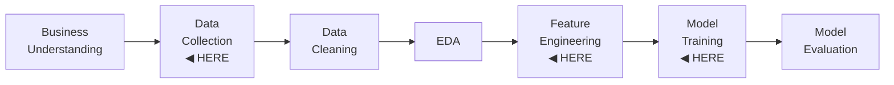

Four extensions that don't fit neatly into one box on the spine above — each solves a real problem
the earlier sections quietly assumed away:

- **Class imbalance** — one class vastly outnumbers another (fraud detection: legitimate
  transactions might outnumber fraud 999-to-1). **Why it matters:** accuracy becomes actively
  misleading — a model that always predicts "not fraud" scores 99.9% accuracy while catching zero
  fraud — so imbalanced problems need different metrics (precision, recall, F1, PR-AUC) and often
  different training strategies.
- **Undersampling** — one such strategy: drop rows from the majority class until the training
  distribution is closer to balanced. Cheap and simple, at the cost of throwing away data you
  might otherwise have used.
  **Forward link (both):** [Class Imbalance](../03-worked-examples/08-class-imbalance.md).
- **Forecasting** — predicting a time-ordered future value from its own (or a related signal's)
  history. It looks like regression, but rows are **not independent**: you cannot randomly
  shuffle-split time-ordered data the way Section 1's train/validation/holdout discipline does for
  independent rows, because that would let the model "train" on the future and be "validated" on
  the past — a temporal cousin of the data-leakage bug the train/validation/holdout chapter covers
  in depth.
  **Forward link:** [Forecasting — Composite Synthetic
  Signals](../03-worked-examples/09-forecasting-composite-signals.md).
- **Feature selection** — choosing the *minimum* subset of features that keeps model quality,
  and dropping the rest. **Why it matters:** fewer features means lower variance (Section 5),
  faster training and serving, an easier story to tell a stakeholder or auditor, and fewer columns
  whose upstream schema can silently break something you actually depend on. Common approaches:
  the **elbow/knee method** (plot model performance against feature count, stop adding features
  once the curve flattens), **forward selection** (start with none, greedily add the
  single-best-improving feature each round), and **backward selection** (start with everything,
  greedily remove the least useful feature each round).
  **Forward link:** [Feature Selection](../03-worked-examples/10-feature-selection.md).
- **AutoML** — automating the search over models, hyperparameters, and sometimes features,
  instead of hand-tuning them. It trades compute for engineer time, but doesn't remove the human
  from the loop: something still has to define the target metric and the constraints, and sanity
  check the winning configuration — the same way a linter doesn't replace code review, it just
  changes what the reviewer needs to spend attention on.
  **Forward link:** [AutoML](../03-worked-examples/11-automl.md) *(planned chapter — the specific
  framework is still to be confirmed by the researcher against current, maintained options per
  `docs/curriculum.md`; this chapter only defines the concept and its trade-off)*.

## 7. Pitfalls — conceptual traps worth flagging before you meet them

- **p-value ≠ "probability `H0` is true."** It's a statement about how surprising the *data*
  would be if `H0` held — not a statement about `H0` itself (Section 2).
- **Judging "no collinearity" from single pairwise correlations.** Two features can each look
  weakly correlated with every other single feature while jointly being almost fully redundant —
  that's exactly what VIF is for (Section 3).
- **Treating one-hot and ordinal encoding as interchangeable.** Ordinal-encoding a nominal
  category (like a colour or a payment method) invents an ordering the model will treat as real
  (Section 3).
- **Scaling a tree-based model "just in case."** It's harmless but pointless — trees split on
  per-feature thresholds and are invariant to any monotonic rescaling (Section 3).
- **Reading a single bias or variance number in isolation.** As Section 5.2's own numbers show,
  bias can tick up rather than down when you add capacity on too little data — the reliable
  signature of overfitting is the *variance* term inflating, not any one bias figure moving in the
  "expected" direction.
- **Only ever checking training error.** By construction it can only look better as you add
  capacity — it cannot, on its own, tell you when you've crossed from fitting the pattern into
  fitting the noise. That's what a validation split is for (Section 1, and the next chapter).

## 8. Recap & what's next

The map, compressed to one pass — every box on the spine, checked off:

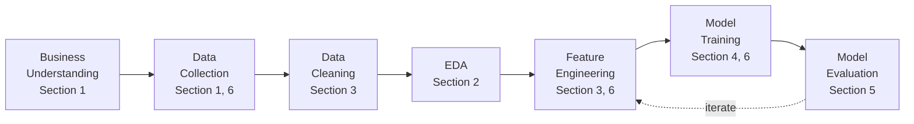

- **Section 1** named the pieces every chapter shares: `X`, `y`, train vs. serve, and the one
  property that actually matters — generalisation.
- **Section 2** covered the statistical tools for asking "is this real, and does it matter?"
  (hypothesis testing, p-values, effect size).
- **Section 3** covered getting `X` into shape: imputation, feature engineering, encoding,
  scaling, collinearity.
- **Section 4** covered fitting `f`: regression vs. classification (binary / multi-class /
  multi-label), linear models, trees, and the bagging-vs-boosting split among ensembles.
- **Section 5** — the one with code — covered the trade-off underneath all of it: overfitting,
  the bias–variance decomposition, and regularization (L1 vs. L2) as the direct lever for fighting
  variance in a linear model.
- **Section 6** covered the specialised extensions: class imbalance and undersampling,
  forecasting's temporal twist on splitting, feature selection, and AutoML.

Every concept above links forward to the chapter that runs it on real data. **Local Environment
Setup** comes next in the curriculum (getting Python, `pip`/venv, pandas, NumPy, Matplotlib, and
scikit-learn installed and verified); after that, the Worked Examples chapters pick up roughly in
the order this chapter introduced their concepts, starting with [Hypothesis Testing &
EDA](../03-worked-examples/01-hypothesis-testing-and-eda.md).

---

### Environment note (for the architect)

Code and artefacts in this chapter were generated and gated against this project's installed
`.venv`: **scikit-learn 1.9.0**, **numpy 2.5.2**, **matplotlib 3.11.1**, verified live against the
running interpreter (`import sklearn, numpy, matplotlib; print(...__version__)`) and cross-checked
against [research/NOTE-5-sklearn-core-apis.md](../../research/NOTE-5-sklearn-core-apis.md)
(checked 2026-09-02), which pins the same versions. `PolynomialFeatures` is not one of NOTE-5's
tabulated APIs; per the precedent set in
[train-valid-holdout-split.md](../03-worked-examples/04-train-valid-holdout-split.md)'s environment
note, its signature was instead verified directly against the installed interpreter via
`inspect.signature` and cross-checked against the official scikit-learn docs (both cited inline in
Section 5.1). All regularization, bias–variance, and bagging-vs-boosting definitions trace to
[research/NOTE-14-ds-theory-definitions.md](../../research/NOTE-14-ds-theory-definitions.md)
(checked 2026-09-02), per this chapter's spec. The Galton "regression" origin story in the cold
open is a new claim for this restyle, grounded inline against [Wikipedia, "Regression toward the
mean"](https://en.wikipedia.org/wiki/Regression_toward_the_mean) (checked 2026-09-03) rather than a
`research/NOTE-*.md`, following the same house-style precedent as the Ashenfelter wine citation in
[regression-nyc-taxi.md](../03-worked-examples/05-regression-nyc-taxi.md)'s cold open.
