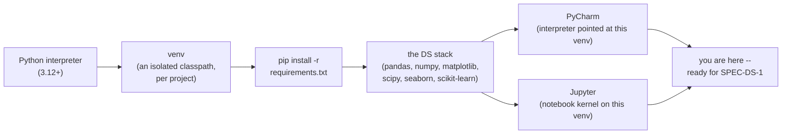
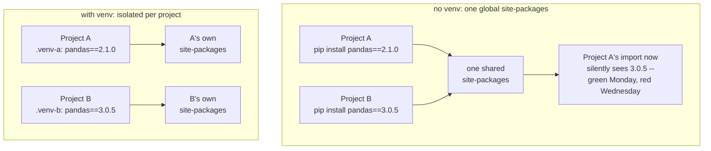
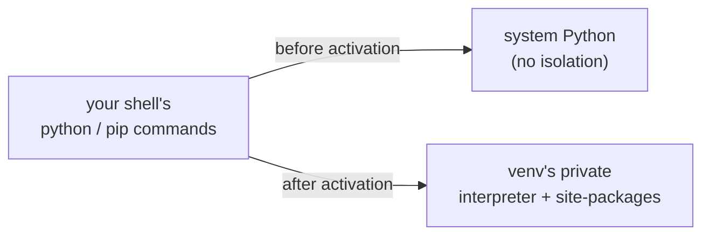
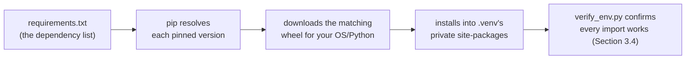
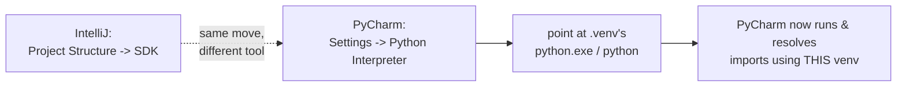
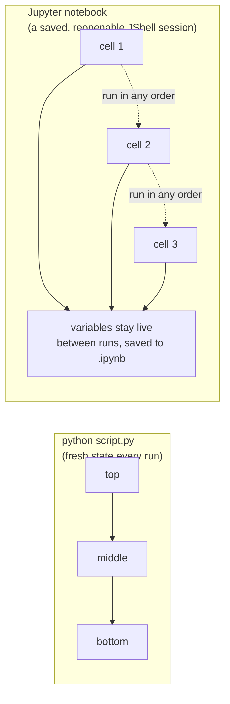
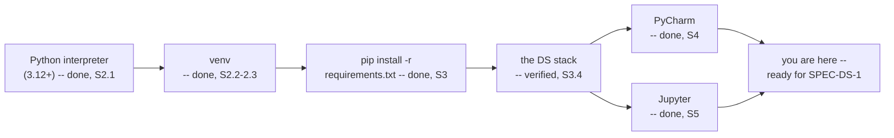

# Local Environment Setup (Data Science)

*Data Science · Local Environment Setup · SPEC-DS-0*

## The install that broke a working project two weeks later

You've felt this exact failure before, just wearing a Java costume: a build that worked yesterday
fails today with no code change, and someone eventually traces it to a dependency version that
quietly moved out from under the project. In Java, that's rare and usually a build-tool
misconfiguration — Maven and Gradle give every module its own resolved dependency tree by default,
so it takes real effort to let two projects fight over the same JAR.

Python does not give you that for free. Picture two projects on the same laptop: Project A was
built against `pandas==2.1.0`, Project B needs the newer `pandas==3.0.5` for a feature it relies
on. Install Python normally, `pip install` each project's dependencies the obvious way — no other
tool involved — and both commands write into the **same** global `site-packages` directory. The
second install wins. Project A's tests, which were green on Monday, start throwing
`AttributeError`s on Wednesday because a method it depended on changed shape between pandas 2.1
and 3.0 — and nobody touched Project A's code. That is the whole bug report: "it broke, and I
didn't change anything," which is the single most common environment failure a newcomer to Python
hits, and it is entirely avoidable.

Here's the one-sentence fix, the kind you could repeat at dinner: **give every project its own
private copy of "installed packages," the same way Java gives every module its own resolved
classpath, so installing something for one project can never break another.** That private copy is
called a **virtual environment**, or `venv`, and building one — plus the tools that fill it,
declare it, and point an IDE and a notebook at it — is this entire chapter.



That's the whole toolchain, left to right, and this chapter builds every box in it, in order. Every
chapter after this one assumes you already have a working Python data-science environment: an
interpreter, an isolated place for dependencies, a way to pin exactly what you installed, an IDE
that knows where to find all of it, and a notebook you can run cells in. This chapter builds that
environment once, explains every piece against the Java toolchain you already know, and ends with a
script that proves the whole stack is wired up correctly. Skip nothing here — a shaky environment
is the single most common reason a later chapter's code "doesn't work on my machine."

## 1. What & why — the Python toolchain vs. the Java one

You've built this exact toolchain before, just with different names on the pieces:

| Java / Maven concept | Python equivalent | What it does |
|---|---|---|
| the JDK | the Python interpreter | runs your code |
| a Maven/Gradle module's isolated dependency set | a **virtual environment** (`venv`) | isolates one project's installed packages from every other project and from the OS |
| `pom.xml` / `build.gradle` dependency block | `requirements.txt` | declares exactly what to install |
| `mvn install` / `gradle build` | `pip install -r requirements.txt` | resolves and downloads the declared dependencies |
| a pinned version (`<version>2.17.0</version>`) | `pandas==3.0.5` | reproducible builds — everyone installs the exact same thing |
| IntelliJ pointed at a module's JDK/SDK | PyCharm pointed at a venv's interpreter | the IDE has to be told which dependency set and which interpreter to use |
| a JShell session | a Jupyter notebook | an interactive, persistent-state REPL you can save and re-run |

The reason Python needs the middle two rows at all, when Java gets by with one global JDK install
plus per-project dependencies, comes down to one difference: **Python packages are installed
per-interpreter, globally, by default.** There is no built-in classpath-style isolation the way a
Maven module gets one automatically. If you `pip install` something without a virtual environment
active, it lands in one shared, global `site-packages` directory — every Python project on the
machine sees it, and any two projects that need different versions of the same package will fight
over it. A virtual environment exists purely to reintroduce the isolation Java gives you for free:
it is a private copy of `site-packages` plus a pointer back at a real interpreter, so
`pip install pandas==3.0.5` in one project's venv can coexist peacefully with
`pandas==2.1.0` in another's.

Here's the failure from the opening story and its fix, side by side:



Keep that "isolated classpath per project" framing in mind for the rest of this chapter — every
step below is either creating that isolation (venv), filling it declaratively (pip +
requirements.txt), or pointing a tool at it (PyCharm, Jupyter).

## 2. Install Python and create a virtual environment

### 2.1 Install Python

Install **Python 3.12 or newer**. The two DS libraries with the strictest requirement — NumPy and
SciPy — both require Python ≥3.12 as of their current stable releases
([NOTE-2-package-versions](../../research/NOTE-2-package-versions.md), verified against PyPI
2026-09-02); pandas and matplotlib will run on 3.11 too, but there is no reason to install an older
interpreter than the stack's own floor requires. Download an installer from
[python.org/downloads](https://www.python.org/downloads/) for your OS, or use your platform's
package manager (`brew install python@3.13` on macOS, your distro's package manager on Linux). This
project's own shared environment (used to write and run every example in this chapter) was created
with **Python 3.13.7**, read directly from its `pyvenv.cfg` — comfortably inside the ≥3.12
requirement.

### 2.2 Create the virtual environment

`venv` is part of the Python standard library — no separate install needed, the same way `javac`
ships with the JDK. From your project's root directory:

```bash
python -m venv .venv
```

This creates a `.venv` directory containing a private copy of the interpreter (or a link to one)
and an empty `site-packages` — your isolated classpath, currently empty, waiting for
`pip install`. The `python -m venv <path>` command and this behaviour are documented in the
standard library's own reference
([source: venv — Creation of virtual environments](https://docs.python.org/3/library/venv.html),
checked 2026-09-02).

### 2.3 Activate it

Activation is what points your shell's `python` and `pip` commands at the venv's private
interpreter instead of the system one — conceptually the same switch as `sdk use` in a Java
version manager, just scoped to one venv instead of one JDK:



The exact command depends on your shell, per the official Python documentation
([source: venv — Creation of virtual environments](https://docs.python.org/3/library/venv.html),
checked 2026-09-02):

| Platform | Shell | Activate with |
|---|---|---|
| Windows | Command Prompt (`cmd.exe`) | `.venv\Scripts\activate.bat` |
| Windows | PowerShell | `.venv\Scripts\Activate.ps1` |
| macOS / Linux | bash / zsh | `source .venv/bin/activate` |
| macOS / Linux | fish | `source .venv/bin/activate.fish` |
| macOS / Linux | csh / tcsh | `source .venv/bin/activate.csh` |

```bash
# Windows (PowerShell)
.venv\Scripts\Activate.ps1
# Windows (cmd.exe)
.venv\Scripts\activate.bat
# macOS / Linux (bash/zsh)
source .venv/bin/activate
```

On Windows, PowerShell may refuse to run `Activate.ps1` with an "execution of scripts is disabled
on this system" error — its default script-execution policy blocks unsigned scripts. Fix it once,
per user, with:

```powershell
Set-ExecutionPolicy -ExecutionPolicy RemoteSigned -Scope CurrentUser
```

([source: venv — Creation of virtual environments](https://docs.python.org/3/library/venv.html),
checked 2026-09-02.) You'll know activation worked because your shell prompt gains a `(.venv)`
prefix, and `python -c "import sys; print(sys.executable)"` prints a path *inside* `.venv/`, not
your system Python. Deactivate at any time with the `deactivate` command — no arguments, works
identically on every platform.

## 3. Install the stack from `requirements.txt`, then verify it

### 3.1 `requirements.txt` ≈ your dependency block

Where a Maven `pom.xml` lists `<dependency>` blocks with `<groupId>`/`<artifactId>`/`<version>`,
`requirements.txt` is a flat text file, one package per line:

```text
pandas==3.0.5
numpy==2.5.2
matplotlib==3.11.1
scipy==1.18.1
seaborn==0.13.2
scikit-learn==1.9.0
jupyter==1.1.1
```

Every version above was verified against PyPI on 2026-09-02: pandas, numpy, matplotlib, scipy, and
seaborn come from
[NOTE-2-package-versions](../../research/NOTE-2-package-versions.md); scikit-learn from
[NOTE-5-sklearn-core-apis](../../research/NOTE-5-sklearn-core-apis.md); jupyter's current release
was confirmed directly against its
[PyPI project page](https://pypi.org/project/jupyter/) (checked 2026-09-02) and cross-checked
against what actually installed into this chapter's own environment (Section 3.3).

With the venv **activated**, install everything in one command:

```bash
pip install -r requirements.txt
```

`pip` resolves each line, downloads the matching wheel for your OS/Python version, and installs it
into the venv's private `site-packages` — the same "resolve, download, install" shape as
`mvn install`, just without a central Maven repository's dependency-tree conflict resolution (pip's
resolver is simpler; large projects sometimes reach for a lockfile tool like `pip-tools` or
`poetry` for that reason — this course sticks with plain `pip` + `requirements.txt`, which is
enough for every chapter here).



### 3.2 What each library is for

| Library | What it's for | Nearest Java-world analogy |
|---|---|---|
| **pandas** | tabular data: load, filter, group, join CSV/DataFrame-shaped data | a typed, columnar `ResultSet` you can query in-memory |
| **numpy** | fast n-dimensional arrays and vectorised math | a `float[]`/`double[]` array library where the loops run in C, not a `Stream<Double>` |
| **matplotlib** | the base plotting library — every other Python plotting tool sits on top of it | JFreeChart, but the thing everything else wraps |
| **scipy** | statistics, optimisation, signal processing — the "scientific computing" layer above raw numpy | Apache Commons Math |
| **seaborn** | a higher-level, better-defaulted plotting API built on matplotlib | a nicer fluent-builder wrapper around JFreeChart |
| **scikit-learn** | the general-purpose ML library: models, preprocessing, train/test splitting, metrics | the "junit + a model zoo" of Python ML — one consistent `fit`/`predict` contract, used everywhere in this course |
| **jupyter** | the notebook environment (Section 5) | closest to a JShell session you can save, re-run, and mix with markdown notes |

### 3.3 Why pinning matters

`pandas==3.0.5` is not decoration — it is the difference between "reproducible" and "works today,
who knows tomorrow." Without a pin, `pip install pandas` grabs whatever is newest *on the day you
run it*; two developers running the same `requirements.txt` a month apart can end up on different
pandas versions, with different behaviour and possibly different bugs. That is exactly the failure
mode a Maven `<version>` tag prevents. Pin every version; when you deliberately want the latest,
bump the pin and test, rather than leaving it floating.

### 3.4 Verify: `verify_env.py`

One script, run once, confirms every library imports and reports the exact version installed:

```python
"""Verify the Data Science local environment.

Imports every library this course's Data Science chapters depend on and
prints its installed version, plus the Python interpreter version. A clean
run with no ImportError, and every line filled in, means the environment
this chapter just built is ready for every DS chapter after it.

`jupyter` is a metapackage (see the chapter, Section 5) -- it has no
`jupyter.__version__` attribute of its own, so its version is read via
`importlib.metadata`, the same way you'd read a declared version out of a
POM rather than off a compiled class. `jupyter_core` (one of the components
jupyter installs) IS a regular importable module with `__version__`, so
that is printed too, as a second confirmation that the notebook engine
itself is present.

Run this with the shared DS virtualenv's interpreter, NOT your system
Python -- see the chapter for why an isolated venv matters:

    .venv\\Scripts\\python.exe "Data Science/Local Environment Setup/code/verify_env.py"   # Windows
    .venv/bin/python "Data Science/Local Environment Setup/code/verify_env.py"              # macOS/Linux

Expects (pinned in this chapter, see local-environment-setup.md):
    pandas==3.0.5 numpy==2.5.2 matplotlib==3.11.1 scipy==1.18.1
    seaborn==0.13.2 scikit-learn==1.9.0 jupyter==1.1.1
"""
from __future__ import annotations

import sys
from importlib.metadata import version as pkg_version

import matplotlib
import numpy as np
import pandas as pd
import scipy
import seaborn as sns
import sklearn
import jupyter_core


def main() -> None:
    print(f"Python:        {sys.version.split()[0]}")
    print(f"pandas:        {pd.__version__}")
    print(f"numpy:         {np.__version__}")
    print(f"matplotlib:    {matplotlib.__version__}")
    print(f"scipy:         {scipy.__version__}")
    print(f"seaborn:       {sns.__version__}")
    print(f"scikit-learn:  {sklearn.__version__}")
    print(f"jupyter_core:  {jupyter_core.__version__}")
    print(f"jupyter (meta): {pkg_version('jupyter')}")


if __name__ == "__main__":
    main()
```

The full script lives at
[`code/verify_env.py`](code/verify_env.py). Running it against this chapter's gated environment
(the shared `.venv`, Python 3.13.7) prints:

```text
Python:        3.13.7
pandas:        3.0.5
numpy:         2.5.2
matplotlib:    3.11.1
scipy:         1.18.1
seaborn:       0.13.2
scikit-learn:  1.9.0
jupyter_core:  5.9.1
jupyter (meta): 1.1.1
```

Every version printed above matches the pins in Section 3.1 exactly. If your own run prints
different numbers, you either didn't pin `requirements.txt` before installing, or you're running a
different interpreter than the one you activated — both diagnosable from this output alone.

## 4. PyCharm: point it at the venv, run a file and a notebook cell

### 4.1 Which edition

Use **PyCharm** (JetBrains). As of the unified PyCharm model introduced in the 2025.1 release,
Community and Professional are no longer separate downloads — one installer gives every user the
free core feature set, with a Pro subscription unlocking advanced extras, and **Jupyter notebook
support (running, debugging, output rendering, and code assistance in `.ipynb` files) ships free,
no Pro subscription required**
([source: JetBrains — "The Only Python IDE You Need"](https://blog.jetbrains.com/pycharm/2025/04/unified-pycharm/),
checked 2026-09-02). Pro adds things this course doesn't need (remote notebooks, dynamic tables, SQL
cells). Download from [jetbrains.com/pycharm](https://www.jetbrains.com/pycharm/) — the free tier
is all this chapter, and every chapter after it, requires.

### 4.2 Point PyCharm at the venv's interpreter

This is the step with a direct Java analogue: it's the same move as pointing an IntelliJ module at
a specific JDK/SDK, just for a virtualenv instead of a JDK install.



Open the project folder in PyCharm, then:

1. **File → Settings → Project → Python Interpreter** (macOS: **PyCharm → Settings → …**).
2. Click **Add Interpreter → Add Local Interpreter**.
3. Choose **Existing environment**, and browse to the interpreter *inside* the venv you created in
   Section 2 — `<project>\.venv\Scripts\python.exe` on Windows, `<project>/.venv/bin/python` on
   macOS/Linux.
4. Confirm. PyCharm now resolves imports, runs files, and installs packages using *this* venv, not
   your system Python — exactly the isolation Section 1 described, now visible in the IDE.

Skip this step and PyCharm will happily let you write code that imports `pandas` fine in the
editor (using whatever interpreter it defaulted to) but fails at run time against the venv you
actually meant to use — a classic "green in the IDE, red at run time" mismatch.

### 4.3 Run a file, then a notebook cell

With the interpreter set, right-click `code/verify_env.py` in the project tree and choose **Run**
— PyCharm runs it with the configured venv interpreter and shows the same output captured in
Section 3.4 in its Run panel.

To run a notebook cell: create a new file with a `.ipynb` extension, open it, and PyCharm renders
its built-in Jupyter editor — cells, a **Run cell** button (▷) on each one, and output rendered
inline, all using the same interpreter you just configured. No separate Jupyter install or server
management is required for this — PyCharm's notebook support runs directly against your project
interpreter (the same package documented at
[JetBrains — Jupyter notebook support](https://www.jetbrains.com/help/pycharm/jupyter-notebook-support.html),
checked 2026-09-02).

## 5. Jupyter: what a notebook actually is

### 5.1 A notebook ≈ a saved, persistent JShell session

A `.ipynb` file is a sequence of **cells** — code or markdown — each of which you run independently,
in any order, with the results kept in memory between runs. That's the important difference from a
`.py` script: a script is `javac`-then-`java`, top to bottom, fresh state every run. A notebook is
closer to a JShell session: you evaluate an expression, its result (and any variables it defined)
stays live in the session, and you can go back and evaluate a different snippet next, still seeing
everything defined so far — except a notebook *saves* that sequence of inputs and outputs to a file
you can reopen, re-run, and share, which JShell's history does not do by default.



This makes notebooks well suited to the exploratory phase of data science: load a dataset in one
cell, inspect it in the next, try a plot, tweak it, try again — all without re-running the
(possibly slow) load step every time. It makes them poorly suited to production code: cell
execution order can silently diverge from the order cells appear on the page (Section 6 covers this
pitfall), which a linear script can never do.

### 5.2 Starting Jupyter from the command line

PyCharm's built-in editor (Section 4.3) is enough for every chapter in this course, but you can also
run Jupyter directly, the way you'd run any other CLI tool from the activated venv:

```bash
jupyter lab
```

This starts a local web server (JupyterLab, the modern notebook UI) and opens it in your browser,
serving `.ipynb` files from the current directory using the active venv's interpreter.
`jupyter notebook` (the older, simpler UI) works the same way. Either command is provided by the
`jupyter` metapackage installed in Section 3 — confirmed present by this chapter's own
`verify_env.py` run.

### 5.3 Notebook vs. script — when to use which

- **Script (`.py`)** — anything meant to run the same way every time: a training pipeline, a data
  export, this chapter's own `verify_env.py`. Deterministic top-to-bottom execution, easy to put
  under version control diffs, easy to schedule or call from other code.
- **Notebook (`.ipynb`)** — exploration: "what does this column actually look like," "does this
  plot show what I expect," "let me try three ways to compute this before committing to one." Once
  the exploration settles into something repeatable, the convention this course follows (and the
  one most DS teams follow) is to graduate that logic into a `.py` script or module — the notebook
  did its job as a worksheet, and the script is now the artefact that runs reliably.

## 6. Pitfalls

- **Global install instead of venv install.** Running `pip install pandas` with no venv activated
  installs into the machine's global Python, silently — pip gives no warning that you meant to
  scope this to a project. Symptom: it works on your machine, then a colleague (or a CI runner)
  with a clean venv gets `ModuleNotFoundError: No module named 'pandas'`, because the dependency was
  never actually declared anywhere reproducible. **Fix:** always check your prompt for the
  `(.venv)` prefix before running `pip install` — if it's not there, activate first.
- **"Works on my machine."** An unpinned `requirements.txt` (`pandas` with no `==version`) lets two
  installs, weeks apart, silently resolve to different versions. Section 3.3 covers the fix: pin
  every version, and treat a version bump as a deliberate, tested change — the same discipline you
  already apply to a `pom.xml` dependency bump.
- **Kernel ≠ interpreter.** A Jupyter *kernel* is the specific Python process a notebook is
  connected to — it is chosen once, when the notebook starts, and does **not** automatically follow
  you if you activate a different venv in your terminal afterward. If a notebook cell raises
  `ModuleNotFoundError` for a package `verify_env.py` proved is installed, the near-certain cause is
  that the notebook's kernel is pointed at a *different* Python than the one you `pip install`-ed
  into — check (and if necessary change) the kernel from the notebook UI's kernel picker, rather
  than reinstalling the package and being confused when nothing changes. This is the single most
  common "but I definitely installed it" bug reported by newcomers to notebooks.
- **Multiple venvs, one terminal.** If you work across several chapters that use different
  virtualenvs (this course keeps ML's deep-learning stack in a separate `.venv-ml`, for example —
  see the Machine Learning local environment setup chapter), activating a new venv in a terminal
  does not deactivate an old one automatically in *every* shell — always confirm which venv is
  active (`(.venv)` vs `(.venv-ml)` in the prompt, or `python -c "import sys; print(sys.executable)"`)
  before running `pip install` or a script.

## 7. Recap & what's next

- A **virtual environment** (`venv`) is Python's answer to "isolated classpath per project" —
  something Java gets from Maven/Gradle modules by default and Python has to opt into explicitly.
- `pip install -r requirements.txt` is the `mvn install` step; pin every version the way you'd pin
  a Maven `<version>` tag — Section 3.3 showed why an unpinned install isn't reproducible.
- **PyCharm** needs to be pointed at the venv's interpreter explicitly (Section 4.2) — the same move
  as selecting a module's JDK in IntelliJ — and its free tier includes Jupyter notebook support, no
  Pro subscription needed.
- A **Jupyter notebook** is a saved, shareable, persistent-state REPL session — closer to a
  reopenable JShell history than to a script — best used for exploration, with logic graduating into
  a `.py` script once it's settled.
- `verify_env.py` (Section 3.4) is the one script every later Data Science chapter assumes you've
  already run successfully — its output confirms the whole stack (pandas, numpy, matplotlib, scipy,
  seaborn, scikit-learn, jupyter) is installed and importable.

Back to the map from the opening story — every box is now built:



From here, the curriculum's next stop is **SPEC-DS-1 (Hypothesis Testing & EDA)** — the first
chapter that actually loads a dataset and uses this environment for real.
