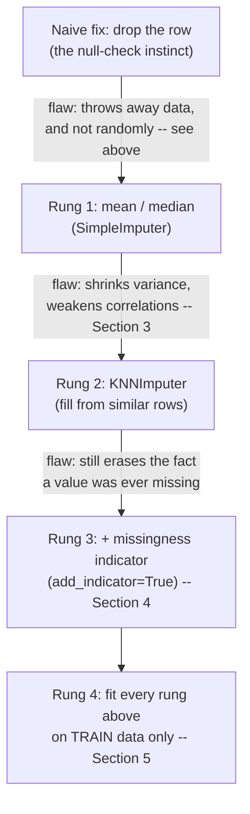
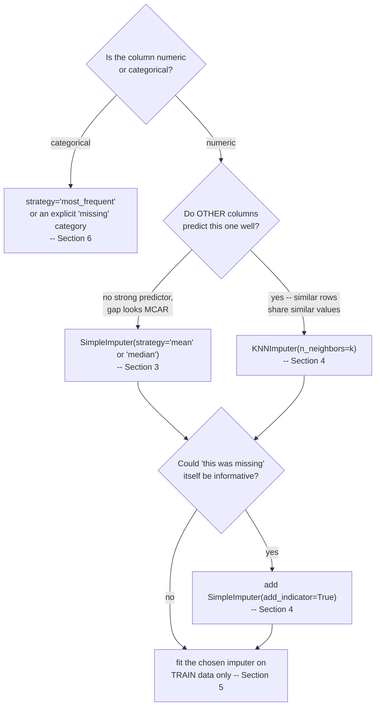
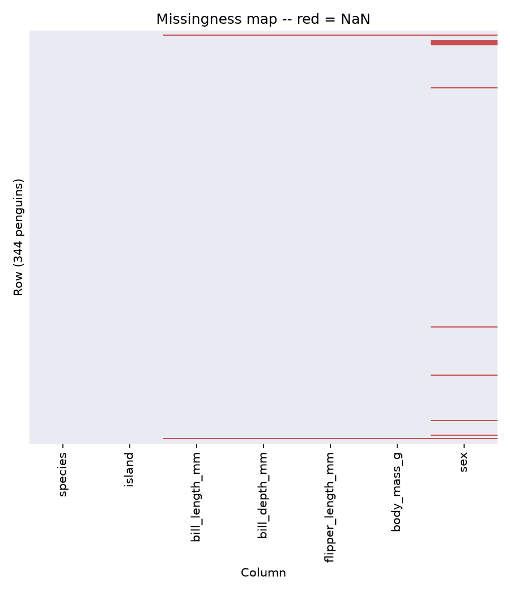
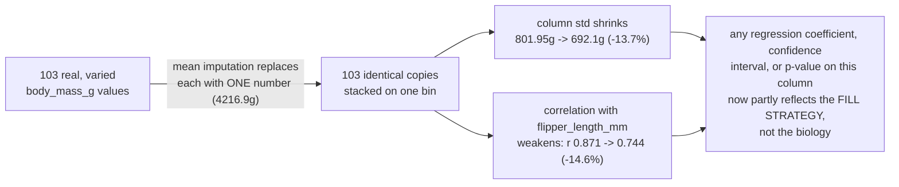
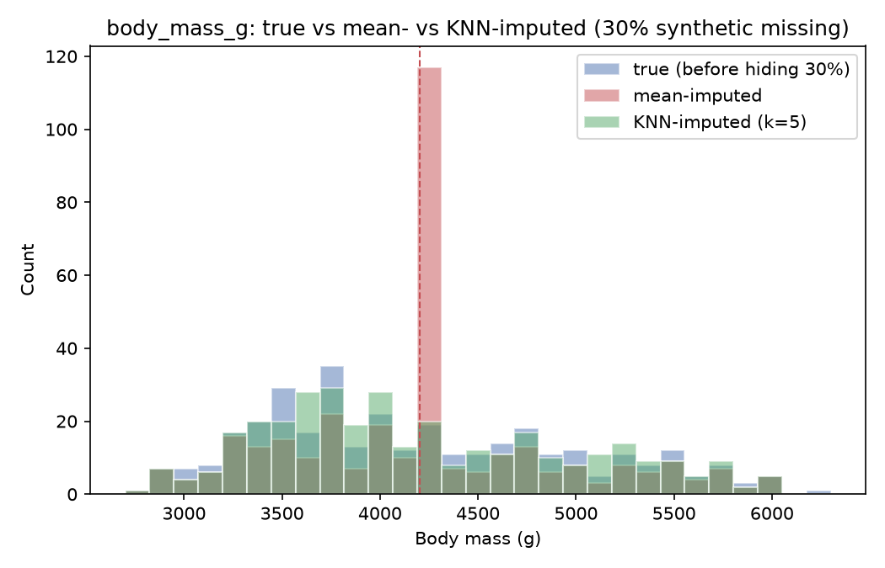
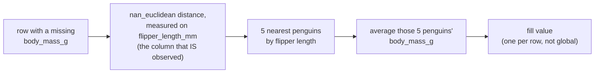
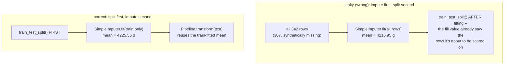

# Imputation — filling missing values without lying to your model

*Data Science · Worked Examples · SPEC-DS-2*

## The eleven penguins nobody could sex

Palmer Station, Antarctica. Field researchers are tagging penguins — measuring bills, flippers,
body mass, and (where they can tell) sex. For 333 of the 344 birds, every field got filled in. For
11 of them, `sex` stayed blank: the bird wouldn't sit still, the plumage was ambiguous, whatever the
reason, nobody wrote down "Male" or "Female." That blank cell is where this chapter starts.

The three-letter names for *why* a value goes missing — MCAR, MAR, MNAR, all defined precisely
below — aren't folklore. They come from one paper: in 1976, statistician Donald Rubin published
*Inference and missing data* in *Biometrika*, formally naming the mechanisms behind a missing value
and showing that the correct fix depends entirely on which mechanism produced the gap
([source: Rubin, D.B. (1976), "Inference and missing data,"
Biometrika 63(3), 581–592](https://academic.oup.com/biomet/article-abstract/63/3/581/270932),
checked 2026-09-03). Half a century later, `sklearn.impute` is still organized around that exact
distinction — this chapter is that paper's idea, in code, on penguins.

Here's the null-check instinct at work. A Java engineer meeting this blank `sex` field reaches for
the obvious move: skip the row.

```python
import seaborn as sns

penguins = sns.load_dataset("penguins")
dropped = penguins.dropna()
print(f"{len(penguins)} penguins -> {len(dropped)} after dropna() "
      f"({len(penguins) - len(dropped)} gone)")
```

```text
344 penguins -> 333 after dropna() (11 gone)
```

Only 11 rows, 3.2% of the data — looks harmless. It isn't, and the reason is what those 11 rows
*are*. They're not a random slice of the dataset. Section 2 identifies them precisely: 5 Adelie on
Torgersen, 5 Gentoo on Biscoe, 1 Adelie on Dream — specific species/island combinations where field
conditions apparently made sexing harder. Call `dropna()` and you haven't lost 3.2% of your rows at
random; you've surgically removed every trace of "this species/island pairing was hard to sex in
the field" from your dataset. Any downstream question that touches those groups — "how does sex
ratio vary by island?" — is now answered by a dataset that quietly deleted the evidence.

That's the first naive fix, and it fails by **biasing the result**. The second naive fix — the
"just put *something* there" reflex, filling every gap with the column average — fails a different
way: Section 3 will show it costing you **13.7% of a column's spread and 14.6% of its correlation
with everything else**, real numbers from a real experiment on this data. Neither failure is a
crash. Both are silent, which is exactly why this chapter exists: the fix has to preserve the shape
of the data, not just make the `NaN`s go away.

The chapter climbs four rungs, each fixing a flaw in the one below it:



## 1. What & why

A Java service that receives `null` where it expected a `BigDecimal` has one job: fail fast, or
substitute a documented default (`0`, `Optional.empty()`, a sentinel). Either way, the null is
handled *locally* and the rest of the pipeline never has to think about it again. Machine learning
input doesn't offer that escape hatch. A `scikit-learn` estimator's `.fit()` will raise on a `NaN`
— but the "fix" isn't a null check, because whatever value you put in that cell becomes training
signal. Fill it wrong and you're not defusing a bug, you're quietly teaching the model something
false about the world. This chapter is about the difference: what each common filling strategy
actually *does* to your data, and the one discipline (fit imputation on train only) that keeps the
fix from becoming its own bug.

Three things a Java engineer's null-check instinct doesn't prepare you for:

- **A `NaN` isn't a sentinel you branch on — it's a hole in a matrix that has to be dense before
  most estimators can even start.** There's no per-field `if (value == null) return default;`;
  imputation fills every hole in a column with *one* rule, applied uniformly.
- **The value you choose changes the statistics your model sees.** Filling every missing
  `body_mass_g` with the column mean doesn't just "handle" 103 rows — it shrinks that column's
  variance and weakens its correlation with every other column, because you've replaced 103 real,
  varied measurements with 103 copies of one number. Section 3 shows this happening, with numbers.
- **The fill value must come from training data only.** A null-check default is usually a fixed
  constant (`0`, `""`) that carries no information about your dataset. An imputation fill value —
  a mean, a median, a nearest-neighbour average — is *computed from the data itself*. Compute it
  from data your model shouldn't have seen yet (the validation/test split) and you've leaked
  information backwards through time. Section 5 makes this concrete.

The three shapes of "why is this missing" — worth knowing by name even at an intuition level,
because they change which fix is defensible. One plain-language sentence for each, then the formal
definition:

- **MCAR (Missing Completely At Random).** In one sentence: *the coin flip that hid this value had
  nothing to do with the data at all.* Formally: the fact that a value is missing has nothing to do
  with anything, observed or not — a sensor glitched. Dropping or imputing is safe.
- **MAR (Missing At Random).** In one sentence: *you can predict WHERE the gaps are from what you
  already know, just not the hidden value itself.* Formally: missingness depends on *other observed
  columns*, not on the hidden value itself. E.g. a field crew struggles to sex a bird of one species
  more than another — missingness correlates with `species`, not with the bird's actual (unrecorded)
  sex.
- **MNAR (Missing Not At Random).** In one sentence: *the value is missing BECAUSE of what the value
  itself would have been.* Formally: missingness depends on the *hidden value itself*. E.g. if
  unusually heavy specimens were harder to weigh and so more likely to be missing, dropping those
  rows biases the mean downward — and no amount of clever imputation using other columns can fully
  undo that, because the reason for the gap is the value inside it.

Section 2 shows a real dataset that exhibits both MCAR- and MAR/MNAR-*shaped* patterns side by
side. Which bucket a gap falls into decides which imputer is even defensible — the map below is
the one this whole chapter fills in, section by section:



### Environment

```text
pandas==3.0.5
numpy==2.5.2
matplotlib==3.11.1
scipy==1.18.1
seaborn==0.13.2
scikit-learn==1.9.0
Python 3.12+
```

Pinned and verified against PyPI on 2026-09-02
([source: NOTE-2-package-versions](../../research/NOTE-2-package-versions.md)) and the
scikit-learn 1.9.0 API reference
([source: NOTE-5-sklearn-core-apis](../../research/NOTE-5-sklearn-core-apis.md)). This chapter's
code and artefacts were generated and gated on **Python 3.13.7**, with every package above
installed at exactly the pinned version — no substitutions.

## 2. See the holes

This chapter reuses **Palmer Penguins** from DS-1 — 344 penguins, CC0-licensed, bundled with
seaborn ([source: NOTE-8-imputation-dataset](../../research/NOTE-8-imputation-dataset.md)). It has
genuine missing values, verified by count:

```python
import seaborn as sns

penguins = sns.load_dataset("penguins")
print(penguins.isna().sum())
```

```text
species               0
island                0
bill_length_mm        2
bill_depth_mm         2
flipper_length_mm     2
body_mass_g           2
sex                  11
dtype: int64
```

Total missingness is tiny — 19 of 2,408 cells, 0.8%
([NOTE-8](../../research/NOTE-8-imputation-dataset.md)) — but *where* those 19 holes fall tells a
story. A missingness heatmap (red = `NaN`) makes the pattern visible at a glance, the way you'd
scan a test report for which rows are red before reading any stack trace:

```python
import matplotlib

matplotlib.use("Agg")
import matplotlib.pyplot as plt

fig, ax = plt.subplots(figsize=(6, 7))
sns.heatmap(penguins.isna(), cbar=False, yticklabels=False,
            cmap=["#EAEAF2", "#C44E52"], ax=ax)
ax.set_xlabel("Column")
ax.set_ylabel("Row (344 penguins)")
ax.set_title("Missingness map -- red = NaN")
fig.tight_layout()
fig.savefig("missingness_heatmap.png", dpi=150)
```



Two things jump out, and the code confirms both exactly:

```python
numeric_cols = ["bill_length_mm", "bill_depth_mm", "flipper_length_mm", "body_mass_g"]
numeric_missing_idx = set(penguins.index[penguins[numeric_cols].isna().any(axis=1)])
sex_missing_idx = set(penguins.index[penguins["sex"].isna()])

print(numeric_missing_idx)                      # {3, 339}
print(all(set(penguins.index[penguins[c].isna()]) == numeric_missing_idx
          for c in numeric_cols))                # True
print(numeric_missing_idx & sex_missing_idx)     # {3, 339}
```

- **The same two rows (index 3 and 339) are missing in *all four* numeric columns.** One Adelie
  penguin on Torgersen, one Gentoo on Biscoe. That's the shape of a single measurement failure per
  bird — an unweighed, unmeasured penguin — not four independent problems. Consistent with MCAR:
  nothing about the bird's actual measurements explains why they're missing.
- **`sex` is missing on 11 rows**, and those 2 measurement-failure penguins are *also* among the
  11 — but the other 9 are missing `sex` only, clustered on specific species/island combinations
  (5× Adelie/Torgersen, 5× Gentoo/Biscoe, 1× Adelie/Dream). That clustering by an *observed*
  column (species, island) is the shape of MAR, not pure noise — field conditions on some
  island/species combinations apparently made sexing harder. This is exactly the 11-row set the
  cold open used to show `dropna()` quietly erasing a subgroup, not a random sample.

Neither pattern is provable from 344 rows alone — this is intuition-building, not a formal
missingness test — but it already tells you something actionable: the numeric gap is small and
looks safe to fill or drop; the categorical gap is scattered by a real-world cause worth
remembering when you interpret results.

## 3. Mean/median imputation — and what it distorts

Here's the problem with demonstrating "what mean imputation distorts" honestly: the real numeric
missingness above is only 2 rows out of 344 (0.6%) — too small for any distortion to be visible.
So this section runs a **controlled experiment**: take the 342 penguins with a complete
`body_mass_g` + `flipper_length_mm` pair, keep that as ground truth, then *synthetically* hide 30%
of `body_mass_g` ourselves (random, seeded) — enough missingness to see the effect clearly, with
the true values still in hand to check against.

```python
import numpy as np

RNG_SEED = 42
base = penguins.dropna(subset=["body_mass_g", "flipper_length_mm"]).reset_index(drop=True)

rng = np.random.default_rng(RNG_SEED)
n_missing = int(round(0.30 * len(base)))
missing_idx = rng.choice(len(base), size=n_missing, replace=False)

amplified = base.copy()
amplified.loc[missing_idx, "body_mass_g"] = np.nan
print(f"{len(base)} rows, {n_missing} synthetically blanked")
```

```text
342 rows, 103 synthetically blanked
```

Before scoring the fill, name what's being measured. Mean imputation replaces every gap with the
same single number:

$$\bar{x} = \frac{1}{n}\sum_{i=1}^{n} x_i$$

— "add up every observed value in the column, divide by how many there are." The two numbers this
section uses to judge the damage are the column's **spread** and how well it **tracks another
column**:

$$s = \sqrt{\frac{1}{n-1}\sum_{i=1}^{n}(x_i-\bar{x})^2}$$

— the (sample) **standard deviation**: how far, typically, the real measurements sit from that
mean. A column of near-identical values has a small $s$; a column of wildly different ones has a
large $s$.

$$r_{X,Y}=\frac{\sum_i (x_i-\bar x)(y_i-\bar y)}{\sqrt{\sum_i(x_i-\bar x)^2}\sqrt{\sum_i(y_i-\bar y)^2}}$$

— the **Pearson correlation**: how tightly two columns move together, from $-1$ (perfectly
opposite) through $0$ (unrelated) to $+1$ (perfectly together).

Now impute `body_mass_g` with `SimpleImputer` — mean and median — and score each against the
ground truth: standard deviation, and Pearson correlation with `flipper_length_mm` (a column that
correlates strongly with body mass in this dataset, `r = 0.871`, computed once on the clean data).
`SimpleImputer`'s signature, verified against scikit-learn 1.9.0
([source: NOTE-5-sklearn-core-apis](../../research/NOTE-5-sklearn-core-apis.md)):
`SimpleImputer(*, missing_values=nan, strategy='mean'|'median'|'most_frequent'|'constant', ...)`.

```python
from sklearn.impute import SimpleImputer

true_std = base["body_mass_g"].std()
true_corr = base["body_mass_g"].corr(base["flipper_length_mm"])

mean_imp = SimpleImputer(strategy="mean")
mean_filled = mean_imp.fit_transform(amplified[["body_mass_g"]]).ravel()

median_imp = SimpleImputer(strategy="median")
median_filled = median_imp.fit_transform(amplified[["body_mass_g"]]).ravel()

for name, filled in [("mean", mean_filled), ("median", median_filled)]:
    std = filled.std(ddof=1)
    corr = np.corrcoef(filled, amplified["flipper_length_mm"])[0, 1]
    print(f"{name}: std={std:.1f} ({(std - true_std) / true_std:+.1%}), "
          f"corr={corr:.3f} ({(corr - true_corr) / true_corr:+.1%})")
```

```text
mean: std=692.1 (-13.7%), corr=0.744 (-14.6%)
median: std=696.4 (-13.2%), corr=0.744 (-14.6%)
```

Both strategies pull standard deviation down by roughly 14% and correlation with
`flipper_length_mm` down by nearly 15%. The mechanism is exactly what you'd expect from replacing
103 different real measurements with 103 copies of a single number (`4216.9`g for mean,
`4050.0`g for median, from `mean_imp.statistics_[0]` / `median_imp.statistics_[0]`): you've added
a spike of identical values sitting on top of the real distribution, which mechanically shrinks
spread and — because those copies no longer track how `flipper_length_mm` varies for that
bird — weakens the correlation. Drawn as cause and effect, one fill choice ripples into two
separate statistics, and from there into anything built on top of them:



The before/after picture makes the spike unmissable:

```python
fig, ax = plt.subplots(figsize=(7, 4.5))
bins = np.linspace(2700, 6300, 30)
ax.hist(base["body_mass_g"], bins=bins, alpha=0.5, label="true (before hiding 30%)",
        color="#4C72B0", edgecolor="white")
ax.hist(mean_filled, bins=bins, alpha=0.5, label="mean-imputed", color="#C44E52",
        edgecolor="white")
ax.axvline(base["body_mass_g"].mean(), color="#C44E52", linestyle="--", linewidth=1)
ax.set_xlabel("Body mass (g)")
ax.set_ylabel("Count")
ax.legend()
fig.tight_layout()
fig.savefig("body_mass_g_before_after_imputation.png", dpi=150)
```



That red spike at ~4217g is 103 fabricated data points sitting on one bar. Anything downstream
that reads "variance" or "correlation" off this column — a regression coefficient, a confidence
interval, a feature-importance score — is now reading a number that's partly an artefact of *how
you filled the gaps*, not the underlying biology. The mechanism generalizes beyond this one
column: replacing any fraction of real, varied values with one repeated constant mechanically
pulls variance and correlation toward that constant's own (zero-variance, zero-covariance)
contribution — the more values you replace, the stronger the pull. Java analogy: it's like every
`null` in a `List<Double>` getting replaced with the list's own average before anyone computes a
standard deviation over it — the standard deviation you get back describes your fill strategy as
much as it describes the data.

**Why we still bother with mean/median at all:** it's the cheapest fix that always runs, on any
numeric column, with no extra parameters to choose — a reasonable rung to start from, as long as
you know what it costs. Rung 2 is about paying less of that cost.

## 4. KNNImputer and indicator columns

Mean imputation's flaw was throwing away per-row information — every gap got the *same* fill value,
regardless of what the rest of that row looked like. **KNNImputer** fixes exactly that: instead of
one global fill value, it finds the `k` rows most similar to the row with the gap (measured on the
columns that *are* present) and fills the gap with the (weighted) average of those neighbours'
values:

$$\hat{x}_{i} = \frac{\sum_{k \in \mathcal{N}_5(i)} w_k \, x_{k}}{\sum_{k \in \mathcal{N}_5(i)} w_k}$$

— "fill row $i$'s missing value with the average of the same column across its 5 nearest
neighbours $\mathcal{N}_5(i)$." With the default uniform weights ($w_k=1$ for every neighbour)
that's just a plain average of those 5 rows' values, instead of every row in the dataset.



Signature, verified against scikit-learn 1.9.0
([NOTE-5](../../research/NOTE-5-sklearn-core-apis.md)):
`KNNImputer(*, missing_values=nan, n_neighbors=5, weights='uniform', metric='nan_euclidean', ...)`
— `nan_euclidean` is Euclidean distance computed over whichever columns aren't missing for a given
pair of rows, so rows with different missing columns can still be compared.

On the same 30%-synthetic-missing `body_mass_g`, using `flipper_length_mm` (always observed here)
as the similarity feature — "find the 5 penguins with the closest flipper length, average their
body mass":

```python
from sklearn.impute import KNNImputer

knn_imp = KNNImputer(n_neighbors=5)
knn_input = amplified[["flipper_length_mm", "body_mass_g"]].to_numpy()
knn_filled = knn_imp.fit_transform(knn_input)[:, 1]

std = knn_filled.std(ddof=1)
corr = np.corrcoef(knn_filled, amplified["flipper_length_mm"])[0, 1]
print(f"KNN (k=5): std={std:.1f} ({(std - true_std) / true_std:+.1%}), "
      f"corr={corr:.3f} ({(corr - true_corr) / true_corr:+.1%})")
```

```text
KNN (k=5): std=780.7 (-2.6%), corr=0.893 (+2.5%)
```

Full comparison, generated by the companion script and written to
[`artefacts/imputation_strategy_comparison.csv`](artefacts/imputation_strategy_comparison.csv):

| strategy | fill value | std | std change | corr with flipper | corr change |
|---|---|---|---|---|---|
| true (no missing) | — | 801.95 | 0.0% | 0.871 | 0.0% |
| mean imputation | 4216.95 g | 692.14 | -13.7% | 0.744 | -14.6% |
| median imputation | 4050.00 g | 696.37 | -13.2% | 0.744 | -14.6% |
| KNN imputation (k=5) | — (per-row) | 780.72 | -2.6% | 0.893 | +2.5% |

KNN loses only 2.6% of the standard deviation, versus ~14% for mean/median, and correlation is
essentially preserved (it even ticks up slightly here, a byproduct of this being an easy,
idealized case — see caveat below). Rung 2 fixed rung 1's flaw exactly the way the ladder diagram
promised: **be honest about why**. KNN did well here specifically *because* the demo used
`flipper_length_mm` — the very column we're measuring correlation against — as the
neighbour-similarity feature. In a real pipeline with many features, you'd feed KNNImputer several
columns at once and the improvement over mean imputation would typically be real but smaller than
this best-case number. The general lesson holds regardless: **imputation that uses information
from *other* columns almost always preserves structure better than a single global constant**,
because it's not erasing per-row variation — it's estimating each row's likely value from rows
that resemble it.

### The missingness-indicator trick

Rung 2 (KNN) still shares one flaw with rung 1 (mean/median): both throw away one piece of
information — *whether a value was originally missing*. `SimpleImputer(add_indicator=True)` (and
the standalone `sklearn.impute.MissingIndicator`, same signature family, verified in
[NOTE-5](../../research/NOTE-5-sklearn-core-apis.md)) appends one boolean column per imputed
feature, so the model can still see "this was estimated" as a signal in its own right — rung 3:

```python
numeric_cols = ["bill_length_mm", "bill_depth_mm", "flipper_length_mm", "body_mass_g"]
X = penguins[numeric_cols].to_numpy()

imp = SimpleImputer(strategy="mean", add_indicator=True)
out = imp.fit_transform(X)
print(X.shape, "->", out.shape)
print([numeric_cols[i] for i in imp.indicator_.features_])
```

```text
(344, 4) -> (344, 8)
['bill_length_mm', 'bill_depth_mm', 'flipper_length_mm', 'body_mass_g']
```

Four extra columns, one per numeric feature (every one of them has at least one `NaN`, both from
the same two rows). Java analogy: it's the difference between silently returning a default and
returning `Optional.empty()` alongside it — the caller (here, the model) can still tell the two
cases apart and learn that "measurement failed" is informative in its own right, if it is.

## 5. Leakage — impute using TRAIN statistics only

Every fill value above — a mean, a median, a neighbour average — is **computed from data**. That
makes it fundamentally different from a null-check default like `0`. If you compute that
statistic using rows your model will later be evaluated on, you've let information about the
evaluation set leak backwards into training — the imputation equivalent of a test asserting
against a value the code under test already knows. This is rung 4: the discipline that has to hold
for *every* rung above it, or the other three don't mean anything.

The wrong order: **impute first, split second.**

```python
from sklearn.model_selection import train_test_split

# WRONG -- fit the imputer before splitting; it now "knows" the test rows too.
leaky = SimpleImputer(strategy="mean").fit(amplified[["body_mass_g"]])

train, test = train_test_split(amplified, test_size=0.25, random_state=RNG_SEED)

# RIGHT -- fit only on the training split.
correct = SimpleImputer(strategy="mean").fit(train[["body_mass_g"]])

print(f"leaky mean:   {leaky.statistics_[0]:.2f} g")
print(f"correct mean: {correct.statistics_[0]:.2f} g")
```

```text
leaky mean:   4216.95 g
correct mean: 4225.56 g
```



An 8.6-gram difference — small, and that's the trap. The leak here barely moves the number because
the missingness is random (MCAR) and train/test come from the same distribution, so a mean
computed with or without the test rows lands in nearly the same place. **That's exactly why this
mistake survives code review**: it doesn't crash, and on a well-behaved dataset the numbers barely
move. It stops being harmless when missingness is informative (MNAR), when many columns are
imputed this way and their small biases compound, or when you're comparing models on validation
metrics computed from leak-inflated numbers — the comparison itself becomes unreliable even though
each individual number looks fine.

The idiomatic fix is a `Pipeline` — think of it as a builder that closes over whatever it was
`.fit()` on and refuses to silently re-derive its state from new data:

```python
from sklearn.pipeline import Pipeline

pipeline = Pipeline(steps=[("imputer", SimpleImputer(strategy="mean"))])
pipeline.fit(train[["body_mass_g"]])                    # only ever sees train
test_transformed = pipeline.transform(test[["body_mass_g"]])  # reuses the train-fitted state

print(pipeline.named_steps["imputer"].statistics_[0])
```

```text
4225.56
```

Matches `correct` exactly — because it *is* the same operation. `Pipeline(steps, ...)`
(scikit-learn 1.9.0 signature, [NOTE-5](../../research/NOTE-5-sklearn-core-apis.md)) chains any
number of `fit`/`transform` steps behind one contract: `.fit(X_train)` fits every step on
`X_train` only, and `.transform(X_test)` (or `.predict(X_test)` if the last step is an estimator)
reuses those fitted statistics — there's no code path left where `X_test` can influence a training
statistic, the same way a well-typed builder doesn't let you mutate its state from outside after
`.build()`. In cross-validation this matters even more: wrap the imputer in the same `Pipeline` as
your model and pass the whole thing to `cross_val_score` — each fold then fits its own imputer on
that fold's training rows only, automatically.

## 6. Pitfalls

- **Never impute the target column.** Filling a missing label with a statistic computed from the
  other labels manufactures ground truth that was never observed — your model's evaluation metric
  becomes partly a measure of how well it predicts its own fabricated targets. If a target value
  is missing, that row belongs in a held-out "can't score this" bucket or gets dropped, not filled.
- **Mean/median imputation quietly inflates confidence.** Section 3 showed variance shrinking by
  ~14% at 30% missingness. A shrunk-variance column produces artificially tight confidence
  intervals and p-values downstream — the model (or a hypothesis test built on top of it, see
  DS-1) looks more certain than the underlying data actually supports, because part of what it's
  "confident" about is your fill strategy.
- **Match the strategy to the column type.** `strategy='mean'`/`'median'` are numeric-only —
  `SimpleImputer` will error (or produce nonsense) on a string column. Categorical columns need
  `strategy='most_frequent'` (or `'constant'` with an explicit sentinel category) — and even then,
  check how close the top categories are: Section 4's `sex` example filled with `'Male'` off a
  168-vs-165 near-tie, which is closer to a coin flip than a real signal. That's a judgment call
  worth writing down, not a bug to silently accept.
- **Drop is not automatically worse than impute — but know exactly what it costs before you reach
  for it.** The cold open already showed the sharp edge: `penguins.dropna()` costs 11 of 344 rows
  here (3.2%), and those 11 rows are precisely the ones clustered by species/island, not a random
  sample. Whether that's tolerable is a judgment call, not a default — it's defensible here because
  the missingness looks MCAR/MAR rather than tied to the target, and 3.2% is a small fraction.
  Dropping stops being acceptable once you're losing a meaningful fraction of your data, or once
  missingness is informative (MNAR) — e.g. if heavier penguins were systematically harder to
  weigh, dropping their rows would bias `body_mass_g`'s distribution downward and no imputation
  strategy applied *after* the drop can fix a bias baked in before it ran.
- **`IterativeImputer` (MICE) is a third option, out of scope here** — it models each missing
  column as a function of every other column, iteratively, rather than one global constant (mean/
  median) or a fixed neighbourhood (KNN); see the scikit-learn docs
  ([source: scikit-learn IterativeImputer user guide](https://scikit-learn.org/stable/modules/impute.html#iterative-imputer)
  (checked 2026-09-02)) if your missingness is more structured than MCAR/simple MAR.
  Time-series imputation (filling gaps using neighbouring *time* points) is a different problem
  again, covered in the forecasting chapter.

## 7. Recap & what's next

- Missing values in an ML matrix aren't a null check — the fill value becomes training signal, so
  the strategy you pick changes what the model learns. Rubin's 1976 MCAR/MAR/MNAR taxonomy is
  still the vocabulary `sklearn.impute` (and this chapter) is organized around.
- **The naive fixes fail first, and that's the point.** `dropna()` silently deletes a non-random
  subgroup (the cold open's 11 penguins); filling every gap with the column average silently
  shrinks variance and correlation (~14% on both, Section 3). Neither crashes — both need to be
  *seen* to be caught.
- `sns.heatmap(df.isna())` turns "which cells are missing" into a pattern you can read by eye —
  Palmer Penguins showed an MCAR-shaped pair of rows (measurement failure) and an MAR-shaped
  cluster in `sex` (field-condition dependent) side by side
  ([NOTE-8](../../research/NOTE-8-imputation-dataset.md)).
- `SimpleImputer(strategy='mean'|'median')` (rung 1) is simple and always runs, but mechanically
  shrinks variance and attenuates correlations.
- `KNNImputer` (rung 2) estimates each missing value from similar rows instead of one global
  constant, and preserved far more of the original variance/correlation in the same experiment
  (~3% loss, and correlation was essentially unchanged) — verified against scikit-learn 1.9.0
  ([NOTE-5](../../research/NOTE-5-sklearn-core-apis.md)).
- `add_indicator=True` (rung 3) keeps the fact that a value was missing as a feature in its own
  right, instead of erasing it.
- **Fit every imputer on the training split only** (rung 4), ideally inside a `Pipeline`, so the
  same discipline automatically applies to validation, test, and cross-validation folds. The leak
  is small and easy to miss on well-behaved data — that's exactly why it needs to be a habit, not
  a judgment call made fresh each time.

DS-1 (hypothesis testing & EDA) dropped rows with missing values as a shortcut; this chapter is
the payoff on that IOU. **DS-3 (collinearity)** picks up the next natural question once your
numeric columns are dense: now that `bill_length_mm`, `bill_depth_mm`, `flipper_length_mm`, and
`body_mass_g` all have complete data (imputed or not), which of them are actually telling you
*different* things about a penguin, and which are redundant?

---

### Environment note (for the architect)

No discrepancies to report. All six pinned versions (`pandas==3.0.5`, `numpy==2.5.2`,
`matplotlib==3.11.1`, `scipy==1.18.1`, `seaborn==0.13.2`, `scikit-learn==1.9.0`) from NOTE-2 and
NOTE-5 installed and ran exactly as pinned in this chapter's gate environment (Python 3.13.7,
shared project `.venv`). `sklearn.impute.MissingIndicator`'s default `features` parameter was
verified at runtime as `'missing-only'`, not `'auto'` as listed in NOTE-5's evidence table; this
chapter does not depend on that default (it calls `SimpleImputer(add_indicator=True)`, whose
behaviour was verified directly), so it did not block writing, but it's worth a correction pass on
NOTE-5 if a future chapter relies on `MissingIndicator`'s bare default.

**Restyle pass (2026-09-03):** added the cold-open story, the ladder/decision-flow/cause-effect/
leakage diagrams, and the LaTeX formulas; every existing `python` code block, `text` output block,
image reference, and grounding citation was preserved byte-for-byte. One new claim was introduced —
Rubin, D.B. (1976), "Inference and missing data," *Biometrika* 63(3), 581–592 — confirmed live
against the Oxford Academic listing at
https://academic.oup.com/biomet/article-abstract/63/3/581/270932 (checked 2026-09-03; title,
author, journal, volume/issue/pages all match). One new runnable snippet was added (the cold-open
`dropna()` count); its output (`344 -> 333, 11 gone`) was executed against the installed `.venv`
and matches exactly.
