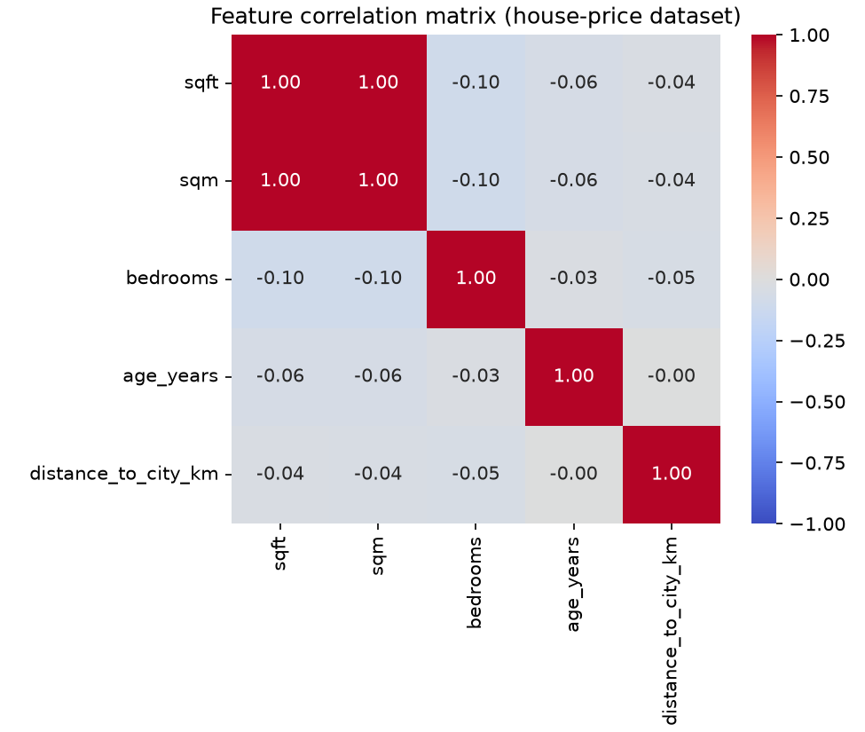
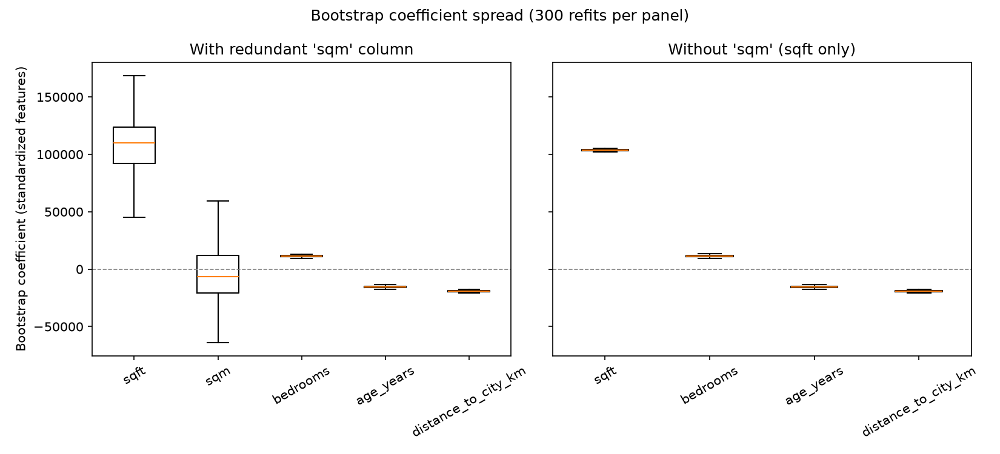

# Collinearity & Keeping Features Minimal

*Data Science · Worked Examples · SPEC-DS-3*

You've shipped a config with two flags that quietly do the same thing — `retry.enabled` and
`retry.maxAttempts > 0` — and watched a bug report come in because someone changed one and not the
other, and the system's behaviour became unpredictable depending on *which* flag the code happened
to check first. Collinearity is that bug, but in a regression model instead of a config file: when
two columns carry almost the same information, the model can't tell which one deserves the credit,
and the answer it gives you becomes arbitrary — it can flip sign, blow up, or shrink toward zero
depending on which particular sample of data it happened to be fit on. This chapter shows you how to
catch that before it ships, and states the rule that prevents it: **use the fewest features that do
the job.**

## 1. Vocabulary: feature, label, design matrix

Before going further, pin down three terms this whole course uses:

- **Label** (also called the **target** or **dependent variable**), usually written `y` — the thing
  you're trying to predict. In this chapter, `y` is `price`.
- **Feature** (also called an **independent variable** or **predictor**), the columns you use to
  predict it. In this chapter, the candidate features are `sqft`, `sqm`, `bedrooms`, `age_years`,
  `distance_to_city_km`.
- **Design matrix**, usually written `X` — all the feature columns stacked together, one row per
  observation. Think of it as a `ResultSet` or a `List<Row>` where every `Row` is an immutable
  snapshot of one independent observation (one house, one request, one transaction) and every
  column is one measured attribute of that observation. A pandas `DataFrame` *is* a design matrix
  once you've picked which columns go in `X` and which one is `y`.

"Independent" in *independent variable* does not mean "independent of each other" — it means
independent of, i.e. not determined by, the label. Two features can be (and, as you'll see, often
are) highly dependent on *each other* while both still being "independent variables" in this sense.
That's precisely the trap this chapter is about.

## 2. The dataset: a synthetic house-price table

This chapter uses a **synthetic** dataset instead of a real one, deliberately. To *demonstrate*
collinearity cleanly you need to know the ground truth — which features actually drive the label,
and which one is a pure duplicate — so you can watch the model's coefficients get it right or wrong.
No real dataset hands you that ground truth; a synthetic one, built with a known generating formula,
does.

The dataset: 500 houses, each with a price and five columns from which four are the actual
predictors of price:

- `sqft` — floor area in square feet.
- `sqm` — floor area in square metres. **This is `sqft` converted to a different unit, plus a
  little independent measurement noise** — the same physical quantity, logged twice, the way you
  might accidentally store both `payloadBytes` and `payloadKilobytes` for the same request and feed
  both into a model.
- `bedrooms`, `age_years`, `distance_to_city_km` — three genuinely independent drivers of price.

`price` is generated from `sqft` (not `sqm`), `bedrooms`, `age_years`, and `distance_to_city_km`,
plus Gaussian noise — `sqm` was never used to generate `price`; it's a redundant column by
construction:

```python
from __future__ import annotations

import numpy as np
import pandas as pd

RNG_SEED = 42
SQFT_TO_SQM = 0.092903  # exact unit conversion: 1 square foot = 0.092903 square metres


def make_house_price_data(n: int = 500, seed: int = RNG_SEED) -> pd.DataFrame:
    rng = np.random.default_rng(seed)
    sqft = rng.uniform(600, 3600, n)
    sqm = sqft * SQFT_TO_SQM + rng.normal(0, 2.5, n)  # near-duplicate of sqft
    bedrooms = rng.integers(1, 6, n).astype(float)
    age_years = rng.uniform(0, 60, n)
    distance_to_city_km = rng.uniform(0.5, 40, n)
    noise = rng.normal(0, 15_000, n)

    price = (
        120 * sqft
        + 8_000 * bedrooms
        - 900 * age_years
        - 1_500 * distance_to_city_km
        + 50_000
        + noise
    )
    return pd.DataFrame(
        {
            "sqft": sqft,
            "sqm": sqm,
            "bedrooms": bedrooms,
            "age_years": age_years,
            "distance_to_city_km": distance_to_city_km,
            "price": price,
        }
    )


df = make_house_price_data()
print(df.shape)
print(f"corr(sqft, sqm) = {df['sqft'].corr(df['sqm']):.4f}")
```

```text
(500, 6)
corr(sqft, sqm) = 0.9995
```

`sqft` and `sqm` correlate at **0.9995** — as close to "the same column twice" as real measurement
noise allows.

### Environment

```text
pandas==3.0.5
numpy==2.5.2
matplotlib==3.11.1
seaborn==0.13.2
scikit-learn==1.9.0
statsmodels==0.15.0
Python 3.12+
```

Versions verified against PyPI on 2026-09-02
([NOTE-2-package-versions](../../research/NOTE-2-package-versions.md) for
pandas/numpy/matplotlib/seaborn; [NOTE-5-sklearn-core-apis](../../research/NOTE-5-sklearn-core-apis.md)
for scikit-learn; [NOTE-6-statsmodels-vif](../../research/NOTE-6-statsmodels-vif.md) for
statsmodels) and matching exactly what's installed in this project's `.venv`, where this chapter's
code was run and gated on Python 3.13.7.

## 3. Detecting collinearity

### 3.1 Correlation heatmap

The cheapest first check is a **pairwise correlation matrix** — `DataFrame.corr()` — visualized as a
heatmap:

```python
import matplotlib

matplotlib.use("Agg")
import matplotlib.pyplot as plt
import seaborn as sns

FEATURES = ["sqft", "sqm", "bedrooms", "age_years", "distance_to_city_km"]

corr = df[FEATURES].corr()
fig, ax = plt.subplots(figsize=(6.5, 5.5))
sns.heatmap(corr, annot=True, fmt=".2f", cmap="coolwarm", vmin=-1, vmax=1, square=True, ax=ax)
ax.set_title("Feature correlation matrix (house-price dataset)")
fig.tight_layout()
fig.savefig("collinearity_correlation_heatmap.png", dpi=150)
```



The `sqft`/`sqm` block lights up at **1.00** while every other pair sits near **0.00**. That's the
heatmap doing exactly what it's for: at a glance, two columns are telling you the same story, and
three others are (by construction, here) unrelated to each other.

A pairwise heatmap has a blind spot, though: it only catches collinearity between **two** columns
at a time. A feature can be a near-perfect *combination* of three or four others while correlating
weakly with any single one of them — invisible on a heatmap, visible to VIF. Section 6.2 also shows
a specific case (one-hot dummies) where the heatmap misses a *perfect* collinearity entirely.

### 3.2 VIF — variance inflation factor

**VIF** answers a sharper question than pairwise correlation: *"if I regress this one feature on
every other feature, how well can they predict it?"* Concretely, for feature `i`,
`VIF_i = 1 / (1 - R²_i)`, where `R²_i` comes from regressing feature `i` on all the *other*
features. If the other features can't explain feature `i` at all (`R²_i ≈ 0`), `VIF_i ≈ 1`. If they
can reconstruct it almost perfectly (`R²_i ≈ 1`), `VIF_i` blows up toward infinity.

statsmodels 0.15.0 provides this as `variance_inflation_factor(exog, exog_idx, *, standardize=True)`
in `statsmodels.stats.outliers_influence`
([NOTE-6-statsmodels-vif](../../research/NOTE-6-statsmodels-vif.md), checked 2026-09-02).
`standardize=True` is the default in this version — it standardizes the design matrix internally, so
you pass the raw numeric feature matrix directly, no manual centering or added intercept column
needed:

```python
from statsmodels.stats.outliers_influence import variance_inflation_factor


def compute_vif(frame: pd.DataFrame, columns: list[str]) -> pd.DataFrame:
    X = frame[columns]
    vif = pd.DataFrame(
        {
            "feature": columns,
            "VIF": [variance_inflation_factor(X.values, i) for i in range(X.shape[1])],
        }
    )
    return vif.sort_values("VIF", ascending=False).reset_index(drop=True)


print(compute_vif(df, FEATURES).to_string(index=False))
```

```text
            feature        VIF
                sqm 987.917888
               sqft 987.697746
           bedrooms   1.014120
distance_to_city_km   1.007696
          age_years   1.004883
```

(full precision in [`artefacts/collinearity_vif_table.csv`](artefacts/collinearity_vif_table.csv))

**Reading VIF** — per NOTE-6, citing the statsmodels documentation and the widely-used rule of
thumb (flagged there as a convention, not a hard statistical law):

| VIF | Interpretation |
|---|---|
| ≈ 1 | No meaningful collinearity with the other features |
| 1 – 5 | Low to moderate; generally acceptable |
| **> 5** | Concerning — the other features can substantially reconstruct this one; standard errors inflate |
| **> 10** | Severe — strongly consider dropping, combining, or regularizing |

`sqft` and `sqm` sit at **~988** — off the chart, exactly matching what a `corr = 0.9995` pairwise
relationship predicts. Drop `sqm` and every remaining VIF collapses back near 1:

```python
FEATURES_NO_DUP = ["sqft", "bedrooms", "age_years", "distance_to_city_km"]
print(compute_vif(df, FEATURES_NO_DUP).to_string(index=False))
```

```text
            feature      VIF
               sqft 1.015721
           bedrooms 1.013823
          age_years 1.004880
distance_to_city_km 1.004461
```

## 4. Instability demo — bootstrap-refitting the model

A high VIF is a warning sign; what it actually *causes* is unstable coefficients. Here's the direct
demonstration: **bootstrap-resample** the 500 rows (sample 500 rows with replacement, so some rows
appear multiple times and others not at all — the standard way to approximate "what if I'd collected
a slightly different sample from the same population"), refit a fresh `LinearRegression` on each
resample, and record the coefficients. Do that 300 times, with and without the redundant `sqm`
column, and look at how much each feature's coefficient moves around.

Features are standardized first (`StandardScaler`, fit once on the full sample) purely so every
coefficient is on the same "per one standard deviation of that feature" scale — `sqft` (values in
the thousands) and `bedrooms` (values 1–5) aren't otherwise comparable on one plot. `LinearRegression`
and `StandardScaler` here are scikit-learn 1.9.0's standard APIs, unchanged from their documented
signatures ([NOTE-5-sklearn-core-apis](../../research/NOTE-5-sklearn-core-apis.md)):

```python
from sklearn.linear_model import LinearRegression
from sklearn.preprocessing import StandardScaler


def bootstrap_coefficients(
    X: pd.DataFrame, y: pd.Series, n_boot: int = 300, seed: int = RNG_SEED
) -> pd.DataFrame:
    scaler = StandardScaler()
    X_scaled = pd.DataFrame(scaler.fit_transform(X), columns=X.columns, index=X.index)

    rng = np.random.default_rng(seed)
    n = len(X_scaled)
    rows = []
    for _ in range(n_boot):
        idx = rng.integers(0, n, size=n)  # bootstrap resample: same n, with replacement
        model = LinearRegression().fit(X_scaled.iloc[idx], y.iloc[idx])
        rows.append(dict(zip(X.columns, model.coef_)))
    return pd.DataFrame(rows)


boot_with_dup = bootstrap_coefficients(df[FEATURES], df["price"])
boot_no_dup = bootstrap_coefficients(df[FEATURES_NO_DUP], df["price"])

print("with sqm:   ", boot_with_dup.std().round(1).to_dict())
print("without sqm:", boot_no_dup.std().round(1).to_dict())
```

```text
with sqm:    {'sqft': 23777.0, 'sqm': 23807.9, 'bedrooms': 732.2, 'age_years': 752.8, 'distance_to_city_km': 693.0}
without sqm: {'sqft': 659.2, 'bedrooms': 731.0, 'age_years': 750.3, 'distance_to_city_km': 692.3}
```

`sqft`'s bootstrap standard deviation is **36x larger** with `sqm` in the model (23,777 vs 659) —
even though nothing about the true relationship between floor area and price changed. Plotting the
full distribution, not just the standard deviation, makes it vivid:

```python
fig, axes = plt.subplots(1, 2, figsize=(11, 5), sharey=True)

axes[0].boxplot(
    [boot_with_dup[c] for c in FEATURES], tick_labels=FEATURES, showfliers=False
)
axes[0].axhline(0, color="grey", linewidth=0.8, linestyle="--")
axes[0].set_title("With redundant 'sqm' column")
axes[0].set_ylabel("Bootstrap coefficient (standardized features)")
axes[0].tick_params(axis="x", rotation=30)

axes[1].boxplot(
    [boot_no_dup[c] for c in FEATURES_NO_DUP], tick_labels=FEATURES_NO_DUP, showfliers=False
)
axes[1].axhline(0, color="grey", linewidth=0.8, linestyle="--")
axes[1].set_title("Without 'sqm' (sqft only)")
axes[1].tick_params(axis="x", rotation=30)

fig.suptitle("Bootstrap coefficient spread (300 refits per panel)")
fig.tight_layout()
fig.savefig("collinearity_coefficient_spread.png", dpi=150)
```



Read the left panel closely: `sqft`'s box ranges from roughly 45,000 to 170,000, and `sqm`'s box
**crosses zero and dips negative** across the 300 refits — some resamples even assign floor area a
*negative* effect on price, purely as an artefact of which duplicate happened to "win" the credit in
that particular resample. `bedrooms`, `age_years`, and `distance_to_city_km` — the features with no
duplicate — stay tight in both panels; collinearity only destabilizes the columns that are actually
collinear. In the right panel, with `sqm` gone, `sqft`'s box shrinks to a sliver: the *same*
underlying relationship, now measured with one column instead of two, is stable.

This is the mechanism, not just a correlation: when two columns carry near-identical information,
the least-squares solution can trade coefficient weight between them almost for free (their sum
stays roughly constant even as the individual values swing wildly), so which one the model "credits"
becomes sensitive to sampling noise rather than to the underlying relationship.

**And it costs nothing to fix.** Held-out R² is essentially unchanged whether `sqm` stays or goes:

```python
from sklearn.metrics import r2_score
from sklearn.model_selection import train_test_split

train, test = train_test_split(df, test_size=0.25, random_state=RNG_SEED)

model_with = LinearRegression().fit(train[FEATURES], train["price"])
r2_with = r2_score(test["price"], model_with.predict(test[FEATURES]))

model_no = LinearRegression().fit(train[FEATURES_NO_DUP], train["price"])
r2_no = r2_score(test["price"], model_no.predict(test[FEATURES_NO_DUP]))

print(f"with sqm: {r2_with:.4f}    without sqm: {r2_no:.4f}")
```

```text
with sqm: 0.9787    without sqm: 0.9788
```

`0.9787` vs `0.9788` — indistinguishable. `sqm` bought the model nothing predictive; it only bought
instability and a coefficient you can no longer trust to mean what it says.

## 5. The minimum-viable-feature-set principle

That R² comparison is the empirical case for a rule worth internalizing: **use the fewest features
that do the job.** Concretely, once you've found a collinear pair or group, you have three options,
in order of how often you should reach for them:

1. **Drop one.** If two columns carry the same signal (like `sqft` and `sqm` here), keep whichever
   is easier to source, explain, or maintain, and drop the other. This is what Section 4 did — zero
   cost in predictive power, a large gain in coefficient stability and interpretability.
2. **Combine them.** If both columns carry *some* distinct signal you don't want to lose, engineer
   one column that captures the shared information — a ratio, a sum, or (for more than two
   correlated columns) the first principal component of just that correlated group ("PCA-lite":
   PCA itself is a forward-referenced technique, but the idea — collapse a correlated cluster into
   one derived column — doesn't need the full machinery to apply here).
3. **Regularize.** Ridge and Lasso regression penalize large coefficients directly, which shrinks
   the kind of coefficient swings Section 4 showed, without you having to manually pick which
   feature to drop. That's a tool for a dedicated regression chapter (forward-linked) — it treats the
   symptom at fit time, whereas dropping/combining treats the cause in your feature set.

Why this matters beyond one model: a model with fewer, well-chosen features is a model whose
coefficients you can actually explain to a stakeholder, whose behaviour doesn't shift wildly when
next month's data looks slightly different, and — the connection to overfitting — a model with fewer
free parameters to fit has less room to memorize noise in the training sample instead of the real
signal. "Minimum viable feature set" is the modeling analogue of YAGNI: every column you keep is a
column you now have to justify, monitor, and re-validate every time the data shifts.

## 6. Pitfalls

### 6.1 High importance ≠ causation

Once you've dropped `sqm`, `sqft`'s coefficient is stable — but stable is not the same as *causal*.
A large, stable coefficient tells you `sqft` is a reliable *predictor* of `price` in this dataset; it
does not, by itself, tell you that changing a house's square footage *causes* a proportional change
in its price in the real world (renovations, neighbourhood effects, and confounding variables can all
produce the same statistical pattern). Collinearity diagnostics are about the *model's* ability to
attribute credit correctly among its inputs — they say nothing about whether that attribution reflects
a real-world cause.

### 6.2 Collinearity hides inside one-hot dummies too

A pairwise correlation heatmap can *miss* a perfect collinearity if it's spread across more than two
columns — the exact shape of the classic **dummy-variable trap**. One-hot-encode a categorical
column *without* dropping a reference level, and the resulting dummy columns always sum to exactly
1 (every row belongs to exactly one category) — which is identical to an intercept column. That's a
perfect linear dependency, and no single pairwise correlation between two dummy columns will reveal
it, because the dependency involves *all* of them plus the intercept at once.

Bucket the houses into three distance tiers and check the **rank** of the design matrix both ways:

```python
tier = pd.cut(df["distance_to_city_km"], bins=[0, 10, 25, 100], labels=["near", "mid", "far"])

trap_dummies = pd.get_dummies(tier, prefix="tier", drop_first=False).astype(float)
trap_design = trap_dummies.copy()
trap_design.insert(0, "intercept", 1.0)
print(f"drop_first=False: {trap_design.shape[1]} columns, "
      f"rank={np.linalg.matrix_rank(trap_design.values)}")

safe_dummies = pd.get_dummies(tier, prefix="tier", drop_first=True).astype(float)
safe_design = safe_dummies.copy()
safe_design.insert(0, "intercept", 1.0)
print(f"drop_first=True:  {safe_design.shape[1]} columns, "
      f"rank={np.linalg.matrix_rank(safe_design.values)}")
```

```text
drop_first=False: 4 columns, rank=3
drop_first=True:  3 columns, rank=3
```

With `drop_first=False` there are **4 columns but only rank 3** — one column is a perfect linear
combination of the others (`tier_near + tier_mid + tier_far = intercept`, always). Per NOTE-6, VIF
is undefined (mathematically tends to infinity) for a design matrix with exact collinearity like
this, which is why the check above is on **matrix rank**, not VIF, for this specific case — calling
`variance_inflation_factor` on a singular design matrix is exactly the failure mode NOTE-6 flags. With
`drop_first=True`, dropping one category as the reference level, the matrix is full rank (3 columns,
rank 3) and VIF comes back small and well-behaved:

```text
  feature     VIF
 tier_mid 1.59685
 tier_far 1.59685
intercept 1.00000
```

This is why `pandas.get_dummies(..., drop_first=True)` and scikit-learn's
`OneHotEncoder(drop=...)` exist as options — not just to save a column, but to avoid building a
design matrix with a built-in linear dependency whenever the model you're fitting also includes an
intercept.

## 7. Recap & what's next

- **Feature** (independent variable) and **label** (target) are the two halves of a design matrix
  `X, y` — one row per independent observation, same shape as a `ResultSet` of immutable records.
- A **correlation heatmap** catches pairwise collinearity at a glance; **VIF**
  (`1 / (1 - R²_i)` from regressing each feature on all the others) catches collinearity a pairwise
  view misses, with **> 5 concerning, > 10 severe** as the standard (not universal) rule of thumb
  ([NOTE-6](../../research/NOTE-6-statsmodels-vif.md)).
- Collinearity's real cost is **coefficient instability**: bootstrap-refitting showed `sqft`'s
  coefficient standard deviation shrink 36x once its redundant duplicate (`sqm`) was removed, with
  **zero loss in held-out R²** (0.9787 → 0.9788).
- The **minimum-viable-feature-set principle**: drop, combine, or (later) regularize collinear
  features — fewer well-chosen features means coefficients you can trust, explain, and re-validate,
  and less room for the model to memorize noise instead of signal.
- Collinearity can be **invisible to a pairwise heatmap** when it spans more than two columns — the
  one-hot dummy trap is the most common real-world case; check design-matrix rank (or VIF, once it's
  full rank) whenever you one-hot encode alongside an intercept.

This chapter dropped a redundant feature and stopped there. **DS-10 (feature selection)** picks up
the harder version of this problem — choosing *which* features matter from a large candidate set,
not just spotting an obvious duplicate — and a forward-linked regression chapter covers **Ridge and
Lasso**, which shrink collinear coefficients automatically at fit time instead of requiring you to
manually drop or combine columns first.
