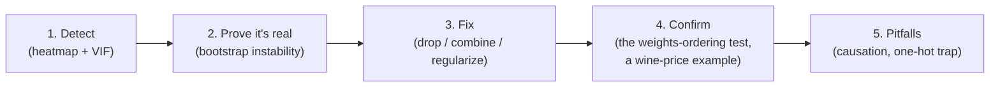
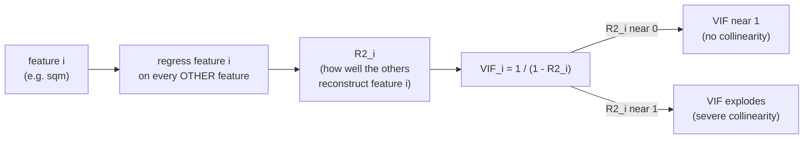
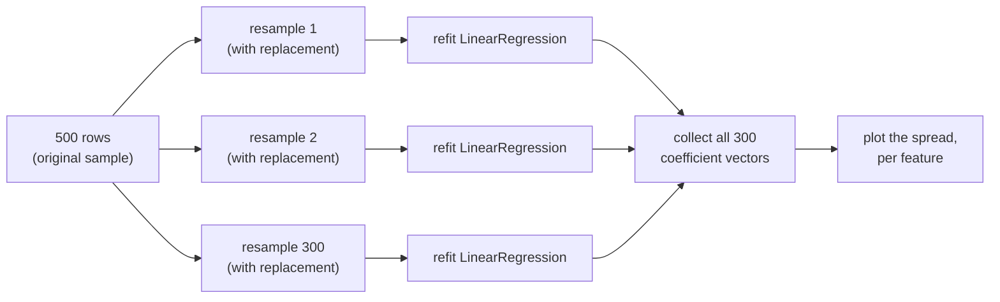
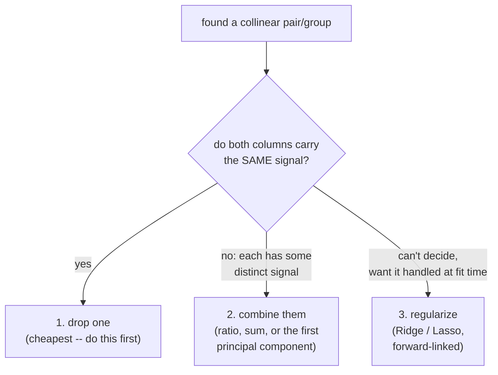
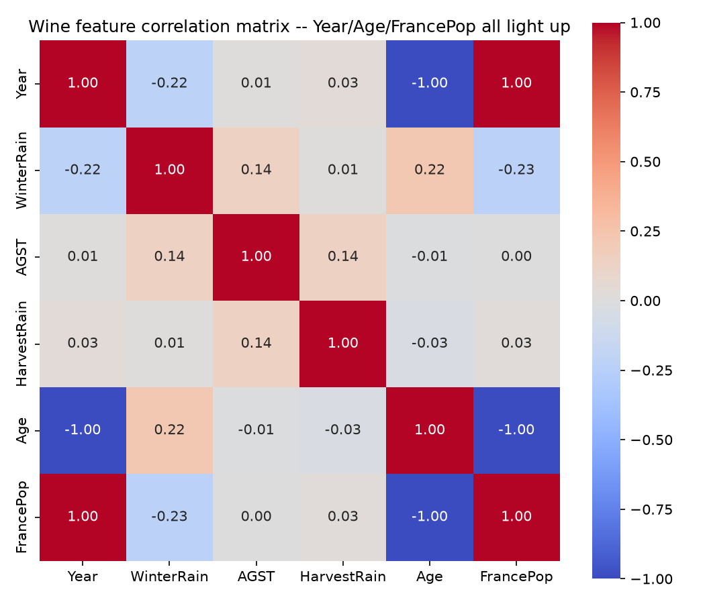
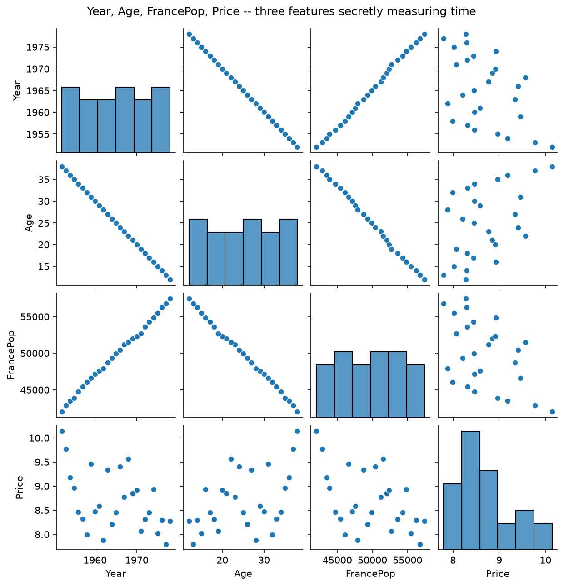
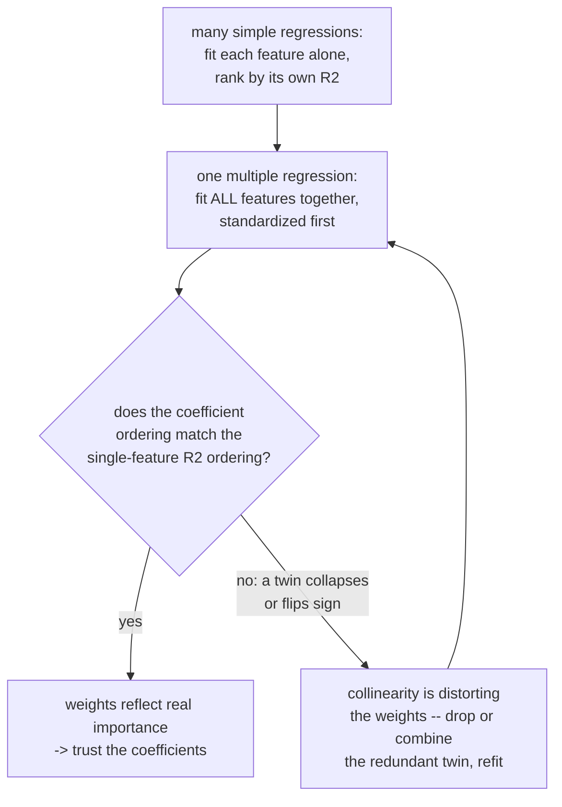
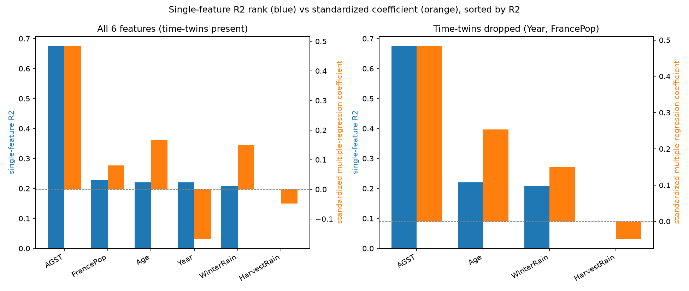

# Collinearity & Keeping Features Minimal

*Data Science · Worked Examples · SPEC-DS-3*

## The config flag that had a twin

You've shipped a config with two flags that quietly do the same thing — `retry.enabled` and
`retry.maxAttempts > 0` — and watched a bug report come in because someone changed one and not the
other. The system's behaviour became unpredictable depending on *which* flag the code happened to
check first, because both flags carried the same information and nothing forced them to agree.

Collinearity is that bug, moved into a regression model. When two columns carry almost the same
information, the model can't tell which one deserves the credit for predicting the label, and the
number it hands back — the coefficient — becomes arbitrary: it can flip sign, blow up, or shrink
toward zero depending on which particular sample of data it happened to be fit on. One plain
sentence you could repeat at dinner: **when two features tell the model the same story, the model
can't decide which one to believe, and its answer stops meaning anything.**

This chapter shows you how to catch that before it ships, states the rule that prevents it — **use
the fewest features that do the job** — and ends with the sharpest version of the test: fit each
feature alone, fit them all together, and see whether the model's opinion of what matters still
agrees with itself.



That's the route this chapter takes. Keep it in mind as a map — each section below is one stop on
it.

## 1. Vocabulary: feature, label, design matrix

Before going further, pin down three terms this whole course uses:

- **Label** (also called the **target** or **dependent variable**), usually written $y$ — the thing
  you're trying to predict. In §2–5, $y$ is `price`; in §6, $y$ is `Price`.
- **Feature** (also called an **independent variable** or **predictor**), the columns you use to
  predict it. In §2–5, the candidates are `sqft`, `sqm`, `bedrooms`, `age_years`,
  `distance_to_city_km`.
- **Design matrix**, usually written $X$ — all the feature columns stacked together, one row per
  observation. Think of it as a `ResultSet` or a `List<Row>` where every `Row` is an immutable
  snapshot of one independent observation (one house, one request, one vintage) and every column is
  one measured attribute of that observation. A pandas `DataFrame` *is* a design matrix once you've
  picked which columns go in $X$ and which one is $y$.

"Independent" in *independent variable* does not mean "independent of each other" — it means
independent of, i.e. not determined by, the label. Two features can be (and, as you'll see, often
are) highly dependent on *each other* while both still being "independent variables" in this sense.
That's precisely the trap this chapter is about.

## 2. The dataset: a synthetic house-price table

This chapter uses a **synthetic** dataset instead of a real one, deliberately. To *demonstrate*
collinearity cleanly you need to know the ground truth — which features actually drive the label,
and which one is a pure duplicate — so you can watch the model's coefficients get it right or wrong.
No real dataset hands you that ground truth; a synthetic one, built with a known generating formula,
does. (§6 repeats this trick with a second synthetic dataset, styled after Orley Ashenfelter's
Bordeaux wine-price data — see
[05-regression-nyc-taxi.md, "The wine that predicted its own price"](05-regression-nyc-taxi.md) —
where the ground truth is what makes the punchline provable rather than asserted.)

The dataset: 500 houses, each with a price and five columns from which four are the actual
predictors of price:

- `sqft` — floor area in square feet.
- `sqm` — floor area in square metres. **This is `sqft` converted to a different unit, plus a
  little independent measurement noise** — the same physical quantity, logged twice, the way you
  might accidentally store both `payloadBytes` and `payloadKilobytes` for the same request and feed
  both into a model.
- `bedrooms`, `age_years`, `distance_to_city_km` — three genuinely independent drivers of price.

`price` is generated from `sqft` (not `sqm`), `bedrooms`, `age_years`, and `distance_to_city_km`,
plus Gaussian noise — `sqm` was never used to generate `price`; it's a redundant column by
construction:

```python
from __future__ import annotations

import numpy as np
import pandas as pd

RNG_SEED = 42
SQFT_TO_SQM = 0.092903  # exact unit conversion: 1 square foot = 0.092903 square metres


def make_house_price_data(n: int = 500, seed: int = RNG_SEED) -> pd.DataFrame:
    rng = np.random.default_rng(seed)
    sqft = rng.uniform(600, 3600, n)
    sqm = sqft * SQFT_TO_SQM + rng.normal(0, 2.5, n)  # near-duplicate of sqft
    bedrooms = rng.integers(1, 6, n).astype(float)
    age_years = rng.uniform(0, 60, n)
    distance_to_city_km = rng.uniform(0.5, 40, n)
    noise = rng.normal(0, 15_000, n)

    price = (
        120 * sqft
        + 8_000 * bedrooms
        - 900 * age_years
        - 1_500 * distance_to_city_km
        + 50_000
        + noise
    )
    return pd.DataFrame(
        {
            "sqft": sqft,
            "sqm": sqm,
            "bedrooms": bedrooms,
            "age_years": age_years,
            "distance_to_city_km": distance_to_city_km,
            "price": price,
        }
    )


df = make_house_price_data()
print(df.shape)
print(f"corr(sqft, sqm) = {df['sqft'].corr(df['sqm']):.4f}")
```

```text
(500, 6)
corr(sqft, sqm) = 0.9995
```

`sqft` and `sqm` correlate at **0.9995** — as close to "the same column twice" as real measurement
noise allows.

### Environment

```text
pandas==3.0.5
numpy==2.5.2
matplotlib==3.11.1
seaborn==0.13.2
scikit-learn==1.9.0
statsmodels==0.15.0
Python 3.12+
```

Versions verified against PyPI on 2026-09-02
([NOTE-2-package-versions](../../research/NOTE-2-package-versions.md) for
pandas/numpy/matplotlib/seaborn; [NOTE-5-sklearn-core-apis](../../research/NOTE-5-sklearn-core-apis.md)
for scikit-learn; [NOTE-6-statsmodels-vif](../../research/NOTE-6-statsmodels-vif.md) for
statsmodels) and matching exactly what's installed in this project's `.venv`, where both this
chapter's scripts (`collinearity.py` and `collinearity_wine.py`, §6) were run and gated on Python
3.13.7.

## 3. Detecting collinearity

### 3.1 Correlation heatmap

The cheapest first check is a **pairwise correlation matrix** — `DataFrame.corr()` — visualized as a
heatmap:

```python
import matplotlib

matplotlib.use("Agg")
import matplotlib.pyplot as plt
import seaborn as sns

FEATURES = ["sqft", "sqm", "bedrooms", "age_years", "distance_to_city_km"]

corr = df[FEATURES].corr()
fig, ax = plt.subplots(figsize=(6.5, 5.5))
sns.heatmap(corr, annot=True, fmt=".2f", cmap="coolwarm", vmin=-1, vmax=1, square=True, ax=ax)
ax.set_title("Feature correlation matrix (house-price dataset)")
fig.tight_layout()
fig.savefig("collinearity_correlation_heatmap.png", dpi=150)
```


The `sqft`/`sqm` block lights up at **1.00** while every other pair sits near **0.00**. That's the
heatmap doing exactly what it's for: at a glance, two columns are telling you the same story, and
three others are (by construction, here) unrelated to each other.

A pairwise heatmap has a blind spot, though: it only catches collinearity between **two** columns
at a time. A feature can be a near-perfect *combination* of three or four others while correlating
weakly with any single one of them — invisible on a heatmap, visible to VIF. §7.2 also shows a
specific case (one-hot dummies) where the heatmap misses a *perfect* collinearity entirely, and §6
shows a case where the heatmap catches it but a naive fix (dropping only one of three culprits)
wouldn't be enough.

### 3.2 VIF — variance inflation factor

**VIF** answers a sharper question than pairwise correlation: *"if I regress this one feature on
every other feature, how well can they predict it?"*



Concretely, for feature $i$:

$$VIF_i = \frac{1}{1 - R_i^2}$$

where $R_i^2$ — "the fraction of feature $i$'s own variance the other features can explain" —
comes from regressing feature $i$ on all the *other* features. If the other
features can't explain feature $i$ at all ($R_i^2 \approx 0$), $VIF_i \approx 1$. If they can
reconstruct it almost perfectly ($R_i^2 \approx 1$), $VIF_i$ blows up toward infinity.

statsmodels 0.15.0 provides this as `variance_inflation_factor(exog, exog_idx, *, standardize=True)`
in `statsmodels.stats.outliers_influence`
([NOTE-6-statsmodels-vif](../../research/NOTE-6-statsmodels-vif.md), checked 2026-09-02).
`standardize=True` is the default in this version — it standardizes the design matrix internally, so
you pass the raw numeric feature matrix directly, no manual centering or added intercept column
needed:

```python
from statsmodels.stats.outliers_influence import variance_inflation_factor


def compute_vif(frame: pd.DataFrame, columns: list[str]) -> pd.DataFrame:
    X = frame[columns]
    vif = pd.DataFrame(
        {
            "feature": columns,
            "VIF": [variance_inflation_factor(X.values, i) for i in range(X.shape[1])],
        }
    )
    return vif.sort_values("VIF", ascending=False).reset_index(drop=True)


print(compute_vif(df, FEATURES).to_string(index=False))
```

```text
            feature        VIF
                sqm 987.917888
               sqft 987.697746
           bedrooms   1.014120
distance_to_city_km   1.007696
          age_years   1.004883
```

(full precision in [`artefacts/collinearity_vif_table.csv`](artefacts/collinearity_vif_table.csv))

**Reading VIF** — per NOTE-6, citing the statsmodels documentation and the widely-used rule of
thumb (flagged there as a convention, not a hard statistical law):

| VIF | Interpretation |
|---|---|
| ≈ 1 | No meaningful collinearity with the other features |
| 1 – 5 | Low to moderate; generally acceptable |
| **> 5** | Concerning — the other features can substantially reconstruct this one; standard errors inflate |
| **> 10** | Severe — strongly consider dropping, combining, or regularizing |

`sqft` and `sqm` sit at **~988** — off the chart, exactly matching what a `corr = 0.9995` pairwise
relationship predicts. Drop `sqm` and every remaining VIF collapses back near 1:

```python
FEATURES_NO_DUP = ["sqft", "bedrooms", "age_years", "distance_to_city_km"]
print(compute_vif(df, FEATURES_NO_DUP).to_string(index=False))
```

```text
            feature      VIF
               sqft 1.015721
           bedrooms 1.013823
          age_years 1.004880
distance_to_city_km 1.004461
```

## 4. Instability demo — bootstrap-refitting the model

A high VIF is a warning sign; what it actually *causes* is unstable coefficients. Here's the direct
demonstration: **bootstrap-resample** the 500 rows (sample 500 rows with replacement, so some rows
appear multiple times and others not at all — the standard way to approximate "what if I'd collected
a slightly different sample from the same population"), refit a fresh `LinearRegression` on each
resample, and record the coefficients. Do that 300 times, with and without the redundant `sqm`
column, and look at how much each feature's coefficient moves around.



Features are standardized first (`StandardScaler`, fit once on the full sample) purely so every
coefficient is on the same "per one standard deviation of that feature" scale — `sqft` (values in
the thousands) and `bedrooms` (values 1–5) aren't otherwise comparable on one plot. `LinearRegression`
and `StandardScaler` here are scikit-learn 1.9.0's standard APIs, unchanged from their documented
signatures ([NOTE-5-sklearn-core-apis](../../research/NOTE-5-sklearn-core-apis.md)):

```python
from sklearn.linear_model import LinearRegression
from sklearn.preprocessing import StandardScaler


def bootstrap_coefficients(
    X: pd.DataFrame, y: pd.Series, n_boot: int = 300, seed: int = RNG_SEED
) -> pd.DataFrame:
    scaler = StandardScaler()
    X_scaled = pd.DataFrame(scaler.fit_transform(X), columns=X.columns, index=X.index)

    rng = np.random.default_rng(seed)
    n = len(X_scaled)
    rows = []
    for _ in range(n_boot):
        idx = rng.integers(0, n, size=n)  # bootstrap resample: same n, with replacement
        model = LinearRegression().fit(X_scaled.iloc[idx], y.iloc[idx])
        rows.append(dict(zip(X.columns, model.coef_)))
    return pd.DataFrame(rows)


boot_with_dup = bootstrap_coefficients(df[FEATURES], df["price"])
boot_no_dup = bootstrap_coefficients(df[FEATURES_NO_DUP], df["price"])

print("with sqm:   ", boot_with_dup.std().round(1).to_dict())
print("without sqm:", boot_no_dup.std().round(1).to_dict())
```

```text
with sqm:    {'sqft': 23777.0, 'sqm': 23807.9, 'bedrooms': 732.2, 'age_years': 752.8, 'distance_to_city_km': 693.0}
without sqm: {'sqft': 659.2, 'bedrooms': 731.0, 'age_years': 750.3, 'distance_to_city_km': 692.3}
```

`sqft`'s bootstrap standard deviation is **36x larger** with `sqm` in the model (23,777 vs 659) —
even though nothing about the true relationship between floor area and price changed. Plotting the
full distribution, not just the standard deviation, makes it vivid:

```python
fig, axes = plt.subplots(1, 2, figsize=(11, 5), sharey=True)

axes[0].boxplot(
    [boot_with_dup[c] for c in FEATURES], tick_labels=FEATURES, showfliers=False
)
axes[0].axhline(0, color="grey", linewidth=0.8, linestyle="--")
axes[0].set_title("With redundant 'sqm' column")
axes[0].set_ylabel("Bootstrap coefficient (standardized features)")
axes[0].tick_params(axis="x", rotation=30)

axes[1].boxplot(
    [boot_no_dup[c] for c in FEATURES_NO_DUP], tick_labels=FEATURES_NO_DUP, showfliers=False
)
axes[1].axhline(0, color="grey", linewidth=0.8, linestyle="--")
axes[1].set_title("Without 'sqm' (sqft only)")
axes[1].tick_params(axis="x", rotation=30)

fig.suptitle("Bootstrap coefficient spread (300 refits per panel)")
fig.tight_layout()
fig.savefig("collinearity_coefficient_spread.png", dpi=150)
```


Read the left panel closely: `sqft`'s box ranges from roughly 45,000 to 170,000, and `sqm`'s box
**crosses zero and dips negative** across the 300 refits — some resamples even assign floor area a
*negative* effect on price, purely as an artefact of which duplicate happened to "win" the credit in
that particular resample. `bedrooms`, `age_years`, and `distance_to_city_km` — the features with no
duplicate — stay tight in both panels; collinearity only destabilizes the columns that are actually
collinear. In the right panel, with `sqm` gone, `sqft`'s box shrinks to a sliver: the *same*
underlying relationship, now measured with one column instead of two, is stable.

This is the mechanism, not just a correlation: when two columns carry near-identical information,
the least-squares solution can trade coefficient weight between them almost for free (their sum
stays roughly constant even as the individual values swing wildly), so which one the model "credits"
becomes sensitive to sampling noise rather than to the underlying relationship. §6.4 shows the
extreme version of this same trade — two columns that are not just *near*-duplicates but exact
algebraic duplicates of each other.

**And it costs nothing to fix.** Held-out R² is essentially unchanged whether `sqm` stays or goes:

```python
from sklearn.metrics import r2_score
from sklearn.model_selection import train_test_split

train, test = train_test_split(df, test_size=0.25, random_state=RNG_SEED)

model_with = LinearRegression().fit(train[FEATURES], train["price"])
r2_with = r2_score(test["price"], model_with.predict(test[FEATURES]))

model_no = LinearRegression().fit(train[FEATURES_NO_DUP], train["price"])
r2_no = r2_score(test["price"], model_no.predict(test[FEATURES_NO_DUP]))

print(f"with sqm: {r2_with:.4f}    without sqm: {r2_no:.4f}")
```

```text
with sqm: 0.9787    without sqm: 0.9788
```

`0.9787` vs `0.9788` — indistinguishable. `sqm` bought the model nothing predictive; it only bought
instability and a coefficient you can no longer trust to mean what it says.

## 5. The minimum-viable-feature-set principle

That R² comparison is the empirical case for a rule worth internalizing: **use the fewest features
that do the job.** Concretely, once you've found a collinear pair or group, you have three options:



1. **Drop one.** If two columns carry the same signal (like `sqft` and `sqm` here), keep whichever
   is easier to source, explain, or maintain, and drop the other. This is what §4 did — zero cost in
   predictive power, a large gain in coefficient stability and interpretability.
2. **Combine them.** If both columns carry *some* distinct signal you don't want to lose, engineer
   one column that captures the shared information — a ratio, a sum, or (for more than two
   correlated columns) the first principal component of just that correlated group ("PCA-lite":
   PCA itself is a forward-referenced technique, but the idea — collapse a correlated cluster into
   one derived column — doesn't need the full machinery to apply here).
3. **Regularize.** Ridge and Lasso regression penalize large coefficients directly, which shrinks
   the kind of coefficient swings §4 showed, without you having to manually pick which feature to
   drop. That's a tool for a dedicated regression chapter (forward-linked) — it treats the symptom
   at fit time, whereas dropping/combining treats the cause in your feature set.

Why this matters beyond one model: a model with fewer, well-chosen features is a model whose
coefficients you can actually explain to a stakeholder, whose behaviour doesn't shift wildly when
next month's data looks slightly different, and — the connection to overfitting — a model with fewer
free parameters to fit has less room to memorize noise in the training sample instead of the real
signal. "Minimum viable feature set" is the modeling analogue of YAGNI: every column you keep is a
column you now have to justify, monitor, and re-validate every time the data shifts.

But §1–§5 have only ever shown you a coefficient going *unstable*. There's a sharper question a
stakeholder will actually ask: **"which of these features matters most?"** Answering that requires
comparing coefficients to each other, and that comparison has its own failure mode — one bad enough
that it can quietly rewrite the wrong answer into your report. §6 builds it from scratch.

## 6. Three features secretly measuring time

### 6.1 The wine, again

[05-regression-nyc-taxi.md](05-regression-nyc-taxi.md) opened with Orley Ashenfelter's 1990 Bordeaux
wine-price equation — a straight line through one feature, `AGST` (Average Growing Season
Temperature), that priced a vintage nobody had tasted yet
([source: Ashenfelter, "Predicting the Quality and Prices of Bordeaux Wine," Journal of Wine
Economics](https://www.cambridge.org/core/journals/journal-of-wine-economics/article/abs/predicting-the-quality-and-prices-of-bordeaux-wine/70B83BCA20969B6D4DA2A37132D1347F),
checked 2026-09-03). That dataset's *other* five candidate columns — `Year`, `WinterRain`, `Age`,
`HarvestRain`, `FrancePop` (France's population that year, a demand proxy) — hide the sharpest
collinearity story in this whole book, and it's the reason a naive multi-feature version of
Ashenfelter's model can go badly wrong even though the single-feature version was fine.

Look at three of those columns side by side: `Year` is the vintage. `Age` is how long the wine had
aged **by 1990** — literally `1990 − Year`. `FrancePop` is France's population that year — a number
that, like every country's population most of the time, only ever went up. All three are, in
disguise, **the same feature: time.**


This section builds a small, seeded, wine-like dataset with that exact property — `Age = 1990 -
Year` to the decimal — and runs the sharpest version of the collinearity test in this book: does the
model's ranking of "what matters" survive being asked twice, once feature-by-feature and once all
together?

### 6.2 Step 1 — build the dataset, and see the giveaway

27 vintages (1952–1978, matching the real dataset's span), six candidate features, one label
(`Price`, in the same log-price-relative-to-1961 units as the regression chapter). `Age` and
`FrancePop` are built to be collinear with `Year` by construction, the same way `sqm` was built to
be collinear with `sqft` in §2 — except here the collinearity is worse: `Age` isn't a noisy
near-duplicate, it's an **exact** algebraic transform of `Year`.

`Price` itself is generated causally from `Age` (wine genuinely improves with age), `AGST` (a warmer
growing season makes better wine), `HarvestRain` (rain during harvest dilutes the grapes), and
`WinterRain` (a small, real, positive effect) — **`Year` and `FrancePop` are never used to generate
`Price`.** Whatever relationship they end up showing with `Price` is entirely borrowed, through their
collinearity with `Age`:

```python
from __future__ import annotations

import numpy as np
import pandas as pd

RNG_SEED = 7
REFERENCE_YEAR = 1990  # Age = REFERENCE_YEAR - Year, exactly
START_YEAR, END_YEAR = 1952, 1978  # 27 vintages, matching the real dataset's span


def make_wine_data(seed: int = RNG_SEED) -> pd.DataFrame:
    rng = np.random.default_rng(seed)
    years = np.arange(START_YEAR, END_YEAR + 1)
    n = len(years)

    winter_rain = rng.uniform(400, 800, n)  # mm, dormant-season rainfall
    agst = rng.uniform(14.5, 17.5, n)  # deg C, Average Growing Season Temperature
    harvest_rain = rng.uniform(40, 300, n)  # mm, rain during the harvest window

    age = REFERENCE_YEAR - years  # exact: years the wine had aged by 1990

    # France's population: a slow demand proxy that can only go up, year over year --
    # built from always-positive growth steps, so it is monotonic by construction.
    pop_growth_steps = rng.uniform(300, 900, n - 1)
    france_pop = np.concatenate([[42_000.0], 42_000.0 + np.cumsum(pop_growth_steps)])

    noise = rng.normal(0, 0.15, n)
    price = (
        0.030 * age  # aging genuinely raises price
        + 0.650 * (agst - 16.0)  # warmer growing season -> better wine
        - 0.0010 * harvest_rain  # harvest rain dilutes/damages the grapes
        + 0.0012 * winter_rain  # small, real, positive effect
        + 7.500
        + noise
    )
    return pd.DataFrame(
        {
            "Year": years, "WinterRain": winter_rain, "AGST": agst,
            "HarvestRain": harvest_rain, "Age": age, "FrancePop": france_pop, "Price": price,
        }
    )


df_wine = make_wine_data()
print(f"corr(Year, Age)       = {df_wine['Year'].corr(df_wine['Age']):.10f}")
print(f"corr(Year, FrancePop) = {df_wine['Year'].corr(df_wine['FrancePop']):.6f}")
```

```text
corr(Year, Age)       = -1.0000000000
corr(Year, FrancePop) = 0.999035
```

`Year` and `Age` correlate at **exactly −1.0** — not approximately, exactly, because `Age` *is*
`1990 − Year`, nothing more. `FrancePop` correlates with `Year` at **0.999** — not exact, because
population growth is a curve, not a ruler, but close enough to be the same story. The correlation
heatmap makes it visual, and a pairplot of just these three columns plus `Price` makes the shape of
each relationship unmistakable:

```python
import matplotlib

matplotlib.use("Agg")
import matplotlib.pyplot as plt
import seaborn as sns

ALL_FEATURES = ["Year", "WinterRain", "AGST", "HarvestRain", "Age", "FrancePop"]

corr = df_wine[ALL_FEATURES].corr()
fig, ax = plt.subplots(figsize=(7, 6))
sns.heatmap(corr, annot=True, fmt=".2f", cmap="coolwarm", vmin=-1, vmax=1, square=True, ax=ax)
ax.set_title("Wine feature correlation matrix -- Year/Age/FrancePop all light up")
fig.tight_layout()
fig.savefig("collinearity_wine_correlation_heatmap.png", dpi=150)

g = sns.pairplot(df_wine[["Year", "Age", "FrancePop", "Price"]], diag_kind="hist", height=2.1)
g.figure.suptitle("Year, Age, FrancePop, Price -- three features secretly measuring time", y=1.02)
g.figure.savefig("collinearity_wine_pairplot.png", dpi=150, bbox_inches="tight")
```





`Year` vs `Age` is a dead-straight line (it has to be — it's one equation, not a relationship).
`Year` vs `FrancePop` is a smooth, almost-straight ascending curve. `AGST` and `HarvestRain`, by
contrast, scatter with no visible structure against any of the time columns — they're the genuinely
independent features here, the same role `bedrooms`/`age_years`/`distance_to_city_km` played in §2.

### 6.3 Step 2 — many simple regressions: rank each feature by its own R²

Fit a separate one-feature `LinearRegression` for every candidate, alone, and record each one's own
$R^2$ against `Price`. A lone feature has nothing to "steal" credit from — there's no other column
in that fit for it to trade weight with — so this ranking is the **reference**: whatever it says,
that's each feature's honest, uncontested relationship with the label.

```python
from sklearn.linear_model import LinearRegression
from sklearn.metrics import r2_score

TARGET = "Price"


def single_feature_r2(frame: pd.DataFrame, features: list[str]) -> pd.DataFrame:
    y = frame[TARGET].values
    rows = []
    for feature in features:
        X = frame[[feature]].values
        model = LinearRegression().fit(X, y)
        rows.append({"feature": feature, "single_r2": r2_score(y, model.predict(X))})
    return pd.DataFrame(rows).sort_values("single_r2", ascending=False).reset_index(drop=True)


print(single_feature_r2(df_wine, ALL_FEATURES).to_string(index=False))
```

```text
    feature  single_r2
       AGST   0.674464
  FrancePop   0.227642
        Age   0.220365
       Year   0.220365
 WinterRain   0.207183
HarvestRain   0.000635
```

Read this ranking as the ground truth for what follows: `AGST` clearly matters most. `FrancePop`,
`Age`, and `Year` cluster together in second place — expected, since they're all measuring the same
underlying time trend that `Age` genuinely causes. `WinterRain` trails them. `HarvestRain`'s own
$R^2$ is essentially zero on its own (0.0006) — its true effect on price is real but small, and
alone it's swamped by noise across only 27 vintages.

### 6.4 Step 3 — one multiple regression: does the ordering survive?

Now fit **one** regression on all six features together, standardized first (`StandardScaler`) so
that coefficient *magnitude* is comparable across a year count, a population count, and a
temperature in °C — the same reasoning §4 used for the bootstrap plot:

```python
from sklearn.preprocessing import StandardScaler


def multiple_regression_coefficients(frame: pd.DataFrame, features: list[str]) -> pd.DataFrame:
    X = frame[features]
    y = frame[TARGET].values
    scaler = StandardScaler()
    X_scaled = scaler.fit_transform(X)
    model = LinearRegression().fit(X_scaled, y)

    coefs = pd.DataFrame({"feature": features, "coef": model.coef_})
    coefs["abs_coef"] = coefs["coef"].abs()
    return coefs.sort_values("abs_coef", ascending=False).reset_index(drop=True)


print(multiple_regression_coefficients(df_wine, ALL_FEATURES).to_string(index=False))
```

```text
    feature      coef  abs_coef
       AGST  0.484738  0.484738
       Year -0.166949  0.166949
        Age  0.166949  0.166949
 WinterRain  0.149971  0.149971
  FrancePop  0.080147  0.080147
HarvestRain -0.047635  0.047635
```

Put the two rankings side by side:

| rank | single-feature R² order | multiple-regression abs(coef) order |
|---|---|---|
| 1 | AGST | AGST |
| 2 | **FrancePop** | Year / Age (tied) |
| 3 | Age / Year (tied) | WinterRain |
| 4 | WinterRain | **FrancePop** |
| 5 | HarvestRain | HarvestRain |

`FrancePop` — the feature ranked **2nd** by its own honest predictive power — falls to **4th** in
the multiple regression, its coefficient collapsed from a respectable 0.228 worth of $R^2$ down to
a standardized weight of 0.080, smaller than `WinterRain`'s. It didn't get worse at predicting price
on its own; it got outcompeted for credit by `Age`, its collinear twin, in a fit that can't tell them
apart. Notice also that `Year` and `Age` split into **exactly equal and opposite** weights
(+0.167 and −0.167): because they are perfectly collinear, scikit-learn's least-squares solver has
no way to prefer one over the other, so it hands each one *half* of their shared credit — one of
them with a **flipped sign**, purely as bookkeeping, not because `Year` has a real negative effect
on price. This is the §4 bootstrap instability again, but frozen into a single fit instead of
scattered across 300 resamples, because the collinearity here is exact rather than merely close.

### 6.5 Step 4 — the numeric signature: condition number

VIF (§3.2) is the natural next check, but per NOTE-6's own caveat, **VIF can fail outright when
collinearity is exact** rather than merely severe — the auxiliary regression behind it divides by
$(1 - R_i^2)$, and here $R_i^2 \to 1$ exactly for `Age` regressed on the others, so VIF blows up to
`inf`/`nan` instead of giving you a number to read. §7.2 hits the same wall with one-hot dummies and
resolves it there with matrix **rank**; here, the more informative diagnostic is the design matrix's
**condition number** — a single number that works whether the collinearity is exact or merely close:

$$\kappa(X) = \frac{\sigma_{\max}(X)}{\sigma_{\min}(X)}$$

Gloss every symbol: $X$ is the (standardized) design matrix; $\sigma_{\max}$ and $\sigma_{\min}$ are
its largest and smallest **singular values** (a matrix's own natural "how much it stretches space in
its most- and least-informative directions" numbers, produced by an SVD — forward-referenced
machinery, but the intuition is enough here). $\kappa(X)$ is their ratio: close to 1 means every
column contributes roughly equally independent information; huge means at least one column is
almost a re-expression of the others — the matrix is nearly **singular**, nearly missing a
dimension, exactly what "a redundant column" means in linear-algebra terms.

`numpy.linalg.cond(x, p=None)` computes exactly this (2-norm condition number, via SVD)
([source: numpy.linalg.cond](https://numpy.org/doc/stable/reference/generated/numpy.linalg.cond.html),
checked 2026-09-03). statsmodels' own OLS fit reports the same idea as the `Cond. No.` row in
`.summary()`, available programmatically as `RegressionResults.condition_number`
([source: statsmodels RegressionResults](https://www.statsmodels.org/stable/generated/statsmodels.regression.linear_model.RegressionResults.html),
checked 2026-09-03), computed on the fitted design matrix including the intercept column added by
`sm.add_constant(data, prepend=True, has_constant='skip')`
([source: statsmodels add_constant](https://www.statsmodels.org/stable/generated/statsmodels.tools.tools.add_constant.html),
checked 2026-09-03):

```python
import statsmodels.api as sm


def condition_numbers(frame: pd.DataFrame, features: list[str]) -> tuple[float, float]:
    X = frame[features]
    y = frame[TARGET].values
    scaler = StandardScaler()
    X_scaled = scaler.fit_transform(X)

    cond_numpy = float(np.linalg.cond(X_scaled))

    X_with_const = sm.add_constant(X_scaled, prepend=True, has_constant="add")
    ols_results = sm.OLS(y, X_with_const).fit()
    cond_statsmodels = float(ols_results.condition_number)

    return cond_numpy, cond_statsmodels


cond_np, cond_sm = condition_numbers(df_wine, ALL_FEATURES)
print(f"numpy.linalg.cond      = {cond_np:,.1f}")
print(f"statsmodels Cond. No.  = {cond_sm:,.1f}")
```

```text
numpy.linalg.cond      = 21,468,998,231,403,188.0
statsmodels Cond. No.  = 19,727,461,491,086,084.0
```

Both land around **2 × 10¹⁶** — essentially at the limit of what a 64-bit float can represent at all,
which is exactly what "exactly singular" looks like once floating-point rounding is the only thing
keeping the matrix from being *perfectly* rank-deficient. (Fitting this also prints a
`SingularMatrixWarning: The design matrix is rank-deficient` from statsmodels itself — the library
telling you, in its own words, the same thing §7.2's matrix-rank check tells you about one-hot
dummies: the columns you handed it don't actually span the space they claim to.) Compare that to
§3.2's VIF numbers for `sqft`/`sqm` — around 988, already "off the chart" by the >10 rule of thumb.
A condition number in the *quadrillions* is a different order of brokenness entirely: not "these two
columns are highly correlated," but "this design matrix cannot be uniquely solved, full stop."

### 6.6 Step 5 — the fix, and the weights-ordering test

Drop the redundant time-twins — `Year` and `FrancePop` — and keep `Age`, the one that's actually in
the causal story. Refit everything:

```python
NO_TWINS_FEATURES = ["WinterRain", "AGST", "HarvestRain", "Age"]

print(single_feature_r2(df_wine, NO_TWINS_FEATURES).to_string(index=False))
print(multiple_regression_coefficients(df_wine, NO_TWINS_FEATURES).to_string(index=False))
cond_np2, cond_sm2 = condition_numbers(df_wine, NO_TWINS_FEATURES)
print(f"numpy.linalg.cond      = {cond_np2:,.2f}")
print(f"statsmodels Cond. No.  = {cond_sm2:,.2f}")
```

```text
    feature  single_r2
       AGST   0.674464
        Age   0.220365
 WinterRain   0.207183
HarvestRain   0.000635

    feature      coef  abs_coef
       AGST  0.484198  0.484198
        Age  0.253944  0.253944
 WinterRain  0.149370  0.149370
HarvestRain -0.047977  0.047977

numpy.linalg.cond      = 1.32
statsmodels Cond. No.  = 1.32
```

Three things happened at once:

1. **The coefficient ordering now matches the single-feature ranking exactly** — `AGST` >
   `Age` > `WinterRain` > `HarvestRain`, in both columns. This is the **weights-ordering test**:
   compare the multiple-regression coefficient order to the single-feature-R² order; if they agree,
   the model's weights are telling you something real about relative importance; if they don't, stop
   and go looking for a collinear twin before you trust them.
2. **`Age`'s coefficient nearly doubled** (0.167 → 0.254) — freed from splitting credit with `Year`,
   it now carries its full, genuine share of the time-trend effect.
3. **The condition number dropped from ~2×10¹⁶ to 1.32** — from "unsolvable" to "about as
   well-conditioned as a design matrix gets." $\kappa \approx 1$ is the numeric proof that every
   remaining column now carries information the others don't.



The bar chart makes both fits' story visible in one picture — single-feature $R^2$ (blue) next to
standardized coefficient (orange), sorted by $R^2$, all-features on the left and twins-dropped on
the right:

```python
def plot_coefficient_comparison(single_r2_all, coefs_all, single_r2_no_twins, coefs_no_twins):
    fig, axes = plt.subplots(1, 2, figsize=(13, 5.5))

    def _panel(ax, single_r2, coefs, title):
        order = single_r2["feature"].tolist()
        coefs_ordered = coefs.set_index("feature").loc[order].reset_index()
        x = np.arange(len(order))
        width = 0.38
        ax2 = ax.twinx()
        ax.bar(x - width / 2, single_r2["single_r2"], width, color="tab:blue")
        ax2.bar(x + width / 2, coefs_ordered["coef"], width, color="tab:orange")
        ax2.axhline(0, color="grey", linewidth=0.8, linestyle="--")
        ax.set_xticks(x)
        ax.set_xticklabels(order, rotation=30, ha="right")
        ax.set_title(title)

    _panel(axes[0], single_r2_all, coefs_all, "All 6 features (time-twins present)")
    _panel(axes[1], single_r2_no_twins, coefs_no_twins, "Time-twins dropped (Year, FrancePop)")
    fig.suptitle("Single-feature R2 (blue) vs standardized coefficient (orange), sorted by R2")
    fig.tight_layout()
    fig.savefig("collinearity_wine_coef_vs_r2.png", dpi=150)
```



Left panel: `FrancePop`'s tall blue bar (2nd-highest $R^2$) sits next to a short orange bar (2nd
*smallest* coefficient) — the mismatch, visible directly. `Year`'s orange bar dips **below zero**
even though its blue bar is mid-pack — the sign flip from Step 3, visible directly. Right panel:
every orange bar now tracks its blue bar in the same order — the weights-ordering test, passed.

Full numbers, reproduced from this section's code, are committed at
[`artefacts/collinearity_wine_single_r2_all.csv`](artefacts/collinearity_wine_single_r2_all.csv),
[`artefacts/collinearity_wine_coefs_all.csv`](artefacts/collinearity_wine_coefs_all.csv),
[`artefacts/collinearity_wine_single_r2_no_twins.csv`](artefacts/collinearity_wine_single_r2_no_twins.csv),
[`artefacts/collinearity_wine_coefs_no_twins.csv`](artefacts/collinearity_wine_coefs_no_twins.csv), and
[`artefacts/collinearity_wine_condition_numbers.csv`](artefacts/collinearity_wine_condition_numbers.csv).
The full script is
[`code/collinearity_wine.py`](code/collinearity_wine.py).

### 6.7 The takeaway

Two rules fall directly out of this section, and they generalize past wine and houses to any
regression you fit at work:

- **A coefficient is only comparable to another coefficient as "importance" after standardizing.**
  Raw-scale coefficients mix the true effect size with whatever units the feature happens to be
  measured in — a coefficient of 0.03 per year of `Age` and 120 per square foot of `sqft` are not on
  the same footing until both features are on the same scale.
- **Standardized coefficients are only trustworthy once collinear duplicates are gone.** This is
  §5's minimum-viable-feature-set principle again, sharpened into a test you can actually run: fit
  the simple regressions, fit the multiple regression, and check whether the two orderings agree.
  Disagreement isn't a subtle statistical nuance — it's the model telling you, in its own numbers,
  that two of your columns are the same feature wearing different names.

## 7. Pitfalls

### 7.1 High importance ≠ causation

Once you've dropped `sqm` (§4) or `Year`/`FrancePop` (§6), the surviving coefficients are stable —
but stable is not the same as *causal*. A large, stable coefficient tells you a feature is a reliable
*predictor* of the label in this dataset; it does not, by itself, tell you that changing that
feature *causes* a proportional change in the real world (renovations, neighbourhood effects, and
confounding variables can all produce the same statistical pattern). Collinearity diagnostics are
about the *model's* ability to attribute credit correctly among its inputs — they say nothing about
whether that attribution reflects a real-world cause.

### 7.2 Collinearity hides inside one-hot dummies too

A pairwise correlation heatmap can *miss* a perfect collinearity if it's spread across more than two
columns — the exact shape of the classic **dummy-variable trap**. One-hot-encode a categorical
column *without* dropping a reference level, and the resulting dummy columns always sum to exactly
1 (every row belongs to exactly one category) — which is identical to an intercept column. That's a
perfect linear dependency, and no single pairwise correlation between two dummy columns will reveal
it, because the dependency involves *all* of them plus the intercept at once.

Bucket the houses into three distance tiers and check the **rank** of the design matrix both ways:

```python
tier = pd.cut(df["distance_to_city_km"], bins=[0, 10, 25, 100], labels=["near", "mid", "far"])

trap_dummies = pd.get_dummies(tier, prefix="tier", drop_first=False).astype(float)
trap_design = trap_dummies.copy()
trap_design.insert(0, "intercept", 1.0)
print(f"drop_first=False: {trap_design.shape[1]} columns, "
      f"rank={np.linalg.matrix_rank(trap_design.values)}")

safe_dummies = pd.get_dummies(tier, prefix="tier", drop_first=True).astype(float)
safe_design = safe_dummies.copy()
safe_design.insert(0, "intercept", 1.0)
print(f"drop_first=True:  {safe_design.shape[1]} columns, "
      f"rank={np.linalg.matrix_rank(safe_design.values)}")
```

```text
drop_first=False: 4 columns, rank=3
drop_first=True:  3 columns, rank=3
```

With `drop_first=False` there are **4 columns but only rank 3** — one column is a perfect linear
combination of the others (`tier_near + tier_mid + tier_far = intercept`, always). Per NOTE-6, VIF
is undefined (mathematically tends to infinity) for a design matrix with exact collinearity like
this, which is why the check above is on **matrix rank**, not VIF, for this specific case — calling
`variance_inflation_factor` on a singular design matrix is exactly the failure mode NOTE-6 flags, and
exactly what §6.5's condition number stood in for on the wine dataset. With `drop_first=True`,
dropping one category as the reference level, the matrix is full rank (3 columns, rank 3) and VIF
comes back small and well-behaved:

```text
  feature     VIF
 tier_mid 1.59685
 tier_far 1.59685
intercept 1.00000
```

This is why `pandas.get_dummies(..., drop_first=True)` and scikit-learn's
`OneHotEncoder(drop=...)` exist as options — not just to save a column, but to avoid building a
design matrix with a built-in linear dependency whenever the model you're fitting also includes an
intercept.

## 8. Recap & what's next

- **Feature** (independent variable) and **label** (target) are the two halves of a design matrix
  $X, y$ — one row per independent observation, same shape as a `ResultSet` of immutable records.
- A **correlation heatmap** catches pairwise collinearity at a glance; **VIF**
  ($VIF_i = 1/(1-R_i^2)$ from regressing each feature on all the others) catches collinearity a
  pairwise view misses, with **> 5 concerning, > 10 severe** as the standard (not universal) rule of
  thumb ([NOTE-6](../../research/NOTE-6-statsmodels-vif.md)) — and gives up (undefined/`inf`) when
  the collinearity is exact, which is when the **condition number** $\kappa(X) =
  \sigma_{\max}/\sigma_{\min}$ takes over as the diagnostic.
- Collinearity's real cost is **coefficient instability**: bootstrap-refitting showed `sqft`'s
  coefficient standard deviation shrink 36x once its redundant duplicate (`sqm`) was removed, with
  **zero loss in held-out R²** (0.9787 → 0.9788).
- **Three features can secretly be the same feature.** `Year`, `Age = 1990 − Year`, and a
  monotonically-growing `FrancePop` are all, structurally, *time* — and a multiple regression across
  all three couldn't tell them apart: `Year`/`Age` split one shared coefficient into equal-and-opposite
  halves, `FrancePop`'s weight collapsed from 2nd-highest single-feature $R^2$ to 2nd-lowest
  coefficient, and the design matrix's condition number hit ~2×10¹⁶ (down to 1.32 once the twins
  were dropped).
- **The weights-ordering test**: rank features by their own single-feature $R^2$ (many simple
  regressions), then compare that order to a multiple regression's standardized-coefficient order.
  Agreement means the weights reflect real importance; disagreement means a collinear twin is
  distorting them — go find it before you report the coefficients to anyone.
- The **minimum-viable-feature-set principle**: drop, combine, or (later) regularize collinear
  features — fewer well-chosen features means coefficients you can trust, explain, and re-validate,
  and less room for the model to memorize noise instead of signal.
- Collinearity can be **invisible to a pairwise heatmap** when it spans more than two columns — the
  one-hot dummy trap is the most common real-world case; check design-matrix rank (or VIF, once it's
  full rank) whenever you one-hot encode alongside an intercept.

This chapter dropped redundant features and stopped there. **DS-10 (feature selection)** picks up
the harder version of this problem — choosing *which* features matter from a large candidate set,
not just spotting an obvious duplicate — and
[05-regression-nyc-taxi.md](05-regression-nyc-taxi.md) covers the full regression toolkit
(metrics, model families, feature engineering, fairness diagnostics) this chapter borrowed its wine
dataset from, plus **Ridge and Lasso**, which shrink collinear coefficients automatically at fit
time instead of requiring you to manually drop or combine columns first.

---

### Environment note (for the architect)

Both scripts in this chapter were run and gated on this project's `.venv`:
`scikit-learn==1.9.0`, `statsmodels==0.15.0`, `pandas==3.0.5`, `numpy==2.5.2`,
`matplotlib==3.11.1`, `seaborn==0.13.2` — matching the versions pinned in
[NOTE-2-package-versions](../../research/NOTE-2-package-versions.md),
[NOTE-5-sklearn-core-apis](../../research/NOTE-5-sklearn-core-apis.md), and
[NOTE-6-statsmodels-vif](../../research/NOTE-6-statsmodels-vif.md), no substitutions. §6's
`numpy.linalg.cond`, `statsmodels.api.OLS`/`RegressionResults.condition_number`, and
`statsmodels.tools.add_constant` are not covered by NOTE-5/NOTE-6 (which only ground
`variance_inflation_factor` and the sklearn preprocessing/regression/metrics APIs already used in
§2–5); each is grounded instead by an inline citation to its official stable docs page, checked
2026-09-03, per the style guide's "inline authoritative citation" allowance. `collinearity_wine.py`
prints one `SingularMatrixWarning` from statsmodels (§6.5) — expected and discussed in the prose, not
a bug: it's statsmodels' own confirmation that the all-features design matrix is exactly
rank-deficient, the same fact the reported condition number and §6.4's Year/Age coefficient split
are already showing.
