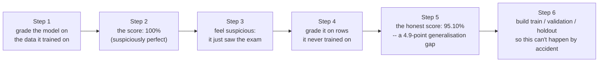
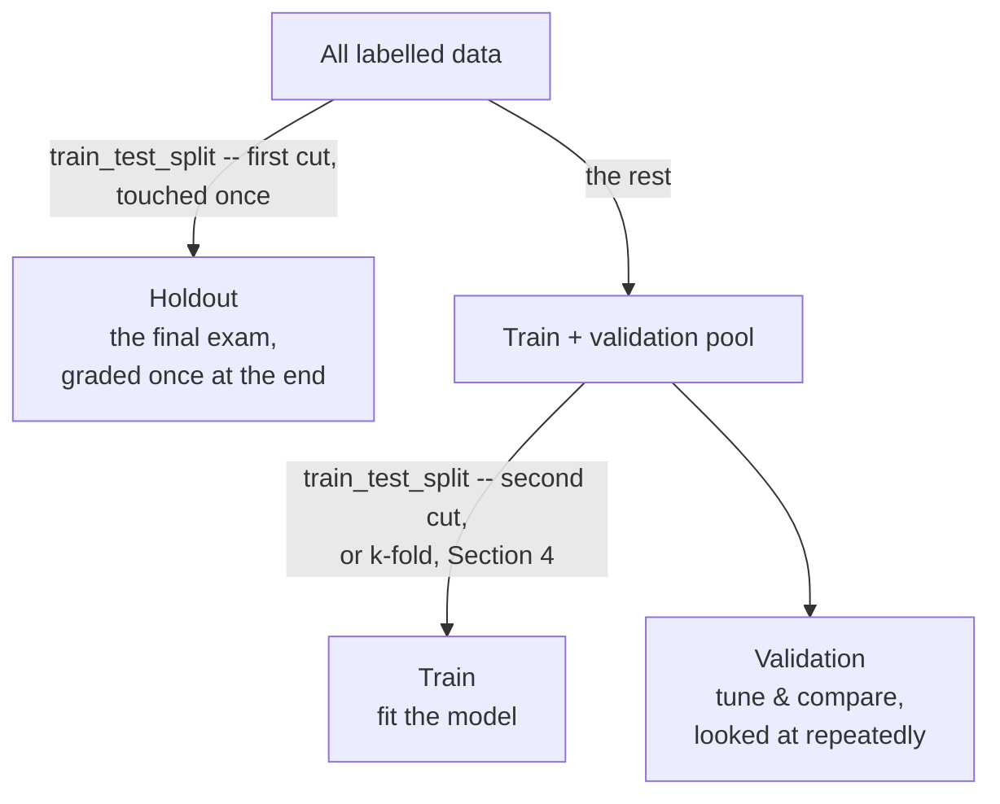
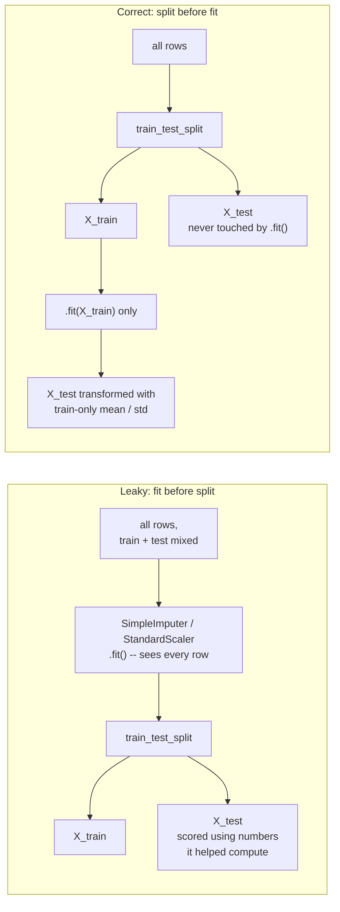
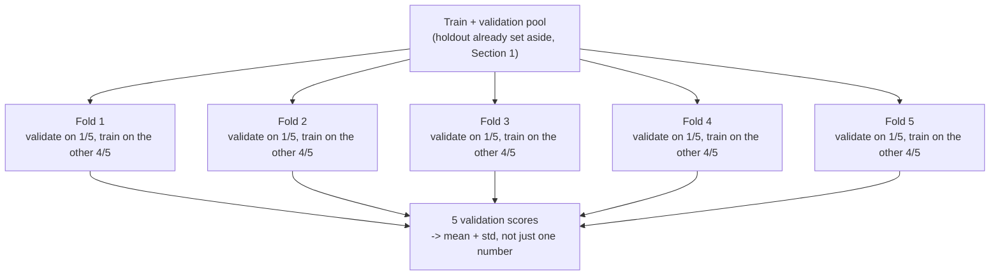
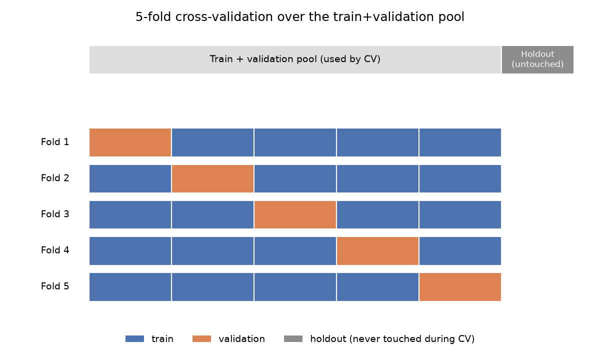
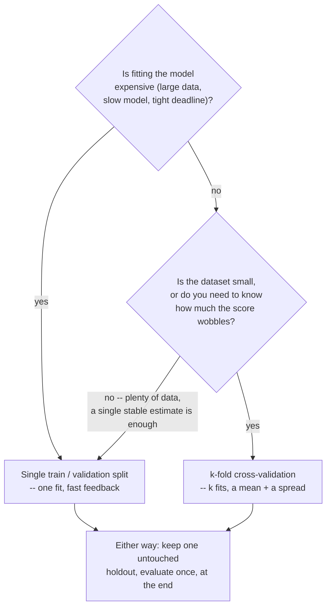

# Train / Validation / Holdout — Why We Split, and Data Leakage

*Data Science · Worked Examples · SPEC-DS-4*

## The exam the model already saw

Here's the fastest way to make a model look brilliant: grade it on the exact questions it already
knows the answers to.

**Step 1 — grade the naive way.** Fit a nearest-neighbour classifier — the simplest model there
is, it predicts a row's label by copying whichever training row it looks most like — on all 569
rows of a real medical dataset (tumour measurements, malignant vs. benign). Then score it on
those same 569 rows.

```python
from sklearn.datasets import load_breast_cancer
from sklearn.neighbors import KNeighborsClassifier
from sklearn.pipeline import Pipeline
from sklearn.preprocessing import StandardScaler

data = load_breast_cancer()
X, y = data.data, data.target

pipe_same_data = Pipeline([("scaler", StandardScaler()), ("knn", KNeighborsClassifier(n_neighbors=1))])
pipe_same_data.fit(X, y)
same_data_score = pipe_same_data.score(X, y)
print(f"graded on the SAME data it trained on : {same_data_score:.4f}")
```

```text
graded on the SAME data it trained on : 1.0000
```

**Step 2 — look at the score.** 100.00%. Perfect. Every single row, correctly classified.

**Step 3 — feel suspicious.** A 1-nearest-neighbour model predicts by finding the closest row in
its training data and copying its label. When you score it on the *same* rows it trained on, every
row's closest match is itself, at distance zero. It didn't learn to distinguish malignant from
benign tumours — it memorized 569 answer keys and is now reading them back to you. This is exactly
the trap of grading a student on the precise exam they saw the answer sheet for: of course they
score 100%, and that number tells you nothing about whether they learned the material.

**Step 4 — grade it honestly instead.** Hold back a quarter of the rows *before* fitting anything,
and score the model only on rows it never touched during training:

```python
from sklearn.model_selection import train_test_split

X_train, X_test, y_train, y_test = train_test_split(
    X, y, test_size=0.25, random_state=42, stratify=y
)
pipe_holdout = Pipeline([("scaler", StandardScaler()), ("knn", KNeighborsClassifier(n_neighbors=1))])
pipe_holdout.fit(X_train, y_train)
holdout_score = pipe_holdout.score(X_test, y_test)
print(f"graded on a held-out 25% it never saw : {holdout_score:.4f}")
```

```text
graded on a held-out 25% it never saw : 0.9510
```

**Step 5 — name the gap.** $100.00\% - 95.10\% = 4.90$ **percentage points**, and that gap has a
name: the difference between how a model scores on data it studied versus data it's never seen is
its **generalisation gap**. A big gap means the model memorized instead of learning the underlying
pattern — the technical word for that is **overfitting** — and the only way you'd ever catch it is
by scoring on data the model didn't get to study first.

**Step 6 — build a discipline that makes Step 1's mistake impossible by construction.** That's what
the rest of this chapter is: **train**, **validation**, and **holdout** splits, and the rule that
*nothing* — not the model, not a scaler, not an imputer — gets to see holdout data before it's
graded on it.



You already know this discipline under a different name. A green unit-test suite doesn't mean the
service works in staging, and a green staging run doesn't mean it'll survive production traffic —
you keep those three environments separate on purpose: unit tests give you fast, cheap, per-change
feedback; staging tells you whether the *whole system* behaves once it's assembled; production is
the one number that actually matters, and you don't get to re-run it until you like the answer.
Machine learning has the exact same three-tier structure, with different names:

| Testing (Java/CI) | ML | What it answers |
|---|---|---|
| Unit test | **Train split** | "Can the code/model even fit this pattern?" — the data the model directly learns from. |
| Staging / integration test, run repeatedly while you tune config | **Validation split** | "Which version of this thing should I ship?" — used over and over to compare models, hyperparameters, feature choices. |
| Production smoke test, or the one release you actually ship | **Holdout / test split** | "How will this behave on data it has genuinely never influenced?" — looked at *once*, at the end. |

Held-out evaluation is not a recent invention, either. The **holdout method** — setting aside part
of a sample specifically to check a fitted model against, rather than judging it on the data used
to fit it — traces to Larson's 1931 work in psychology, and **k-fold cross-validation** (§4 of this
chapter) was described in the 1960s by Mosteller and Tukey
([source: Wilimitis & Walsh, "Practical Considerations and Applied Examples of Cross-Validation for
Model Development and Evaluation in Health Care: Tutorial," *JMIR AI*,
2023](https://pmc.ncbi.nlm.nih.gov/articles/PMC11041453/), checked 2026-09-03; cross-checked
against [Arlot & Celisse, "A survey of cross-validation procedures for model selection," *Statistics
Surveys* 4 (2010): 40–79](https://arxiv.org/abs/0907.4728), checked 2026-09-03). The problem this
chapter opens with — a model that looks great because it's being graded on its own study material —
is close to a century old, and the fix has always been the same one: don't grade it on what it
studied.

## 1. What & why

Validation and holdout look similar (both are "unseen" data at fit time) but serve different jobs,
and conflating them is the single most common way this discipline breaks:

- **Validation** is allowed to influence your decisions. You look at it repeatedly — comparing
  models, tuning hyperparameters, picking features — the same way you re-run a staging suite after
  every commit. Because you're using it to make choices, it's allowed to leak a *little* optimism
  into your sense of how good the model is (you're implicitly selecting the model that does best on
  it).
- **Holdout** is not allowed to influence anything. You touch it exactly once, after every decision
  is already locked in, to get an honest final number. The moment you look at holdout performance
  and go back to tweak the model, holdout has become a second validation set, and you no longer have
  an honest estimate of production performance — the same failure mode as "fixing the code until the
  smoke test passes" and calling that a valid smoke test.



This chapter covers the **simple, non-temporal case**: every row is an independent observation
(patients, transactions, users) and there's no risk of "future" rows leaking into "past" training
data. Time-series forecasting needs a different splitting strategy entirely — rows are not
independent across time, and a random split would let the model train on the future and be
"validated" on the past. That's covered in a forecasting-specific chapter later in the curriculum.

## 2. A clean split, and what `stratify` buys you

### 2.1 The dataset: Breast Cancer Wisconsin (Diagnostic)

This chapter uses `sklearn.datasets.load_breast_cancer()` — 569 tumour samples, 30 numeric
features computed from digitized images of a fine-needle aspirate (radius, texture, perimeter,
smoothness, etc.), and a binary target: `0` = malignant (212 samples), `1` = benign (357 samples).
It ships **inside** scikit-learn — no download, no separate licence to track, and it loads
identically every time, which is exactly what a reproducible teaching example needs. It's the same
dataset the cold open just used.

- **Source / documentation:**
  [sklearn.datasets.load_breast_cancer](https://scikit-learn.org/stable/datasets/toy_dataset.html#breast-cancer-wisconsin-diagnostic-dataset)
  (checked 2026-09-02) — originally from the UCI Machine Learning Repository, redistributed under
  scikit-learn's BSD licence as one of its bundled "toy datasets".
- **Verified against the installed environment** — this chapter's gate ran
  `load_breast_cancer()` against the pinned scikit-learn version below and confirmed shape
  `(569, 30)`, class counts `[212, 357]`, and feature names, matching the docs.
- Deliberately **not** the Palmer Penguins dataset from earlier chapters — at 344 rows and 3
  classes it's too small to show the leakage effect in Section 3 cleanly; 569 rows and a binary
  target is the smallest real dataset that keeps both the split and the leakage demo honest.

### Environment

```text
scikit-learn==1.9.0
numpy==2.5.2
matplotlib==3.11.1
scipy==1.18.1
Python 3.12+
```

Pinned and verified against PyPI on 2026-09-02
([source: NOTE-2-package-versions](../../research/NOTE-2-package-versions.md),
[source: NOTE-5-sklearn-core-apis](../../research/NOTE-5-sklearn-core-apis.md)). This chapter's
code and artefacts were generated and gated on **Python 3.13.7**, with every package above
installed at exactly the pinned version — no substitutions.

### 2.2 `train_test_split`

The one-line correct split — the same call the cold open used for Step 4, spelled out again on its
own:

```python
from sklearn.datasets import load_breast_cancer
from sklearn.model_selection import train_test_split

data = load_breast_cancer()
X, y = data.data, data.target

X_train, X_test, y_train, y_test = train_test_split(
    X, y, test_size=0.25, random_state=42, stratify=y
)
```

`train_test_split(*arrays, test_size=None, train_size=None, random_state=None, shuffle=True,
stratify=None)` — signature verified against the installed scikit-learn 1.9.0
([source: NOTE-5-sklearn-core-apis](../../research/NOTE-5-sklearn-core-apis.md)). Four arguments
matter here:

- **`test_size=0.25`** — fraction held out. 20–30% is a common default for a single split; there's
  no universal "correct" number, it trades off how much data the model gets to train on against how
  precise your held-out estimate is.
- **`random_state=42`** — without it, every run reshuffles differently and your results aren't
  reproducible. Same idea as pinning a seed in a property-based test so a failure is reproducible,
  not "it failed once and I can't get it back."
- **`shuffle=True`** (the default) — rows are shuffled before splitting. This is correct here
  because rows are independent; for time-series data you'd set this `False` and split
  chronologically instead (the forecasting chapter covers why).
- **`stratify=y`** — the one worth a dedicated demo, next.

### 2.3 Why `stratify` matters

**So how do you know a random split hasn't quietly handed you a skewed test set?** Without
`stratify`, `train_test_split` shuffles and cuts — the class balance in your test set is whatever
falls out of that particular random draw. With an imbalanced target (this dataset is 37%/63%, and
many real problems — fraud, churn, disease — are far more skewed than that), an unlucky draw can
hand you a test set whose class balance doesn't match reality, which distorts every metric you
compute on it. `stratify=y` fixes the split to preserve the target's class proportions in both
pieces — the same instinct as building a test dataset that mirrors production data's shape rather
than sampling it randomly and hoping.

```python
import numpy as np

overall_counts = np.bincount(y)
print("overall:", overall_counts, overall_counts / overall_counts.sum())

# A test_size=0.1 split makes the sampling-luck effect easy to see
_, _, _, y_test_no_strat = train_test_split(X, y, test_size=0.1, random_state=4)
_, _, _, y_test_strat = train_test_split(X, y, test_size=0.1, random_state=4, stratify=y)

print("no stratify, test set:", np.bincount(y_test_no_strat))
print("stratify=y,  test set:", np.bincount(y_test_strat))
```

```text
overall: [212 357] [0.37258348 0.62741652]
no stratify, test set: [16 41] [28.1% 71.9%]
stratify=y,  test set: [21 36] [36.8% 63.2%]
```

The unstratified test set drifted almost 9 points off the true malignant rate (28.1% vs. 37.3%) —
easy to happen with a 57-row test split. The stratified one lands within a point of the true
proportion. There is essentially no cost to using `stratify=y` for classification, so use it by
default whenever your target is categorical.

## 3. The leakage demo: fit on the whole dataset, get an optimistic score

The cold open's trap was loud and obvious — a 100% score is easy to distrust on sight. This
section's trap is quieter: it doesn't touch the model at all, it hides one step earlier, in
*preprocessing* — and it can pass code review without anyone noticing, which is exactly why it's
worth a whole section.

### 3.1 The bug

Real datasets have missing values, and every model needs numeric, similarly-scaled input — so a
typical pipeline imputes missing values (`SimpleImputer`) and scales features (`StandardScaler`)
before fitting a model. The bug is choosing *when* to fit those two transformers:

```python
# WRONG: fit imputer + scaler on the whole dataset, THEN split
X_imputed = SimpleImputer(strategy="mean").fit_transform(X)   # sees every row, incl. test
X_scaled = StandardScaler().fit_transform(X_imputed)          # sees every row, incl. test
X_train, X_test, y_train, y_test = train_test_split(X_scaled, y, test_size=0.25, stratify=y)
```



`SimpleImputer.fit()` computes each column's mean from *every row it's given* — call it on `X`
before splitting, and the mean used to fill missing values in your training rows was computed
partly from your test rows. Same for `StandardScaler`: the mean and standard deviation it uses to
rescale every column were computed with test rows folded in. In both cases, information that should
only exist in the held-out set has leaked into the numbers your model trains on. This is exactly
the "the smoke-test data leaked into the fixture" bug — invisible in the code (nothing throws,
nothing looks wrong), and it makes your validation score too optimistic, in a way that will not
reproduce once you deploy and start scoring genuinely new rows.

### 3.2 Proof the leak is real: the fitted numbers differ

Before looking at any accuracy score, prove the mechanism itself is real by comparing what
`SimpleImputer` and `StandardScaler` actually learn depending on what you fit them on. First,
inject realistic missing values (15 of the 30 columns, each cell missing independently with 50%
probability — 4,289 of 17,070 cells, 25.1%) so there's something for the imputer to do:

```python
import numpy as np

rng = np.random.default_rng(42)
missing_columns = list(range(15))
mask = rng.random((X.shape[0], len(missing_columns))) < 0.5
X_missing = X.copy()
for i, col in enumerate(missing_columns):
    X_missing[mask[:, i], col] = np.nan
```

Now fit an imputer and a scaler two ways — on the training split only (correct), and on the whole
dataset before splitting (leaky) — and compare the fitted parameters directly:

```python
from sklearn.impute import SimpleImputer
from sklearn.preprocessing import StandardScaler

X_train, X_test, y_train, y_test = train_test_split(
    X_missing, y, test_size=0.25, random_state=42, stratify=y
)

imputer_train_only = SimpleImputer(strategy="mean").fit(X_train)
imputer_whole_data = SimpleImputer(strategy="mean").fit(X_missing)  # LEAK: saw X_test too

scaler_train_only = StandardScaler().fit(imputer_train_only.transform(X_train))
scaler_whole_data = StandardScaler().fit(imputer_whole_data.transform(X_missing))  # LEAK
```

```text
SimpleImputer.statistics_ (mean), first 3 columns with missing values:
  fit on TRAIN only : [14.0088 19.7482 93.6967]
  fit on WHOLE data : [14.092  19.9099 93.0799]  <- saw the test rows

StandardScaler.scale_ (std-dev used to divide), same 3 columns:
  fit on TRAIN only : [ 2.384   3.1635 17.0384]
  fit on WHOLE data : [ 2.441  3.024 16.662]  <- saw the test rows
```

The numbers are different — not by a lot, but the leak is not hypothetical: the "whole data" column
of every one of these tables was computed with your test rows sitting inside it. This is the part
most treatments of leakage skip: they show you a dramatic score gap and let you assume that's *how
big the leak always is*. It isn't. What you've just shown is the mechanism. What it costs you in
your final score depends entirely on how different those two columns of numbers turn out to be — and
on this dataset, at this split size, the answer is: barely anything you'd notice.

```python
from sklearn.linear_model import LogisticRegression
from sklearn.pipeline import Pipeline

# correct: every transform fit on X_train only
correct_pipe = Pipeline([
    ("imputer", SimpleImputer(strategy="mean")),
    ("scaler", StandardScaler()),
    ("clf", LogisticRegression(max_iter=2000)),
])
correct_pipe.fit(X_train, y_train)
correct_acc = correct_pipe.score(X_test, y_test)

# leaky: impute + scale the WHOLE dataset, then split
X_leaky = StandardScaler().fit_transform(SimpleImputer(strategy="mean").fit_transform(X_missing))
X_train_l, X_test_l, y_train_l, y_test_l = train_test_split(
    X_leaky, y, test_size=0.25, random_state=42, stratify=y
)
leaky_acc = LogisticRegression(max_iter=2000).fit(X_train_l, y_train_l).score(X_test_l, y_test_l)
```

```text
correct (fit-on-train-only) : 0.965035
leaky   (fit-on-whole-data) : 0.965035
```

Identical to six decimal places. On a 569-row dataset with a 75/25 split, the difference between a
mean computed from 427 rows and a mean computed from 569 rows is too small to move a logistic
regression's decision boundary at all. **The leak is real and the bug is still there — it just isn't
costing you anything measurable at this scale.** That's precisely why this bug survives code review:
nothing about running it once on a normal-sized dataset tells you it's wrong.

### 3.3 Making the leak visible: shrink the training set

**So when does this actually cost you something?** The size of this specific leak scales with how
much a training-only estimate of the mean/std diverges from the population's — and that divergence
grows as your training set shrinks relative to the whole dataset. So: take the same leaky-vs-correct
comparison, shrink the training set to about 5% of the data (~28 rows — a realistic stand-in for an
early pilot study, where you might only have a few dozen labelled patients so far), and repeat the
split 200 times with different seeds so a single lucky or unlucky draw can't decide the story:

```python
from scipy import stats

def leaky_once(seed, test_size=0.95):
    X_i = SimpleImputer(strategy="mean").fit_transform(X_missing)      # LEAK
    X_s = StandardScaler().fit_transform(X_i)                          # LEAK
    Xtr, Xte, ytr, yte = train_test_split(X_s, y, test_size=test_size, random_state=seed, stratify=y)
    return LogisticRegression(max_iter=2000).fit(Xtr, ytr).score(Xte, yte)

def correct_once(seed, test_size=0.95):
    Xtr, Xte, ytr, yte = train_test_split(X_missing, y, test_size=test_size, random_state=seed, stratify=y)
    pipe = Pipeline([("imputer", SimpleImputer(strategy="mean")),
                      ("scaler", StandardScaler()),
                      ("clf", LogisticRegression(max_iter=2000))])
    pipe.fit(Xtr, ytr)
    return pipe.score(Xte, yte)

leaky_scores = np.array([leaky_once(s) for s in range(200)])
correct_scores = np.array([correct_once(s) for s in range(200)])
t_stat, p_value = stats.ttest_rel(leaky_scores, correct_scores)
```

```text
leaky   (fit-on-whole-data) mean accuracy: 0.9325 (std 0.0187)
correct (fit-on-train-only) mean accuracy: 0.9281 (std 0.0188)
mean gap (leaky - correct): +0.0043
paired t-test: t=5.238, p=4.126e-07
leaky scored strictly higher in 121/200 repeats (17 ties, correct never won by more repeats than leaky)
```

Now the gap is unmistakably real: `scipy.stats.ttest_rel` runs a **paired t-test** — the right test
here because both pipelines are evaluated on the *same* 200 random seeds, so it's testing whether
the *within-seed difference* is consistently non-zero, not just whether the two score distributions
overlap ([source: scipy.stats.ttest_rel docs](https://docs.scipy.org/doc/scipy/reference/generated/scipy.stats.ttest_rel.html),
checked 2026-09-02). A p-value of `4.1e-07` says this gap is not noise, and the leaky pipeline never
lost more often than it won across 200 repeats.


**The lesson isn't "leakage always inflates your score by a lot."** It's the opposite, and more
useful: this exact bug can sit in your code invisibly for months on a large, comfortable dataset
(Section 3.2), and then quietly bite you the moment you're working with less data — a new product
launch, an expensive-to-label domain, an early pilot — exactly when getting an honest number matters
most. **Always fit preprocessing inside a `Pipeline`, regardless of how big today's dataset is.**
`Pipeline(steps, *, transform_input=None, memory=None, verbose=False)` chains transformers and a
final estimator behind one `fit`/`predict` contract — think of it as a builder that guarantees every
step only ever sees `fit()`-time data
([source: NOTE-5-sklearn-core-apis](../../research/NOTE-5-sklearn-core-apis.md)). Call
`pipe.fit(X_train, y_train)` and every step — imputer, scaler, model — fits on `X_train` alone;
`pipe.score(X_test, y_test)` transforms `X_test` using the *already-fitted* transformers, never
refitting on it. There is no way to accidentally leak through a `Pipeline` the way you can by calling
`fit_transform` on the whole dataset by hand.

## 4. k-fold cross-validation

`Pipeline` fixed *how* you fit — every transformer now only ever sees training rows. But it hasn't
fixed a different problem: a single split still only gives you *one* number, and that number is at
the mercy of exactly which rows happened to land in your validation set.

### 4.1 The problem a single holdout can't solve

Run the correct pipeline's 5-fold cross-validation on this dataset and look at the spread across
folds:

```python
from sklearn.model_selection import StratifiedKFold, cross_val_score

pipe = Pipeline([
    ("imputer", SimpleImputer(strategy="mean")),
    ("scaler", StandardScaler()),
    ("clf", LogisticRegression(max_iter=2000)),
])
cv = StratifiedKFold(n_splits=5, shuffle=True, random_state=42)
scores = cross_val_score(pipe, X_missing, y, cv=cv, scoring="accuracy")
```

```text
per-fold accuracy: [0.9825, 0.9474, 0.9474, 0.9649, 0.9823]
mean=0.9649, std=0.0157, range=[0.9474, 0.9825]
```

A single 80/20 holdout only ever shows you *one* of these five numbers. Depending on which fifth of
the data you happened to hold out, you'd have reported anywhere from 0.947 to 0.982 — a 3.5-point
spread that has nothing to do with model quality and everything to do with which rows you got.
`cross_val_score(estimator, X, y=None, *, groups=None, scoring=None, cv=None, ...)` and
`StratifiedKFold(n_splits=5, *, shuffle=False, random_state=None)` — both verified against the
installed scikit-learn 1.9.0
([source: NOTE-5-sklearn-core-apis](../../research/NOTE-5-sklearn-core-apis.md)). `StratifiedKFold`
is the classification analogue of `stratify=y`: it keeps each fold's class balance close to the
overall dataset's, same reasoning as Section 2.3.

### 4.2 How it works, and the trade-off

k-fold CV splits the **train+validation pool** — everything except the holdout you set aside up
front — into `k` equally-sized folds. It then trains `k` separate models, each time using `k-1`
folds to train and the remaining fold to validate, rotating which fold plays validation. Every row
gets used for training in `k-1` of the `k` rounds, and for validation in exactly one round — so you
get `k` validation scores computed from `k` different models, instead of one score from one model:
effectively, every row gets to play "test" exactly once, instead of only the lucky (or unlucky)
20% that a single split happens to hold out.





Note where the holdout sits in this picture: it is set aside **before** cross-validation starts and
never enters the CV loop at all. CV replaces the *single validation split* from Section 1's table —
it does not replace the holdout. You still keep one final, untouched slice to report your honest
number once, at the end, exactly as Section 1 described.

The trade-off is straightforward: `k` models instead of 1 means `k`× the training time, in exchange
for a mean and a standard deviation instead of a single point estimate — you learn not just "how
good" the model is but "how much does that number wobble depending on the split," which single-split
validation can never tell you. A common default is `k=5` or `k=10`; smaller `k` is cheaper but each
fold's validation score is noisier (fewer rows per fold), larger `k` is more expensive but more
stable. For hyperparameter search specifically, **nested CV** (an outer CV loop wrapping an inner CV
loop used for tuning) avoids a subtler leak — picking hyperparameters using the same folds you then
report scores from — but that's beyond this chapter's scope; the scikit-learn user guide's
[Nested versus non-nested cross-validation](https://scikit-learn.org/stable/auto_examples/model_selection/plot_nested_cross_validation_iris.html)
example is the reference if you need it.

**Picking between the two** comes down to how expensive a fit is and how much you need to know
about the score's stability, not a hard rule:



## 5. Pitfalls

### 5.1 Leaking through preprocessing (recap)

Covered in full in Section 3: fitting `SimpleImputer`, `StandardScaler`, or any other transformer
on data that includes your validation or holdout rows. The fix is always the same — wrap every
preprocessing step in a `Pipeline` and only ever call `.fit()` on the training split.

### 5.2 Leaking through duplicate rows

Real datasets accumulate duplicate or near-duplicate rows — a re-exported record, a retried API
call that got logged twice, the same patient scanned twice. If a plain random split doesn't check
for duplicates first, some of those pairs will land with one copy in train and the other in test —
and your model can effectively "memorize" the answer for its own twin, the same trick the cold open
opened with, just smuggled in through the data instead of the split. This demo duplicates 15% of
the rows (simulating exactly that kind of export bug), splits without deduplicating, and counts how
many duplicate pairs got split across train and test purely by chance:

```python
rng = np.random.default_rng(7)
noise = rng.normal(size=(X.shape[0], 40))
X_hard = np.hstack([X, noise])  # extra noise columns so the task isn't trivially easy

dup_idx = rng.choice(X_hard.shape[0], size=int(0.15 * X_hard.shape[0]), replace=False)
X_dup = np.vstack([X_hard, X_hard[dup_idx]])
y_dup = np.concatenate([y, y[dup_idx]])
original_row_id = np.concatenate([np.arange(X_hard.shape[0]), dup_idx])

Xtr, Xte, ytr, yte, id_tr, id_te = train_test_split(
    X_dup, y_dup, original_row_id, test_size=0.25, random_state=0, stratify=y_dup
)
split_across = set(id_tr.tolist()) & set(id_te.tolist())
```

```text
duplicated 85 rows; 35 of them ended up with one copy in train and the other in test, purely from a random shuffle.

1-NN accuracy WITH duplicate-row leak   : 0.9329
1-NN accuracy deduplicated BEFORE split : 0.9161
```

41% of the duplicated rows (35 of 85) got split across train and test on this one run — a random
shuffle has no idea two rows are "the same" and makes no attempt to keep them together. A 1-nearest-
neighbour classifier — which literally predicts by copying its closest training point's label —
picks up a real, measurable accuracy bump (0.9329 vs. 0.9161) from getting to "recognize" its own
twin in the test set. **The fix: deduplicate (or de-duplicate near-duplicates by whatever key
identifies "the same real-world thing") *before* you split, not after.**

### 5.3 Leaking through the target

The most dangerous leak, because it doesn't need a coding mistake at all — just a feature that was
recorded *after* the outcome was already known. Classic examples: a "resolution timestamp" column
when predicting whether a support ticket will be escalated, or a lab field that only gets filled in
once a diagnosis is confirmed. The tell is almost always the same one the cold open trained you to
notice: cross-validated accuracy that's suspiciously close to perfect for a real-world, noisy
problem.

```python
leaked_column = y.astype(float).reshape(-1, 1)  # stand-in for "a field only set after diagnosis"
X_with_leak = np.hstack([X, leaked_column])

cv = StratifiedKFold(n_splits=5, shuffle=True, random_state=42)
honest_scores = cross_val_score(
    Pipeline([("scaler", StandardScaler()), ("clf", LogisticRegression(max_iter=2000))]),
    X, y, cv=cv, scoring="accuracy",
)
leaked_scores = cross_val_score(
    Pipeline([("scaler", StandardScaler()), ("clf", LogisticRegression(max_iter=2000))]),
    X_with_leak, y, cv=cv, scoring="accuracy",
)
```

```text
honest (30 real features)       CV accuracy: [0.9737, 0.9474, 0.9649, 0.9912, 0.9912], mean=0.9737
with target-leaking column       CV accuracy: [1.0, 1.0, 0.9912, 1.0, 1.0], mean=0.9982
```

99.82% mean accuracy, with four of five folds at a perfect 1.0 — on a real medical diagnosis
problem, that number should make you suspicious, not proud. **Any time cross-validated performance
looks too good for how messy the real problem is, the first thing to check is whether one of your
features can only exist because the outcome is already known.**

### 5.4 Peeking at the holdout

This one has no code demo because the bug isn't in any single line — it's in a workflow habit.
Evaluate on the holdout, don't like the number, go back and adjust the model, evaluate on holdout
again, repeat. Each time you do this, you're using the holdout to make a decision — which is exactly
what validation is for — except you're calling it "holdout" and reporting its final number as if it
were untouched. It's the same failure mode as re-running a flaky test until it goes green and then
reporting "all tests pass": technically true of that one run, meaningless as a claim about the
system. **Evaluate on holdout once, after every model and hyperparameter decision is already final,
and report that number regardless of whether you like it.** If you need to go back and iterate
further, you no longer have a valid holdout — you need a fresh one, or you need to accept that your
reported number is now optimistic.

## 6. Recap & what's next

- **The cold open's trap, in one sentence:** grading a model on the data it trained on can make it
  look far better than it is — a 1-NN model scored 100% on its own training rows and 95.10% on rows
  it had never seen, a 4.9-point generalisation gap that only showed up once the model was graded
  honestly.
- **Train** fits the model, **validation** is what you tune against (repeatedly, like a staging
  suite), **holdout** is the one honest number you look at once — the same discipline as unit vs.
  integration vs. production smoke tests.
- `train_test_split(..., stratify=y)` keeps class proportions consistent across the split; skip it
  and an unlucky draw can quietly distort your target's balance in the piece you're evaluating on.
- **Fit preprocessing (`SimpleImputer`, `StandardScaler`, anything with a `.fit()`) inside a
  `Pipeline`, on the training split only — never on the whole dataset before splitting.** The leak
  is always real (Section 3.2 proved the fitted numbers differ), but how much it costs you scales
  with how small your training set is relative to the population (Section 3.3) — which means it can
  look perfectly harmless on today's comfortable dataset and still be a live bug waiting for a
  smaller one.
- **k-fold cross-validation** (`cross_val_score` + `StratifiedKFold`) replaces a single validation
  split with `k` of them, trading `k`× the compute for a mean *and* a spread — telling you not just
  how good the model is but how much that number would have wobbled on a different split. It
  doesn't replace the holdout, which still sits outside the CV loop entirely.
- Watch for three leakage shapes beyond preprocessing: **duplicate rows** split across train/test,
  a **feature that encodes the target** (the "too good to be true" smell test), and **peeking at the
  holdout** by iterating after you've looked at it.

Everything here assumed independent, order-free rows. **SPEC-DS-9 (forecasting)** picks up exactly
where this chapter drew its boundary: what changes when rows are time-ordered and a random shuffle
would let the model train on the future. **[DS-20](15-calibration-ranking-imbalanced.md)** picks up a
related but distinct case: independent rows (not one sequential series) that each carry a *timestamp*
— the risk there isn't leaking a correlated future value, it's a random split hiding population drift
between the training era and the future; a single out-of-time cutoff (train ≤ cutoff, test > cutoff)
exposes it. Before that, **SPEC-DS-5 (regression on NYC taxi fares)**
is the next chapter — it puts this chapter's split-and-validate discipline to work training and
comparing real regression models, and is the first chapter where `Pipeline` graduates from "the fix
for leakage" to "how you build every model from here on."

---

### Environment note (for the architect)

NOTE-2 flagged that `numpy>=2.5.2` and `scipy>=1.18.1` require Python `>=3.12`, while this chapter's
gate ran on **Python 3.13.7** — all four pinned versions (`scikit-learn==1.9.0`, `numpy==2.5.2`,
`matplotlib==3.11.1`, `scipy==1.18.1`) installed and ran with no substitution, so there is no
discrepancy to report for this environment (same finding as the DS-1 chapter's environment note).
`sklearn.datasets.load_breast_cancer` is not itself one of NOTE-5's tabulated APIs; its loader was
verified directly against this environment's installed scikit-learn 1.9.0 (shape, class counts, and
feature names all confirmed to match the official docs) rather than assumed from memory — see
Section 2.1. The cold open's illustrative 1-NN same-data-vs-holdout snippet (`same_data_score`,
`holdout_score`) was run against this same environment; its output (`1.0000`, `0.9510`) is not
generated by `code/splitting_and_leakage.py` (which uses `KNeighborsClassifier(1)` only in the
Section 5.2 duplicate-rows pitfall, on a noise-augmented feature matrix) — it's a standalone
two-line illustration kept out of the committed script because its only job is the cold open's
narrative, not a reusable pipeline stage.
