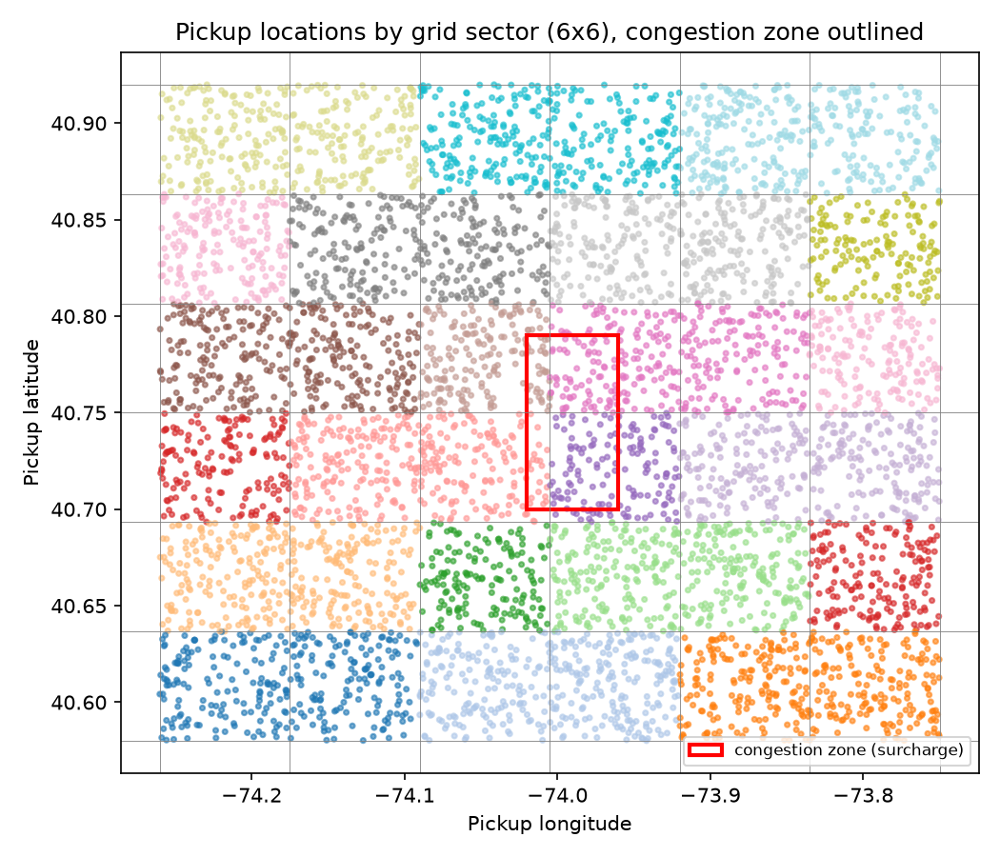
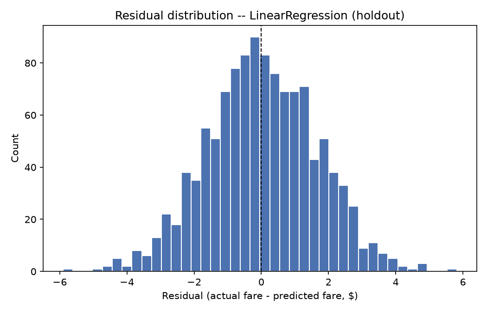
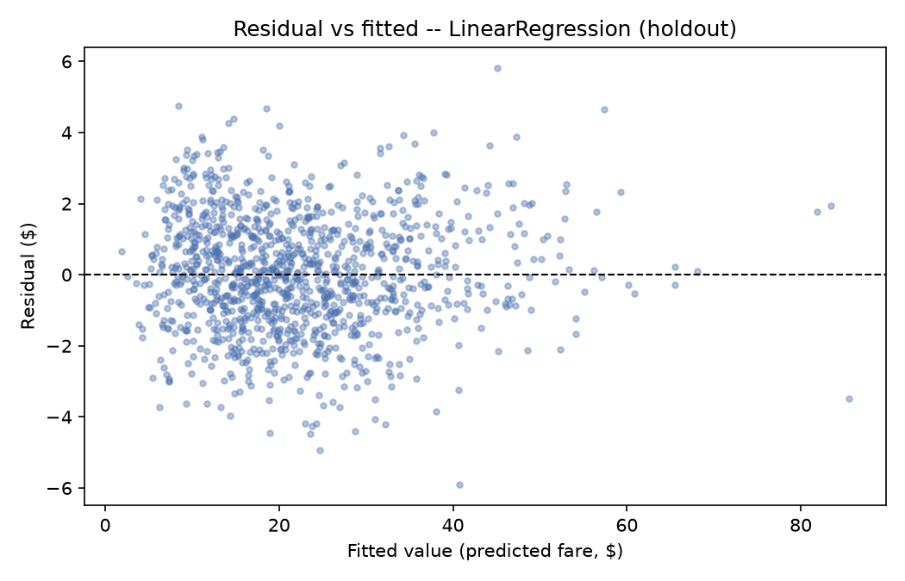
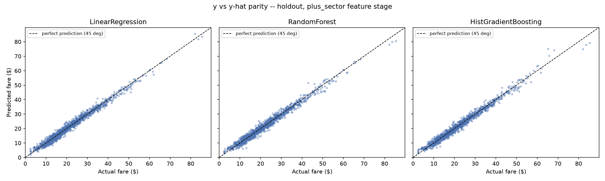
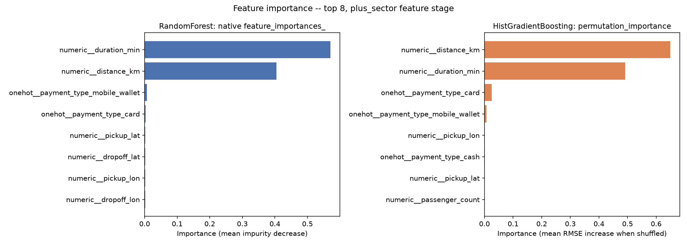

# Regression: Predicting NYC Taxi Fares

*Data Science · Worked Examples · SPEC-DS-5*

You've written a pricing function before, even if nobody called it that. A shipping-cost
calculator, a cloud-billing estimator, a SaaS seat-price quote — all of them take some inputs
(weight, region, usage, seat count) and return a dollar figure, usually `base + rate * quantity`,
sometimes with a few `if` branches for surcharges. **Regression is what you do when you don't get
to hand-write that formula — you have to learn its coefficients from examples.**

This chapter learns a pricing function for NYC taxi fares from trip data: pickup/dropoff
coordinates, passenger count, payment method, traffic conditions — predict the fare. Along the
way it covers the five standard regression metrics, three model families (linear, bagged trees,
boosted trees) and why the second usually beats the first, engineering real features out of raw
GPS coordinates, why some models need scaled/encoded inputs and others don't, and how to tell
whether a fitted model is trustworthy or quietly biased.

## 1. What & why

A Java engineer's classifier intuition ("which bucket does this go in?") doesn't transfer
directly here. **Regression predicts a number, not a category** — not "is this fare high or low"
but "what is this fare, in dollars, to two decimal places." The loss functions, the diagnostics,
and the pitfalls are all shaped by that difference, which is why this chapter exists separately
from the classification chapter that comes after it.

The concrete scenario: you're the backend engineer for a ride-hailing service. Someone asks for a
fare *estimate* before the trip starts — you have pickup/dropoff coordinates, a passenger count,
a payment method on file, and a live traffic signal, but you don't have the actual metered fare
yet (that only exists after the trip ends). You need a function `f(features) -> dollars`. You
could hand-write `2.50 + 2.50 * distance_km + 0.35 * duration_min` — and in fact that's close to
how real taxi meters work — but you don't know the exact rate structure, and it probably isn't
perfectly linear (short hops cost more per km than long ones; surge pricing kicks in during
traffic). Regression fits that function from historical trips instead of you guessing it.

## 2. The data

### 2.1 Why synthetic data

The authoritative source for real NYC trip data is the NYC Taxi & Limousine Commission (TLC), and
it's genuinely free — but the format changed from CSV to Parquet in May 2022, a single month's
file runs 100MB–1GB, and the full 2009–2025 archive is roughly 50GB across ~1.5 billion rows,
served from an S3 bucket. The Kaggle "NYC Taxi Fare Prediction" alternative is 5.5GB and requires
a Kaggle login. Neither fits "clone the repo, run one script, get a result in seconds"
([source: NOTE-7-nyc-taxi-dataset](../../research/NOTE-7-nyc-taxi-dataset.md), checked
2026-09-02).

So this chapter **synthesizes** a NYC taxi dataset instead: random pickup/dropoff coordinates
inside NYC's bounding box, a haversine-computed trip distance, a traffic-aware duration, and a
fare built from a rate structure with a couple of deliberate wrinkles (more on those in §5–§7).
This is a judgment call, not a shortcut — NOTE-7 explicitly recommends it as the fallback path the
spec allows when no small, freely-licensed real sample exists, and it has a real pedagogical
upside: because we wrote the generator, we know the *true* fare function, so every "did the model
learn the right thing" question in this chapter has a verifiable answer. If you want to point this
same code at real data later, TLC's official page is
https://www.nyc.gov/site/tlc/about/tlc-trip-record-data.page (checked 2026-09-02) — the column
schema in `regression_taxi.py`'s output matches the shape (pickup/dropoff coordinates, passenger
count, distance, duration, fare) of the real Yellow Taxi trip records.

### 2.2 The haversine formula

Straight-line distance between two GPS points isn't Euclidean distance on lat/long — degrees of
longitude get physically shorter as you move away from the equator. The **haversine formula**
computes great-circle distance correctly on a sphere:

```python
import numpy as np


def haversine_km(
    lat1: np.ndarray, lon1: np.ndarray, lat2: np.ndarray, lon2: np.ndarray, radius_km: float = 6371.0
) -> np.ndarray:
    """Great-circle distance between two lat/lon points, in kilometres.

    Formula verified against Baeldung and Underground Mathematics (Cambridge) --
    research/NOTE-7-nyc-taxi-dataset.md. Inputs are degrees; Earth radius 6371 km (mean).
    """
    lat1_rad, lon1_rad = np.radians(lat1), np.radians(lon1)
    lat2_rad, lon2_rad = np.radians(lat2), np.radians(lon2)

    dlat = lat2_rad - lat1_rad
    dlon = lon2_rad - lon1_rad

    h = np.sin(dlat / 2) ** 2 + np.cos(lat1_rad) * np.cos(lat2_rad) * np.sin(dlon / 2) ** 2
    central_angle = 2 * np.arcsin(np.sqrt(h))
    return radius_km * central_angle
```

Formula and the 6371 km mean Earth radius verified against Baeldung's computer-science reference
and Cambridge's Underground Mathematics site
([source: NOTE-7-nyc-taxi-dataset](../../research/NOTE-7-nyc-taxi-dataset.md), checked
2026-09-02). It assumes a perfectly spherical Earth (real Earth is an oblate spheroid), which
introduces up to ~0.5% error — under 500m for any distance in this chapter's range, well within
noise. It also gives *straight-line* distance, always ≤ the actual road distance a meter would
record — a caveat worth keeping in mind before you trust it too far in production.

### 2.3 Generating the trips

Every synthesized trip gets a random pickup point inside NYC's bounding box (`lat` 40.58–40.92,
`lon` -74.26 to -73.75) and a dropoff a short random hop away. The fare is **not** a single global
`base + per_km * distance` line — it has two wrinkles that matter later in this chapter:

- **A rate kink:** trips ≤3km are charged $2.90/km; longer trips drop to $2.30/km (short-hop
  pricing, the way a delivery service charges more per item for a 1-item order).
- **A traffic surge multiplier:** the per-km rate gets multiplied by 1.00/1.10/1.25 depending on
  whether `traffic_level` is low/medium/high — layered *on top of* the kink, not just stretching
  the trip duration.
- **A flat congestion surcharge** ($2.75) for pickups inside a small "Manhattan-core" bounding box.
- **A non-monotonic payment adjustment:** cash is the $0 baseline, card carries a $1.50 surcharge,
  mobile-wallet gets a $3.00 promotional discount — there's no natural order to
  `card < cash < mobile_wallet`, which matters in §7 (encoding).

```python
base_fare, per_min = 2.50, 0.35
short_trip_rate, long_trip_rate = 2.90, 2.30
per_km = np.where(distance_km <= 3.0, short_trip_rate, long_trip_rate)
surge_multiplier_by_level = {"low": 1.00, "medium": 1.10, "high": 1.25}
surge_multiplier = np.array([surge_multiplier_by_level[t] for t in traffic_level])
effective_per_km = per_km * surge_multiplier

payment_adjustment_by_type = {"cash": 0.00, "card": 1.50, "mobile_wallet": -3.00}
payment_adjustment = np.array([payment_adjustment_by_type[p] for p in payment_type])

noise = rng.normal(0, 1.4, n_rows)
fare_amount = (
    base_fare
    + effective_per_km * distance_km
    + per_min * duration_min
    + congestion_surcharge
    + payment_adjustment
    + noise
)
fare_amount = np.maximum(fare_amount, 2.50)
```

Duration is derived from distance and a traffic-dependent speed (38/24/11 km/h for low/medium/high
traffic, plus noise), not generated independently — the way a real trip's duration really does
depend on how far you're going and how bad traffic is.

### 2.4 Dirty rows, and cleaning them

Real data is never this clean, so the generator deliberately injects four kinds of bad rows before
handing the dataset to anyone: a payment-terminal sign-flip (negative fares), GPS dropout (null
coordinates), a faulty passenger-count sensor (0 or 9 passengers), and a billing glitch (a flat
$400–$900 erroneously added on top of a real fare). Running the full generator
(`n_rows=6000, seed=42`) and cleaning it:

```python
def clean_trips(df: pd.DataFrame) -> pd.DataFrame:
    """Drop rows that fail basic sanity checks, reporting what was removed and why."""
    start_n = len(df)
    reasons: list[tuple[str, int]] = []

    missing_gps = df[["pickup_lat", "pickup_lon", "dropoff_lat", "dropoff_lon"]].isna().any(axis=1)
    reasons.append(("missing GPS coordinates", int(missing_gps.sum())))
    df = df.loc[~missing_gps]

    non_positive_fare = df["fare_amount"] <= 0
    reasons.append(("non-positive fare_amount", int(non_positive_fare.sum())))
    df = df.loc[~non_positive_fare]

    invalid_passengers = ~df["passenger_count"].between(1, 6)
    reasons.append(("passenger_count outside 1-6", int(invalid_passengers.sum())))
    df = df.loc[~invalid_passengers]

    # Domain sanity cap, not a statistical one: even a worst-case legitimate trip in this
    # dataset (~20 km at crawling 4 km/h traffic) tops out well under $150; the injected
    # billing-glitch rows add $400-$900 on top of the real fare, so $250 cleanly separates
    # the two without touching any genuine long/slow trip.
    unrealistic_fare = df["fare_amount"] > 250
    reasons.append(("fare_amount > $250 (billing glitch)", int(unrealistic_fare.sum())))
    df = df.loc[~unrealistic_fare]

    return df.reset_index(drop=True)
```

```text
=== cleaning report ===
rows before cleaning: 6000
  removed for missing GPS coordinates: 48
  removed for non-positive fare_amount: 42
  removed for passenger_count outside 1-6: 24
  removed for fare_amount > $250 (billing glitch): 18
rows after cleaning: 5868 (132 removed total)
```

Notice the last threshold: it's a **domain sanity check**, not a statistical one (not "3 standard
deviations from the mean"). You worked out the legitimate worst case analytically (~20km at the
slowest allowed speed, ~$150 max) and picked a cap comfortably above it and comfortably below the
injected glitches ($400+). This is the same instinct as an assertion in production code — a bound
you can justify from the domain, not a number you picked because it looked right on one sample.

The raw (uncleaned) dataset is committed at
[`datasets/nyc_taxi_synthetic_raw.csv`](datasets/nyc_taxi_synthetic_raw.csv) (6000 rows, seed 42,
fully reproducible) — download it, run `clean_trips()` yourself, and you'll get exactly this
report.

## 3. Metrics: MSE, RMSE, MAE, R²

Classification metrics answer "how many did I get right." Regression metrics answer "how far off
was I, on average, in the units I actually care about" — closer to a **loss function** than an
accuracy score, and in fact several of these literally *are* the loss functions used during
training.

| Metric | Formula | Units | Reads like |
|---|---|---|---|
| **MSE** (mean squared error) | mean((y − ŷ)²) | dollars² | the raw training loss for linear regression — squared, so large errors dominate |
| **RMSE** (root MSE) | sqrt(MSE) | dollars | "typical" error size, in the same units as the target — the one to quote to a stakeholder |
| **MAE** (mean absolute error) | mean(\|y − ŷ\|) | dollars | typical error size, but linear — one $50 miss counts the same as five $10 misses |
| **R²** (coefficient of determination) | 1 − SS_res / SS_tot | unitless, ≤1 | fraction of the target's variance your model explains; 1.0 = perfect, 0.0 = no better than predicting the mean |

**sklearn 1.9.0 changed how you compute RMSE.** The old pattern —
`mean_squared_error(y_true, y_pred, squared=False)` — no longer works: the `squared` parameter was
removed. You call the dedicated `root_mean_squared_error()` function instead
([source: NOTE-5-sklearn-core-apis](../../research/NOTE-5-sklearn-core-apis.md), checked
2026-09-02; confirmed against this project's installed `sklearn==1.9.0` — the old call raises
`TypeError: got an unexpected keyword argument 'squared'`):

```python
from sklearn.metrics import mean_absolute_error, mean_squared_error, r2_score, root_mean_squared_error


def regression_metrics(y_true: np.ndarray, y_pred: np.ndarray) -> dict:
    """MSE, RMSE, MAE, R2 -- verified sklearn 1.9.0 APIs, research/NOTE-5-sklearn-core-apis.md.

    NOTE: sklearn 1.9.0 removed the `squared=` kwarg from mean_squared_error(); RMSE must be
    computed via the dedicated root_mean_squared_error() function (added in 1.4, canonical
    since). `mean_squared_error(y_true, y_pred, squared=False)` raises TypeError on this
    install -- do not use that old pattern.
    """
    return {
        "mse": mean_squared_error(y_true, y_pred),
        "rmse": root_mean_squared_error(y_true, y_pred),
        "mae": mean_absolute_error(y_true, y_pred),
        "r2": r2_score(y_true, y_pred),
    }
```

Which one matters depends on the question. **RMSE** is the default choice when large errors should
hurt disproportionately (a $50 miss is worse than five $10 misses combined, e.g. because a huge
miss burns customer trust). **MAE** is the honest choice when every dollar of error matters
equally and you don't want one wild outlier dominating the number you report. **§9** of this
chapter shows exactly how far apart RMSE and MAE can drift because of a single bad row — keep that
distinction in mind now, it pays off later.

## 4. Three models, one holdout

The three model families this chapter compares, and the one-line pitch for each — the kind of note
you'd want in a design doc before picking one:

- **`LinearRegression`** — fits one global weighted sum of the features. Cheapest to train, easiest
  to explain, and (as §7 shows) its predictions genuinely don't change no matter how you scale
  the inputs. Only as good as the model can be if the true relationship really is close to linear.
- **`RandomForestRegressor`** — **bagging**: many decision trees, each trained on a bootstrap
  resample of the data with a random subset of features per split, predictions averaged. Reduces
  *variance* without touching bias much.
- **`HistGradientBoostingRegressor`** — **boosting**: trees trained *sequentially*, each one
  fitting the residual error the previous trees left behind. Reduces *bias*, at the cost of being
  more sensitive to how you tune it (§5).

All three are trained on the **same holdout split** (`train_test_split(clean, test_size=0.2,
random_state=42)` → 4694 train / 1174 test rows) across three progressively richer feature sets,
so every comparison below is apples-to-apples:

```python
model_specs = {
    "LinearRegression": (LinearRegression(), "standard"),
    "RandomForest": (RandomForestRegressor(n_estimators=200, max_depth=None, random_state=RNG_SEED, n_jobs=-1), None),
    # A lower learning_rate + more boosting rounds (max_iter) + shallower trees
    # (max_leaf_nodes) is the standard boosting recipe for squeezing out the sequential
    # residual-fitting advantage without overfitting -- see section 5's "default vs
    # tuned" demo for what happens with sklearn's out-of-the-box defaults instead.
    "HistGradientBoosting": (
        HistGradientBoostingRegressor(
            max_iter=300, learning_rate=0.05, max_leaf_nodes=15, min_samples_leaf=10, random_state=RNG_SEED
        ),
        None,
    ),
}
```

| stage | model | MSE | RMSE | MAE | R² |
|---|---|---|---|---|---|
| raw_coords | LinearRegression | 22.935 | 4.789 | 3.577 | 0.8267 |
| raw_coords | RandomForest | 10.774 | 3.282 | 2.514 | 0.9186 |
| raw_coords | HistGradientBoosting | 9.118 | 3.020 | 2.271 | 0.9311 |
| plus_distance | LinearRegression | 2.746 | 1.657 | 1.319 | 0.9793 |
| plus_distance | RandomForest | 2.971 | 1.724 | 1.363 | 0.9776 |
| plus_distance | HistGradientBoosting | 2.752 | 1.659 | 1.291 | 0.9792 |
| plus_sector | LinearRegression | 2.656 | 1.630 | 1.301 | 0.9799 |
| plus_sector | RandomForest | 2.966 | 1.722 | 1.359 | 0.9776 |
| plus_sector | HistGradientBoosting | 2.768 | 1.664 | 1.293 | 0.9791 |

(full table: [`artefacts/metrics_comparison.csv`](artefacts/metrics_comparison.csv))

Two things worth reading carefully here, because they'll come up again:

1. **`raw_coords`** (only the 4 raw lat/lon numbers, no engineered distance) is where the tree
   models crush plain linear regression — RMSE 3.02–3.28 for the trees vs 4.79 for
   `LinearRegression`. A tree can recursively split on latitude and longitude to *approximate* a
   distance-like function; a single linear term over 4 raw coordinates structurally can't express
   "how far apart are these two points" at all. §6 fixes this properly with an engineered feature.
2. **Once distance is engineered in, `LinearRegression` wins the aggregate table.** That's not a
   bug in the demo — it's an honest, common result: this dataset's true fare function is close to
   linear-plus-a-few-categorical-effects (§2.3), and a correctly-specified linear model has lower
   *variance* than an ensemble of trees when the truth actually is close to linear. Don't walk
   away thinking "trees always win" — walk away thinking "match model complexity to how nonlinear
   the true relationship actually is," which is exactly the lesson a senior engineer already
   applies when choosing between a lookup table and a rules engine.

## 5. Bagging vs boosting

**Bagging** (`RandomForestRegressor`) trains many trees *independently and in parallel*, each on a
different bootstrap resample of the training rows and a random subset of features at each split,
then averages their predictions. Averaging many noisy-but-unbiased estimators cancels out noise —
bagging is a **variance-reduction** technique. It doesn't make any single tree more accurate; it
makes the *ensemble* more stable than any one tree would be. This is the same idea as retrying a
flaky network call three times and taking the median latency instead of trusting one sample.

**Boosting** (`HistGradientBoostingRegressor`) trains trees *sequentially*: fit a small tree, look
at what it got wrong (the residuals), fit the next tree specifically to correct those residuals,
add it to the ensemble with a small weight (`learning_rate`), repeat. Each round is explicitly
chasing down the previous round's mistakes — boosting is a **bias-reduction** technique. This is
closer to iterative code review: round 1 catches the big bugs, round 2 catches what round 1
missed, and so on, each pass adding less than the last.

Because boosting directly targets error instead of just averaging away noise, **it usually edges
out bagging when it's tuned properly** — but "tuned properly" is doing real work in that sentence.
Unlike a random forest (which barely changes once you're past ~100 trees, since more bagging just
averages more noise away), a boosting model's error surface is genuinely sensitive to
`learning_rate`, `max_iter`, and tree depth. sklearn's out-of-the-box `HistGradientBoostingRegressor`
defaults (`max_iter=100, learning_rate=0.1`) are a much cruder search than 300 rounds at a gentler
0.05 with shallower leaves:

```text
=== bagging vs boosting: default HGB is not automatically the winner ===
  HGB (sklearn defaults: max_iter=100, lr=0.1)            RMSE=1.725  R2=0.9775
  HGB (tuned: max_iter=300, lr=0.05, max_leaf_nodes=15)   RMSE=1.664  R2=0.9791
  RandomForest (n_estimators=200)                         RMSE=1.722  R2=0.9776
```

Read that top-to-bottom: the **default** boosted model is a statistical tie with random forest
(1.725 vs 1.722) — boosting isn't automatically better. The **tuned** boosted model (lower
learning rate, more rounds, shallower trees — the standard boosting recipe) does edge ahead
(1.664). That gap between "default boosting" and "tuned boosting" *is* the overfitting risk the
spec asks you to understand: more boosting rounds at a higher learning rate can chase the training
residuals right past the point of generalizing, and unlike bagging, boosting has no built-in
"averaging" safety net against it. §10 shows `RandomizedSearchCV` as the systematic way to find
that tuning instead of hand-picking it.

## 6. Coordinate feature engineering

Raw pickup/dropoff coordinates are four numbers that don't mean anything to a linear model on
their own — `LinearRegression` can't discover "the distance between these two points" without
being handed that computation directly. §4 already showed the headline number:
`raw_coords -> plus_distance` cut `LinearRegression`'s RMSE from **4.789 to 1.657** — nearly a 3x
improvement — just from computing one haversine distance feature. That's the lift from turning
"four opaque coordinates" into "one number that means something."

### 6.1 The second feature: grid-sector bucketing

Distance and duration explain most of the fare, but not the $2.75 congestion surcharge from §2.3 —
that's a flat amount tied to *where* the pickup was, not how far or how long the trip took, and
raw continuous lat/lon can't express "this point is inside an irregular zone" without either a lot
of data or a very deep tree. The fix: bucket pickup coordinates into a coarse grid and treat the
bucket id as a categorical feature.

```python
def add_pickup_sector(df: pd.DataFrame, grid_n: int = GRID_N) -> pd.DataFrame:
    """Bucket pickup_lat/pickup_lon into a grid_n x grid_n grid over the NYC bounding box.

    This is the "map-sector" feature: a coarse neighbourhood id that lets a model learn
    location effects (like the congestion surcharge) that raw continuous lat/lon can't
    express without a very deep tree or a lot of data.
    """
    df = df.copy()
    lat_bins = np.linspace(NYC_LAT_MIN, NYC_LAT_MAX, grid_n + 1)
    lon_bins = np.linspace(NYC_LON_MIN, NYC_LON_MAX, grid_n + 1)

    row = np.clip(np.digitize(df["pickup_lat"], lat_bins) - 1, 0, grid_n - 1)
    col = np.clip(np.digitize(df["pickup_lon"], lon_bins) - 1, 0, grid_n - 1)
    df["pickup_sector"] = [f"R{r}C{c}" for r, c in zip(row, col)]
    return df
```



A 6x6 grid over the NYC bounding box gives up to 36 buckets like `R3C3`; the plot above colors
every pickup point by its bucket and outlines the actual congestion zone in red — notice it spans
parts of exactly two sectors (`R3C3` and `R2C3`), which is exactly what the model needs to be able
to isolate.

### 6.2 Why the aggregate lift looks small (and where it isn't)

Look back at §4's table: `plus_distance -> plus_sector` barely moves the aggregate RMSE
(1.657 → 1.630 for `LinearRegression`; the tree models barely move at all). That's not because the
sector feature doesn't work — it's because **only ~3% of trips (182 of 5868 rows) start inside the
congestion zone**, so fixing those rows' predictions is diluted almost to nothing across the other
97% of the holdout set when you look at one aggregate number. This is a real lesson, not an
artefact of the toy data: **a small, high-value subgroup can be invisible in an aggregate metric.**
Zoom into just the affected rows and the lift is obvious:

```text
=== coordinate FE lift, zoomed into the congestion zone (37 of 1174 holdout rows) ===
LinearRegression, no sector feature:   RMSE=3.078  MAE=2.836
LinearRegression, + pickup_sector:      RMSE=2.250  MAE=1.981
```

RMSE drops 27% and MAE drops 30% — but only if you knew to check the subgroup. If you'd shipped
based on the aggregate number alone, you'd have missed that the model is *systematically*
underpricing every trip that starts in Manhattan's core, which is exactly the kind of "fair on
average, unfair on a subgroup" failure the diagnostics in §8 are built to catch.

## 7. Scaling and encoding

### 7.1 Scaling: MinMax vs StandardScaler, and who actually needs it

`StandardScaler` centers each feature to mean 0, std 1; `MinMaxScaler` squashes each feature into
a fixed range (default [0, 1])
([source: NOTE-5-sklearn-core-apis](../../research/NOTE-5-sklearn-core-apis.md)). Both put
features that live on wildly different numeric scales — `distance_km` (roughly 0–20) and
`passenger_count` (1–6) — onto comparable footing. The question is which models actually *need*
that. Run `LinearRegression`, `KNeighborsRegressor`, and `RandomForestRegressor` on the same three
numeric features (`distance_km`, `duration_min`, `passenger_count`), unscaled vs `StandardScaler`
vs `MinMaxScaler`:

```text
=== scaling demo: numeric-only features, no encoding ===
                    model        scaling      mse     rmse      mae       r2
         LinearRegression       unscaled 4.866864 2.206097 1.740061 0.973777
         LinearRegression StandardScaler 4.866864 2.206097 1.740061 0.973777
         LinearRegression   MinMaxScaler 4.866864 2.206097 1.740061 0.973777
KNeighborsRegressor(k=15)       unscaled 4.075625 2.018818 1.522479 0.968845
KNeighborsRegressor(k=15) StandardScaler 3.970541 1.992622 1.507110 0.969649
KNeighborsRegressor(k=15)   MinMaxScaler 4.425674 2.103729 1.552526 0.966169
             RandomForest       unscaled 3.372311 1.836385 1.466442 0.974222
             RandomForest StandardScaler 3.373247 1.836640 1.466564 0.974214
             RandomForest   MinMaxScaler 3.375202 1.837172 1.467064 0.974199
```

Three genuinely different stories in one table:

- **`LinearRegression`'s metrics are *bit-for-bit identical* across all three scalings.** This
  surprises people who've heard "linear models need scaling" as a blanket rule — plain
  least-squares fitting is a closed-form linear-algebra solve, and rescaling a feature just
  rescales its coefficient proportionally; the *predictions* don't move at all. What scaling
  actually buys a linear model is **interpretable coefficients** (§8) and numerical stability for
  regularized variants (Ridge/Lasso) or gradient-descent solvers, which this table doesn't use.
- **`KNeighborsRegressor` is the one that's genuinely sensitive.** KNN predicts by literally
  measuring Euclidean distance between rows in feature space — with `passenger_count` living on a
  0–6 scale next to `distance_km` on a 0–20 scale, the raw features already aren't wildly
  mismatched here, but `StandardScaler` still measurably helps (RMSE 2.019 → 1.993) and
  `MinMaxScaler` measurably hurts (→ 2.104) relative to unscaled. Any model whose predictions
  depend on a *distance metric* over raw feature values — KNN, SVMs with an RBF kernel,
  k-means clustering — needs scaling to work correctly, full stop.
- **`RandomForest`'s metrics are unaffected** (to the third decimal — the tiny remaining wiggle is
  just floating-point noise from a StandardScaler transform still landing on the exact same split
  thresholds). A decision tree splits on `feature <= threshold`; multiplying or shifting a feature
  monotonically doesn't change which rows fall on which side of any split, so scaling is
  pharmacologically inert for tree-based models.

**The takeaway for picking a preprocessing step:** scale for KNN/SVM (correctness), scale for
linear models if you want to read the coefficients as importances or you're using a regularized
variant, don't bother for trees.

### 7.2 Encoding: one-hot vs ordinal, and which is a mistake

`traffic_level` (low/medium/high) has a real order — "high" traffic genuinely means *more* of the
same thing than "medium." `payment_type` (card/cash/mobile_wallet) does not — there's no sense in
which "card" is more or less of anything than "cash." That distinction is exactly what
`OrdinalEncoder` and `OneHotEncoder` are each built for
([source: NOTE-5-sklearn-core-apis](../../research/NOTE-5-sklearn-core-apis.md)):

```python
# Correct: payment_type (nominal, no order) one-hot; traffic_level (ordered) ordinal.
correct_pipeline = build_pipeline(
    LinearRegression(),
    numeric_cols=numeric_cols,
    onehot_cols=["payment_type"],
    ordinal_cols=["traffic_level"],
    ordinal_categories=[TRAFFIC_ORDER],
    scale="standard",
)

# Misused: ordinal-encode payment_type too, in plain alphabetical order (card=0, cash=1,
# mobile_wallet=2) -- there IS no real order between payment methods, so this invents one.
misused_pipeline = build_pipeline(
    LinearRegression(),
    numeric_cols=numeric_cols,
    onehot_cols=[],
    ordinal_cols=["payment_type", "traffic_level"],
    ordinal_categories=[sorted(train_df["payment_type"].unique()), TRAFFIC_ORDER],
    scale="standard",
)
```

```text
=== encoding demo: one-hot vs ordinal on LinearRegression ===
                                                               encoding      mse     rmse      mae       r2
              one-hot(payment_type) + ordinal(traffic_level)  [correct] 2.744560 1.656671 1.319290 0.979260
ordinal(payment_type, alphabetical) + ordinal(traffic_level)  [misused] 2.836698 1.684250 1.340128 0.978564
```

The "misused" version measurably loses (RMSE 1.657 → 1.684): ordinal-encoding `payment_type`
alphabetically assigns `card=0, cash=1, mobile_wallet=2` and then fits ONE linear coefficient
across that single column — which can only represent a straight-line effect across those three
codes. But the true payment effect is `card=+$1.50, cash=$0.00, mobile_wallet=-$3.00` — **not
monotonic** in alphabetical order (`+1.50, 0.00, -3.00` isn't a straight line at either end), so no
single coefficient on that column can represent it. `OneHotEncoder` gives each category its own
independent coefficient and has no such constraint. **The rule: one-hot for nominal categories
(no natural order), ordinal for ordinal categories (a real order the model should exploit) — and
using ordinal on a nominal column silently invents an ordering that isn't there.** For tree
models this matters less (a tree can carve out arbitrary thresholds on an ordinal code to
approximate one-hot's flexibility, at the cost of needing more splits), which is why this demo
uses `LinearRegression`, where the constraint is structural, not just a matter of tree depth.

## 8. Fairness diagnostics

"Fair" here doesn't mean an ethical judgment — it means **the model's errors don't have a hidden
structure you'd be embarrassed to explain to a customer.** Four checks, all standard sklearn
output on the `plus_sector` feature stage's best model (`LinearRegression`, RMSE 1.630 on the
1174-row holdout):

**Residuals should be roughly normal, centered on zero.**



A skewed or multi-modal residual histogram would mean the model is systematically off in one
direction for some subset of trips — this one looks like a clean bell curve straddling $0, which
is what you want.

**Residuals should be homoscedastic** — the *spread* of errors shouldn't change as the predicted
value grows. A funnel shape (errors widening for large fares) would mean the model is
disproportionately unreliable on expensive trips.



The scatter stays a roughly constant band across the fitted range, with just two points near
$80–85 sitting further from zero — worth a second look in a real deployment, but not the widening
funnel that would signal a scaling problem.

**Predicted vs actual should hug the 45° line.**



All three models track the diagonal closely across the full $0–85 range with no systematic
curvature — none of them is quietly better or worse at a particular fare level.

**Feature importance should make domain sense — and needs a different tool for each model
family.** `RandomForestRegressor` exposes `.feature_importances_` natively (mean impurity decrease
per split). `HistGradientBoostingRegressor` does **not** — this was verified directly against the
installed `sklearn==1.9.0` (`hasattr(fitted_hgb, "feature_importances_")` returns `False`), so it
needs `sklearn.inspection.permutation_importance` instead (shuffle one feature, measure how much
RMSE gets worse):

```python
def plot_feature_importance(rf_pipeline: Pipeline, hgb_pipeline: Pipeline, test_df: pd.DataFrame) -> Path:
    """RandomForest's native feature_importances_ next to HistGradientBoosting's
    permutation_importance -- HGB has no native feature_importances_ (verified against
    the installed sklearn==1.9.0, research/NOTE-5-sklearn-core-apis.md).
    """
    feature_names = rf_pipeline.named_steps["preprocess"].get_feature_names_out()
    rf_importances = rf_pipeline.named_steps["model"].feature_importances_

    hgb_feature_cols = [c for step in hgb_pipeline.named_steps["preprocess"].transformers for c in step[2]]
    perm = permutation_importance(
        hgb_pipeline, test_df[hgb_feature_cols], test_df["fare_amount"], n_repeats=10, random_state=RNG_SEED, n_jobs=-1
    )
```



Both methods agree on what matters: `distance_km` and `duration_min` dominate, `payment_type`
contributes a little, and the raw lat/lon coordinates and `passenger_count` barely register once
`distance_km` is already in the feature set — exactly what you'd expect given how the fare was
generated.

**For a linear model, the coefficients themselves are the importances — but only because the
numeric features were `StandardScaler`-scaled first** (§7.1: unscaled coefficients aren't
comparable, because a feature's raw units distort its coefficient's magnitude):

```text
=== LinearRegression coefficients as importances (scaled features, plus_sector stage) ===
                           feature  coefficient
              numeric__distance_km     6.445494
             numeric__duration_min     5.773403
onehot__payment_type_mobile_wallet    -2.457247
         onehot__payment_type_card     1.975300
        onehot__pickup_sector_R3C3     1.121778
        onehot__pickup_sector_R2C3     1.076084
            ordinal__traffic_level     1.004080
         onehot__payment_type_cash     0.481947
        onehot__pickup_sector_R3C5    -0.400185
        onehot__pickup_sector_R3C2     0.379179
```

`distance_km` and `duration_min` dominate, as expected. The three `payment_type` coefficients
recover the true, non-monotonic adjustment from §2.3 almost exactly (mobile_wallet negative, card
positive, cash near zero) — proof the model actually learned the right structure, not just a
plausible-looking one. And `R3C3`/`R2C3` — the two sectors the congestion zone actually overlaps
(§6.1) — are the two highest-magnitude sector coefficients, positive, in a sea of much smaller
ones. That's the sector feature earning its place, visible directly in the coefficients.

## 9. A light hyperparameter search mention

`RandomizedSearchCV` wraps any estimator (or, as here, a whole `Pipeline`) in cross-validated
random search over a parameter grid
([source: NOTE-5-sklearn-core-apis](../../research/NOTE-5-sklearn-core-apis.md)) — this chapter
uses it once, lightly, to show the API rather than as a deep tuning exercise:

```python
param_distributions = {
    "model__max_iter": [100, 200, 300],
    "model__learning_rate": [0.03, 0.05, 0.1],
    "model__max_leaf_nodes": [15, 31, 63],
    "model__min_samples_leaf": [10, 20, 30],
}
search = RandomizedSearchCV(
    pipeline,
    param_distributions=param_distributions,
    n_iter=6,
    cv=3,
    scoring="neg_root_mean_squared_error",
    random_state=RNG_SEED,
    n_jobs=-1,
)
```

```text
=== RandomizedSearchCV mention (light: n_iter=6, cv=3) ===
best params: {'model__min_samples_leaf': 10, 'model__max_leaf_nodes': 15, 'model__max_iter': 300, 'model__learning_rate': 0.03}
best CV RMSE: 1.645
holdout RMSE with best params: 1.666
```

Six random draws over a 3×3×3×3 grid landed close to the hand-tuned config from §5 — good enough
to confirm the search works, not a substitute for a real tuning budget (`n_iter` in the dozens to
low hundreds) on a production model. Note also the small gap between the best *cross-validated*
score (1.645) and the *holdout* score with those same params (1.666) — CV score is itself an
estimate, and it's normal for the final holdout number to land slightly worse.

## 10. Pitfalls

### 10.1 Leakage via location target encoding

A tempting alternative to one-hot-encoding `pickup_sector`: replace each sector with the *mean
fare* observed in that sector ("target encoding"). Done correctly, you compute that mean **only
from the training split**. Done carelessly — computing it from train+test combined, because it's
one line less code — the target values of the rows you're about to "evaluate" leak into their own
feature:

```python
full = pd.concat([train_df, test_df], axis=0)

proper_map = train_df.groupby("pickup_sector")["fare_amount"].mean()
leaky_map = full.groupby("pickup_sector")["fare_amount"].mean()
```

```text
=== pitfall demo: location target-encoding leakage ===
proper (encoding map fit on train only):  holdout RMSE = 11.535
leaky  (encoding map fit on train+test):   holdout RMSE = 11.452
```

The leaky version's holdout RMSE is *better* — 11.452 vs 11.535 — which is exactly the trap: it
looks like an improvement, but it's an illusion caused by each test row's own fare quietly
informing its own feature. In production this is the regression equivalent of a test that passes
because it's asserting against itself: the number you'd report to a stakeholder is a lie, and the
model will underperform this "holdout" result the moment it sees genuinely new data. **Any
encoding derived from the target column must be fit on the training split only, full stop** — the
same discipline as never letting test fixtures read from the same database row a test is about to
assert against.

### 10.2 Extrapolation beyond the training range

This dataset's NYC bounding box caps any trip's straight-line distance at roughly 57km. Ask each
`plus_sector`-stage model to price a hypothetical 150km trip — well outside anything it was ever
trained on:

```text
=== pitfall demo: extrapolation beyond the training coordinate range ===
query: a hypothetical 150 km trip (max in training data is ~57 km straight-line)
  LinearRegression      predicts $443.47
  RandomForest          predicts $81.74
  HistGradientBoosting  predicts $80.78
```

`LinearRegression` keeps extrapolating along its fitted line — `$443.47` is actually *roughly*
consistent with the true generating formula at that distance (because this dataset's fare really
is close to linear in distance). The tree models can't do that at all: a decision tree's leaves
were carved out over the training data's range, and a query that falls outside every split
boundary it ever saw just lands in whatever the nearest leaf's average happens to be — both trees
plateau around $80, essentially guessing "about as much as the most expensive trip I ever saw
during training," regardless of how much farther 150km actually is than 57km. **Neither answer is
automatically "right"** — linear extrapolation is only trustworthy if the true relationship really
stays linear that far out (it usually doesn't, in the real world), and a tree's flat plateau is
just as wrong in the other direction. The actual lesson: **know your model's training range, and
treat any query far outside it as untrustworthy no matter which model produced the number.**

### 10.3 RMSE's outsized sensitivity to a single bad label

This chapter's holdout residuals are all fairly small — the model fits well, so the natural
"worst residual" isn't dramatic enough to make the point on its own. To see the effect clearly,
simulate the realistic failure mode directly: one row's *recorded* fare has a decimal-point
data-entry slip (`$20.13` logged as `$201.34`) — a single bad label out of 1174, nothing else
touched:

```text
=== pitfall demo: RMSE's sensitivity to a single bad label ===
row 884: true fare $20.13 mis-recorded as $201.34 (a decimal-point slip) -- 1 row out of 1174
clean data:     RMSE=1.630  MAE=1.301
1 bad label:    RMSE=5.577  MAE=1.456
RMSE jumped 242.2% from ONE bad label; MAE jumped only 11.9%
```

One corrupted label out of 1174 more than tripled RMSE, while MAE — which scores that same error
*linearly* instead of squared — barely moved. This is the practical version of §3's "which metric
matters" question: **if your data pipeline has any realistic chance of a bad label slipping
through, RMSE alone will make your model look far worse (or a competing model look far better)
than either actually is.** Report MAE alongside RMSE, and treat a sudden RMSE spike as a cue to go
looking for one bad row before you go looking for a worse model.

## 11. Recap & what's next

- **MSE/RMSE/MAE/R²** each answer a different question: RMSE and MSE punish large errors more than
  small ones (squared), MAE treats every dollar of error equally, R² tells you what fraction of
  the target's variance you've explained.
- **Bagging** (`RandomForestRegressor`) averages many independently-trained trees to reduce
  *variance*; **boosting** (`HistGradientBoostingRegressor`) trains trees sequentially to correct
  the previous trees' residuals, reducing *bias* — and usually edges bagging out, but only once
  it's tuned; naive defaults are not automatically better (§5).
- **Coordinate feature engineering** (haversine distance, grid-sector bucketing) turned four
  meaningless raw numbers into features a linear model can actually use — a 3x RMSE improvement
  from distance alone, plus a 27% RMSE / 30% MAE improvement specifically on the subgroup of trips
  the sector feature was built to fix (§6).
- **Scaling** is a correctness requirement for distance-based models (KNN, SVM) and an
  interpretability nice-to-have for linear coefficients — plain OLS predictions don't change with
  scaling at all, and trees are completely unaffected either way (§7.1).
- **One-hot vs ordinal encoding**: ordinal for a category with a real order, one-hot for one
  without — ordinal-encoding a nominal category invents a false order and measurably hurts a
  linear model (§7.2).
- **Fairness diagnostics** — a roughly-normal, zero-centered residual histogram; a
  roughly-constant-spread residual-vs-fitted scatter; a parity plot hugging the 45° line; and
  feature importances that match domain expectations — are how you catch a model that's "fair on
  average, unfair on a subgroup" before it ships (§8).
- **Leakage, extrapolation, and RMSE's outlier sensitivity** (§10) are the three regression
  pitfalls most likely to burn you in production, and all three are things you can check for
  directly, the same way you'd check test coverage or an assertion bound before shipping.

This chapter treated every trip as an independent row — no notion of "yesterday's trips affect
today's price." That assumption breaks the moment your target has a time axis (tomorrow's demand
depends on this week's trend, not just this row's features), which is exactly the setup the next
regression chapters in the curriculum build toward. The classification chapter that follows this
one keeps the same metric-first, model-comparison structure, but for the "which bucket" question
regression deliberately set aside in §1.

---

### Environment note (for the architect)

This chapter's code was run and gated on this project's `.venv`:
`scikit-learn==1.9.0`, `pandas==3.0.5`, `numpy==2.5.2`, `matplotlib==3.11.1`, `scipy==1.18.1`
— matching the versions pinned in
[NOTE-2-package-versions](../../research/NOTE-2-package-versions.md) and
[NOTE-5-sklearn-core-apis](../../research/NOTE-5-sklearn-core-apis.md), no substitutions. Per the
spec's grounding note, `HistGradientBoostingRegressor` (in scikit-learn's standard library, no
extra dependency) was used for boosting rather than XGBoost/LightGBM — no additional package was
installed. `KNeighborsRegressor` is used in §7.1 purely to demonstrate scale-sensitivity (it is
not one of the spec's three compared model families); its constructor signature was verified
directly against the installed `sklearn==1.9.0`
(`inspect.signature(KNeighborsRegressor.__init__)`) rather than from memory, since it wasn't
separately covered in NOTE-5's API table.
