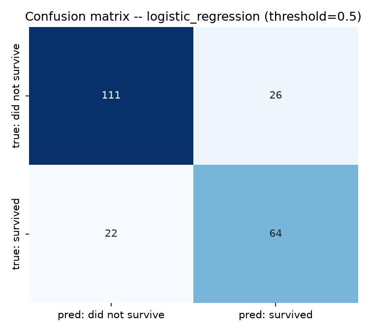
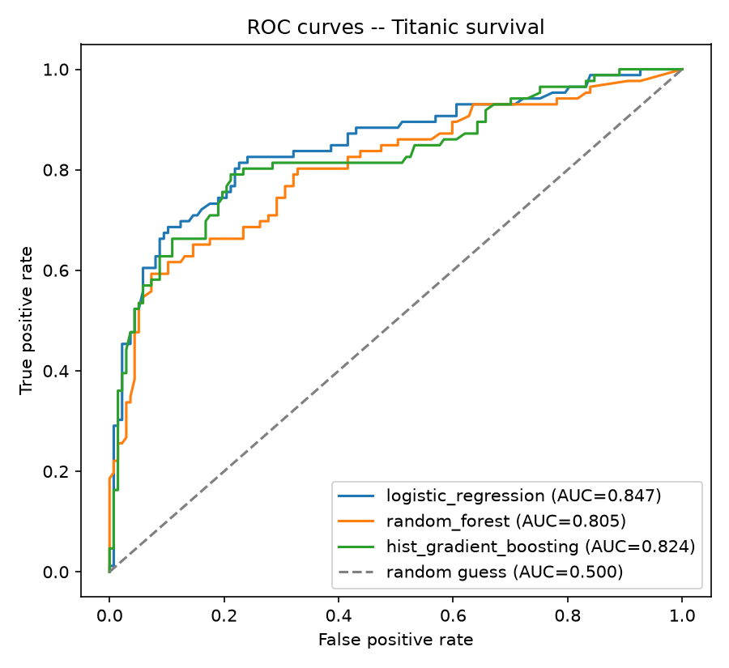
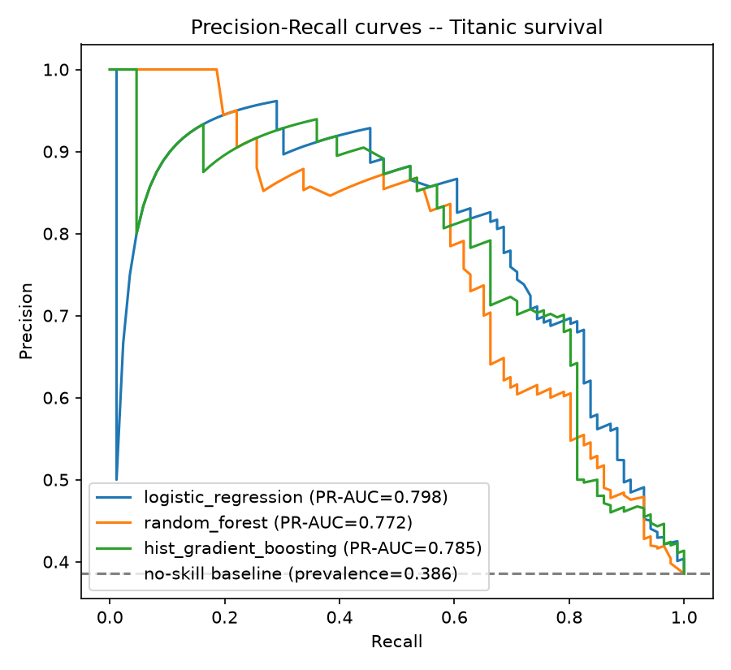
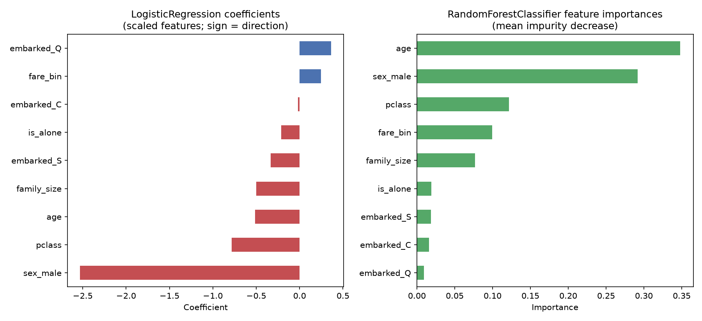

# Classification — who survived the Titanic

*Data Science · Worked Examples · SPEC-DS-6*

## Who lives, who dies — and could a model have guessed from the manifest?

On the night of April 14–15, 1912, the RMS *Titanic* struck an iceberg in the North Atlantic and
sank on its maiden voyage. Of roughly 2,200 people aboard, about 1,500 died and only around 705
survived — and survival was not evenly distributed: first-class passengers survived at roughly
62%, while more than 75% of the crew perished
([source: Britannica, "Titanic"](https://www.britannica.com/topic/Titanic), checked 2026-09-03).
Class, sex, and age weren't footnotes to the tragedy — "women and children first," enforced harder
in first class than in steerage, decided who got a seat in a lifeboat and who didn't.

That's a chilling thing to notice as an engineer: **survival correlated with measurable attributes
recorded on the ship's manifest** — cabin class, sex, age, family size, fare paid. Which raises the
question this chapter answers: if you'd had that manifest and nothing else, could you have built a
system that guesses, passenger by passenger, who lived and who died — and how would you even know
if it was any good?

Frame it the way you'd frame a system at work. A Java service that returns `boolean
isFraud(Transaction t)` from a rules engine is easy to reason about: you can read every branch. A
classifier returns something different — not a boolean, but a **probability**,
`P(survived=1 | passenger)`, and *you* decide where to draw the line that turns it into a boolean.
That single design fact — probability first, decision second — is the whole subject of this
chapter. Get the probability right and pick the threshold badly, and your "accurate" model still
makes the wrong call at the boundary that matters. This chapter uses the Titanic's own passenger
records (891 of them, a public, CC0-licensed sample bundled with the seaborn plotting library — not
a hypothetical) to teach the vocabulary for judging that probability (confusion matrix, precision,
recall, F1, ROC-AUC, PR-AUC), three model families that produce one, and the discipline of choosing
a decision threshold on purpose instead of accepting scikit-learn's default of 0.5.


That's the standard data science process, the same "you are here" map the regression chapter used —
this chapter lives in the same last three boxes, but for a *yes/no* question instead of a *how
much* one.

## 1. What & why

Regression (SPEC-DS-5) answers "how much" with a number on a continuous scale, scored by how far
predictions land from the truth. Classification answers "which one" — here, a yes/no: did this
passenger survive? Three things a Java engineer's boolean-logic instinct doesn't prepare you for:

- **The model doesn't output `true`/`false`.** `estimator.predict_proba(X)` returns a probability
  in `[0, 1]`; `estimator.predict(X)` is that probability compared against a *default* threshold of
  0.5, baked in by scikit-learn, not chosen by you
  ([source: NOTE-9-classification-metrics-apis](../../research/NOTE-9-classification-metrics-apis.md)).
  Calling `.predict()` without ever looking at `.predict_proba()` is like hard-coding a config value
  you never actually decided on.
- **"Accurate" is not one number here — it's a trade-off with a dial.** Move the threshold down and
  you catch more true positives (recall goes up) at the cost of more false alarms (precision goes
  down). There is no threshold that maximizes both at once; picking one is a business decision, not
  a modelling one. Section 4 shows the dial turning, with numbers.
- **A single "% correct" figure can be badly misleading when the classes aren't 50/50.** A model
  that always predicts the majority class scores exactly the majority class's share as "accuracy" —
  Section 3 measures this directly on this dataset, and the number is worse than you'd guess.

Think of it the way you'd think about a fraud-detection or spam filter's sensitivity slider: the
model's job is to produce a trustworthy score; a *human decision* — encoded as a threshold — turns
that score into an action (flag for review, auto-block, let through). This chapter builds both
halves: the score, and the deliberate choice of where to cut it.

### Environment

```text
pandas==3.0.5
numpy==2.5.2
matplotlib==3.11.1
scipy==1.18.1
seaborn==0.13.2
scikit-learn==1.9.0
Python 3.12+
```

Pinned and verified against PyPI on 2026-09-02
([source: NOTE-2-package-versions](../../research/NOTE-2-package-versions.md)), the scikit-learn
1.9.0 API reference
([source: NOTE-5-sklearn-core-apis](../../research/NOTE-5-sklearn-core-apis.md)), and the
classification-metrics API reference
([source: NOTE-9-classification-metrics-apis](../../research/NOTE-9-classification-metrics-apis.md)).
This chapter's code and artefacts were generated and gated on **Python 3.13.7**, with every package
above installed at exactly the pinned version — no substitutions.

## 2. The data + feature engineering

**Titanic**, via `seaborn.load_dataset('titanic')` — 891 passenger records, CC0-licensed, bundled
with seaborn ([source: NOTE-10-classification-datasets](../../research/NOTE-10-classification-datasets.md)).
This *is* a sample of the real manifest, not a toy — small enough to inspect by eye, real enough
that every number you compute below traces back to an actual person on an actual ship.

```python
import seaborn as sns

titanic = sns.load_dataset("titanic")
print(titanic.shape)
print(titanic.isna().sum())
```

```text
(891, 15)
survived         0
pclass           0
sex              0
age            177
sibsp            0
parch            0
fare             0
embarked         2
class            0
who              0
adult_male       0
deck           688
embark_town      2
alive            0
alone            0
dtype: int64
```

These NaN counts match NOTE-10 exactly (`age`: 177/891 missing, `embarked`: 2/891, `deck`: 688/891
— i.e. 77% gone) — confirmed live against the installed loader, not assumed.

The target itself is mildly imbalanced, which matters enormously for Section 3:

```python
print(titanic["survived"].value_counts(normalize=True).round(3))
```

```text
0    0.616
1    0.384
```

**62% did not survive, 38% did.** Keep that number in your head — it's about to expose a lie a
"good-looking" model can tell without learning anything at all.

### A note on the classic "title from name" feature — and why it's not here

The Kaggle CSV version of Titanic includes a `name` column, and a well-known feature-engineering
trick extracts a title from it — `"Braund, Mr. Owen Harris"` → `"Mr"` — because titles like *Master*
(boys), *Miss* (unmarried women/girls), and *Mrs* (married women) carry age/social signal beyond
what raw `age`/`sex` capture. **`seaborn.load_dataset('titanic')` has no `name` column**
([NOTE-10](../../research/NOTE-10-classification-datasets.md) — confirmed above by printing
`titanic.columns`), so this specific pipeline can't build that feature from real data. To keep the
technique grounded rather than fabricated, here's the regex mechanic on a small illustrative list —
**not this dataset**:

```python
import re

illustrative_names = [
    "Braund, Mr. Owen Harris",
    "Cumings, Mrs. John Bradley (Florence Briggs Thayer)",
    "Heikkinen, Miss. Laina",
    "Palsson, Master. Gosta Leonard",
]
titles = [re.search(r",\s*([^.]+)\.", name).group(1).strip() for name in illustrative_names]
print(list(zip(illustrative_names, titles)))
```

```text
[('Braund, Mr. Owen Harris', 'Mr'), ('Cumings, Mrs. John Bradley (Florence Briggs Thayer)', 'Mrs'),
 ('Heikkinen, Miss. Laina', 'Miss'), ('Palsson, Master. Gosta Leonard', 'Master')]
```

This chapter's real feature set instead builds what the loader *does* give us — turning raw counts
into signal the way you'd derive a `isPowerUser` flag from raw event counts instead of feeding raw
counts straight into a model:

```mermaid
flowchart LR
    SIBSP["sibsp<br/>(siblings/spouses aboard)"] --> FS["family_size =<br/>sibsp + parch + 1"]
    PARCH["parch<br/>(parents/children aboard)"] --> FS
    FS --> ALONE["is_alone =<br/>family_size == 1"]
    FARE["fare<br/>(right-skewed, median &asymp; 14, max &asymp; 512)"] --> QCUT["pd.qcut&#40;fare, q=4&#41;<br/>equal-population quartiles"]
    QCUT --> BIN["fare_bin:<br/>low / mid / high / very_high"]
    FS --> MODEL["feature matrix"]
    ALONE --> MODEL
    BIN --> MODEL
```



- **`family_size = sibsp + parch + 1`** — siblings/spouses aboard, plus parents/children aboard,
  plus the passenger themself.
- **`is_alone = (family_size == 1)`** — travelling solo often correlated with survival odds
  differently than travelling with family.
- **`fare_bin`** — `fare` is heavily right-skewed (median ≈ 14, max ≈ 512), so an equal-*width*
  bucketing would dump almost everyone into the bottom bucket. `pd.qcut(fare, q=4, labels=[...])`
  buckets into equal-*population* quartiles (`low`/`mid`/`high`/`very_high`) instead — the pandas
  equivalent of `NTILE(4)` in SQL, not `WIDTH_BUCKET`.

```python
import pandas as pd

titanic["family_size"] = titanic["sibsp"] + titanic["parch"] + 1
titanic["is_alone"] = (titanic["family_size"] == 1).astype(int)
titanic["fare_bin"] = pd.qcut(titanic["fare"], q=4, labels=["low", "mid", "high", "very_high"])
print(titanic[["sibsp", "parch", "family_size", "is_alone", "fare", "fare_bin"]].head(3))
```

```text
   sibsp  parch  family_size  is_alone     fare fare_bin
0      1      0            2         0   7.2500      low
1      1      0            2         0  71.2833     very_high
2      0      0            1         1   7.9250      mid
```

### Dropping what leaks or duplicates

Before encoding, several columns need to go — and *why* is the pitfall AC4 asks this chapter to
surface concretely:

- **`alive` is `survived` spelled `"no"`/`"yes"`.** Leave it in the feature matrix and every model
  scores ~100% by reading the label off a renamed copy of itself. This is **target leakage** —
  information that encodes the answer sneaking in disguised as a feature — and it's the single most
  common way a classification chapter's numbers lie. `alive` gets dropped *before* the split, not
  after; there's no point in the pipeline where it's safe to keep.
- **`deck` is 77% missing** ([NOTE-10](../../research/NOTE-10-classification-datasets.md)) — too
  sparse to impute credibly; dropped.
- **`class`, `embark_town` duplicate `pclass`, `embarked`** (same information, different
  representation) — kept once, not twice.
- **`who`, `adult_male` are coarse re-derivations of `sex` + `age`** the dataset already computed
  for you — redundant with columns we're keeping directly.
- **`sibsp`, `parch`, `alone`, `fare`** are superseded by the engineered `family_size`, `is_alone`,
  `fare_bin` above — keeping both the raw and derived versions would feed the model two correlated
  views of the same fact for no benefit.

```python
drop_cols = ["alive", "deck", "class", "embark_town", "who", "adult_male",
             "sibsp", "parch", "alone", "fare"]
engineered = titanic.drop(columns=drop_cols)
feature_cols = ["age", "family_size", "pclass", "is_alone", "fare_bin", "sex", "embarked"]
print(engineered[feature_cols + ["survived"]].head(3))
```

```text
    age  family_size  pclass  is_alone fare_bin     sex embarked  survived
0  22.0            2       3         0      low    male        S         0
1  38.0            2       1         0  very_high  female        C         1
2  26.0            1       3         1      mid   female        S         1
```

### Ordinal vs one-hot encoding

Two different kinds of categorical column here, needing two different encoders
([NOTE-5-sklearn-core-apis](../../research/NOTE-5-sklearn-core-apis.md)):

- **`pclass` (1/2/3) is already ordinal** — the dataset encodes it as a number where the order is
  meaningful (1st class outranks 3rd) — so it needs no extra encoding, just the same
  impute+scale treatment as any numeric column.
- **`fare_bin` (`low`/`mid`/`high`/`very_high`) is ordinal but string-labelled.** `OrdinalEncoder`
  needs an explicit category order (`categories=[["low","mid","high","very_high"]]`) — left to
  guess, it would sort alphabetically and put `"high"` before `"low"`, silently inventing the wrong
  order.
- **`sex`, `embarked` are nominal — no natural order.** Coding `female=0, male=1, ...` the way
  `OrdinalEncoder` would implies "male is more than female", a relationship that doesn't exist.
  `OneHotEncoder` avoids that by giving each category its own 0/1 column instead
  ([NOTE-5](../../research/NOTE-5-sklearn-core-apis.md)). For a two-category column like `sex`,
  `OneHotEncoder(drop='if_binary')` keeps a single 0/1 column instead of two perfectly
  anti-correlated ones (empirically verified against the installed scikit-learn 1.9.0: with two
  categories it drops one and keeps `sex_male` as `1`/`0`).

Java analogy: `OrdinalEncoder` ≈ mapping an `enum` to its ordinal `int` when the enum's declaration
order *is* meaningful; `OneHotEncoder` ≈ an `EnumSet`-style one-flag-per-value representation when
it isn't.

```python
from sklearn.preprocessing import OneHotEncoder, OrdinalEncoder

fare_bin_order = OrdinalEncoder(categories=[["low", "mid", "high", "very_high"]])
print(fare_bin_order.fit_transform(engineered[["fare_bin"]].astype(str)).ravel()[:5])

sex_onehot = OneHotEncoder(drop="if_binary")
print(sex_onehot.fit_transform(engineered[["sex"]]).toarray().ravel()[:5])
print(sex_onehot.get_feature_names_out())
```

```text
[0. 3. 1. 3. 1.]
[1. 0. 0. 0. 1.]
['sex_male']
```

Both encoders (and the `SimpleImputer` used for `age`'s 177 NaNs and `embarked`'s 2 NaNs — median
and most-frequent respectively) get assembled into one `ColumnTransformer`, wrapped in a `Pipeline`
per model, in the companion script — the same fit-on-train-only discipline from DS-2 (imputation)
and DS-4 (splitting) applies here unchanged.

## 3. Metrics — confusion matrix, precision vs recall, and why accuracy misleads

Split 75/25, **stratified** on `survived` so both splits keep the same ~62/38 balance
([NOTE-5](../../research/NOTE-5-sklearn-core-apis.md): `train_test_split(..., stratify=y)`), then
train three models — Section 5 covers all three; this section reads the first one's output plus one
deliberately dumb baseline.

**So: how do you know a classifier is any good?** The obvious answer — "count what it got right,
divide by the total" — is the one every beginner reaches for first. Before trusting that number on
this dataset, put it under real pressure: build a "model" that looks at *no* features at all and
always guesses the same thing.

**The baseline that exposes accuracy's lie:** predict the majority class (`0`, did not survive) for
*every single* test passenger, with no model at all:

```python
import numpy as np
from sklearn.metrics import accuracy_score, precision_score, recall_score, f1_score

majority_pred = np.zeros(len(y_test), dtype=int)  # predict "did not survive" for everyone
print(f"accuracy:  {accuracy_score(y_test, majority_pred):.4f}")
print(f"precision: {precision_score(y_test, majority_pred, zero_division=0):.4f}")
print(f"recall:    {recall_score(y_test, majority_pred, zero_division=0):.4f}")
print(f"f1:        {f1_score(y_test, majority_pred, zero_division=0):.4f}")
```

```text
accuracy:  0.6143
precision: 0.0000
recall:    0.0000
f1:        0.0000
```

**61.4% accuracy from a model that never once predicts a survivor.** Read that again: a "model"
with zero intelligence, zero features, and zero ability to identify a single survivor still gets to
report a headline number that sounds respectable. On this class balance, "high accuracy" and
"useful model" are not the same claim — a service that always returns `false` for `isFraud()` would
look "99% accurate" on a dataset that's 99% legitimate transactions too, while catching zero fraud.
This is exactly what AC4 asks this chapter to show empirically, and this number is it: accuracy
alone cannot distinguish "learned the pattern" from "learned the majority class's frequency."
Precision and recall are both hard-zero here for the same reason — the baseline never predicts
class 1, so `TP=0` sits in the numerator of both formulas below, and *any* nonzero denominator
divided into zero is zero.

Accuracy just failed the one job it had. The honest replacement starts from the same four counts
every wrong-vs-right prediction can fall into, laid out as a grid — **the confusion matrix**. Now
run the real model — logistic regression, at the default threshold of 0.5:

```python
from sklearn.metrics import confusion_matrix

y_pred = pipeline.predict(X_test)  # pipeline = LogisticRegression behind the shared preprocessor
print(f"accuracy:  {accuracy_score(y_test, y_pred):.4f}")
print(f"precision: {precision_score(y_test, y_pred):.4f}")
print(f"recall:    {recall_score(y_test, y_pred):.4f}")
print(f"f1:        {f1_score(y_test, y_pred):.4f}")
print(confusion_matrix(y_test, y_pred))
```

```text
accuracy:  0.7848
precision: 0.7111
recall:    0.7442
f1:        0.7273
[[111  26]
 [ 22  64]]
```

`confusion_matrix(y_true, y_pred)` returns `[[TN, FP], [FN, TP]]` for binary `{0, 1}` labels
([NOTE-9-classification-metrics-apis](../../research/NOTE-9-classification-metrics-apis.md)) —
plotted as a labelled heatmap in
[`artefacts/titanic_confusion_matrix.png`](artefacts/titanic_confusion_matrix.png):



Here's that same grid as a labelled diagram — rows are the truth, columns are what the model said,
and every one of the 223 test passengers lands in exactly one of the four boxes:

```mermaid
flowchart LR
    subgraph ACTUAL_NEG["Actual: did NOT survive &#40;121 passengers&#41;"]
        TN["Predicted: did not survive<br/>True Negative &#40;TN&#41; = 111<br/>correct"]
        FP["Predicted: survived<br/>False Positive &#40;FP&#41; = 26<br/>false alarm"]
    end
    subgraph ACTUAL_POS["Actual: survived &#40;86 passengers&#41;"]
        FN["Predicted: did not survive<br/>False Negative &#40;FN&#41; = 22<br/>a miss"]
        TP["Predicted: survived<br/>True Positive &#40;TP&#41; = 64<br/>correct"]
    end
```



Read it the way you'd read a test-suite's pass/fail breakdown, not a single "% green" number:

- **111 true negatives** — correctly predicted "did not survive."
- **64 true positives** — correctly predicted "survived."
- **26 false positives** — predicted "survived", was wrong (a false alarm).
- **22 false negatives** — predicted "did not survive", was wrong (a miss).

From those four counts come the two questions accuracy can't tell apart, each with a one-sentence
plain-English gloss before the formula:

**Precision** — *of everyone the model called a survivor, how often was it right?*

$$\text{Precision} = \frac{TP}{TP + FP} = \frac{64}{64 + 26} = 0.711$$

High precision means few false alarms.

**Recall** — *of everyone who actually survived, how many did the model catch?*

$$\text{Recall} = \frac{TP}{TP + FN} = \frac{64}{64 + 22} = 0.744$$

High recall means few misses.

**F1** — one number when you need to compare models but don't want to pick precision or recall as
*the* priority. It's the *harmonic* mean, not the plain average — the harmonic mean punishes a
lopsided model (great at one, terrible at the other) far more than one that's balanced, exactly the
property Section 4 needs when it turns this into a dial:

$$F_1 = 2 \cdot \frac{\text{Precision} \cdot \text{Recall}}{\text{Precision} + \text{Recall}} = 2 \cdot \frac{0.711 \times 0.744}{0.711 + 0.744} = 0.727$$

Precision and recall are two different questions about the *same* set of mistakes, and a model can
score well on one while scoring badly on the other — that's the trade-off Section 4 turns into a
dial you can actually move.

```mermaid
flowchart LR
    DOWN["move threshold DOWN<br/>&#40;call more passengers 'survived'&#41;"] --> RUP["recall UP<br/>catch more true survivors"]
    DOWN --> PDOWN["precision DOWN<br/>more false alarms"]
    UP["move threshold UP<br/>&#40;call fewer passengers 'survived'&#41;"] --> RDOWN["recall DOWN<br/>miss more true survivors"]
    UP --> PUP["precision UP<br/>fewer false alarms"]
```



There's no free lunch on that dial — every step toward more recall costs some precision, and vice
versa. Section 4 sweeps it end to end, with real numbers.

## 4. Probabilities & thresholds — ROC-AUC, PR-AUC, and choosing on purpose

Every metric in Section 3 depends on a threshold that was never chosen — `.predict()`'s baked-in
0.5. ROC and PR curves show what the model can do across *every* threshold at once, before any
single one is picked.

**ROC (Receiver Operating Characteristic)** plots true positive rate (recall) against false positive
rate as the threshold sweeps from 1 down to 0; **ROC-AUC** is the area under that curve — 0.5 is
"no better than a coin flip", 1.0 is "perfect separation"
([NOTE-9](../../research/NOTE-9-classification-metrics-apis.md)):

```python
from sklearn.metrics import roc_auc_score, roc_curve

y_proba = pipeline.predict_proba(X_test)[:, 1]  # probability of class 1 (survived)
fpr, tpr, roc_thresholds = roc_curve(y_test, y_proba)
print(f"ROC-AUC: {roc_auc_score(y_test, y_proba):.4f}")
```

```text
ROC-AUC: 0.8465
```

**PR (Precision-Recall)** plots precision against recall across the same threshold sweep;
**PR-AUC** (`average_precision_score`) is the area under *that* curve. Both are grounded in
[NOTE-9](../../research/NOTE-9-classification-metrics-apis.md), which also states the rule for
choosing between them: **ROC-AUC can look overly optimistic when the negative class dominates,
because false positives get diluted by a large true-negative count; PR-AUC focuses on the positive
(minority) class and its baseline moves with class prevalence instead of sitting fixed at 0.5.** On
this dataset's mild 62/38 imbalance the two metrics broadly agree (Section 5's table shows both);
the gap between them widens as imbalance gets more severe — the subject of DS-8.

```python
from sklearn.metrics import average_precision_score, precision_recall_curve

precision_curve, recall_curve, pr_thresholds = precision_recall_curve(y_test, y_proba)
print(f"PR-AUC: {average_precision_score(y_test, y_proba):.4f}")
```

```text
PR-AUC: 0.7976
```

Both curves, all three models overlaid (Section 5 introduces the other two) —
[`artefacts/titanic_roc_curve.png`](artefacts/titanic_roc_curve.png) and
[`artefacts/titanic_pr_curve.png`](artefacts/titanic_pr_curve.png):





The PR curve's baseline (dashed line) sits at `0.386` — the test set's actual survivor share — not
at `0.5` the way the ROC diagonal does. That's the "data-dependent baseline" NOTE-9 describes: a
PR-AUC of 0.8 means much less on a 1%-positive dataset (baseline ≈ 0.01) than it does here. Which
curve should you actually reach for? It comes down to one question:

```mermaid
flowchart TD
    Q{"how imbalanced<br/>are the classes?"}
    Q -->|"roughly balanced<br/>&#40;this chapter: 62/38&#41;"| ROC["ROC-AUC is a fine summary<br/>baseline fixed at 0.5"]
    Q -->|"severely imbalanced<br/>&#40;1-5% positive, SPEC-DS-8&#41;"| PR["prefer PR-AUC<br/>baseline tracks prevalence,<br/>not diluted by a huge TN count"]
```



### Choosing a threshold on purpose

Sweep thresholds from 0.10 to 0.90 and score precision/recall/F1 at each — this *is* the dial from
Section 3, made concrete. Watch the numbers move as the threshold moves, one step at a time:

```python
thresholds = np.arange(0.10, 0.91, 0.05)
for t in thresholds:
    y_pred_t = (y_proba >= t).astype(int)
    p = precision_score(y_test, y_pred_t, zero_division=0)
    r = recall_score(y_test, y_pred_t, zero_division=0)
    f = f1_score(y_test, y_pred_t, zero_division=0)
    print(f"{t:.2f}  precision={p:.3f}  recall={r:.3f}  f1={f:.3f}")
```

```text
0.10  precision=0.452  recall=0.930  f1=0.608
0.30  precision=0.634  recall=0.826  f1=0.717
0.40  precision=0.693  recall=0.814  f1=0.749
0.50  precision=0.711  recall=0.744  f1=0.727
0.70  precision=0.875  recall=0.488  f1=0.627
0.90  precision=0.917  recall=0.128  f1=0.224
```

(Full 17-row sweep in the companion script's output.) The shape is exactly the trade-off diagram
from Section 3, now with numbers on it: lower the threshold and recall climbs while precision falls
(at 0.10, the model catches 93% of survivors but is right only 45% of the time it says "survived");
raise it and the reverse happens (at 0.90, 92% precision but only 13% recall — it barely calls
anyone a survivor, and almost always right when it does). Walk the F1 column top to bottom and it
rises, peaks, then falls: 0.608 → 0.717 → **0.749** → 0.727 → 0.627 → 0.224.
**The F1-maximising threshold here is 0.40 (F1=0.749), not the default 0.50 (F1=0.727)** — a small
but real improvement, found only by looking instead of accepting the library default.

This is where the Java-side framing from Section 1 pays off: imagine this model behind a claims- or
triage-review service. A false negative here (missed a survivor) and a false positive (flagged a
non-survivor) are not equally expensive in every application — a fraud filter that's too aggressive
blocks legitimate customers (precision matters more); a medical screening test that's too
conservative misses disease (recall matters more). **The threshold is the place you encode that
business trade-off — deliberately, in one line of config, not by inheriting whatever 0.5 happened
to default to.**

## 5. Three models compared

Same preprocessing pipeline, three model families
([NOTE-5-sklearn-core-apis](../../research/NOTE-5-sklearn-core-apis.md)):

```python
from sklearn.ensemble import HistGradientBoostingClassifier, RandomForestClassifier
from sklearn.linear_model import LogisticRegression

models = {
    "logistic_regression": LogisticRegression(max_iter=1000, random_state=42),
    "random_forest": RandomForestClassifier(n_estimators=300, random_state=42),
    "hist_gradient_boosting": HistGradientBoostingClassifier(random_state=42),
}
```

- **`LogisticRegression`** — a linear model over the encoded features, passed through a sigmoid to
  land in `[0, 1]`. Fast, interpretable (Section 5.1), and a strong baseline on tabular data this
  size.
- **`RandomForestClassifier`** — an ensemble of decision trees, each trained on a bootstrap sample
  with a random feature subset, voting by averaged probability. Captures non-linear interactions
  logistic regression can't (e.g. "young AND male AND 3rd class" combining multiplicatively) without
  you having to engineer the interaction terms by hand.
- **`HistGradientBoostingClassifier`** — trees built *sequentially*, each one correcting the
  previous ensemble's errors, using histogram-binned features for speed. Often the strongest of the
  three on structured/tabular data.

Full comparison at the default 0.5 threshold, written by the companion script to
[`artefacts/titanic_metric_comparison.csv`](artefacts/titanic_metric_comparison.csv):

| model | accuracy | precision | recall | f1 | roc_auc | pr_auc |
|---|---|---|---|---|---|---|
| majority_class_baseline | 0.6143 | 0.0000 | 0.0000 | 0.0000 | — | — |
| logistic_regression | 0.7848 | 0.7111 | 0.7442 | 0.7273 | 0.8465 | 0.7976 |
| random_forest | 0.7713 | 0.7273 | 0.6512 | 0.6871 | 0.8050 | 0.7719 |
| hist_gradient_boosting | 0.7892 | 0.7826 | 0.6279 | 0.6968 | 0.8240 | 0.7850 |

On this dataset, at these hyperparameters, with this seed: **logistic regression wins on ROC-AUC,
PR-AUC, recall, and F1**; HistGradientBoosting edges it slightly on raw accuracy and precision;
random forest trails on every ranking metric. That's a genuinely useful, slightly counter-intuitive
result to sit with — "the fancier model" doesn't automatically win, especially on a dataset this
small (668 training rows) where a boosted ensemble has less room to show its strength over a
well-regularized linear model. The rest of this chapter's per-model numbers use
**logistic_regression**, the PR-AUC leader.

### 5.1 Coefficients and importances

Two different ways to ask "what mattered", read from
[`artefacts/titanic_feature_importance.png`](artefacts/titanic_feature_importance.png):



```python
lr = models["logistic_regression"].named_steps["model"]
rf = models["random_forest"].named_steps["model"]
feature_names = models["logistic_regression"].named_steps["prep"].get_feature_names_out()

print(dict(zip(feature_names, lr.coef_[0].round(3))))
print(dict(zip(feature_names, rf.feature_importances_.round(3))))
```

```text
{'age': -0.484, 'family_size': -0.507, 'pclass': -0.792, 'is_alone': -0.199, 'fare_bin': 0.246,
 'sex_male': -2.492, 'embarked_S': -0.322, 'embarked_C': -0.008, 'embarked_Q': 0.395}
{'age': 0.348, 'sex_male': 0.291, 'pclass': 0.121, 'fare_bin': 0.100, 'family_size': 0.077,
 'is_alone': 0.019, 'embarked_S': 0.019, 'embarked_C': 0.014, 'embarked_Q': 0.009}
```

- **`LogisticRegression.coef_`** — one signed number per (scaled) feature. `sex_male = -2.49` is by
  far the largest-magnitude coefficient: holding everything else fixed, being male is associated
  with a sharply *lower* predicted log-odds of survival — the historically documented "women and
  children first" evacuation pattern from this chapter's opening showing up directly in the fitted
  weights, on this same dataset, 114 years later. `pclass = -0.79`: since `pclass` counts 1st→3rd, a
  negative coefficient means higher-numbered (lower) class predicts lower survival odds — a
  first-class passenger's berth bought a materially better survival chance, exactly matching the
  ~62% first-class survival rate this chapter opened with. Because every numeric feature was scaled
  to the same range before fitting, coefficients are directly comparable in magnitude — this is
  *why* Section 2's `StandardScaler` step matters, not just cosmetic.
- **`RandomForestClassifier.feature_importances_`** — mean decrease in Gini impurity attributable to
  each feature, summed across every tree and every split, normalized to sum to 1. No sign, no
  direction — just "how much splitting on this feature helped separate the classes", agnostic to
  which way it points. `age` and `sex_male` dominate here too, agreeing directionally (if not
  numerically) with logistic regression's ranking.
- **`HistGradientBoostingClassifier` is deliberately absent from this chart.** Unlike
  `RandomForestClassifier`, it does **not** expose a `.feature_importances_` attribute — verified
  directly against the installed scikit-learn 1.9.0 with `hasattr(model, "feature_importances_")`
  (this specific gap isn't documented in NOTE-5 or NOTE-9's evidence tables, so it's stated here as
  empirically checked against the pinned version, not assumed). Getting importance-like numbers out
  of a `HistGradientBoostingClassifier` means reaching for permutation importance
  (`sklearn.inspection.permutation_importance`) or SHAP values instead — both out of this chapter's
  scope; SHAP is mentioned here only as a pointer, per this chapter's spec.

### 5.2 Probability calibration — the intuition (LO5)

One more question a "which model is best" comparison skips: when this model says `P(survived)=0.80`,
do roughly 80% of passengers *at that score* actually survive? A model can rank passengers correctly
(good ROC-AUC/PR-AUC — it puts true survivors ahead of true non-survivors) while still being
**miscalibrated** — systematically over- or under-confident in the raw numbers it outputs. Tree
ensembles (random forest, gradient boosting) are well-known to produce probability estimates that
cluster away from 0 and 1 more than a well-calibrated model would, because each is an average of
many trees' votes rather than a probability fit directly. Logistic regression, fit by maximizing
log-loss, tends to be closer to calibrated out of the box.

**Why it matters:** ranking metrics (ROC-AUC, PR-AUC) and threshold-based metrics (precision,
recall, F1) don't care about calibration at all — a monotonic transform of the scores changes none
of them. Calibration matters the moment you *use the probability as a probability* — e.g. reporting
"73% survival chance" to a human, or multiplying it by a dollar amount to estimate expected value.
This chapter doesn't run a calibration curve (out of scope per SPEC-DS-6 — `sklearn.calibration`'s
`CalibratedClassifierCV` and reliability diagrams are a natural follow-up once you need trustworthy
*probabilities*, not just a good ranking or a good threshold).

## 6. Pitfalls

- **Accuracy lies on imbalanced classes, and 62/38 is enough to prove it.** Section 3's majority
  baseline scored 61.4% accuracy by predicting one class for everyone. Any accuracy number needs a
  same-dataset baseline next to it before it means anything — "78% accurate" only sounds good in
  contrast to "61% accurate for free."
- **Target leakage hides in innocuous-looking columns.** `alive` looked like just another passenger
  attribute until you noticed it *was* the label, restated. Before trusting a feature, ask: "could
  this column only exist because we already know the answer?" — a claim-status field on a fraud
  dataset, a "resolved" flag on a churn dataset, a discharge date on a readmission-prediction
  dataset are the same trap in different domains.
- **`.predict()`'s threshold=0.5 default is a choice, even when nobody made it.** Section 4 found a
  measurably better F1 at 0.40. On a genuinely imbalanced problem (DS-8) the gap between 0.5 and the
  right threshold gets far larger than the 0.02 F1 difference seen here.
- **A better-sounding model isn't automatically the better model.** `HistGradientBoostingClassifier`
  edged out logistic regression on raw accuracy (0.789 vs 0.785) but *lost* on recall, F1, ROC-AUC,
  and PR-AUC. Which one is "better" depends on which metric your application actually cares about —
  decide that before comparing, not after picking whichever number flatters your favorite model.
- **High ROC-AUC does not mean the model is useful at every threshold.** ROC-AUC of 0.85 is "good
  ranking ability" averaged across all thresholds; it says nothing about precision at the specific
  threshold you'll actually ship. Always check the confusion matrix (or the threshold sweep) at the
  threshold you intend to use, not just the summary AUC.
- **A good ranking metric doesn't imply calibrated probabilities.** Section 5.2's point, restated as
  a pitfall: don't feed a tree ensemble's raw `predict_proba()` output into a calculation that treats
  it as a literal probability (expected value, risk pricing) without first checking calibration.

## 7. Recap & what's next

- Classification produces a **probability**, not a boolean; `.predict()`'s 0.5 threshold is a
  default, not a decision — Section 4 showed a measurably better F1 (0.749 vs 0.727) at 0.40 instead.
- The confusion matrix — `[[TN, FP], [FN, TP]]`
  ([NOTE-9](../../research/NOTE-9-classification-metrics-apis.md)) — is the source of precision
  ($TP/(TP+FP)$), recall ($TP/(TP+FN)$), and F1 (their harmonic mean); read all three together,
  never accuracy alone.
- **A majority-class baseline (61.4% accuracy, 0 recall) proved accuracy misleads on this dataset's
  62/38 split** — the empirical demonstration AC4 asked for, and the moment "78% accurate" stopped
  sounding automatically impressive.
- **ROC-AUC** (0.847 for logistic regression) summarizes ranking quality across every threshold;
  **PR-AUC** (0.798) does the same but focuses on the positive class and its baseline tracks
  prevalence instead of sitting fixed at 0.5 — prefer PR-AUC as imbalance gets more severe
  ([NOTE-9](../../research/NOTE-9-classification-metrics-apis.md)).
- Three model families were compared under one shared preprocessing `Pipeline`: **logistic
  regression won on PR-AUC, ROC-AUC, recall, and F1**; random forest and HistGradientBoosting did
  not automatically outperform it, despite being "fancier."
  `LogisticRegression.coef_` gives signed, comparable weights (after scaling);
  `RandomForestClassifier.feature_importances_` gives unsigned split-quality scores;
  `HistGradientBoostingClassifier` exposes neither (verified empirically against 1.9.0). Those
  coefficients also recovered the exact historical pattern this chapter opened with — sex and class
  were the two strongest predictors of who lived.
- **Feature engineering means building from what the loader actually gives you** — this dataset has
  no `name` column, so `family_size`, `is_alone`, and `fare_bin` did the job the classic
  "title" feature usually does; and **target leakage** (`alive`) had to be dropped before it silently
  handed every model a 100% answer key.
- **Calibration** is a different question from ranking or thresholding: a model can separate classes
  well while still over- or under-stating its own confidence — worth checking before treating
  `predict_proba()`'s output as a literal probability.
  [DS-20](15-calibration-ranking-imbalanced.md) makes this concrete on a rare-event dataset: a model
  can rank perfectly while its predicted probabilities are off by 10x, and shows the reliability
  diagram and the fix (isotonic/Platt calibration) this chapter only named.

**SPEC-DS-7** (multi-class & multi-label) picks up the natural next question: this chapter's
`survived` was exactly one of two classes — what changes when there are more than two, and what
changes again when a record can carry *several* labels at once instead of exactly one?
**SPEC-DS-8** (class imbalance) returns to this chapter's mild 62/38 split and pushes it to the
genuinely rare-event case (1–5% positive) where accuracy is actively dangerous and PR-AUC, resampling,
and class weights stop being optional.

---

### Environment note (for the architect)

No discrepancies to report against NOTE-2, NOTE-5, or NOTE-9's evidence tables. One gap in NOTE-5's
evidence table surfaced and was resolved by direct empirical verification rather than by asserting
from memory: NOTE-5 does not document whether `HistGradientBoostingClassifier` exposes
`.feature_importances_`; running `hasattr(HistGradientBoostingClassifier(...).fit(...), "feature_importances_")`
against the installed scikit-learn 1.9.0 returned `False` (`RandomForestClassifier` returned `True`
on the same check), so Section 5.1 excludes it from the importance chart and states the gap as
empirically verified rather than documented. `OneHotEncoder(drop='if_binary')`'s exact behaviour
(keeps one 0/1 column for a two-category feature) was likewise confirmed by direct execution against
1.9.0, since NOTE-5's evidence table lists the `drop` parameter's default (`None`) but not its
`'if_binary'` string-value semantics. All package versions (`pandas==3.0.5`, `numpy==2.5.2`,
`matplotlib==3.11.1`, `scipy==1.18.1`, `seaborn==0.13.2`, `scikit-learn==1.9.0`) from NOTE-2 and
NOTE-5 installed and ran exactly as pinned in this chapter's gate environment (Python 3.13.7, shared
project `.venv`).

**Restyle note (this pass):** this chapter was restyled into the book's house storytelling/visual
format (cold open, "you are here" DS-process map, confusion-matrix grid, precision/recall trade-off
flow, ROC-vs-PR chooser, feature-engineering flow, LaTeX metric formulas) without altering any code
block, output block, artefact reference, or reported metric number from the original SPEC-DS-6
chapter. One new claim was added and grounded: the RMS Titanic's April 1912 sinking date and
casualty/survival figures, cited to Britannica
([source: Britannica, "Titanic"](https://www.britannica.com/topic/Titanic), checked 2026-09-03).
