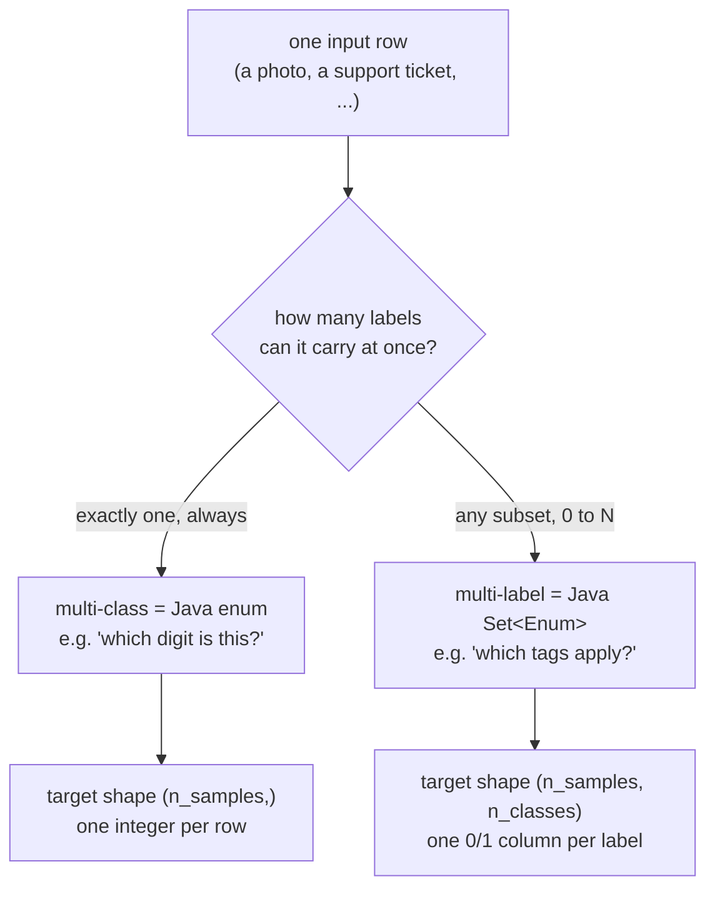
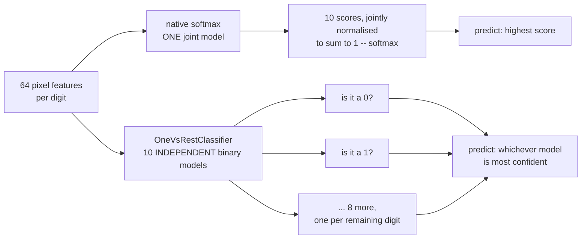
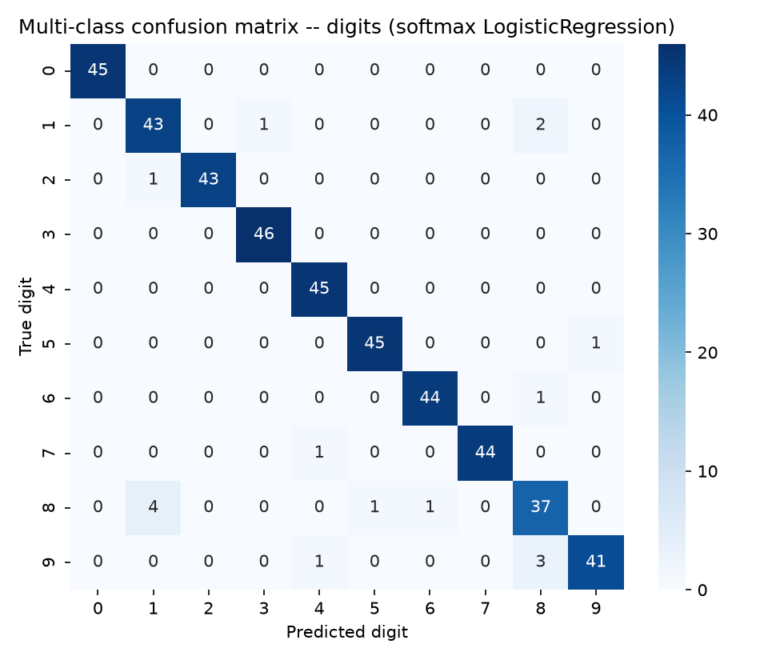
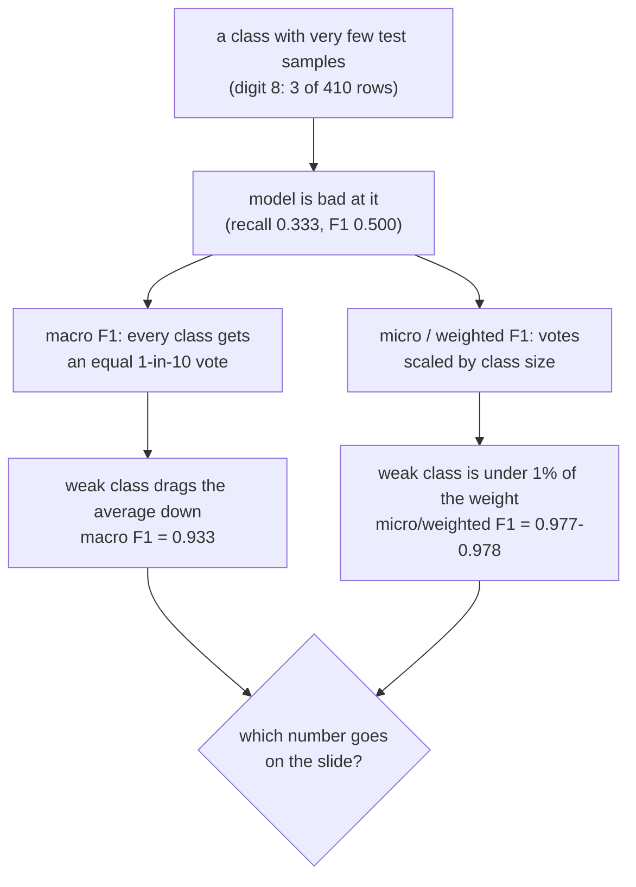
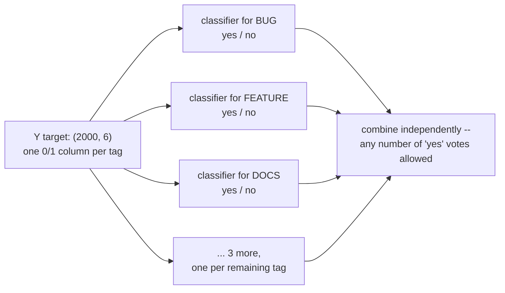

# Multi-class and multi-label classification — enum vs Set&lt;Enum&gt;

*Data Science · Worked Examples · SPEC-DS-7*

## One drawer, or a whole toolbox?

Model a support desk in Java and the first field you reach for is a status:

```java
enum TicketStatus { OPEN, IN_PROGRESS, RESOLVED, CLOSED }
```

Exactly one value, always — a ticket is never both `OPEN` and `CLOSED`, and it's never in *zero*
of those states either. Then product asks for tags: `BUG`, `SECURITY`, `DOCS`, `PERFORMANCE`,
`UI`... and the `enum` stops working, because a ticket isn't one tag. It's *some subset* of tags —
maybe `BUG` and `SECURITY` together, maybe just `DOCS` alone, maybe nothing yet. You reach for a
different type entirely:

```java
Set<Tag> tags = EnumSet.of(Tag.BUG, Tag.SECURITY);
```

That's the whole chapter, condensed into two type signatures you already know cold:

- **`enum` → multi-class.** Exactly one value out of N, every time, no exceptions. A photo of a
  single handwritten digit is a 0, a 1, ..., or a 9 — never two digits in one photo, never zero.
  An `OrderStatus` is `PENDING`, `SHIPPED`, `DELIVERED`, or `CANCELLED` — never two of them at once.
- **`Set<Enum>` → multi-label.** Any subset of N values — zero, one, or all of them. A support
  ticket can carry `BUG` *and* `SECURITY` *and* `PERFORMANCE` at once, or nothing yet. A movie can
  be `Comedy` and `Romance` and `Drama` simultaneously.



This chapter is about telling the two shapes apart, training a model for each, and — the part
that actually bites in production — understanding how a single averaged metric can quietly hide a
class your model is bad at.

## 1. What & why

The two shapes are easy to mix up in code because scikit-learn represents both as plain arrays of
numbers, and because both extend the binary case you already know from the previous chapter: "is
it class A or not" becomes "which *one* of N classes is it" (multi-class) or "which *subset* of N
labels applies" (multi-label). The *shape of the target array* is the only thing that tells them
apart — one label per row (a 1-D array) versus several independent yes/no columns per row (a 2-D
array) — and that difference changes which model API you call, which metrics make sense, and how
you're allowed to read a "good" score. Get the shape wrong and scikit-learn either throws (best
case — Section 4 shows the exact error) or trains something that quietly answers the wrong
question.

This chapter covers one worked dataset for each shape: **digits** (multi-class — which digit is
this?) and a synthetic **ticket-tagging** dataset (multi-label — which tags apply?). Both use
plain `LogisticRegression` as the underlying binary learner, wrapped differently for each shape,
so the comparison stays about the *classification structure*, not about which model family wins.

### Environment

```text
numpy==2.5.2
pandas==3.0.5
matplotlib==3.11.1
seaborn==0.13.2
scikit-learn==1.9.0
Python 3.12+
```

Pinned and verified against PyPI on 2026-09-02
([source: NOTE-5-sklearn-core-apis](../../research/NOTE-5-sklearn-core-apis.md)). This chapter's
code and artefacts were generated and gated on **Python 3.13.7**, with every package above
installed at exactly the version shown — no substitutions.

## 2. Multi-class — which one of 10 digits is this?

### The dataset

[`sklearn.datasets.load_digits`](https://scikit-learn.org/stable/modules/generated/sklearn.datasets.load_digits.html)
ships **1,797 samples of handwritten digits (0–9), 64 features each** (an 8×8 grayscale image
flattened into pixel-intensity values), with roughly balanced classes and no download required —
BSD-3-Clause licensed, bundled with scikit-learn
([source: NOTE-10-classification-datasets](../../research/NOTE-10-classification-datasets.md)).

```python
import numpy as np
from sklearn.datasets import load_digits

X, y = load_digits(return_X_y=True)
print(X.shape, y.shape)
print(np.bincount(y))
```

```text
(1797, 64) (1797,)
[178 182 177 183 181 182 181 179 174 180]
```

`y` is a 1-D array — one integer label (0–9) per row. That's the multi-class shape: exactly one
value out of N, every time.

### Softmax vs one-vs-rest — two ways to make a binary learner handle 10 classes

`LogisticRegression` is fundamentally a binary model — its math produces one probability, for
"yes" vs "not yes." Scaling it up to 10 classes needs a strategy, and there are two:

1. **Native multinomial (softmax).** Train **one model** that outputs 10 numbers per sample —
   one score per digit — normalized so they sum to 1 (the softmax function), and predict
   whichever class scored highest. All 10 classes are learned *jointly*, sharing one set of
   decision boundaries.
2. **One-vs-rest (OvR).** Train **10 independent binary models**, each answering one question:
   "is this digit a `k`, or not?" To predict, run all 10 and pick whichever model is most
   confident. `OneVsRestClassifier(estimator)` does exactly this, wrapping any binary classifier
   (verified signature:
   [source: NOTE-9-classification-metrics-apis](../../research/NOTE-9-classification-metrics-apis.md)).



Here's the detail worth knowing, because it's easy to assume `LogisticRegression()` alone does
OvR by default — it doesn't, as of the version pinned in this chapter. Checked directly against
the installed scikit-learn 1.9.0 docstring:

> "For multiclass problems (whenever `n_classes >= 3`), all solvers except `'liblinear'` optimize
> the (penalized) multinomial loss. `'liblinear'` only handles binary classification but can be
> extended to handle multiclass by using `OneVsRestClassifier`."
> ([source: scikit-learn LogisticRegression docs](https://scikit-learn.org/stable/modules/generated/sklearn.linear_model.LogisticRegression.html)
> (checked 2026-09-02), confirmed against the installed 1.9.0 package docstring)

So plain `LogisticRegression(solver='lbfgs')` (the default solver) already does softmax natively
— wrapping it in `OneVsRestClassifier` is an explicit, different choice, not a no-op:

```python
from sklearn.linear_model import LogisticRegression
from sklearn.model_selection import train_test_split
from sklearn.multiclass import OneVsRestClassifier

X_train, X_test, y_train, y_test = train_test_split(
    X, y, test_size=0.25, random_state=42, stratify=y
)

softmax_model = LogisticRegression(max_iter=5000, random_state=42)
softmax_model.fit(X_train, y_train)

ovr_model = OneVsRestClassifier(LogisticRegression(max_iter=5000, random_state=42))
ovr_model.fit(X_train, y_train)

print(softmax_model.coef_.shape)          # one JOINT model, 10 classes x 64 features
print(len(ovr_model.estimators_))         # 10 SEPARATE binary models
```

```text
(10, 64)
10
```

Java analogy: softmax is a single method with a 10-way `switch` that's aware of all branches at
once when it decides; OvR is 10 independent `boolean isDigitK(x)` predicates that don't know
about each other, resolved by "whichever one returned `true` with the highest confidence." Both
are legitimate; softmax is scikit-learn's default and usually the better starting point because
the classes are trained with knowledge of each other, but OvR generalizes to binary estimators
that have no native multiclass mode at all (e.g. `LogisticRegression(solver='liblinear')`, per
the docstring quoted above) and parallelizes trivially (`n_jobs` trains each binary model
independently).

### Reading the confusion matrix

A confusion matrix is a 10×10 grid: row = true digit, column = predicted digit. A perfect
classifier is a diagonal line; everything off the diagonal is a specific kind of mistake.

```python
import matplotlib.pyplot as plt
import seaborn as sns
from sklearn.metrics import confusion_matrix

pred_softmax = softmax_model.predict(X_test)
cm = confusion_matrix(y_test, pred_softmax)

fig, ax = plt.subplots(figsize=(6.5, 5.5))
sns.heatmap(cm, annot=True, fmt="d", cmap="Blues",
            xticklabels=[str(d) for d in range(10)],
            yticklabels=[str(d) for d in range(10)], ax=ax)
ax.set_xlabel("Predicted digit")
ax.set_ylabel("True digit")
fig.tight_layout()
fig.savefig("multiclass_confusion_matrix.png", dpi=150)
```



`confusion_matrix(y_true, y_pred, ...)` — verified signature
([NOTE-9](../../research/NOTE-9-classification-metrics-apis.md)). Reading it: row `8` has only 37
of 43 samples on the diagonal — 4 true 8s were predicted as `1`, one as `5`, one as `6`. Digit `8`
is this model's weakest class even in the balanced case, which is worth remembering going into
Section 4's pitfall demo, where digit 8 gets deliberately made rare on top of that existing
weakness.

### So which number do you trust?

`classification_report` just handed you one accuracy figure for a 10-way problem: 96.2%. Before
you ship a single aggregate number like that to a dashboard, ask the question a Java engineer
already asks about any rolled-up metric: **is this hiding a component that's actually broken?**
An `OrderService` reporting 96% overall uptime could still mean one downstream dependency is down
100% of the time and just isn't called often enough to move the aggregate — the number looks fine
and the outage is invisible inside it.

Averaged classification metrics have exactly this failure mode, and this chapter's own data proves
it. Section 4 below reruns this exact digits dataset with digit `8` made artificially rare — 14
examples instead of 174, a stand-in for a fraud pattern or defect code you've only seen a handful
of times — and lands here:

```text
digit 8 (3 test examples):  recall 0.333, F1 0.500 -- 2 of 3 misclassified
macro F1:                   0.933
micro F1:                   0.978
weighted F1:                0.977
```

Two of those three numbers — micro and weighted — round to "97-98%, ship it." The third — macro —
drops nearly five points to catch the *exact same model* failing on the *exact same class*. All
three numbers describe the same set of predictions; the only thing that changes between them is
how much vote a nearly-invisible class gets. That gap isn't a quirk of this dataset — it's the
entire reason three different averages exist. Work out why it happens, and the definitions below
stop being three formulas to memorize and become three answers to three different questions.



### Macro, micro, and weighted F1

`classification_report` gives one F1 per class, then three different **averages** across all 10
classes — and the difference between those three is the single most important idea in this
chapter:

```python
from sklearn.metrics import classification_report, f1_score

print(classification_report(y_test, pred_softmax,
                             target_names=[str(d) for d in range(10)], digits=3))
```

```text
              precision    recall  f1-score   support

           0      1.000     1.000     1.000        45
           1      0.896     0.935     0.915        46
           2      1.000     0.977     0.989        44
           3      0.979     1.000     0.989        46
           4      0.957     1.000     0.978        45
           5      0.978     0.978     0.978        46
           6      0.978     0.978     0.978        45
           7      1.000     0.978     0.989        45
           8      0.860     0.860     0.860        43
           9      0.976     0.911     0.943        45

    accuracy                          0.962       450
   macro avg      0.962     0.962     0.962       450
weighted avg      0.963     0.962     0.962       450
```

In plain language, before any notation: **macro** = "pretend every class is equally important, no
matter how many examples it has." **micro** = "melt every class's right/wrong counts into one
global pool, then score once." **weighted** = "like macro, but scale each class's vote by how
common that class actually is" — the same divergence the discovery above just walked through.

Formally: for $K$ classes, let $TP_k$, $FP_k$, $FN_k$ be the true positives, false positives, and
false negatives for class $k$ (treating "is it class $k$?" as its own yes/no question), and let
$n_k$ — the *support*, exactly the column `classification_report` already prints — be how many
test rows truly belong to class $k$. Per-class precision, recall, and F1 are the ordinary binary
formulas:

$$P_k=\frac{TP_k}{TP_k+FP_k} \qquad R_k=\frac{TP_k}{TP_k+FN_k} \qquad F1_k=\frac{2\,P_k R_k}{P_k+R_k}$$

$$F1_{macro}=\frac{1}{K}\sum_{k=1}^{K}F1_k \qquad\qquad F1_{weighted}=\frac{1}{\sum_k n_k}\sum_{k=1}^{K}n_k\cdot F1_k$$

$$P_{micro}=\frac{\sum_k TP_k}{\sum_k(TP_k+FP_k)} \qquad R_{micro}=\frac{\sum_k TP_k}{\sum_k(TP_k+FN_k)} \qquad F1_{micro}=\frac{2\,P_{micro}R_{micro}}{P_{micro}+R_{micro}}$$

Macro treats $F1_k$ from a 3-sample class the same as $F1_k$ from a 180-sample class — one term
each in a plain average. Weighted multiplies each $F1_k$ by its $n_k$ before averaging, so a
180-sample class outweighs a 3-sample class 60-to-1. Micro doesn't average per-class F1 scores at
all — it pools every class's $TP$/$FP$/$FN$ into one bucket *first*, which is exactly why a tiny
class's mistakes get drowned out by every other class's correct predictions before an F1 is ever
computed
([source: scikit-learn User Guide, "Precision, recall and F-measures"](https://scikit-learn.org/stable/modules/model_evaluation.html#precision-recall-and-f-measures),
checked 2026-09-03 — confirms these macro/micro/weighted definitions and that "if all labels are
included, 'micro'-averaging in a multiclass setting will produce precision, recall and F that are
all identical to accuracy," matching the table below).

`f1_score(y_true, y_pred, average=...)` accepts (verified,
[NOTE-9](../../research/NOTE-9-classification-metrics-apis.md)):

| `average=` | What it computes | When it's right |
|---|---|---|
| `'macro'` | Unweighted mean of each class's F1 — every class counts equally, no matter its size | You care about **every class**, including rare ones, equally — e.g. a defect-code classifier where a rare defect matters as much as a common one |
| `'micro'` | Pool every true positive/false positive/false negative across all classes first, *then* compute one global F1 — for single-label multiclass this equals accuracy | You care about **overall correctness** across all predictions, dominated by whichever classes have the most samples |
| `'weighted'` | Mean of each class's F1, weighted by how many true samples that class has (its *support*) | You want an overall number but with imbalance acknowledged — still dominated by the biggest classes |

```python
for name, pred in [("softmax", pred_softmax), ("one-vs-rest", ovr_model.predict(X_test))]:
    macro = f1_score(y_test, pred, average="macro")
    micro = f1_score(y_test, pred, average="micro")
    weighted = f1_score(y_test, pred, average="weighted")
    print(f"{name:12s} macro={macro:.3f} micro={micro:.3f} weighted={weighted:.3f}")
```

```text
softmax      macro=0.962 micro=0.962 weighted=0.962
one-vs-rest  macro=0.960 micro=0.960 weighted=0.960
```

On *this* split the three averages agree almost exactly, for both strategies, and softmax edges
out OvR slightly. Notice why they agree: every digit has close to the same number of test
examples (43–46), so weighting by support (`weighted`) or not (`macro`) barely changes anything,
and micro is dominated by no single class. **That agreement is a property of this being a
balanced dataset, not a property of the averages themselves** — Section 4 breaks that balance on
purpose and the three numbers pull apart dramatically.

## 3. Multi-label — which subset of 6 tags applies?

### The dataset

For multi-label, this chapter uses
[`sklearn.datasets.make_multilabel_classification`](https://scikit-learn.org/stable/modules/generated/sklearn.datasets.make_multilabel_classification.html)
— a fully synthetic generator, no download, recommended specifically because a runnable
multi-label example needs no external data source
([source: NOTE-10-classification-datasets](../../research/NOTE-10-classification-datasets.md)).
Framed as a support-ticket tagger: 2,000 tickets, 6 possible tags, each ticket can carry any
combination of them.

```python
from sklearn.datasets import make_multilabel_classification

TAG_NAMES = ["BUG", "FEATURE", "DOCS", "PERFORMANCE", "SECURITY", "UI"]

X, Y = make_multilabel_classification(
    n_samples=2000, n_features=20, n_classes=len(TAG_NAMES), n_labels=2,
    allow_unlabeled=False, random_state=42,
)
print(X.shape, Y.shape)
```

```text
(2000, 20) (2000, 6)
```

`Y` is now a **2-D** array — `(2000, 6)`, one column per tag, `1` if that ticket carries that tag,
`0` if it doesn't. That's the shape difference from Section 2 made concrete: multi-class `y` is
`(n_samples,)`, one integer; multi-label `Y` is `(n_samples, n_classes)`, a bank of independent
yes/no columns. `n_labels=2` sets the *average* number of tags per ticket (drawn from a Poisson
distribution, per the function's own docs), and `allow_unlabeled=False` forces every ticket to
carry at least one tag — modeling a workflow where an untagged ticket means "not processed yet,"
not "deliberately tagless." Verified call signature
([NOTE-10](../../research/NOTE-10-classification-datasets.md)):
`make_multilabel_classification(n_samples=100, n_features=20, *, n_classes=5, n_labels=2, allow_unlabeled=True, sparse=False, return_indicator='dense', random_state=None)`.

```python
labels_per_ticket = Y.sum(axis=1)
print(f"mean tags/ticket: {labels_per_ticket.mean():.2f}, "
      f"fraction with >1 tag: {(labels_per_ticket > 1).mean():.3f}")
```

```text
mean tags/ticket: 2.27, fraction with >1 tag: 0.682
```

68% of tickets carry more than one tag. Any approach that forces "pick exactly one" onto this
data is structurally wrong for most of the dataset before it makes a single prediction error —
Section 4 makes that concrete.

### Binary relevance — one classifier per tag

The standard baseline approach for multi-label is **binary relevance**: train one independent
binary classifier per label, each answering "does this row carry tag `k`?" in isolation.
`MultiOutputClassifier(estimator)` does exactly this — it fits a separate copy of `estimator` for
each column of a 2-D target (verified signature,
[NOTE-9](../../research/NOTE-9-classification-metrics-apis.md)). Structurally, this is the *same
idea* as `OneVsRestClassifier` from Section 2 — independent per-class binary models — but applied
to labels that aren't mutually exclusive, so there's no "pick the most confident one" step; every
tag's classifier votes independently and any number of them can say "yes."



```python
from sklearn.multioutput import MultiOutputClassifier

X_train, X_test, Y_train, Y_test = train_test_split(X, Y, test_size=0.25, random_state=42)

clf = MultiOutputClassifier(LogisticRegression(max_iter=5000, random_state=42))
clf.fit(X_train, Y_train)
print(len(clf.estimators_))
```

```text
6
```

Six independent classifiers, one per tag — not ten this time, because there are 6 possible tags,
not 10 digits; the count always matches the number of columns in `Y`.

### Per-label metrics, Hamming loss, and subset accuracy

`classification_report` accepts a 2-D indicator target directly and reports one row per label,
plus `micro`/`macro`/`weighted`/`samples` averages
([NOTE-9](../../research/NOTE-9-classification-metrics-apis.md)):

```python
Y_pred = clf.predict(X_test)
print(classification_report(Y_test, Y_pred, target_names=TAG_NAMES, digits=3))
```

```text
              precision    recall  f1-score   support

         BUG      0.804     0.692     0.744       172
     FEATURE      0.886     0.883     0.884       298
        DOCS      0.846     0.834     0.840       289
 PERFORMANCE      0.795     0.663     0.723       246
    SECURITY      0.690     0.358     0.472        81
          UI      0.792     0.452     0.576        84

   micro avg      0.832     0.729     0.777      1170
   macro avg      0.802     0.647     0.706      1170
weighted avg      0.824     0.729     0.768      1170
 samples avg      0.859     0.816     0.800      1170
```

Full table, including two label-specific metrics below, written to
[`artefacts/multilabel_per_label_metrics.csv`](artefacts/multilabel_per_label_metrics.csv).

Two metrics exist specifically for the multi-label shape (verified,
[NOTE-9](../../research/NOTE-9-classification-metrics-apis.md)):

- **`hamming_loss(Y_true, Y_pred)`** — the average fraction of *individual tags* that are wrong
  per ticket (a false positive or a false negative on any one tag counts). Plain-language gloss:
  *how noisy are the individual tag decisions* — a soft, per-decision error rate.
- **`accuracy_score(Y_true, Y_pred)`** on a 2-D indicator target computes **subset accuracy** —
  the fraction of tickets where *every single tag* is exactly right, nothing extra, nothing
  missing. Plain-language gloss: *did we get the whole ticket right* — an all-or-nothing
  per-ticket score.

```python
from sklearn.metrics import hamming_loss, accuracy_score

h_loss = hamming_loss(Y_test, Y_pred)
subset_acc = accuracy_score(Y_test, Y_pred)
print(f"hamming_loss={h_loss:.3f}  subset_accuracy={subset_acc:.3f}")
```

```text
hamming_loss=0.163  subset_accuracy=0.412
```

16.3% of individual tag decisions are wrong, but only 41.2% of tickets get *all six* tags exactly
right. That gap is the point: subset accuracy is much harsher than Hamming loss because one wrong
tag out of six fails the entire ticket, the same way one failing assertion fails an entire test
even if every other assertion in it passed. Use Hamming loss to track "how noisy are our
individual tag predictions"; use subset accuracy when the product requirement really is "every
tag correct, or it doesn't count" — e.g. an auto-routing system where a missed `SECURITY` tag
means the ticket goes to the wrong queue regardless of how many other tags were right.

## 4. Pitfalls

### Averaging can hide a genuinely weak class

This is the experiment §2 previewed before it even defined macro, micro, and weighted F1 — here's
where those spoiler numbers actually come from. Section 2 showed macro, micro, and weighted F1
agreeing almost exactly on the balanced digits dataset — real classification problems usually
aren't balanced. Rebuild the same digits dataset
with digit `8` made artificially rare — **across the whole population**, not just the training
split, mirroring a defect code or fraud pattern you've only seen a handful of times:

```python
rng = np.random.default_rng(42)
mask_8 = y == 8
idx_8 = np.where(mask_8)[0]
keep_8 = rng.choice(idx_8, size=max(4, int(round(0.08 * len(idx_8)))), replace=False)
keep_idx = np.sort(np.concatenate([np.where(~mask_8)[0], keep_8]))

X_rare, y_rare = X[keep_idx], y[keep_idx]
print(np.bincount(y_rare))
```

```text
[178 182 177 183 181 182 181 179  14 180]
```

Digit 8 drops from 174 samples to 14 — about 8% of its original count, everything else untouched.
Split (stratified, so the rarity carries through to the test set too), train, and evaluate:

```python
X_train, X_test, y_train, y_test = train_test_split(
    X_rare, y_rare, test_size=0.25, random_state=42, stratify=y_rare
)
clf = LogisticRegression(max_iter=5000, random_state=42).fit(X_train, y_train)
pred = clf.predict(X_test)
print(classification_report(y_test, pred, digits=3, zero_division=0))
```

```text
              precision    recall  f1-score   support

           0      0.978     1.000     0.989        45
           1      0.957     0.978     0.968        46
           2      1.000     1.000     1.000        44
           3      0.979     1.000     0.989        46
           4      1.000     1.000     1.000        45
           5      0.918     0.978     0.947        46
           6      1.000     0.956     0.977        45
           7      1.000     1.000     1.000        45
           8      1.000     0.333     0.500         3
           9      0.977     0.933     0.955        45

    accuracy                          0.978       410
   macro avg      0.981     0.918     0.933       410
weighted avg      0.979     0.978     0.977       410
```

Digit 8 has only 3 test examples left, and the model gets 2 of the 3 wrong (recall 0.333 → F1
0.500) — by far the worst class in the table, unsurprising with just 11 training examples to
learn it from. Now look at what each headline number reports:

```python
macro = f1_score(y_test, pred, average="macro", zero_division=0)
micro = f1_score(y_test, pred, average="micro", zero_division=0)
weighted = f1_score(y_test, pred, average="weighted", zero_division=0)
print(f"macro={macro:.3f}  micro={micro:.3f}  weighted={weighted:.3f}")
```

```text
macro=0.933  micro=0.978  weighted=0.977
```

Full breakdown:
[`artefacts/multiclass_averaging_pitfall.csv`](artefacts/multiclass_averaging_pitfall.csv).

`micro` and `weighted` F1 both land around **0.98** — because digit 8 now holds less than 1% of
the test set's *weight*, and both of those averages weight by how many samples each class
actually has. A model can be catastrophically bad at a rare class and barely move either number.
`macro` F1 drops to **0.933** — nearly 5 points lower — because it gives digit 8 the same 1-in-10
vote as every well-performing class, regardless of how few examples it has. **If a report to
stakeholders says "97.8% weighted F1" without also showing the per-class table, a class the
model essentially can't recognize is invisible inside that number.** The fix isn't "always use
macro" — it's knowing which question each average answers (Section 2's table) and looking at the
per-class breakdown whenever a class matters even though it's rare.

The exact same shape shows up in the multi-label report from Section 3, unprompted: `SECURITY`
(81 support) and `UI` (84 support) — the two least common tags — score F1 0.472 and 0.576, far
below `FEATURE`'s 0.884, yet `micro avg` (0.777) and `weighted avg` (0.768) both read as
"reasonably healthy." Rare labels get outvoted by common ones in exactly the same way rare
classes do.

### Treating multi-label as multi-class

Two ways this mistake shows up, both demonstrated directly against this chapter's data.

**1. Feeding a 2-D target to a single-label classifier fails outright** — which is the better
failure mode, because it's loud:

```python
from sklearn.linear_model import LogisticRegression

try:
    LogisticRegression(max_iter=1000).fit(X, Y)   # Y is (2000, 6) -- multi-label shape
except ValueError as exc:
    print(exc)
```

```text
y should be a 1d array, got an array of shape (2000, 6) instead.
```

`LogisticRegression` (and most plain scikit-learn classifiers) expect `y` as one label per row.
A multilabel indicator matrix isn't a valid target for it at all — this is scikit-learn refusing
to guess what you meant, the same way a Java compiler rejects passing a `Set<Tag>` where a single
`Tag` is expected rather than silently picking one element.

**2. Collapsing multiple true labels down to one is quieter, and worse** — this is the failure
mode to actually worry about, because nothing raises an exception. If you "fix" the error above by
keeping only one tag per ticket (first tag found, most frequent tag, whatever heuristic), you
don't get an error — you get a model trained on 68.2% incorrect targets, silently:

```python
labels_per_ticket = Y.sum(axis=1)
print(f"{(labels_per_ticket > 1).mean():.1%} of tickets carry more than one true tag")
```

```text
68.2% of tickets carry more than one true tag
```

There is no metric that catches this for you — the model will train, converge, and report a
plausible-looking accuracy on whatever single tag you kept, because that's now the only thing
it was ever asked to predict. The mistake isn't a code error; it's a modeling decision, made
before the model saw a single row, to throw away 68% of the ground truth. The shape check comes
first: **is this one-of-N (use a multi-class model) or any-subset-of-N (use binary relevance /
`MultiOutputClassifier`)?** — decide it from the actual business question, not from which sklearn
class happened to be easiest to call.

## 5. Recap & what's next

- **Multi-class** = exactly one of N (a Java `enum`); **multi-label** = any subset of N (a
  `Set<Enum>`). The target array's shape gives it away: `(n_samples,)` for multi-class,
  `(n_samples, n_classes)` for multi-label.
- `LogisticRegression`'s default solver already trains multiclass problems as one joint softmax
  model — `OneVsRestClassifier` is a deliberate, different strategy (independent per-class binary
  models), not scikit-learn's default behavior, verified directly against the installed
  scikit-learn 1.9.0 docstring.
- `macro`, `micro`, and `weighted` F1 answer different questions — "does every class matter
  equally," "what's my overall correctness," and "overall correctness, weighted by how common
  each class is." They agree on balanced data and diverge sharply once one class is rare: this
  chapter's digit-8 experiment showed macro F1 at 0.933 against micro/weighted F1 both near 0.978
  — a nearly 5-point gap caused entirely by one class the model could barely recognize.
- `MultiOutputClassifier` trains binary relevance for multi-label — one independent classifier per
  label, structurally the same idea as `OneVsRestClassifier` applied to non-exclusive labels.
- `hamming_loss` scores per-tag correctness (soft); `accuracy_score` on a 2-D target computes
  subset accuracy — every tag right or the whole prediction fails (strict). This chapter's ticket
  tagger scored 16.3% Hamming loss but only 41.2% subset accuracy — most individual tag decisions
  were right, but getting *every* tag right on the same ticket is a much harder bar.
- Averaging that hides a weak class isn't a multi-class-only problem — the same pattern (rare
  labels buried inside a healthy-looking micro/weighted average) showed up unprompted in the
  multi-label ticket tags.
- Feeding a multi-label target to a single-label classifier raises a clear `ValueError`; silently
  collapsing multiple true labels down to one does not raise anything at all, which is what makes
  it the more dangerous mistake.

The next chapter in this sequence, **class imbalance** (undersampling, ensembles for a rare
minority class), picks up exactly where Section 4's digit-8 experiment left off: what to actually
*do* — beyond just picking the right metric — when the class you care about is the one you have
the least data for.

---

### Environment note (for the architect)

No discrepancies to report. All five pinned versions (`numpy==2.5.2`, `pandas==3.0.5`,
`matplotlib==3.11.1`, `seaborn==0.13.2`, `scikit-learn==1.9.0`) from NOTE-5 installed and ran
exactly as pinned in this chapter's gate environment (Python 3.13.7, shared project `.venv`). One
detail not covered by NOTE-5/NOTE-9's evidence tables — that `LogisticRegression`'s default
solver (`'lbfgs'`) trains multiclass problems as a single joint multinomial/softmax model rather
than defaulting to one-vs-rest — was verified directly against the installed scikit-learn 1.9.0
docstring (quoted in Section 2) rather than assumed from memory, since it's a specific "library X
does Y by default" claim the existing notes don't state explicitly.

**Restyle pass (2026-09-03):** this revision adds a cold-open story (Java `enum` vs `Set<Enum>`),
four Mermaid diagrams, and LaTeX formulas for macro/micro/weighted F1 (grounded against the
scikit-learn User Guide's precision-recall-f-measures page, cited inline in Section 2) to match
the house storytelling/visualisation style. No code, dataset, or artefact was modified — every
`python` block, artefact reference, and reported number is unchanged from the original gated run
referenced above.
