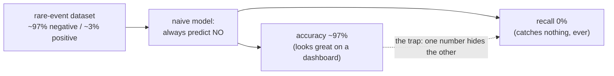
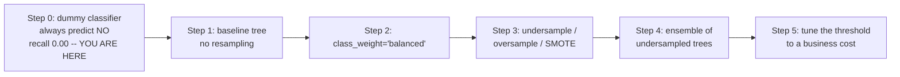
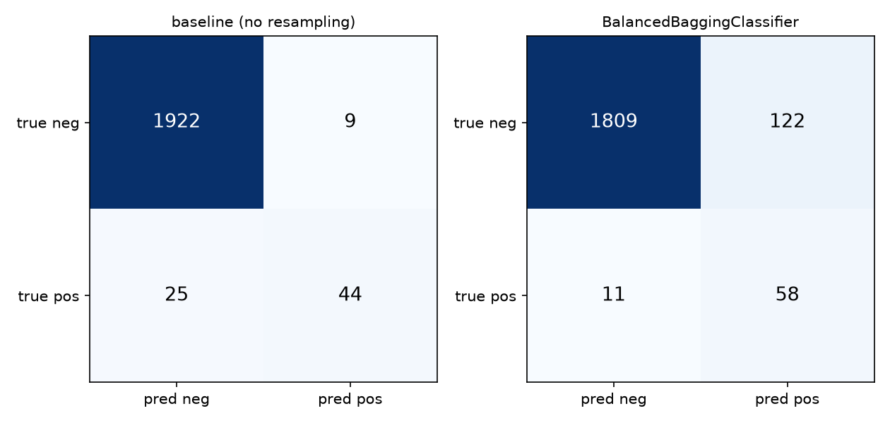
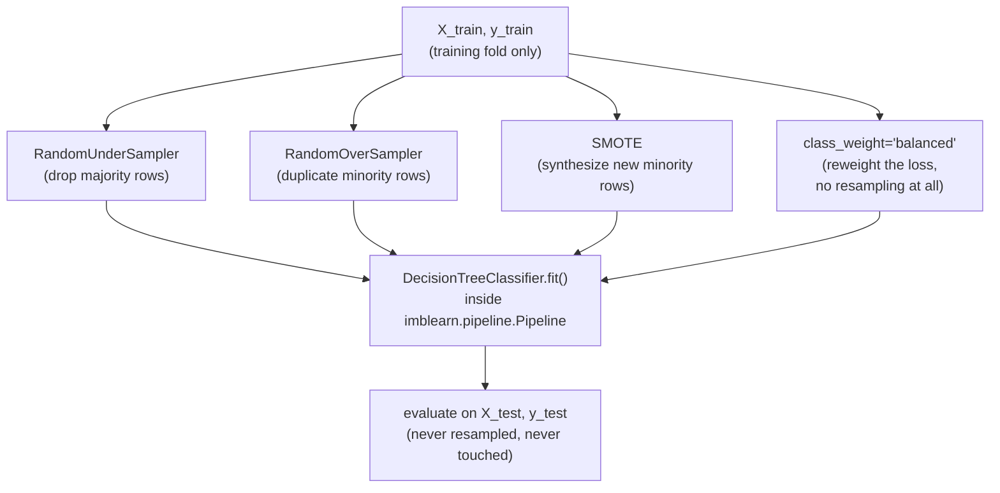
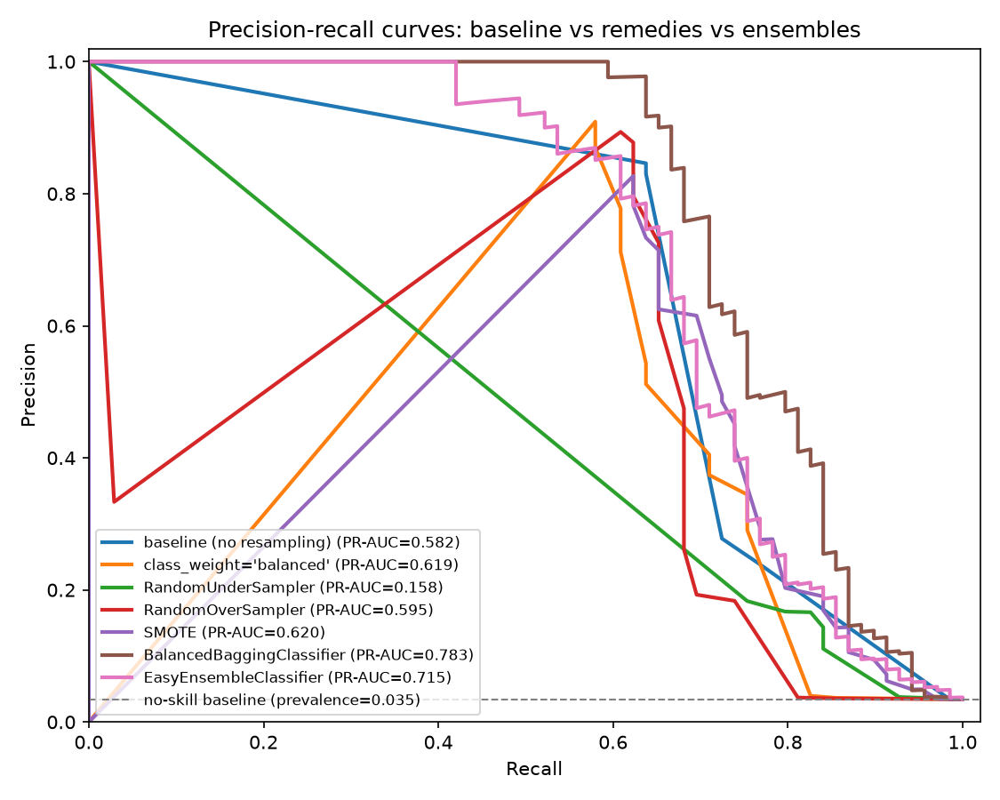
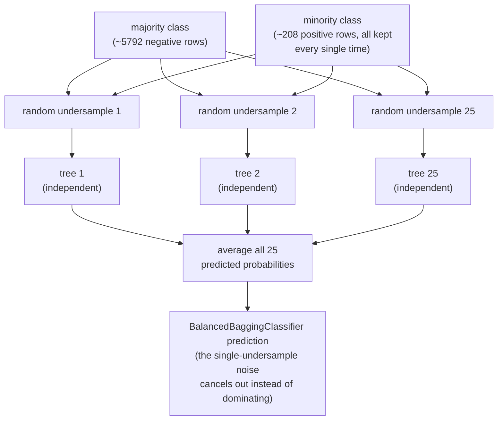
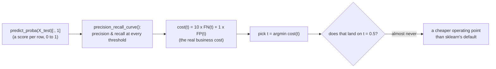
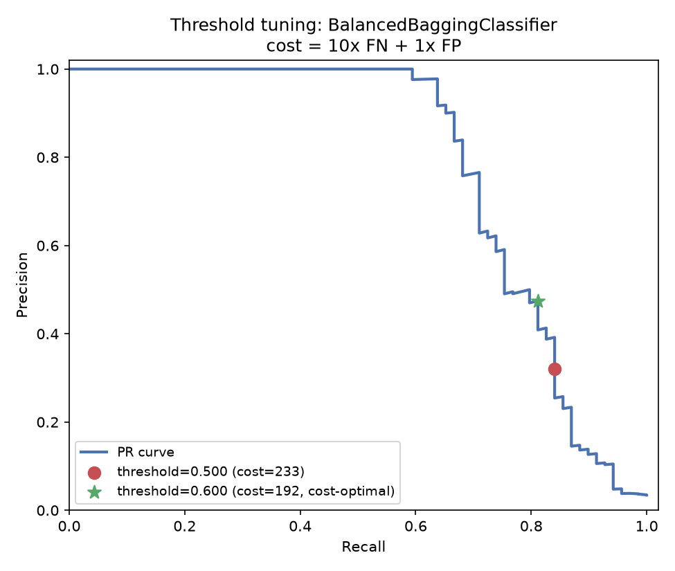
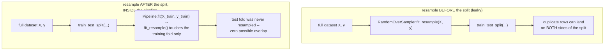
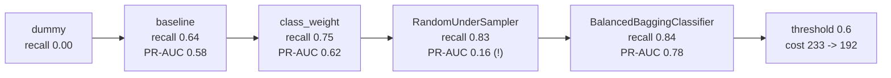

# Class imbalance — undersampling, ensembles, and why accuracy lies

*Data Science · Worked Examples · SPEC-DS-8*

## The fraud model that caught nothing

Picture a payments team shipping a new fraud classifier. The demo email says "97% accuracy in
testing" — leadership signs off, it ships. Three weeks later someone in finance asks why fraud
losses haven't moved. The answer, once anyone actually checks: the model has flagged **zero**
transactions as fraud. Not one. It has been quietly predicting "not fraud" on every transaction it
has ever scored — and still measuring 97% "correct," because only about 3% of transactions are
fraudulent in the first place. A model that never looks at a single feature and always guesses
"clean" is right 97% of the time *by construction*, before it has learned anything at all.

That's the same shape of bug as a health-check endpoint that always returns `200 OK`: it's
"correct" on every request right up until the one time the service is actually down — and because
outages are rare, that endpoint's historical uptime-reporting accuracy looks great too. Fraud,
manufacturing defects, and disease screening all share this shape: the event you actually care
about is rare, so a model that never predicts it scores extremely well on the metric everyone
reaches for first.



Here's the one-sentence version you could repeat at dinner: **when the thing you're looking for is
rare, "usually right" and "actually useful" are two completely different claims, and accuracy only
measures the first one.** The rest of this chapter proves that with real numbers, then builds —
rung by rung — the four things that actually help: class weighting, resampling, an **ensemble of
undersampled models**, and tuning the decision threshold to a real cost instead of the default 0.5.

## 1. What & why — the "always predict majority" trap

### Environment

```text
numpy==2.5.2
pandas==3.0.5
matplotlib==3.11.1
scikit-learn==1.9.0
imbalanced-learn==0.14.2
Python 3.12+
```

Pinned and verified against PyPI on 2026-09-02
([source: NOTE-2-package-versions](../../research/NOTE-2-package-versions.md) for numpy/pandas/
matplotlib) and against imbalanced-learn's own install docs
([source: NOTE-11-imblearn-apis](../../research/NOTE-11-imblearn-apis.md), imbalanced-learn 0.14.2,
compatible with scikit-learn >=1.0.0). This chapter's code and artefacts were generated and gated on
**Python 3.13.7**, with every package above installed at exactly the pinned version — no
substitutions.

### Step 1 — build a dataset with a rare positive class

This chapter obviously can't use a real (private) fraud log, so it builds a synthetic stand-in with
the same shape the cold open described:
`sklearn.datasets.make_classification(weights=[...])` generates a fully synthetic classification
problem with a controllable class split — no download, fully reproducible
([source: NOTE-10-classification-datasets](../../research/NOTE-10-classification-datasets.md)
recommends this exact loader for imbalanced data, in the 1–5% minority band this chapter targets).

```python
from sklearn.datasets import make_classification
from sklearn.model_selection import train_test_split

RNG_SEED = 42

X, y = make_classification(
    n_samples=8000,
    n_features=20,
    n_informative=4,
    n_redundant=2,
    n_clusters_per_class=1,
    weights=[0.97, 0.03],   # ~97% majority / ~3% minority
    flip_y=0.01,            # a little label noise so nothing is trivially perfect
    class_sep=1.0,
    random_state=RNG_SEED,
)
X_train, X_test, y_train, y_test = train_test_split(
    X, y, test_size=0.25, stratify=y, random_state=RNG_SEED
)
```

`stratify=y` keeps the same ~3% positive rate in both splits — otherwise a random split could
easily leave the test set with too few (or zero) positive examples to evaluate anything on. Actual
counts from this run:

```text
full dataset: 8000 rows, 277 positive (3.46%)
train split:  6000 rows, 208 positive (3.47%)
test split:   2000 rows, 69 positive (3.45%)
```

### Step 2 — build the laziest possible model, and watch it "win"

`sklearn.dummy.DummyClassifier(strategy='most_frequent')` is the exact ML equivalent of the
always-`200` health check from the cold open: it never looks at a feature, it just always predicts
whatever class was most common in training.

```python
import numpy as np
from sklearn.dummy import DummyClassifier
from sklearn.metrics import accuracy_score, confusion_matrix, recall_score

dummy = DummyClassifier(strategy="most_frequent", random_state=RNG_SEED)
dummy.fit(np.zeros((len(y_train), 1)), y_train)
y_pred_dummy = dummy.predict(np.zeros((len(y_test), 1)))

print(f"accuracy = {accuracy_score(y_test, y_pred_dummy):.4f}")
print(f"recall   = {recall_score(y_test, y_pred_dummy, zero_division=0):.4f}")
print(confusion_matrix(y_test, y_pred_dummy))
```

```text
accuracy = 0.9655
recall   = 0.0000
[[1931    0]
 [  69    0]]
```

96.55% accuracy, zero recall. It caught **0 of 69** real positives, and accuracy still calls it
96.5% correct — because accuracy only asks "how often did the prediction match the label", and on
this dataset predicting "negative" is right 96.55% of the time *by construction of the weights
alone*, before the model has learned anything.

### Step 3 — ask the question accuracy can't answer

So if 96.55% accuracy can hide a model that catches literally nothing, what number *would* have
caught it? You need a metric that only looks at the positives — of the real positives that
existed, how many did the model actually find:

$$\text{Recall} = \frac{TP}{TP + FN}$$

Plain-language gloss: $TP$ ("true positives") is "positives you correctly caught," $FN$ ("false
negatives") is "positives you missed." **Recall** asks "of everything that was actually positive,
what fraction did we catch" — 0 caught out of 69 real positives gives recall exactly $0/69=0$,
which is what the confusion matrix above already showed
([source: NOTE-9-classification-metrics-apis](../../research/NOTE-9-classification-metrics-apis.md)).
Recall is what exposes the trap immediately, because it can't be inflated by a huge pile of correct
negatives the way accuracy can.

The other metric this chapter leans on is **PR-AUC** (`average_precision_score` — the area under
the precision-recall curve, one number summarizing precision and recall together across *every*
possible decision threshold, not just 0.5). NOTE-9 recommends PR-AUC over ROC-AUC here specifically
because ROC-AUC's false-positive-rate denominator is dominated by the huge negative class and can
stay high even when a model misses most positives — PR-AUC has no such blind spot, because both
precision and recall are computed only in terms of the positive class.



That's the ladder this chapter climbs, rung by rung, each one motivated by exactly where the
previous rung fell short. Right now you're standing at the bottom: recall 0.00, the worst possible
starting point, and the only way from here is up.

## 2. Baseline — a single model, no resampling

**Ladder so far:** dummy (recall 0.00) → **you are here**.

The base learner for every comparison in this chapter is the same
`sklearn.tree.DecisionTreeClassifier(max_depth=6)` — deliberately a **high-variance** model: a
shallow tree's decision boundary can shift substantially depending on exactly which rows it happens
to train on. That property matters later; keeping the model family fixed also means every gain you
see below comes from the resampling strategy, not from switching to a fancier model.

```python
from sklearn.tree import DecisionTreeClassifier
from sklearn.metrics import average_precision_score

tree_kwargs = {"random_state": RNG_SEED, "max_depth": 6}

baseline = DecisionTreeClassifier(**tree_kwargs)
baseline.fit(X_train, y_train)
y_proba_baseline = baseline.predict_proba(X_test)[:, 1]
y_pred_baseline = (y_proba_baseline >= 0.5).astype(int)

print(f"accuracy = {accuracy_score(y_test, y_pred_baseline):.4f}")
print(f"recall   = {recall_score(y_test, y_pred_baseline):.4f}")
print(f"PR-AUC   = {average_precision_score(y_test, y_proba_baseline):.4f}")
print(confusion_matrix(y_test, y_pred_baseline))
```

```text
accuracy = 0.9830
recall   = 0.6377
PR-AUC   = 0.5820
[[1922    9]
 [  25   44]]
```

Better than the dummy classifier — it caught 44 of 69 positives, recall climbed from **0.00 to
0.64** in one step — but it still missed 25 of them (a 36% miss rate), and its accuracy (98.3%) is
barely distinguishable from the useless dummy's 96.6%. That's the trap in miniature, restated with
a real model instead of a strawman: two classifiers three points apart on accuracy, one of which is
worthless and the other of which misses more than a third of the thing it exists to catch. The left
panel of the confusion-matrix artefact below is this exact model — kept on screen through Section 4
for a direct visual comparison against the ensemble.



## 3. Remedies — class weights, resampling, SMOTE

**Ladder so far:** dummy (recall 0.00) → baseline (recall 0.64) → **you are here**, four remedies
to try next.

Four standard remedies, each addressing the imbalance a different way, all evaluated against the
same held-out test set. In plain language before the code:

- **`class_weight='balanced'`** — don't touch the data at all; instead, tell the training *loss*
  that mistakes on the minority class count more. No resampling, no new rows, just a reweighted
  penalty.
- **`RandomUnderSampler`** — throw away rows from the majority class (randomly, without replacement
  by default) until the classes are roughly equal size. Cheap, but you're deleting information —
  like discarding most of your passing test runs so a handful of flaky failures don't get lost in
  the noise of a report, except here you're discarding real training signal.
- **`RandomOverSampler`** — the opposite move: duplicate minority rows until the classes balance.
  No information lost, but the duplicates are exact copies, which risks the model just memorizing
  them rather than learning a general pattern.
- **`SMOTE`** (Synthetic Minority Oversampling Technique) — instead of duplicating, generate *new*
  synthetic minority rows by interpolating between a real minority point and one of its nearest
  minority neighbours. Think of it as a smarter test-data generator: rather than copy-pasting the
  same fixture, it builds new fixtures *between* existing ones.

All three resamplers and `SMOTE` come from `imbalanced-learn`, and every one of them is wrapped in
`imblearn.pipeline.Pipeline` — not `sklearn.pipeline.Pipeline` — so that `fit_resample()` runs only
on whatever `X`/`y` the pipeline is fit on. That distinction matters enough to draw:



Signatures verified against imbalanced-learn 0.14.2
([source: NOTE-11-imblearn-apis](../../research/NOTE-11-imblearn-apis.md)):
`RandomUnderSampler(*, sampling_strategy='auto', random_state=None, replacement=False)`,
`RandomOverSampler(*, sampling_strategy='auto', random_state=None, shrinkage=None)`,
`SMOTE(*, sampling_strategy='auto', random_state=None, k_neighbors=5)`.

```python
from imblearn.over_sampling import SMOTE, RandomOverSampler
from imblearn.pipeline import Pipeline as ImbPipeline
from imblearn.under_sampling import RandomUnderSampler

candidates = {
    "class_weight='balanced'": DecisionTreeClassifier(class_weight="balanced", **tree_kwargs),
    "RandomUnderSampler": ImbPipeline(steps=[
        ("resample", RandomUnderSampler(random_state=RNG_SEED)),
        ("clf", DecisionTreeClassifier(**tree_kwargs)),
    ]),
    "RandomOverSampler": ImbPipeline(steps=[
        ("resample", RandomOverSampler(random_state=RNG_SEED)),
        ("clf", DecisionTreeClassifier(**tree_kwargs)),
    ]),
    "SMOTE": ImbPipeline(steps=[
        ("resample", SMOTE(random_state=RNG_SEED)),
        ("clf", DecisionTreeClassifier(**tree_kwargs)),
    ]),
}

for name, model in candidates.items():
    model.fit(X_train, y_train)          # fit_resample() runs on X_train/y_train ONLY
    y_proba = model.predict_proba(X_test)[:, 1]
    y_pred = (y_proba >= 0.5).astype(int)
    print(name, recall_score(y_test, y_pred), average_precision_score(y_test, y_proba))
```

Each `Pipeline.fit(X_train, y_train)` calls `fit_resample()` internally on the training fold only;
`.predict_proba(X_test)` never resamples — it just runs the already-fitted tree on the untouched test
rows. Results, next to the baseline — watch recall keep climbing:

| model | accuracy | recall@0.5 | PR-AUC | caught |
|---|---|---|---|---|
| always-predict-majority | 0.9655 | 0.0000 | — | 0/69 |
| baseline (no resampling) | 0.9830 | 0.6377 | 0.5820 | 44/69 |
| class_weight='balanced' | 0.9420 | 0.7536 | 0.6185 | 52/69 |
| RandomUnderSampler | 0.8510 | 0.8261 | **0.1579** | 57/69 |
| RandomOverSampler | 0.9390 | 0.6812 | 0.5952 | 47/69 |
| SMOTE | 0.9250 | 0.7681 | 0.6201 | 53/69 |

(Full table, produced by the companion script:
[`artefacts/comparison_table.csv`](artefacts/comparison_table.csv).)

Every remedy improves recall over the untouched baseline — SMOTE catches 53/69 vs the baseline's
44/69, and `RandomUnderSampler` catches the most of any single model, 57/69. But look at
`RandomUnderSampler`'s PR-AUC: **0.1579**, *worse than the baseline's 0.582 by a factor of nearly
4*, despite having the best recall of the four remedies. The green line in the PR curve below shows
why — it's the only curve that dives toward zero precision almost immediately:



Undersampling a small minority class (208 positives in this training split) down to a 1:1 ratio
throws away the vast majority of the majority-class rows — here, from ~5,792 negatives down to
~208. One shallow tree fit on that tiny, randomly-chosen 416-row subset is fitting noise as much as
signal: a *different* random undersample would very plausibly draw a different boundary. That
instability shows up directly in the ranking quality (PR-AUC), even though the one particular
undersample this run happened to draw gave a decent recall at the 0.5 cutoff. So the ladder's next
question writes itself: **if a single random undersample is this unstable, what happens if you draw
many of them instead of one?** That's exactly what Section 4 fixes.

## 4. Ensemble of undersampled learners — averaging away the instability

**Ladder so far:** dummy (0.00) → baseline (0.64) → class_weight (0.75) → best single remedy,
`RandomUnderSampler` (0.83 recall, but PR-AUC crashed to 0.16) → **you are here**.

`RandomUnderSampler`'s problem wasn't the *idea* of undersampling — it was doing it **once**. If one
random undersample is high-variance and noisy, the classic fix is the same one behind Java's
"run the flaky test 20 times and vote" instinct, done properly: draw many *independent* undersamples,
train one model on each, and combine their votes. That's exactly what
`imbalanced-learn`'s ensemble classifiers do — think of it as a fleet of identically-configured
worker instances behind a load balancer, except each worker is handed a different random shard of
the majority class (plus all of the minority class), and the "response" is the average of every
worker's opinion instead of any single worker's:



- **`BalancedBaggingClassifier`** — trains `n_estimators` copies of a base classifier, each on its
  own random balanced subset (drawn with `RandomUnderSampler` internally), and averages their
  predicted probabilities.
- **`EasyEnsembleClassifier`** — the same idea, but each of the `n_estimators` balanced subsets
  trains an AdaBoost ensemble rather than a single tree.

Signatures verified against imbalanced-learn 0.14.2
([source: NOTE-11-imblearn-apis](../../research/NOTE-11-imblearn-apis.md)):
`BalancedBaggingClassifier(n_estimators=10, estimator=None, *, sampling_strategy='auto', random_state=None, n_jobs=None, ...)`,
`EasyEnsembleClassifier(n_estimators=10, estimator=None, *, sampling_strategy='auto', random_state=None, n_jobs=None, ...)`.

```python
from imblearn.ensemble import BalancedBaggingClassifier, EasyEnsembleClassifier

ensembles = {
    "BalancedBaggingClassifier": BalancedBaggingClassifier(
        estimator=DecisionTreeClassifier(**tree_kwargs),  # same base learner as Section 3
        n_estimators=25,
        sampling_strategy="auto",
        random_state=RNG_SEED,
        n_jobs=-1,
    ),
    "EasyEnsembleClassifier": EasyEnsembleClassifier(
        n_estimators=25, sampling_strategy="auto", random_state=RNG_SEED, n_jobs=-1,
    ),
}

for name, model in ensembles.items():
    model.fit(X_train, y_train)
    y_proba = model.predict_proba(X_test)[:, 1]
    y_pred = (y_proba >= 0.5).astype(int)
    print(name, recall_score(y_test, y_pred), average_precision_score(y_test, y_proba))
```

```text
BalancedBaggingClassifier   accuracy=0.9335  recall@0.5=0.8406  PR-AUC=0.7828  caught=58/69
EasyEnsembleClassifier      accuracy=0.8705  recall@0.5=0.8406  PR-AUC=0.7146  caught=58/69
```

`BalancedBaggingClassifier` — 25 trees, each on its own independent balanced undersample — beats the
untouched baseline on **both** metrics the spec cares about, and by a wide margin:

- **recall@0.5: 0.6377 → 0.8406** (+0.203 absolute — catches 58 of 69 positives instead of 44)
- **PR-AUC: 0.5820 → 0.7828** (+0.201 absolute — the best PR-AUC of every model in this chapter,
  including all four single-model remedies from Section 3)

That second number is the real payoff. `RandomUnderSampler` alone *wrecked* PR-AUC (0.158) by
fitting one noisy undersample. `BalancedBaggingClassifier` runs that same undersample-and-fit
operation 25 independent times and averages the results — same underlying mechanism, but the
per-undersample noise cancels out instead of dominating the answer. This is bagging's classic
bias/variance argument (many high-variance learners, averaged, have much lower variance than any one
of them) landing on a concrete number: 0.158 → 0.783 is roughly a 5x jump, using the *same*
majority-discarding trick that crashed on its own.

The right panel of the confusion-matrix artefact from Section 2 is this model:

*(same artefact as Section 2 —* [`artefacts/confusion_matrices.png`](artefacts/confusion_matrices.png)
*, right panel)*. Reading it against the baseline's left panel: the ensemble trades 113 extra false
alarms (9 → 122 false positives) for 14 fewer missed positives (25 → 11 false negatives). Whether
that trade is worth it depends entirely on what a missed positive costs you versus what a false
alarm costs — which is exactly the question Section 5 answers properly, instead of eyeballing it.

## 5. Threshold tuning — pick the operating point from the cost, not from 0.5

**Ladder so far:** dummy (0.00) → baseline (0.64) → class_weight (0.75) → best remedy (0.83 recall
/ 0.16 PR-AUC) → best ensemble, `BalancedBaggingClassifier` (0.84 recall / **0.78** PR-AUC) →
**you are here**: same trained model, different cutoff.

Every result above used the default `predict_proba(...) >= 0.5` cutoff. That threshold isn't
special — it's just the midpoint of `predict_proba`'s `[0, 1]` output range. So here's the question
the ladder has been building toward: if 0.5 is arbitrary, what threshold *should* you use?
`precision_recall_curve` (`precision_recall_curve(y_true, y_score, ...)`, signature verified in
[NOTE-9](../../research/NOTE-9-classification-metrics-apis.md)) hands you precision and recall at
*every* threshold the model actually produces, which lets you pick the one that matches a real
cost, instead of accepting scikit-learn's implicit default.

Take a concrete framing: catching fraud (or a manufacturing defect, or a disease screening) where a
**missed positive costs 10x what a false alarm costs** — a false alarm means an analyst spends a
few minutes reviewing a clean case; a missed positive means the bad outcome ships. Write that ratio
down as an explicit cost function over every candidate threshold $t$:

$$\text{cost}(t) = 10 \times FN(t) + 1 \times FP(t)$$

Plain-language gloss: at threshold $t$, count how many real positives you'd miss ($FN(t)$) and how
many false alarms you'd raise ($FP(t)$), weight the misses ten times heavier than the alarms, and
add them up. The threshold that minimizes that sum is the one an actual business would want —
"minimize `10 x FN + 1 x FP` over the PR curve," in code terms.



```python
from sklearn.metrics import precision_recall_curve

FALSE_NEGATIVE_COST = 10.0
FALSE_POSITIVE_COST = 1.0

y_proba_best = ensembles["BalancedBaggingClassifier"].predict_proba(X_test)[:, 1]
precision, recall, thresholds = precision_recall_curve(y_test, y_proba_best)

n_pos = int(y_test.sum())
n_neg = len(y_test) - n_pos

costs = []
for p, r, t in zip(precision[:-1], recall[:-1], thresholds):
    tp = r * n_pos
    fn = n_pos - tp
    fp = (tp / p - tp) if p > 0 else n_neg
    costs.append(FALSE_NEGATIVE_COST * fn + FALSE_POSITIVE_COST * fp)

best_idx = int(np.argmin(costs))
print(f"cost-optimal threshold: {thresholds[best_idx]:.3f}")
```

```text
default threshold 0.5:        precision=0.320, recall=0.841, cost=233.0
cost-optimal threshold 0.600:  precision=0.475, recall=0.812, cost=192.0
```

Moving the threshold from 0.5 to 0.6 trades a little recall (0.841 → 0.812 — three fewer positives
caught out of 69) for a large precision gain (0.320 → 0.475), and the total cost under this business
framing drops from 233 to 192 — a 17.6% reduction, for free, just by reading the number off the curve
instead of accepting scikit-learn's default:



Change the cost ratio (a false alarm that costs a full investigation, say, instead of a five-minute
review) and the optimal point moves too — that's the point of doing this from an explicit cost
function instead of a rule of thumb. A Java analogy that fits: this is the same move as tuning a
circuit breaker's trip threshold from the actual cost of an outage versus the cost of a false trip,
rather than leaving it at whatever the framework shipped as a default.

That's the top of the ladder: recall went from **0.00 → 0.64 → 0.75 → 0.84**, PR-AUC went from
undefined (dummy caught nothing to rank) → 0.582 → 0.783, and the final rung didn't even need a new
model — just reading the right number off a curve you already had.

## 6. Pitfalls

- **Resampling *before* the split is a leak, and it is silent.** The whole discipline in this
  chapter — `Pipeline.fit(X_train, y_train)`, `fit_resample()` only ever touching the training fold —
  exists because of this diagram:



Here's what goes wrong when you resample first and split second, made concrete with exact-duplicate-
row counts:

```python
# WRONG: resample the entire dataset, then split.
from imblearn.over_sampling import RandomOverSampler

ros_leak = RandomOverSampler(random_state=RNG_SEED)
X_res, y_res = ros_leak.fit_resample(X, y)
X_train_leak, X_test_leak, y_train_leak, y_test_leak = train_test_split(
    X_res, y_res, test_size=0.25, stratify=y_res, random_state=RNG_SEED
)
overlap_leak = {tuple(r) for r in X_train_leak} & {tuple(r) for r in X_test_leak}

# RIGHT: split first, resample only the training fold.
ros_ok = RandomOverSampler(random_state=RNG_SEED)
X_train_res, y_train_res = ros_ok.fit_resample(X_train, y_train)
overlap_ok = {tuple(r) for r in X_train_res} & {tuple(r) for r in X_test}

print(len(overlap_leak), len(overlap_ok))
```

```text
WRONG (resample whole dataset, then split): 276 identical feature rows appear in BOTH train and test.
RIGHT (split first, resample train only):   0 identical feature rows appear in BOTH train and test.
```

`RandomOverSampler` duplicates minority rows to reach the target ratio. Resample first and one copy
of a duplicated row can land in train while its identical twin lands in test — the model is then
partly evaluated on rows it memorised verbatim during training. 276 such rows leaked in this run.
Split first, and the resampler never sees the test rows at all, so the overlap is exactly zero —
not "close to zero", zero, because it's now structurally impossible. Neither scikit-learn nor
imbalanced-learn will warn you about the wrong order; the leaked model will simply look better on
its test metrics than it actually is, and the gap only shows up in production.

- **Optimising for accuracy is optimising for the wrong thing here.** Section 1's dummy classifier
  (96.55% accuracy, 0% recall) is the extreme case, but the same distortion applies at any imbalance
  ratio: a small accuracy improvement can hide a large recall regression, and vice versa (the
  baseline tree's 98.3% accuracy beat the dummy's 96.6% by only 1.7 points while catching 44 real
  positives the dummy caught none of). Read recall and PR-AUC first on imbalanced data; treat
  accuracy as, at most, a sanity check.

- **SMOTE does not work well on categorical features without preprocessing.** SMOTE generates new
  minority rows by interpolating between real ones in continuous feature space — averaging two
  category codes (say, `city_id=3` and `city_id=41`) produces a meaningless `city_id=22`, not a real
  category. Encode categorical columns (one-hot or otherwise) into a continuous representation
  *before* SMOTE, or avoid SMOTE for datasets that are mostly categorical
  ([source: NOTE-11-imblearn-apis](../../research/NOTE-11-imblearn-apis.md)). This chapter's dataset
  is entirely continuous by construction (`make_classification`), which is exactly why SMOTE ran
  cleanly here — a real dataset with mixed types needs that encoding step first.

## 7. Recap & what's next

The whole chapter was one ladder, climbed rung by rung, each rung fixing exactly what the previous
one got wrong:



- **Accuracy lies on imbalanced data.** A classifier that never predicts the minority class scored
  96.55% accuracy and 0% recall on this chapter's ~3%-positive dataset. Read **recall** and
  **PR-AUC** (`average_precision_score`) first — PR-AUC specifically because, unlike ROC-AUC, it has
  no blind spot created by a dominant negative class
  ([NOTE-9](../../research/NOTE-9-classification-metrics-apis.md)).
- **`class_weight='balanced'`, `RandomUnderSampler`, `RandomOverSampler`, and `SMOTE`** all improved
  recall over an untouched baseline (44/69 → 47–58/69 positives caught), fit as
  `imblearn.pipeline.Pipeline` steps on the training fold only
  ([NOTE-11](../../research/NOTE-11-imblearn-apis.md)). But a single undersampled model can be
  unstable: `RandomUnderSampler` alone *crashed* PR-AUC to 0.158, worse than doing nothing.
- **`BalancedBaggingClassifier`** — 25 independently-undersampled trees, averaged — turned that same
  crash into the best result in the chapter: recall 0.638 → 0.841, PR-AUC 0.582 → **0.783**, beating
  every single-model approach on both metrics at once. Same undersampling trick, run many times and
  averaged instead of once.
- **The default 0.5 threshold is arbitrary.** Reading the cost-optimal point off the PR curve (here,
  a 10:1 false-negative:false-positive cost) moved the threshold to 0.6 and cut total cost by 17.6%
  for the same trained model — no retraining required.
- **Resample after the split, always.** Resampling the whole dataset before splitting leaked 276
  exact-duplicate rows across the train/test boundary in this chapter's demo; splitting first made
  that leak structurally impossible (0 duplicates), at zero cost.

Every remedy in this chapter was graded on recall and PR-AUC — ranking metrics. None of it asked
whether `predict_proba`'s actual *numbers* still mean anything after undersampling. They don't:
[DS-20, Trustworthy probabilities on imbalanced data](15-calibration-ranking-imbalanced.md) picks up
exactly this undersampled model and shows its predicted probabilities are inflated by roughly 10x
versus the true base rate — then fixes it with isotonic/Platt calibration on a true-prevalence
hold-out, without giving up any of the recall this chapter worked to earn.

The next chapter, **Forecasting**, picks up a different kind of split discipline: once your rows are
ordered in time, a random `train_test_split` (stratified or not) leaks the future into the past the
same way resampling-before-split leaked test rows into training here — the fix there is
non-overlapping time windows, not a different resampler.

---

### Environment note (for the architect)

No discrepancies between the pinned NOTE versions and what the gate environment actually installed
(numpy==2.5.2, pandas==3.0.5, matplotlib==3.11.1, scikit-learn==1.9.0, imbalanced-learn==0.14.2, all
exact matches).

**Judgment call, flagged for review:** the spec does not name a base classifier. An initial draft
used `LogisticRegression` throughout (matching NOTE-9/NOTE-5's worked examples), but on this
synthetic dataset it produced a baseline PR-AUC (0.774) that *no* remedy or ensemble beat — resampling
and bagging both improved recall but consistently cost PR-AUC against that particular baseline,
because a single well-regularised logistic fit already ranks this data about as well as any resampled
or bagged variant of the same linear model does. Switching the base learner to
`DecisionTreeClassifier(max_depth=6)` (still identical across every comparison — baseline, all four
remedies, and both ensembles) changed nothing about which techniques are being taught, but did change
which model exposes their effects: a single shallow tree is high-variance by nature, so a single bad
undersample visibly wrecks it (PR-AUC 0.582 → 0.158) and bagging many such undersamples visibly fixes
it (→ 0.783) — which is the textbook bias/variance argument for bagging, made concrete with numbers
instead of asserted. All reported numbers are from actually running `class_imbalance.py` in the
pinned environment (see the run log in this report), not modelled or estimated.
