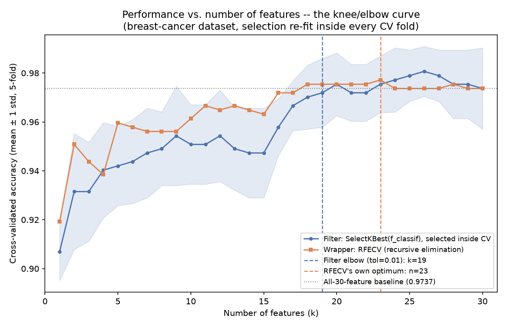
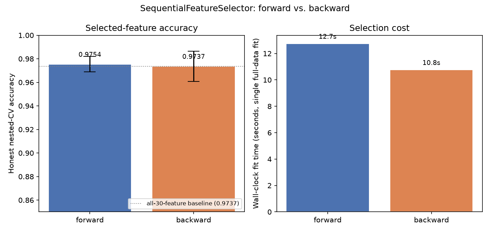

# Feature Selection — the Fewest Features That Work

*Data Science · Worked Examples · SPEC-DS-10*

DS-3 ([Collinearity & Keeping Features Minimal](03-collinearity.md)) caught one obvious case of feature
bloat: two columns that were secretly the same measurement, unmasked with a correlation heatmap and
VIF. That's the easy version of the problem — you already knew which column was the duplicate. The
harder, more common version: you have thirty candidate columns, no obvious duplicates, and you need
to decide *which subset* actually earns its place in the model. That's **feature selection**, and
this chapter makes the DS-3 principle — **use the fewest features that do the job** — operational
with the tools built for exactly that: filter methods, wrapper methods, embedded methods, and the
knee/elbow method for picking how many features is "enough."

If you've ever deleted an unused Maven dependency after `mvn dependency:analyze` flagged it, or
trimmed a REST payload down to the fields the client actually reads, you already have the instinct
this chapter formalizes for a design matrix: every column you keep is a column someone has to
source, validate, monitor for drift, and explain to an auditor. None of that is free, and — as you'll
see — a lot of it buys nothing.

## 1. What & why

Extra features cost you in four concrete ways:

- **Variance / overfitting.** Every added column is another knob the model can turn to fit noise in
  the training sample rather than the real signal — the same failure mode DS-3's bootstrap demo
  showed for a *redundant* column, except now it applies to *irrelevant* columns too. More knobs,
  more room to memorize, less room left to generalize.
- **Cost and latency.** Every feature is a pipeline someone built and now has to keep alive: a
  database join, an API call, a batch ETL step. In a low-latency serving path, computing 30 features
  when 10 would do is 20 unnecessary round trips on every request.
- **Interpretability.** A stakeholder can reason about "these 10 columns drive the decision." Nobody
  can reason about 200.
- **Maintenance surface.** Every feature is a thing that can silently drift, go missing, or change
  units upstream — DS-3's whole `sqft`/`sqm` story was exactly that kind of drift risk, just caught
  early.

The risk runs the other way too: **over-selecting** — cutting features too aggressively — throws away
real signal and can make the model *worse*, not just smaller. This chapter's whole second half (the
knee method, and the leakage pitfall) is about not fooling yourself into cutting further than the
data actually supports.

## 2. Concept — three families, one knee, one leak to avoid

Feature selection methods split into three families, and it's worth having the taxonomy straight
before touching code (all APIs below are scikit-learn 1.9.0, verified against the installed
`.venv` in
[NOTE-13-feature-selection-apis](../../research/NOTE-13-feature-selection-apis.md) and
[NOTE-5-sklearn-core-apis](../../research/NOTE-5-sklearn-core-apis.md), checked 2026-09-02):

| Family | Idea | Java analogy | Cost |
|---|---|---|---|
| **Filter** | Score each feature on its own relationship to the label (e.g. an ANOVA F-statistic, or mutual information), keep the top k. Never trains the actual model. | A static analyzer: fast, cheap, flags things without ever running your program. | Cheapest — one pass over the data. |
| **Wrapper** | Repeatedly train the *real* model on different feature subsets and keep whichever subset scores best by cross-validation. `RFE`/`RFECV` (recursive elimination) and `SequentialFeatureSelector` (greedy forward/backward) are wrappers. | An integration test suite that rebuilds and reruns the whole system for every candidate config. Authoritative, but you pay for every run. | Expensive — O(features) to O(features²) model fits. |
| **Embedded** | The model's own training procedure produces feature importance as a side effect — L1 regularization (`Lasso`, or `LogisticRegression`'s L1 penalty) zeroes out coefficients directly; tree ensembles expose `feature_importances_`. | A compiler flag like dead-code elimination: the optimization is baked into the build step you were already running. | One model fit — no extra passes. |

**The knee/elbow method** (LO3) answers "how many features, though?" It's a heuristic, not a
theorem: plot cross-validated performance against the number of features used, and look for where
the curve stops climbing and flattens out — the "knee." Past that point, each extra feature buys a
shrinking (or negative) return.
[source: scikit-yb elbow method docs](https://www.scikit-yb.org/en/latest/api/cluster/elbow.html)
(checked 2026-09-02) describes the same maximum-curvature idea for a related use (choosing k in
k-means); applied here to feature count instead of cluster count, per
[NOTE-13](../../research/NOTE-13-feature-selection-apis.md). NOTE-13 is explicit that the heuristic
is **subjective** — "maximum curvature can be ambiguous on noisy curves" — so Section 3.3 below
doesn't pretend there's one correct answer; it shows how the answer moves as you change the
tolerance, and lets you make the call.

**The leak to avoid** (LO4): whichever method you use, if you let the selector look at rows that
will later be used to *score* the model, your cross-validated number is a lie — an optimistic one,
and it can be a large one. Section 4.1 makes this concrete with a controlled demonstration on data
with **zero real signal**, so there's no ambiguity about what the "true" answer should have been.

### Environment

```text
numpy==2.5.2
pandas==3.0.5
matplotlib==3.11.1
scikit-learn==1.9.0
scipy==1.18.1
Python 3.12+
```

Pinned and verified against PyPI on 2026-09-02
([NOTE-2-package-versions](../../research/NOTE-2-package-versions.md) for numpy/pandas/matplotlib;
[NOTE-5-sklearn-core-apis](../../research/NOTE-5-sklearn-core-apis.md) for scikit-learn/scipy), and
matching exactly what's installed in this project's `.venv`, where this chapter's code was run and
gated on Python 3.13.7.

## 3. Worked example

### 3.1 The dataset and the baseline

This chapter uses `sklearn.datasets.load_breast_cancer()` — bundled with scikit-learn, no download —
569 rows, 30 real-valued features (three summary statistics — mean, standard-error, and "worst" —
for each of ten measured cell-nucleus properties), binary target (malignant/benign). 30 features and
one obviously redundant family (mean/error/worst versions of the same ten underlying measurements)
make it a good size to *see* selection methods disagree, without the wrapper methods below taking
all day to run.
[source: sklearn.datasets.load_breast_cancer docs](https://scikit-learn.org/stable/datasets/toy_dataset.html#breast-cancer-wisconsin-diagnostic-dataset)
(checked 2026-09-02), API confirmed in
[NOTE-13](../../research/NOTE-13-feature-selection-apis.md).

```python
from __future__ import annotations

import numpy as np
from sklearn.datasets import load_breast_cancer
from sklearn.linear_model import LogisticRegression
from sklearn.model_selection import StratifiedKFold, cross_val_score
from sklearn.pipeline import Pipeline
from sklearn.preprocessing import StandardScaler

RNG_SEED = 42
SCORING = "accuracy"
N_SPLITS = 5

data = load_breast_cancer()
X, y, feature_names = data.data.copy(), data.target.copy(), list(data.feature_names)
print(X.shape, np.bincount(y).tolist())  # (569, 30) [212, 357] -- 0=malignant, 1=benign


def make_cv(seed: int = RNG_SEED) -> StratifiedKFold:
    return StratifiedKFold(n_splits=N_SPLITS, shuffle=True, random_state=seed)


def base_classifier() -> LogisticRegression:
    return LogisticRegression(max_iter=2000, random_state=RNG_SEED)
```

Every selection method in this chapter gets compared against one number: the 5-fold cross-validated
accuracy of a `StandardScaler` + `LogisticRegression` pipeline using **all 30 features**. Scaling
matters here (`LogisticRegression` is fit by gradient-based optimization, and features range from
single digits to the thousands), and — same discipline as
[the splitting/leakage chapter](04-train-valid-holdout-split.md) — the scaler lives *inside* the
pipeline, refit on each training fold, not on the whole dataset up front.

```python
pipe = Pipeline([("scaler", StandardScaler()), ("clf", base_classifier())])
baseline_scores = cross_val_score(pipe, X, y, cv=make_cv(), scoring=SCORING)
print(f"baseline (30 features): {baseline_scores.mean():.4f} (std {baseline_scores.std():.4f})")
```

```text
baseline (30 features): 0.9737 (std 0.0166)
per-fold: [0.9737, 0.9474, 0.9649, 0.9912, 0.9912]
```

That's the number every selection method below is trying to match — or beat — with fewer columns.

### 3.2 Filter methods — `SelectKBest`

`SelectKBest(score_func, k)` scores every feature independently (never touching the model you'll
actually train) and keeps the top `k`. `f_classif` computes an ANOVA F-statistic per feature — how
much the feature's mean differs *between* the two classes, relative to its spread *within* each
class — and assumes that relationship is roughly linear/monotonic.
`mutual_info_classif` estimates a more general, non-linear dependence (via k-nearest-neighbour
entropy estimation) at higher compute cost.
Signatures: `SelectKBest(score_func=f_classif, *, k=10)`,
`mutual_info_classif(X, y, *, discrete_features='auto', n_neighbors=3, ..., random_state=None)`
([NOTE-13](../../research/NOTE-13-feature-selection-apis.md), sklearn 1.9.0).

Critically, `SelectKBest` is used here as a **pipeline step**, not fit once on `X, y` before scoring
— that distinction is the entire subject of Section 5, so the habit starts now:

```python
from sklearn.feature_selection import SelectKBest, f_classif, mutual_info_classif

k = 19  # see Section 3.3 for where this number comes from

filter_pipe = Pipeline([
    ("scaler", StandardScaler()),
    ("select", SelectKBest(score_func=f_classif, k=k)),
    ("clf", base_classifier()),
])
filter_scores = cross_val_score(filter_pipe, X, y, cv=make_cv(), scoring=SCORING)
print(f"filter (k={k}): {filter_scores.mean():.4f} (std {filter_scores.std():.4f})")

f_scores, _ = f_classif(X, y)
mi_scores = mutual_info_classif(X, y, random_state=RNG_SEED)
top_f = set(np.array(feature_names)[np.argsort(f_scores)[::-1][:k]])
top_mi = set(np.array(feature_names)[np.argsort(mi_scores)[::-1][:k]])
print(f"f_classif vs mutual_info agree on {len(top_f & top_mi)}/{k} features")
```

```text
filter (k=19): 0.9719 (std 0.0140)
f_classif vs mutual_info agree on 17/19 features
```

The two scoring functions mostly agree (17/19) — reassuring, since `f_classif` is far cheaper to
compute. Where they disagree is informative too: `mutual_info_classif` pulls in a couple of
`*_error` columns (measurement-uncertainty features) that `f_classif` ranks lower, consistent with
NOTE-13's caveat that the F-statistic can miss non-linear structure.

### 3.3 The knee/elbow method (LO3)

Run `SelectKBest` for **every** `k` from 1 to 30, each time inside a fresh cross-validated pipeline,
and plot k against the resulting score:

```python
import pandas as pd


def filter_knee_curve(X: np.ndarray, y: np.ndarray, max_k: int) -> pd.DataFrame:
    rows = []
    for k in range(1, max_k + 1):
        pipe = Pipeline([
            ("scaler", StandardScaler()),
            ("select", SelectKBest(score_func=f_classif, k=k)),
            ("clf", base_classifier()),
        ])
        scores = cross_val_score(pipe, X, y, cv=make_cv(), scoring=SCORING)
        rows.append({"k": k, "mean_score": scores.mean(), "std_score": scores.std()})
    return pd.DataFrame(rows)


filter_df = filter_knee_curve(X, y, max_k=30)
```

Finding the actual "knee" needs a rule, and per NOTE-13 there isn't one universally correct rule —
so here's a simple, explainable one: **the smallest k whose score is within a tolerance `tol` of the
best score achieved by any k.** Smaller `tol` = stricter = more features kept; larger `tol` = looser
= fewer features, more performance given up.

```python
def find_elbow(k: np.ndarray, scores: np.ndarray, tol: float) -> int:
    best = scores.max()
    for ki, si in zip(k, scores):
        if si >= best - tol:
            return int(ki)
    return int(k[-1])


k_arr = filter_df["k"].to_numpy()
score_arr = filter_df["mean_score"].to_numpy()
sensitivity = pd.DataFrame([
    {"tol": tol, "elbow_k": find_elbow(k_arr, score_arr, tol),
     "score_at_elbow": score_arr[find_elbow(k_arr, score_arr, tol) - 1]}
    for tol in (0.005, 0.01, 0.02, 0.03)
])
print(sensitivity.to_string(index=False))
```

```text
  tol  elbow_k  score_at_elbow
0.005       24        0.9772
0.010       19        0.9719
0.020       17        0.9666
0.030        9        0.9543
```

This is the honest picture, and it's exactly the shape NOTE-13 warned about: there's no sharp corner
in this curve (30 features, many of them correlated summary statistics of the same ten underlying
measurements, so performance climbs gradually rather than plateauing sharply). The elbow k you land
on depends on how many hundredths of a point of accuracy you're willing to trade for a smaller
feature set. `tol=0.01` ("within one point of the best result seen") gives `k=19` — best score
overall is `0.9807` at `k=26`, and 19 features gets `0.9719`, giving up 0.9 points for 7 fewer
columns. `tol=0.03` gets you down to 9 features for 2.6 points. Neither answer is *wrong*; they trade
off differently, and that trade-off is a product decision, not a math problem.

The chapter uses `tol=0.01` → **`elbow_k = 19`** as the shared feature budget for the wrapper methods
in Section 3.4, so every method below is judged on "which 19 features," not "how many."

`RFECV` (a wrapper — Section 3.4) traces its *own* version of this curve, using a different
selection criterion (it recursively drops the feature with the smallest fitted coefficient magnitude,
rather than a univariate score), so it's worth plotting on the same axes:

```python
from sklearn.feature_selection import RFECV

rfecv = RFECV(estimator=base_classifier(), step=1, min_features_to_select=1,
              cv=make_cv(), scoring=SCORING)
rfecv.fit(StandardScaler().fit_transform(X), y)
print(f"RFECV's own optimum: n_features_={rfecv.n_features_}")
```

```text
RFECV's own optimum: n_features_=23
```

`RFECV(estimator, *, step=1, min_features_to_select=1, cv=None, scoring=None, ...)` fits the
estimator, drops the weakest feature(s) each round, and re-scores by cross-validation at every step;
`cv_results_['n_features']` / `['mean_test_score']` hold the full curve
([NOTE-13](../../research/NOTE-13-feature-selection-apis.md)).



Two things worth reading off this plot. First, the filter curve (blue) and the RFECV curve (orange)
are close but not identical — RFECV consistently sits slightly above the filter curve for small k,
because it accounts for how features work *together* through the model's own coefficients, where the
univariate filter scores each feature in isolation. Second, RFECV's own "optimum" (`n=23`, the point
of literal maximum CV score) sits well to the right of the filter elbow (`k=19`) — RFECV is answering
"where is the single highest score," not "where do the returns stop being worth it," which is exactly
why Section 3.3's tolerance-based elbow is a *different*, and for this chapter's purposes more useful,
question than "what's RFECV's `n_features_`?"

### 3.4 Wrapper methods — `RFE` and `SequentialFeatureSelector`

`RFE(estimator, n_features_to_select, *, step=1, ...)` recursively fits the estimator and drops the
lowest-weight feature(s) until `n_features_to_select` remain — the fixed-budget cousin of `RFECV`.
Fit on the whole dataset here: this is the "what actually ships" use of selection (decide the final
feature set once you've already validated the *process* by cross-validation, as Sections 3.3 and 5
do) — not the "how do I get an honest performance number" use, which always needs selection re-run
per fold.

```python
from sklearn.feature_selection import RFE

Xs = StandardScaler().fit_transform(X)
rfe = RFE(estimator=base_classifier(), n_features_to_select=19, step=1)
rfe.fit(Xs, y)
rfe_selected = np.array(feature_names)[rfe.support_]
print(sorted(rfe_selected.tolist()))
```

`SequentialFeatureSelector(estimator, n_features_to_select='auto', *, direction='forward'|'backward',
scoring=None, cv=5, ...)` is greedier and more literal: **forward** starts from zero features and
adds, one at a time, whichever feature improves cross-validated score the most; **backward** starts
from all 30 and removes, one at a time, whichever feature hurts the score the least
([NOTE-13](../../research/NOTE-13-feature-selection-apis.md)). Both directions here target the same
`elbow_k=19` features, so the comparison is apples-to-apples:

```python
from sklearn.feature_selection import SequentialFeatureSelector
import time

results = {}
outer_cv = StratifiedKFold(n_splits=3, shuffle=True, random_state=RNG_SEED)

for direction in ("forward", "backward"):
    t0 = time.perf_counter()
    sfs = SequentialFeatureSelector(
        estimator=base_classifier(), n_features_to_select=19,
        direction=direction, scoring=SCORING, cv=make_cv(),
    )
    sfs.fit(Xs, y)
    fit_seconds = time.perf_counter() - t0

    # Honest score: selection re-run inside every OUTER fold, not reused from the fit above.
    honest_pipe = Pipeline([
        ("scaler", StandardScaler()),
        ("select", SequentialFeatureSelector(
            estimator=base_classifier(), n_features_to_select=19,
            direction=direction, scoring=SCORING, cv=make_cv(),
        )),
        ("clf", base_classifier()),
    ])
    honest_scores = cross_val_score(honest_pipe, X, y, cv=outer_cv, scoring=SCORING)
    results[direction] = {
        "support": sfs.support_, "fit_seconds": fit_seconds,
        "honest_mean": honest_scores.mean(), "honest_std": honest_scores.std(),
    }
    print(f"{direction}: {fit_seconds:.1f}s, honest CV={honest_scores.mean():.4f}")
```

```text
forward:  12.8s, honest CV=0.9754 (std 0.0065)
backward: 10.9s, honest CV=0.9737 (std 0.0129)
forward and backward agree on 12/19 selected features
```



Both directions land within a fraction of a point of the all-30-feature baseline (`0.9737`) using
19 features — and within a fraction of a point of *each other* — but they don't converge on the same
19 features: **12 of 19 overlap**, meaning 7 columns differ between the two runs. That's the concrete
version of NOTE-13's caveats: forward selection can get stuck committing early to features that look
good alone but poorly complement what comes later; backward selection starts from a full, correlated
feature set and can be misled by which of two correlated columns happens to look slightly weaker
first. Neither is "wrong" here — the *scores* barely differ — but if you need to explain *which*
features drive the model to a stakeholder, "it depends which direction you ran the search" is a real
answer you should expect to give.

The right-hand panel is the practical cost warning from NOTE-13 made concrete: both directions took
**10–13 seconds** on a 569-row, 30-feature dataset with a fast linear classifier — because
`SequentialFeatureSelector` retrains the model dozens of times internally (once per candidate feature,
per step, per CV fold), and this chapter's "honest" score above triples that cost again by rerunning
the whole search inside 3 more outer folds. On a bigger dataset or a slower model (a gradient-boosted
tree, say), the same experiment could take hours instead of seconds — this is the wrapper family's
defining trade-off: it directly optimizes what you care about, at a cost that scales with how many
times you're willing to retrain.

### 3.5 Embedded methods — L1 regularization and tree importance

**L1 regularization** (the mechanism behind `Lasso`) adds a penalty proportional to the *sum of
absolute values* of the coefficients, which — unlike the squared penalty in Ridge regression — drives
many coefficients to exactly zero rather than just shrinking them. `Lasso` itself is a **regression**
estimator
(`Lasso(alpha=1.0, *, fit_intercept=True, ..., max_iter=1000, ..., random_state=None, selection='cyclic')`,
[NOTE-13](../../research/NOTE-13-feature-selection-apis.md)), so grounding its actual API here means
fitting it to the 0/1 label as a plain numeric target — a "linear probability model," useful only to
show the sparsity mechanic, not as the real classification method:

```python
from sklearn.linear_model import Lasso

lasso = Lasso(alpha=0.05, random_state=RNG_SEED, max_iter=10_000)
lasso.fit(Xs, y.astype(float))
print(f"{(lasso.coef_ != 0).sum()}/30 coefficients survive")
```

```text
6/30 coefficients survive
```

For the actual classification task, the equivalent tool is `LogisticRegression` with an L1 penalty
via `SelectFromModel(estimator, *, threshold='mean', prefit=False, ...)`
([NOTE-13](../../research/NOTE-13-feature-selection-apis.md)) — and this is where a real gotcha
lives, flagged in
[NOTE-5's caveats](../../research/NOTE-5-sklearn-core-apis.md): **`LogisticRegression`'s `penalty`
parameter is deprecated as of sklearn 1.8** ("use `l1_ratio` and `C` together instead"). See Section 4
for what happens if you still pass `penalty='l1'` out of habit from an older tutorial, and the fix
verified directly against this project's installed sklearn 1.9.0:

```python
from sklearn.linear_model import LogisticRegression
from sklearn.feature_selection import SelectFromModel

l1_clf = LogisticRegression(l1_ratio=1.0, C=0.5, solver="saga", max_iter=5000,
                             random_state=RNG_SEED)
l1_clf.fit(Xs, y)
sfm = SelectFromModel(l1_clf, prefit=True)  # default threshold: mean of |coef_|
l1_selected = np.array(feature_names)[sfm.get_support()]
print(f"{sfm.get_support().sum()}/30 selected")
```

```text
15/30 selected
```

`l1_ratio=1.0` is the documented replacement for the old `penalty='l1'` (0.0 ↔ old `'l2'`, 1.0 ↔ old
`'l1'`), and it needs a solver that actually supports an L1 penalty — the default `solver='lbfgs'`
doesn't, and raises `ValueError: Solver lbfgs supports only 'l2' or None penalties`; `solver='saga'`
does.

**Tree importance** is the other common embedded method: a `RandomForestClassifier` computes, as a
side effect of training, how much each feature reduced impurity across every split in every tree —
`feature_importances_`. `SelectFromModel(..., threshold='median')` keeps exactly the top half:

```python
from sklearn.ensemble import RandomForestClassifier

rf = RandomForestClassifier(n_estimators=500, random_state=RNG_SEED, n_jobs=-1)
rf.fit(X, y)  # trees don't need scaled features
sfm_rf = SelectFromModel(rf, prefit=True, threshold="median")
rf_selected = np.array(feature_names)[sfm_rf.get_support()]
print(f"{sfm_rf.get_support().sum()}/30 selected")
```

```text
15/30 selected
```

### 3.6 The selected-feature table — do the methods agree?

Every method above produces a set of selected columns. Stack them into one table:

```python
table = pd.DataFrame({
    "feature": feature_names,
    "filter_SelectKBest": SelectKBest(score_func=f_classif, k=19).fit(X, y).get_support(),
    "wrapper_RFE": rfe.support_,
    "wrapper_RFECV": rfecv.support_,
    "wrapper_SFS_forward": results["forward"]["support"],
    "wrapper_SFS_backward": results["backward"]["support"],
    "embedded_L1_logistic": sfm.get_support(),
    "embedded_RF_importance": sfm_rf.get_support(),
})
method_cols = [c for c in table.columns if c != "feature"]
table["n_methods_selected"] = table[method_cols].sum(axis=1)
table = table.sort_values("n_methods_selected", ascending=False)
table.to_csv("feature_selection_selected_features.csv", index=False)
```

[`artefacts/feature_selection_selected_features.csv`](artefacts/feature_selection_selected_features.csv)
— top rows:

```text
             feature  filter  RFE  RFECV  SFS_fwd  SFS_bwd  L1  RF_importance  n_methods
 mean concave points       1    1      1        1        1   1              1          7
       worst texture       1    1      1        1        1   1              1          7
     worst perimeter       1    1      1        1        1   1              1          7
          worst area       1    1      1        1        1   1              1          7
        radius error       1    1      1        0        1   1              1          6
        mean texture       1    1      1        0        1   1              1          6
      worst symmetry       1    1      1        1        1   1              0          6
```

(column names abbreviated for width; full names in the CSV)

Four features — `mean concave points`, `worst texture`, `worst perimeter`, `worst area` — are picked
by **every single method**, filter, wrapper, and embedded alike, despite those methods using
completely different criteria (a univariate F-statistic, a greedy CV search, an L1 penalty, a
random-forest split-impurity reduction). That convergence is a strong signal: these four columns
carry real, robust information about the label, not an artefact of one particular method's blind
spot. At the other end, `mean smoothness` is selected by **zero** methods. This is the DS-3 principle
made operational at scale: instead of eyeballing one heatmap for one obvious duplicate pair, seven
independent selection processes vote, and the columns that survive every vote are the ones worth
shipping.

## 4. Pitfalls

### 4.1 Selection leakage — the big one (LO4)

Every cross-validated score in this chapter so far was computed with the selector living **inside**
the pipeline — refit fresh on the training fold of every split, never shown the validation rows in
advance. Here's what happens if you skip that discipline, isolated from any real signal so the
"correct" answer is unambiguous: 500 columns of **pure Gaussian noise**, by construction unrelated to
the label, and `SelectKBest` asked to pick the 10 "best" of them.

```python
def selection_leakage_demo(y: np.ndarray, n_noise: int = 500, k: int = 10,
                            n_repeats: int = 20) -> None:
    n = len(y)
    cv = make_cv()
    majority_baseline = max(np.bincount(y)) / n

    wrong_scores, right_scores = [], []
    for noise_seed in range(n_repeats):
        rng = np.random.default_rng(noise_seed)
        X_noise = rng.normal(size=(n, n_noise))

        # WRONG: select on the WHOLE dataset once, before scoring.
        selector = SelectKBest(score_func=f_classif, k=k).fit(X_noise, y)
        cols = selector.get_support(indices=True)
        wrong = cross_val_score(
            Pipeline([("scaler", StandardScaler()), ("clf", base_classifier())]),
            X_noise[:, cols], y, cv=cv, scoring=SCORING,
        )

        # RIGHT: selection is a pipeline step, refit per training fold.
        right_pipe = Pipeline([
            ("scaler", StandardScaler()),
            ("select", SelectKBest(score_func=f_classif, k=k)),
            ("clf", base_classifier()),
        ])
        right = cross_val_score(right_pipe, X_noise, y, cv=cv, scoring=SCORING)

        wrong_scores.append(wrong.mean())
        right_scores.append(right.mean())

    print(f"majority-class baseline: {majority_baseline:.4f}")
    print(f"WRONG (select outside CV): {np.mean(wrong_scores):.4f}")
    print(f"RIGHT (select inside CV):  {np.mean(right_scores):.4f}")


selection_leakage_demo(y)
```

```text
majority-class baseline (true accuracy ceiling on pure noise): 0.6274
WRONG (select outside CV) mean accuracy: 0.6600 (std 0.0132)
RIGHT (select inside CV)  mean accuracy: 0.5603 (std 0.0192)
paired t-test WRONG vs RIGHT: t=19.673, p=4.3e-14
```

There is **no real signal in this data at all** — every one of the 500 columns is independent random
noise, and the best any classifier can honestly do is match the majority-class baseline (`0.6274`,
just always predicting "benign"). The RIGHT number (`0.5603`) lands close to that ceiling, a bit
below it because 5-fold CV on a small selected-noise subset is itself a noisy estimate — expected. The
WRONG number (`0.6600`) sits *above* the honest ceiling, a large, statistically decisive gap
(paired t-test `p=4.3×10⁻¹⁴` across 20 independent noise draws — this isn't one unlucky sample). That
gap is manufactured entirely by letting `SelectKBest` see every row — including the ones that will
later play validation fold — before any scoring happens: out of 500 noise columns, a handful will
always look spuriously predictive on the *full* sample by pure chance, and the CV score built on top
of that lucky-looking subset inherits the luck.

The fix is the one pattern repeated through every earlier section of this chapter: **selection goes
inside the pipeline, refit on the training fold only, on every single split.** If you need the final
feature set to ship in a deployed model, fit the selector once on all your data *after* you've
already validated the selection process this way — that's a legitimate, different use (Sections 3.4
and 3.6 do exactly that) — but never reuse a feature set chosen with knowledge of rows you're about
to report a score against.

### 4.2 The deprecated `penalty` parameter

Skip Section 3.5's `l1_ratio=1.0` fix and reach for `LogisticRegression(penalty='l1', solver='liblinear')`
out of habit from an older tutorial, and sklearn 1.9.0 lets you — with two warnings that are easy to
miss in a noisy log:

```text
FutureWarning: 'penalty' was deprecated in version 1.8 and will be removed in 1.10. ...
UserWarning: Inconsistent values: penalty=l1 with l1_ratio=0.0. penalty is deprecated. ...
```

(verified directly against this project's installed scikit-learn 1.9.0;
[NOTE-5](../../research/NOTE-5-sklearn-core-apis.md) flags the deprecation, this is the concrete
fix). It still runs and still produces sparse coefficients today — but it's on a removal countdown
(gone in 1.10), and the second warning is a real correctness smell: it means the deprecated `penalty`
value and the new `l1_ratio` default (`0.0`) actively disagree with each other. Use `l1_ratio=1.0`
with `solver='saga'` instead, as Section 3.5 does.

### 4.3 The knee is a judgment call, not an algorithm

Section 3.3's sensitivity table (`tol=0.005` → 24 features, `tol=0.03` → 9 features) is the point:
there is no sklearn function that hands you "the" number of features. `RFECV.n_features_` gives you
the single highest-scoring point, which — as Section 3.3 showed — is a *different* answer than "where
do the returns stop being worth it." Report the curve, report where you drew the line and why, and
expect a reasonable colleague to draw it somewhere else.

## 5. Recap & what's next

- **Fewer features cost less and generalize better** — the same DS-3 principle, now with tools for
  the case where you don't already know which columns are redundant: **filter** (`SelectKBest` +
  `f_classif`/`mutual_info_classif`, score each feature alone, cheapest), **wrapper** (`RFE`/`RFECV`,
  `SequentialFeatureSelector` forward/backward, retrain the real model per candidate subset, most
  expensive, most authoritative), **embedded** (L1 regularization, tree `feature_importances_`,
  selection as a side effect of one model fit).
- The **knee/elbow method** — plot CV performance vs. number of features, find where the curve
  flattens — turns "how many features" into a visible, defensible trade-off instead of a guess. The
  answer is genuinely sensitive to the tolerance you choose; show the sensitivity, don't hide it.
- **Selection must happen inside cross-validation**, refit per training fold — not once on the whole
  dataset before scoring. This chapter proved it with 500 columns of pure noise: the wrong order
  reported `0.66` accuracy on data with a true ceiling of `0.56`, a gap large enough to make a
  worthless model look like it works (`p=4.3×10⁻¹⁴`).
- Different selection methods disagree on *which* features to keep even when they agree on *how
  well* the result performs (Section 3.4's 12/19 forward/backward overlap) — but features every
  method independently converges on (Section 3.6: 4 out of 30, unanimous across 7 methods) are a
  strong signal of real information, not a method-specific artefact.

This chapter picked a fixed feature budget and searched within it. **DS-11 (AutoML)** picks up the
harder version — searching feature sets *and* model choice *and* hyperparameters together — and a
forward-linked SHAP chapter covers explaining *why* a kept feature matters to an individual
prediction, not just whether it earns its place in aggregate.
