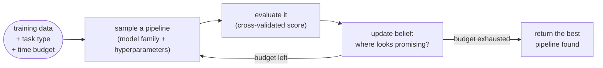
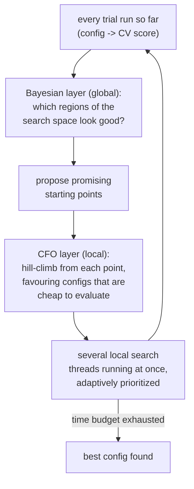
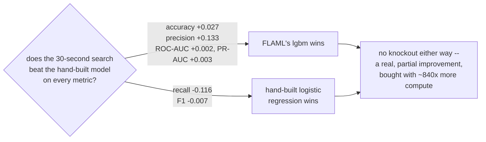
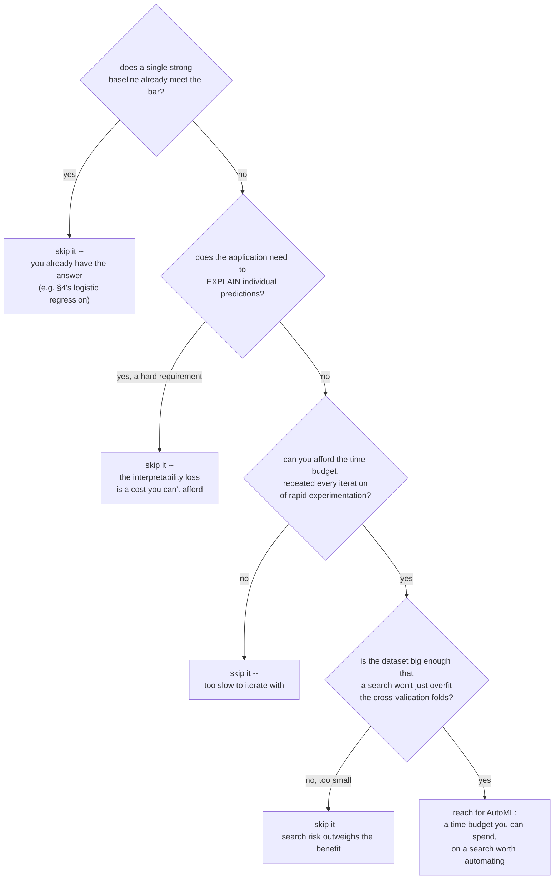

# AutoML — letting the machine search the pipeline

*Data Science · Worked Examples (advanced) · SPEC-DS-11*

## The search nobody wants to run by hand

In 2013, four researchers — Chris Thornton, Frank Hutter, Holger Hoos, and Kevin Leyton-Brown —
published a paper with a deliberately unglamorous title: "Auto-WEKA: Combined Selection and
Hyperparameter Optimization of Classification Algorithms." Buried in that title is the idea that
later unlocked the whole field of AutoML. They gave a name to a problem every data scientist
already had, but nobody had framed as *one* problem: **CASH**, Combined Algorithm Selection and
Hyperparameter optimization — not "which model is best" and "what are its best settings" as two
separate questions, but a single search over both at once
([source: Wikipedia, "Auto-WEKA"](https://en.wikipedia.org/wiki/Auto-WEKA), checked 2026-09-03).

Naming it mattered because everyone was already doing a manual, ad-hoc version of it. Picture the
routine: pick `RandomForestClassifier`, hand-tune `n_estimators` and `max_depth` for an afternoon
watching the validation score move, try `HistGradientBoostingClassifier` next, hand-tune *its*
hyperparameters, compare, maybe fit a plain `LogisticRegression` too because someone on the team
insists on a simple baseline. A day or two later you have three model families, each tuned
inconsistently — one got twenty tries, another got three — and no principled way to know whether
the fourth family you never got to would have won. That's exactly the routine SPEC-DS-6's Titanic
chapter ran: `LogisticRegression`, `RandomForestClassifier`, and `HistGradientBoostingClassifier`,
all at (mostly) default hyperparameters, hand-picked by the author
([classification-titanic.md](06-classification-titanic.md)).

**AutoML is what happens when you stop running that search by hand and let a machine run it
instead — the same CASH search, done systematically rather than ad hoc.** One sentence you could
repeat at dinner: *instead of you guessing which model and which settings to try next, the machine
tries many combinations and remembers what worked.*

That's the loop this whole chapter fills in, one box at a time — sample a pipeline, evaluate it,
use what you learned to decide what to try next, repeat until the clock runs out:



Keep this picture in mind as a map — §2 names the algorithm behind the "update belief" box, §3
runs the whole loop for real on a familiar dataset, and §4 asks the question every automated
search deserves before you trust it: **did it actually win?**

## 1. What & why

Every prior Data Science chapter in this course ran the manual loop the cold open just described.
It doesn't scale: every new dataset means re-running the same "try a handful of things, see what
sticks" ritual, with no guarantee the three families you happened to try were the right three. So
here's the problem-first question worth asking on the page, before reaching for a formal
definition: **if trying more combinations is better, why not just try them all?**

You could — that's called grid search. Lay out every hyperparameter as a grid axis and evaluate
every point on the grid. It sounds like the responsible, exhaustive move, right up until you count
the points: three hyperparameters at five values each is 125 combinations; five hyperparameters at
five values each is 3,125. The grid grows exponentially with every knob you add, and most of those
points are combinations a human could tell were bad ideas after the first few tries. Grid search
burns almost all of its budget confirming what you already suspected.

**AutoML frameworks like the one this chapter uses are grid search on steroids**: instead of
visiting every point on the grid blindly, they use the *results so far* to decide where to search
next — spending more of the time budget near promising regions and cutting off clearly bad ones
early. Same search space a grid search would cover — model family × that family's hyperparameters,
and (as §3 shows) sometimes a slice of preprocessing too — just a smarter way of spending a fixed
time budget. That one sentence is this chapter's framing for everything that follows.

The Java analogy that holds up here: think of "model family × hyperparameter values" as a giant,
mostly-invalid configuration space — like tuning a JVM's GC (`-XX:NewRatio`, `-XX:SurvivorRatio`,
`-XX:MaxGCPauseMillis`, ...) where most combinations are mediocre and a few are excellent, and the
only way to know which is which is to actually run the application under load.

Give AutoML a training set, a task type, and a time budget, and it hands back the best pipeline it
found within that budget. Every model it tries is one you could have written yourself with
`scikit-learn` — what's automated is the *search*, not the modelling.

> **Three words this chapter leans on — plain English first:**
> - **search space** — every model family and hyperparameter combination the search could try; the
>   whole grid a grid search would otherwise have to cover point by point.
> - **time budget** — how many seconds you let the search keep looking before it must hand back an
>   answer (30, in this chapter's runs).
> - **leaderboard** — one score per model family the search actually visited, ranked best to
>   worst — not every point in the search space, just the ones it got to.

Framed honestly, not magically: AutoML is a **productivity tool**, not a replacement for
understanding what a model is doing. It will not fix a leaky feature, will not know your
business's precision/recall trade-off, and will not explain itself the way a hand-derived
`LogisticRegression` coefficient table does. Hold onto one more question while you read: **did
letting the machine search actually beat the model built by hand in `classification-titanic.md`?**
§4 answers it with real numbers, and the answer is more interesting than a flat yes or no. §5 makes
the limits concrete.

### Environment

This chapter uses a **dedicated virtual environment**, separate from the shared project `.venv` used
by every other chapter — `flaml[automl]` pulls in `lightgbm` and `xgboost` (see the environment note
at the end of this chapter), and there is no reason to add ~150 MB of gradient-boosting libraries to
every other chapter's environment just for this one.

```text
flaml[automl]==2.6.0
scikit-learn==1.9.0
pandas==3.0.5
numpy==2.5.2
matplotlib==3.11.1
seaborn==0.13.2
Python 3.12+
```

Framework choice, version, and API verified in
[research/NOTE-15-automl-framework.md](../../research/NOTE-15-automl-framework.md) (checked
2026-09-02); `scikit-learn`/`pandas`/`numpy`/`matplotlib`/`seaborn` versions carried over from
[NOTE-2-package-versions](../../research/NOTE-2-package-versions.md) and
[NOTE-5-sklearn-core-apis](../../research/NOTE-5-sklearn-core-apis.md), the same pins
`classification-titanic.md` uses. This chapter's code and artefacts were generated and gated on
**Python 3.13.7**, in a **dedicated venv** (`flaml[automl]==2.6.0`, `scikit-learn==1.9.0`,
`pandas==3.0.5`, `numpy==2.5.2`, `matplotlib==3.11.1`, `seaborn==0.13.2` — all confirmed installed at
exactly these versions before running).

```bash
python -m venv automl-venv
automl-venv/Scripts/pip install "flaml[automl]==2.6.0" scikit-learn==1.9.0 pandas==3.0.5 \
    numpy==2.5.2 matplotlib==3.11.1 seaborn==0.13.2      # Windows
# automl-venv/bin/pip install ...                         # macOS/Linux
automl-venv/Scripts/python automl_demo.py                 # Windows
# automl-venv/bin/python automl_demo.py                    # macOS/Linux
```

## 2. Concept — what FLAML searches over, and how

[NOTE-15](../../research/NOTE-15-automl-framework.md) evaluated five open-source AutoML frameworks
for a CPU-only sandbox on Windows/Python 3.13: `auto-sklearn` **fails outright on Windows**
("Detected unsupported operating system: win32"); `AutoGluon` and `H2O` install but are heavyweight
(2+ GB and 266 MB respectively) with slow cold starts; `TPOT`'s genetic-programming search pulls in
~450 dependencies (~1.5 GB). **FLAML 2.6.0** — a Microsoft Research project — installed cleanly in
under 30 seconds and is the framework this chapter uses.

Back to the loop from the cold open: for FLAML, the "update belief — where looks promising?" box
has a name. FLAML's search algorithm is called **BlendSearch**
([NOTE-15](../../research/NOTE-15-automl-framework.md), citing Microsoft's own FLAML documentation),
and it blends two ideas:

- **Bayesian optimization** — a *global* exploration strategy that builds a probabilistic model of
  "which regions of the search space look good" from every trial run so far, and proposes new,
  promising starting points instead of picking at random.
- **CFO (Cost-Frugal Optimization)** — a *local* search, hill-climbing from each of those starting
  points toward nearby configurations that look even better, while explicitly favouring
  configurations that are *cheap to evaluate* (a shallow decision tree is cheaper to fit than a
  thousand-tree ensemble; BlendSearch factors that cost in, not just the resulting score).



The practical upshot for this chapter: the search space is **model family × that family's
hyperparameters**, exactly the same space a grid search would need to cover — but BlendSearch
decides *where in that space* to spend the next second of compute, instead of ticking off every
grid cell in a fixed order the way a naive grid search would.

Two things NOT in scope for this chapter, mentioned for completeness:

- **Neural architecture search (NAS)** — the deep-learning equivalent of what this chapter does for
  tabular models (searching over network topology, not just hyperparameters). Out of scope per this
  chapter's spec; a different subject entirely.
- **Commercial/cloud AutoML** (Vertex AI AutoML, SageMaker Autopilot, Azure AutoML) — same idea,
  managed infrastructure and a bigger search budget. Covered in the Cloud Environment Setup section of
  a future chapter, not here.

FLAML's real, verified API for this chapter ([NOTE-15](../../research/NOTE-15-automl-framework.md),
re-confirmed directly against the installed `flaml==2.6.0` while writing this chapter):

```python
from flaml import AutoML

automl = AutoML()
automl.fit(X_train, y_train, task="classification", time_budget=30, metric="accuracy", seed=42)
automl.best_estimator          # e.g. "lgbm" -- the winning model family's name
automl.best_config             # dict of that family's winning hyperparameters
automl.best_loss               # 1 - best cross-validated score found
automl.best_loss_per_estimator # dict: one CV loss per estimator family tried -- the leaderboard
automl.predict(X_test)
automl.predict_proba(X_test)
```

`AutoML()` is scikit-learn-compatible by design — `fit`/`predict`/`predict_proba` mirror the
`Pipeline` contract from [NOTE-5](../../research/NOTE-5-sklearn-core-apis.md), the same interface
every hand-built model in this course has used.

## 3. Worked example — Titanic, again, but the machine drives

Time to run the loop from the cold open for real, thirty seconds' worth, on a dataset you've
already seen. This section reuses **the exact same dataset, feature engineering, and 75/25
stratified split** as [classification-titanic.md](06-classification-titanic.md)
(`seaborn.load_dataset("titanic")`, `family_size`/`is_alone`/`fare_bin` engineered features,
`random_state=42`) — see
[NOTE-10-classification-datasets](../../research/NOTE-10-classification-datasets.md) for the
dataset's licence (CC0) and shape. Reusing the dataset makes the comparison in §4 direct: same 668
training rows, same 223 held-out test rows, same target, same features. The full script is
[`code/automl_demo.py`](code/automl_demo.py); this section walks through what it does, step by
step.

**Step 1 — reuse the exact same data as the hand-built model.**

```python
import pandas as pd
import seaborn as sns
from sklearn.model_selection import train_test_split

FARE_BIN_LABELS = ["low", "mid", "high", "very_high"]
FEATURE_COLUMNS = ["age", "family_size", "pclass", "is_alone", "fare_bin", "sex", "embarked"]

titanic = sns.load_dataset("titanic")
titanic["family_size"] = titanic["sibsp"] + titanic["parch"] + 1
titanic["is_alone"] = (titanic["family_size"] == 1).astype(int)
titanic["fare_bin"] = pd.qcut(titanic["fare"], q=4, labels=FARE_BIN_LABELS)

X = titanic[FEATURE_COLUMNS]
y = titanic["survived"]
X_train, X_test, y_train, y_test = train_test_split(
    X, y, test_size=0.25, random_state=42, stratify=y,
)
print(f"train={len(X_train)} test={len(X_test)}")
```

```text
train=668 test=223
```

**Step 2 — hand FLAML the raw, untransformed data.** This is one deliberate difference from
`classification-titanic.md`'s hand-built pipeline, which needed a `ColumnTransformer` — impute
`age`'s NaNs, scale numeric columns, ordinal-encode `fare_bin`, one-hot-encode `sex`/`embarked` —
built by hand *before* any model saw the data. This chapter hands FLAML the **untransformed**
`X_train` directly: NaNs in `age`, string/categorical columns for `fare_bin`/`sex`/`embarked`, no
`ColumnTransformer` at all.

```python
print(X_train.dtypes)
print(X_train.isna().sum())
```

```text
age             float64
family_size       int64
pclass            int64
is_alone          int64
fare_bin       category
sex                 str
embarked            str
dtype: object
age            131
family_size      0
pclass           0
is_alone         0
fare_bin         0
sex              0
embarked         2
dtype: int64
```

FLAML imputes and encodes internally as part of what it fits — part of "what AutoML automates"
from §1: not just model choice and hyperparameters, but a slice of preprocessing too. That's a
genuine capability, not a trick — but it also means FLAML's internal choices (how it imputes, how
it encodes categoricals) are *not* visible or controllable the way the hand-built
`ColumnTransformer` was. §5 returns to this trade-off.

**Step 3 — run the search.** This is the `SAMPLE -> EVAL -> UPDATE` loop from the cold open,
running for real:

```python
from flaml import AutoML

ESTIMATOR_LIST = ["lgbm", "xgboost", "rf", "extra_tree", "lrl1", "lrl2"]

automl = AutoML()
automl.fit(
    X_train, y_train,
    task="classification",
    time_budget=30,           # seconds -- small on purpose, a classroom sandbox budget
    metric="accuracy",
    seed=42,
    estimator_list=ESTIMATOR_LIST,
)
```

Six estimator families, each contributing its own hyperparameter search space to BlendSearch:
`lgbm`/`xgboost` (gradient-boosted trees), `rf`/`extra_tree` (scikit-learn tree ensembles), `lrl1`/
`lrl2` (L1- and L2-penalised `LogisticRegression`). A 30-second budget is enough for BlendSearch to
run dozens of trials across all six ([NOTE-15](../../research/NOTE-15-automl-framework.md)); this run
actually found its eventual winner **11 seconds** in, per `automl.time_to_find_best_model`, and spent
the remaining ~19 seconds confirming nothing better turned up — the `UPDATE -> budget exhausted ->
BEST` branch of the loop diagram, playing out on real numbers.

**Step 4 — read the leaderboard.** `automl.best_loss_per_estimator` is one cross-validated loss per
estimator family FLAML tried during the search — the closest thing FLAML has to a leaderboard.
Because `metric="accuracy"` was passed to `fit()`, FLAML's internal "loss" for each family is
`1 − (best CV accuracy found for that family)`, so `cv_accuracy_estimate` below is the natural
inverse — written by the companion script to
[`artefacts/automl_leaderboard.csv`](artefacts/automl_leaderboard.csv):

| rank | estimator | cv_best_loss | cv_accuracy_estimate | is_overall_best |
|---|---|---|---|---|
| 1 | lgbm | 0.1646 | 0.8354 | True |
| 2 | rf | 0.1721 | 0.8279 | False |
| 3 | xgboost | 0.1766 | 0.8234 | False |
| 4 | lrl2 | 0.1975 | 0.8025 | False |
| 5 | extra_tree | 0.1991 | 0.8009 | False |
| 6 | lrl1 | 0.2515 | 0.7485 | False |

`lgbm` (LightGBM, a gradient-boosted-tree library) won, narrowly ahead of `rf` and `xgboost`; the two
logistic-regression variants (`lrl1`, `lrl2`) trailed — `lrl1`'s L1 penalty in particular scored
worst, likely over-penalising on a feature set this small (nine columns after encoding). This is a
**search-time, cross-validated** ranking, not the final test-set score — §4 checks the winner
against a genuinely held-out set.

**Step 5 — inspect what it chose.**

```python
print(automl.best_estimator)
print(automl.best_config)
```

```text
lgbm
{'n_estimators': 6, 'num_leaves': 7, 'min_child_samples': 8, 'learning_rate': 0.5775388286697243,
 'log_max_bin': 4, 'colsample_bytree': 1.0, 'reg_alpha': 0.0009765625, 'reg_lambda': 0.0741189797684}
```

Read this the way you'd read a tuned JVM flag set: `n_estimators=6` and `num_leaves=7` describe a
**small, shallow** ensemble — six boosting rounds, each tree limited to 7 leaves — which BlendSearch
converged on for a 668-row training set where a huge ensemble would mostly overfit. `learning_rate` is
comparatively high (0.58) to compensate for the small `n_estimators`, and the two regularisation terms
(`reg_alpha`, `reg_lambda`) are small but non-zero. None of this was hand-picked; it's the output of
the search, and the *reason* it looks reasonable — small model, small dataset — is precisely
BlendSearch's cost-frugality doing its job (§2).

## 4. So did it actually win?

Time to answer the question §1 asked you to hold onto: **does a 30-second automated search beat the
model a human built by hand?** Same held-out 223-row test set both ways. **Hand-built** = the single
`LogisticRegression` pipeline from `classification-titanic.md`, fit once, no search. **FLAML** = the
`lgbm` model from §3, the product of the search. Written by the companion script to
[`artefacts/automl_vs_handbuilt_metrics.csv`](artefacts/automl_vs_handbuilt_metrics.csv) and plotted
in [`artefacts/automl_vs_handbuilt_comparison.png`](artefacts/automl_vs_handbuilt_comparison.png):

| model | accuracy | precision | recall | f1 | roc_auc | pr_auc | fit_seconds |
|---|---|---|---|---|---|---|---|
| hand_built_logistic_regression | 0.7848 | 0.7111 | 0.7442 | 0.7273 | 0.8465 | 0.7976 | 0.036 |
| flaml_automl (lgbm) | 0.8117 | 0.8438 | 0.6279 | 0.7200 | 0.8490 | 0.8003 | 30.077 |


The honest answer is "partially, and it cost something" — not a knockout in either direction:



**Read the trade-off, not just the winner:**

- **FLAML wins on accuracy (+0.027), precision (+0.133), ROC-AUC (+0.002), and PR-AUC (+0.003).** Its
  higher precision (0.844 vs 0.711) means fewer false "survived" calls.
- **The hand-built logistic regression wins on recall (0.744 vs 0.628) and, barely, F1 (0.727 vs
  0.720).** FLAML's `lgbm` model is *more conservative* about calling someone a survivor — it misses
  more actual survivors (lower recall) in exchange for being right more often when it does call one
  (higher precision). This is the exact precision/recall dial `classification-titanic.md` §4
  described — it didn't go away just because a search picked the model.
- **This is the same lesson `classification-titanic.md` landed on with its own three hand-built
  models**: "the fancier model" (there, `HistGradientBoostingClassifier`; here, FLAML's `lgbm`) does
  not automatically dominate on every metric. A 30-second automated search found a model that's
  measurably better on four of six metrics and worse on two — a real improvement, but not a knockout,
  and not free.
- **Cost is not free either: 30.077s vs 0.036s — FLAML's fit took roughly 840× longer.** That is by
  design (`time_budget=30`), not a flaw — the entire value proposition is "spend more compute, search
  more of the space." Whether 30 extra seconds (or 30 extra minutes, on a real budget) is worth a few
  points of accuracy is a decision the framework cannot make for you; §5 returns to this.

## 5. Limits & pitfalls

- **The time budget is a real constraint, and results are budget-dependent.** This chapter's 30-second
  budget is deliberately small — a classroom sandbox number, not a production one. A longer budget
  gives BlendSearch more trials to explore; a 30-second run on a larger dataset or a wider
  `estimator_list` may not even finish evaluating every family once. Never compare two AutoML runs'
  "who searched better" without also stating their time budgets — it's the same category error as
  comparing two algorithms' runtimes without stating the input size.
- **AutoML does not protect you from data leakage.** FLAML fit on whatever columns `X_train` contained
  — if `classification-titanic.md`'s leaky `alive` column (literally `survived` spelled `"no"`/
  `"yes"`) had been left in the feature set, FLAML would have found a "perfect" model just as fast as
  a hand-built one would have, and would have no way to flag that the perfection was fake. Feature
  hygiene — dropping leaky, redundant, or too-sparse columns — is still the engineer's job, done
  *before* the data reaches the AutoML call, exactly as it was before reaching the hand-built
  `ColumnTransformer` in §3.
- **Interpretability drops.** `LogisticRegression.coef_` gave `classification-titanic.md` a signed,
  directly-readable weight per feature (§5.1 there: `sex_male = -2.49`, immediately legible).
  FLAML's winning `lgbm` model is a six-tree gradient-boosted ensemble with searched hyperparameters —
  reading "why did it predict this passenger survived" back out requires a separate technique
  (permutation importance, SHAP), not a glance at a coefficient table. If your application needs to
  *explain* individual predictions (a loan denial, a medical triage decision), the search choosing an
  opaque winner is a cost, not just a detail.
- **Reproducibility needs the same discipline as any other ML code, and one more axis.** `seed=42` was
  passed to `AutoML.fit()`, matching every `random_state=42` elsewhere in this course, but this
  chapter's leaderboard and best-config numbers can still shift with the **wall-clock time budget** —
  a search that runs on slower hardware, or is interrupted early, may explore fewer trials and settle
  on a different winner even with the same seed. A hand-built model's hyperparameters are fixed at
  read time; an AutoML search's result depends on both the seed *and* how much compute it actually got
  to use.
- **Over-trust is the subtlest failure mode.** A leaderboard number and a "best_estimator" string look
  authoritative — they came from a systematic search, not a guess. But §4 showed the "winner"
  losing on two of six metrics. Nothing about running an automated search changes the rule from every
  earlier chapter in this course: pick the metric that matches your actual use case *before* looking
  at results, and read more than one number.

**When NOT to reach for AutoML** — walk this decision before you spend a time budget:



AutoML is a tool for "I have a time budget and want the search automated," not a default first move.

## 6. Recap & what's next

- **AutoML automates the search**, not the modelling itself — every candidate FLAML tried is a
  scikit-learn-style estimator you could fit by hand; what's new is BlendSearch deciding *where* in
  the model-family × hyperparameter space to spend a fixed time budget, instead of a human guessing or
  a grid search visiting every cell blindly. It's the systematic version of the CASH problem Auto-WEKA
  named back in 2013 ([NOTE-15-automl-framework](../../research/NOTE-15-automl-framework.md);
  [Auto-WEKA, Wikipedia](https://en.wikipedia.org/wiki/Auto-WEKA), checked 2026-09-03).
- **FLAML 2.6.0** was the researched, grounded choice for this sandbox: `auto-sklearn` fails outright
  on Windows, `AutoGluon`/`H2O`/`TPOT` install but are heavyweight; FLAML installed cleanly and ran a
  real 30-second search across six estimator families
  ([NOTE-15](../../research/NOTE-15-automl-framework.md)).
- **The leaderboard** (`automl.best_loss_per_estimator`) ranked `lgbm` first (CV accuracy ≈ 0.835),
  ahead of `rf`, `xgboost`, `lrl2`, `extra_tree`, `lrl1` — a real, reproducible ranking from this run,
  not a canned example.
- **On the held-out test set, FLAML's `lgbm` beat the hand-built logistic regression on accuracy
  (0.812 vs 0.785), precision (0.844 vs 0.711), ROC-AUC, and PR-AUC — and lost on recall (0.628 vs
  0.744) and narrowly on F1.** It took roughly 840× longer to obtain (30.08s vs 0.036s). Both numbers
  matter; neither model is a strict winner — the honest answer to §4's question is "partially, and it
  cost something," not a flat yes.
- **Limits that don't go away just because a search is automated:** budget-dependence, no protection
  from leakage, materially lower interpretability than a hand-derived coefficient table, an extra
  non-determinism axis (wall-clock budget, not just seed), and the same risk of over-trusting a single
  headline number that every earlier chapter warned against.

This closes the Data Science subject's "advanced worked examples" arc that began with feature
selection. The next chapter (**Model Registry**, MLflow) picks up a question this one raises but
doesn't answer: once a search — automated or not — produces a winning model, how do you track,
version, and compare that model's performance across runs over time, instead of re-reading a
leaderboard CSV by hand?

---

### Environment note (for the architect)

One discrepancy found against [NOTE-15](../../research/NOTE-15-automl-framework.md), resolved by
empirical verification rather than silently corrected: NOTE-15 characterises FLAML as installing "in
<30 seconds... 349 KB wheel + numpy dependency only... ~3 total packages", based on `pip install
flaml==2.6.0` (no extras). That claim is accurate for the **bare** `flaml` package. Running
`AutoML.fit(task="classification", estimator_list=["lgbm", "xgboost", ...])` with FLAML's named
built-in estimators requires the **`automl` extra** — `pip install "flaml[automl]==2.6.0"` — which
additionally installs `lightgbm==4.7.0` and `xgboost==2.1.4` (`xgboost`'s wheel alone is ~125 MB).
Total install time was still well under a minute and nothing failed, but the "~3 total packages, small
footprint" framing undersells what's actually needed to run AutoML classification, specifically. This
chapter installs `flaml[automl]==2.6.0` and states the corrected package list in Section 1's
environment block. A second, minor empirical finding: FLAML's built-in `lrl1`/`lrl2` estimators
(L1/L2-penalised `LogisticRegression`) still pass the now-deprecated `penalty=` keyword to
scikit-learn under the pinned `scikit-learn==1.9.0`
([NOTE-5](../../research/NOTE-5-sklearn-core-apis.md) documents `penalty` as deprecated since 1.8) —
cosmetic (fit still completes and scores correctly) but confirmed by direct execution and suppressed
in `automl_demo.py` with a scoped `warnings.catch_warnings()` block rather than silently ignored
project-wide. All other versions (`scikit-learn==1.9.0`, `pandas==3.0.5`, `numpy==2.5.2`,
`matplotlib==3.11.1`, `seaborn==0.13.2`) installed and ran exactly as pinned, in a **dedicated venv**
kept separate from the shared project `.venv` for the reason stated in Section 1.
