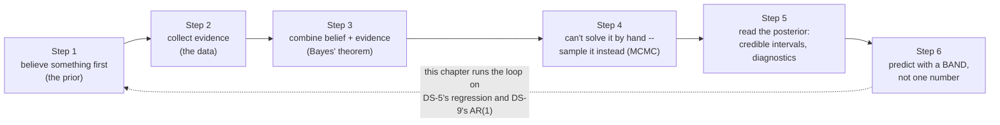
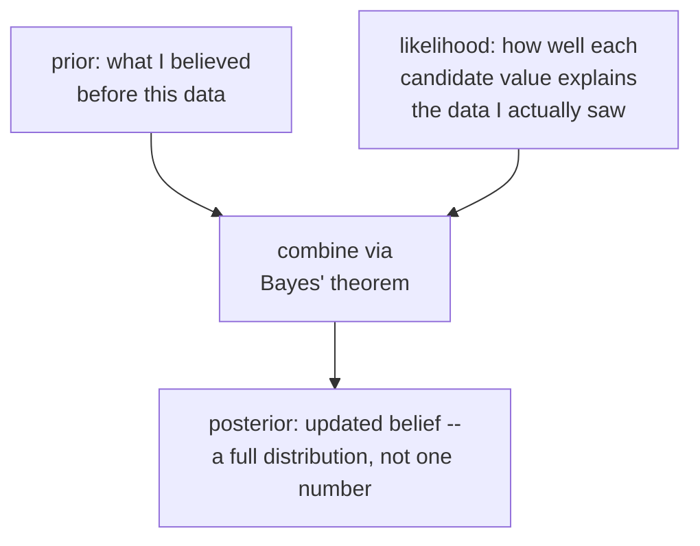
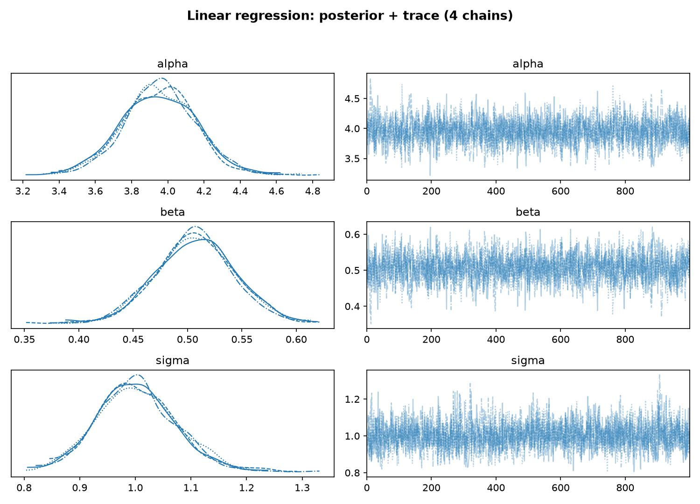
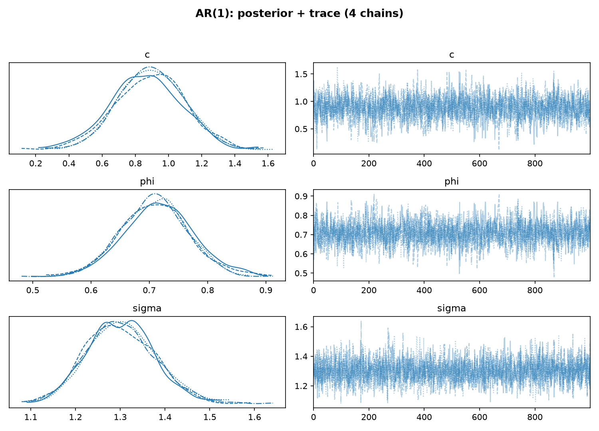
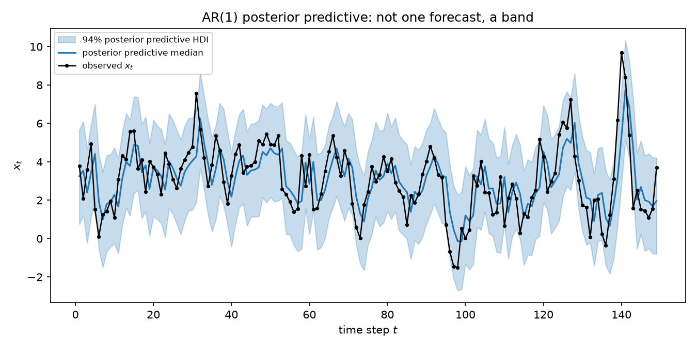
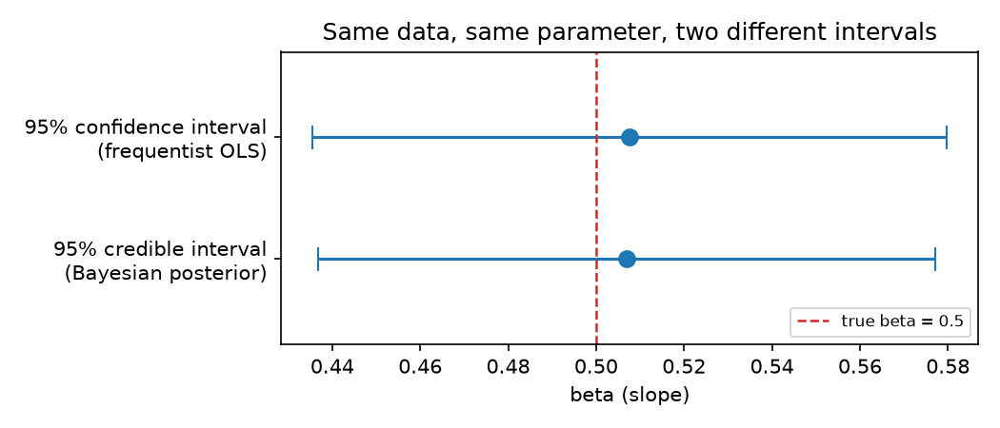

# Bayesian Inference: Priors, Likelihood, and Posteriors You Can Sample

*Data Science · Worked Examples · SPEC-DS-19*

*Prerequisites: [Hypothesis Testing & EDA](01-hypothesis-testing-and-eda.md) (DS-1, the frequentist
view) and [Regression: Predicting NYC Taxi Fares](05-regression-nyc-taxi.md) (DS-5, one fitted line).
Related: [Forecasting Composite Signals](09-forecasting-composite-signals.md) (DS-9) fits the same
AR(1) equation this chapter does, by a different route.*

## An 18th-century vicar and a room full of GPUs

In 1763 — two years after his death — a short mathematical essay by an English Presbyterian minister
named Thomas Bayes was read to the Royal Society by his friend Richard Price, who had found it among
Bayes's papers and thought it worth publishing. Its title was "An Essay Towards Solving a Problem in
the Doctrine of Chances," and the problem it solved was this: if all you have is *evidence*, how do
you work backward to how *likely* the thing that produced it was
([source: Wikipedia, "Thomas Bayes"](https://en.wikipedia.org/wiki/Thomas_Bayes), checked
2026-09-03). Bayes never named a "theorem" or wrote the formula the way this chapter will — that
came later, developed far more thoroughly by the French mathematician Pierre-Simon Laplace, whose
1814 *Essai philosophique sur les probabilités* is where the modern Bayesian machinery — update a
belief with evidence, get back a probability over the answer, not just one number — first appears in
recognisable form ([source: Wikipedia, "Pierre-Simon Laplace"](https://en.wikipedia.org/wiki/Pierre-Simon_Laplace),
checked 2026-09-03).

For nearly two centuries the idea was mathematically sound and practically useless: computing a
Bayesian posterior by hand, for anything but the simplest toy problem, meant an integral nobody could
solve in closed form. The fix didn't arrive until physicists needed it for something else entirely —
in 1953, Nicholas Metropolis and four colleagues at Los Alamos published an algorithm for simulating
physical systems on early computers by taking a long random walk that spends more time in
high-probability regions; W. K. Hastings generalised it in 1970. Statisticians didn't pick it up in
earnest until the late 1980s and 1990s, once software like BUGS made a related technique — **Gibbs
sampling**, named by Stuart and Donald Geman in 1984 — practical for ordinary statistical models, not
just physics
([source: Wikipedia, "Markov chain Monte Carlo"](https://en.wikipedia.org/wiki/Markov_chain_Monte_Carlo),
checked 2026-09-03). That family of techniques — **Markov Chain Monte Carlo**, MCMC — is what turned
Bayes and Laplace's 18th-century idea into something you can run on a laptop in a few minutes, which
is exactly what this chapter does.

Here's the concrete reason it matters to you. The [regression chapter](05-regression-nyc-taxi.md)
fit a taxi-fare model and reported **one number** per coefficient — `distance_km`'s weight was
6.445494, full stop. That number is the single best-fitting line through the data, and it's genuinely
useful. But it can't answer a question a stakeholder will actually ask: **"how sure are we?"** Is
6.445494 solid, or could next month's data just as easily produce 4 or 9? `LinearRegression` doesn't
carry that information — it hands back a point, not a range. This chapter fits the *same kind* of
model a completely different way — one that returns a **distribution over lines**, not one line —
and shows you exactly what that buys you.

**One sentence you could repeat at dinner: instead of solving for the single best answer, Bayesian
inference asks "given what I already believed, and the evidence I just saw, what's the whole range of
answers I should still consider — and how much do I believe each one?"**



## 1. What & why: updating a belief, not solving for an answer

You've done this move before, even if nobody called it "Bayesian." A flaky-test triage: you start out
believing the test is *probably* just flaky (your prior), you see it fail three times in a row on
unrelated commits (evidence), and you update toward "this might be a real bug" (posterior belief) —
without ever throwing away what you believed before you saw the failures. That update — **prior →
evidence → posterior** — is the entire idea. Three words, defined once, in plain language before any
notation:

- **Prior** — what you believed *before* seeing this batch of data. Could be vague ("the slope is
  probably somewhere between -20 and 20") or informed by a previous experiment.
- **Likelihood** — how probable the data you actually observed would be, *for each possible value* of
  the thing you're estimating. This is the same object a frequentist fit maximises — it's not a new
  idea, just reused differently.
- **Posterior** — your *updated* belief, after the evidence has been folded in. This is the actual
  output of a Bayesian analysis: not one number, a whole distribution.

Bayes' theorem is just the rule for combining the first two into the third
([source: NOTE-DS-19-2-bayesian-theory](../../research/NOTE-DS-19-2-bayesian-theory.md), citing
Gelman et al., *Bayesian Data Analysis*, 3rd ed., and Wikipedia's "Bayes' theorem," checked
2026-09-03):

$$P(\theta \mid y) \;\propto\; P(y \mid \theta) \cdot P(\theta)$$

Reading every symbol: $\theta$ (theta) is "the parameter(s) I'm trying to estimate" — a slope, an
intercept, a noise level, whatever's unknown. $y$ is "the data I observed." $P(\theta \mid y)$ is the
**posterior** — "how probable is each value of $\theta$, now that I've seen $y$." $P(y \mid \theta)$
is the **likelihood** — "how probable would this exact data have been, if $\theta$ had this
particular value." $P(\theta)$ is the **prior** — "how probable did I think each value of $\theta$
was, before I saw any data." The $\propto$ ("proportional to") is doing real work: computing the
*exact* posterior probability requires dividing by a normalising constant (the "evidence," $P(y)$)
that's often impossible to compute directly — which is precisely the two-century bottleneck the cold
open described, and precisely what MCMC sidesteps by sampling from the un-normalised shape instead of
solving for it algebraically.



### 1.1 Bayesian vs. frequentist: two honest answers to different questions

Nothing in [DS-1's hypothesis testing](01-hypothesis-testing-and-eda.md) or [DS-5's
regression](05-regression-nyc-taxi.md) was *wrong* — both are **frequentist**: they treat the true
parameter as a single fixed (if unknown) number, and ask "how would my *procedure* behave if I
repeated this experiment many times?" A Bayesian treats the parameter itself as uncertain and asks
"given exactly the one dataset I actually have, what should I believe about it, as a probability
distribution?" Neither framing is more "correct" — they're answers to genuinely different questions,
and §4 makes the difference concrete on real numbers instead of just describing it:

| | Frequentist (DS-1, DS-5) | Bayesian (this chapter) |
|---|---|---|
| Treats the parameter as | one fixed, unknown true value | a random variable with a distribution |
| Output | a point estimate + a confidence interval | a full posterior distribution |
| "95% interval" means | 95% of intervals built this way, over repeated sampling, contain the true value | 95% probability the parameter is in this interval, given this exact data |
| Needs a prior belief? | no | yes — even a vague one |
| Typical tool | closed-form formula (OLS, a t-test) | MCMC sampling (this chapter: PyMC) |

## 2. Bayesian linear regression: the same regression, with a posterior

[DS-5](05-regression-nyc-taxi.md) fit `price ≈ a·feature + b` by finding the single `a, b` that
minimises squared error. This section fits the same *shape* of model — a straight line plus Gaussian
noise — the Bayesian way, on a small synthetic dataset built so the true answer is known (the same
use-case as the owner's original PyStan notebook, "01. Linear Function with Gaussian Noise,"
reimplemented here in PyMC v5 instead — see the Environment note at the end of this chapter for why).

**Step 1 — build data with a known true line.** 100 points, $y = \alpha + \beta x + \varepsilon$,
$\varepsilon \sim \mathcal{N}(0, \sigma)$, true $\alpha=4.0$, $\beta=0.5$, $\sigma=1.0$, seed 42 — so
every fit below can be checked against a ground truth, the same reason
[the taxi-fare generator](05-regression-nyc-taxi.md#21-why-synthetic-data) and
[the forecasting signals](09-forecasting-composite-signals.md#11-four-signals-one-true-shape-each)
were both synthesised rather than downloaded:

```python
import numpy as np

RNG_SEED = 42


def make_linreg_data(n=100, alpha_true=4.0, beta_true=0.5, sigma_true=1.0, seed=RNG_SEED):
    """y = alpha + beta*x + Normal(0, sigma) noise."""
    rng = np.random.default_rng(seed)
    x = 10.0 * rng.random(n)
    y = rng.normal(alpha_true + beta_true * x, scale=sigma_true)
    return x, y


x, y = make_linreg_data()
```

**Step 2 — fit it the frequentist way first**, exactly as DS-5 would (`scipy.stats.linregress` here
instead of `sklearn.LinearRegression` — same OLS answer, and `linregress` hands back the standard
error §4 needs for a confidence interval):

```python
from scipy import stats

result = stats.linregress(x, y)
print(f"OLS: intercept={result.intercept:.3f}, slope={result.slope:.3f}, stderr={result.stderr:.3f}")
```

```text
OLS: intercept=3.949, slope=0.508, stderr=0.020
```

One line, `slope=0.508` — close to the true 0.5, as it should be with 100 clean points, but this
number alone can't tell you *how* close it's likely to be on data you haven't seen, which is exactly
the gap §1 promised to fill.

**Step 3 — put a prior on every parameter.** A Bayesian linear regression needs a prior for
*everything* it's estimating: the intercept, the slope, and the noise scale. Weakly informative
priors — wide enough to barely constrain anything, just enough to rule out absurd values — are the
standard starting point:

$$\alpha \sim \mathcal{N}(0, 10), \qquad \beta \sim \mathcal{N}(0, 10), \qquad \sigma \sim \text{HalfNormal}(5)$$

In plain language: "before seeing any data, I think the intercept and slope are probably somewhere
in the range $\pm 20$-ish (two standard deviations of a $\mathcal{N}(0,10)$), and the noise level is
probably a modest positive number, but I'm not ruling out much." $\sigma$ (the noise scale) gets a
**HalfNormal** — a bell curve folded over at zero — because a standard deviation can never be
negative; `pm.Normal` would happily let the sampler propose a negative noise level, which is
physically meaningless. `pm.HalfNormal` verified against the installed `pymc==5.28.5`
([source: NOTE-DS-19-4-pymc-api](../../research/NOTE-DS-19-4-pymc-api.md), checked 2026-09-03).

**Step 4 — write the likelihood and sample.** `pm.Model()` is a context manager — think of it the way
you'd think of a builder scope: every distribution created inside the `with` block gets registered
onto that one model, the same way a builder's chained calls all mutate the same object underneath.
`pm.Normal("y_obs", ..., observed=y)` is the **likelihood** — "given `alpha`, `beta`, `sigma`, this is
how probable the observed `y` values are" — the `observed=` keyword is what turns a `pm.Normal` from
"a thing to be estimated" into "a thing that's already known and constrains everything else." Then
`pm.sample(...)` runs MCMC — this is the step that would have been an intractable integral before
1990s-era Gibbs sampling and modern NUTS made it a function call
([source: NOTE-DS-19-4-pymc-api](../../research/NOTE-DS-19-4-pymc-api.md), checked 2026-09-03):

```python
import pymc as pm

with pm.Model() as model:
    alpha = pm.Normal("alpha", mu=0.0, sigma=10.0)
    beta = pm.Normal("beta", mu=0.0, sigma=10.0)
    sigma = pm.HalfNormal("sigma", sigma=5.0)
    pm.Normal("y_obs", mu=alpha + beta * x, sigma=sigma, observed=y)
    idata = pm.sample(draws=1000, tune=1000, chains=4, random_seed=RNG_SEED)
```

`chains=4` runs four independent random walks from different starting points — Stan/PyMC's own
guidance is to run at least four, because if all four land on the same answer, that's real evidence
the sampler explored the whole posterior rather than getting stuck in one corner of it
([source: NOTE-DS-19-2-bayesian-theory](../../research/NOTE-DS-19-2-bayesian-theory.md), citing the
Stan diagnostics guide, checked 2026-09-03) — which is exactly what the next step checks, honestly,
before trusting a single number out of it.

One honest note before you run this yourself: on a machine with a C compiler (`g++`) available,
PyMC compiles its sampler to native code and this takes seconds; without one, PyTensor falls back to
a pure-Python execution mode and the same 4-chain, 1000-draw run takes a few minutes instead — install
a compiler (e.g. `conda install gxx`, or a system `g++`) if you want the fast path, but the slow path
still produces an identical, correct posterior, just more patiently.

**Step 5 — read the posterior, and check whether you should trust it.** `az.summary` (ArviZ, PyMC's
companion diagnostics library) prints, per parameter, the posterior mean/std, an interval, and two
convergence numbers:

```python
import arviz as az

summary = az.summary(idata, var_names=["alpha", "beta", "sigma"])
print(summary)
```

```text
        mean     sd  hdi_3%  hdi_97%  ...  ess_bulk  ess_tail  r_hat
alpha  3.953  0.204   3.553    4.327  ...    1808.0    1609.0    1.0
beta   0.507  0.036   0.441    0.577  ...    1807.0    1654.0    1.0
sigma  1.002  0.071   0.871    1.138  ...    1891.0    1771.0    1.0
```

Two columns matter before you trust anything else in this table: **`r_hat`** (R-hat) compares the
variance *between* the four chains to the variance *within* each chain — if the chains all explored
the same posterior, those two variances should be nearly identical, and R-hat should sit at 1.00; a
value above **1.05** means the chains disagree about where the posterior even is, and nothing else in
the table can be trusted until that's fixed
([source: NOTE-DS-19-2-bayesian-theory](../../research/NOTE-DS-19-2-bayesian-theory.md), citing the
Stan diagnostics guide and Vehtari et al. 2021, "Rank-normalization, folding, and localization: An
improved R-hat for assessing convergence of MCMC," checked 2026-09-03). **`ess_bulk`** — effective
sample size — answers a different question: MCMC draws are *correlated* with their neighbours (each
step is a small random move from the last), so 4000 raw draws don't carry 4000 draws' worth of
independent information; ESS is "how many *independent* samples this correlated chain is actually
worth," and Vehtari et al.'s rule of thumb wants it comfortably above roughly 400 for a reliable
interval
([source: NOTE-DS-19-2-bayesian-theory](../../research/NOTE-DS-19-2-bayesian-theory.md), checked
2026-09-03). Here: **R-hat = 1.0000 for every parameter, minimum ESS = 1807** (out of 4000 total
draws) — both numbers say trust this posterior. §5.2 shows, on purpose, what it looks like when they
don't.

The posterior for `beta` isn't one number — it's 4000 sampled values, and the trace plot shows both
halves of it at once: the marginal distribution on the left, and the raw MCMC path across all four
chains on the right, which is exactly how you'd eyeball convergence before even reading the R-hat
column.



Read the right-hand column first: four differently-styled lines per panel (one per chain), all
wiggling around the same band with no visible drift, split, or separation between them — that's what
"the chains agree" looks like as a picture, the same information R-hat just gave you as one number.
The left-hand column is the payoff: a genuine probability distribution for `beta`, not a point —
narrower than the prior, centred close to the true 0.5, exactly what "the data updated the prior"
should look like.

## 3. AR(1) in the Bayesian frame

[DS-9](09-forecasting-composite-signals.md#41-the-two-model-families) already wrote the AR(p)
equation and fit it with `statsmodels`' `ARIMA` — a maximum-likelihood point estimate for each
coefficient, one number for $\phi$, no uncertainty attached. This section asks DS-9's exact question
again — **how much does last period's value predict this one?** — for the simplest case, **AR(1)**,
this time with a posterior instead of a point.

$$x_t = c + \phi\, x_{t-1} + \varepsilon_t, \qquad \varepsilon_t \sim \mathcal{N}(0, \sigma)$$

In plain language: "today's value is a constant, plus some fraction $\phi$ (phi) of yesterday's
value, plus noise." $c$ is a constant offset (DS-9 wrote the same role as its ARIMA `trend`); $\phi$
is "how much of yesterday carries over to today" — the single number this whole section is trying to
estimate, with honest uncertainty this time; $\varepsilon_t$ is white noise, unpredictable from
anything before it
([source: NOTE-DS-19-3-ar1-model](../../research/NOTE-DS-19-3-ar1-model.md), checked 2026-09-03).
**Stationarity** — the process settling into a stable, bounded wobble instead of drifting off to
infinity or oscillating explosively — requires $|\phi| < 1$; at $\phi=1$ the process becomes a random
walk with no fixed centre, and past $|\phi|>1$ every step amplifies the last one
([source: NOTE-DS-19-3-ar1-model](../../research/NOTE-DS-19-3-ar1-model.md), checked 2026-09-03).

### 3.1 A prior that already knows the constraint

This is where the Bayesian framing does something a plain OLS fit can't do cleanly: **the
stationarity requirement can be written directly into the prior.**

```python
def make_ar1_data(n=150, c_true=1.0, phi_true=0.7, sigma_true=1.5, seed=RNG_SEED):
    """x_t = c + phi*x_{t-1} + Normal(0, sigma) noise."""
    rng = np.random.default_rng(seed)
    x = np.empty(n)
    x[0] = c_true / (1 - phi_true)  # start at the process's stationary mean
    for t in range(1, n):
        x[t] = rng.normal(c_true + phi_true * x[t - 1], scale=sigma_true)
    return x


ar1_series = make_ar1_data()
x_prev, x_curr = ar1_series[:-1], ar1_series[1:]

with pm.Model() as ar1_model:
    c = pm.Normal("c", mu=0.0, sigma=10.0)
    phi = pm.Uniform("phi", lower=-1.0, upper=1.0)
    sigma = pm.HalfNormal("sigma", sigma=5.0)
    pm.Normal("x_obs", mu=c + phi * x_prev, sigma=sigma, observed=x_curr)
    idata_ar1 = pm.sample(draws=1000, tune=1000, chains=4, random_seed=RNG_SEED)
```

`pm.Uniform("phi", lower=-1.0, upper=1.0)` doesn't just make $|\phi|<1$ *likely* — it makes any value
outside that range have exactly **zero** prior probability, so the sampler can never even propose it.
This is the NOTE's explicit recommendation for encoding the stationarity belief directly
([source: NOTE-DS-19-3-ar1-model](../../research/NOTE-DS-19-3-ar1-model.md), checked 2026-09-03): a
frequentist OLS fit of $x_t$ on $x_{t-1}$ has no equivalent mechanism — nothing stops it from
returning $\hat\phi = 1.3$ on noisy enough data, at which point you'd have to notice the problem
*after* the fact and decide what to do about it.

### 3.2 Reading the posterior, and checking stationarity held

```text
=== Bayesian posterior summary (AR(1)) ===
        mean     sd  hdi_3%  hdi_97%  ...  ess_bulk  ess_tail  r_hat
c      0.887  0.208   0.497    1.281  ...    1454.0    1389.0    1.0
phi    0.711  0.059   0.603    0.822  ...    1665.0    1542.0    1.0
sigma  1.302  0.076   1.172    1.455  ...    2215.0    2376.0    1.0
```

R-hat is 1.00 across the board, and the minimum ESS (1454, on `c`) is still comfortably above the
~400 rule of thumb — this posterior converged cleanly, same read as §2. `c`'s ESS is visibly lower
than `phi`'s or `sigma`'s (1454 vs. 1665 and 2215): the intercept and the AR coefficient trade off
against each other slightly in this model (a slightly higher $c$ can be partly compensated by a
slightly lower $\phi$ and still fit about as well), so the sampler moves a little less efficiently
through that direction. That's a normal amount of correlation between parameters, not a red flag —
R-hat would be the number to watch for an actual problem, and it isn't one here.



Same read as §2's trace plot, on the AR(1) parameters this time: `phi`'s marginal posterior (left,
middle row) is a clean, single-peaked bump entirely inside the $(-1, 1)$ range its `pm.Uniform` prior
allowed — the data pulled it in tight around 0.71, nowhere near either boundary.

The posterior median for $\phi$ is **0.712**, and every one of the 4000 sampled values respects
$|\phi|<1$ by construction — the stationarity check that would need a separate step after a
frequentist fit is, here, true automatically:

```text
stationarity check: |posterior median phi| = 0.712 < 1 -> True
```

### 3.3 The posterior predictive: not one forecast, a band

A point forecast says "next month will be 4.2." A **posterior predictive** says "here's the full
range of what next month could plausibly be, given everything I'm still uncertain about" — it
doesn't just add noise around one fitted line, it re-draws a prediction for *every* sampled
$(c, \phi, \sigma)$ combination in the posterior, so parameter uncertainty and observation noise both
show up in the spread. `pm.sample_posterior_predictive` does exactly this, verified against the
installed `pymc==5.28.5`
([source: NOTE-DS-19-4-pymc-api](../../research/NOTE-DS-19-4-pymc-api.md), checked 2026-09-03):

```python
with ar1_model:
    post_pred = pm.sample_posterior_predictive(idata_ar1, random_seed=RNG_SEED)
```



The black line is the real, observed series; the blue line is the posterior predictive *median* at
each time step; the shaded band is a **94% highest-density interval (HDI)** — ArviZ's own default
width for this kind of band, verified directly against the installed `arviz==0.23.4`
(`az.rcParams["stats.hdi_prob"] == 0.94`) — meaning 94% of the posterior predictive draws at that
time step fall inside the shaded region. The band isn't flat: it widens and narrows slightly as the
series itself gets more or less volatile, because the model's uncertainty is tied to how much the
data actually wobbles, not a fixed margin bolted on afterward.

## 4. Credible vs. confidence: same data, two different claims

Both §2 and this section fit `beta` on the *identical* 100-point dataset. Put the two 95% intervals
side by side and they land in almost the same place — which makes it easy to assume they mean the
same thing. **They don't.**

| | 95% confidence interval (§2, frequentist) | 95% credible interval (§2, Bayesian) |
|---|---|---|
| Value | $[0.436,\ 0.580]$ | $[0.437,\ 0.577]$ |
| What it claims | *"If I repeated this experiment many times and built an interval this way every time, 95% of those intervals would contain the true $\beta$."* | *"Given the data I actually collected, there is a 95% probability the true $\beta$ lies in this interval."* |
| What it's about | the **procedure**, over hypothetical repetitions | the **parameter**, given this exact dataset |
| Needs a prior? | no | yes |

([source: NOTE-DS-19-2-bayesian-theory](../../research/NOTE-DS-19-2-bayesian-theory.md), citing
Gelman et al., *BDA3*, and the Stan/ArviZ documentation, checked 2026-09-03.) The frequentist
sentence is deliberately awkward to say out loud — that's not an accident, it's the honest content of
what a confidence interval promises: a statement about the *long-run behaviour of the method*, not
about where this particular $\beta$ sits. The Bayesian sentence says what people usually *mean* when
they informally say "there's a 95% chance the answer is in here" — which is exactly why that informal
phrasing is a **Bayesian** claim wearing a frequentist interval's numbers, a mix-up worth clearing up
once and for all:



On this dataset, with a weak prior and 100 clean points, the two intervals are numerically almost
identical — that's typical, not a coincidence: with enough data and an uninformative prior, a
Bayesian posterior and a frequentist sampling distribution tend to converge on similar numbers, even
though the *sentence* each interval lets you say about it stays different. Where they *diverge* is
exactly where the next section goes: small data, and an informative prior.

## 5. Pitfalls

### 5.1 A strong prior can swamp a small dataset

Everything above used $n=100$ points with a deliberately weak prior — wide enough that the data did
essentially all the talking. Take just the first **5** points from the same dataset and fit the slope
two ways: once with that same weak prior, once with a prior that's confident $\beta$ is near zero:

```python
x_small, y_small = x[:5], y[:5]

with pm.Model():
    alpha = pm.Normal("alpha", mu=0.0, sigma=10.0)
    beta = pm.Normal("beta", mu=0.0, sigma=10.0)          # weak: matches Section 2
    sigma = pm.HalfNormal("sigma", sigma=5.0)
    pm.Normal("y_obs", mu=alpha + beta * x_small, sigma=sigma, observed=y_small)
    idata_weak = pm.sample(draws=1000, tune=1000, chains=4, random_seed=RNG_SEED)

with pm.Model():
    alpha = pm.Normal("alpha", mu=0.0, sigma=10.0)
    beta = pm.Normal("beta", mu=0.0, sigma=0.05)           # tight: "beta is almost certainly ~0"
    sigma = pm.HalfNormal("sigma", sigma=5.0)
    pm.Normal("y_obs", mu=alpha + beta * x_small, sigma=sigma, observed=y_small)
    idata_strong = pm.sample(draws=1000, tune=1000, chains=4, random_seed=RNG_SEED)
```

```text
n=5 points
OLS slope on these 5 points:          0.611 (stderr=0.146)
Bayesian, weak prior beta~N(0,10):    posterior mean beta = 0.615
Bayesian, tight prior beta~N(0,0.05): posterior mean beta = 0.013
```

With only 5 points, the likelihood is weak — it can't out-argue a confident prior. The weak-prior
posterior lands almost exactly on the OLS answer (0.615 vs. 0.611), because a $\mathcal{N}(0,10)$
prior barely constrains anything. The tight prior drags the posterior all the way down to **0.013** —
essentially back to what the prior already believed, regardless of what the 5 data points said. This
is not a bug in PyMC; it is Bayes' theorem working exactly as designed — a confident prior needs
*more* evidence to move it, and 5 points wasn't enough. **The lesson: a strong prior is a real,
consequential modelling choice, not a neutral default — on small data especially, ask whether you
actually believe it before you use it.**

### 5.2 Non-convergence: what a bad R-hat actually looks like

§2 checked R-hat and moved on because it was 1.0000 — clean. Here's the same exact model, sampled
*deliberately badly*: 5 tuning steps instead of 1000, so the sampler never adapts its step size
before it starts recording draws:

```python
with pm.Model():
    alpha = pm.Normal("alpha", mu=0.0, sigma=10.0)
    beta = pm.Normal("beta", mu=0.0, sigma=10.0)
    sigma = pm.HalfNormal("sigma", sigma=5.0)
    pm.Normal("y_obs", mu=alpha + beta * x, sigma=sigma, observed=y)
    idata_bad = pm.sample(draws=30, tune=5, chains=4, random_seed=RNG_SEED)
```

```text
There were 13 divergences after tuning. Increase `target_accept` or reparameterize.
        mean     sd  hdi_3%  hdi_97%  ...  ess_bulk  ess_tail  r_hat
alpha  1.102  0.602   0.122    2.326  ...       8.0      14.0   1.62
beta   0.948  0.154   0.779    1.178  ...      10.0      20.0   1.43
sigma  1.842  0.700   1.320    2.334  ...       9.0      14.0   1.46
```

R-hat of **1.62** for `alpha` — nowhere near the 1.05 threshold — and an effective sample size of
**8**, out of 120 raw draws (4 chains × 30). Notice the posterior mean itself also looks wrong:
`alpha ≈ 1.10` here, versus the true value 4.0 and §2's correctly-converged `alpha ≈ 3.95` — a bad
R-hat isn't just a diagnostic footnote, the number it's warning you about is *actually wrong*. This
is what the "safe to trust" numbers in §2 and §3 would have looked like if this chapter hadn't
checked them: **never read a posterior mean, a credible interval, or a trace plot before checking
R-hat and ESS first** — an unconverged chain can produce a plot that still *looks* like a bell curve,
just the wrong one.

### 5.3 Reading MCMC noise as signal

The right-hand trace panels in §2's and §3's artefacts are supposed to look like undifferentiated
noise — four fuzzy horizontal bands with no visible pattern. That flatness *is* the good outcome: it
means the chain has forgotten where it started and is just bouncing around the posterior. A trace
that visibly trends, drifts, or has one chain sitting apart from the others — the shape you'd get from
§5.2's badly-tuned run — is the actual signal to look for; a small, ordinary-looking wiggle in an
otherwise flat trace is not evidence of anything, the same way a healthy CPU graph is expected to jump
around its baseline and only a sustained climb means something changed.

### 5.4 Posterior predictive misuse: one draw is not a forecast

§3.3's posterior predictive band is a *distribution* built from thousands of draws. Two ways to
misuse it: **(1)** pulling out a single posterior predictive draw and presenting it as "the model's
prediction" — that one draw reflects one specific, arbitrary sample of both the parameters and the
noise, no more special than any other; report the median and the HDI band together, never a lone
draw. **(2)** asking for a posterior predictive far outside the range the model was fit on (the AR(1)
model here was trained on 150 in-range time steps; asking it to extrapolate 500 steps into a very
different regime) and trusting the band's width — the band only reflects uncertainty *within* the
kind of data the model has seen, the same extrapolation trap
[DS-5's pitfalls section](05-regression-nyc-taxi.md#102-extrapolation-beyond-the-training-range)
already showed for a plain regression; being Bayesian doesn't repeal that limit, it just makes the
uncertainty band look reassuringly official while doing it.

## 6. Recap & what's next

- **Prior → likelihood → posterior** is the whole idea: Bayes' theorem
  ($P(\theta \mid y) \propto P(y \mid \theta) P(\theta)$) is the rule for turning a prior belief plus
  observed data into an updated belief — a full distribution, not one number
  ([NOTE-DS-19-2](../../research/NOTE-DS-19-2-bayesian-theory.md)).
- **MCMC (PyMC's NUTS sampler)** is what makes this practical: instead of solving an intractable
  integral, it draws thousands of correlated samples from the posterior's actual shape — a
  20th-century computational fix (Metropolis 1953, Hastings 1970, Gibbs sampling popularised late
  1980s–90s) for an 18th-century idea (Bayes 1763, Laplace 1814).
- **Always check R-hat (< 1.05) and ESS (≳ 400) before reading anything else** — §5.2 showed a
  posterior mean that was simply *wrong* (1.10 instead of the true 4.0) precisely because the chains
  hadn't converged; the diagnostics are not optional decoration.
- **A credible interval and a confidence interval can share nearly identical numbers and still mean
  different things** — one is a claim about the parameter given this data, the other is a claim about
  a procedure's long-run behaviour (§4). They tend to agree with lots of data and a weak prior, and
  can diverge sharply with little data and a strong one (§5.1).
- **AR(1)'s stationarity constraint ($|\phi|<1$) can be written directly into the prior** —
  `pm.Uniform(-1, 1)` — something a plain OLS fit of DS-9's same equation has no clean way to do
  (§3).
- **A posterior predictive is a band, not a point** — it propagates both parameter uncertainty and
  observation noise, and it inherits every extrapolation caveat a frequentist model has (§5.4).

**When is the extra cost of MCMC sampling — minutes instead of milliseconds — actually worth it?**
When you need an honest answer to "how sure are we," when the dataset is small enough that a prior
should genuinely inform the answer, or when a downstream decision needs the *whole* distribution (e.g.
"what's the probability this coefficient is positive at all?") rather than one point estimate a
p-value can only indirectly gesture at. For a large, clean dataset where a point estimate is enough,
DS-5's frequentist toolchain is faster and simpler, and this chapter's own §4 showed why: with enough
data, the two approaches often land in nearly the same place anyway.

Where to go deeper: the [PyMC learning resources](https://www.pymc.io/projects/docs/en/stable/learn.html)
page covers hierarchical models, custom likelihoods, and variational inference (a faster but
approximate alternative to MCMC, out of scope here); Richard McElreath's *Statistical Rethinking* is
the standard next book for building Bayesian intuition past this chapter's two worked examples.

---

### Environment note (for the architect)

This chapter's grounding NOTE
([NOTE-DS-19-1-pymc-versions](../../research/NOTE-DS-19-1-pymc-versions.md)) pinned
`pymc==5.28.5` and `arviz==1.3.0`. That exact pair is **not jointly installable**: verified live on
this Windows box (`pip install pymc==5.28.5 arviz==1.3.0`, checked 2026-09-03), pip reports
`pymc 5.28.5 depends on arviz<1.0 and >=0.13.0` — `arviz==1.3.0` exists on PyPI, but PyMC 5.28.5's
own published dependency metadata refuses to install alongside it (ArviZ's 1.0 release was a package
restructuring the 5.x PyMC series doesn't yet declare compatibility with). Resolved by installing
the newest ArviZ release PyMC 5.28.5 actually accepts: **`arviz==0.23.4`**. `pymc==5.28.5` itself
installed and sampled correctly, exactly as NOTE-DS-19-1 predicted — only the paired `arviz` pin was
wrong. This chapter's code and every artefact were generated and gated in a dedicated
`.venv-bayes` on **Python 3.13.7**:

```text
pymc==5.28.5
arviz==0.23.4      (NOT arviz==1.3.0 -- see above)
numpy==2.4.6
matplotlib==3.11.1
scipy==1.18.1       (already pinned elsewhere in this repo, NOTE-2-package-versions.md)
```

No C++ compiler was available on this box, so PyTensor fell back to its pure-Python backend
(`g++ not detected... Performance may be severely degraded`) instead of compiling PyMC's default NUTS
sampler — the `pymc[nutpie]` Rust-based sampler NOTE-DS-19-1 recommended was installed but was not
selected as the default sampler in this PyMC/nutpie combination, so `pm.sample()` used PyMC's
built-in NUTS instead. All samplers still ran to convergence (R-hat = 1.00 everywhere it was checked
for correctness) within a few minutes total per model — just slower than a compiled build would be;
nothing here should be read as PyMC failing to install or sample, per the spec's escalation
condition. The full run log (every model's convergence numbers, matching every number quoted in this
chapter) is reported in the writer's hand-off to the architect.
