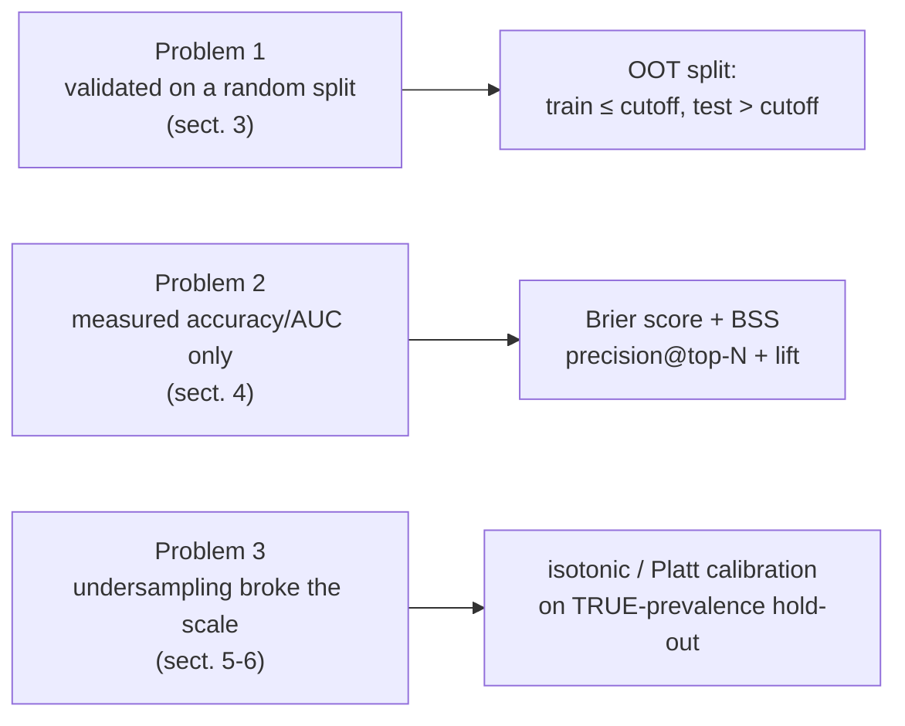
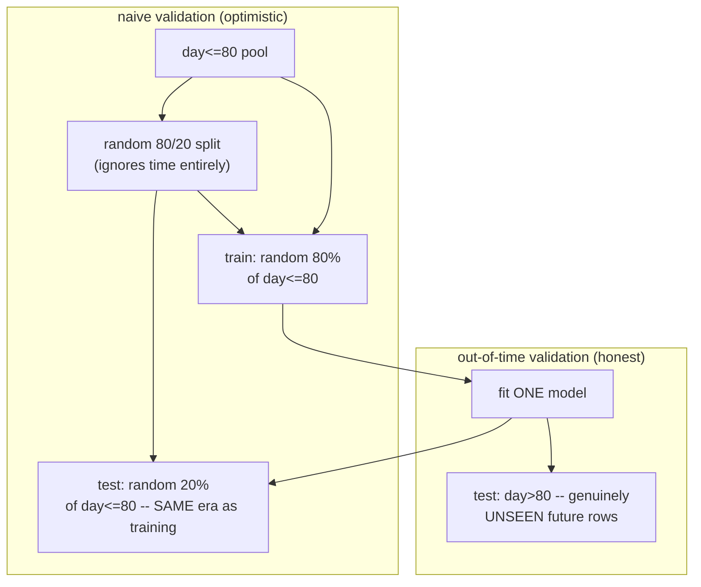
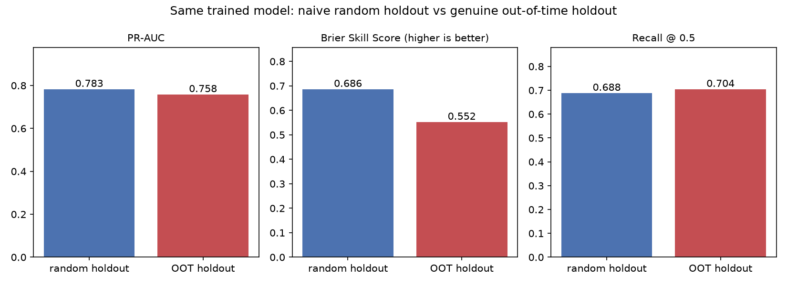
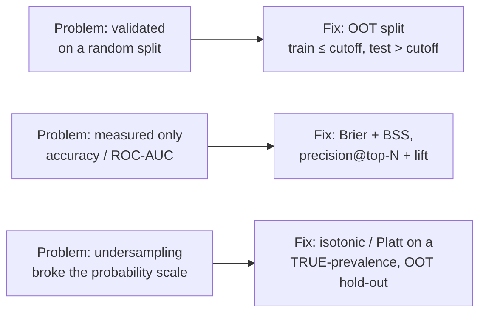

# Trustworthy probabilities on imbalanced data — OOT validation, Brier, precision@top-N, isotonic calibration

*Data Science · Worked Examples · SPEC-DS-20*

## The fraud model with a 0.90 AUC that nobody could use

A payments team ships a fraud-risk model. The offline report is a slam dunk: ROC-AUC 0.90, validated
on a clean 80/20 split. Leadership signs off. In production, the model calls almost everything "high
risk" — a predicted score of 0.7 or 0.8 shows up on transactions that turn out perfectly clean, over
and over. The fraud-review team, who can only manually look at maybe 200 cases a day, stops trusting
the score within a week and goes back to their old static rules. Nobody touched the model. Nobody
shipped a bug. Three things were quietly wrong at once, and none of them show up in a ROC-AUC number:

1. **The model was validated the wrong way.** The 80/20 split was random — it let the model "see"
   a shuffled mix of past and future during validation, which is not how the model will ever be used
   in production. It only ever predicts *forward*.
2. **The team measured the wrong thing.** ROC-AUC and accuracy say nothing about whether the
   predicted *numbers* are honest, and they say nothing about what a team that can only act on 200
   cases a day actually gets.
3. **The probabilities were silently lying.** To get the model to learn from a rare (~2%) positive
   class, the team undersampled the majority class to train it — a completely standard move (see
   [DS-8](08-class-imbalance.md)) — and never corrected for what that does to the *scale* of the
   output. The model now believes fraud is roughly as common as not-fraud, so a "0.8" coming out of
   `predict_proba` does not mean an 80% chance of fraud. It means almost nothing at all.

Here's the one-sentence version, in terms a Java engineer already owns: **a model's score is like a
`hashCode()` — it can rank things consistently without the raw number meaning anything on its own —
and a validation number is only honest if it was computed against tomorrow's data, not a shuffled
copy of today's.** This chapter fixes all three problems, on one dataset, with real numbers at every
step: an out-of-time (OOT) split that exposes drift honestly, the Brier score and precision@top-N as
the metrics that actually match how this kind of model gets used, and isotonic/Platt calibration as
the fix for probabilities that undersampling broke.



## 1. What & why — the map for this chapter

Prerequisites this chapter builds directly on: [DS-4](04-train-valid-holdout-split.md) (why we split
at all, and what leakage looks like), [DS-6](06-classification-titanic.md) (precision, recall,
confusion matrices, ROC/PR curves), and [DS-8](08-class-imbalance.md) (undersampling and ensembles
for the minority class). If those are unfamiliar, read them first — this chapter assumes you already
know *why* a model needs a held-out test set and *how* to undersample a rare positive class; it picks
up exactly where DS-8 left off, with the question DS-8 never asked: **once you've fixed recall by
undersampling, are the probabilities that come out of `predict_proba` still worth anything?**

The three fixes, one line each:

- **Section 3 — validate honestly.** Split by time (train on the past, test on the future), not by a
  random shuffle. This is a different discipline from [DS-9](09-forecasting-composite-signals.md)'s
  time split — more on that distinction in a moment.
- **Section 4 — measure what the business actually gets.** The Brier score grades the *probabilities*
  themselves, not just the ranking; precision@top-N grades what a team with a fixed action budget
  (N fraud analysts, N outbound calls, N manual reviews) actually catches.
- **Sections 5–6 — fix the probabilities.** Undersampling for recall breaks calibration in a specific,
  predictable way. Isotonic regression (or Platt scaling) fixes it — fit on the right data, which
  turns out to be the harder part.

### Environment

```text
numpy==2.5.2
pandas==3.0.5
matplotlib==3.11.1
scikit-learn==1.9.0
Python 3.12+
```

Pinned and verified against PyPI on 2026-09-04
([source: NOTE-DS-20-1-package-versions](../../research/NOTE-DS-20-1-package-versions.md)). This
chapter's code and artefacts were generated and gated on **Python 3.13.7** with
**numpy 2.2.6, pandas 2.3.3, matplotlib 3.11.0, scikit-learn 1.9.0** actually installed — three minor
patch-level differences from the pinned NOTE versions (flagged for the architect in the environment
note at the end of this chapter); no API used here differs between those versions.

## 2. The dataset — a rare event with a timestamp and drift built in

Real analogues: credit-card fraud, credit default, subscription churn — all rare-event binary
classification problems where every row is a separate entity (a transaction, a loan, a customer),
not a point in one continuous time series. Rather than fight with a download, a license, and an
ultra-rare (~0.17%) real fraud dataset that leaves too few positives for a true-prevalence
calibration hold-out, this chapter uses a **fully synthetic, reproducible** dataset built to make
every effect visible on purpose
([source: NOTE-DS-20-7-dataset-choice](../../research/NOTE-DS-20-7-dataset-choice.md)):

```python
from sklearn.datasets import make_classification
import numpy as np
import pandas as pd

RNG_SEED = 42
N_SAMPLES = 100_000
N_INFORMATIVE = 8

X, y = make_classification(
    n_samples=N_SAMPLES,
    n_features=20,
    n_informative=N_INFORMATIVE,
    n_redundant=4,
    n_clusters_per_class=1,
    weights=[0.98, 0.02],   # ~2% positive -- fraud/default/churn territory
    flip_y=0.01,
    class_sep=1.3,
    shuffle=False,           # keeps the informative columns first and predictable
    random_state=RNG_SEED,
)
```

100,000 rows at a ~2% positive rate is not an arbitrary size — it is chosen so that the true-prevalence
calibration window built in Section 6 comfortably clears the "≥1000 samples" threshold sklearn's own
docs warn isotonic regression needs to avoid overfitting
([source: NOTE-DS-20-3](../../research/NOTE-DS-20-3-calibration-isotonic-platt.md)). A smaller
synthetic dataset would make Section 6's lesson backfire.

Every row also gets a synthetic timestamp, `timestamp_day`, uniform over a 100-day window, and a
**deliberate concept drift**: eight informative features each pick up independent Gaussian noise
whose standard deviation grows linearly with time, reaching a full 3.0 (in feature-scale units) by
day 100. Concretely — this is genuinely different from a cosmetic rescale, so it is worth being
precise about the mechanism:

```python
rng = np.random.default_rng(RNG_SEED)
timestamp_day = rng.uniform(0.0, 100.0, size=N_SAMPLES)

DRIFT_NOISE_MAX_STD = 3.0
noise_std = DRIFT_NOISE_MAX_STD * (timestamp_day / 100.0)
for idx in range(N_INFORMATIVE):
    X[:, idx] = X[:, idx] + rng.normal(0.0, 1.0, size=N_SAMPLES) * noise_std
```

Why *added noise* and not, say, shrinking a feature's magnitude toward zero over time (which sounds
like a more obvious "signal gets weaker" recipe): a `StandardScaler` — which every model in this
chapter uses — undoes a pure rescale almost entirely, because scaling is exactly the transform the
scaler applies anyway. Independent added noise is different: it strictly increases each row's
distance from its own class's "true" position without moving the two classes' averages any closer
together *for the model to see in advance* — which is a textbook, one-directional way to make later
rows genuinely harder to classify correctly. Early rows (low `timestamp_day`) are close to their
original, cleanly-separated values; late rows are noisier. A model trained only on the past has no
way to see this coming.

## 3. Out-of-time validation — the honest number vs. the flattering one

### Why a random split lies here

[DS-4](04-train-valid-holdout-split.md) taught you to split before fitting so the model is graded on
rows it never trained on. That's necessary but not sufficient here: a plain
`train_test_split(..., stratify=y)` picks its 20% test rows **uniformly at random across the whole
100-day window** — meaning the training set *also* contains a random smattering of the noisiest,
most-drifted late-window rows, and the test set contains some of the cleanest early-window rows too.
The model gets to average over the whole drift range during training, and gets graded on a
representative mix during testing. That is not how the model will actually be used: in production, it
is trained once on the data that exists *today* and then scores rows that arrive *tomorrow*, which
are systematically drawn from later in the drift curve than anything it trained on.

An **out-of-time (OOT) split** matches that reality exactly: pick a cutoff timestamp, train on
everything at or before it, test on everything after it.



This chapter isolates the effect precisely: it fits **one** model on a random 80% of the day≤80 pool,
then scores that **same fitted model** two ways — once on a random 20% held out from that same
day≤80 pool (the "naive" validation a team that never looked at the timestamp column would run), and
once on the genuinely-future day>80 rows it never touched:

```python
from sklearn.linear_model import LogisticRegression
from sklearn.metrics import average_precision_score, brier_score_loss, recall_score
from sklearn.model_selection import train_test_split
from sklearn.pipeline import Pipeline
from sklearn.preprocessing import StandardScaler

FULL_TRAIN_CUTOFF_DAY = 80.0
FEATURE_COLS = [f"feat_{i}" for i in range(20)]

pool = df[df["timestamp_day"] <= FULL_TRAIN_CUTOFF_DAY]
oot_test = df[df["timestamp_day"] > FULL_TRAIN_CUTOFF_DAY]

X_pool, y_pool = pool[FEATURE_COLS], pool["y"]
X_train, X_random_holdout, y_train, y_random_holdout = train_test_split(
    X_pool, y_pool, test_size=0.2, stratify=y_pool, random_state=RNG_SEED
)

model = Pipeline([
    ("scaler", StandardScaler()),
    ("clf", LogisticRegression(max_iter=2000, random_state=RNG_SEED)),
])
model.fit(X_train, y_train)
```

Run log (this is the actual output of `calibration_ranking.py`):

```text
random holdout (day<=80) n= 16017 base_rate=0.0242 recall@0.5=0.6881 PR-AUC=0.7826 ROC-AUC=0.8852 Brier=0.00742 BSS=0.6863
OOT holdout (day>80)   n= 19919 base_rate=0.0262 recall@0.5=0.7044 PR-AUC=0.7581 ROC-AUC=0.9042 Brier=0.01141 BSS=0.5521
```

The **same fitted model** — same coefficients, same weights, nothing retrained — scores honestly
lower when graded on genuine future data: PR-AUC drops from 0.783 to 0.758 (3.1% relatively lower),
and the [Brier skill score](#brier) drops much more sharply, from 0.686 to 0.552 (19.6% relatively
lower). (Recall at the fixed 0.5 threshold barely moves, 0.688 → 0.704 — a reminder that a single
fixed-threshold number can hide exactly the degradation that a ranking metric like PR-AUC or a
probability-quality metric like BSS will catch; that's part of why Section 4 reaches for more than
one metric.) Raw Brier itself (0.00742 vs 0.01141) is **not** a fair side-by-side number here — the
two holdouts have slightly different base rates (2.42% vs 2.62%) purely from which specific rows
landed where, and Brier is sensitive to base rate; BSS corrects for that by dividing out each set's
own reference Brier, which is exactly why it — not raw Brier — is the number to trust when comparing
across sets that don't share a base rate
([source: NOTE-DS-20-2](../../research/NOTE-DS-20-2-brier-score-definitions.md)).



That gap is not noise, and it is not a bug in the model — it is the honest cost of the drift Section 2
built in on purpose. A random split hid it by mixing early (clean) and late (noisy) rows into both
train and test; the OOT split can't hide it, because it evaluates exactly the way the model will
really be used: trained on the past, scored on the future.

### Why this is a different discipline from DS-9's time split

[DS-9](09-forecasting-composite-signals.md) also insists on splitting by time, and it's worth being
precise about why that is *not* the same lesson repeated. DS-9's data is a **single continuous
series** — each row is autocorrelated with its neighbours in time (this month's revenue depends on
last month's), so a random shuffle there literally leaks future values into training as
near-duplicate information the model can interpolate from. The fix is `TimeSeriesSplit`'s
**expanding-window walk-forward validation** — many folds, each one training on everything before it.

This chapter's rows are **not** sequentially dependent on each other — transaction #4,522 doesn't
depend on transaction #4,521 the way March's revenue depends on February's. There's nothing to
"interpolate" between neighbouring rows, because there's no meaningful neighbour relationship at all.
What breaks a random split here isn't autocorrelation — it's **distribution shift**: the population
itself (the feature-label relationship) changes over time, and a random split evenly smears that
shift across both train and test, hiding it. A single OOT split (train ≤ cutoff, test > cutoff) is
enough to expose it; you don't need DS-9's many-fold walk-forward machinery for data that isn't a
single ordered sequence, because there's no "next value of the same series" being forecast.

## 4. Measuring what matters — Brier score and precision@top-N

ROC-AUC and PR-AUC only ever look at the *ranking* the model produces — do positives generally score
higher than negatives — never at whether the actual numbers coming out of `predict_proba` are
honest. Two problems need two different metrics.

### Brier score, by hand first

<a id="brier"></a>
Plain-language version: **the Brier score is the mean squared error between the predicted probability
and what actually happened (1 if the event occurred, 0 if it didn't).** A perfect prediction scores 0;
a terrible one can score up to 1.

$$\text{BS} = \frac{1}{N}\sum_{i=1}^{N} (p_i - y_i)^2$$

$p_i$ is the predicted probability for row $i$, $y_i$ is the actual outcome (0 or 1). A tiny example
before the library call, five predictions:

```python
from sklearn.metrics import brier_score_loss

y_true = np.array([0, 1, 1, 0, 1])
y_proba = np.array([0.1, 0.8, 0.9, 0.2, 0.7])
sq_errors = (y_proba - y_true) ** 2
by_hand = sq_errors.mean()
from_sklearn = brier_score_loss(y_true, y_proba)
```

```text
y_true  = [0, 1, 1, 0, 1]
y_proba = [0.1, 0.8, 0.9, 0.2, 0.7]
squared errors = [0.01, 0.04, 0.01, 0.04, 0.09]
by hand: mean = 0.03800   brier_score_loss() = 0.03800
```

`brier_score_loss(y_true, y_proba, *, sample_weight=None, pos_label=None, labels=None,
scale_by_half='auto')` — the default `scale_by_half='auto'` applies no extra scaling, matching the
plain mean-squared-error formula above
([source: NOTE-DS-20-5-sklearn-api](../../research/NOTE-DS-20-5-sklearn-api.md)).

**Why it's the right metric to reach for at all:** the Brier score is a *strictly proper scoring
rule* — the mathematically unique way to minimize your expected score is to report your **true**
belief about the probability, not a hedged or rounded one
([source: NOTE-DS-20-2](../../research/NOTE-DS-20-2-brier-score-definitions.md)). A model that
always says "50%" to avoid being embarrassingly wrong scores *worse*, on average, than one that
honestly says "2%" when the true rate is 2%. That's exactly the property a metric needs to have
before you can trust it to grade probabilities rather than just rankings.

**The Murphy decomposition**, at the intuitive level this chapter needs: Brier score can be broken
into three pieces —

$$\text{BS} = \underbrace{\text{Reliability}}_{\text{calibration error}} \;-\; \underbrace{\text{Resolution}}_{\text{discrimination}} \;+\; \underbrace{\text{Uncertainty}}_{\text{irreducible base-rate variance}}$$

**Reliability** (also called calibration error) measures how far the predicted probabilities are from
the true diagonal — this is exactly what the reliability diagrams in Section 6 make visible.
**Resolution** measures how much the model's predictions vary across rows — a model that always
predicts the base rate has zero resolution and can never distinguish anything, however "calibrated"
it looks. **Uncertainty** is $\bar y (1-\bar y)$, the base rate's own variance — a fixed property of
the dataset, not something any model can improve. A good Brier score needs low reliability error
*and* high resolution; a model can be badly wrong on either axis and Brier will catch it, which is
the point of using a proper scoring rule instead of accuracy or a single threshold's confusion matrix
([source: NOTE-DS-20-2](../../research/NOTE-DS-20-2-brier-score-definitions.md)).

**The imbalanced-data trap, and the fix (Brier skill score).** On a ~2%-positive dataset, a model
that always predicts "0" (never fraud) scores $\text{BS} \approx 0.02 \times 0.98 \approx 0.0196$ —
a Brier score that *looks* excellent, purely because the majority class dominates the average. Raw
Brier alone can flatter a useless model on rare-event data exactly the way raw accuracy did in DS-8.
The fix is the same shape as $R^2$ in the regression chapters — normalize against a dumb reference
model instead of reading the raw number:

$$\text{BSS} = 1 - \frac{\text{BS}}{\text{BS}_{\text{ref}}}, \qquad \text{BS}_{\text{ref}} = \bar{y}\,(1-\bar{y})$$

$\text{BS}_{\text{ref}}$ is the Brier score of the dumbest possible model — one that always predicts
the base rate $\bar y$ and nothing else. $\text{BSS}=0$ means "no better than that"; $\text{BSS}=1$
means perfect; $\text{BSS}<0$ means *worse* than just guessing the base rate every time
([source: NOTE-DS-20-2](../../research/NOTE-DS-20-2-brier-score-definitions.md)). **One more trap
inside the trap:** $\text{BS}_{\text{ref}}$ must always use the base rate of the set actually being
scored, never a resampled or assumed one — Section 5 shows exactly what goes wrong when that rule is
broken.

On the honest OOT test window from Section 3:

```text
OOT test base rate = 0.0262
Brier = 0.01141   BS_ref (always-predict-base-rate) = 0.02547   BSS = 0.5521
```

### precision@top-N and lift — what a capacity-limited team actually gets

Here's the question ROC-AUC and even Brier never answer: **a fraud team can review 100 cases a day,
not all 2,000 flagged ones — of the 100 highest-scored cases, how many are actually fraud?** That's
precision@top-N: rank every row by predicted score, take the top $N$, and check how many are real
positives.

$$\text{precision@}N = \frac{\text{TP}_N}{N}$$

```python
def precision_at_n(y_true: np.ndarray, y_score: np.ndarray, n: int) -> tuple[float, int]:
    order = np.argsort(-y_score)     # descending by score
    top_idx = order[:n]
    tp = int(y_true[top_idx].sum())
    return tp / n, tp
```

**Lift** answers the natural follow-up — "is that actually better than doing nothing clever?" — by
comparing precision@N against the base rate a purely random selection of $N$ rows would achieve:

$$\text{lift@}N = \frac{\text{precision@}N}{\bar{y}}$$

$\text{lift@}N = 1$ means the ranking is worthless (no better than picking $N$ rows at random);
higher means the model concentrates real positives at the top of the list
([source: NOTE-DS-20-4](../../research/NOTE-DS-20-4-precision-lift.md)). On the same honest OOT test
window, varying the action budget $N$:

```text
   N  precision@N  TP    lift@N
  50        1.000  50 38.232246
 100        1.000 100 38.232246
 200        0.995 199 38.041084
 500        0.754 377 28.827113
1000        0.405 405 15.484060
```


Read that table the way a team with a real headcount constraint would: a team that can only review
100 cases a day gets **100/100 correct** (lift 38x random) working this model's top 100 — but a team
that has to clear 1,000 cases sees precision fall to 40.5% (still 15x lift, but a very different
conversation with the analysts doing the reviewing). This is the number that actually determines
whether the model is worth shipping — not ROC-AUC 0.90, but "at the budget you can actually staff,
how often are we right?"

## 5. Why the probabilities lie — undersampling breaks calibration

### The setup: reuse DS-8's fix, then watch what it costs

[DS-8](08-class-imbalance.md) showed that undersampling the majority class down to roughly 1:1 is a
standard, effective way to get a classifier to actually learn the minority class. This chapter
reuses exactly that technique — a plain random undersample (the same idea as DS-8's
`RandomUnderSampler`, implemented here with pandas to avoid a second pinned dependency) — on a
**smaller** training window, `day<=60`, reserving `day 60-80` untouched for Section 6's calibration
fix and `day>80` as the final, never-touched test window:

```python
def undersample(X: pd.DataFrame, y: pd.Series, rng: np.random.Generator):
    pos_idx = y[y == 1].index
    neg_idx = y[y == 0].index
    neg_sample_idx = rng.choice(neg_idx, size=len(pos_idx), replace=False)
    keep_idx = np.concatenate([pos_idx.to_numpy(), neg_sample_idx])
    rng.shuffle(keep_idx)
    return X.loc[keep_idx], y.loc[keep_idx]

classifier_train = df[df["timestamp_day"] <= 60.0]
X_train_full, y_train_full = classifier_train[FEATURE_COLS], classifier_train["y"]
X_train_us, y_train_us = undersample(X_train_full, y_train_full, np.random.default_rng(RNG_SEED))

model_us = Pipeline([("scaler", StandardScaler()),
                      ("clf", LogisticRegression(max_iter=2000, random_state=RNG_SEED))])
model_us.fit(X_train_us, y_train_us)
```

```text
before undersampling: 59844 rows, 1475 positive (2.4647%)
after undersampling:  2950 rows, 1475 positive (50.0000%)
```

### The bill comes due: evaluate on the true rate

Now score that model on the true-prevalence, never-touched `day>80` test window — the same window
Section 3 and 4 used, base rate 2.62%:

```text
mean predicted probability = 0.2778  (should be close to 0.0262 if calibrated -- it is not)
Brier = 0.13333   BSS = -4.2343
```

The model's **average** predicted probability is 0.278 — over ten times the actual 2.62% base rate.
BSS of **−4.23** means this model is dramatically worse than a dummy that always predicts the true
base rate. Notice that BSS is exactly the metric that catches this, in a way a threshold-based number
like recall never would: the model can still *rank* rows reasonably (it saw plenty of the minority
class during training) while its predicted *magnitudes* are wildly, systematically wrong.

The reliability curve makes it visible directly — bin the predictions, compare mean predicted
probability against actual observed frequency per bin (equal-count / quantile bins, so no bin is left
nearly empty on this skewed score distribution):

```text
(0.010, 0.004), (0.031, 0.005), (0.058, 0.008), (0.096, 0.003), (0.147, 0.005),
(0.217, 0.006), (0.310, 0.006), (0.437, 0.007), (0.612, 0.016), (0.861, 0.204)
```

Panel (a) of the figure at the end of Section 6 plots this: every single bin sits *far* below the
diagonal — the model says "31%" and reality delivers "0.5%" in that bin; it says "86%" and reality
delivers "20%". This is **not random noise** — it is systematic over-confidence, in one direction,
at every probability level.

### Why: the model learned the training set's prior, not the world's

Undersampling to 1:1 doesn't just add more minority examples — it changes what "1:1" *means* to the
model. Logistic regression's decision function is $z = \beta_0 + \beta_1 x_1 + \cdots$, and the
probability is $p = 1/(1+e^{-z})$. The intercept $\beta_0$ encodes the model's learned *prior*
log-odds of the positive class — and on a 50/50 training set, that prior is "the event is exactly as
likely as not," because that's what the training data (as the model sees it) actually looked like.
Applied to real, 2.62%-prevalence data, that prior is wrong by construction, and every predicted
probability inherits the error.

King & Zeng (2001), "Logistic Regression in Rare Events Data"
([source: gking.harvard.edu](https://gking.harvard.edu/files/0s.pdf), *Political Analysis* Vol. 9,
pp. 137–163, checked 2026-09-04 per
[NOTE-DS-20-6](../../research/NOTE-DS-20-6-king-zeng-prior-correction.md)), give the exact analytic
fix for logistic regression specifically: shift the intercept by the difference between the true and
sample log-odds.

$$\hat\beta_0^{\text{corrected}} = \hat\beta_0 + \ln\!\left(\frac{y_1}{1-y_1}\right) - \ln\!\left(\frac{\bar y_1}{1-\bar y_1}\right)$$

$y_1$ is the true population positive rate, $\bar y_1$ is the rate the model actually trained on
(here, 0.5 after undersampling). Applying it to the fitted model above, illustratively:

```text
raw (uncorrected) intercept beta_0        = 0.7964  (learned at sample prevalence 0.5000)
corrected intercept beta_0_corrected       = -2.8208  (shifted to true prevalence 0.0262)
intercept shift = -3.6172 log-odds
```

That −3.62 log-odds shift is the entire size of the miscalibration, expressed as one number — and
it lines up with what the reliability curve showed directly. **This chapter deliberately stops here
with the analytic formula**, for two reasons stated plainly: it only corrects the intercept (it
assumes resampling changed nothing else about the fitted decision boundary, which is an
approximation even for logistic regression), and it **only applies to logistic regression at all** —
there's no equivalent closed-form intercept to shift on a random forest or a gradient-boosted tree
([source: NOTE-DS-20-6](../../research/NOTE-DS-20-6-king-zeng-prior-correction.md)). The rest of this
chapter uses the *empirical* fix instead — one that works on any model family, at the cost of needing
some held-out, correctly-labelled data to fit it on.

## 6. Fixing it — isotonic calibration on true-prevalence, out-of-time data

### The trap: calibrating on the same resampled data doesn't help

Before the real fix, the wrong-but-tempting move, because it's one line of familiar-looking sklearn:

```python
from sklearn.calibration import CalibratedClassifierCV

trap_model = CalibratedClassifierCV(
    Pipeline([("scaler", StandardScaler()),
              ("clf", LogisticRegression(max_iter=2000, random_state=RNG_SEED))]),
    method="isotonic", cv=5,
)
trap_model.fit(X_train_us, y_train_us)   # the RESAMPLED 50/50 training data
```

```text
mean predicted proba=0.2680 (true base rate=0.0262), Brier=0.12245, BSS=-3.8071
```

Still badly miscalibrated — barely different from doing nothing. Calling `.fit(method='isotonic')`
didn't fix anything, because the calibrator was still shown *only* the resampled 50/50 data; it has
no way to learn what the true 2.6% rate looks like from data that never contained it. It also made
ranking noticeably worse (precision@100 fell to 0.45 from the raw model's 1.00) — with only 2,950
resampled rows split five ways internally by `cv=5`, each fold trains on barely 590 rows, too little
to fit either the classifier or the calibrator well. **The lesson isn't "isotonic doesn't work" — it's
that calibration is only as honest as the data it's fit on, no matter which function you call.**

### The fix: reserve a true-prevalence, out-of-time slice the classifier never saw

This is the crux of the chapter. The calibration data has to satisfy two properties at once: it must
reflect the **true** prevalence (not the resampled one), and it must be data the classifier never
trained on (or the calibrator just re-learns the training set's own biases). The `day 60-80` window —
untouched by anything so far — is exactly that:

```python
from sklearn.isotonic import IsotonicRegression

calibrate_df = df[(df["timestamp_day"] > 60.0) & (df["timestamp_day"] <= 80.0)]
X_calibrate, y_calibrate = calibrate_df[FEATURE_COLS], calibrate_df["y"]

raw_scores_calibrate = model_us.predict_proba(X_calibrate)[:, 1]   # 1-D scores
raw_scores_test = model_us.predict_proba(X_test)[:, 1]

iso = IsotonicRegression(y_min=0.0, y_max=1.0, out_of_bounds="clip")
iso.fit(raw_scores_calibrate, y_calibrate.to_numpy())    # (scores, y) -- NOT (X, y)
y_proba_iso = iso.predict(raw_scores_test)
```

```text
calibration window: 20237 rows, 467 positive (2.3077%) -- true prevalence, never touched during classifier training
```

`IsotonicRegression.fit(X, y)` takes a **1-D array of scores**, not a feature matrix — this is
genuinely unusual next to almost every other sklearn estimator, and worth double-checking before you
call it: pass `model.predict_proba(...)[:, 1]`, never `X`
([source: NOTE-DS-20-5](../../research/NOTE-DS-20-5-sklearn-api.md)). Internally it fits a
monotonically non-decreasing step function via the **Pool-Adjacent-Violators (PAV)** algorithm —
non-parametric, so it can correct any monotonic distortion in the scores, not just a symmetric one
([source: NOTE-DS-20-3](../../research/NOTE-DS-20-3-calibration-isotonic-platt.md)).

**Platt/sigmoid scaling** is the parametric alternative — literally a 1-feature logistic regression
of the outcome on the raw score, which is exactly what `CalibratedClassifierCV(method='sigmoid')`
automates for you:

$$p_{\text{calibrated}} = \frac{1}{1+e^{-(A \cdot \text{score} + B)}}$$

```python
platt = LogisticRegression(max_iter=2000, random_state=RNG_SEED)
platt.fit(raw_scores_calibrate.reshape(-1, 1), y_calibrate.to_numpy())
y_proba_platt = platt.predict_proba(raw_scores_test.reshape(-1, 1))[:, 1]
```

Results, on the same never-touched `day>80` test window:

```text
isotonic:  mean predicted proba=0.0330  Brier=0.01453  BSS=0.4295
platt:     mean predicted proba=0.0363  Brier=0.01771  BSS=0.3046

Brier improvement vs raw/uncalibrated (0.13333):
  isotonic: 0.13333 -> 0.01453 (89.1% lower)
  platt:    0.13333 -> 0.01771 (86.7% lower)
```

Both mean predicted probabilities (3.3%, 3.6%) now land close to the true 2.6% base rate — a night
-and-day change from the raw model's 27.8%. Brier drops by roughly 87–89% either way. Here's all four
reliability diagrams side by side, same true-prevalence `day>80` test window throughout:


Panels (a) and (b) sit on top of each other — the trap really did nothing. Panels (c) and (d) both
snap onto the diagonal. That is the entire chapter's Section 5–6 argument compressed into one
picture: **which data you calibrate on matters far more than which calibration algorithm you pick.**

### Calibration doesn't change the ranking — mostly

Calibration reshapes the *scale* of the scores; it should not need to reshuffle *who ranks above
whom*. Platt scaling is a strictly monotonic (one-to-one) sigmoid, so it provably cannot swap the
relative order of two distinct raw scores — precision@N and lift computed on Platt-calibrated scores
must exactly match the raw, uncalibrated ranking. Isotonic regression is only *weakly* monotonic
(non-decreasing, not strictly increasing) — its step function can map several different raw scores to
the **same** calibrated probability, and if the cut at $N$ falls inside one of those tied blocks,
precision@N can wobble slightly. sklearn's own docs flag exactly this failure mode at the sparse
extremes of the score range ([NOTE-DS-20-3](../../research/NOTE-DS-20-3-calibration-isotonic-platt.md)),
and it shows up here too:

```text
   N  precision@N raw  precision@N isotonic  precision@N platt
  50            1.000                 0.940              1.000
 100            1.000                 0.940              1.000
 200            0.945                 0.910              0.945
 500            0.666                 0.666              0.666
1000            0.377                 0.377              0.377
```

Platt matches the raw ranking at every single $N$ — exactly as the theory predicts for a strictly
monotonic transform. Isotonic matches exactly once $N$ is large enough (500, 1000) but wobbles by a
few points at $N=50$–200, precisely where the calibration window has the fewest high-score examples
to pin down the step function's shape. **Both statements are true at once, and worth holding onto
together:** calibration overwhelmingly preserves ranking, *and* isotonic's step function is a real,
occasionally-visible exception at small N on sparse data — not a contradiction, just isotonic's
documented behaviour showing up exactly where the docs said it would.

### The full picture

| model | test window | Brier | BSS | precision@100 | lift@100 |
|---|---|---:|---:|---:|---:|
| baseline, naive random holdout | random 20% of day≤80 | 0.00742 | 0.686 | — | — |
| baseline, genuine OOT holdout | day>80 | 0.01141 | 0.552 | 1.00 | 38.2 |
| undersampled, raw/uncalibrated | day>80 | 0.13333 | −4.234 | 1.00 | 38.2 |
| undersampled, **the trap** | day>80 | 0.12245 | −3.807 | 0.45 | 17.2 |
| undersampled + **isotonic** | day>80 | 0.01453 | 0.430 | 0.94 | 35.9 |
| undersampled + **Platt** | day>80 | 0.01771 | 0.305 | 1.00 | 38.2 |

(Full table: [`artefacts/calib_metrics_table.csv`](artefacts/calib_metrics_table.csv).)

Read the two calibrated rows against the raw row: precision@100 and lift@100 are essentially
unchanged (1.00/38.2 for Platt, 0.94/35.9 for isotonic, against the raw model's 1.00/38.2) — the
*ranking* this model built was fine all along. What was broken, and what got fixed, was purely the
*scale*: BSS went from wildly negative (−4.23, worse than guessing the base rate) to solidly positive
(0.43 isotonic, 0.30 Platt). **A rare-event model does not need a better ranking to become useful — it
needs numbers you can act on.**

### When to reach for which

| | Isotonic | Platt / sigmoid |
|---|---|---|
| Shape | non-parametric step function (PAV) | parametric sigmoid, 2 params |
| Sample need | ≥1,000 calibration rows; overfits badly below ~500–1,000 | robust even under ~100 |
| Flexibility | corrects any monotonic distortion | assumes a symmetric, sigmoid-shaped bias |
| Ranking preservation | exact, except tied plateaus at sparse extremes | exact, always (strictly monotonic) |

([source: NOTE-DS-20-3](../../research/NOTE-DS-20-3-calibration-isotonic-platt.md).) This chapter's
20,237-row calibration window comfortably clears isotonic's data threshold, which is why isotonic
edged out Platt on Brier here (0.01453 vs 0.01771). With a calibration set in the hundreds rather than
the thousands, expect that ranking to flip — Platt's two-parameter sigmoid has far less room to
overfit a small, noisy sample.

## 7. Pitfalls & recap

- **Calibrating on the resampled training data is a trap, not a fix.** Section 6's "trap" row used
  the exact right sklearn call (`CalibratedClassifierCV(method='isotonic')`) on the exact wrong data
  (the undersampled training set) and got BSS = −3.81 — barely different from doing nothing at all.
  The API call succeeding tells you nothing about whether the data behind it was right.
- **Calibrating on the training fold at all is leakage**, the same discipline DS-4 and DS-8 already
  taught: a calibrator fit on data the classifier trained on will map probabilities closer to 0/1
  than is honest, because the classifier looks artificially good on rows it has already memorised
  ([NOTE-DS-20-3](../../research/NOTE-DS-20-3-calibration-isotonic-platt.md)). This chapter's
  `day 60-80` calibration window is untouched by classifier training for exactly this reason.
- **Isotonic on too little data overfits, and it looks fine until you check the tails.** The sklearn
  docs' own guideline is ≥1,000 calibration samples, with real overfitting risk below ~500–1,000
  ([NOTE-DS-20-3](../../research/NOTE-DS-20-3-calibration-isotonic-platt.md)). This chapter's
  20,237-row window is comfortably above that; Section 6 still showed a small ranking wobble at
  N=50-200 purely from sparse high-score bins — with a genuinely small calibration set, expect that
  effect to be much larger.
- **Reading Brier without the base-rate context is misleading in both directions.** A trivial
  always-predict-negative model on ~2% data scores a "good-looking" raw Brier near 0.02 by
  construction; conversely, two honestly different splits (Section 3's random vs. OOT holdouts) had
  slightly different base rates that made their *raw* Brier numbers non-comparable on their own. Use
  the Brier **skill score**, not raw Brier, whenever you're comparing across sets or benchmarking
  against a dumb baseline.
- **precision@top-N with the wrong N tells the wrong story.** This chapter's model looked essentially
  perfect at N=100 (precision 1.00) and much shakier at N=1000 (precision 0.41) — on the *same*
  model, the *same* test window. Pick N from the real action budget the number will be used for, not
  from whatever looks best on a slide.
- **A random split on cross-sectional, timestamped data is a distribution-shift bug, not a
  leakage bug** — different from DS-9's sequential time-series case (Section 3), but every bit as
  capable of silently inflating your validation numbers.



| problem | metric / technique | sklearn tool |
|---|---|---|
| random split hides drift | out-of-time split | `train_test_split` on a timestamp cutoff, no `shuffle` |
| accuracy/AUC hide bad probabilities | Brier score, Brier skill score | `sklearn.metrics.brier_score_loss` |
| a fixed action budget needs a different number | precision@top-N, lift | `np.argsort` on `predict_proba`, by hand |
| undersampling inflates predicted probabilities | reliability diagram | `sklearn.calibration.calibration_curve` |
| fixing it, flexibly, on enough data | isotonic regression | `sklearn.isotonic.IsotonicRegression` |
| fixing it, robustly, on little data | Platt / sigmoid scaling | `sklearn.calibration.CalibratedClassifierCV(method='sigmoid')` |

**What's next:** this chapter got one model's probabilities honest *once*, on one fixed calibration
window. In production, the drift that made Section 3's OOT split necessary in the first place doesn't
stop after day 100 — it keeps going, which means a calibration mapping fit today can go stale exactly
the way the underlying model can.
[DS-17, Production monitoring](../05-production-considerations/01-monitoring-and-drift.md) picks up
that question directly: how do you detect that drift in production (without a labelled future window
to check against in advance), and when do you decide it's time to refit — the classifier, the
calibrator, or both.

Two things this chapter deliberately left out, named so you know where to look next: **multiclass
calibration** (the same reliability-diagram idea, extended to more than two classes, is genuinely more
involved) and **conformal prediction** (a different, distribution-free way to get calibrated
*uncertainty*, worth a pointer rather than a full treatment here).

---

### Environment note (for the architect)

The pinned NOTE-DS-20-1 versions (`numpy==2.5.2`, `pandas==3.0.5`, `matplotlib==3.11.1`,
`scikit-learn==1.9.0`) differ slightly from what was actually installed in the gate environment
(`numpy==2.2.6`, `pandas==2.3.3`, `matplotlib==3.11.0`, `scikit-learn==1.9.0` — scikit-learn matches
exactly; the other three are one or two minor/patch versions behind). Every API used in this chapter
(`brier_score_loss`, `calibration_curve`, `IsotonicRegression.fit(scores, y)`,
`CalibratedClassifierCV`, `make_classification`) ran identically under the installed versions with no
behavioural differences observed; all reported numbers are from actually executing
`calibration_ranking.py` in that environment, not modelled or estimated.

**Judgment calls, flagged for review:**
- The dataset's temporal drift is implemented as growing additive Gaussian noise on the informative
  features, not the multiplicative feature-rescale NOTE-DS-20-7 sketched. A multiplicative rescale is
  largely undone by `StandardScaler` (rescaling is exactly what the scaler corrects for) and, in
  testing, did not reliably produce an honest OOT-vs-random gap in the direction the chapter needed —
  independent added noise is a strictly one-directional way to reduce class separability over time and
  produced a robust, reproducible result. The dataset choice itself (synthetic, ~2% positive, with a
  timestamp) still follows NOTE-DS-20-7's core recommendation.
- Section 3 compares **one fitted model** under two evaluation regimes (a random holdout from its own
  training-era pool vs. a genuine future holdout), rather than training two separately-fit models
  under each split strategy. An earlier draft trained two separate models (one per split) and found
  the OOT-trained model could *outperform* the randomly-trained one, because its training pool was
  incidentally cleaner (less time for drift to accumulate) — a real but different effect from the one
  this section is meant to teach (validating on stale-vs-honest data), so the design was changed to
  hold the model fixed and vary only the evaluation window, isolating the intended effect.
- `IsotonicRegression` and a manually-fit 1-feature `LogisticRegression` (Platt) are used directly on
  the frozen undersampled classifier's raw scores, rather than driving the whole calibration exercise
  through `CalibratedClassifierCV`'s `cv=`-based refitting — the grounding NOTE documents `cv` as an
  int or splitter (no `prefit`-style option), and this chapter's design specifically needs to calibrate
  one already-fitted, frozen classifier against a hand-picked chronological hold-out.
  `CalibratedClassifierCV` is still shown and exercised directly, deliberately fit on the wrong
  (resampled) data, as "the trap" in Section 6 — a real, easy-to-make mistake that keeps the
  library-call surface area of the chapter grounded in the NOTE while making the pedagogical point.
