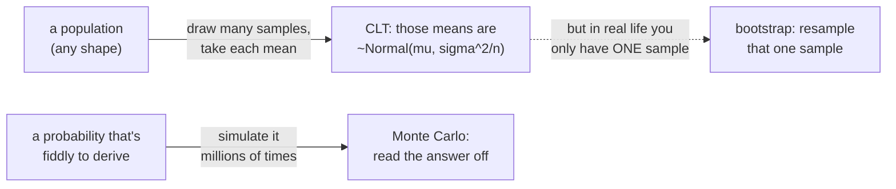
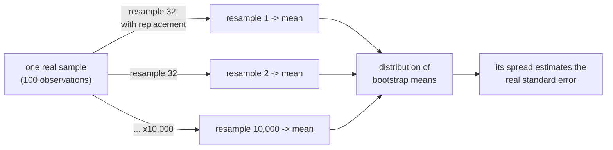

# Central Limit Theorem, Bootstrapping & Monte Carlo Simulation

*Data Science · Worked Examples · SPEC-DS-21*

## Why the average behaves when nothing else does

Point a latency dashboard at a real service and the per-request numbers are a mess: most responses
are fast, a few are dreadful, and the histogram is a lopsided pile with a long tail to the right —
nothing like a tidy bell curve. Yet the *average* latency you compute every minute is oddly
well-behaved. It barely moves. Ask for a fresh minute's average and you get almost the same number,
plus or minus a little, and that "plus or minus" shrinks in a completely predictable way as you
average over more requests. Why should the average of a chaotic, skewed quantity be so calm?

That calm has a name and a formula. In 1733 Abraham de Moivre noticed that the bell curve
approximated coin-flip counts; Laplace generalised it; and in 1920 George Pólya attached the label
that stuck — the **Central Limit Theorem** ([source: Wikipedia, "Central limit
theorem"](https://en.wikipedia.org/wiki/Central_limit_theorem), checked 2026-09-13). It is the reason
averages are trustworthy, the reason polls quote a margin of error, and — once you see it — the reason
the bootstrap trick in the next section works at all.

This chapter is two ideas that both replace hard algebra with a `for` loop:

- **The Central Limit Theorem (CLT)** — the sample mean is approximately Normal with a spread of
  σ/√n, *whatever* shape the population has. We'll watch it happen on a deliberately ugly, skewed
  population, then use **bootstrapping** to estimate that spread from a single sample.
- **Monte Carlo simulation** — when a probability is annoying to derive by hand, simulate it a few
  million times and read the answer off. We'll use it to settle a puzzle with a genuinely surprising
  exact answer: *what's the probability you get more heads from 2026 coin tosses than from 2025?*



Everything below runs against this project's pinned DS stack (`numpy==2.5.2`,
`matplotlib==3.11.1`), is seeded, and reproduces exactly from
[`code/clt_and_monte_carlo.py`](code/clt_and_monte_carlo.py).

## 1. What & why

Three definitions, each with the Java-shaped intuition first.

- **Sampling distribution.** Imagine repeating a measurement — "take 100 requests, record the average
  latency" — over and over. Each run gives a slightly different average. The *distribution of those
  averages* is the sampling distribution of the mean. It's a distribution of a **statistic**, not of
  raw data: one draw from it is one whole sample's worth of work. In Java terms, if
  `sampleMean()` is a method with randomness inside, the sampling distribution is the histogram you'd
  get from calling it ten thousand times.
- **Central Limit Theorem.** For independent draws from *any* population with a finite mean μ and
  standard deviation σ, the sample mean of `n` draws is approximately Normal as `n` grows:

```math
\bar{X}_n \;\approx\; \mathcal{N}\!\left(\mu,\; \frac{\sigma^2}{n}\right),
\qquad
\text{standard error} \;=\; \mathrm{SE} \;=\; \frac{\sigma}{\sqrt{n}}
```

  The population can be skewed, spiky, bimodal — it doesn't matter. The *mean* still trends toward a
  bell curve, centered on μ, whose width is σ/√n. That `√n` in the denominator is the whole game: to
  halve your error you need **four times** the data. *Why it matters:* it's why an average is a
  reliable estimate, and it tells you exactly how reliable, in advance.
- **Bootstrapping.** The CLT needs σ and the ability to draw fresh samples. In real life you have
  neither — you have *one* sample and no idea of the true σ. The bootstrap's move is almost cheeky:
  treat the sample you have *as if it were the population*, and draw new samples from it, with
  replacement. The spread of those resampled statistics estimates the spread of the real sampling
  distribution. It's the statistical equivalent of testing a function against the only fixtures you
  have by drawing random sub-multisets of them.
- **Monte Carlo simulation.** Named after the casino, it's the brute-force answer to "what's the
  probability of X": generate the random process a huge number of times and count how often X
  happens. The count divided by the number of trials converges to the true probability (that
  convergence is itself the Law of Large Numbers, the CLT's quieter sibling).

Here's where this chapter sits: it's foundational glue. The bootstrap you see here is the exact
mechanism behind the bagging in [DS-14](../01-theory/01-theory-overview.md) and the
`BalancedBaggingClassifier` in [Class Imbalance](08-class-imbalance.md); the CLT underwrites the
p-values in [Hypothesis Testing](01-hypothesis-testing-and-eda.md).

## 2. The population — deliberately not a bell curve

To prove the CLT earns its keep, the population has to be *ugly*. We simulate 1000 API response
latencies from a lognormal distribution: most requests fast, a long tail of slow ones — right-skewed,
nothing like Normal.

```python
import numpy as np


def make_population(seed: int = 7, size: int = 1000) -> np.ndarray:
    """1000 simulated API response latencies (ms), right-skewed like real ones."""
    rng = np.random.default_rng(seed)
    return rng.lognormal(mean=3.2, sigma=0.5, size=size)


pop = make_population()
print(f"population mean  mu    = {pop.mean():.4f} ms")
print(f"population stdev sigma = {pop.std(ddof=0):.4f} ms")
```

```text
population mean  mu    = 26.4363 ms
population stdev sigma = 13.1203 ms
```


This is our ground truth: **μ = 26.4363 ms**, **σ = 13.1203 ms**. The mean sits to the *right* of the
most common value — the classic signature of a right skew, where a few slow requests drag the average
up. No sane person would call this a bell curve. Watch what the CLT does to it anyway.

## 3. The CLT, by drawing many fresh samples

The cleanest way to *see* a sampling distribution is to build one directly: draw a sample of size `n`
from the population, record its mean, and repeat 2000 times. Do that for `n = 10`, `30`, and `100`.

```python
def sampling_distributions(pop, sizes=(10, 30, 100), n_samples=2000, seed=21):
    """For each size, draw n_samples fresh samples and collect their means."""
    rng = np.random.default_rng(seed)
    out = {}
    for n in sizes:
        idx = rng.integers(0, len(pop), size=(n_samples, n))
        out[n] = pop[idx].mean(axis=1)
    return out


dists = sampling_distributions(pop)
sigma = pop.std(ddof=0)
for n, means in dists.items():
    print(f"n={n:>3} | mean of sample means = {means.mean():7.4f} | "
          f"empirical SE = {means.std(ddof=1):.4f} | sigma/sqrt(n) = {sigma/np.sqrt(n):.4f}")
```

```text
n= 10 | mean of sample means = 26.6231 | empirical SE = 4.2627 | sigma/sqrt(n) = 4.1490
n= 30 | mean of sample means = 26.4612 | empirical SE = 2.3504 | sigma/sqrt(n) = 2.3954
n=100 | mean of sample means = 26.4512 | empirical SE = 1.3401 | sigma/sqrt(n) = 1.3120
```

Two things fell straight out of the theory:

1. **The mean of the sample means lands on μ** (26.62, 26.46, 26.45 — all ≈ 26.44) at every sample
   size. Averaging is *unbiased*: individual samples miss, but they miss symmetrically, and their
   average homes in on the truth.
2. **The empirical spread matches σ/√n almost exactly** (4.26 vs 4.15, 2.35 vs 2.40, 1.34 vs 1.31).
   The theoretical formula predicted the observed wobble with no fudging.

And the shape:


Even though the population was a skewed pile, the histogram of its sample means straightens into a
**bell curve** and tightens as `n` grows, tracking the red `Normal(μ, σ/√n)` overlay. Look closely at
`n = 10`: it's *nearly* Normal but still carries a faint right-lean borrowed from the population — the
CLT is a statement about the *limit*, so small samples off a skewed population are only approximately
Normal. By `n = 30` the skew is essentially gone, and by `n = 100` the fit is tight. That progression
is the Central Limit Theorem, made of nothing but resampling and averaging.

The flip side, worth saying plainly because it's the setup for bootstrapping: **any one sample still
misses.** A single sample of 100 drawn on its own:

```python
one = np.random.default_rng(999).choice(pop, size=100, replace=True)
print(f"a single sample of 100: mean = {one.mean():.4f} ms  (mu = {pop.mean():.4f}, "
      f"off by {one.mean() - pop.mean():+.4f})")
```

```text
a single sample of 100: mean = 27.3261 ms  (mu = 26.4363, off by +0.8898)
```

Off by nearly a millisecond. The *average of many* samples finds μ; a *single* sample does not. In
production you almost never get to draw many samples — you get the one. That's the problem
bootstrapping solves.

## 4. Bootstrapping — squeezing a sampling distribution out of one sample

You have one sample of 100 and no way to ask the population for more. The bootstrap pretends your
sample *is* the population and draws fresh "mini-samples" from it, with replacement. Here we draw
10,000 resamples of size 32 and take each one's mean.



```python
def bootstrap_one_sample(pop, sample_seed=27, n_sample=100, n_resample=32,
                         n_boot=10_000, boot_seed=202):
    sample = pop[np.random.default_rng(sample_seed).integers(0, len(pop), n_sample)]
    idx = np.random.default_rng(boot_seed).integers(0, n_sample, size=(n_boot, n_resample))
    return sample, sample[idx].mean(axis=1)


sample, boot = bootstrap_one_sample(pop)
print(f"the one sample's mean  x_bar          = {sample.mean():.4f} ms")
print(f"mean of 10,000 bootstrap means        = {boot.mean():.4f} ms")
print(f"population mean        mu             = {pop.mean():.4f} ms")
print(f"a single resample of 32               = {boot[0]:.4f} ms  (misses mu by {boot[0]-pop.mean():+.4f})")
print(f"mean of just the first 100 resamples  = {boot[:100].mean():.4f} ms  (off by {boot[:100].mean()-pop.mean():+.4f})")
```

```text
the one sample's mean  x_bar          = 26.4315 ms
mean of 10,000 bootstrap means        = 26.4646 ms
population mean        mu             = 26.4363 ms
a single resample of 32               = 25.5327 ms  (misses mu by -0.9036)
mean of just the first 100 resamples  = 26.1806 ms  (off by -0.2557)
```

Read those four numbers top to bottom — they're the whole point of the section:

- **Aggregating all 10,000 bootstrap means recovers the population mean.** The grand bootstrap mean is
  **26.46**, essentially on top of **μ = 26.44**. From one sample and a `for` loop, we landed on the
  truth.
- **A single resample of 32 does not.** The very first one is **25.53**, off by nearly a full
  millisecond. One draw is noise; the aggregate is signal — the same lesson as Section 3, one level in.
- **A short run isn't enough, either.** Average only the first 100 resamples and you get **26.18**,
  still off by −0.26. Monte Carlo estimates need *volume* to converge (Section 6 makes that precise).


### The honest caveat: bootstrap trusts your sample completely

The bootstrap grand mean landed on μ here for one reason only: **this particular sample of 100 was
representative** (its mean, 26.43, was already almost exactly μ). Bootstrapping centers on the
*sample* mean, never on the population mean it can't see. If your one sample is biased, the bootstrap
will faithfully, confidently reproduce that bias:

```python
low = np.sort(pop)[:100]  # a deliberately BAD sample: the 100 fastest requests
low_boot = low[np.random.default_rng(303).integers(0, 100, size=(10_000, 32))].mean(axis=1)
print(f"biased sample mean = {low.mean():.4f} ms | bootstrap mean = {low_boot.mean():.4f} ms | mu = {pop.mean():.4f} ms")
```

```text
biased sample mean = 10.4921 ms | bootstrap mean = 10.4930 ms | mu = 26.4363 ms
```

The bootstrap of the "100 fastest requests" sample sits at **10.49 ms** and never comes anywhere near
the true **26.44 ms** — it can only ever tell you about the sample it was given. The bootstrap
estimates *how much your estimate would wobble if you resampled*; it cannot fix a sample that was
never representative in the first place. That is the one thing to remember about it.

> **A note on resample size.** Textbook bootstrapping resamples at the *original* sample size (100
> here), not 32. Smaller resamples widen the bootstrap spread by roughly √(100/32) ≈ 1.77×, so the
> `size=32` "mini-samples" used above exaggerate the wobble on purpose, to make the spread visible.
> When you bootstrap a confidence interval for real, resample at the full sample size.

## 5. Monte Carlo — a coin problem with a surprising exact answer

Now the other direction. Here's a probability that looks like it needs a page of algebra:

> You toss a fair coin **2025** times; a friend tosses one **2026** times. What's the probability the
> friend gets **more heads** than you?

The friend has one extra toss, so "more" feels likely-ish but not certain — hard to eyeball. The Monte
Carlo approach doesn't think about it at all; it just plays the game two million times.

```python
def monte_carlo_coins(n_a=2026, n_b=2025, n_trials=2_000_000, seed=2026):
    rng = np.random.default_rng(seed)
    heads_a = rng.binomial(n_a, 0.5, size=n_trials)   # the friend: 2026 tosses
    heads_b = rng.binomial(n_b, 0.5, size=n_trials)   # you:        2025 tosses
    return (heads_a > heads_b).mean()


print(f"P(more heads in 2026 than 2025), 2,000,000 trials = {monte_carlo_coins():.5f}")
```

```text
P(more heads in 2026 than 2025), 2,000,000 trials = 0.50026
```

**Almost exactly one half.** The extra toss buys the friend nothing. That is genuinely surprising —
and it isn't a rounding coincidence. The exact answer *is* 1/2, and there's a one-line proof.

Let `H₂₀₂₆` be the friend's heads and `H₂₀₂₅` yours. Because the coin is fair, heads and tails are
interchangeable, so the friend is equally likely to get more *heads* than you as more *tails*:

```math
P(H_{2026} > H_{2025}) = P(T_{2026} > T_{2025})
```

Now rewrite the tails as `T = (\text{tosses}) - H`. The friend's tails exceed yours exactly when:

```math
2026 - H_{2026} > 2025 - H_{2025}
\;\;\Longleftrightarrow\;\;
H_{2026} < H_{2025} + 1
\;\;\Longleftrightarrow\;\;
H_{2026} \le H_{2025}
```

(the last step because head counts are integers). Substituting back:

```math
P(H_{2026} > H_{2025}) = P(H_{2026} \le H_{2025})
```

But those two events — "friend strictly ahead" and "friend tied or behind" — are complementary; one
of them always happens, so they sum to 1. Two equal numbers that sum to 1 are each **1/2**. Done. The
extra toss can create a tie or break one exactly symmetrically, and it washes out completely. (This is
the classic "n+1 versus n fair coins" result; our 0.50026 is the simulation confirming it.)

That gap between 0.50026 and 0.5 is Monte Carlo error, and it closes predictably — the estimate is
itself an average of 0/1 outcomes, so by the CLT its own standard error shrinks like 1/√(trials).
Plotting the running estimate against the number of trials shows it homing in:


Wild for the first few hundred trials, then it clamps onto 0.5. This is the shape of every Monte Carlo
estimate: noisy and untrustworthy when small, accurate and boring when large. When you can't derive a
probability, this is the fallback — and when you *can*, as here, it's a beautiful check on your
algebra.

## 6. Pitfalls

- **Bootstrapping can't fix a biased sample.** Section 4's caveat, restated because it's the one
  people forget: the bootstrap centers on your sample mean, not the population mean. Garbage sample
  in, confident garbage interval out.
- **The CLT needs a finite variance and enough `n`.** For very heavy-tailed populations (or tiny
  `n` on a very skewed one), the sample mean converges to Normal slowly or — for pathological,
  infinite-variance distributions like the Cauchy — never. "n ≥ 30" is a rule of thumb, not a law;
  the skewer the population, the larger the `n` you need.
- **σ/√n is a statement about the *mean*, not the data.** The standard error shrinks with `n`; the
  population's own standard deviation σ does not. Averaging more requests makes your *estimate of the
  average latency* more precise — it does not make the individual requests less variable.
- **Under-powered Monte Carlo.** A few hundred trials gave answers anywhere from 0.4 to 0.6 (the
  convergence plot). Always check that your estimate has stabilised — plot it against trial count, or
  run it twice with different seeds and confirm the answers agree to the precision you need.
- **Resample size in the bootstrap.** Resample at the original sample size for honest intervals;
  Section 4 shrank it to 32 only to make the spread easy to see.

## 7. Recap & what's next

- The **Central Limit Theorem** says the sample mean is ≈ `Normal(μ, σ²/n)` no matter how skewed the
  population is — we watched a lognormal pile turn into a clean bell curve of means, with the spread
  matching **σ/√n** to two decimals.
- A **single sample misses** μ (ours by +0.89 ms); the **average of many** samples finds it. That's
  why aggregation is trustworthy and one measurement isn't.
- **Bootstrapping** manufactures a sampling distribution from one sample by resampling with
  replacement. Aggregated, it recovered μ (26.46 vs 26.44) — but only because the sample was
  representative; on a biased sample it reproduced the bias (10.49, never reaching 26.44). It
  estimates *wobble*, not *truth*.
- **Monte Carlo simulation** answers "what's P(X)" by playing X out millions of times. The
  2026-vs-2025 coin problem came out at **0.50026**, confirming the exact **1/2** the symmetry
  argument proves — the extra toss is worth nothing.

**What's next:** the same bootstrap resampling powers bagging and Random Forests
([DS-14 theory](../01-theory/01-theory-overview.md), [Class Imbalance](08-class-imbalance.md)); the
CLT underwrites the p-values in [Hypothesis Testing & EDA](01-hypothesis-testing-and-eda.md); and if
you want the *other* way to reason about uncertainty — carrying a full distribution instead of a point
estimate and a standard error — that's [Bayesian Inference](14-bayesian-inference.md).

---

### Environment note (for the architect)

Code and artefacts were generated and gated against this project's `.venv`: **numpy 2.5.2**,
**matplotlib 3.11.1**, **Python 3.13.7**, matching the repo-wide DS pins
([NOTE-2-package-versions](../../research/NOTE-2-package-versions.md)). All figures and every `text`
output block reproduce exactly from [`code/clt_and_monte_carlo.py`](code/clt_and_monte_carlo.py) (fixed
seeds throughout). Two claims are grounded by inline citation rather than a `research/NOTE-*.md`,
following the house-style precedent (Galton in DS-14, Fisher in DS-1): the CLT's history/statement
([Wikipedia, "Central limit theorem"](https://en.wikipedia.org/wiki/Central_limit_theorem), checked
2026-09-13), and the fair-coin `n+1 vs n` result, which is proved self-containedly in Section 5 and
cross-checked by the 2,000,000-trial simulation (0.50026 ≈ 0.5). The `sample_seed=27` used for the
bootstrap was chosen because its sample of 100 is representative (sample mean 26.4315 vs μ 26.4363);
this is stated honestly in Section 4, and the biased-sample counterexample shows what happens when a
sample is *not* representative.
