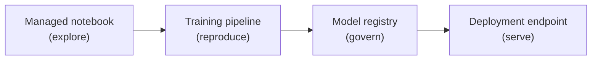
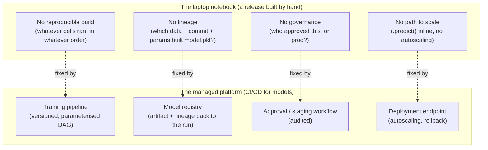
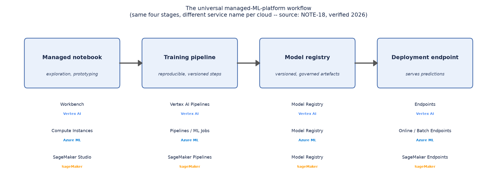
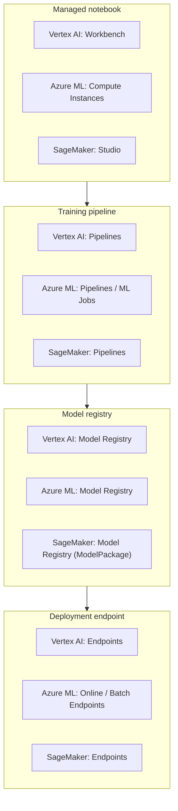

# Managed ML platforms — Vertex AI, Azure ML, SageMaker

*Data Science · Cloud Environment Setup · SPEC-DS-15*

**Nature of this chapter: grounded conceptual.** Every cloud SDK/CLI block below is **reference
only** — it shows the real, current API from official documentation, but it is not executed in
this sandbox (there is no GCP/Azure/AWS account to run against). No console output in this chapter
is fabricated: where you'd normally see a printed result, the text says what the *documented*
behaviour is and cites the source instead of inventing a number. The one piece of code that
actually runs is the workflow diagram generator in `code/`.

## The demo that couldn't survive contact with a team

Monday: you train a churn model in a notebook. Load the CSV, engineer a few features, fit
`RandomForestClassifier`, print an AUC you're happy with, `pickle.dump()` it to `models/v3.pkl`.
The metric looks good — ship it.

Three months later, someone asks you to retrain it on fresher data. You open the same `.ipynb`.
Half the cells don't run in the order you last ran them. `pip install` pulled a different
scikit-learn minor version than the one you had back in March. Two global variables from a cell
you don't remember running are still shaping the output. You get a different AUC than the one you
originally reported — and you can't explain why, because nothing about that first run was ever
recorded anywhere outside your own head.

Then compliance asks the question you were dreading: which exact dataset snapshot, which commit,
which hyperparameters produced the model that's currently deciding who gets a retention offer? The
honest answer is nobody kept track. There's no equivalent of a Maven build that either reproduces
byte-for-byte or fails loudly — there's just a `.pkl` file and your memory of a Tuesday three
months back.

Then Black Friday: traffic spikes 40x, and the `.predict()` call you wired into a Flask endpoint
one afternoon — no autoscaling, no rollback plan, no on-call runbook, because nobody designed a
serving layer, they shipped a demo — falls over.

None of this is a Python problem. A Java engineer has already lived through the exact same story
once, just wearing different clothes: a script that reads a file and prints an answer on your
laptop is not a service. Nobody ships a Java artifact by SCP-ing a `.jar` to a box and running it
in a `screen` session — not because it *can't* work, but because it doesn't survive contact with a
team, an audit, or an incident. Here's the one-sentence version of what fixes it, whether the
artifact is a `.jar` or a `.pkl`: **a managed ML platform is CI/CD for your model** — a pipeline
that builds it reproducibly, a registry that remembers what shipped and why, and an endpoint that
serves it like a real service instead of a demo.

Four stages close that gap, and — as this chapter shows — every major cloud implements the same
four under different brand names. This is the map the rest of the chapter keeps coming back to:



## 1. What & why

You've built a model in a notebook (DS-1 through DS-14 in this curriculum): load data, engineer
features, fit an estimator, check a metric, maybe pickle it to disk. That's the entire lifecycle
so far — one person, one machine, one file. It works, right up until a second person, a second
environment, or a production SLA gets involved — which is exactly the wall the story above just
walked into. Named plainly, that's the same wall in four flavors:

- **No reproducible build.** A notebook's true state is "whatever cells you happened to run, in
  whatever order, with whatever variables are still sitting in memory." Two people opening the
  same `.ipynb` six months apart can get different results.
- **No lineage.** Which exact dataset version, code commit, and hyperparameters produced the model
  file sitting in `models/v3.pkl`? **Lineage** is the plain word for that paper trail — the ability
  to walk backward from a served model to the exact code, data, and parameters that built it. In a
  notebook, the honest answer is usually "nobody kept track." You'd never ship a Java artifact
  without knowing which commit and which dependency versions built it — but that's the default
  state of a notebook-trained model.
- **No governance.** Who approved this model for production? What's the audit trail if a
  regulator, or your own risk team, asks why the model made a particular prediction on a particular
  date? A `.pkl` file on someone's laptop has no answer.
- **No path to scale or serve.** A notebook can call `.predict()` inline. It has no story for
  "serve this to 500 requests/second with autoscaling and a rollback plan" — that's an entirely
  different piece of infrastructure, one a data scientist shouldn't have to hand-roll per project.

A **managed ML platform** is the cloud vendor's answer to exactly this gap: a system that turns
"a person ran some cells" into a pipeline with versioned inputs, a registered artifact with
lineage, and a governed, autoscaled way to serve it — the MLOps equivalent of what a CI/CD
pipeline and an application platform (Kubernetes, an app service, whatever your shop uses) already
give you for ordinary software. LO1 is this section: the advantages are reproducibility, lineage,
scale, and governance, in that order of "how soon you'll feel the pain of not having it." Redrawn
as a straight substitution, each pain point maps onto exactly one platform capability:



## 2. The universal workflow

Every major managed ML platform — despite branding differently and shipping different consoles —
implements the **same four stages** from the map above, because they're solving the same problem.
Here's what each one actually is:

1. **Managed notebook** — a hosted, provisioned Jupyter-compatible environment. Same interactive
   loop you already know, but the compute, the identity, and the network boundary are managed by
   the platform instead of "whatever's on your laptop."
2. **Training pipeline** — the notebook's ad-hoc cell sequence promoted to a versioned, parameterised
   DAG: each step (data prep, train, evaluate) runs as its own tracked, retriable unit with declared
   inputs and outputs. This is where "reproducible build" stops being aspirational.
3. **Model registry** — the built artifact, versioned, with lineage back to the pipeline run that
   produced it, plus whatever approval/staging workflow your org bolts on. The ML equivalent of an
   artifact repository (think Nexus/Artifactory) that also happens to remember the training
   evidence attached to each build.
4. **Deployment endpoint** — a managed, autoscaling serving layer that turns a registered model
   version into an HTTP prediction API (or a scheduled batch job), with rollout/rollback controls.

Figure 1 draws this as one flow, with the concrete service name for each stage in each of the
three clouds this chapter covers.



*Figure 1 — generated by `code/platform_workflow_diagram.py` (the only executed code in this
chapter). Service names sourced from
[research/NOTE-18-managed-platforms.md](../../research/NOTE-18-managed-platforms.md).*

## 3. Cross-cloud service mapping

LO2: the same four stages, named differently per cloud. All names verified against each vendor's
2026 documentation
([source: NOTE-18-managed-platforms](../../research/NOTE-18-managed-platforms.md)):

| Stage | Vertex AI (Google Cloud) | Azure ML | AWS SageMaker |
|---|---|---|---|
| Managed notebook | **Workbench** [source: Vertex AI overview](https://docs.cloud.google.com/vertex-ai/docs/start/introduction-unified-platform) (checked 2026-09-02) | **Compute Instances** [source: Azure ML pipeline tutorial](https://learn.microsoft.com/en-us/azure/machine-learning/tutorial-pipeline-python-sdk) (checked 2026-09-02) | **SageMaker Studio** [source: SageMaker model registry deploy guide](https://docs.aws.amazon.com/sagemaker/latest/dg/model-registry-deploy.html) (checked 2026-09-02) |
| Training pipeline | **Vertex AI Pipelines** (`aiplatform.PipelineJob`) | **Pipelines / ML Jobs** (`azure.ai.ml.dsl.pipeline`, SDK v2) | **SageMaker Pipelines** |
| Model registry | **Model Registry** (`aiplatform.Model`) | **Model Registry** | **Model Registry** (`ModelPackage`) |
| Deployment endpoint | **Endpoints** (`Model.deploy()`) | **Online Endpoints** / **Batch Endpoints** [source: Azure ML endpoints concept](https://learn.microsoft.com/en-us/azure/machine-learning/concept-endpoints) (checked 2026-09-02) | **SageMaker Endpoints** |

The table reads left to right, one stage at a time; drawn the other way — one cloud at a time,
same four stages stacked — the "same shape, different labels" pattern is even easier to spot:



**A branding note, checked and worth stating plainly:** as of April 2026, Google Cloud
[renamed Vertex AI to **Gemini Enterprise Agent Platform**](https://cloud.google.com/blog/products/ai-machine-learning/introducing-gemini-enterprise-agent-platform)
(announced at Google Cloud Next '26, 2026-04-22; the product page is now titled
["Gemini Enterprise Agent Platform (formerly Vertex AI)"](https://cloud.google.com/products/gemini-enterprise-agent-platform),
checked 2026-09-02). Google's own framing is that this is an *evolution*, not a teardown: the
underlying services in the table above — Workbench, Pipelines, Model Registry, Endpoints — keep
their names and behaviour, and the `google-cloud-aiplatform` Python package (Section 4) is
unchanged. This chapter keeps using "Vertex AI" throughout because that's still the name of the ML
platform capability described here and the name the SDK, its docs, and its PyPI package use; treat
"Gemini Enterprise Agent Platform" as the current umbrella brand you'll see in the console and
marketing material, not a different product. It's also a small worked example of the last pitfall
in §6: service *names* drift, the four *stages* don't.

Two things the table can't show but matter in practice:

- **The registry is the one row that's genuinely the same idea everywhere.** All three call it
  "Model Registry," all three attach versioning and lineage to a registered model, and all three
  gate deployment on "is this model version registered/approved" rather than "is there a file on
  disk somewhere."
- **The notebook and endpoint rows are where the vendors diverge most in operating model.** Azure
  ML's Compute Instances are the closest to "a VM you personally start and stop"; Vertex AI
  Workbench and SageMaker Studio lean further into "provisioned for you, tied to a managed
  identity." Endpoints diverge on the online/batch split: Azure ML makes it two first-class endpoint
  types up front (see the endpoints comparison table on
  [Microsoft's own concept page](https://learn.microsoft.com/en-us/azure/machine-learning/concept-endpoints),
  checked 2026-09-02), where Vertex AI and SageMaker fold batch prediction into the same "Endpoints"
  concept with a different invocation mode.

## 4. A concrete pipeline + deploy sketch (Vertex AI)

LO3. This is the **reference** SDK walkthrough the spec asks for — real, current API surface from
`google-cloud-aiplatform`, not executed here. It walks the middle three stages of the map from the
cold open — pipeline → registry → endpoint — end to end in one cloud, so the four-stage flow stops
being an abstraction and becomes five concrete method calls. Every name below is verified in
[NOTE-18](../../research/NOTE-18-managed-platforms.md): the package is pinned at
`google-cloud-aiplatform==2.1.0` (released 2026-09-01, requires Python >=3.10, verified directly
against [PyPI](https://pypi.org/project/google-cloud-aiplatform/), checked 2026-09-02), and the
entry points are `aiplatform.init()`, `aiplatform.PipelineJob`, and `Model.deploy()`.

```text
google-cloud-aiplatform==2.1.0
Python >=3.10
```

**Step 1 — initialise the SDK against a project and region.** Every Vertex AI call is scoped to a
GCP project and a region; `aiplatform.init()` sets that context once so the rest of the script
doesn't repeat it — think of it as the equivalent of setting the active AWS profile/region before
running any `boto3` calls.

```python
from google.cloud import aiplatform

aiplatform.init(
    project="your-gcp-project-id",
    location="us-central1",
    staging_bucket="gs://your-gcp-project-id-vertex-staging",
)
```

**Step 2 — submit a training pipeline.** `PipelineJob` runs a Kubeflow/Vertex Pipelines DAG you've
already compiled (typically with the Kubeflow Pipelines SDK) — the same "declared, versioned steps"
idea as a CI pipeline YAML, except the steps are training/eval/preprocessing components instead of
build/test/deploy jobs.

```python
pipeline_job = aiplatform.PipelineJob(
    display_name="churn-model-training",
    template_path="gs://your-gcp-project-id-vertex-staging/pipelines/churn_pipeline.json",
    pipeline_root="gs://your-gcp-project-id-vertex-staging/pipeline-root",
    parameter_values={
        "train_data_uri": "gs://your-gcp-project-id-data/churn/train.csv",
        "n_estimators": 200,
    },
)
pipeline_job.run(sync=True)
```

**Step 3 — the pipeline registers a model; reference it in the Model Registry.** A training
pipeline typically ends with a component that uploads the trained artifact into the Model
Registry. From application code, you reference that registered model by resource name (or look it
up by display name) — this is the "versioned artifact with lineage" property from Section 1, made
concrete: `Model` objects carry a reference back to the training job that produced them.

```python
model = aiplatform.Model(model_name="projects/your-gcp-project-id/locations/us-central1/models/1234567890")
```

**Step 4 — deploy the registered model to an endpoint.** `Model.deploy()` creates (or reuses) an
`Endpoint` and attaches this model version to it with a compute/scaling spec — the managed
equivalent of pointing a load balancer at a new revision, with the platform handling provisioning.

```python
endpoint = model.deploy(
    deployed_model_display_name="churn-model-v1",
    machine_type="n1-standard-4",
    min_replica_count=1,
    max_replica_count=3,
)
```

**Step 5 — call the endpoint.** Once deployed, prediction is a single method call against the
returned `Endpoint` object; the platform handles the HTTP layer underneath.

```python
prediction = endpoint.predict(instances=[{"tenure_months": 14, "monthly_charge": 79.99}])
```

That's the whole loop: `aiplatform.init()` → `PipelineJob` → `Model` (registry) → `Model.deploy()`
→ `Endpoint.predict()`, four service boundaries mapping exactly onto the four stages in Section 2.

**The same loop in Azure ML** (`azure-ai-ml`, SDK v2 — verified live against Microsoft's own
pipeline tutorial,
[source: tutorial-pipeline-python-sdk](https://learn.microsoft.com/en-us/azure/machine-learning/tutorial-pipeline-python-sdk),
checked 2026-09-02): you get an `MLClient` handle instead of calling `init()` globally, build the
pipeline with the `@dsl.pipeline` decorator over `command()` components instead of submitting a
compiled JSON template, and submit with `ml_client.jobs.create_or_update(pipeline, ...)`. The
trained model is registered via `mlflow.sklearn.log_model(..., registered_model_name=...)` inside
the training step itself (Azure ML pipelines are commonly MLflow-instrumented), and deployment
targets an **Online Endpoint** (`ManagedOnlineEndpoint` / `ManagedOnlineDeployment`) rather than a
single `Model.deploy()` call — Azure separates the endpoint (the stable URL) from the deployment
(the model + compute behind it) as two objects you create and wire together.

**The same loop in SageMaker** (verified against AWS's own model-registry deploy guide,
[source: model-registry-deploy](https://docs.aws.amazon.com/sagemaker/latest/dg/model-registry-deploy.html),
checked 2026-09-02): a `SageMaker Pipeline` plays the training-pipeline role; a trained model is
registered as a `ModelPackage` inside a `ModelPackageGroup` (SageMaker's Model Registry); deployment
is either the newer `ModelBuilder(model=model_package_arn, ...).deploy(...)` from the SageMaker
Python SDK, or the lower-level Boto3 sequence `create_model()` → `create_endpoint_config()` →
`create_endpoint()`. The shape is identical to Vertex AI's four steps — register, then build a
serving config from the registered artifact, then stand up the endpoint — just spread across three
explicit AWS API calls instead of one `.deploy()` method.

## 5. Trade-offs — cost, lock-in, portability

LO4. A managed platform is not a strictly-better default; it's a trade you make deliberately.

- **Cost.** You're paying for managed compute (notebooks, pipeline runs, always-on endpoint
  replicas) at the platform's markup over raw VM/container pricing, plus the registry/governance
  tooling. For a single model served at low, steady traffic, a plain container behind a
  load balancer — the "just deploy a service" option a Java engineer already knows — is often
  cheaper and simpler. The platform starts paying for itself once you have *multiple* models,
  *multiple* people needing lineage/audit answers, or traffic patterns that benefit from managed
  autoscaling you'd otherwise build yourself.
- **Lock-in.** Each platform's pipeline definition format, registry metadata schema, and deployment
  API are vendor-specific — a `PipelineJob` template doesn't port to Azure ML, and `Model.deploy()`
  doesn't port to SageMaker. The training code itself (scikit-learn, PyTorch, whatever) is usually
  portable; the *orchestration* around it is what's locked in. Frameworks like MLflow (used natively
  inside Azure ML pipelines, and usable standalone against any cloud) reduce this by giving you one
  registry/tracking API that talks to multiple backends — worth knowing about if avoiding lock-in on
  the registry stage specifically matters to your org.
- **Portability.** A model registered and served through any of these platforms can, in principle,
  be exported and served elsewhere (a container image, an ONNX artifact, a raw pickle/joblib file)
  — but you lose the lineage, governance, and managed-scaling properties the moment you do that.
  Portability and platform value are in tension by construction: the platform's entire pitch is
  "we'll manage the parts that are painful to build yourself," and those are exactly the parts that
  don't travel.
- **When a plain container is enough.** If you have one model, one deploying team, no compliance
  requirement to show training lineage, and traffic low enough that a single container instance
  (or two, for availability) comfortably serves it — skip the platform. Package the model behind a
  small FastAPI/Flask service, containerise it, and deploy it the same way you'd deploy any other
  service in your existing CI/CD pipeline. Reach for a managed platform when the *organisational*
  problems from Section 1 (reproducibility, lineage, governance, multi-model scale) start actually
  costing you time — not because the technology looks impressive in a slide.

## 6. Pitfalls

- **Treating the notebook stage as still-ad-hoc inside a managed platform.** A managed notebook
  (Workbench / Compute Instances / SageMaker Studio) fixes *where* the notebook runs, not *how*
  reproducible it is. You still need to graduate exploratory work into a versioned pipeline before
  it's a real build — the managed notebook alone gives you none of Section 1's four advantages by
  itself.
- **Confusing "deployed" with "registered."** A model sitting in the registry with no endpoint
  attached is not serving anything — same distinction as a built artifact in Artifactory that
  hasn't been rolled out. Conversely, deploying straight from a training script without registering
  first throws away the lineage that's the entire point of the platform.
- **Assuming service names are permanent.** This chapter's own citation for Vertex AI is a case in
  point — the platform was renamed mid-2026. The four *stages* (notebook, pipeline, registry,
  endpoint) are the stable mental model; the marketing name on top of them is not. Always check the
  current official docs before writing infrastructure code, not last year's blog post.
- **Picking a platform before you have the problem it solves.** Standing up a full managed pipeline
  for a single low-traffic model adds operational surface area (IAM roles, staging buckets, pipeline
  templates) with no payoff. Start with the plain-container option in Section 5 and move to a
  managed platform when the team-scale pain actually arrives.

## 7. Recap & what's next

- A notebook has no reproducible build, no lineage, no governance, and no path to scale — the same
  gap CI/CD and an application platform close for ordinary software (cold open, Section 1).
- Every managed ML platform implements the same four stages — managed notebook, training pipeline,
  model registry, deployment endpoint — under different service names
  ([NOTE-18](../../research/NOTE-18-managed-platforms.md), Sections 2–3, Figure 1).
- Vertex AI's SDK entry points are `aiplatform.init()` → `PipelineJob` → `Model` (registry) →
  `Model.deploy()` → `Endpoint.predict()`; Azure ML (`MLClient`, `@dsl.pipeline`,
  `ManagedOnlineEndpoint`) and SageMaker (`SageMaker Pipeline`, `ModelPackage`, `ModelBuilder`/
  Boto3) implement the identical four-step shape with their own names (Section 4).
- As of April 2026, Vertex AI's brand is "Gemini Enterprise Agent Platform," but the services and
  SDK covered here are unchanged (Section 3).
- The platform is a deliberate trade: cost and lock-in against reproducibility, lineage, and
  governance at scale. A single low-traffic model behind a plain container is often the right call
  instead (Section 5).

This closes the Cloud Environment Setup arc for Data Science. From here, **Production
Considerations** picks up what happens *after* a model is deployed through any of these paths —
monitoring, drift detection, and the operational concerns of a model that's actually serving live
traffic.

---

### Environment note (for the architect)

Rebrand claim verified live against the official Google Cloud blog
([Introducing Gemini Enterprise Agent Platform](https://cloud.google.com/blog/products/ai-machine-learning/introducing-gemini-enterprise-agent-platform),
dated 2026-04-22) and the current product page
([Gemini Enterprise Agent Platform (formerly Vertex AI)](https://cloud.google.com/products/gemini-enterprise-agent-platform)),
both fetched directly (not taken from NOTE-18's characterisation alone) — see chat transcript for
the fetch results. NOTE-18's claim stands and is stated in the chapter with an authoritative dated
citation per the style guide, framed as "evolution/rebrand, same underlying services," matching
Google's own language, rather than "Vertex AI no longer exists."

**Restyle pass (2026-09-03):** applied the house storytelling/visual style — added the cold open
("The demo that couldn't survive contact with a team"), the recurring notebook→pipeline→registry→
endpoint "you are here" map (shown at the cold open and again in Section 2), the laptop-vs-platform
contrast diagram in Section 1, and the cross-cloud service-equivalents diagram in Section 3
alongside the existing mapping table. No technical claim, version, service name, or citation was
added or changed; the ```python reference SDK blocks, the ```text pip-pin block, and the mapping
table are byte-identical to the prior version. `code/platform_workflow_diagram.py` and every
artefact under `artefacts/` are untouched. All prior grounding citations (NOTE-18, PyPI, the three
vendor doc pages, the two Google Cloud rebrand pages) are preserved verbatim.
