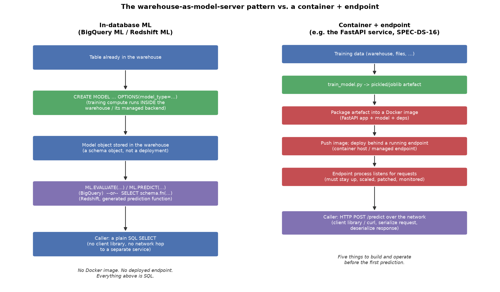

# In-Database ML: BigQuery ML & Redshift ML

*Data Science · Cloud Environment Setup · SPEC-DS-18*

You just finished wiring up a FastAPI service, a Dockerfile, and a deployed endpoint so a model can
answer `POST /predict` requests (`Data Science/Cloud Environment Setup/code/online_service/`,
SPEC-DS-16). That's the right shape when something needs a prediction in real time, on demand, for a
single row at a time — a checkout page deciding whether to flag a transaction, say.

But a lot of production ML isn't that. It's: "score every customer in the `customers` table for churn
risk, once a night, and write the scores back to a table the dashboard reads from." The data already
lives in a warehouse — BigQuery, Redshift, Snowflake. There's no request to answer in real time.
Nobody is waiting on a response. In that shape, standing up a container and an endpoint is pure
overhead: you'd export the data out of the warehouse, train somewhere else, package a model artefact,
deploy it, then call it over the network — just to write predictions into a table that was one SQL
hop away the whole time.

BigQuery ML and Redshift ML skip all of that. You train the model with a `CREATE MODEL` statement,
you score rows with a `SELECT`, and the only artefact you interact with is a schema object that lives
in the warehouse next to your tables. This chapter is grounded-conceptual: BigQuery and Redshift
don't run in this project's sandbox, so every SQL statement below is **reference syntax**, verified
against the official docs and reproduced exactly — not executed. No result rows or metric values are
invented anywhere in this chapter; where a statement's output is described, it's described in words
("a result set of metrics," "the original columns plus a predicted column"), never as a fabricated
number.

**Environment:** no Python execution against a live warehouse; the one runnable artefact in this
chapter is the comparison diagram below, generated with `matplotlib==3.11.1`
([source: NOTE-2-package-versions](../../research/NOTE-2-package-versions.md), checked 2026-09-02).

## 1. What & why: a SQL query that returns predictions

Think about what a Java engineer already does with a relational database: `SELECT` reads data,
`INSERT`/`UPDATE` writes it, and a stored procedure or a view can encapsulate logic so callers don't
need to know how it works internally — they just query it. In-database ML extends that same idea to
model training and inference:

- **Training** is a DDL-shaped statement — `CREATE MODEL` — that reads a training table and produces
  a new kind of schema object: a model, not a table.
- **Scoring** is a `SELECT` — `ML.PREDICT` in BigQuery, a generated SQL function in Redshift — that
  reads rows and returns predictions as another result set, exactly like any other query.
- **There is no separate serving process.** No container image, no deployed endpoint, no client
  library, no network hop to a service outside the warehouse. The warehouse *is* the model server.

The diagram below puts this side by side with the container + endpoint pattern from SPEC-DS-16, to
make the shape difference concrete before looking at the SQL:



*Left: in-database ML — every step is a SQL statement against the warehouse. Right: container +
endpoint — five separate things to build, deploy, and keep running before the first prediction. Both
paths reach the same destination (a model that answers predictions); they differ in how much
infrastructure sits between the data and the answer. Diagram generated by
`Data Science/Cloud Environment Setup/code/warehouse_ml_diagram.py`.*

**LO1 — when this is the right tool:**
- The data already lives in the warehouse (no export/import step needed to reach it).
- The workload is **batch scoring** — "score this table," not "answer this one HTTP request in under
  50ms." Warehouse query latency (seconds, sometimes longer for a big `SELECT`) is fine for batch;
  it's the wrong shape for a checkout-page real-time decision.
- You don't want to run or own any serving infrastructure — no container host, no autoscaling group,
  no endpoint to patch and monitor.
- The model type you need is one the warehouse actually supports (more on that in section 4 — this is
  the main limiting factor).

## 2. BigQuery ML

**Source:** [BigQuery ML introduction, Google Cloud docs](https://docs.cloud.google.com/bigquery/docs/bqml-introduction)
(checked 2026-08-15 to 2026-09-01, per
[NOTE-21-in-database-ml](../../research/NOTE-21-in-database-ml.md)).

### Train: `CREATE MODEL`

```sql
CREATE OR REPLACE MODEL `project.dataset.model_name`
OPTIONS(
  model_type='LINEAR_REG',
  input_label_cols=['target_column']
) AS
SELECT col1, col2, col3, target_column
FROM `project.dataset.table`
WHERE condition;
```

Read this the way you'd read a `CREATE VIEW` or `CREATE TABLE AS SELECT`: the `AS SELECT` supplies the
training data, `OPTIONS(...)` configures the algorithm, and `CREATE OR REPLACE` gives you the same
idempotent "run this again, it just works" semantics you'd want from a migration script.
`model_type='LINEAR_REG'` picks linear regression; `input_label_cols` names which selected column is
the label (`y`) — every other selected column becomes a feature.

`model_type` isn't limited to `LINEAR_REG`. Per NOTE-21, BigQuery ML supports three tiers of model:

- **Internally trained** (train fully inside BigQuery, no external service): `LINEAR_REG` (numeric
  prediction), `LOGISTIC_REG` (binary/multiclass classification, up to 50 classes), `KMEANS`
  (clustering), `MATRIX_FACTORIZATION` (recommendations), `PCA` (dimensionality reduction),
  `ARIMA_PLUS` / `ARIMA_PLUS_XREG` (time-series forecasting), `CONTRIBUTION_ANALYSIS` (dimensional
  metrics analysis).
- **Externally trained** (via Google's Agent Platform, still triggered from this same SQL): deep
  neural networks, Wide & Deep, autoencoders, boosted trees (XGBoost-based), random forest, AutoML.
- **Imported** models: a model you trained elsewhere in ONNX, TensorFlow (incl. TensorFlow Lite), or
  XGBoost format, pointed at from BigQuery so you can call `ML.PREDICT` on it without retraining.

### Evaluate: `ML.EVALUATE`

```sql
CALL BQ.ML.EVALUATE(MODEL `project.dataset.model_name`, (
  SELECT col1, col2, col3, target_column
  FROM `project.dataset.test_table`
));
```

This is the SQL-native equivalent of a scikit-learn `model.score(X_test, y_test)` call — hand it a
held-out table with the label column present, and it returns a result set of metrics appropriate to
the model type (for a regression model: things like mean absolute error, mean squared error, R²; for
a classifier: precision, recall, accuracy, F1 — the exact columns are documented per model type in the
Google Cloud docs linked above).

### Predict: `ML.PREDICT`

```sql
SELECT *
FROM ML.PREDICT(MODEL `project.dataset.model_name`, (
  SELECT col1, col2, col3
  FROM `project.dataset.new_data`
));
```

`ML.PREDICT` is a table-valued function: give it a model and a `SELECT` of feature rows (no label
column — that's what you're asking it to produce), and it returns a result set with the original
columns plus a `predicted_<label_col>` column. This is the statement you'd schedule nightly to score
an entire table — no different, operationally, from any other scheduled query.

**Training location:** inside BigQuery's own managed compute — there is no external cluster to
provision (NOTE-21).

## 3. Redshift ML

**Source:** [CREATE MODEL, Amazon Redshift Database Developer Guide](https://docs.aws.amazon.com/redshift/latest/dg/r_CREATE_MODEL.html)
(checked 2026-08-15 to 2026-09-01, per
[NOTE-21-in-database-ml](../../research/NOTE-21-in-database-ml.md)).

### Train: `CREATE MODEL`

```sql
CREATE MODEL model_schema.model_name
FROM { table_name | (SELECT ...) }
TARGET column_name
FUNCTION function_name(data_type [, ...])
IAM_ROLE default
AUTO ON
PROBLEM_TYPE BINARY_CLASSIFICATION
SETTINGS (
  S3_BUCKET 'amzn-s3-demo-bucket'
);
```

The shape is recognisable from BigQuery's version but the clauses map differently:

- `FROM` names the training table (or an inline `SELECT`) — same role as BigQuery's `AS SELECT`.
- `TARGET column_name` is the label column — same role as `input_label_cols`.
- `FUNCTION function_name(data_type, ...)` names the **prediction function Redshift will generate**
  for you once training finishes, and declares the SQL types of its input arguments. There's no
  equivalent declaration in BigQuery — `ML.PREDICT` is a single built-in function for every model;
  Redshift instead mints you a bespoke function per model.
- `IAM_ROLE default` and `SETTINGS (S3_BUCKET ...)` exist because, unlike BigQuery, Redshift ML
  doesn't train in-cluster — see "training location" below. The IAM role and S3 bucket are how
  Redshift is allowed to hand your training data to that external service and get a model back.
- `AUTO ON` tells Redshift to pick the algorithm, preprocessing, and hyperparameters for you. Turn it
  `OFF` and you must specify `MODEL_TYPE`, `PROBLEM_TYPE`, `PREPROCESSORS`, and `HYPERPARAMETERS`
  explicitly.
- `PROBLEM_TYPE` — one of `REGRESSION`, `BINARY_CLASSIFICATION`, `MULTICLASS_CLASSIFICATION`. If
  omitted with `AUTO ON`, Redshift infers it from the target column.

Per NOTE-21, the `MODEL_TYPE` clause (when you set `AUTO OFF` and choose explicitly) supports:
`XGBOOST` (gradient boosting), `MLP` (a small neural network), `LINEAR_LEARNER` (linear/logistic
regression), `KMEANS` (clustering), and `FORECAST` (time-series, needs additional `HORIZON` and
`FREQUENCY` parameters).

Two parameters worth knowing before you run this for real: `MAX_RUNTIME` caps training time in
seconds (default 5400 = 90 minutes), and `MAX_CELLS` caps training data size in rows × columns
(default 1,000,000) — both per NOTE-21. Blow past either and training stops or is rejected, not
something you'd expect the first time you point `CREATE MODEL` at a large table.

### Predict: the generated function

Training doesn't hand you back a generic `ML.PREDICT` — it creates the exact function you named in
`FUNCTION function_name(...)`, callable like any other SQL function:

```sql
SELECT model_schema.function_name(col1_value, col2_value, ...) AS prediction;
```

In practice that means selecting the function against a table of feature columns, one row in, one
prediction out — the same query shape as calling a scalar UDF over a table:

```sql
SELECT
  customer_id,
  model_schema.function_name(feature1, feature2, feature3) AS predicted_churn
FROM customers_to_score;
```

**Training location:** Amazon SageMaker. `CREATE MODEL` exports the training data to the S3 bucket
you named, and training happens **asynchronously** in SageMaker — the statement returns as soon as
the export starts, not when training finishes. You check progress via Redshift's system views rather
than waiting on the statement (NOTE-21). This is the one place the "it's just SQL" story has a seam:
the compute is not actually inside Redshift the way BigQuery ML's internal models train inside
BigQuery.

**A 2026 caveat worth flagging if you've used Redshift before:** Amazon is ending support for Redshift
Python UDFs after June 30, 2026. That doesn't affect `CREATE MODEL` — native SQL models are unaffected
and remain fully supported — but if you'd previously leaned on a Python UDF to call out to a model,
that path is closing; `CREATE MODEL` is the supported one going forward (NOTE-21).

## 4. Side-by-side, and the trade-offs vs. a container + endpoint

| | BigQuery ML | Redshift ML |
|---|---|---|
| **Train** | `CREATE [OR REPLACE] MODEL ... OPTIONS(model_type=...) AS SELECT ...` | `CREATE MODEL ... FROM ... TARGET ... FUNCTION ... PROBLEM_TYPE ... SETTINGS (S3_BUCKET ...)` |
| **Evaluate** | `CALL BQ.ML.EVALUATE(MODEL ..., (SELECT ...))` | Via SageMaker-reported metrics, or manual queries comparing predictions to actuals |
| **Predict** | `SELECT * FROM ML.PREDICT(MODEL ..., (SELECT ...))` — one built-in function for every model | `SELECT schema.function_name(...)` — a bespoke function generated per model |
| **Model types** | 10+ built-in, plus external (DNN, XGBoost, random forest, AutoML) and imported (ONNX, TensorFlow, XGBoost) | 5 native: `XGBOOST`, `MLP`, `LINEAR_LEARNER`, `KMEANS`, `FORECAST` |
| **Where training runs** | Inside BigQuery's managed compute | Amazon SageMaker (async — data exported to S3 first) |
| **Training call returns** | When training completes | Immediately, once the S3 export starts; training continues in the background |

(Table content per [NOTE-21-in-database-ml](../../research/NOTE-21-in-database-ml.md), grounded from
the two official docs cited in sections 2 and 3.)

**LO4 — against a container + endpoint (SPEC-DS-16's pattern):**

| | In-database ML | Container + endpoint |
|---|---|---|
| **Infra to build** | None — SQL against an existing warehouse | Dockerfile, image registry, deployed endpoint, health checks |
| **Model types available** | Limited to what the warehouse supports (table above) | Anything you can pickle/serialize and load in your serving code |
| **Latency shape** | Query latency — fine for batch, wrong for a real-time single-row decision | Can be tuned for low, predictable per-request latency |
| **Where the data must live** | In the warehouse (or reachable via a federated query / ETL step) | Anywhere — the service fetches or receives features however you wire it |
| **Portability** | Locked to that warehouse's SQL dialect and model catalogue | Portable — the same container runs on any host that can run Docker |
| **Cost shape** | Warehouse compute pricing (can surprise you on large/AUTO-tuned training runs) | Compute you provision and pay for whether or not it's serving traffic (or pay-per-invocation on a managed endpoint) |
| **Ops burden** | None beyond normal warehouse admin | You own uptime, scaling, patching, monitoring of the serving process |

The honest framing for a SQL-fluent backend engineer: if your model type is on the warehouse's
supported list, your data is already there, and the consumer can tolerate query latency, in-database
ML gets you to production with **zero new infrastructure** — a `CREATE MODEL` and a scheduled `SELECT`
where you'd otherwise need a Dockerfile, a registry, and a running endpoint. The moment any of those
three conditions breaks — you need a model type neither warehouse supports, the data isn't in the
warehouse, or something needs a sub-second answer to a single request — you're back to the
container + endpoint pattern, and that's fine; it's the right tool for that job (see SPEC-DS-16).

## 5. Pitfalls

- **The model catalogue is the real constraint.** Redshift ML's native list is five model families;
  BigQuery ML's built-in list is longer but still a fixed menu (section 2/3 above) — not "any
  scikit-learn estimator." If your use case needs something outside that menu, in-database ML isn't
  an option without going through an imported/external model path (BigQuery) or accepting you're
  really just calling SageMaker from SQL (Redshift).
- **Training cost surprises.** Redshift ML's `AUTO ON` implicitly runs a SageMaker training job you
  don't directly control the size or duration of (bounded by `MAX_RUNTIME` / `MAX_CELLS`, but those
  defaults — 90 minutes, 1,000,000 cells — are easy to hit without meaning to on a real table); BigQuery
  ML's external/AutoML model types likewise cost more than the internal ones. Know which tier of model
  you asked for before you run `CREATE MODEL` against a large table.
- **Warehouse lock-in.** The SQL, the model catalogue, and the way predictions are called are specific
  to BigQuery or Redshift respectively — nothing here is portable to the other warehouse, let alone
  off SQL entirely. Compare that to the container pattern, where the same Docker image is portable
  across hosts.
- **Redshift's `CREATE MODEL` looks synchronous and isn't.** The statement returns once the S3 export
  starts, not when the model is trained. Treat it like kicking off a background job, not like a normal
  DDL statement that's done when it returns — check the system views for actual training status before
  assuming the prediction function is ready to call.
- **No built-in model registry.** Neither platform has a native equivalent to a model registry (like
  MLflow — SPEC-DS-12). `CREATE OR REPLACE MODEL` overwrites in place; if you need version history,
  you're naming models manually (e.g. appending a timestamp) and tracking that convention yourself.
- **Feature engineering is limited to what SQL can express** inside the warehouse (`CASE` statements,
  UDFs, basic transforms). Anything beyond that — say, generating embeddings — needs preprocessing
  outside the warehouse before the data lands in the training table.

## Recap & what's next

In-database ML trades model flexibility for zero serving infrastructure: `CREATE MODEL` trains against
a table already in the warehouse, `ML.EVALUATE`/`ML.PREDICT` (BigQuery) or a generated function
(Redshift) score it, and the entire round trip is SQL — no container, no endpoint, no client library.
It's the right call when the data's already in the warehouse, the workload is batch, and the model
type you need is on the warehouse's supported list; reach for the container + endpoint pattern from
SPEC-DS-16 the moment any of those three stop being true.

This closes out the Cloud Environment Setup / Production Considerations arc of the Data Science track:
you've now seen the three ways a model reaches production covered in this course — a managed ML
platform training job (SPEC-DS-15), a batch or online serving deployment (SPEC-DS-16), and, here, no
deployment at all. Pair this with SPEC-DS-17's monitoring/drift chapter for what happens *after* any
of these three ships: a model in a warehouse table still drifts exactly like a model behind an
endpoint does, and the same champion/challenger promotion discipline applies to a `CREATE OR REPLACE
MODEL` as it does to redeploying a container.
