# Network Architectures — Matching the Tool to the Data's Shape

*Machine Learning · Theory · SPEC-ML-2*

## A cat, a screen, and a Nobel Prize

In 1959, at Johns Hopkins, David Hubel and Torsten Wiesel had a microelectrode sitting inside a
single neuron in a cat's visual cortex, and a projector throwing shapes onto a screen in front of
the animal. They tried dot after dot, spot after spot. Nothing. The neuron stayed silent. Then,
while they were sliding a glass slide out of the projector to change it, its straight edge swept
across the screen — and the neuron fired.

That accident turned into a research program: individual neurons in the visual cortex, it turned
out, don't respond to "light" in general. Each one fires for a bar or edge at one specific
orientation — a cell tuned to 30° stays quiet for a 90° edge — and different neurons are tuned to
different angles, tiled across the whole visual field. In 1981, Hubel and Wiesel shared the Nobel
Prize in Physiology or Medicine (with Roger Sperry) "for their discoveries concerning information
processing in the visual system"
([source: The Nobel Prize in Physiology or Medicine 1981, official citation, nobelprize.org](https://www.nobelprize.org/prizes/medicine/1981/summary/)
(checked 2026-09-03); orientation-selective "simple cells" and position-invariant "complex cells"
per
[source: Hubel & Wiesel's visual feature detectors, summarized from their Nobel-cited work](https://en.wikipedia.org/wiki/David_H._Hubel)
(checked 2026-09-03)).

Here's the one-sentence version you could repeat at dinner: **the brain doesn't look at a whole
scene at once — it tiles the visual field with small, local edge-detectors, each tuned to one
pattern, and builds everything else on top of that.** That is, mechanically, what a convolutional
neural network does in software: a small filter, applied at every position, hunting for one
pattern. Before this chapter shows a network *learning* filters like that, build one by hand —
watching real numbers move is worth more than reading the definition.

## What & why

In Java, picking a data structure is half the design: a `HashMap` for lookups, a `TreeMap` for
ordered traversal, an `ArrayDeque` for a queue. Pick wrong and the code still compiles — it's just
slow, or awkward, or wrong in ways that only show up under load. Neural-network architectures are
the same kind of decision, one level up: **the "data structure" you pick has to match the shape of
the data you're feeding it.**

[ML-1: Neural Network Fundamentals](01-neural-network-fundamentals.md) built the base unit — a neuron,
a dense (fully connected) layer, gradient descent, backprop. A dense layer treats its input as one
flat, unordered vector of numbers. That's a fine default, but it throws away structure that's often
the whole point:

- A **grid** (an image's pixels, a spectrogram) has 2D locality — a pixel's neighbours matter more
  than a pixel on the other side of the image, exactly the kind of local pattern Hubel and Wiesel's
  cortical cells were tuned to. A dense layer doesn't know that; it happily connects every pixel to
  every other pixel from scratch.
- A **sequence** (a sentence, a time series) has order — swapping two words changes the meaning. A
  dense layer has no notion of "before" and "after."
- Some problems need a **compressed representation** of the input, not a label. Some need to turn
  **one sequence into a different sequence** (translate a sentence, summarize a document).

This chapter is the map: four families of architecture, one paragraph each on *what problem shape
they solve*, then enough of the mechanism to reason about them — diagrams over derivations, per this
chapter's scope. The CNN section builds convolution from scratch, by hand, on real numbers, the way
the deck this chapter is based on does it; the runnable worked example is a hand-set 2D convolution,
because seeing a filter slide over an image and light up its edges says more than three paragraphs
about "spatial feature extraction."

## 1. The key decision — match architecture to data shape

Before opening a deep-learning framework, ask: **what shape is my data, and what shape is my
output?** That single question narrows the field to one or two candidates almost every time.

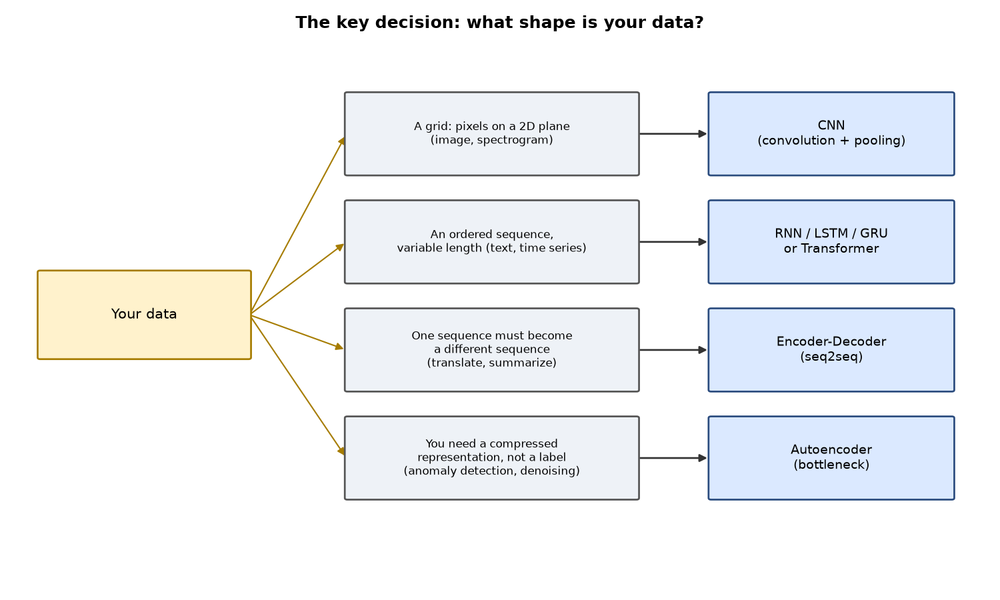

*Figure 1 — the decision this chapter teaches you to make. Reproduced by
[`conv_demo.py`](code/conv_demo.py), function `figure_data_shape_map`.*

| Data shape | Architecture | Section |
|---|---|---|
| A grid — pixels on a 2D plane | **CNN** (convolution + pooling) | §2 |
| An ordered, variable-length sequence | **RNN / LSTM / GRU**, or a **Transformer** | §3, §4 |
| One sequence must become a different sequence | **Encoder-decoder** (seq2seq) | §5 |
| You need a compressed representation, not a label | **Autoencoder** (bottleneck) | §5 |

Keep this table in view for the rest of the chapter — every section below is one row of it, expanded.

## 2. CNNs — building convolution from first principles

**What problem shape it solves:** your input is a grid with local structure (an image, most
commonly), and the same visual feature — an edge, a corner, a texture — can appear anywhere in that
grid. You want a layer that (a) looks at small local neighbourhoods, not the whole image at once, and
(b) reuses the same feature detector at every position instead of learning a separate one for each
pixel. Build it in five steps, each on real numbers before any general formula.

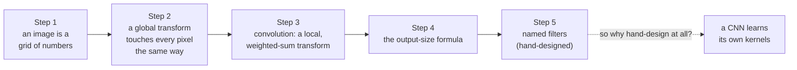

### Step 1 — an image is just a grid of numbers

A grayscale image, to a computer, is nothing more than a 2D array — one number per pixel, brighter
means a bigger number. Here's a tiny 4x4 stand-in, small enough to read by eye:

```python
import numpy as np

# A tiny 4x4 "image": in a computer, a grayscale image is nothing more than
# a 2D grid of numbers -- each number is one pixel's brightness. conv_demo.py's
# real sample image is 40x40 floats in [0, 1]; this is the same idea, shrunk
# down to numbers you can read by eye.
patch = np.array([
    [ 13,  99,  40,   5],
    [ 14,  42,  88,  60],
    [200,  10,  75,  33],
    [ 30, 150,  20,   9],
])
print(patch)
```

```text
[[ 13  99  40   5]
 [ 14  42  88  60]
 [200  10  75  33]
 [ 30 150  20   9]]
```

### Step 2 — a global transform touches every pixel the same way

Before convolution, it's worth naming the simpler kind of image operation, because convolution is
defined by *not* being this: a **global pixel transform** applies one fixed rule to every pixel,
independently, with no regard for its neighbours. Brightness and contrast are the classic examples —
add a constant to brighten, multiply by a constant to boost contrast:

```python
brighter = patch + 20        # brightness: shift every pixel by the same constant
higher_contrast = patch * 1.5  # contrast: scale every pixel by the same constant
```

```text
brighter  (every pixel + 20):
[[ 33 119  60  25]
 [ 34  62 108  80]
 [220  30  95  53]
 [ 50 170  40  29]]
higher contrast (every pixel x 1.5):
[[ 20 148  60   8]
 [ 21  63 132  90]
 [300  15 112  50]
 [ 45 225  30  14]]
```

(A real 8-bit image would clip these to `[0, 255]`; skipped here since this is a numeric
illustration, not a stored image.) Notice what's missing: pixel `(1, 1) = 42` never once looked at
its neighbours `99`, `14`, or `88` to decide its new value. That's exactly the gap convolution
fills.

### Step 3 — convolution is a *local*, weighted-sum transform

A **convolution** does look at neighbours: slide a small matrix of numbers — a **kernel** or
**filter** — across the image, and at *each* position compute one number: the sum of the kernel's
weights multiplied by the pixels currently underneath it. Try it on the top-left 2x2 corner of
`patch` with a simple kernel that only keeps the diagonal:

```python
window = patch[0:2, 0:2]      # the top-left 2x2 corner: [[13, 99], [14, 42]]
kernel = np.array([[1, 0],
                    [0, 1]])  # keep the diagonal, ignore the off-diagonal
convolved_value = (window * kernel).sum()
```

```text
image window:
[[13 99]
 [14 42]]
kernel:
[[1 0]
 [0 1]]
elementwise products: [[13, 0], [0, 42]]
sum -> 55
```

$$13\times1 + 99\times0 + 14\times0 + 42\times1 = 55$$

`55` is one number in the output **feature map** — "how strongly did this filter fire at this
position." Slide the same 2x2 kernel one column right, recompute, slide it down a row, recompute,
and so on across the whole image — that's the whole algorithm. Two things fall out of that
description, and they're the whole reason CNNs exist for images:

- **Local connectivity** — each output value depends only on a small local patch of the input (the
  kernel's **receptive field**), not the entire image, the way a dense layer's output would.
- **Weight sharing** — the *same* handful of numbers (4, in this toy example; 9 for a 3x3 kernel) are
  reused at *every* position in the image. If a filter learns to detect a vertical edge, it detects
  vertical edges everywhere, not just in the top-left corner. This is also what gives CNNs
  (approximate) **translation invariance**: shift the input a few pixels, and the same features
  still get detected.
  [source: local receptive fields & weight sharing](https://medium.com/@nerdjock/convolutional-neural-network-lesson-3-local-receptive-fields-and-weight-sharing-eb7af42343ff)
  (checked 2026-09-02); NOTE-ML-3 evidence #1.

Weight sharing is also a massive parameter-count win over a dense layer connecting the same input to
an output of the same size — see the worked example below for the actual numbers on our sample
image.

### Step 4 — how big is the output?

Slide a kernel across an image and the output is usually a *little smaller* than the input, unless
you compensate. Three knobs control the exact size:

- **stride** ($S$) — how many pixels the kernel jumps between positions (1 = check every position;
  2 = skip every other one, halving the output).
- **padding** ($P$) — how many extra rows/columns of (usually zero) pixels to add around the border,
  so edge pixels get a fair number of windows passing over them too.
- **kernel size** ($K$) — how wide the sliding window is.

Given an input of width $W$, the output width is:

$$\text{output size} = \frac{W - K + 2P}{S} + 1$$

([source: CS231n, "Convolutional Neural Networks," Stanford — spatial output-size formula](https://cs231n.github.io/convolutional-networks/)
(checked 2026-09-03)). Read it as: "how many times does the kernel fit, once you've padded the
input and account for how far it jumps each step." Plug in this chapter's own sample image — 40x40,
with the 3x3 Sobel kernels used below:

```python
def output_size(w: int, k: int, p: int, s: int) -> int:
    return (w - k + 2 * p) // s + 1


valid_output = output_size(w=40, k=3, p=0, s=1)   # no padding: shrinks
same_output = output_size(w=40, k=3, p=1, s=1)    # padding 1: stays 40x40
```

```text
valid (no padding, stride 1):  (40 - 3 + 2*0)//1 + 1 = 38
same  (padding 1, stride 1):   (40 - 3 + 2*1)//1 + 1 = 40
```

Without padding ("valid" convolution) a 40x40 image shrinks to 38x38 under a 3x3 kernel; with 1
pixel of padding on every side ("same" convolution) it stays 40x40. The worked example below uses
`scipy.signal.convolve2d(..., mode="same")` — this is precisely why: it keeps the feature map the
same size as the input, which is what `conv_demo.py` relies on to plot the before/after images
side by side.

### Step 5 — named filters: patterns humans already worked out by hand

Long before neural networks, image processing built up a small library of hand-designed kernels,
each tuned to one specific pattern — precisely the "one neuron, one orientation" idea from the cold
open, just designed by a person instead of grown by evolution or backprop:

| Filter | Kernel (3x3) | What it detects |
|---|---|---|
| Mean blur | $\frac{1}{9}\begin{bmatrix}1&1&1\\1&1&1\\1&1&1\end{bmatrix}$ | smooths noise by averaging each pixel with its neighbours |
| Sobel (X or Y) | $\begin{bmatrix}-1&0&1\\-2&0&2\\-1&0&1\end{bmatrix}$ | edges in one direction (used in the worked example below) |
| Laplacian | $\begin{bmatrix}0&1&0\\1&-4&1\\0&1&0\end{bmatrix}$ | edges in *every* direction at once (a second derivative) |

```python
MEAN_BLUR = np.ones((3, 3)) / 9.0
LAPLACIAN = np.array([
    [0.0,  1.0,  0.0],
    [1.0, -4.0,  1.0],
    [0.0,  1.0,  0.0],
])
```

```text
mean blur kernel (each cell 1/9):
[[0.111 0.111 0.111]
 [0.111 0.111 0.111]
 [0.111 0.111 0.111]]
Laplacian kernel:
[[ 0.  1.  0.]
 [ 1. -4.  1.]
 [ 0.  1.  0.]]
Laplacian weights sum to 0.0 -- a flat region convolves to ~0, only changes (edges) survive
```

(Laplacian kernel and its role as a second-derivative, all-direction edge detector per
[source: "Discrete Laplace operator," Image Processing section, Wikipedia](https://en.wikipedia.org/wiki/Discrete_Laplace_operator)
(checked 2026-09-03) — confirms this exact 3x3 kernel and its use as an edge filter.) Notice the Laplacian's weights sum to zero: over a flat, unchanging patch of
image, the weighted sum cancels out to roughly nothing — it only lights up where the *values*
change, which is exactly what "detecting an edge" means numerically.

**So why hand-design filters at all?** For decades, that's exactly what computer vision did — build
a library of kernels like these three, pick the ones relevant to your problem, apply them by hand.
It works, but it doesn't scale: nobody can hand-design every useful pattern for every possible
task. Hubel and Wiesel's Nobel-winning finding is the hint a CNN takes literally: the visual cortex
doesn't get its edge detectors handed down by a designer either — evolution and early visual
experience tune them. A **convolution layer** in a neural network keeps the exact mechanism from
Step 3 (slide a small matrix, multiply-and-sum) but *initializes the kernel's numbers randomly and
learns them by gradient descent*, the same backprop machinery [ML-1] built. Instead of one
Sobel-style edge detector you designed, a real conv layer typically learns dozens of small filters
in parallel — edge detectors, corner detectors, and combinations no human would think to hand-code —
producing a stack of feature maps, one per filter.

**Pooling** (most commonly **max-pooling**) is a fixed, unlearned downsampling step usually applied
after a conv layer: slide a small window (2x2 is typical) over a feature map and keep only the
strongest value in each window, halving the height and width. It has no weights of its own — it's a
deliberate resolution reduction, not a filter (NOTE-ML-3 caveats). It buys two things: fewer numbers
to carry into the next layer, and a bit more translation tolerance (a feature that moved one pixel
still survives the pool).

### Worked example — a hand-set edge-detect kernel

The full script is [`code/conv_demo.py`](code/conv_demo.py). It builds a small 40x40 synthetic
grayscale image (a filled square plus a diagonal bar, with a touch of seeded noise), hand-sets two
classic **Sobel** edge-detect kernels — one for vertical edges, one for horizontal — and convolves
each over the image with `scipy.signal.convolve2d` (NOTE-ML-3 evidence #6;
[source: scipy.signal.convolve2d docs](https://docs.scipy.org/doc/scipy/reference/generated/scipy.signal.convolve2d.html)
(checked 2026-09-02), confirmed against the scipy 1.18.1 installed in this project's `.venv-ml`).
Note that these kernel weights are *hand-set*, not learned — exactly the point made in Step 5: a real
CNN starts from random weights and *learns* kernels like these via backprop, but the mechanics of
"slide a small matrix, multiply-and-sum" are identical either way.

```python
import numpy as np
from scipy.signal import convolve2d

# Classic Sobel edge-detect kernels — a fixed 3x3 array of numbers we choose
# ourselves. This is what "hand-set kernel" means: no training involved.
SOBEL_X = np.array(
    [[-1.0, 0.0, 1.0],
     [-2.0, 0.0, 2.0],
     [-1.0, 0.0, 1.0]]
)
SOBEL_Y = SOBEL_X.T  # the same filter, rotated 90 degrees: horizontal edges instead of vertical


def apply_filter(image: np.ndarray, kernel: np.ndarray) -> np.ndarray:
    """Hand-set 2D convolution via scipy.signal.convolve2d.

    mode="same" keeps the output the same H x W as the input (NOTE-ML-3 #6).
    boundary="symm" mirrors pixels at the border instead of the default
    zero-padding, so the image edge doesn't read as a fake, artificially
    strong feature.
    """
    return convolve2d(image, kernel, mode="same", boundary="symm")
```

Running the script produces the before/after images:

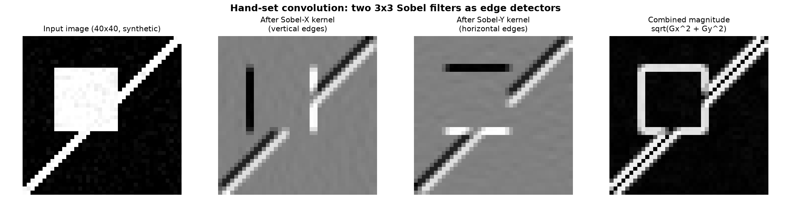

*Figure 2 — the same 40x40 image after each hand-set kernel. The vertical-edge kernel (Sobel-X)
lights up the square's left/right sides and misses its top/bottom; the horizontal-edge kernel
(Sobel-Y) does the opposite. `sqrt(Gx^2 + Gy^2)` combines both into one "edge strength" map — this is
exactly what stacking multiple learned filters into multiple feature maps buys a real CNN: different
filters detecting different things, combined downstream.*

Then a 2x2 max-pool halves the resolution of the combined feature map:

```python
def max_pool2x2(feature_map: np.ndarray) -> np.ndarray:
    """A stride-2, 2x2 max-pool: keep the strongest response in each 2x2
    block, halving height and width. Unlike a conv filter, pooling has no
    learned (or even hand-set) weights — it's a fixed downsampling rule.
    """
    h, w = feature_map.shape
    h2, w2 = h - h % 2, w - w % 2
    trimmed = feature_map[:h2, :w2]
    blocks = trimmed.reshape(h2 // 2, 2, w2 // 2, 2)
    return blocks.max(axis=(1, 3))
```

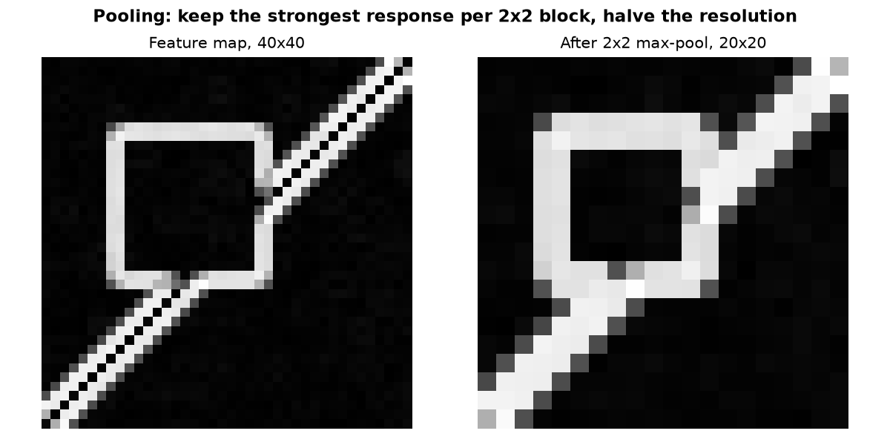

*Figure 3 — the edge map before and after 2x2 max-pooling: half the resolution, same shapes still
clearly visible, because pooling keeps the strongest ("most confident") response per block.*

**The parameter-count argument, in real numbers.** The script also prints a direct comparison: for
this 40x40 image, a dense layer connecting every input pixel to every output pixel would need
`1600 x 1600 = 2,560,000` weights. The 3x3 Sobel kernel needs **9** weights, reused at all 1,600
positions — a **~284,000x** reduction, for this image size:

```console
[params] 40x40 image -> 40x40 feature map
[params] fully-connected (dense) layer: 1600 x 1600 = 2,560,000 weights
[params] 3x3 conv filter, weight-shared:  9 weights
[params] dense uses 284,444x more weights than the shared conv filter
```

That ratio only grows with image size — a 224x224 image (a typical CNN input) would need over
2.5 *billion* dense weights for the same one-output-per-pixel mapping. Weight sharing isn't a minor
optimisation; for image-shaped data it's the difference between trainable and not.

To reproduce all of the above yourself:

```console
.venv-ml/Scripts/python.exe "Machine Learning/Theory/code/conv_demo.py"
```

### From nine hand-picked numbers to a hundred learned layers

Sobel's 9 numbers were picked by a person in the 1960s. Once CNNs could learn their own kernels
from data, the field spent the next two decades pushing on one question: *what's the best way to
stack, connect, and scale layers of learned filters?* Each landmark below answers that question a
different way, and each one is still a direct descendant of the "slide a kernel, multiply-and-sum"
mechanism from Step 3:

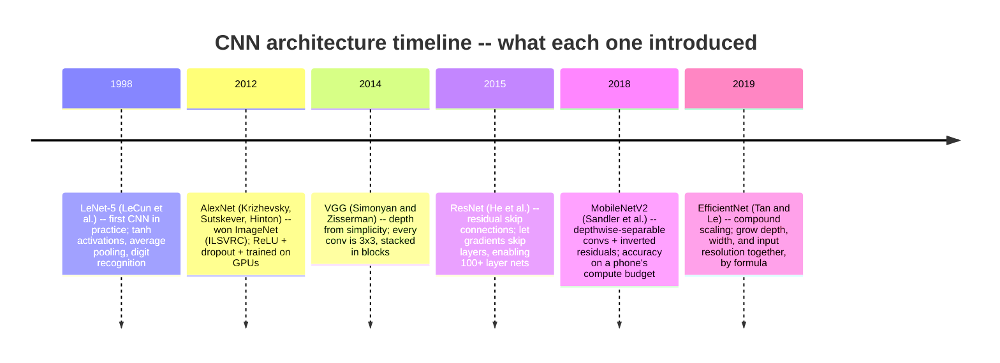

Grounded per source, each checked 2026-09-03:
[LeNet-5 architecture (LeCun et al., 1998)](https://medium.com/@dbhatt245/a-deep-dive-into-yann-lecuns-1998-cnn-paper-explained-simply-with-examples-ff88c26f1154);
[AlexNet (Krizhevsky, Sutskever & Hinton, NIPS 2012 — the conference now called NeurIPS) — ReLU, dropout, dual-GPU training, ImageNet win](https://medium.com/@atkarhitesh/a-timeline-of-cnn-architectures-how-cnns-have-transformed-image-recognition-80961e54a49b);
["Very Deep Convolutional Networks for Large-Scale Image Recognition" (Simonyan & Zisserman, arXiv:1409.1556, 2014; presented ICLR 2015)](https://arxiv.org/abs/1409.1556) —
stacked 3x3 convolutions instead of larger filters;
["Deep Residual Learning for Image Recognition" (He, Zhang, Ren & Sun, arXiv:1512.03385, 2015)](https://arxiv.org/abs/1512.03385) —
residual/skip connections, up to 152 layers, ILSVRC 2015 winner;
["MobileNetV2: Inverted Residuals and Linear Bottlenecks" (Sandler, Howard, Zhu, Zhmoginov & Chen, arXiv:1801.04381, 2018; CVPR 2018)](https://arxiv.org/abs/1801.04381) —
inverted-residual blocks built from depthwise-separable convolutions, for mobile compute budgets;
["EfficientNet: Rethinking Model Scaling for Convolutional Neural Networks" (Tan & Le, PMLR v97 / ICML 2019)](https://proceedings.mlr.press/v97/tan19a.html) —
a single compound coefficient scales depth, width, and resolution together.

Two threads worth pulling out of that timeline, because they generalize past CNNs:

- **LeNet-5 -> AlexNet -> VGG** is a story of "the same mechanism, scaled up" — more layers, more
  learned filters, faster hardware (GPUs) — using the exact 3x3-kernel slide-and-sum from Step 3
  throughout.
- **ResNet's skip connections** solve a problem that should sound familiar: stack enough plain
  conv layers and gradients vanish on the way back down, the *exact* mechanism §3 below describes
  for RNNs (repeated multiplication by a small derivative shrinking the signal) — just across
  *depth* instead of *time*. A skip connection adds an unmodified copy of a layer's input to its
  output, giving the gradient an *additive* path back through the network — the same fix LSTM's
  cell state uses for time, applied to depth.

The timeline treats each landmark as a black box — "ResNet has skip connections," "Inception has
1x1 bottlenecks" — but that skips a question any engineer would ask next: concretely, how does one
conv layer's output *become* the next layer's input, and what are those 1x1 convolutions and the
"global average pool" littering every modern architecture diagram actually computing? Four pieces
close that gap, still all built from the sliding-kernel mechanism in Step 3.

### Channels — how one conv layer connects to the next

Steps 1–5 convolved a single grayscale image (one channel) with a single hand-set kernel. Real
images have 3 channels (red, green, blue), and a real network stacks dozens of conv layers, each
producing dozens of feature maps for the next one to consume. So what actually flows from layer
`L-1` into layer `L`, and how does a kernel handle more than one channel to begin with?

**The kernel picks up a third dimension.** A conv layer with `C_in` input channels and `C_out`
output filters doesn't use `C_out` separate 2D kernels — it uses `C_out` separate *3D* kernels,
each of shape `(C_in, kH, kW)`. Stack all `C_out` of them and the layer's full weight tensor has
shape `(C_out, C_in, kH, kW)` — this is PyTorch's own `nn.Conv2d` convention
([source: `torch.nn.Conv2d`, "Variables" section — the `weight` attribute has shape
`(out_channels, in_channels / groups, kernel_size[0], kernel_size[1])`, which is
`(out_channels, in_channels, kH, kW)` at the default `groups=1`](https://docs.pytorch.org/docs/stable/generated/torch.nn.Conv2d.html)
(checked 2026-09-03)). Each output filter slides across the image exactly as in Step 3, but at
every position it multiplies-and-sums across *all* `C_in` channels at once, collapsing them into a
**single** output number — one filter, however many input channels it started with, always produces
one feature map. Stack `C_out` such filters side by side and you get `C_out` feature maps: the next
layer's channels.

Real numbers, following an RGB image through two conv layers:

```python
def conv_params(c_out: int, c_in: int, kh: int, kw: int, bias: bool = True) -> int:
    """Total learnable weights in a conv layer with weight shape
    (c_out, c_in, kh, kw) -- PyTorch's nn.Conv2d convention -- plus one bias
    per output filter (NOTE: PyTorch docs, "Variables" section, checked 2026-09-03).
    """
    weights = c_out * c_in * kh * kw
    biases = c_out if bias else 0
    return weights + biases


conv1_params = conv_params(c_out=16, c_in=3, kh=3, kw=3)   # RGB in (3 channels), 16 filters out
conv2_params = conv_params(c_out=32, c_in=16, kh=3, kw=3)  # 16 in, 32 filters out
```

```text
conv1: weight shape (16, 3, 3, 3) -> 16*3*3*3 = 432 weights, +16 bias = 448 params
conv2: weight shape (32, 16, 3, 3) -> 32*16*3*3 = 4,608 weights, +32 bias = 4,640 params
total for both layers: 5,088 params
```

Notice `conv2`'s kernel is `(32, 16, 3, 3)`, not `(32, 3, 3, 3)` — its `C_in` has to match `conv1`'s
`C_out` (`16`), not the original image's 3 channels, because `conv2` never sees the raw image, only
`conv1`'s 16 feature maps.

**Why we do it this way — the Java analogy.** In Java, a method's return type has to match the next
method's parameter type or `javac` refuses to compile the chain — plug a method returning `List<Foo>`
into one expecting `List<Bar>` and you find out before a single test runs. A conv stack's channel
counts are the same contract: layer `L`'s `C_out` **must** equal layer `L+1`'s `C_in`, or the shapes
don't compose. Channels are the "width" of the tensor type flowing between layers, the same role a
generic type parameter plays in a builder chain. Where this genuinely differs from Java: PyTorch
won't catch a channel mismatch at "compile" time the way `javac` would — you only find out when the
forward pass actually runs and a matrix-multiply throws a shape error. There is no static type
checker for tensor shapes; get in the habit of printing `.shape` after each layer while debugging,
the way you'd read a stack trace.

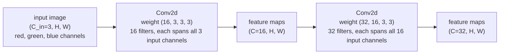

*Figure — tensor shapes flowing layer to layer. Each conv layer's `C_out` becomes the next layer's
`C_in`; only the channel dimension needs to line up, `H` and `W` can shrink or stay fixed per the
Step 4 output-size formula independently of channel count.*

### Receptive field — why stacking small kernels beats one big one

With channels sorted, the next question: how much of the *original input image* does a neuron three
layers deep actually "see"? A layer-1 neuron's answer is easy — exactly the `3x3` patch under its
kernel, per Step 3. Is a layer-3 neuron still limited to a `3x3` patch too?

No — its **receptive field** (the region of the *original* input that can influence one output
value) grows with depth, because a layer-2 neuron's own `3x3` window is built from layer-1 *outputs*,
each of which already summarized its own `3x3` patch of the raw image. Stack `L` layers of `K x K`
kernels (stride 1, no pooling) and the receptive field grows by `(K-1)` pixels per layer:

$$\text{RF}_L = \text{RF}_{L-1} + (K-1)$$

```python
def receptive_field_growth(n_layers: int, kernel_size: int = 3, stride: int = 1) -> list[int]:
    """Receptive field after each of n_layers stacked conv layers, stride 1:
    RF_L = RF_{L-1} + (K - 1). Starts at RF_0 = 1 (a single input pixel).
    """
    rf = 1
    sizes = []
    for _ in range(n_layers):
        rf = rf + (kernel_size - 1) * stride
        sizes.append(rf)
    return sizes


rf_per_layer = receptive_field_growth(n_layers=3, kernel_size=3)

# Compare params: three stacked 3x3 layers vs one 7x7 layer, same 64->64 channels,
# same resulting 7x7 receptive field.
c = 64
three_3x3_weights = 3 * conv_params(c_out=c, c_in=c, kh=3, kw=3, bias=False)
one_7x7_weights = conv_params(c_out=c, c_in=c, kh=7, kw=7, bias=False)
```

```text
receptive field after layer 1, 2, 3 (each a 3x3 conv, stride 1): [3, 5, 7]
three stacked 3x3 convs, 64->64 channels each: 3 x (64*64*3*3) = 110,592 weights
one 7x7 conv, 64->64 channels:                     64*64*7*7 = 200,704 weights
the single 7x7 conv uses ~1.8x the weights of three stacked 3x3s -- for the same 7x7 receptive field
```

**Why stacking small kernels wins.** Three `3x3` layers reach the *same* `7x7` receptive field as
one `7x7` layer for roughly half the weights — and, just as important, three layers means three
ReLU nonlinearities stacked in the path instead of one, so the network gets three chances to bend
its decision boundary where one big kernel gives it only one. This is precisely the argument VGG
made for building deep networks entirely out of `3x3` convolutions
([source: "Very Deep Convolutional Networks for Large-Scale Image Recognition" (Simonyan &
Zisserman, arXiv:1409.1556, 2014)](https://arxiv.org/abs/1409.1556) (checked 2026-09-03) — stacked
`3x3` convolutions reach the receptive field of a larger filter with fewer parameters and more
non-linearity), already named in the timeline above.

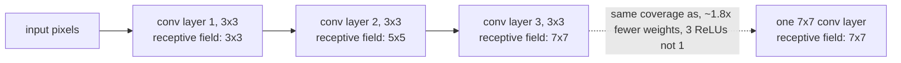

*Figure — three stacked `3x3` layers reach the same `7x7` receptive field as one `7x7` layer, for
fewer parameters and more nonlinearity.*

### Global Average Pooling — trading a huge dense head for zero parameters

Suppose several conv+pool stages have left you with a stack of feature maps — say `(C=512, H=7,
W=7)`, the shape VGG16 produces from a `224x224` input after five pooling stages — and the next step
is turning that into class scores. The obvious move, following Steps 1–5's logic, is to flatten
everything into one long vector and put a dense (fully connected) layer on top, the way [ML-1]'s
dense layers work. Try it, in real numbers:

```python
c, h, w = 512, 7, 7
flattened_length = c * h * w  # what "flatten" turns the feature maps into

dense_weights = flattened_length * 4096      # every flattened number -> every one of 4096 units
dense_bias = 4096
dense_first_layer_params = dense_weights + dense_bias
```

```text
final feature maps: (C=512, H=7, W=7) -> flatten -> 25,088-length vector
dense head, FIRST FC layer alone: 25,088 x 4,096 = 102,760,448 weights (+4,096 bias) = 102,764,544 params
```

That's **over 100 million** parameters for one layer — VGG16's own architecture puts nearly 120
million of its ~138 million total parameters in exactly this kind of dense head
([source: VGG16 architecture — 7x7x512 final feature volume flattened to 25,088, feeding
4096-unit fully connected layers](https://builtin.com/machine-learning/vgg16) (checked 2026-09-03);
network shape confirmed against
["Very Deep Convolutional Networks for Large-Scale Image Recognition" (Simonyan & Zisserman,
arXiv:1409.1556, 2014)](https://arxiv.org/abs/1409.1556) (checked 2026-09-03)). Worse, that dense
layer's weight count is *locked* to `25,088` — feed the network a differently-sized image and the
flattened length changes, and the dense layer's weights no longer fit.

**Global Average Pooling (GAP)** fixes both problems at once: instead of flattening, average *every*
`H x W` feature map down to a single number, one average per channel. `(C, H, W)` becomes `(C,)` — a
`C`-length vector — with **no learned weights at all**, and it works for *any* `H, W`, because an
average doesn't care how many numbers went into it.

```python
gap_vector_length = c          # GAP: average(H, W) -> one number, per channel -- 0 learned weights
num_classes = 1000
gap_head_weights = c * num_classes       # the C -> num_classes linear layer that follows GAP
gap_head_bias = num_classes
gap_head_params = gap_head_weights + gap_head_bias
```

```text
GAP: (C=512, H=7, W=7) -> average each 7x7 map to one number -> a (512,) vector, 0 params
GAP + linear head, 512 -> 1000 classes: 512*1000 = 512,000 weights (+1,000 bias) = 513,000 params
the dense head's FIRST layer alone uses ~200x the params of the entire GAP + linear head
```

GAP's feature vector still needs one small `C -> num_classes` linear layer to produce class scores
— GAP itself adds zero parameters, it's the flatten+giant-dense-layer step it *replaces*. This is
the Network-in-Network paper's contribution, adopted by nearly every CNN classifier since
([source: "Network In Network" (Lin, Chen, Yan, arXiv:1312.4400,
2013)](https://arxiv.org/abs/1312.4400) (checked 2026-09-03) — introduces global average pooling
over the last layer's feature maps as a replacement for fully-connected layers, reducing parameters
and overfitting while enforcing correspondence between feature maps and categories).

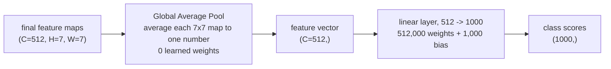

*Figure — GAP collapses `(C, H, W)` to `(C,)` for free, size-agnostic; only the final `C ->
num_classes` linear layer has weights.*

### 1x1 convolutions — a per-pixel linear mix of channels

Last piece: what if you want to change a feature map stack's channel count — say drop 256 channels
down to 64 — without touching the spatial size, and as cheaply as possible?

A **1x1 convolution** is a kernel with `kH = kW = 1`. Plug that into Step 3's mechanism: at each
position, the kernel looks at exactly *one* pixel — but across *all* `C_in` channels at that pixel —
and computes a weighted sum of them. It isn't looking at neighbours at all; it's a **per-pixel linear
mix of channels**, applied identically (weight-shared) at every position, effectively a tiny dense
layer run independently on every pixel's channel-vector. Because it's followed by a ReLU like any
other conv layer, it adds a nonlinearity too — it isn't just a channel-count knob.

```python
oneone_params = conv_params(c_out=64, c_in=256, kh=1, kw=1)
threethree_params = conv_params(c_out=64, c_in=256, kh=3, kw=3)
```

```text
1x1 conv 256->64: weight (64, 256, 1, 1) -> 64*256*1*1 = 16,384 weights (+64 bias) = 16,448 params
3x3 conv 256->64: weight (64, 256, 3, 3) -> 64*256*3*3 = 147,456 weights (+64 bias) = 147,520 params
the 3x3 uses ~9x the params of the 1x1, for the exact same channel change (256 -> 64)
```

The 9x ratio is exactly the kernel's pixel count (`3x3 = 9` positions vs `1x1 = 1` position) — a 1x1
conv pays only for the channel mixing, nothing for spatial extent.

**Why this matters: the "bottleneck" pattern.** GoogLeNet/Inception uses 1x1 convolutions to shrink
channel counts *before* an expensive `3x3` or `5x5` convolution, keeping the network deep without
letting compute explode
([source: "Going Deeper with Convolutions" (Szegedy et al., arXiv:1409.4842, 2014) — the
GoogLeNet/Inception paper](https://arxiv.org/abs/1409.4842) (checked 2026-09-03) — 1x1 convolutions
used as dimension-reduction modules to remove computational bottlenecks before the larger
convolutions in each Inception module). ResNet's deeper variants (ResNet-50/101/152) use the same
trick inside every residual block: **reduce** channels with a 1x1 conv, run the expensive `3x3` conv
on the *smaller* channel count, then **expand** back with another 1x1 conv
([source: "Deep Residual Learning for Image Recognition" (He, Zhang, Ren & Sun, arXiv:1512.03385,
2015)](https://arxiv.org/abs/1512.03385) (checked 2026-09-03) — the "bottleneck" building block used
in ResNet-50/101/152 stacks three convolutions of kernel size 1, 3, 1: the 1x1 layers reduce then
restore dimensions, leaving the 3x3 layer with smaller input/output channel counts), the exact
"NiN, popularised by GoogLeNet/ResNet" lineage this section opened with. Real numbers, a
`256 -> 256` bottleneck block against one plain `3x3` doing the same shape change:

```python
reduce_params = conv_params(c_out=64, c_in=256, kh=1, kw=1)   # 1x1 reduce: 256 -> 64
mid_params = conv_params(c_out=64, c_in=64, kh=3, kw=3)       # 3x3 at the reduced width
expand_params = conv_params(c_out=256, c_in=64, kh=1, kw=1)   # 1x1 expand: 64 -> 256
bottleneck_total = reduce_params + mid_params + expand_params

plain_params = conv_params(c_out=256, c_in=256, kh=3, kw=3)   # one plain 3x3, same 256 -> 256
```

```text
1x1 reduce, 256->64:  16,448 params
3x3,        64->64:   36,928 params
1x1 expand, 64->256:  16,640 params
bottleneck total:     70,016 params
plain 3x3, 256->256 directly: 590,080 params
the plain 3x3 uses ~8.4x the params of the bottleneck, for the same 256->256 shape change
```

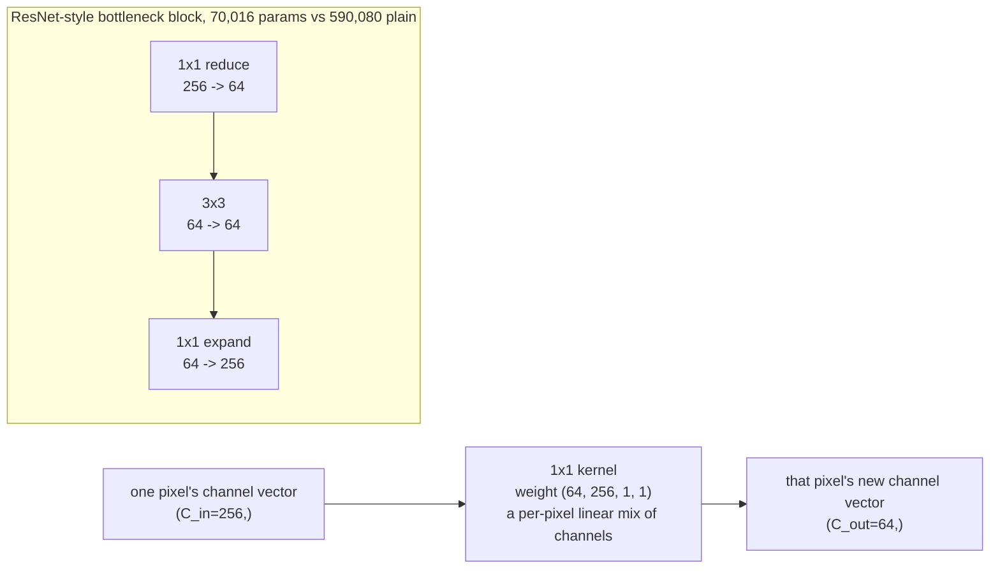

*Figure — top: a single 1x1 conv mixing one pixel's channels. Bottom: the ResNet/Inception bottleneck
pattern — reduce channels cheaply, do the expensive spatial convolution at the reduced width, expand
back.*

## 3. Sequences — RNN limits, then LSTM/GRU gating

**What problem shape it solves:** your input is an ordered sequence of variable length — words in a
sentence, ticks in a time series — where what came *before* affects how you should interpret what
comes *now*. A dense layer (fixed-size input, no notion of order) doesn't fit; you need a layer that
carries information forward from one step to the next.

### Concept — the vanilla RNN, and why it struggles

A **recurrent neural network (RNN)** processes a sequence one element at a time, maintaining a
**hidden state** `h_t` that gets updated at every step: roughly, `h_t = tanh(W_x x_t + W_h h_{t-1})`
— a small dense layer applied at each step, fed both the current input and the *previous* hidden
state. That hidden state is the network's memory of everything it has seen so far in the sequence.

The problem shows up when you try to train it. Backpropagation-through-time has to send the error
signal backward through every one of those steps, and at each step it multiplies by the derivative
of `tanh` — a number that's always `<= 1`, often much smaller. Multiply a small number by itself
across, say, fifty timesteps, and the gradient reaching the earliest steps is effectively zero: the
network can't learn dependencies that span more than a handful of steps. This is the **vanishing
gradient problem** for sequences (NOTE-ML-3 evidence #2;
[source: LSTM & GRU overcoming vanishing gradient](https://medium.com/@Hafiza_Shamza_Hanif/long-short-term-memory-lstm-and-gated-recurrent-unit-gru-overcoming-the-vanishing-gradient-dc67c07facb2)
(checked 2026-09-02)) — the same multiplicative-shrinkage mechanism [ML-1] showed for deep stacks of
`sigmoid`/`tanh` layers (NOTE-ML-2 evidence #4), just unrolled across *time* instead of *depth* — the
same mechanism §2 just flagged as the reason ResNet needed skip connections *across depth*.

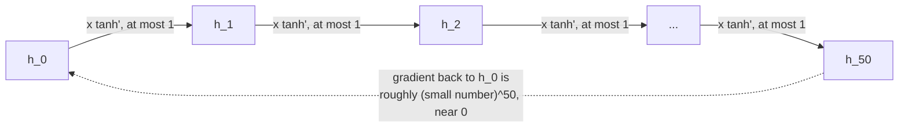

### Concept — LSTM and GRU: gating fixes it

**LSTM** (Long Short-Term Memory) fixes this by giving the network a second, separate channel: the
**cell state**, `C_t`, which runs across timesteps mostly *unchanged* except for explicit add/erase
operations controlled by three learned **gates** (each a small sigmoid layer, output in `[0, 1]`,
acting as a "how much" dial):

- **Forget gate** — how much of the old cell state `C_{t-1}` to keep vs. discard.
- **Input gate** — how much new information to write into the cell state.
- **Output gate** — how much of the (possibly updated) cell state to expose as this step's hidden
  state `h_t`.

The reason this fixes vanishing gradients: the cell-state backbone is **additive**
(`C_t = forget ⊙ C_{t-1} + input ⊙ candidate`), not the repeated-multiplication chain a vanilla RNN's
hidden state goes through. Gradients can flow back across many steps along that additive path without
shrinking exponentially (NOTE-ML-3 evidence #2). **Why an additive path fixes it, in one line:**
repeated multiplication by numbers `<= 1` shrinks toward zero; repeated addition doesn't shrink at
all — the same reason a running total survives fifty steps of "add or don't add" but not fifty steps
of "multiply by 0.9 or don't."

**GRU** (Gated Recurrent Unit) is a simpler variant: it merges the forget/input gates into a single
**update gate** and adds a **reset gate**, and drops the separate cell state entirely — two gates
instead of three, fewer parameters, and comparable performance in practice
([source: GRU explained](https://ravjot03.medium.com/gru-explained-the-simplified-rnn-solution-for-sequential-data-c706d0d149c5)
(checked 2026-09-02); NOTE-ML-3 evidence #2).

Full gate equations are outside this chapter's scope — the takeaway to carry forward is the
block-level shape: *an additive memory path, with learned gates deciding how much to keep, write, and
expose.*

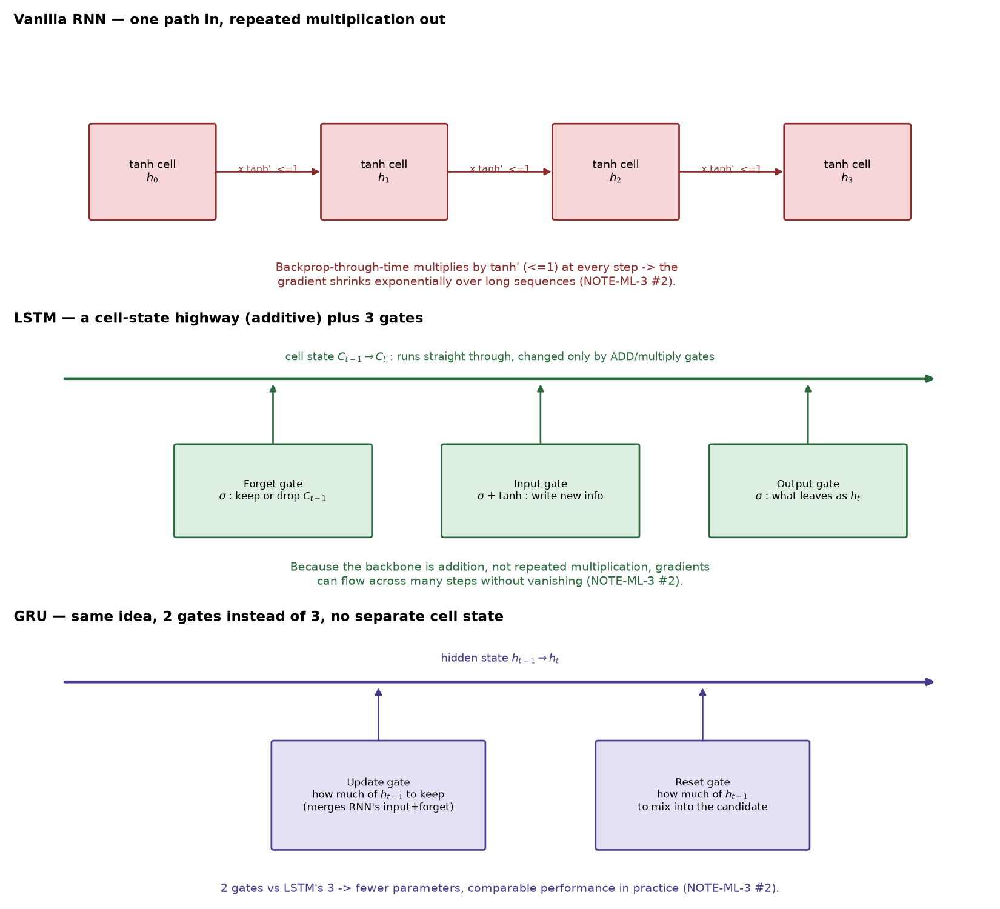

*Figure 4 — top: a vanilla RNN's hidden state is repeatedly multiplied step to step, so gradients
shrink. Middle: LSTM's cell state runs straight through (green line), touched only by additive/gated
operations from three gates. Bottom: GRU, the same idea with two gates and no separate cell state.
Reproduced by [`conv_demo.py`](code/conv_demo.py), function `figure_rnn_lstm_gru`.*

## 4. Transformers — self-attention, positional encoding, parallelism

**What problem shape it solves:** you still have a sequence, but you want two things RNNs can't
give you cheaply: (1) *any* position can directly influence *any* other position, no matter how far
apart, without the signal having to survive N sequential hops; and (2) the whole layer can be
computed in parallel, not step-by-step, because sequential processing is what makes RNNs slow to
train on long sequences and on GPUs (which are built for parallel work, not for waiting on step `t-1`
before starting step `t`).

### Concept — self-attention

Instead of recurrence, a **transformer** layer lets every position in the sequence look directly at
every other position and decide how much attention to pay to each, in one parallel computation. For
every token, the model learns three projections of it: a **Query** (what this token is looking for),
a **Key** (what this token offers, for other tokens to match against), and a **Value** (what this
token actually contributes if attended to). Attention is then:

```
Attention(Q, K, V) = softmax(Q K^T / sqrt(d_k)) V
```

— compare every query against every key (`Q K^T`), scale, turn into a probability distribution over
positions (`softmax`), and use those probabilities to take a weighted blend of all the values. No
step waits on another step: this whole computation is one matrix multiplication.
**Multi-head attention** runs several of these in parallel with independently-learned Q/K/V
projections, so different heads can pick up on different kinds of relationships (e.g. one head
tracking subject-verb agreement, another tracking nearby words) at once.
(NOTE-ML-3 evidence #3; [source: "Attention Is All You Need," Vaswani et al.,
2017](https://proceedings.neurips.cc/paper_files/paper/2017/file/3f5ee243547dee91fbd053c1c4a845aa-Paper.pdf)
(checked 2026-09-02), and
[a walkthrough of the mechanism](https://towardsdatascience.com/transformers-in-action-attention-is-all-you-need-ac10338a023a/)
(checked 2026-09-02).)

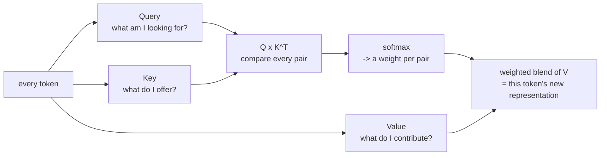

### Concept — positional encoding

There's a catch: attention treats the sequence as an unordered set of positions — nothing in the
formula above knows that token 3 comes before token 5. Since there's no recurrence to implicitly
encode order, the transformer has to be told position explicitly, so it adds a **positional
encoding** vector to each token's embedding before the first attention layer. The original scheme
uses sine and cosine waves at geometrically varying frequencies, one pair of frequencies per pair of
embedding dimensions:

```
PE(pos, 2i)   = sin(pos / 10000^(2i/d_model))
PE(pos, 2i+1) = cos(pos / 10000^(2i/d_model))
```

(NOTE-ML-3 evidence #3, same source as above.) The formula is computed once, deterministically — no
training involved — and simply added to the input embeddings. Here it is computed for real (50
positions, 32 encoding dimensions) and plotted:

```python
import numpy as np


def positional_encoding(n_positions: int, d_model: int) -> np.ndarray:
    """Sinusoidal positional encoding:
        PE(pos, 2i)   = sin(pos / 10000^(2i/d_model))
        PE(pos, 2i+1) = cos(pos / 10000^(2i/d_model))
    Source: "Attention Is All You Need" (Vaswani et al., 2017) — NOTE-ML-3 #3.
    """
    pos = np.arange(n_positions)[:, None].astype(np.float64)
    i = np.arange(d_model)[None, :].astype(np.float64)
    angle_rates = 1.0 / np.power(10000.0, (2 * np.floor(i / 2)) / d_model)
    angles = pos * angle_rates
    pe = np.zeros((n_positions, d_model), dtype=np.float64)
    pe[:, 0::2] = np.sin(angles[:, 0::2])
    pe[:, 1::2] = np.cos(angles[:, 1::2])
    return pe
```

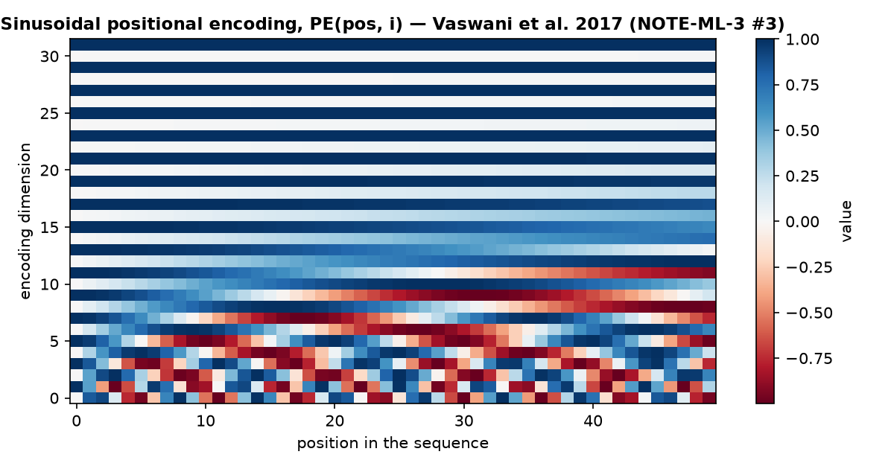

*Figure 5 — the actual `PE` matrix for 50 positions x 32 dimensions. Low dimensions (bottom rows)
oscillate fast — they distinguish nearby positions; high dimensions (top rows) oscillate slowly —
they distinguish coarse, far-apart position ranges. Every position gets a distinct combined pattern,
which is exactly what lets a model with no recurrence still infer relative position.
Reproduced by [`conv_demo.py`](code/conv_demo.py), function `figure_positional_encoding`.*

### Concept — why transformers displaced RNNs

Put self-attention and positional encoding together and you get the two wins RNNs couldn't offer: no
sequential bottleneck (every position's attention is computed in one parallel pass, so training scales
far better with hardware and with sequence length), and a direct path between any two positions
(an RNN has to relay information through every intermediate step; a transformer connects position 1
to position 500 in a single attention computation) (NOTE-ML-3 evidence #3).

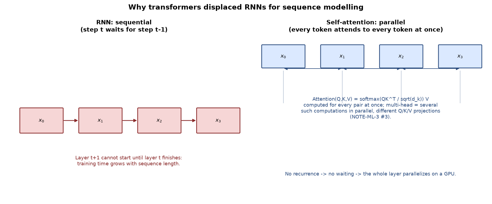

*Figure 6 — left: an RNN's hidden state chain — step t+1 cannot start before step t finishes. Right:
self-attention — every token attends to every other token in one parallel computation; multi-head
attention runs several such computations side by side.
Reproduced by [`conv_demo.py`](code/conv_demo.py), function `figure_transformer_attention`.*

Full attention math, masking for autoregressive decoding, and building a transformer block from
scratch are out of scope here — that's ML-10.

## 5. Encoder-decoder and autoencoders — bottleneck and reconstruction

Two more shapes share a family resemblance — both have an "encoder" stage and a "decoder" stage —
but solve very different problems, so it's worth being precise about which is which.

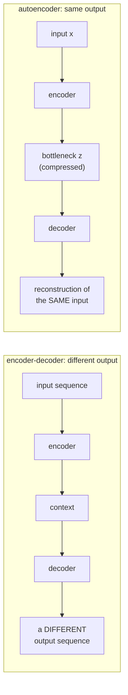

### Encoder-decoder (seq2seq) — one sequence becomes a different sequence

**What problem shape it solves:** the input and output are both sequences, but they're not the same
sequence — translation (English in, French out), summarization (long document in, short summary
out), speech recognition (audio in, text out). Lengths on each side can differ arbitrarily.

**Concept:** an **encoder** (RNN/LSTM/GRU, or a transformer) reads the whole input sequence and
produces a **context** — historically a single vector (the encoder's final hidden state), summarizing
"everything about the input." A **decoder** is then initialized from that context and generates the
output sequence one token at a time, each new token conditioned on what it has generated so far plus
the context. A single fixed-size context vector is a bottleneck when the input is long — the fix is
**attention**: instead of compressing everything into one vector, the decoder attends back to *every*
encoder position at each output step, deciding at generation time which parts of the input matter
most for the token it's producing right now (NOTE-ML-3 evidence #4;
[source: seq2seq and attention](https://lena-voita.github.io/nlp_course/seq2seq_and_attention.html)
(checked 2026-09-02), and
[a worked walkthrough](https://medium.com/@mervebdurna/exploring-seq2seq-encoder-decoder-and-attention-mechanisms-in-nlp-theory-and-practice-9b1022cf50b4)
(checked 2026-09-02)). A transformer-based encoder-decoder uses this same shape, but both encoder
self-attention and encoder-decoder cross-attention are the parallel kind from §4, not a single
context vector.

### Autoencoder — compression and reconstruction, no labels needed

**What problem shape it solves:** you don't have a label at all — you want the network to learn a
*compressed representation* of the input, useful for dimensionality reduction, denoising, anomaly
detection, or as a feature extractor for a downstream model.

**Concept:** an **autoencoder** is an encoder that shrinks the input down to a low-dimensional
**bottleneck** (the latent representation `z`), followed by a **decoder** that expands `z` back out,
trying to reconstruct the original input as closely as possible. There's no external label — the
training signal is the reconstruction error itself, typically `loss = ||x - x_hat||^2`: how far the
reconstruction `x_hat` is from the original `x` (NOTE-ML-3 evidence #5;
[source: the autoencoders guide](https://www.v7labs.com/blog/autoencoders-guide) (checked
2026-09-02)). The bottleneck being *smaller* than the input is the whole mechanism: the network is
forced to discard whatever it can, keeping only the features that let it reconstruct the input well —
those surviving features are, by construction, the salient ones. A smaller bottleneck means more
compression (and more information loss); a larger one retains more detail but reduces the
dimensionality-reduction benefit — a trade-off you set, not one the network resolves for you.

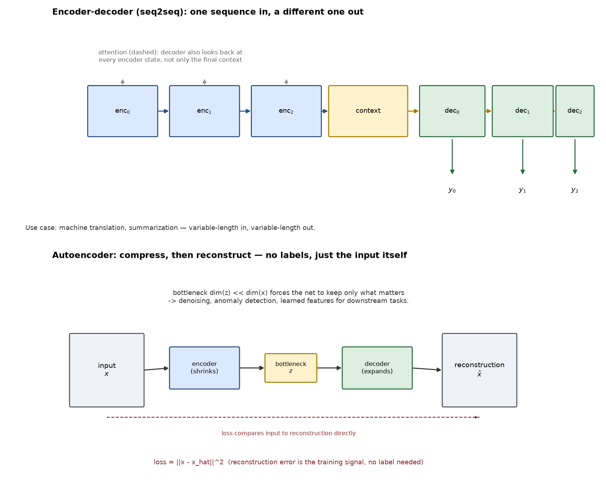

*Figure 7 — top: encoder-decoder — an input sequence is encoded, summarized into a context, and a
decoder generates a differently-shaped output sequence; dashed arrows show attention reaching back to
every encoder state. Bottom: autoencoder — the same "encode then decode" shape, but the target is the
*input itself*, and the point is the narrow bottleneck in the middle, not the output sequence length.
Reproduced by [`conv_demo.py`](code/conv_demo.py), function `figure_encoder_decoder_autoencoder`.*

**The distinction worth keeping straight:** encoder-decoder's decoder produces a *new, different*
sequence (a translation); an autoencoder's decoder tries to reproduce the *same* input it started
from. Same two-stage shape, opposite goals.

## 6. Pitfalls

- **Using a dense layer where a conv layer fits.** The worked example above isn't decorative — for a
  224x224 image, a dense layer mapping pixels to pixels would need billions of weights where a 3x3
  conv filter needs 9. If your input is grid-shaped and you reach for `Dense`/`Linear` layers
  end-to-end, you're both throwing away the locality structure in the data *and* paying for it in
  parameters you don't need (NOTE-ML-3 evidence #1). **How to see it:** print your model's parameter
  count for a dense-only version vs. a conv version at the same input size, the way `conv_demo.py`
  does — the ratio is usually startling.

- **Expecting an RNN (even LSTM/GRU) to handle arbitrarily long-range dependencies.** Gating fixes
  *vanishing* gradients, it doesn't make sequence length free — very long sequences still stress an
  RNN's single hidden-state bottleneck, and training remains inherently sequential (NOTE-ML-3
  evidence #2, #3). **How to see it:** if performance degrades sharply as your sequences get longer,
  or training is unacceptably slow because you can't parallelize across timesteps, that's the signal
  to reach for a transformer or, at minimum, add attention over the encoder states rather than relying
  on a single final hidden state.

- **Stacking layers deep without a fix for vanishing gradients.** The exact mechanism from §3
  (repeated multiplication by a small derivative shrinking the gradient) isn't unique to *time* — it
  happens across *depth* too, and §2's CNN timeline shows the field hitting this same wall directly:
  composing `L` sigmoid/tanh layers multiplies by a term `<= 0.25` at each one, so `(0.25)^L -> 0` as
  `L` grows (NOTE-ML-2 evidence #4, from [ML-1]). This is exactly why ReLU activations and gated
  architectures (LSTM/GRU, and ResNet's skip connections — an additive path across *depth*, the same
  fix LSTM applies across *time*) matter more as networks get deeper. **How to see it:** if a deep
  network's early layers' weights barely move during training while later layers train fine, suspect
  vanishing gradients, not a data problem.

## Recap & what's next

Four architecture families, four data shapes:

- **CNN** — grid data; built up from Step 1's "image is a grid of numbers" through the hand-worked
  convolution arithmetic (`13x1 + 99x0 + 14x0 + 42x1 = 55`), the output-size formula
  $(W-K+2P)/S+1$, and hand-designed filters (mean blur, Sobel, Laplacian) — then the historical
  timeline (LeNet-5 -> AlexNet -> VGG -> ResNet -> MobileNetV2 -> EfficientNet) of what happens once
  a network learns its own kernels instead (§2).
- **RNN -> LSTM/GRU** — ordered sequences; gating fixes the vanilla RNN's vanishing-gradient limit by
  giving gradients an additive path back through time — the same additive trick ResNet uses across
  depth (§3).
- **Transformer** — sequences, without the sequential bottleneck: self-attention connects any two
  positions directly and computes in parallel; positional encoding restores the order information
  attention alone doesn't have (§4).
- **Encoder-decoder** and **autoencoder** — both an "encode then decode" shape, aimed at opposite
  goals: producing a *different* output sequence vs. compressing and reconstructing the *same* input
  (§5).

The common thread: none of this is arbitrary — every mechanism here (weight sharing, gating,
attention, bottlenecks, skip connections) exists to make a specific data shape learnable efficiently,
and the same fixes keep reappearing in different clothes (an additive gradient path solves vanishing
gradients whether the axis is time or depth). The reflex to build going forward: look at your data's
shape *first*, then pick the architecture family, not the other way around.

Next: [ML-3 — Theory: Representations](03-representations.md) picks up where "what shape is the raw
input" leaves off, and asks how a network turns raw pixels, tokens, or categories into the numeric
vectors every architecture in this chapter actually operates on.
