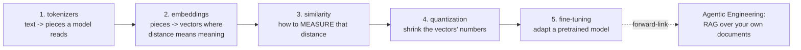
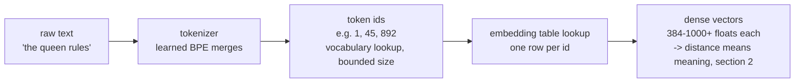
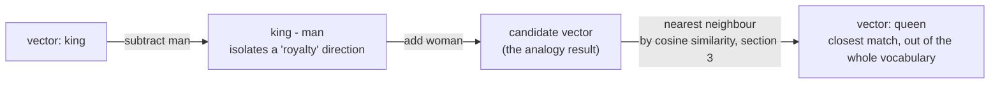
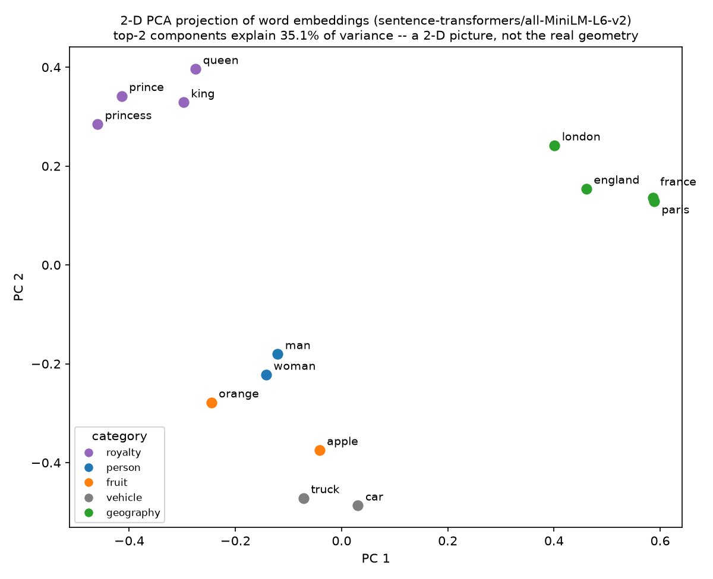
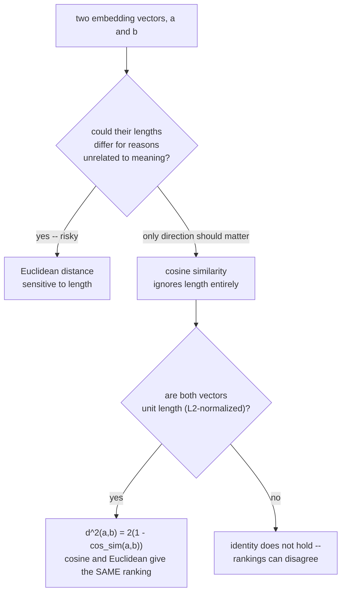
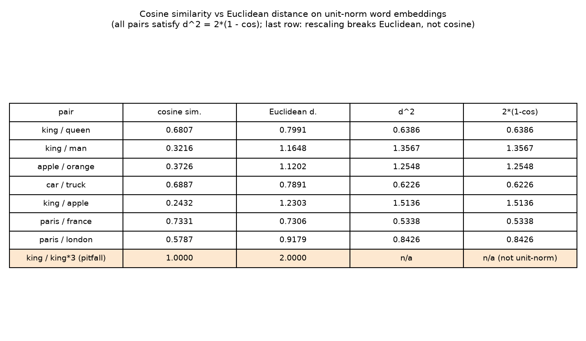
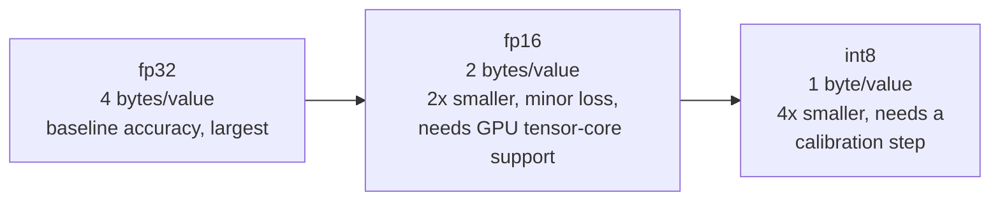
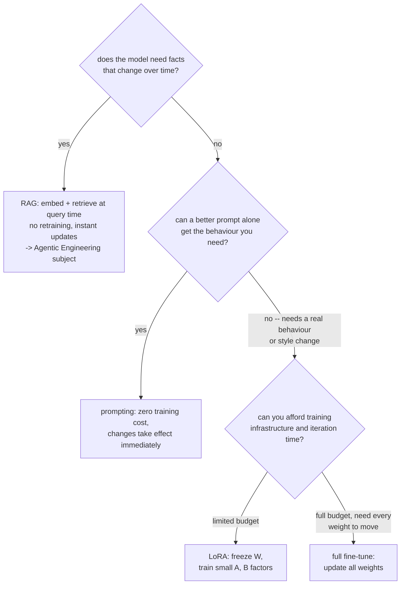

# Representations: Tokenizers, Embeddings, Similarity, Quantization, Fine-tuning

*Machine Learning · Theory · SPEC-ML-3*

## The equation that does arithmetic on words

In January 2013, three Google researchers — Tomas Mikolov, Kai Chen, Greg Corrado, and Jeffrey
Dean — posted a paper called *"Efficient Estimation of Word Representations in Vector Space"* that
turned every word in a vocabulary into a few hundred floating-point numbers
([source: Mikolov, Chen, Corrado & Dean, arXiv:1301.3781](https://arxiv.org/abs/1301.3781), checked
2026-09-03). The method became known as **word2vec**.

Assigning numbers to words wasn't new — a dictionary index does that. The surprise came a few
months later, in a companion paper from Mikolov with Wen-tau Yih and Geoffrey Zweig, which showed
you could do *arithmetic* on those numbers and get linguistically sensible answers back
([source: Mikolov, Yih & Zweig, "Linguistic Regularities in Continuous Space Word Representations,"
NAACL-HLT 2013, ACL Anthology N13-1090](https://aclanthology.org/N13-1090/), checked 2026-09-03).
Take the vector for `"king"`, subtract the vector for `"man"`, add the vector for `"woman"` — and
out of every word vector the model knows, hundreds of thousands of them, the single closest one to
that result is `"queen"`. Nobody told the model what a king or a queen is. It never saw a
definition, a family tree, or a grammar rule — it only ever saw which words tend to sit near which
other words in ordinary text, and that alone was enough for "royalty," "gender," and "queen" to
fall out as directions and landmarks in a few-hundred-dimensional space.

Here's the one-sentence version, the kind you could repeat at dinner: **if you place words in space
so that similar meanings end up as nearby points, the geometry of that space starts doing a little
bit of grammar and reasoning for you, for free.** §2's worked example below reproduces this exact
trick — not with 2013's word2vec, but with a real, current embedding model — and the vector
arithmetic still lands on `"queen"`.

Everything else in this chapter is the machinery underneath that trick, and the practical
consequences of using it in production: how text gets cut into pieces a model can look up (§1), how
"closeness" between those pieces' vectors gets measured precisely enough to trust (§3), how to
shrink those vectors' numbers for production without wrecking the geometry (§4), and how to adapt a
pretrained model to a new job without retraining it from scratch (§5).



All claims below trace to `research/NOTE-ML-4-representations.md` (checked 2026-09-02) or an inline
citation with its own checked date; the runnable demo is
[`code/similarity_demo.py`](code/similarity_demo.py). Run it yourself:

```bash
.venv-ml/Scripts/python.exe "Machine Learning/Theory/code/similarity_demo.py"
```

It uses real 384-dimensional sentence embeddings from `sentence-transformers` (version 6.0.1,
installed in this project's `.venv-ml`) if the model can load; if sentence-transformers or its
model download is unavailable, it falls back automatically to small, deterministic hand-built
vectors and says so on stdout. Every number quoted in this chapter is copied straight from an
actual run using the real model — nothing here is invented.

## 1. Text → numbers: tokenizers

### The problem: a model can't read a string, and the obvious fixes don't scale

A **token** is the smallest unit of text a model actually reads: a whole word, a fragment of a
word, or a punctuation mark, depending on how the tokenizer cuts things up. A **tokenizer** is the
function that does the cutting, then looks each piece up in a fixed vocabulary to get an integer
id — the only thing a model's linear algebra ever actually sees.

**Step 1 — the obvious approach: split on whitespace and punctuation.** `"the cat sat"` becomes
`["the", "cat", "sat"]`. Every distinct surface form — `run`, `runs`, `running`, `runner` — gets its
own vocabulary slot.

**Step 2 — watch it fail, with a real number.** English isn't a small, closed set: the Oxford
English Dictionary lists roughly **171,476 words in current use**
([source: alphaDictionary, "How Many Words are in the Oxford English Dictionary?"](https://www.alphadictionary.com/articles/oed.html),
checked 2026-09-03) — and that count excludes proper nouns, typos, slang, and every word coined
after the dictionary went to press. A word-level vocabulary big enough to cover ordinary English is
already enormous, and it can never be complete: hand a word-level tokenizer anything it didn't see
during training and it has nothing to say — the word becomes a single `<UNK>` ("unknown") token,
total information loss for that word, no matter how close it is to a word the tokenizer *does*
know.

**Step 3 — swing to the other extreme: split into individual characters.** Vocabulary shrinks to a
few dozen symbols — genuinely bounded, no more OOV problem. But sequences get much longer (every
word is now many tokens instead of one), and the model has to work far harder to reconstruct
word-level meaning out of character soup.

**Step 4 — the fix that actually won: subword tokenization.** Split into pieces bigger than a
character but smaller than (or equal to) a whole word: `"unhappiness"` might become
`["un", "happi", "ness"]`. This is the sweet spot — a bounded vocabulary, reasonable sequence
lengths, and no OOV problem, because any unseen word can still be spelled out of known pieces. The
payoff is concrete: GPT-2's actual vocabulary is **50,257** subword tokens
([source: `vocab_size` in the GPT-2 model config](https://huggingface.co/openai-community/gpt2/blob/main/config.json),
checked 2026-09-03) — a bounded, fixed-size number, nowhere near "one slot per English word," let
alone one slot per word-that-might-ever-exist.

**Byte Pair Encoding (BPE)** is the standard algorithm for *learning* a subword vocabulary. It's
iterative and purely frequency-driven: start with every word split into characters, repeatedly find
the most frequent adjacent pair of symbols in the whole corpus, merge that pair into one new
symbol, and repeat until you hit a target vocabulary size or merge count
[source: BPE overview](https://towardsdatascience.com/byte-pair-encoding-for-beginners-708d4472c0c7/)
(checked 2026-09-02; NOTE-ML-4 evidence item 2, itself citing Sennrich et al., *Neural Machine
Translation of Rare Words with Subword Units*, 2016). GPT-2/GPT-3 use BPE variants; BERT uses a
close relative called WordPiece — different implementations, same idea (NOTE-ML-4 caveat: don't
assume two BPE-family tokenizers produce identical tokens for the same text).

If you've written a hand-rolled lexer, the loop shape is familiar — scan, find the best match,
consume, repeat — except a compiler's lexer applies **fixed** rules you wrote, while BPE **learns**
its merge rules from the frequency statistics of a training corpus. Nobody hand-writes the rule
"merge 'e' and 'r'"; the algorithm discovers it because `"er"` happens to be common.

Once a tokenizer has cut text into ids, those ids are still just arbitrary integers — §2 picks up
exactly where this leaves off:



### Worked example

`similarity_demo.py`'s `run_bpe_demo()` trains a tiny BPE tokenizer on a 5-word toy corpus and
prints every merge step. Each word starts as individual characters plus an end-of-word marker
(`</w>`, standard BPE bookkeeping so merges never cross a word boundary):

```text
toy corpus (word: frequency): {'low': 5, 'lowest': 2, 'newer': 6, 'wider': 3, 'new': 2}
merge 1: ('e', 'r') (count=9) -> 'er'
merge 2: ('er', '</w>') (count=9) -> 'er</w>'
merge 3: ('n', 'e') (count=8) -> 'ne'
merge 4: ('ne', 'w') (count=8) -> 'new'
merge 5: ('l', 'o') (count=7) -> 'lo'
merge 6: ('lo', 'w') (count=7) -> 'low'
merge 7: ('new', 'er</w>') (count=6) -> 'newer</w>'
merge 8: ('low', '</w>') (count=5) -> 'low</w>'
```

Watch what falls out for free: `"newer"` (frequency 6, the most common word) becomes a single
merged symbol, `"low"` becomes its own reusable subword shared between `"low"` and `"lowest"`, and
`"er</w>"` — a word-final "-er" — becomes a symbol shared between `"newer"` and `"wider"`.

The real payoff is applying those *same learned merges* to words the tokenizer never trained on:

```text
'slower'     -> ['s', 'low', 'er</w>']
'wildest'    -> ['w', 'i', 'l', 'd', 'e', 's', 't', '</w>']
```

`"slower"` was never in the training corpus, but it decomposes cleanly into `"s"` + the learned
`"low"` subword + the learned `"er</w>"` suffix. A pure word-level tokenizer would have had no
entry for `"slower"` at all and would have emitted a single `<UNK>` token, discarding the word
completely. That's the concrete answer to LO1's "why subword tokenizers won": bounded vocabulary,
*and* graceful handling of words nobody trained on.

Here's the merge-counting step in isolation, so you can see the mechanics without the loop:

```python
from collections import Counter

# word -> corpus frequency, each word split into characters + an end-of-word marker
vocab = {("l", "o", "w", "e", "r", "</w>"): 6, ("n", "e", "w", "e", "r", "</w>"): 4}

pair_counts = Counter()
for word, freq in vocab.items():
    for i in range(len(word) - 1):
        pair_counts[(word[i], word[i + 1])] += freq

most_frequent = max(pair_counts, key=pair_counts.get)
print(f"most frequent adjacent pair: {most_frequent} (count={pair_counts[most_frequent]})")
print(f"BPE would merge it into a single new symbol: {most_frequent[0] + most_frequent[1]!r}")
```

Running it prints `most frequent adjacent pair: ('w', 'e') (count=10)` — `"w"` followed by `"e"`
appears in both `lower` (×6) and `newer` (×4), so it wins the very first merge round.

## 2. Embeddings & word2vec: geometry encodes meaning

### The problem: token ids don't know how to be similar

A tokenizer hands you integers — `"king"` might become id `4327`, `"queen"` id `9188`. Nothing
about the *size* of those numbers is meaningful; `9188` isn't "more" of anything than `4327`, and
there's no sense in which either id is "close to" the other. You can't do the `king - man + woman`
trick from the cold open on raw ids — subtraction on arbitrary integer labels means nothing.

**Step 1 — the obvious fix: give every token its own long vector.** A **one-hot vector** is exactly
that: a vector of all zeros except a single `1` marking which token this is. For a vocabulary of
size $V$, `"cat"`'s vector is $V$ numbers long, with a `1` at cat's index and `0` everywhere else.

**Step 2 — watch it fail, with real arithmetic.** The dot product of any two *distinct* one-hot
vectors is always exactly zero — their single `1`s never land on the same index:

$$\text{one\_hot}(\text{cat}) \cdot \text{one\_hot}(\text{dog}) = 0 \qquad
\text{one\_hot}(\text{cat}) \cdot \text{one\_hot}(\text{spreadsheet}) = 0$$

Both come out `0` — the exact same number. Mathematically, in a one-hot space, `"cat"` is *exactly*
as similar to `"dog"` as it is to `"spreadsheet"`: zero, always, for any two distinct words, with no
notion of "closer in meaning" at all. And that's before counting the size problem: with GPT-2's
real 50,257-token vocabulary (§1), every single one-hot vector would be 50,257 numbers long, 50,256
of them wasted zeros, just to represent one token.

**Step 3 — the fix: embeddings.** An **embedding** is a dense, fixed-length vector — typically
100–1000+ floats, nothing like $V$ numbers long — assigned to a token, *learned* so that vectors
for semantically similar inputs end up near each other. `"cat"` and `"dog"`'s embeddings now have a
real, informative, nonzero dot product; `"cat"` and `"spreadsheet"`'s stays small. That's the whole
value proposition, in one sentence: **one-hot vectors are enormous and blind to meaning; embeddings
are small and encode meaning as geometry.**

**word2vec** (Mikolov et al., Google, 2013 — the cold-open paper) is what made this idea mainstream,
via two training setups (NOTE-ML-4 evidence item 3):

- **Skip-gram** — given a center word, predict its surrounding context words.
- **CBOW** (Continuous Bag-of-Words) — the reverse: given context words, predict the center word.
  Faster to train, slightly lower embedding quality.

Neither setup is told anything about grammar or meaning directly — the vectors that fall out of
training on "which words tend to appear near which other words" turn out to encode semantic and
even analogical relationships as *directions* in the vector space. The canonical illustration, now
in LaTeX instead of the cold open's plain English:

$$\vec{v}_{\text{king}} - \vec{v}_{\text{man}} + \vec{v}_{\text{woman}} \approx \vec{v}_{\text{queen}}$$

"king minus man" isolates something like a "royalty" direction; adding "woman" lands you near
"queen" (NOTE-ML-4 evidence item 3; the specific analogy result traces to Mikolov, Yih & Zweig,
NAACL-HLT 2013, cited in the cold open above). Modern embeddings (BERT-family,
sentence-transformers) are 768-dimensional or more and come from transformer encoders rather than
word2vec's shallow network, but the same "geometry encodes meaning" property holds, which is what
the worked example below demonstrates with a real, current embedding model rather than the original
word2vec.

If you know Java's `hashCode()`/`equals()`: an embedding is the opposite design goal.
`hashCode()` is explicitly allowed — encouraged — to scatter similar objects across the hash space.
An embedding is trained to do the reverse: pull semantically similar inputs *together*.



### Worked example

`similarity_demo.py` encodes a 14-word vocabulary with `sentence-transformers/all-MiniLM-L6-v2` — a
22M-parameter, ~44 MB, CPU-friendly model, Apache 2.0 licensed
[source: sentence-transformers on Hugging Face](https://huggingface.co/sentence-transformers)
(checked 2026-09-02; NOTE-ML-4 evidence item 6) — producing 384-dimensional unit vectors. It then
computes `king - man + woman`, re-normalizes it, and ranks every other word by cosine similarity:

```text
cos(analogy, queen     ) = 0.5795
cos(analogy, princess  ) = 0.4418
cos(analogy, prince    ) = 0.3882
cos(analogy, orange    ) = 0.3176
cos(analogy, france    ) = 0.3110
nearest neighbour: 'queen' (cos=0.5795) -- matches the expected geometry.
```

`"queen"` wins by a clear margin over the next-best candidate. The script asserts this — if a
future model swap ever broke the geometry, the run would fail loudly instead of silently printing
a wrong "expected" result.

The 2-D scatter below projects the same 14 embeddings down to 2 dimensions with PCA (implemented
as a plain SVD on centred data — no extra library, since PCA's components are exactly the right
singular vectors of the centred data matrix) purely so you can *see* the clustering:



Royalty words (`king`, `queen`, `prince`, `princess`) cluster together; geography words (`paris`,
`france`, `london`, `england`) cluster together; fruit, vehicle, and person words each form their
own group — with no labels or rules telling the model any of that, just statistics from training
text. The title notes the top-2 principal components explain only 35.1% of total variance: this
2-D picture is illustrative, not the whole story — the real geometry lives in all 384 dimensions,
which is why the next section never does its math in this reduced space.

## 3. Similarity: cosine vs Euclidean

### The problem: dense vectors only help if "closeness" is measured correctly

§2 fixed the *representation* — dense vectors instead of one-hot. But `"cat"` and `"dog"` sitting
near each other only matters if you have a precise, trustworthy way to measure "near." Two
candidate ways to compare two vectors $a$ and $b$ (NOTE-ML-4 evidence item 1, citing
[Pinecone: vector similarity](https://www.pinecone.io/learn/vector-similarity/) and
[Zilliz: cosine vs Euclidean on normalized embeddings](https://zilliz.com/ai-faq/in-practical-terms-what-differences-might-you-observe-in-a-search-system-when-using-cosine-similarity-instead-of-euclidean-distance-on-the-same-set-of-normalized-embeddings),
both checked 2026-09-02):

**Step 1 — the geometrically obvious idea: measure the straight-line gap**, the same distance
formula from school geometry:

$$d(a, b) = \sqrt{\sum_i (a_i - b_i)^2}$$

**Euclidean distance** — plain-language gloss: how far apart two points are, walking in a straight
line through the vector space. Range $[0, \infty)$: `0` = identical vectors, larger = farther
apart.

**Step 2 — watch it fail.** Euclidean distance is sensitive to a vector's *length*, not just its
direction. Picture two vectors pointing in exactly the same direction — the same meaning, as far as
the model is concerned — but one is three times as long as the other, because it was rescaled
somewhere downstream. Euclidean distance between them is **not** zero; it grows with the length
difference, even though direction — the thing these models are actually trained to encode — never
changed. The worked example below makes this precise with real vectors: it compares `king` to
`king` scaled 3× and shows exactly this failure mode.

**Step 3 — the fix: measure the angle, not the gap.**

$$\mathrm{cos\_sim}(a, b) = \frac{a \cdot b}{\lVert a \rVert \, \lVert b \rVert}$$

**Cosine similarity** — plain-language gloss: a score from `-1` to `1` for how much two vectors
point in the same direction, ignoring how long either one is. Range `[-1, 1]`: `1` = pointing the
same direction, `0` = orthogonal (unrelated), `-1` = opposite directions. Dividing by both vectors'
lengths cancels magnitude out entirely — multiply either vector by any positive constant and its
cosine similarity to everything else is unchanged. That's exactly the property Step 2 needed.

**Step 4 — how the two relate, once vectors are the same length.** If a model's embeddings are
L2-normalized (rescaled to length 1 — which `all-MiniLM-L6-v2` above does by design), cosine
similarity and Euclidean distance lock together with a clean identity. For unit vectors,
$\lVert a \rVert = \lVert b \rVert = 1$:

$$d^2(a, b) = 2 \left(1 - \mathrm{cos\_sim}(a, b)\right)$$

Once every vector has the same length, ranking by cosine similarity and ranking by Euclidean
distance give the **same ordering** — the right-hand side is a strictly decreasing function of
cosine similarity. This is *why* cosine similarity dominates in embedding search rather than being
an arbitrary convention: what a model learns is *direction* (semantic meaning); it usually doesn't
intend vector length to mean anything, so a distance metric that's sensitive to length adds noise
cosine simply doesn't have.



### Worked example

`build_cosine_vs_euclidean_table()` computes both metrics for seven word pairs from the same
384-D unit vectors above, verifies `d² = 2·(1 - cos)` numerically for every pair (the script
`assert`s this — the run fails if it's ever off by more than `1e-6`), and renders the result:



Read the first row: `king`/`queen` have cosine similarity 0.6807 and Euclidean distance 0.7991.
Square that distance: `0.7991² = 0.6386`. Compute `2 × (1 - 0.6807) = 0.6386`. Same number, to four
decimal places, for every pair in the table — not a coincidence, the identity above guarantees it
for any pair of unit vectors.

The highlighted last row is the pitfall this identity warns about (and the subject of §6): it
compares `king` to `king` scaled by `3×` — same direction, three times the length. Cosine similarity
is `1.0000` (unchanged — cosine only sees direction). Euclidean distance is `2.0000` (it grew,
because the vectors are no longer unit length, so the `d² = 2(1-cos)` identity no longer applies —
notice the table correctly reports "n/a (not unit-norm)" in that row rather than a number that
would be wrong). If you naively used Euclidean distance to rank "how similar is X to king" without
normalizing first, a rescaled-but-identical-direction vector would look *maximally different*
instead of identical — Step 2's failure mode, now with real numbers attached.

## 4. Quantization: fp32 → fp16 → int8

### Concept

Every number in a model — weights, and often the embeddings and activations too — is stored at
some numeric precision. **Quantization** is lowering that precision: fewer bits per number means
less memory and (with the right hardware) faster inference, at the cost of some numeric accuracy
(NOTE-ML-4 evidence item 4). Plain-language gloss: storing each number with fewer bits, trading
precision for memory and speed.

| Precision | Bytes/value | vs fp32 | Notes |
|---|---|---|---|
| **fp32** (single precision float) | 4 | baseline | Full precision, safest, largest. |
| **fp16** (half precision float) | 2 | 2× smaller | Needs hardware support (modern GPU tensor cores) for the speedup; minor accuracy loss. |
| **int8** (8-bit integer) | 1 | 4× smaller | Requires a calibration step (post-training quantization or quantization-aware training) to map floats into 256 integer levels without losing too much signal. |

[Source: quantization trade-offs](https://apxml.com/courses/cnns-for-computer-vision/chapter-8-model-compression-efficient-dl/quantization-reducing-precision)
(checked 2026-09-02; NOTE-ML-4 evidence item 4). int8 typically costs under 1% accuracy on many
models, but this is domain- and model-dependent — NOTE-ML-4's caveat is explicit that computer
vision models tend to tolerate int8 better than NLP models, whose activation distributions are
less uniform.

In Java terms, this is the same trade-off as choosing `double` vs `float` vs a fixed-point/byte
encoding for a large in-memory array: fewer bits per element means the array fits in cache/RAM more
easily and moves through memory faster, but every value now has less precision, and converting
*to* the smaller type is where you can lose information — the conversion back doesn't recover it.



### Worked example

`quantization_demo()` casts the same 14×384 embedding matrix used throughout this chapter through
all three precisions and measures, on this run's own vectors, both memory and how much cosine
similarity survives:

```text
--- quantization on the 14x384 embedding matrix ---
  fp32:  21.00 KiB  (baseline, 4 bytes/value)
  fp16:  10.50 KiB  (2 bytes/value, 2.0x smaller)  mean cosine vs fp32 = 1.000000
  int8:   5.25 KiB  (1 byte/value, 4.0x smaller)  mean cosine vs fp32 = 0.999938
```

fp16 loses essentially nothing here (rounding half-precision floats barely nudges a 384-D unit
vector's direction). The hand-rolled int8 quantizer — scale by the largest absolute value, round to
one of 256 levels, scale back (NOTE-ML-4 evidence item 4's post-training quantization, in its
simplest form) — still preserves 99.99% of the cosine similarity while using a quarter of the
memory. These specific numbers are measured on this chapter's own data, not a general benchmark
claim; the *sizes* (2× and 4× smaller) follow directly from the byte widths and generalize to any
array.

The same mechanics, isolated:

```python
import numpy as np

rng = np.random.default_rng(42)
weights_fp32 = rng.normal(0, 1, size=(1000,)).astype(np.float32)

weights_fp16 = weights_fp32.astype(np.float16)

scale = float(np.abs(weights_fp32).max())
weights_int8 = np.round(weights_fp32 / scale * 127).astype(np.int8)

print(f"fp32: {weights_fp32.nbytes} bytes")
print(f"fp16: {weights_fp16.nbytes} bytes ({weights_fp32.nbytes / weights_fp16.nbytes:.0f}x smaller)")
print(f"int8: {weights_int8.nbytes} bytes ({weights_fp32.nbytes / weights_int8.nbytes:.0f}x smaller)")
```

This prints `fp32: 4000 bytes`, `fp16: 2000 bytes (2x smaller)`, `int8: 1000 bytes (4x smaller)` —
the byte-width arithmetic is exact regardless of what the numbers represent.

## 5. Fine-tuning: full vs LoRA, and when to skip it

### Concept

**Fine-tuning** takes a pretrained model and continues training it on your own, usually much
smaller, dataset so it specializes to your task or domain. **Full fine-tuning** updates every
weight in the model — for a multi-billion-parameter LLM, that means storing gradients and optimizer
state for every one of those billions of parameters, which is where the GPU-memory cost comes from.

**LoRA** (Low-Rank Adaptation, Hu et al., 2021) is the standard parameter-efficient alternative —
plain-language gloss: a way to fine-tune a huge model by training two small matrices instead of
touching the billions of original weights. It freezes all of the pretrained weights and, for each
targeted linear layer's weight matrix $W$, adds a trainable low-rank update:

$$\Delta W \approx A B^{\top}, \qquad A \in \mathbb{R}^{d_{\text{out}} \times r},\ \
B \in \mathbb{R}^{d_{\text{in}} \times r},\ \ r \ll \min(d_{\text{in}}, d_{\text{out}})$$

Only $A$ and $B$ — the low-rank factors — are trained; $W$ never moves. At inference time $A B^\top$
is added back into $W$ once, so there's no extra latency versus a fully fine-tuned model (Hu et al.,
2021; NOTE-ML-4 evidence item 5). NOTE-ML-4 reports that for a 7B-parameter LLM, LoRA adapters
typically add on the order of ~1M trainable parameters (~0.01% of the model) while remaining competitive with full
fine-tuning — but that whole-model figure only holds because LoRA is applied to a subset of layers
(usually the attention projections), with embeddings and most layers frozen entirely.

Zooming into a single linear layer makes the ratio concrete — not the whole-model 0.01%, just what
one layer costs:

```python
# A single linear layer in a 7B-parameter-class model: d_in = d_out = 4096 is a
# realistic hidden size for that scale (order-of-magnitude illustration only).
d_in, d_out, rank = 4096, 4096, 8

full_finetune_params = d_in * d_out
lora_params = rank * (d_in + d_out)  # trainable A (d_out x r) and B (d_in x r)

pct = lora_params / full_finetune_params * 100
print(f"full fine-tune trainable params for this one layer: {full_finetune_params:,}")
print(f"LoRA (rank={rank}) trainable params for this one layer: {lora_params:,}")
print(f"LoRA trains {pct:.3f}% as many parameters as full fine-tuning, for this layer")
```

This prints `full fine-tune trainable params for this one layer: 16,777,216`,
`LoRA (rank=8) trainable params for this one layer: 65,536`, and `LoRA trains 0.391% as many
parameters as full fine-tuning, for this layer`. That per-layer 0.391% and NOTE-ML-4's whole-model
~0.01% aren't in tension — the whole-model number is smaller because most of a real model's
parameters (embeddings, layers LoRA isn't applied to) are frozen and never enter either count.

If you've used Java's dependency injection to swap an implementation at runtime without touching
the interface: LoRA is closer to that than to recompiling the whole binary. `W` (the interface's
existing implementation) never changes; `A·Bᵀ` is a small, swappable adjustment layered on top —
and NOTE-ML-4's caveat is that this only fine-tunes what LoRA is attached to: layers left out of
the adapter (commonly the embeddings and early layers) stay exactly as pretrained, so full
fine-tuning still wins when you genuinely need to move every weight.

### Fine-tune vs prompt vs RAG

Fine-tuning is one of three ways to make a pretrained model behave the way you want, and it's
usually the most expensive:

- **Prompting** — just ask better, in the input. Zero training cost, changes take effect
  immediately, but the model's underlying knowledge doesn't change — it can only work with what's
  already in its weights plus whatever you put in the prompt.
- **RAG (Retrieval-Augmented Generation)** — look up relevant documents at query time and put them
  in the prompt. Solves "the model doesn't know about *my* data" without touching any weights —
  update the document store and the model's answers update immediately, no retraining. This is the
  Agentic Engineering subject's core worked example (a RAG app over PDFs) — this chapter is the
  theory that makes that later chapter's "we embed each document chunk, then retrieve by cosine
  similarity" step make sense: §2 and §3 above are exactly RAG's retrieval mechanism.
- **Fine-tuning** — actually change the weights. Worth it when the model needs a *behaviour* or
  *style* it can't reliably produce even with a good prompt and good retrieved context — a
  consistent output format, a specialized skill, a domain vocabulary saturating every response —
  not for "the model doesn't know this fact", which RAG solves more cheaply and more updatably.

A rough rule of thumb: reach for prompting first, RAG when the model needs facts it wasn't trained
on (and those facts change over time), and fine-tuning only when neither gets you the *behaviour*
you need, since fine-tuning is the only one of the three that requires training infrastructure,
takes real time to iterate, and produces a new artifact you have to version and redeploy.



## 6. Pitfalls

**Tokenizer/model mismatch.** A model was trained against one specific tokenizer's vocabulary and
merge rules. Encoding text with any other tokenizer — even one that looks similar, like BERT's
WordPiece vs GPT-2's BPE — produces a token sequence the model was never trained to interpret.
Always load the exact tokenizer that shipped with the model (NOTE-ML-4 caveat).

**Comparing unnormalized vectors with cosine "by feel", or Euclidean distance across differently
normalized embeddings.** §3's `king` vs `king×3` row is the sharp version of this: cosine ignores
magnitude by design, so it's safe on raw vectors — but Euclidean distance is not, and mixing
normalized and unnormalized vectors in the same Euclidean comparison silently corrupts the ranking.
NOTE-ML-4's caveat: always compare apples-to-apples, either both normalized or both raw, and know
which one your distance metric assumes.

**Over-quantizing.** §4's numbers looked almost free — 99.99% cosine similarity preserved at int8 —
but that was on 384-D sentence embeddings, which are comparatively forgiving. NOTE-ML-4's caveat is
explicit: accuracy impact is domain-dependent, and NLP models often tolerate int8 worse than vision
models do. Quantizing further than fp16/int8 (e.g. int4 and below) without calibration or
quantization-aware training is where accuracy loss stops being a rounding error and starts being a
real regression — always measure the accuracy delta on your own task, the way `quantization_demo()`
measured cosine-preserved on its own vectors rather than assuming a number.

**Fine-tuning when RAG (or a better prompt) would have solved it.** The single most common
overreach: reaching for a fine-tuning run to teach a model a fact, a document, or something that
changes over time. That's what RAG is for, at a fraction of the cost and with instant updates when
the underlying data changes — fine-tune for *behaviour*, not for *knowledge*.

## Recap & what's next

The whole chapter is one pipeline, walked once forward: text becomes tokens via a tokenizer
(word/character/subword — BPE learns subwords from corpus frequency, and handles unseen words by
decomposing them into known pieces, §1); tokens become dense embeddings where distance is
meaningful, replacing one-hot vectors that are both enormous and blind to meaning (word2vec's
skip-gram/CBOW made this mainstream; the "king − man + woman ≈ queen" geometry from the cold open
showed up again, unprompted, in a completely different, modern embedding model, §2); cosine
similarity and Euclidean distance are two ways to measure that distance, tied together by
$d^2 = 2(1-\mathrm{cos\_sim})$ for unit vectors, with cosine dominating embedding search because it's
magnitude-invariant (§3); quantization trades numeric precision for memory and speed, fp32 → fp16 →
int8 (§4); and fine-tuning (full or LoRA) is the most expensive of three ways to change a model's
behaviour, worth it only when prompting and retrieval genuinely can't get there (§5).

Next up: **Image Classification (MNIST)** in Machine Learning → Worked Examples, where the first
real trained model in this book — a CNN, built on the neural-network fundamentals and architecture
choices from the earlier Theory chapters — gets applied to actual image data.
