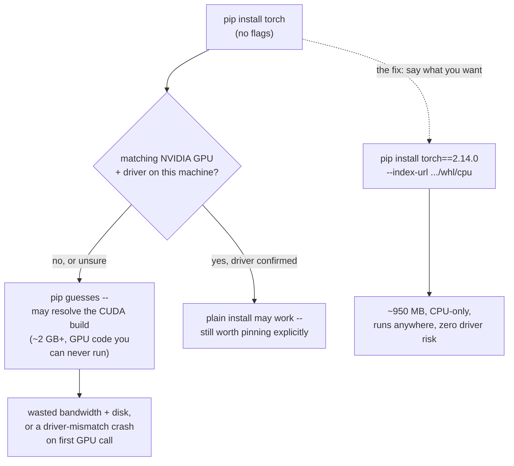
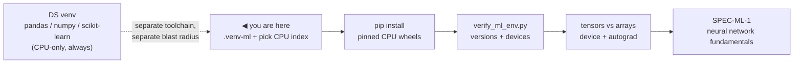
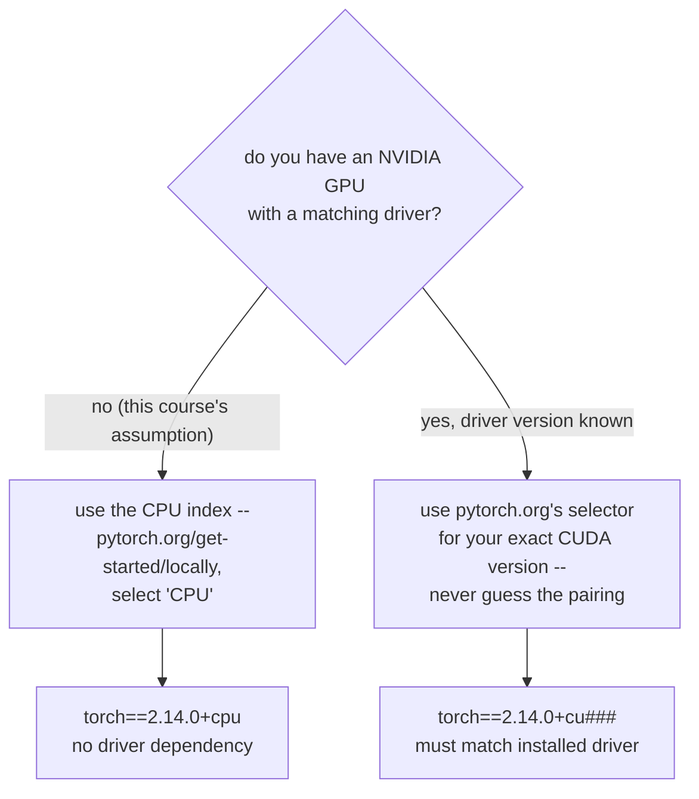
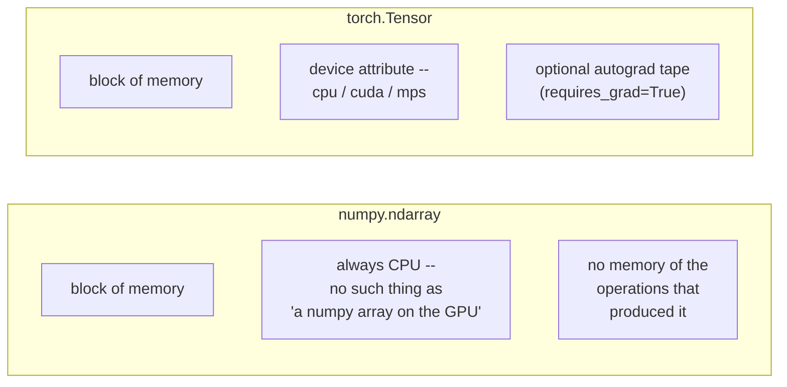
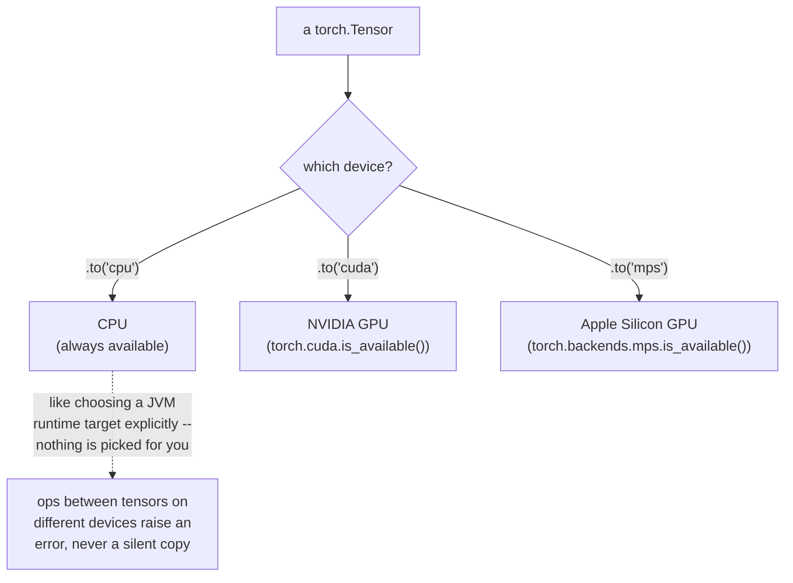
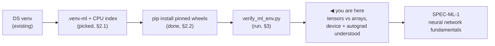

# Local Environment Setup (Machine Learning)

*Machine Learning · Local Environment Setup · SPEC-ML-0*

## The gigabyte you didn't order

Picture the obvious first move: a fresh laptop, no NVIDIA GPU in sight — a standard business
machine — and you type the command every PyTorch tutorial opens with.

```bash
pip install torch
```

You walk off to get coffee. When you get back, `pip list` shows a download that took a while and
landed a couple of gigabytes in `site-packages`. That's not a CPU build — `pip` quietly resolved a
package built to bundle NVIDIA's CUDA runtime and cuDNN libraries, so a GPU-equipped machine can run
PyTorch's kernels with no separate CUDA Toolkit install. Whether the plain command hands you that
CUDA-bundling build or a CPU-only one depends on your OS, and can change release to release
([source: PyTorch forums](https://discuss.pytorch.org/t/index-url-to-install-pytorch/198253),
checked 2026-09-02 — [NOTE-ML-1-torch-install](../../research/NOTE-ML-1-torch-install.md)). On this
laptop, best case, that multi-gigabyte download just sits there, dead weight, because there's no GPU
to run its kernels on — roughly **2 GB+ for a CUDA build against ~950 MB for the CPU-only
equivalent** ([NOTE-ML-1-torch-install](../../research/NOTE-ML-1-torch-install.md)). Worst case, the
machine *does* have an NVIDIA GPU, just with a driver that doesn't match the CUDA version the wheel
was compiled against, and the very first real GPU call raises something like `CUDA driver version is
insufficient for CUDA runtime version` — a problem this chapter's §5 covers in full.

Here's the one-sentence version you could repeat at standup: **`pip` doesn't know whether your
machine has a GPU it can use — leave that unstated, and it guesses, and the guess can cost you
gigabytes or a crash.**

Walk through the fix, step by step — same shape as any dependency-resolution bug you've chased in a
Java build, just with a hardware axis Maven never had to reason about:

**Step 1 — decide what hardware you're targeting.** Every example in this course runs on CPU (§4.3
explains why a GPU is optional here), so the target for this chapter is: CPU, no CUDA, no driver
dependency at all.

**Step 2 — stop letting `pip` guess.** PyTorch publishes a wheel — Python's pre-built package
format, a `.whl` file `pip` downloads and installs directly, no local compilation — through a
**separate index** dedicated entirely to the CPU-only build. Point `pip` at that index explicitly
with `--index-url`, and you get the CPU wheel every time, on every OS, regardless of what the
platform default happens to be this release
([source: PyTorch — Get Started Locally](https://pytorch.org/get-started/locally/), checked
2026-09-02 — [NOTE-ML-1-torch-install](../../research/NOTE-ML-1-torch-install.md)).

**Step 3 — run the real command.** §2 below has it verbatim, pinned to exact versions verified
against PyPI — no guessing, no "whatever's newest today."

**Step 4 — prove it landed.** A version string alone doesn't tell you which build you got. §3's
verification script prints it, along with which compute devices PyTorch can actually see on this
machine.



That's the whole gotcha this chapter opens with. Everything from here sets it up properly: the right
virtualenv, the right install command, a script that proves it worked, and the mental model —
tensors, and the CPU/GPU/CUDA/MPS device they live on — that every later Machine Learning chapter
assumes you already have.

## 1. What & why

You already know the DS toolchain from `pip`/`venv` (or you will, from the Data Science local
environment setup chapter): a virtualenv is an isolated dependency set, `pip install` resolves and
downloads packages, `pip list` shows you what's on the classpath. Deep learning reuses every one of
those mechanics — the difference is *what* gets installed and *how big it is*.

`pip install torch` does not behave like `pip install pandas`. Pandas is a few megabytes of pure
Python plus a compiled extension. PyTorch is a few hundred megabytes to a few *gigabytes*, for
exactly the reason the cold open above just walked through: the package can optionally bundle an
entire copy of NVIDIA's CUDA runtime and cuDNN libraries. That's convenient when you actually have an
NVIDIA GPU. It's a multi-gigabyte waste of bandwidth and disk when you don't — which is why picking
the right install command (§2) is the first thing this chapter gets right, before a single line of
model code.

The Data Science stack (`pandas`, `numpy`, `scikit-learn`, `scipy`) runs entirely on the CPU and
never has to think about "which hardware is this number sitting on." Deep learning is different: the
same matrix multiplication that scikit-learn happily does in a fraction of a second can take minutes
on a CPU for a real neural network, and *hours or days* for anything with millions of parameters.
The two frameworks that make GPU-accelerated deep learning practical in Python — **PyTorch** and
**TensorFlow** — exist specifically to let you write one program and run it on whatever compute is
available: your laptop's CPU today, a rented GPU tomorrow.

### Why a separate venv (`.venv-ml`)

This course keeps deep learning in its own virtualenv, `.venv-ml`, instead of adding it to the same
venv the Data Science chapters use. Two reasons, both of which map onto a decision you've made
before in a Java build:

- **Size and blast radius.** PyTorch, torchvision, and TensorFlow are heavy, native-code-heavy
  dependencies with their own transitive pins (their own required `numpy` range, their own protobuf
  version for TensorFlow, and so on). That's the same reasoning behind pulling a
  native-library-heavy module (say, one wrapping a C++ image codec via JNI) into its own Maven
  module or Gradle subproject with its own dependency set, rather than dragging its huge native
  binaries and version constraints into every other module's classpath.
- **Version churn.** The DL frameworks version-lock to specific CUDA/cuDNN builds and move on
  independent release cycles from the DS stack. Isolating them in `.venv-ml` means bumping PyTorch
  for an ML chapter can never silently break a `scikit-learn` pin three chapters away in Data
  Science — the same instinct as not letting one Maven module's dependency bump ripple through an
  entire multi-module reactor build.

A virtualenv, either way, is still just an isolated `site-packages` directory with its own
interpreter symlink — the same "isolated classpath per project" idea as the DS venv, there are just
now two of them, one per subject's toolchain.



The two boxes on the left are the whole reason this chapter exists as its own toolchain: a fresh
venv, and one install decision that has to be made correctly before anything else in this course's
Machine Learning track will run.

## 2. Install PyTorch, torchvision, and TensorFlow (CPU build)

### 2.1 The gotcha: the CPU wheel needs an explicit index

Run the plain command — `pip install torch`, no other flags — and what you get depends on your OS,
and can change between PyTorch releases: on Linux, the default PyPI wheel bundles CUDA
dependencies; on Windows, the default happens to already be CPU-only
([source: PyTorch forums](https://discuss.pytorch.org/t/index-url-to-install-pytorch/198253),
checked 2026-09-02 — [NOTE-ML-1-torch-install](../../research/NOTE-ML-1-torch-install.md)). Relying
on "whichever one happens to be the default on my machine today" is exactly the kind of
non-reproducible install this course avoids — the fix is the same regardless of platform: PyTorch
publishes a **separate wheel index** dedicated to the CPU-only build, and pointing `pip` at it
explicitly with `--index-url` guarantees the CPU wheel no matter what OS you're on or what the
default happens to be this release
([source: PyTorch — Get Started Locally](https://pytorch.org/get-started/locally/), checked
2026-09-02 — [NOTE-ML-1-torch-install](../../research/NOTE-ML-1-torch-install.md)). The official
selector at that link walks you through OS / package manager / compute platform and hands you back
exactly the command below when you pick "CPU" — always use it rather than guessing your platform's
default.

TensorFlow doesn't have this problem: `pip install tensorflow` installs a CPU-compatible build by
default, no separate index needed
([NOTE-ML-1-torch-install](../../research/NOTE-ML-1-torch-install.md)).



### 2.2 The commands (what you, the reader, run)

Create and activate the dedicated venv first, same mechanics as any other virtualenv:

```bash
python -m venv .venv-ml
# Windows (PowerShell)
.venv-ml\Scripts\Activate.ps1
# macOS / Linux
source .venv-ml/bin/activate
```

Then install the CPU builds, versions pinned exactly as verified against PyPI on 2026-09-02
([NOTE-ML-1-torch-install](../../research/NOTE-ML-1-torch-install.md)):

```bash
pip install torch==2.14.0 torchvision==0.29.0 torchaudio==2.14.0 --index-url https://download.pytorch.org/whl/cpu
pip install tensorflow==2.21.0
```

The `--index-url https://download.pytorch.org/whl/cpu` on the first line is the entire gotcha from
the cold open, written down as a command: leave it off and pip may instead resolve a CUDA-targeted
build — roughly 2 GB+ once torch and torchvision are both downloaded — against a machine that has no
GPU to run it on. With the CPU index, the same two packages come to roughly 250 MB (torch) and
700 MB (torchvision)
([NOTE-ML-1-torch-install](../../research/NOTE-ML-1-torch-install.md)). `torchaudio` is included
here only because PyTorch's own CPU index expects the trio to be installed together at matching
versions; this course's chapters don't use it directly.

TensorFlow needs no index flag — the second line is the whole install.

### 2.3 Environment this chapter is gated against

```text
torch==2.14.0+cpu
torchvision==0.29.0+cpu
numpy==2.5.2
Python 3.13.7
```

Versions verified against PyPI and pytorch.org on 2026-09-02
([NOTE-ML-1-torch-install](../../research/NOTE-ML-1-torch-install.md)). This chapter's code was
executed against a shared ML virtualenv (`.venv-ml`) that already has `torch==2.14.0+cpu` and
`torchvision==0.29.0+cpu` installed — the `+cpu` suffix on the version string *is* the CPU build,
confirming the install landed correctly (see Section 3's captured output). Both packages
support Python 3.10–3.14 and TensorFlow 2.21.0 supports Python 3.10–3.13
([NOTE-ML-1-torch-install](../../research/NOTE-ML-1-torch-install.md)) — this venv's Python 3.13.7
sits inside both ranges. **TensorFlow was not installed in the shared verification venv** for this
chapter's gate run; `verify_ml_env.py` (Section 3) is written to detect and report that gracefully
rather than fail, and the captured output below shows exactly what that looks like. If you follow
the install commands above in your own `.venv-ml`, your own run of the script will print a
`tensorflow version:` line instead.


## 3. Verify: `verify_ml_env.py`

One script, run once, tells you the install worked: it prints every framework's version, reports
which compute devices PyTorch can see, and — because a printed version number doesn't yet prove
you understand what's different about this stack — runs a tiny tensor-vs-numpy-array contrast
(Section 4 explains what it's showing).

```python
"""Verify the ML local environment.

Prints the installed versions of PyTorch, torchvision, NumPy, and (if
present) TensorFlow, reports which compute devices torch can see
(CPU / CUDA / MPS), and runs a tiny tensor-vs-numpy-array contrast that
shows the two things a numpy array does not have: a `device` and autograd.

Run this with the ML virtualenv's interpreter, NOT the default DS one --
this project keeps a separate venv for the deep-learning stack (see the
chapter this script belongs to for why):

    .venv-ml\\Scripts\\python.exe "Machine Learning/Local Environment Setup/code/verify_ml_env.py"   # Windows
    .venv-ml/bin/python "Machine Learning/Local Environment Setup/code/verify_ml_env.py"              # macOS/Linux

Expects (pinned in this chapter, see local-environment-setup.md):
    torch==2.14.0 torchvision==0.29.0 numpy==2.5.2
TensorFlow is optional for this chapter -- the script degrades gracefully
if it is not installed in the active venv.
"""
from __future__ import annotations

import numpy as np
import torch
import torchvision


def print_versions() -> None:
    print(f"torch version:       {torch.__version__}")
    print(f"torchvision version: {torchvision.__version__}")
    print(f"numpy version:       {np.__version__}")

    try:
        import tensorflow as tf  # optional -- not required by this chapter's ACs
    except ImportError:
        print("tensorflow:          not installed in this venv (optional here -- see chapter)")
    else:
        print(f"tensorflow version:  {tf.__version__}")


def print_devices() -> None:
    cuda_available = torch.cuda.is_available()
    mps_available = torch.backends.mps.is_available()
    print(f"torch.cuda.is_available():         {cuda_available}")
    print(f"torch.backends.mps.is_available(): {mps_available}")

    if cuda_available:
        print(f"  CUDA device 0: {torch.cuda.get_device_name(0)}")
    elif mps_available:
        print("  Apple Silicon GPU (MPS) available.")
    else:
        print("  No GPU backend detected on this machine -- tensors default to the")
        print("  CPU device, which is all the examples in these chapters need.")


def tensor_vs_numpy_contrast() -> None:
    print("\n--- numpy array vs. torch tensor ---")

    # A numpy array: a block of memory, always on the CPU, no notion of
    # "device" and no memory of the operations that produced it.
    np_arr = np.array([1.0, 2.0, 3.0])
    print(f"numpy array:  {np_arr}  dtype={np_arr.dtype}")

    # A torch tensor looks the same on the surface, but carries two things
    # numpy arrays never do: a `device` (which piece of hardware the data
    # lives on) and, with requires_grad=True, an autograd tape that records
    # every operation so it can be differentiated later.
    t = torch.tensor([1.0, 2.0, 3.0], requires_grad=True)
    print(f"torch tensor: {t}  dtype={t.dtype}  device={t.device}  requires_grad={t.requires_grad}")

    # autograd in action: torch can differentiate y = sum(t**2) with respect
    # to t automatically. numpy has no equivalent -- you would have to work
    # out and code the derivative (2t) by hand.
    y = (t**2).sum()
    y.backward()
    print(f"y = sum(t**2)     = {y.item()}")
    print(f"dy/dt (t.grad)    = {t.grad}  (expected: 2*t = [2., 4., 6.])")


def main() -> None:
    print("=== Versions ===")
    print_versions()
    print("\n=== Devices ===")
    print_devices()
    tensor_vs_numpy_contrast()


if __name__ == "__main__":
    main()
```

Running it against this chapter's gated environment (`.venv-ml`, Python 3.13.7) prints:

```text
=== Versions ===
torch version:       2.14.0+cpu
torchvision version: 0.29.0+cpu
numpy version:       2.5.2
tensorflow:          not installed in this venv (optional here -- see chapter)

=== Devices ===
torch.cuda.is_available():         False
torch.backends.mps.is_available(): False
  No GPU backend detected on this machine -- tensors default to the
  CPU device, which is all the examples in these chapters need.

--- numpy array vs. torch tensor ---
numpy array:  [1. 2. 3.]  dtype=float64
torch tensor: tensor([1., 2., 3.], requires_grad=True)  dtype=torch.float32  device=cpu  requires_grad=True
y = sum(t**2)     = 14.0
dy/dt (t.grad)    = tensor([2., 4., 6.])  (expected: 2*t = [2., 4., 6.])
```

Two things worth reading closely in that output. First, `torch version: 2.14.0+cpu` — the `+cpu`
local version suffix is torch's own confirmation that the CPU-only build landed, not a CUDA one;
if the index-url gotcha from the cold open and §2.1 had been missed, this line would instead read
something like `2.14.0+cu121`. Second, `torch.cuda.is_available()` and
`torch.backends.mps.is_available()` both report `False` on this machine, which is expected and
*fine* — §4 covers why CPU is enough for everything in this course.

`torch.cuda.is_available()` and `torch.backends.mps.is_available()` are the two APIs PyTorch exposes
for exactly this check: the former queries whether an NVIDIA CUDA-capable GPU and driver are
present, the latter whether Apple's Metal Performance Shaders backend is available (Apple Silicon
Macs only — irrelevant on Windows/Linux, where it always reports `False`)
([source: torch.cuda.is_available docs](https://docs.pytorch.org/docs/stable/generated/torch.cuda.is_available.html),
checked 2026-09-02 — [NOTE-ML-1-torch-install](../../research/NOTE-ML-1-torch-install.md)).


## 4. Tensors vs. numpy arrays: the device/autograd model

On the surface, a `torch.Tensor` and a `numpy.ndarray` look like the same thing: an n-dimensional
array of numbers with a `dtype` and a `shape`. A **tensor** is just PyTorch's name for its array
type — same idea as a numpy array, an n-dimensional grid of numbers, but with two extra properties
bolted on, and both showed up in Section 3's output:



### 4.1 A tensor has a `device`

A numpy array is always, unconditionally, a block of memory on the CPU — there's no such thing as
"a numpy array on the GPU." A torch tensor carries a **device** attribute: which piece of hardware
the data physically lives on and computes on — `cpu`, `cuda` (an NVIDIA GPU, numbered if you have
more than one — `cuda:0`, `cuda:1`, …), or `mps` (Apple Silicon GPU). **CUDA** is NVIDIA's GPU
programming platform — the API and runtime libraries a GPU-accelerated PyTorch build talks to, the
same thing the cold open's "CUDA build" was bundling. You move a tensor between devices explicitly
with `.to(device)`:

```python
import torch

x = torch.tensor([1.0, 2.0, 3.0])          # created on CPU by default
print(x.device)                             # cpu

device = "cuda" if torch.cuda.is_available() else "cpu"
x = x.to(device)                             # explicit move -- no implicit magic
```

There's no exact Java equivalent here, but the closest thing you already do is picking a JVM runtime
target — which JRE, which architecture — for a deployment, except PyTorch makes you pick it per
tensor, explicitly, every time:



PyTorch never silently moves data between devices for you — an operation between a CPU tensor and a
CUDA tensor raises an error, not a silent, slow copy. You place tensors where you want the
computation to happen, on purpose, every time.

### 4.2 A tensor can remember how it was computed (autograd)

This is the property with no numpy analogue at all. Create a tensor with `requires_grad=True` and
every operation performed on it gets recorded onto a computation graph. Call `.backward()` on a
scalar result, and PyTorch walks that graph backwards, applying the chain rule automatically to
compute the gradient of that result with respect to every tensor that fed into it — this is
**autograd**, and it's the mechanism that makes training a neural network (repeatedly nudging
millions of weights in the direction that reduces a loss) tractable without hand-deriving a
derivative for every layer.

Section 3's demo is the smallest possible example: `t = torch.tensor([1., 2., 3.],
requires_grad=True)`, then `y = (t**2).sum()`. Mathematically, `y = t0² + t1² + t2²`, so
`dy/dtᵢ = 2·tᵢ` — and after `y.backward()`, `t.grad` holds exactly `[2., 4., 6.]`, computed by
PyTorch, not typed in by hand. A numpy array has no `.backward()` and no `.grad` — if you needed
that derivative with plain numpy, you'd derive and code it yourself. That gap is the entire reason
deep learning frameworks exist rather than "just use numpy": every layer of a real network chains
into a computation graph like this one, and autograd is what makes backpropagation through millions
of parameters a library call instead of a calculus assignment.

### 4.3 When you actually need a GPU

Nothing above required a GPU, and nothing in this course's chapters will, either — every example
runs on CPU in a few seconds to a couple of minutes. A GPU earns its cost when you're **training** a
network with a large parameter count over a large dataset for many epochs: the matrix multiplies
inside a forward and backward pass parallelize extremely well across a GPU's thousands of cores, and
what takes minutes on a CPU can take seconds on a GPU — a difference that compounds over the
thousands of training steps a real model needs. It's the same shape as any performance decision you
already make in Java: profile before you reach for the expensive tool. Small dataset, small model,
inference-only, or a handful of fine-tuning steps on a pretrained model — CPU is fine, and paying for
a GPU (rented, in the cloud, per the ML curriculum's later "Cloud Environment Setup" chapters) buys
you nothing. Training a CV model from scratch on a large image dataset, or fine-tuning a large
language model — that's where a GPU (or several) stops being optional.



## 5. Pitfalls

- **Mismatched CUDA/torch builds.** If you do have an NVIDIA GPU and install a CUDA-targeted wheel,
  the CUDA version the wheel was built against has to be compatible with your installed NVIDIA
  driver. Install the wrong pairing and you get import-time or runtime errors like "CUDA driver
  version is insufficient for CUDA runtime version" — the failure mode the cold open opened with.
  The fix is always to use the exact command pytorch.org's selector gives you for your actual
  driver, never to guess. This chapter sidesteps the whole problem by using the CPU build, which has
  no driver dependency at all.
- **The giant accidental download.** Forgetting `--index-url https://download.pytorch.org/whl/cpu`
  on a CPU-only machine is the single most common way to burn several gigabytes of bandwidth and disk
  on a build you can't use. If a `pip install torch` is taking unexpectedly long or `pip list` shows
  a `+cu###` suffix on a laptop with no NVIDIA GPU, that's the tell — uninstall and reinstall with
  the CPU index.
- **Mixing environments.** Installing torch/TensorFlow into the same venv the Data Science chapters
  use (or into the machine's global Python) reintroduces exactly the dependency-conflict risk
  Section 1 described — a DL framework's pinned `numpy`/`protobuf` range colliding with the DS
  stack's. Keep `.venv-ml` for deep learning, and the DS venv for everything else.
- **Unpinned installs.** `pip install torch` with no version pin resolves to whatever is newest on
  the day you run it — not reproducible, and liable to silently swap CPU/CUDA defaults between
  releases. Always pin exact versions, as this chapter's commands do.

## 6. Recap & what's next

- Deep learning frameworks (PyTorch, TensorFlow) differ from the DS stack mainly in size and in
  their relationship to hardware: they can optionally bundle GPU runtime libraries, which is why the
  *install command* — not just the package name — matters. That's the whole story behind the cold
  open's "gigabyte you didn't order."
- The CPU wheel needs an explicit `--index-url https://download.pytorch.org/whl/cpu`; skip it and
  you risk downloading a multi-gigabyte CUDA build you can't use. TensorFlow's plain `pip install`
  is CPU by default, no flag needed.
- `.venv-ml` is a separate virtualenv from the DS one for the same reason you'd isolate a
  native-heavy dependency into its own build module: size, blast radius, and independent version
  churn.
- A `torch.Tensor` differs from a `numpy.ndarray` in two ways: it carries an explicit **device**
  (`cpu`/`cuda`/`mps`, moved with `.to()`, never implicitly — like choosing a JVM runtime target
  yourself instead of letting the platform pick), and, with `requires_grad=True`, it tracks the
  operations performed on it so `.backward()` can compute gradients automatically (**autograd**) —
  the mechanism that makes training a network tractable.
- CPU is enough for every chapter in this course; a GPU starts paying for itself only once you're
  training a large model on a large dataset for real, which is what the later cloud chapters cover.


Everything here assumed you can already run a Python script and manage a virtualenv — if that's
still shaky ground, the Data Science local environment setup chapter covers `venv`/`pip` from
scratch with the same Java-analogy grounding used above. From here, the curriculum's next stop is
**SPEC-ML-1 (Theory: neural network fundamentals)** — gradient descent, neurons, and activation
functions — which is where autograd from Section 4 stops being a toy example and starts being the
thing that trains a real model.
