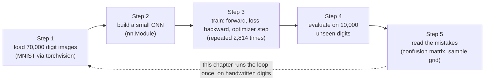
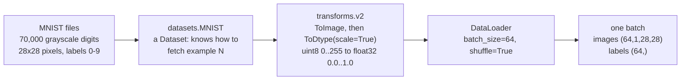
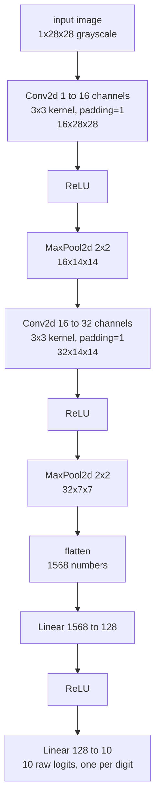
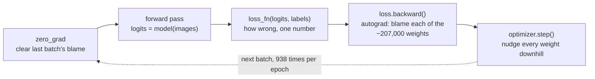
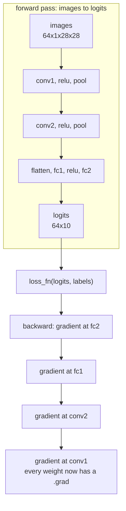
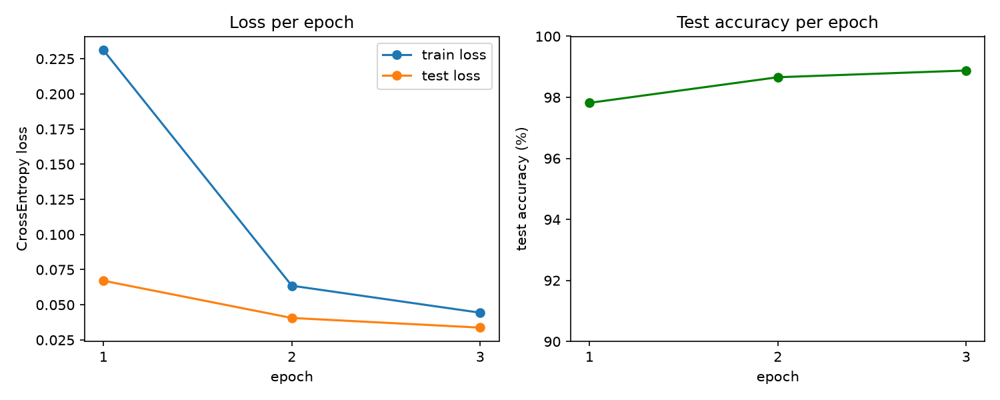
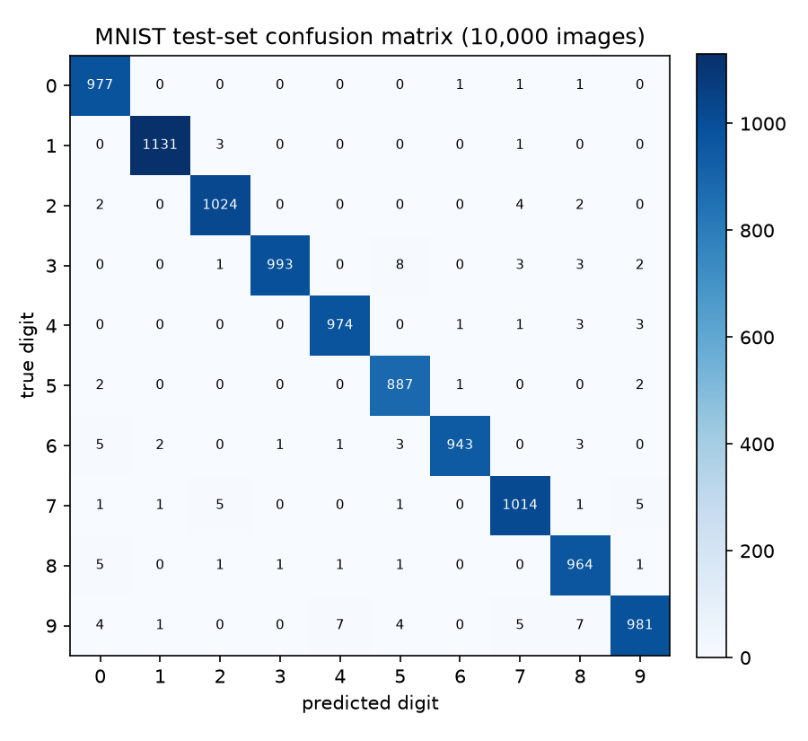
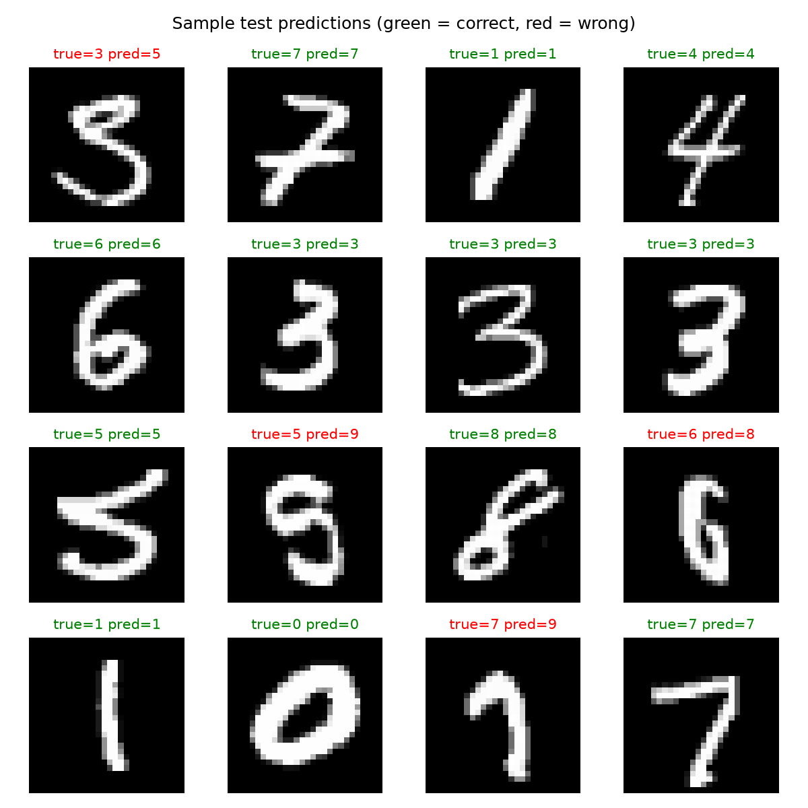

# Image classification — a small CNN on MNIST

*Machine Learning · Worked Examples · Computer Vision · SPEC-ML-4*

## Teaching a machine to read a five

Somewhere in a US Census Bureau office in the early 1990s, an employee filled in a form by hand —
a stray "5," maybe a rushed loop that made it look a little like a "3." Nobody thought twice about
it. That digit, and tens of thousands like it from Census workers and from high-school students in
Bethesda, Maryland, ended up as the raw material for one of the most-cited datasets in the history
of machine learning.

**Yann LeCun, Corinna Cortes, and Christopher J.C. Burges** built the **MNIST database** ("Modified
NIST") before the summer of 1994 by remixing two existing NIST collections — SD-3 (223,125 digits
from Census workers) and SD-7 (58,646 digits from high-schoolers) — because the originals had a
problem for machine learning: NIST had put the neat, easy Census-worker digits in the training set
and the messier student handwriting in the test set. LeCun, Cortes, and Burges shuffled the two
together and normalized every digit to a fixed 28×28-pixel grayscale image, split 60,000 for
training and 10,000 for testing
([source: Wikipedia, "MNIST database"](https://en.wikipedia.org/wiki/MNIST_database), checked
2026-09-03). LeCun's 1998 paper *Gradient-Based Learning Applied to Document Recognition* — the
paper that introduced the LeNet-5 convolutional network whose shape you'll recognize in Section 3 —
used this exact dataset, reporting a support-vector machine that reached 0.8% error on it
([source: Wikipedia, "MNIST database"](https://en.wikipedia.org/wiki/MNIST_database), checked
2026-09-03).

Three decades later, MNIST is still the dataset a new deep-learning framework gets pointed at
first — its "hello world." Not because reading digits is a hard problem any more (this chapter's
own model gets **98.88%** of them right, Section 4), but because it's small enough to train on a
laptop CPU in about a minute while forcing you to write every moving part of a real training
pipeline: load data, define a model, run a training loop, evaluate it. That's the whole shape of
this chapter, and it's the shape every later computer-vision chapter in this course reuses on
harder problems.

Here's the one-sentence version you could repeat at dinner: **teach a computer to recognize a
handwritten digit by showing it tens of thousands of examples and letting it slowly correct its own
mistakes.** The rest of this chapter is that sentence, unpacked one step at a time.



Five words this chapter leans on constantly — plain-language glosses, up front, so nothing is left
unexplained the first time it shows up in code:

| Term | Plain gloss |
|---|---|
| **epoch** | one full pass over all 60,000 training images |
| **batch** | one small group of images (64, here) the model looks at before updating its weights once |
| **loss** | one number: how wrong the model's predictions were on the current batch |
| **optimizer** | the algorithm that nudges every weight a little, in whichever direction would have made that loss smaller |
| **`DataLoader`** | PyTorch's iterator that pages through a dataset in shuffled batches — a `Stream`-like wrapper around a `List`-like `Dataset` |

## 1. What & why

A Java service you write by hand has a control-flow graph you can read: `if fraudScore > 0.8, deny`.
A CNN has no such branches — it has **weights**: millions of `float` values, initialized randomly,
that get nudged a tiny bit after each look at the data until the network's output starts agreeing
with the labels. Training *is* that nudging process, repeated tens of thousands of times — "Step 3"
in the map above, unpacked in full in Section 4. This section maps the rest of the vocabulary onto
things you already know; the rest of the chapter builds it in code.

**Epoch and batch — the Java analogy.** If you've ever written a nightly batch job that streams a
table in JDBC pages of 500 rows, committing after each page, you already understand the mechanic:

- A **batch** is one page of examples (here, 64 images) pulled off the dataset at once. The model
  looks at the whole batch, computes how wrong it was on average, and updates its weights once — not
  once per image. This is why it's called *mini-batch* gradient descent: one weight update per batch,
  not per row and not per full table scan.
- An **epoch** is one full pass over the *entire* training set — every batch, in some (usually
  shuffled) order, seen exactly once. Training for 3 epochs means the model sees each of the 60,000
  training images 3 times total, each time updating its weights a little.

Unlike your JDBC batch job, the "page size" (batch size) and "number of passes" (epochs) are not
determined by the data volume — they're **hyperparameters** you choose, and Section 6 shows what goes
wrong if you choose badly.

**`nn.Module` — the interface you implement.** PyTorch's `torch.nn.Module` is the base class for
every layer *and* every model — think of it as an interface with one abstract method you must
implement, `forward(self, x)`, that says "given an input tensor, produce an output tensor." A `Linear`
layer is a tiny `Module`; the CNN you'll build in Section 3 is a bigger `Module` composed of smaller
ones — composition, the same instinct you already have for composing small, testable Java classes
into a larger service.

**Autograd — the part with no Java equivalent.** When you call `loss.backward()` in Section 4,
PyTorch walks backward through every operation that produced `loss` and computes, automatically, how
much each of the ~207,000 weights contributed to the error — the *gradient*. There is no equivalent
in ordinary Java code; the closest mental model is a build tool computing a dependency graph and then
walking it, except the "graph" here is the sequence of tensor operations your `forward()` method
performed, recorded automatically as they ran.

The rest of this chapter builds, in order: the data pipeline (Section 2), the model (Section 3), the
training loop (Section 4), and the evaluation (Section 5) — the same shape every supervised-learning
chapter in this course will follow, computer vision or not.

### Environment

```text
torch==2.14.0+cpu
torchvision==0.29.0+cpu
matplotlib==3.11.1
numpy==2.5.2
scikit-learn==1.9.0
Python 3.12+
```

Pinned and verified against PyPI on 2026-09-02, install command confirmed against
pytorch.org's official CPU wheel index
([source: NOTE-ML-1-torch-install](../../../research/NOTE-ML-1-torch-install.md)):

```bash
pip install torch==2.14.0 torchvision==0.29.0 torchaudio==2.14.0 --index-url https://download.pytorch.org/whl/cpu
```

This chapter uses a **separate virtualenv** (`.venv-ml`) from the rest of the course, per
SPEC-ML-4's gate — PyTorch and its CUDA/CPU-specific wheel resolution don't mix cleanly into the same
environment as scikit-learn's usual stack. This chapter's code and artefacts were generated and gated
on Python 3.13.7, CPU only (`torch.cuda.is_available()` returns `False` on this machine — no GPU
required or used anywhere in this chapter).

## 2. Data — MNIST via torchvision

**MNIST** is 70,000 grayscale images of handwritten digits (0–9), each 28×28 pixels: 60,000 for
training, 10,000 held out for testing — confirmed by loading the dataset and calling `len()` on it
(below), not assumed. `torchvision.datasets.MNIST` downloads and caches it for you; NOTE-ML-1 flags
that Yann LeCun's original server intermittently returns 403s, so torchvision now pulls from a more
reliable S3 mirror by default
([source: NOTE-ML-1-torch-install](../../../research/NOTE-ML-1-torch-install.md)).

Four moves turn those 70,000 files on disk into shuffled batches of tensors a model can actually
train on — a `Dataset` that knows how to fetch example *N*, a `transform` that converts and rescales
pixels, and a `DataLoader` that pages through the whole thing in shuffled batches:



```python
from pathlib import Path

import torch
from torch.utils.data import DataLoader
from torchvision import datasets
from torchvision.transforms import v2

DATA_DIR = Path("datasets/_downloaded/mnist")

# torchvision.transforms.v2 is the API PyTorch recommends going forward — faster than the
# legacy v1 transforms and the only API getting new features
# (source: https://docs.pytorch.org/vision/0.29/transforms.html, checked 2026-09-02:
# "We recommend using the torchvision.transforms.v2 transforms instead of those in
# torchvision.transforms. They're faster and they can do more things.").
transform = v2.Compose([
    v2.ToImage(),                            # PIL image -> tv_tensors.Image (uint8, CxHxW)
    v2.ToDtype(torch.float32, scale=True),   # uint8 [0, 255] -> float32 [0.0, 1.0]
])

train_dataset = datasets.MNIST(root=str(DATA_DIR), train=True, download=True, transform=transform)
test_dataset = datasets.MNIST(root=str(DATA_DIR), train=False, download=True, transform=transform)

print(f"train examples: {len(train_dataset)}")
print(f"test examples:  {len(test_dataset)}")
image, label = train_dataset[0]
print(f"image shape/dtype: {tuple(image.shape)} {image.dtype}, range [{image.min():.1f}, {image.max():.1f}]")
print(f"label: {label} ({type(label).__name__})")
```

```text
train examples: 60000
test examples:  10000
image shape/dtype: (1, 28, 28) torch.float32, range [0.0, 1.0]
label: 5 (int)
```

Every image comes back as a `(1, 28, 28)` tensor — 1 channel (grayscale; an RGB photo would be 3),
28 rows, 28 columns — and every label is a plain Python `int` in `[0, 9]`. `ToDtype(torch.float32,
scale=True)` is what turns the raw `uint8` pixel bytes (`0`–`255`) into `float32` values in `[0.0,
1.0]`, confirmed empirically above and by the docs
([source: torchvision transforms v2](https://docs.pytorch.org/vision/0.29/transforms.html), checked
2026-09-02: `ToDtype(scale=True)` "performs range conversion (for example, mapping uint8 [0, 255] to
float32 [0, 1])"). Neural networks train far more reliably on small, centered float ranges than on
raw byte values — the numerical equivalent of why you'd normalize a `BigDecimal` column before
feeding it into any statistical calculation.

**`DataLoader`** is the piece that turns a `Dataset` (which only knows how to fetch example *N*) into
an iterable that yields shuffled batches — "combines a dataset and a sampler, and provides an
iterable over the given dataset"
([source: PyTorch data docs](https://docs.pytorch.org/docs/2.14/data.html), checked 2026-09-02).
Java analogy: a `Dataset` is like a `List<Row>` with random access; a `DataLoader` is the
`Stream`-like wrapper that pages through it in shuffled batches.

```python
BATCH_SIZE = 64

train_loader = DataLoader(train_dataset, batch_size=BATCH_SIZE, shuffle=True)
test_loader = DataLoader(test_dataset, batch_size=256, shuffle=False)

images, labels = next(iter(train_loader))
print(f"one training batch: images={tuple(images.shape)}, labels={tuple(labels.shape)}")
```

```text
one training batch: images=(64, 1, 28, 28)
```

`shuffle=True` on the *training* loader means the 60,000 images get reshuffled at the start of every
epoch ([source: PyTorch data docs](https://docs.pytorch.org/docs/2.14/data.html), checked
2026-09-02: `shuffle=True` causes the data to be "reshuffled at every epoch") — this stops the model
from ever learning something about the fixed *order* of the data instead of the digits themselves.
The *test* loader uses `shuffle=False`: order doesn't matter for evaluation, and keeping it fixed
makes the confusion-matrix and sample-prediction code in Section 5 line up predictably with the true
labels.

## 3. Model — a small CNN as `nn.Module`

The architecture: two convolution blocks (convolve → activate → downsample), then two fully connected
layers that turn the final feature map into 10 class scores, one per digit — the classic
conv → relu → pool → fc stack, drawn once here so the code in a moment is just this picture typed
out:



```python
from torch import nn


class MnistCNN(nn.Module):
    def __init__(self) -> None:
        super().__init__()
        # Block 1: 1x28x28 -> 16x28x28 (conv, padding=1 keeps spatial size) -> 16x14x14 (pool)
        self.conv1 = nn.Conv2d(in_channels=1, out_channels=16, kernel_size=3, padding=1)
        # Block 2: 16x14x14 -> 32x14x14 (conv) -> 32x7x7 (pool)
        self.conv2 = nn.Conv2d(in_channels=16, out_channels=32, kernel_size=3, padding=1)
        self.pool = nn.MaxPool2d(kernel_size=2)  # halves H and W each time it's applied
        self.relu = nn.ReLU()
        # Flattened conv output: 32 channels * 7 * 7 spatial positions
        self.fc1 = nn.Linear(in_features=32 * 7 * 7, out_features=128)
        self.fc2 = nn.Linear(in_features=128, out_features=10)  # 10 digit classes

    def forward(self, x: torch.Tensor) -> torch.Tensor:
        x = self.pool(self.relu(self.conv1(x)))  # (B, 1, 28, 28)  -> (B, 16, 14, 14)
        x = self.pool(self.relu(self.conv2(x)))  # (B, 16, 14, 14) -> (B, 32, 7, 7)
        x = torch.flatten(x, start_dim=1)        # (B, 32, 7, 7)   -> (B, 1568)
        x = self.relu(self.fc1(x))               # (B, 1568)       -> (B, 128)
        return self.fc2(x)                       # (B, 128)        -> (B, 10) raw logits


model = MnistCNN()
n_params = sum(p.numel() for p in model.parameters() if p.requires_grad)
print(f"trainable parameters: {n_params:,}")
```

```text
trainable parameters: 206,922
```

Layer by layer:

- **`nn.Conv2d(in_channels=1, out_channels=16, kernel_size=3, padding=1)`** — "applies a 2D
  convolution over an input signal composed of several input planes"
  ([source: torch.nn.Conv2d docs](https://docs.pytorch.org/docs/2.14/generated/torch.nn.Conv2d.html),
  checked 2026-09-02). Concretely: slide sixteen independent 3×3 pattern-detectors across the image;
  each one produces its own 28×28 output "channel" by computing a weighted sum of the 3×3 pixels
  under it at every position (`padding=1` adds a 1-pixel border of zeros first, so the output stays
  28×28 instead of shrinking to 26×26). Early filters tend to learn generic edge/stroke detectors;
  this is the model's equivalent of the low-level feature extraction a fixed image-processing library
  would do by hand, except the 3×3 weights are *learned* from data instead of hand-tuned.
- **`nn.ReLU()`** — the activation function, `f(x) = max(0, x)`. Without a non-linearity between
  layers, stacking `conv1` and `conv2` would collapse mathematically into one bigger linear operation
  — no amount of depth would let the network learn anything a single layer couldn't. ReLU is the
  simplest fix: it zeroes out negative activations and passes positive ones through unchanged,
  cheap to compute and cheap to differentiate.
- **`nn.MaxPool2d(kernel_size=2)`** — "applies a 2D max pooling over an input signal composed of
  several input planes"
  ([source: torch.nn.MaxPool2d docs](https://docs.pytorch.org/docs/2.14/generated/torch.nn.MaxPool2d.html),
  checked 2026-09-02). With a 2×2 window and matching stride, it keeps only the strongest activation
  in each non-overlapping 2×2 block, halving both spatial dimensions (28→14, then 14→7). This makes
  the network cheaper layer by layer *and* gives it some tolerance to a stroke being drawn a couple of
  pixels off-center — exactly the kind of small, irrelevant variation MNIST is full of.
- **`torch.flatten(x, start_dim=1)`** — after the second pool, each image is a `(32, 7, 7)` volume
  (32 feature channels, each 7×7). The two `nn.Linear` layers that follow only understand flat
  vectors, so this reshapes `(B, 32, 7, 7)` into `(B, 1568)` per image, keeping the batch dimension
  (`start_dim=1`) untouched.
- **`nn.Linear(1568, 128)` → `ReLU` → `nn.Linear(128, 10)`** — an ordinary fully connected network on
  top of the extracted features, ending in exactly 10 outputs: one raw score ("logit") per digit
  class. **These are not probabilities yet** — no softmax is applied inside `forward()`. Section 4
  explains why that's deliberate, not an oversight.

**~207,000 trainable parameters** — every weight and bias in every `Conv2d` and `Linear` layer above,
counted directly from the instantiated model, not estimated. That's the number `optimizer.step()`
adjusts, a little, after every single batch in Section 4.

## 4. Train — the loop, line by line

Here's the question every ML-1/ML-2 theory chapter has been building toward, and the one this
section finally answers with running code: **how does a network actually learn to read a digit?**
Not "what is a gradient" in the abstract — what actually happens, one line at a time, between a
randomly-initialized model that gets everything wrong and a model that's right 98.88% of the time?

The answer is a four-step cycle, repeated once per batch:

1. **Forward pass** — show the model a batch of images; it guesses, badly at first (Section 3's
   `forward()` method, called once).
2. **Loss** — measure exactly how wrong those guesses were, as one number.
3. **Backward pass** — work out how much *each* of the ~207,000 weights is to blame for that number.
4. **Optimizer step** — nudge every weight a little, in the direction that would have made the loss
   smaller.

Then repeat, on the next batch — 938 times per epoch, for 3 epochs, 2,814 nudges in total. That
loop, running unattended, is what turns a useless random model into a 98.88%-accurate one. Here's
the cycle as a picture, before it's code:



This is the part with no direct Java equivalent, so each line of the actual code gets its own
explanation below.

```python
from torch import optim

EPOCHS = 3
LEARNING_RATE = 1e-3

loss_fn = nn.CrossEntropyLoss()
optimizer = optim.Adam(model.parameters(), lr=LEARNING_RATE)

for epoch in range(1, EPOCHS + 1):
    model.train()
    for images, labels in train_loader:
        optimizer.zero_grad()
        logits = model(images)
        loss = loss_fn(logits, labels)
        loss.backward()
        optimizer.step()
```

- **`nn.CrossEntropyLoss()`** — "this criterion computes the cross entropy loss between input logits
  and target," and is "equivalent to applying `LogSoftmax` on an input, followed by `NLLLoss`"
  ([source: torch.nn.CrossEntropyLoss docs](https://docs.pytorch.org/docs/2.14/generated/torch.nn.CrossEntropyLoss.html),
  checked 2026-09-02). In plain terms: it takes the model's 10 raw logits, internally turns them into
  a probability distribution over the 10 classes (softmax), and scores how far that distribution was
  from the true label — a bigger number when the model was confidently wrong, close to zero when it
  was confidently right. **This is exactly why `forward()` in Section 3 returns raw logits, not
  softmax output** — `CrossEntropyLoss` applies the softmax *for* you, and applying it twice (once in
  the model, once in the loss) is a real, common bug covered in Section 6.
- **`optim.Adam(model.parameters(), lr=1e-3)`** — "implements Adam algorithm"
  ([source: torch.optim.Adam docs](https://docs.pytorch.org/docs/2.14/generated/torch.optim.Adam.html),
  checked 2026-09-02), an adaptive variant of gradient descent that keeps a running estimate of each
  parameter's typical gradient size and scales its updates accordingly — in practice, a solid default
  that converges faster and needs less learning-rate tuning than plain SGD, which is why it's the
  default choice for a first CNN like this one. `lr=1e-3` (0.001) is Adam's own documented default
  value, kept as-is rather than tuned — SPEC-ML-4 scopes hyperparameter search out of this chapter.
- **`optimizer.zero_grad()`** — must run *before* every batch's `backward()` call. PyTorch
  accumulates gradients into each parameter's `.grad` by default rather than replacing them:
  "this function accumulates gradients in the leaves — you might need to zero `.grad` attributes...
  before calling it"
  ([source: torch.Tensor.backward docs](https://docs.pytorch.org/docs/2.14/generated/torch.Tensor.backward.html),
  checked 2026-09-02). Skip this line and every batch's gradient silently piles on top of the last —
  Section 6 shows what that does to training.
- **`logits = model(images)`** — the forward pass. Calling `model(images)` invokes `MnistCNN.forward`
  from Section 3 and returns a `(64, 10)` tensor: 10 raw scores per image in the batch.
- **`loss = loss_fn(logits, labels)`** — one scalar number: how wrong the model was on this batch,
  averaged over all 64 images (`CrossEntropyLoss`'s default reduction).
  `labels` here is a `(64,)` tensor of integer class indices (`0`–`9`) — the "class indices" target
  format `CrossEntropyLoss` expects, dtype `long`, as opposed to full one-hot probability vectors
  (also supported, but not what `DataLoader` hands you from an integer-labeled dataset like this one)
  ([source: torch.nn.CrossEntropyLoss docs](https://docs.pytorch.org/docs/2.14/generated/torch.nn.CrossEntropyLoss.html),
  checked 2026-09-02).
- **`loss.backward()`** — autograd (Section 1) walks backward from `loss` through every operation
  that produced it — both `Linear` layers, both `Conv2d` layers, the pooling and activations in
  between — and writes a gradient into every parameter's `.grad`, all in this one call.
- **`optimizer.step()`** — applies one Adam update to every parameter, using the gradients
  `.backward()` just computed. This is the line that actually changes the ~207,000 weights.

**`model.train()`** before the loop is a mode switch, not a training step by itself — it tells layers
like dropout/batch-norm (this particular model has neither, but the habit is universal) to behave in
training mode. Section 6 covers its evaluation-time counterpart, `model.eval()`.

**Forward and backward, side by side.** `forward()` runs top to bottom through Section 3's layers to
produce `logits`; `loss.backward()` then walks back through that *exact same chain of operations*,
in reverse, leaving a gradient at every layer it passes through:



Autograd is what makes the bottom half of that picture automatic — you write the forward pass once,
in ordinary Python, and PyTorch derives the entire backward pass from it. There's nothing to
hand-code and nothing resembling it in typical Java code.

### Running it — watch it get smarter, epoch by epoch

The full script (`code/mnist_cnn.py`) wraps this loop with per-epoch evaluation and seeds every
source of randomness — Python's `random`, NumPy, and PyTorch — with `SEED = 42`, so the numbers below
reproduce exactly on any machine running the pinned CPU wheels:

```bash
.venv-ml/Scripts/python.exe "Machine Learning/Worked Examples/computer-vision/code/mnist_cnn.py"
```

Actual run log, unedited — watch the loss column fall and the accuracy column climb, together,
across all three epochs:

```text
Device: cpu
Trainable parameters: 206,922
Train batches/epoch: 938 (batch size 64)
epoch 1/3  train_loss=0.2311  test_loss=0.0671  test_accuracy=0.9782
epoch 2/3  train_loss=0.0636  test_loss=0.0406  test_accuracy=0.9866
epoch 3/3  train_loss=0.0444  test_loss=0.0338  test_accuracy=0.9888
Training wall-clock: 61.9s on cpu
```

938 batches per epoch (60,000 images ÷ 64 per batch, rounded up) × 3 epochs = 2,814 total weight
updates, done in **under 62 seconds on CPU** — no GPU anywhere in this chapter. Training loss falls
every epoch (0.231 → 0.064 → 0.044) and test accuracy climbs alongside it
(97.82% → 98.66% → 98.88%) — both moving together is the first, cheapest sanity check that training
is actually working: if training loss falls while test accuracy stagnates or drops, that's
overfitting (a topic ML-1/ML-2 cover in theory; not reproduced here since this run doesn't exhibit
it).



Both loss curves fall together and test accuracy climbs monotonically across all 3 epochs — exactly
the shape you want to see, and the opposite of what Section 6's forgotten-`zero_grad` pitfall
produces.

## 5. Evaluate — accuracy, confusion matrix, sample predictions

Evaluation reuses the trained model but changes two things: `model.eval()` instead of `model.train()`,
and every forward pass wrapped in `torch.no_grad()`.

```python
def evaluate(model, loader, loss_fn):
    model.eval()
    total_loss, correct, total = 0.0, 0, 0
    with torch.no_grad():
        for images, labels in loader:
            logits = model(images)
            loss = loss_fn(logits, labels)
            total_loss += loss.item() * images.size(0)
            predicted = logits.argmax(dim=1)
            correct += (predicted == labels).sum().item()
            total += labels.size(0)
    return total_loss / total, correct / total


final_test_loss, final_test_acc = evaluate(model, test_loader, nn.CrossEntropyLoss())
print(f"Final test accuracy: {final_test_acc:.4f} (test loss {final_test_loss:.4f})")
```

```text
Final test accuracy: 0.9888  (test loss 0.0338)
Misclassified: 112 / 10000
```

**`torch.no_grad()`** turns off autograd's bookkeeping for everything inside the block. Training needs
that bookkeeping to compute gradients; evaluation only needs a forward pass, so running it disables
gradient tracking, which is both faster and uses less memory — there's nothing to `.backward()`
through at evaluation time. **`logits.argmax(dim=1)`** turns the 10 raw scores per image into a single
predicted digit — the index of the largest logit. Note this works *without* ever computing softmax:
softmax is monotonic, so whichever logit is largest is also whichever probability would be largest —
one more reason `forward()` doesn't bother computing it.

**98.88% test accuracy** — 9,888 of 10,000 held-out digits classified correctly, comfortably above
the ≥97% bar SPEC-ML-4 sets, and on data the model never trained on.

### Confusion matrix

`sklearn.metrics.confusion_matrix(y_true, y_pred)` returns an `(n_classes, n_classes)` matrix
([source: NOTE-9-classification-metrics-apis](../../../research/NOTE-9-classification-metrics-apis.md)),
extended here from 2×2 (binary, as in SPEC-DS-6) to the full 10×10 digit case:

```python
import numpy as np
from sklearn.metrics import confusion_matrix


def collect_predictions(model, loader):
    """Run the model over every batch in `loader`; return true and predicted labels as arrays."""
    model.eval()
    all_labels, all_preds = [], []
    with torch.no_grad():
        for images, labels in loader:
            preds = model(images).argmax(dim=1)
            all_labels.append(labels)
            all_preds.append(preds)
    return torch.cat(all_labels).numpy(), torch.cat(all_preds).numpy()


y_true, y_pred = collect_predictions(model, test_loader)
cm = confusion_matrix(y_true, y_pred, labels=list(range(10)))
print(cm.diagonal())  # correct-prediction count per digit class
```

```text
[977 1131 1024 993 974 887 943 1014 964 981]
```



Read row *i*, column *j* as "how many digits whose true label was *i* got predicted as *j*." The
diagonal — correct predictions — dominates completely: `[977, 1131, 1024, 993, 974, 887, 943, 1014,
964, 981]` digits correct per class 0–9, out of roughly 1,000 test examples per class. The single
largest off-diagonal cell in the whole matrix is **`3` misread as `5`: 8 of the 1,010 true `3`s**
(computed directly from the printed matrix above) — the exact confusion the sample-prediction grid
below happens to catch. Digit `9` is the most-confused class overall, scattering into `8`, `4`, and
`7` (7 test images apiece) — genuinely the kind of stroke-shape overlap a human skimming quickly would
also mis-read, not an arbitrary model quirk.

### Sample predictions

A grid of individual predictions, drawn from the actual test set — 12 chosen at random plus 4
deliberately pulled from the 112 misclassified images, interleaved, so the artefact shows real
failure cases instead of only the easy 98.88% that got it right:



One of the red (wrong) examples is the `3` misread as `5` — the same pair identified above as the
single largest off-diagonal cell in the whole confusion matrix, caught here as an actual image instead
of just a number in a table: genuinely messy, open-topped handwriting that a human reader would also
pause on. **The model's mistakes aren't random noise; they land on real, visually ambiguous strokes**
— evidence the CNN is learning something like actual stroke-shape structure, not memorizing arbitrary
pixel patterns.

## 6. Pitfalls

- **Forgetting `model.eval()` and `torch.no_grad()` at evaluation time.** This model has no dropout
  or batch-norm layers, so skipping `.eval()` wouldn't change its *predictions* here — but skipping
  `torch.no_grad()` still wastes memory and time building an autograd graph for a forward pass you're
  never going to call `.backward()` on. On a model that *does* use dropout/batch-norm (most real CNNs
  do), skipping `.eval()` also silently changes predictions between runs, because dropout randomly
  zeroes activations only in training mode — a classic "why is my evaluation nondeterministic" bug.
- **Forgetting `optimizer.zero_grad()`.** Because PyTorch accumulates gradients by default
  (Section 4), omitting this line means each batch's gradient adds on top of every previous batch's
  gradient in the same epoch, instead of reflecting only the current batch. The model still runs
  without erroring — it just trains on a corrupted, ever-growing gradient signal, degrading quietly
  rather than crashing loudly. There is no compiler warning for this; it has to be caught by eye or
  by a stalled/erratic loss curve.
- **Applying softmax before `CrossEntropyLoss`.** Because `CrossEntropyLoss` already applies
  `LogSoftmax` internally, adding your own `nn.Softmax()` at the end of `forward()` — a natural
  instinct if you're thinking "the output should be a probability" — softmaxes twice. The loss still
  computes a number and training still runs, just against artificially flattened, over-confident-then-
  under-confident gradients, producing a model that trains more slowly and converges to a worse
  optimum than the same architecture without the extra layer. Keep `forward()` returning raw logits;
  only apply softmax explicitly (e.g. `torch.softmax(logits, dim=1)`) at inference time, if you need
  actual probabilities to show a user.
- **Wrong label dtype/shape for `CrossEntropyLoss`.** It expects integer class indices (dtype
  `long`), shape `(batch_size,)` — not one-hot vectors and not `float`. `DataLoader` reading directly
  from an integer-labeled `Dataset` (as here) gets this right automatically; the failure mode shows up
  when labels are built by hand (e.g. from a CSV) and end up as `float32` or already one-hot encoded,
  which either errors immediately or silently computes the wrong loss depending on the exact shape
  mismatch.
- **Not seeding.** Weight initialization, `DataLoader`'s `shuffle=True`, and (on some architectures)
  layer behavior are all stochastic. Without `torch.manual_seed(42)` (and matching seeds for
  `random`/`numpy`, since torchvision's transforms and Python-level shuffling can touch both), rerunning
  this exact script would train a *different* set of ~207,000 initial weights and see batches in a
  different order — landing at a different final accuracy every time, and making a claimed number like
  "98.88%" unreproducible. This chapter's script seeds all three before doing anything else; rerunning
  it (Section 4) reproduced 98.88% exactly, confirmed by running it twice.

## 7. Recap & what's next

- **Epoch/batch, `nn.Module`, and autograd** are the three concepts with the least Java-side overlap
  — Section 1 mapped batch/epoch onto a JDBC paging job and `nn.Module` onto a composable interface;
  autograd (the automatic backward walk through every tensor operation in `forward()`) has no direct
  equivalent and is the one genuinely new idea.
- **The training loop is a four-step cycle that repeats every batch:** forward pass (`model(images)`)
  → loss (`loss_fn(logits, labels)`, how wrong) → backward pass (`loss.backward()`, autograd assigns
  blame to each of the ~207,000 weights) → optimizer step (`optimizer.step()`, nudge every weight
  downhill) — preceded each time by `zero_grad()`. Miss that first line and gradients silently
  accumulate across batches; that's Section 6's single most common real bug.
- **A small CNN (2 conv blocks + 2 FC layers, ~207K parameters) reached 98.88% test accuracy in 3
  epochs and under 62 seconds, entirely on CPU** — the actual run log is reproduced verbatim in
  Section 4, and the model, loss curve, confusion matrix, and sample-prediction artefacts in
  `artefacts/` all came from that same run.
- **`CrossEntropyLoss` expects raw logits, not softmax output** — it applies `LogSoftmax` internally,
  which is why `forward()` in Section 3 deliberately stops at the final `Linear` layer.
- **The confusion matrix's largest error (`3` misread as `5`, 8 occurrences) and the misclassified
  examples shown in the sample-prediction grid aren't random** — they're genuinely ambiguous
  handwriting, the kind a human reader would also hesitate on.

**SPEC-ML-5** (object detection on COCO classes) is the natural next step: this chapter answered "what
digit is in this image" for one object filling the whole frame; ML-5 moves to "what objects are in
this image, and *where*" — running a pretrained detector to draw real bounding boxes, before ML-7
covers the metrics (IoU, mAP) needed to judge how good those boxes are.

---

### Environment note (for the architect)

No discrepancies against NOTE-ML-1's evidence table. `torch.cuda.is_available()` returned `False` on
the gate machine, confirming CPU-only execution end to end — no GPU code path was exercised or is
required to reproduce this chapter. Five library-behavior claims not covered by NOTE-ML-1's evidence
table (`nn.Conv2d`, `nn.MaxPool2d`, `nn.CrossEntropyLoss`'s LogSoftmax+NLLLoss equivalence and target
format, `optim.Adam`'s default `lr`, gradient accumulation in `.backward()`/`zero_grad()`, and
`DataLoader`'s shuffle-per-epoch behavior) were grounded directly against the official PyTorch 2.14
docs at `docs.pytorch.org/docs/2.14/...` (checked 2026-09-02, matching the pinned installed version)
rather than left as memory-only claims; `confusion_matrix`'s signature was grounded via the existing
NOTE-9-classification-metrics-apis (shared with the Data Science chapters, same scikit-learn 1.9.0
installed here). MNIST's 60,000/10,000 train/test split and the `(1, 28, 28)` image shape were not
asserted from memory — both are printed directly from the loaded dataset in Section 2's code output.
The sample-predictions grid was deliberately built to include 4 real misclassified images (not a pure
random sample) so the artefact demonstrates actual model failure modes rather than risking an
all-correct grid, which a random sample of 16 from a 98.88%-accurate model has a non-trivial chance of
producing. The trained weights (`artefacts/mnist_cnn.pt`, ~830 KB) are committed as a convenience but
are fully regenerable — `*.pt` is gitignored — by rerunning `code/mnist_cnn.py`, which reproduces
identical numbers given the fixed seed (verified by running the script twice; both runs produced
`test_accuracy=0.9888` and an identical confusion matrix).

**Restyle note (2026-09-03):** this chapter was restyled into the storytelling/heavy-visual house
style (`docs/style-guide.md`). Every `python` code block, artefact reference, and real number
(accuracy, epochs, wall-clock, loss values, parameter counts) is unchanged from the prior version —
only prose structure and five new Mermaid diagrams were added. The one genuinely new claim introduced
by the restyle is the MNIST/LeCun origin story in the cold open (creators, SD-3/SD-7 source data,
1994 construction date, the 1998 LeNet-5 paper's 0.8% SVM error rate), grounded inline against
[Wikipedia, "MNIST database"](https://en.wikipedia.org/wiki/MNIST_database) (checked 2026-09-03) —
Yann LeCun's own MNIST page (`yann.lecun.com/exdb/mnist`) was attempted first but was unreachable
(connection refused) from this environment at the time of writing, so Wikipedia was used as the
authoritative fallback per the style guide's inline-citation allowance; no NOTE was produced for this
single-fact historical claim since it does not affect any runnable code, version, or metric.
