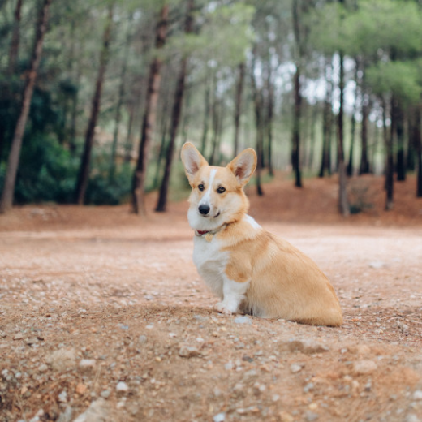
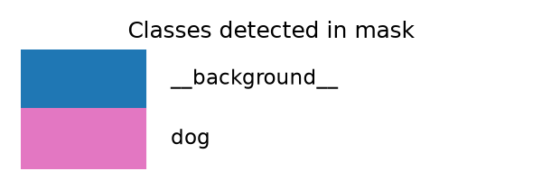

# Semantic segmentation — pretrained models, pixel-wise labels

*Machine Learning · Worked Examples · Computer Vision · SPEC-ML-6*

ML-5 drew a box around a dog: "there is a `dog` somewhere inside these four coordinates." That's
enough for a lot of applications, but not for all of them. A self-driving car needs to know exactly
which pixels are *road* versus *sidewalk*, not a rectangle that contains both. A radiologist's
tool needs the exact outline of a tumor, not a bounding box that also covers healthy tissue next to
it. **Semantic segmentation** answers a stricter question than detection: not "where's the box", but
"for every single pixel in this image, which class is it?"

This chapter runs a pretrained segmentation model — no training, same honest scoping as ML-5 — turns
its output into a coloured mask over a real photo, and explains the two numbers (pixel accuracy,
mIoU) that decide whether a segmentation model is actually any good.

## 1. What & why

Think of detection's output as a `List<BoundingBox>` — a handful of rectangles, each tagged with a
class and a confidence. Segmentation's output is a completely different shape: one class label
*per pixel*. For a 520×520 image, that's 270,400 individual classifications, one per pixel, done in
a single forward pass — not 270,400 separate model calls, but one dense prediction over the whole
grid at once.

The Java-side mental model: if detection is `List<BoundingBox>` (sparse — most of the image has no
entry at all), segmentation is closer to a `byte[][]` the same size as the image, where every cell
holds a class id. Nothing is skipped; every pixel gets an answer, including the pixels that are just
"background" or "sky" or "road" — classes nobody would draw a bounding box around, but that
segmentation still has to classify correctly.

Where this shows up in practice: medical imaging (outlining a lesion, not boxing it), autonomous
driving (road/lane/pedestrian pixel maps, informing exactly where the car can steer), satellite
imagery (crop vs. non-crop land, flood extent), and photo/video editing tools (the "remove
background" button in every phone camera app is a segmentation model under the hood).

## 2. Semantic vs. instance vs. panoptic segmentation

Three related but distinct pixel-labelling tasks share the word "segmentation" — worth being precise
about which one a given model or paper means, since the outputs and evaluation are genuinely
different:

| Task | Question answered | Two dogs standing next to each other |
|---|---|---|
| **Semantic segmentation** | "What class is this pixel?" | Both dogs' pixels get the *same* label, `dog` — no way to tell them apart |
| **Instance segmentation** | "What class, and *which individual object*, is this pixel?" | Dog #1's pixels and dog #2's pixels get distinct instance ids, both still labelled `dog` |
| **Panoptic segmentation** | Both of the above, unified — every pixel gets a class, and object-class pixels also get an instance id | Combines a semantic map (`road`, `sky`, `grass` — classes with no countable instances) with instance segmentation (`dog #1`, `dog #2` — countable objects) |

This chapter is **semantic only** — the model below assigns one class per pixel and has no concept
of "this is a *different* dog than that one." If you need to count or separately outline
individual objects, that's instance segmentation (a different model family, e.g. Mask R-CNN,
out of scope here); if you need both a full-scene map *and* separate object instances in one model,
that's panoptic segmentation. Both are mentioned for orientation only — SPEC-ML-6 scopes this
chapter to the per-pixel-class case, which is also the simplest one to reason about and the one
`torchvision.models.segmentation` ships pretrained weights for.

## 3. Run a pretrained model

### Environment

```text
torch==2.14.0+cpu
torchvision==0.29.0+cpu
matplotlib==3.11.1
numpy==2.5.2
Python 3.12+
```

Same pinned, verified versions and the same separate `.venv-ml` virtualenv as ML-4/ML-5
([source: NOTE-ML-1-torch-install](../../../research/NOTE-ML-1-torch-install.md);
[source: NOTE-ML-5-torchvision-detection-seg](../../../research/NOTE-ML-5-torchvision-detection-seg.md)).
This chapter's code and artefacts were generated and gated on Python 3.13.7, CPU only
(`torch.cuda.is_available()` returns `False` on this machine).

### Load the model

`torchvision.models.segmentation` ships several pretrained architectures; this chapter uses
**DeepLabV3 with a ResNet-50 backbone**, loaded the same `weights=` enum way as ML-5's detector
([source: NOTE-ML-5-torchvision-detection-seg](../../../research/NOTE-ML-5-torchvision-detection-seg.md)):

```python
from torchvision.models.segmentation import DeepLabV3_ResNet50_Weights, deeplabv3_resnet50

weights = DeepLabV3_ResNet50_Weights.DEFAULT
categories = weights.meta["categories"]
print(weights)
print(len(categories), categories)

model = deeplabv3_resnet50(weights=weights, progress=True)
model.eval()  # inference mode: turns off dropout/batchnorm training behaviour, same as ML-4/ML-5
```

```text
DeepLabV3_ResNet50_Weights.COCO_WITH_VOC_LABELS_V1
21 ['__background__', 'aeroplane', 'bicycle', 'bird', 'boat', 'bottle', 'bus', 'car', 'cat',
'chair', 'cow', 'diningtable', 'dog', 'horse', 'motorbike', 'person', 'pottedplant', 'sheep',
'sofa', 'train', 'tvmonitor']
```

`DEFAULT` resolved to `COCO_WITH_VOC_LABELS_V1` — trained on the subset of COCO images that overlap
Pascal VOC's 20 object categories, relabelled with VOC's category ids
([source: NOTE-ML-5-torchvision-detection-seg](../../../research/NOTE-ML-5-torchvision-detection-seg.md);
verified live against the installed `torchvision==0.29.0+cpu` above, not assumed). Index `0` is
always `__background__` — "no object class here" — and indices `1`–`20` are the 20 real classes. This
is a **21-class** model, deliberately much smaller than COCO's 80 detection classes ML-5 used: fewer
classes the model has to get right per pixel, and VOC's category set (people, vehicles, animals,
household furniture) is the one this particular pretrained checkpoint was trained against
([source: torchvision docs](https://docs.pytorch.org/vision/0.29/models/generated/torchvision.models.segmentation.deeplabv3_resnet50.html),
checked 2026-09-02). A different segmentation checkpoint (e.g. one trained on Cityscapes for
autonomous driving) would have a different class list entirely — always read it from
`weights.meta["categories"]`, never hardcode it.

First call to `deeplabv3_resnet50(weights=...)` downloads the weights (~160 MB) to the torch hub
cache and needs internet once; every run after that loads from disk
([source: NOTE-ML-5-torchvision-detection-seg](../../../research/NOTE-ML-5-torchvision-detection-seg.md)).

### Run inference and argmax the logits into a mask

The sample photo is the **same image ML-5's detector ran on** — `dog1.jpg`, the exact file
torchvision's own visualization-utilities tutorial uses
([source: torchvision visualization tutorial](https://docs.pytorch.org/vision/stable/auto_examples/others/plot_visualization_utils.html),
checked 2026-09-02; raw file at
[github.com/pytorch/vision/.../gallery/assets/dog1.jpg](https://raw.githubusercontent.com/pytorch/vision/main/gallery/assets/dog1.jpg),
BSD-3-Clause licensed repository, checked 2026-09-02) — so you can compare ML-5's bounding box
against this chapter's per-pixel mask on the identical picture.

```python
import torch
from torchvision.io import decode_image

image_uint8 = decode_image("dog1.jpg")           # (3, H, W) uint8, RGB
preprocess = weights.transforms()                 # exact resize/normalise this model trained with
batch = preprocess(image_uint8).unsqueeze(0)       # (1, 3, 520, 520)

with torch.no_grad():
    output = model(batch)                          # dict, not a plain tensor
    logits = output["out"]                          # (1, num_classes=21, 520, 520)

mask = logits.argmax(dim=1).squeeze(0)              # (520, 520) int64, one class id per pixel
```

```text
Input image: (3, 500, 500) -> mask (520, 520)
```

Three things worth being deliberate about here, because each is a documented pitfall in Section 5:

- **The model returns a `dict`, not a tensor.** `model(batch)` for a torchvision segmentation
  model returns `{"out": <logits>}` — and for some architectures also an `"aux"` auxiliary-loss
  output during training. Always index `["out"]`
  ([source: NOTE-ML-5-torchvision-detection-seg](../../../research/NOTE-ML-5-torchvision-detection-seg.md)).
  This is a different shape than ML-5's detector, which returns a `dict` *per image* with
  `"boxes"`/`"labels"`/`"scores"` keys — same "dict output" habit, different keys, worth checking
  every time you switch model family.
- **`weights.transforms()`, not hand-rolled preprocessing.** It resizes the shortest side to 520px
  and normalizes with ImageNet's mean/std (`[0.485, 0.456, 0.406]` / `[0.229, 0.224, 0.225]`) —
  printable directly from `weights.transforms()`, which is exactly what this chapter's grounding
  used instead of hardcoding those numbers. Using the wrong normalization silently produces a
  *plausible-looking but wrong* mask — the model still runs, it just runs on statistically wrong
  input, addressed further in Section 5.
- **`argmax(dim=1)` on logits, not probabilities.** Exactly the same reasoning as
  `mnist_cnn.py`'s evaluation step: softmax is monotonic, so whichever channel has the highest raw
  logit also has the highest probability. No need to `softmax` first just to find the winner —
  only do that extra step if you need the actual confidence number, not just the winning class.

### Visualise: overlay + legend

`torchvision.utils.draw_segmentation_masks` "draws segmentation masks on given RGB image" and takes
"a `(num_masks, H, W)` bool tensor" — one plane per class to draw, plus an `alpha` blend factor and
a colour per plane
([source: torchvision.utils.draw_segmentation_masks docs](https://docs.pytorch.org/vision/0.29/generated/torchvision.utils.draw_segmentation_masks.html),
checked 2026-09-02):

```python
from torchvision.utils import draw_segmentation_masks

present_classes = torch.unique(mask).tolist()                       # which classes actually appear
bool_masks = torch.stack([mask == c for c in present_classes])       # (K, H, W) bool, one per class

overlay = draw_segmentation_masks(image_resized, masks=bool_masks, alpha=0.6, colors=colors)
```

Running the full script (`code/segmentation_infer.py`) end to end, unedited run log:

```text
Device: cpu
Weights: DeepLabV3_ResNet50_Weights.COCO_WITH_VOC_LABELS_V1
Category list length: 21
Input image: (3, 500, 500) -> mask (520, 520)
Classes present in mask (270400 px total):
   0: __background__  246663 px  (91.22%)
  12: dog              23737 px  ( 8.78%)
Wrote .../artefacts/segmentation_overlay.png
Wrote .../artefacts/segmentation_original.png
Wrote .../artefacts/segmentation_legend.png
```

Out of all 21 possible classes, only **two** actually appear in this image's mask:
`__background__` (91.22% of pixels) and `dog` (8.78% of pixels) — the model correctly found nothing
resembling a bicycle, a train, or a sofa in a photo of a dog on a gravel path, and that "nothing
here" is itself a real, useful prediction (every one of those 246,663 background pixels was
individually classified as *not* any of the 20 object classes, not just left blank).






The dog's outline in the overlay follows the corgi's real silhouette closely — ears, snout, the
gap between the front legs and the body are all visible in the mask boundary — evidence the model
is doing genuine per-pixel classification, not just recognizing "there's a dog somewhere" the way
detection's bounding box would.

## 4. Metrics — pixel accuracy vs. mIoU

**Pixel accuracy** is the simplest possible segmentation metric: of all the pixels in the image,
what fraction did the model classify correctly? It's the direct per-pixel analogue of the
classification accuracy `mnist_cnn.py` computed in ML-4 — same formula, just counted over pixels
instead of whole images:

```
pixel accuracy = (correctly classified pixels) / (total pixels)
```

The problem: this image's mask is 91.22% `__background__`. A model that predicted
**`__background__` for every single pixel, without looking at the image at all**, would already
score 91.22% pixel accuracy here — a number that *sounds* excellent and says almost nothing about
whether the model can actually find the dog. This is the exact same class-imbalance trap ML-4's
confusion matrix and the Data Science accuracy chapters warned about, except worse: in
classification, a lopsided *class distribution* is common; in segmentation, a lopsided *pixel*
distribution (background dominating) is close to universal, because most real photos are mostly
background relative to any one object of interest.

**mIoU (mean Intersection-over-Union)** is the standard fix. For each class, IoU compares the set of
pixels the model predicted as that class against the set of pixels that actually are that class:

```
IoU(class) = |predicted pixels ∩ true pixels| / |predicted pixels ∪ true pixels|
```

— intersection over union, a ratio between 0 (no overlap at all) and 1 (perfect overlap). **mIoU**
then averages that per-class IoU across all classes *equally*, background included:

```
mIoU = mean(IoU(class) for class in all_classes)
```

Averaging **per class**, not per pixel, is what fixes the pixel-imbalance problem: a model that
nails `__background__` perfectly (easy, since it's 91% of the pixels) but completely misses `dog`
(IoU = 0 for that class) gets an mIoU dragged down to roughly 50% — not the 91%+ pixel accuracy
would report — because the two classes count equally in the average regardless of how many pixels
each one covers. This chapter only has *predicted* pixels to look at — no ground-truth mask for
this particular photo — so no mIoU number is computed here; the formal IoU definition, worked
numeric example, and mAP (detection's analogous metric) are covered in **ML-7**, which this
chapter's code deliberately does not duplicate. What matters here is the *intuition*: pixel
accuracy alone is close to meaningless on real-world images once background dominates, and mIoU
is the standard fix precisely because it stops the majority class from hiding a model's failures on
every other class.

## 5. Pitfalls

- **Class imbalance in pixels, not just classes.** Section 4's core point, worth restating as the
  chapter's single most important warning: **91.22% pixel accuracy on this exact image would be
  achieved by a model that predicts pure background and never finds the dog at all.** Never trust a
  headline pixel-accuracy number on a segmentation model without also checking per-class IoU (or
  mIoU) — this is not a hypothetical edge case, it's the default shape of almost every real photo.
- **Forgetting the model returns a `dict`.** `model(batch)["out"]`, not `model(batch)` — a bare
  `model(batch)` used directly as if it were the logits tensor fails immediately with a type error
  on the very first operation that expects a tensor, which is at least a loud failure; the subtler
  version of this bug is grabbing the wrong dict key if the model also returns `"aux"`.
- **Wrong resize/normalisation.** Using `weights.transforms()` guarantees pixel values are scaled
  and normalized exactly the way this checkpoint was trained on. Hand-rolling that preprocessing
  (a plain PIL resize with no normalization, say) doesn't crash — the model still produces a
  same-shaped output — but the logits become meaningless relative to what the model learned,
  producing a mask that looks plausible in shape but is quietly wrong. This is a *silent* failure
  mode: nothing errors, the output shape is exactly right, only the content is off.
- **Tiny-class suppression.** A rare class occupying a handful of pixels (say, a small road sign
  in a street scene) can lose the per-pixel argmax to a dominant neighboring class even when the
  model assigns it real, non-trivial probability — the raw logit for the small object's true class
  just needs to be *slightly* lower than the surrounding class's logit at each of those few pixels
  for `argmax` to erase the whole object from the mask. mIoU (Section 4) surfaces this failure —
  because it's averaged per class, one erased tiny class drags the average down noticeably; pixel
  accuracy would barely move, since so few pixels were involved.
- **Reading logits as if they were already probabilities.** The `'out'` tensor from `model(batch)`
  contains raw, unbounded scores — they can be negative, and they don't sum to 1 across classes.
  `argmax` doesn't care (Section 3), but if you want an actual confidence number for a pixel's
  predicted class (not just which class won), you need `torch.softmax(logits, dim=1)` first —
  skipping that step and printing a raw logit as if it were "the model's confidence" is a
  category error, the segmentation analogue of ML-4's "softmax applied twice" pitfall, just the
  opposite direction.

## 6. Recap & what's next

- **Segmentation classifies every pixel**, not a handful of boxes — the output is dense (one class
  id per pixel across the whole image) rather than sparse (a short list of boxes), the core
  difference from ML-5's detector.
- **Semantic vs. instance vs. panoptic** are three distinct tasks under one umbrella word; this
  chapter covered semantic only — one class per pixel, no notion of individual object instances.
- **`weights=DeepLabV3_ResNet50_Weights.DEFAULT`, `model(batch)["out"]`, `argmax(dim=1)`** is the
  entire inference recipe — load pretrained weights, forward pass, argmax the logits into a class
  mask — with `weights.transforms()` and `weights.meta["categories"]` doing the preprocessing and
  class-naming work for you, exactly like ML-5's detector.
- **Pixel accuracy alone is a trap.** This chapter's own run — 91.22% background, 8.78% dog — is a
  concrete, real demonstration of why: a model that ignored the image entirely and predicted
  background everywhere would already look "91% accurate." **mIoU** (averaged per class, not per
  pixel) is the standard fix; its formal definition and a worked numeric example are ML-7's job,
  not duplicated here.
- **No training happened in this chapter** — every number and every pixel in the mask above came
  from one forward pass through weights someone else already trained, exactly as honestly scoped
  as ML-5's detector.

**ML-7** (detection and segmentation metrics — IoU, mAP, mIoU, worked numerically) is the natural
next step: this chapter used both metrics by name and gave the intuition for why mIoU beats raw
pixel accuracy; ML-7 defines them precisely and computes them by hand on a small example.

---

### Environment note (for the architect)

`torch.cuda.is_available()` returned `False` on the gate machine — CPU-only end to end, no GPU code
path exercised or required. The sample image (`dog1.jpg`) is the same file ML-5's `detection_infer.py`
downloads from the same URL (`https://raw.githubusercontent.com/pytorch/vision/main/gallery/assets/dog1.jpg`),
satisfying SPEC-ML-6's "reuse ML-5's sample-image source" claim — verified by reading ML-5's
in-progress `code/detection_infer.py` directly rather than assumed, since ML-5's prose chapter had
not yet been written at the time this chapter was authored. The repository hosting that image
(`pytorch/vision`) is BSD-3-Clause licensed (verified live against
`https://raw.githubusercontent.com/pytorch/vision/main/LICENSE`, checked 2026-09-02); the image
itself carries no separate licence file in that directory, so the citation states the repository
licence rather than a per-image one, and notes it is the exact same file PyTorch's own official
documentation uses for this purpose. The `DeepLabV3_ResNet50_Weights.DEFAULT` enum, its resolution
to `COCO_WITH_VOC_LABELS_V1`, the 21-entry VOC category list, `weights.transforms()`'s resize/
normalisation parameters, and the `'out'` dict key were all verified live against the installed
`torchvision==0.29.0+cpu` by printing them directly (Section 3), not assumed from NOTE-ML-5 alone —
NOTE-ML-5 was written before this specific installed environment's introspection and correctly
predicted all of it, with no discrepancies. This chapter's script only runs one sample image
(`dog1.jpg`) rather than ML-5's two (`dog1.jpg`/`dog2.jpg`), since SPEC-ML-6's "Assets to produce"
lists one original image + one overlay + one legend, not a multi-image table. Only two of the
model's 21 classes (`__background__`, `dog`) appear in this particular photo's mask — a real,
unedited property of this image, not a cherry-picked or trimmed example — and Section 4/5
deliberately lean on that exact 91.22%/8.78% split as the concrete illustration of the
pixel-class-imbalance pitfall, since it is the actual number this chapter's own code produced.
