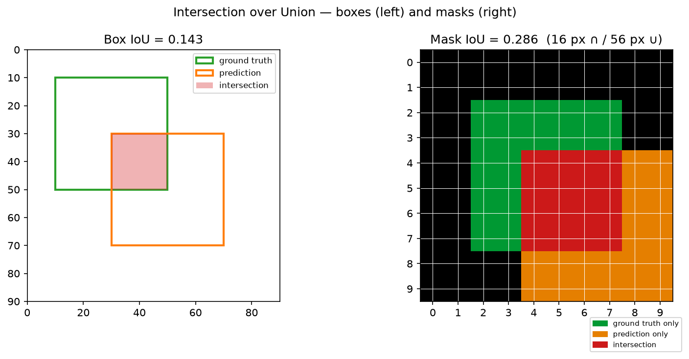
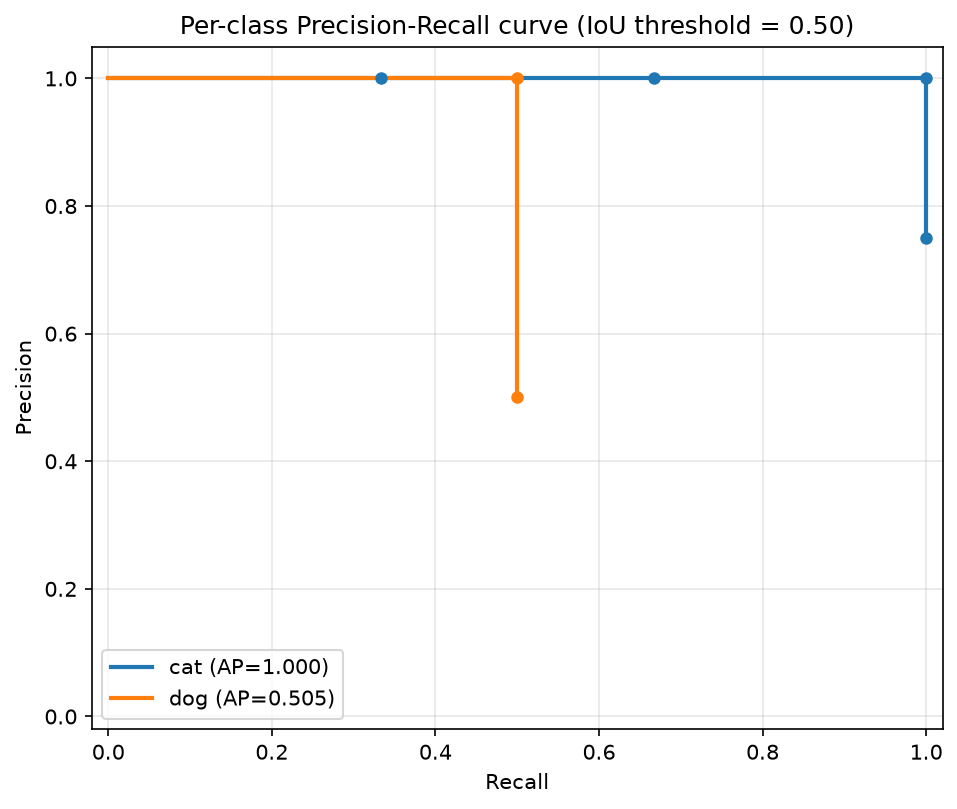

# CV metrics — IoU, mAP, mAR explained and computed

*Machine Learning · Worked Examples · Computer Vision · SPEC-ML-7*

SPEC-DS-6 gave you `precision = TP/(TP+FP)` and `recall = TP/(TP+FN)` for a classifier that answers a
plain yes/no. A detector answers a harder question: *"is there a dog, and where?"* — a class **and**
a box (or a pixel mask). Precision and recall still apply, but first you need a way to say whether a
predicted box "counts" as correct at all. A box that's off by one pixel should count; a box drawn in
the wrong corner of the image should not. **Intersection over Union (IoU)** is that yardstick, and
everything else in this chapter — TP/FP/FN, the PR curve, AP, mAP, COCO's mAP@[.5:.95], mAR — is built
directly on top of it, the same way SPEC-DS-6's metrics were built on top of a confusion matrix. This
chapter derives every one of those metrics by hand on a small, fully worked detection set, then
reproduces the same numbers with `torchmetrics`, so you can see library output is not magic — it's the
same arithmetic, just faster.

## Environment

```text
torch==2.14.0+cpu
torchmetrics==1.9.0
faster-coco-eval==1.8.0
numpy==2.5.2
matplotlib==3.11.1
Python 3.13.7
```

`torch` is pinned per
([source: NOTE-ML-1-torch-install](../../../research/NOTE-ML-1-torch-install.md)); the
`torchmetrics` detection API (`MeanAveragePrecision`, its input/output contract, and the metric
definitions below) is grounded in
([source: NOTE-ML-6-cv-metrics](../../../research/NOTE-ML-6-cv-metrics.md)). This chapter runs in the
same **separate `.venv-ml` virtualenv** as SPEC-ML-4/ML-5. `faster-coco-eval==1.8.0` and
`torchmetrics==1.9.0` are installed and their import/instantiation were verified live in that
environment on 2026-09-02 — see the pitfall in Section 5 about why that extra package matters. All
code and artefacts in this chapter were generated and gated on Python 3.13.7, CPU only.

## 1. What & why

A Java analogy for the gap between classification and detection: classification is `boolean
containsCat(Image img)`. Detection is `List<Detection> findCats(Image img)` where each `Detection`
carries a bounding box, a class, and a confidence score. The moment your method returns a *list* of
scored, located things instead of one boolean, "did we get it right?" stops being a single
true/false comparison — you have to decide, for every predicted box, *which* real object (if any) it
was supposed to be, and *how close is close enough*.

Three problems classification's confusion matrix doesn't have to solve, that a detector's metrics
must:

- **Localisation is continuous, not exact.** Two boxes are almost never pixel-identical even when a
  detector "got it right." You need a similarity score for two boxes/masks — that's IoU — and a
  threshold on it, below which a "correct-ish" box counts as wrong.
- **Extra or missing detections are possible.** A classifier always emits exactly one label per input.
  A detector can emit zero boxes for an object that's there (a **false negative**) or several boxes
  for an object that's there once, or a box where nothing is (a **false positive**) — the TP/FP/FN
  vocabulary from SPEC-DS-6 still applies, but now IoU decides which bucket a prediction lands in.
- **One threshold isn't enough to summarize the whole system.** SPEC-DS-6 could report Precision-Recall
  at a chosen decision threshold on class probability. Detection reports it as a full curve (varying
  the *score* threshold) and then, because localisation strictness is itself a knob (the *IoU*
  threshold), averages that curve's area across several IoU thresholds too. That double-averaging is
  exactly what "mAP@[.5:.95]" means, and by the end of Section 4 you'll have computed it by hand.

## 2. IoU by hand — boxes and masks

**IoU(A, B) = area(A ∩ B) / area(A ∪ B)**, a value in `[0, 1]`: `0` means the two shapes don't overlap
at all, `1` means they're identical
([source: NOTE-ML-6-cv-metrics](../../../research/NOTE-ML-6-cv-metrics.md), item 2). It's a similarity
score for *shapes*, and it works identically for a rectangle (a bounding box) or an arbitrary set of
pixels (a segmentation mask) — only how you compute "area" changes.

### Boxes

A box is `(x1, y1, x2, y2)` — top-left and bottom-right corners. The intersection of two boxes is
itself a box (possibly empty): clamp each box's edges against the other's.

```python
def iou_box(box_a: tuple[float, float, float, float], box_b: tuple[float, float, float, float]) -> float:
    """Intersection-over-Union of two axis-aligned boxes in (x1, y1, x2, y2) format.

    IoU(A, B) = area(A ∩ B) / area(A ∪ B)   [source: NOTE-ML-6-cv-metrics.md, item 2].
    """
    ax1, ay1, ax2, ay2 = box_a
    bx1, by1, bx2, by2 = box_b

    inter_x1, inter_y1 = max(ax1, bx1), max(ay1, by1)
    inter_x2, inter_y2 = min(ax2, bx2), min(ay2, by2)
    inter_w = max(0.0, inter_x2 - inter_x1)
    inter_h = max(0.0, inter_y2 - inter_y1)
    intersection = inter_w * inter_h

    area_a = (ax2 - ax1) * (ay2 - ay1)
    area_b = (bx2 - bx1) * (by2 - by1)
    union = area_a + area_b - intersection

    return intersection / union if union > 0 else 0.0
```

`max(0.0, ...)` on the intersection width/height is the important line: if the boxes don't overlap on
an axis, the clamped edges cross (`inter_x2 < inter_x1`), which would otherwise give a *negative*
width — clamping to zero turns "no overlap" into an intersection area of exactly 0, not a nonsense
negative area.

Run on two overlapping 40×40 boxes offset by 20 pixels in each direction, `(10, 10, 50, 50)` (ground
truth) against `(30, 30, 70, 70)` (prediction), the actual output is:

```text
[iou] box example IoU = 0.1429  (boxes (10, 10, 50, 50) vs (30, 30, 70, 70))
```

By hand: each box has area `40*40 = 1600`. The overlap region is `x∈[30,50], y∈[30,50]` — a `20×20`
square, area `400`. Union = `1600 + 1600 - 400 = 2800`. `IoU = 400/2800 = 0.1429` — matches the printed
value exactly.

### Masks

A segmentation mask is a boolean grid — `True` where the object's pixels are. `area()` becomes
"count of `True` pixels," and intersection/union become NumPy's element-wise `logical_and`/`logical_or`
followed by `.sum()`:

```python
import numpy as np


def iou_mask(mask_a: np.ndarray, mask_b: np.ndarray) -> float:
    """Intersection-over-Union of two boolean pixel masks of the same shape."""
    assert mask_a.shape == mask_b.shape, "masks must share a shape to compare pixel-for-pixel"
    intersection = np.logical_and(mask_a, mask_b).sum()
    union = np.logical_or(mask_a, mask_b).sum()
    return float(intersection / union) if union > 0 else 0.0


def make_rect_mask(shape: tuple[int, int], rect: tuple[int, int, int, int]) -> np.ndarray:
    """Boolean mask of `shape` with `rect` = (row0, col0, row1, col1) set True."""
    mask = np.zeros(shape, dtype=bool)
    r0, c0, r1, c1 = rect
    mask[r0:r1, c0:c1] = True
    return mask
```

On a 10×10 pixel grid, a ground-truth rectangle at rows/cols `2:8` (a 6×6 block, 36 pixels) against a
predicted rectangle at rows/cols `4:10` (also 6×6, 36 pixels):

```text
[iou] mask example IoU = 0.2857  (10x10 grid, two 6x6 rectangles)
```

By hand: the two 6×6 blocks overlap on rows `4:8` and cols `4:8` — a 4×4 region, 16 pixels.
Union = `36 + 36 - 16 = 56`. `IoU = 16/56 = 0.2857` — matches. This is exactly `mIoU` (mean IoU), the
metric semantic-segmentation chapters use, computed per-image instead of per-detection.

### Visualised

Both examples, side by side — the box case as two rectangles with the overlap shaded, the mask case as
a pixel grid coloured by which set(s) each pixel belongs to:



*(artefacts/iou_illustration.png)*

## 3. From IoU to TP/FP/FN

A single IoU number doesn't classify anything by itself — you also need an **IoU threshold**. Pick
`τ = 0.5` (the historically common default; Section 6 shows why the choice matters) and the rule is:

- A prediction is a **True Positive (TP)** if it can be matched to a ground-truth box of the *same
  class*, in the *same image*, with `IoU ≥ τ`.
- A prediction that can't be matched that way is a **False Positive (FP)**.
- A ground-truth box that no prediction matched is a **False Negative (FN)**.

([source: NOTE-ML-6-cv-metrics](../../../research/NOTE-ML-6-cv-metrics.md), item 7). One wrinkle
classification never has: matching is **greedy and one-to-one**. Process detections highest-score
first; each ground-truth box can be claimed by only the first (highest-scoring) prediction that
reaches it above the threshold — a second prediction on the same object, even with high IoU, is a FP,
not a second TP (otherwise a model could inflate its score by emitting ten near-duplicate boxes per
object).

### A small, hand-checkable detection set

Two images, two classes (`cat`, `dog`), five ground-truth boxes, six predictions — small enough to
match by hand, and deliberately built so one prediction (`P5`) sits at a *partial*-overlap IoU, so
Section 4 can show threshold sensitivity honestly instead of only showing perfect/zero matches:

```python
CLASS_NAMES = {0: "cat", 1: "dog"}

# Ground truth: image_id, class_id, box (x1, y1, x2, y2)
GROUND_TRUTH = [
    (0, 0, (0, 0, 40, 40)),      # G0 cat, image 0
    (0, 1, (50, 0, 90, 40)),     # G1 dog, image 0
    (1, 0, (10, 10, 50, 50)),    # G2 cat, image 1
    (1, 1, (60, 60, 100, 100)),  # G3 dog, image 1
    (1, 0, (0, 60, 50, 100)),    # G4 cat, image 1 (partially detected -> shows threshold sensitivity)
]

# Predictions: image_id, class_id, box, score
PREDICTIONS = [
    (0, 0, (0, 0, 40, 40), 0.95),      # P0 cat, exact match of G0        -> IoU 1.0
    (0, 0, (30, 30, 70, 70), 0.55),    # P1 cat, barely overlaps G0        -> IoU ~0.032
    (0, 1, (50, 0, 90, 40), 0.85),     # P2 dog, exact match of G1        -> IoU 1.0
    (1, 0, (10, 10, 50, 50), 0.75),    # P3 cat, exact match of G2        -> IoU 1.0
    (1, 1, (0, 60, 20, 80), 0.30),     # P4 dog, no overlap with G3       -> IoU 0.0
    (1, 0, (5, 65, 45, 105), 0.65),    # P5 cat, partial overlap with G4  -> IoU ~0.636
]
```

The greedy matcher, one class at a time:

```python
def match_class(preds_cls: list[tuple], gts_cls: list[tuple], iou_thr: float):
    """Greedy TP/FP assignment for one class, COCO/VOC style.

    preds_cls: list of (image_id, box, score); gts_cls: list of (image_id, box).
    Detections are processed highest-score-first; each ground-truth box can be
    claimed by at most one detection (its best-IoU match above the threshold).
    Returns: is_tp (bool array aligned with preds sorted by score desc), sorted scores,
    num_gt (int).
    """
    order = sorted(range(len(preds_cls)), key=lambda i: preds_cls[i][2], reverse=True)
    claimed = [False] * len(gts_cls)
    is_tp = []
    scores_sorted = []
    for i in order:
        img_id, box, score = preds_cls[i]
        best_iou, best_j = 0.0, -1
        for j, (g_img, g_box) in enumerate(gts_cls):
            if g_img != img_id or claimed[j]:
                continue
            iou = iou_box(box, g_box)
            if iou > best_iou:
                best_iou, best_j = iou, j
        if best_j >= 0 and best_iou >= iou_thr:
            claimed[best_j] = True
            is_tp.append(True)
        else:
            is_tp.append(False)
        scores_sorted.append(score)
    return is_tp, scores_sorted, len(gts_cls)
```

Run at `τ = 0.5`, actual output:

```text
=== Hand-computed, IoU threshold = 0.50 ===
  cat: is_tp=[True, True, True, False] scores=[0.95, 0.75, 0.65, 0.55] num_gt=3 -> AP=1.0000  AR(all-dets)=1.0000
  dog: is_tp=[True, False] scores=[0.85, 0.3] num_gt=2 -> AP=0.5050  AR(all-dets)=0.5000
```

Read the `cat` row against the raw boxes above: `P0` (score 0.95, IoU 1.0) and `P3` (0.75, IoU 1.0)
are unambiguous TPs. `P5` (0.65, IoU ≈0.636) clears the `τ=0.5` bar, so it's a TP too — all 3 cat
ground-truth boxes get matched, `num_gt=3` reached exactly. `P1` (0.55, IoU ≈0.032 against the already
-claimed `G0`) has nothing left to match — FP. For `dog`: `P2` (0.85, IoU 1.0) is a TP; `P4` (0.30, IoU
0.0 against `G3`) is a FP, and `G3` is never matched — one dog false negative, out of 2 dog ground
truths.

## 4. PR curve → AP → mAP → mAR

This is where SPEC-DS-6's `precision = TP/(TP+FP)` and `recall = TP/(TP+FN)` come back, computed
**cumulatively** as you walk the sorted detections rank by rank instead of once at a fixed threshold:

```python
def precision_recall_curve(is_tp, num_gt: int):
    """Cumulative precision/recall at each rank, in score-descending order."""
    is_tp = np.array(is_tp)
    tp_cum = np.cumsum(is_tp)
    fp_cum = np.cumsum(~is_tp)
    precision = tp_cum / np.maximum(tp_cum + fp_cum, 1)
    recall = tp_cum / num_gt if num_gt > 0 else np.zeros_like(tp_cum, dtype=float)
    return precision, recall
```

For `cat` (`is_tp = [T, T, T, F]`, `num_gt=3`): after rank 1, `TP=1, FP=0` → precision `1.00`,
recall `1/3 = 0.33`. After rank 2, `TP=2` → precision `1.00`, recall `2/3 = 0.67`. After rank 3,
`TP=3` → precision `1.00`, recall `3/3 = 1.00`. After rank 4 (the FP), `TP=3, FP=1` → precision
`3/4 = 0.75`, recall stays `1.00` (a FP never changes recall — the denominator is ground-truth count,
not detection count). For `dog` (`is_tp=[T, F]`, `num_gt=2`): precision `1.00`/recall `0.50`, then
precision `0.50`/recall `0.50`.

### AP — the area under that curve, COCO's way

**Average Precision (AP)** is the area under the precision-recall curve for one class at one IoU
threshold. Plotting raw `(recall, precision)` points gives a jagged, sawtooth curve — precision
drops sharply every time a FP appears, then would jump back up on the next TP. COCO (and, before it,
Pascal VOC) smooths this with **interpolation**: at 101 equally-spaced recall points
`[0.00, 0.01, ..., 1.00]`, the "interpolated precision" at recall level `r` is defined as the *maximum*
precision observed at any recall `≥ r` — the precision-recall curve's upper envelope. AP is the mean
of those 101 interpolated values
([source: NOTE-ML-6-cv-metrics](../../../research/NOTE-ML-6-cv-metrics.md), item 3 — COCO's 101-point
interpolation, as opposed to Pascal VOC's older 11-point version):

```python
def ap_coco_101point(precision: np.ndarray, recall: np.ndarray) -> float:
    """COCO-style 101-point interpolated Average Precision.

    Recall is sampled at 101 equally spaced points [0, 0.01, ..., 1.0]; at each point the
    interpolated precision is the MAX precision observed at any recall >= that point (the
    "precision envelope"). AP is the mean of those 101 interpolated precision values.
    [source: NOTE-ML-6-cv-metrics.md, item 3 — COCO 101-point interpolation.]
    """
    recall_levels = np.linspace(0.0, 1.0, 101)
    if len(precision) == 0:
        return 0.0
    interpolated = np.zeros(101)
    for k, r in enumerate(recall_levels):
        mask = recall >= r
        interpolated[k] = precision[mask].max() if mask.any() else 0.0
    return float(interpolated.mean())
```

Work `dog`'s AP by hand: the envelope is `1.00` for every `r ≤ 0.50` (the point `(recall=0.50,
precision=1.00)` still qualifies, since `0.50 ≥ r`), and `0.00` for every `r > 0.50` (no detection ever
reaches a higher recall). Of the 101 sample points `k/100` for `k=0..100`, exactly `k=0..50` (51
points) fall at `r ≤ 0.50`; the remaining 50 fall above it. `AP_dog = (51*1.00 + 50*0.00)/101 =
51/101 = 0.5050` — matches the printed `AP=0.5050` exactly. `cat`'s envelope is `1.00` across the
*entire* `[0, 1]` range (precision `1.00` is achieved at `recall=1.00` itself, at rank 3, before the
one FP at rank 4 pulls precision down at that *same* recall value — and the envelope takes the max),
so `AP_cat = 1.00` — also matches.

The PR curve for both classes at `τ = 0.5`, generated from the exact numbers above:



*(artefacts/pr_curve_iou50.png)* — `cat`'s curve stays at precision 1.0 all the way to recall 1.0 (one
FP only shows up *after* every ground truth is already matched); `dog`'s curve drops to precision 0.5
the moment its one FP appears, and recall never exceeds 0.5 because one ground-truth dog is never
found.

**mAP@0.50** is just the mean of the per-class APs at that one threshold: `mAP@0.50 = (1.0000 +
0.5050) / 2 = 0.7525`.

### COCO mAP@[.5:.95] — the same computation, ten times

COCO's headline metric doesn't fix the IoU threshold at 0.5. It repeats the *entire* AP computation
above at **ten** IoU thresholds — `[0.50, 0.55, 0.60, ..., 0.95]`, step `0.05` — then averages AP
across both classes *and* thresholds
([source: NOTE-ML-6-cv-metrics](../../../research/NOTE-ML-6-cv-metrics.md), item 4). This is where
`P5` (cat, IoU ≈0.636) earns its place in the example — it's a TP for the lower thresholds and flips
to a FP once the threshold passes its IoU:

```text
=== Hand-computed AP per class per IoU threshold ===
  cat: ['0.5:1.000', '0.55:1.000', '0.6:1.000', '0.65:0.663', '0.7:0.663', '0.75:0.663', '0.8:0.663', '0.85:0.663', '0.9:0.663', '0.95:0.663']
  dog: ['0.5:0.505', '0.55:0.505', '0.6:0.505', '0.65:0.505', '0.7:0.505', '0.75:0.505', '0.8:0.505', '0.85:0.505', '0.9:0.505', '0.95:0.505']
```

At `τ=0.50/0.55/0.60`, `P5`'s IoU (`0.636`) still clears the bar — `cat` keeps AP `1.000`. At
`τ=0.65` and above, `0.636 < τ`, so `P5` becomes a FP and `G4` becomes a FN, capping `cat`'s max
achievable recall at `2/3` instead of `3/3` — by the same 101-point arithmetic as `dog` above,
`AP_cat = 67/101 = 0.6634` for every threshold from `0.65` to `0.95` (7 of the 10 thresholds).
`dog`'s AP never changes across thresholds at all — its one TP (`P2`) has IoU exactly `1.0`
(always above any threshold ≤0.95) and its one FP (`P4`) has IoU exactly `0.0` (always below), so
threshold strictness never flips its verdict.

Averaging: `cat`'s mean AP across the 10 thresholds is `(3×1.000 + 7×0.6634)/10 = 0.7644`; `dog`'s is
`0.5050` (unchanged, constant). `mAP@[.5:.95] = (0.7644 + 0.5050)/2 = 0.6347` — a full **12 points
lower** than `mAP@0.50 (0.7525)`, entirely because of the one prediction (`P5`) whose IoU sits in
the `[0.5, 0.95]` range instead of at the extremes. **That gap is the whole reason COCO reports
`mAP@[.5:.95]` instead of `mAP@0.50` alone: a model can look great by Pascal-VOC's looser 0.50 bar and
noticeably worse once localisation precision above 0.65 is actually required.**

### mAR — the recall side of the same coin

**Mean Average Recall (mAR)** mirrors mAP but tracks recall instead of precision, and (unlike AP)
uses the *raw* recall value after all detections are counted — no 101-point interpolation
([source: NOTE-ML-6-cv-metrics](../../../research/NOTE-ML-6-cv-metrics.md), item 6):

```python
def hand_compute(iou_thr: float):
    """Per-class AP and recall (all detections, no interpolation) at one IoU threshold."""
    results = {}
    for cls_id, cls_name in CLASS_NAMES.items():
        preds_cls = [(img, box, score) for img, c, box, score in PREDICTIONS if c == cls_id]
        gts_cls = [(img, box) for img, c, box in GROUND_TRUTH if c == cls_id]
        is_tp, scores_sorted, num_gt = match_class(preds_cls, gts_cls, iou_thr)
        precision, recall = precision_recall_curve(is_tp, num_gt)
        ap = ap_coco_101point(precision, recall)
        ar = float(recall[-1]) if len(recall) > 0 else 0.0  # recall using ALL detections, no interpolation
        results[cls_name] = {"ap": ap, "ar": ar, "precision": precision, "recall": recall}
    return results
```

`cat`'s final (all-detections) recall is `1.00` at `τ≤0.60` and `0.6667` at `τ≥0.65` — averaged over
the 10 thresholds, `(3×1.00 + 7×0.6667)/10 = 0.7667`. `dog`'s is a constant `0.50`. `mAR@[.5:.95] =
(0.7667 + 0.50)/2 = 0.6333`.

## 5. Reproduce with torchmetrics

`torchmetrics.detection.MeanAveragePrecision` computes everything in Sections 3–4 in one call, using
the update/compute pattern common to every `torchmetrics` metric: feed it batches with `.update()`,
then call `.compute()` once for the final numbers
([source: NOTE-ML-6-cv-metrics](../../../research/NOTE-ML-6-cv-metrics.md), item 1). It takes
predictions and targets as one dict per image, with `boxes`/`scores`/`labels` (predictions) or
`boxes`/`labels` (targets) as tensors:

```python
import torch
from torchmetrics.detection import MeanAveragePrecision


def torchmetrics_compute():
    image_ids = sorted({img for img, *_ in GROUND_TRUTH} | {img for img, *_ in PREDICTIONS})

    preds = []
    targets = []
    for img_id in image_ids:
        p_boxes = [box for i, c, box, s in PREDICTIONS if i == img_id]
        p_scores = [s for i, c, box, s in PREDICTIONS if i == img_id]
        p_labels = [c for i, c, box, s in PREDICTIONS if i == img_id]
        preds.append({
            "boxes": torch.tensor(p_boxes, dtype=torch.float32) if p_boxes else torch.zeros((0, 4)),
            "scores": torch.tensor(p_scores, dtype=torch.float32),
            "labels": torch.tensor(p_labels, dtype=torch.int64),
        })

        g_boxes = [box for i, c, box in GROUND_TRUTH if i == img_id]
        g_labels = [c for i, c, box in GROUND_TRUTH if i == img_id]
        targets.append({
            "boxes": torch.tensor(g_boxes, dtype=torch.float32) if g_boxes else torch.zeros((0, 4)),
            "labels": torch.tensor(g_labels, dtype=torch.int64),
        })

    # backend="faster_coco_eval": this .venv-ml has faster-coco-eval installed, not pycocotools
    # (torchmetrics' default backend). See the pitfall below.
    metric = MeanAveragePrecision(box_format="xyxy", iou_type="bbox", class_metrics=True,
                                   backend="faster_coco_eval")
    metric.update(preds, targets)
    return metric.compute()
```

### Pitfall hit live: `MeanAveragePrecision` needs a COCO-eval backend, and picks one you may not have

The first run of this exact code, in this exact `.venv-ml`, failed with:

```text
ModuleNotFoundError: Backend `pycocotools` in metric `MeanAveragePrecision`  metric requires that
`pycocotools` is installed. Please install with `pip install pycocotools` or
`pip install torchmetrics[detection]`
```

`torchmetrics`'s `MeanAveragePrecision` doesn't implement COCO's matching/interpolation logic itself —
it delegates to a COCO-evaluation backend, and its constructor's default is `backend="pycocotools"`.
Installing the `torchmetrics[detection]` extra normally pulls in `pycocotools`; this `.venv-ml` instead
has **`faster-coco-eval==1.8.0`** — a drop-in, pip-installable alternative backend that avoids
`pycocotools`'s C-extension build step on some platforms. `torchmetrics` supports it, but you must ask
for it explicitly: `MeanAveragePrecision(..., backend="faster_coco_eval")`. Skip that argument with
only `faster-coco-eval` installed, and you get the traceback above, not a silent fallback. **Lesson:**
`pip install torchmetrics[detection]` is necessary but not sufficient — check *which* COCO backend
actually landed in your environment (`pip show pycocotools faster-coco-eval`) and pass `backend=`
to match it.

### The comparison

`metric.compute()`'s full, actual output on this dataset:

```text
=== torchmetrics MeanAveragePrecision.compute() ===
  map: 0.6346534490585327
  map_50: 0.7524752616882324
  map_75: 0.5841584205627441
  map_small: -1.0
  map_medium: 0.6346534490585327
  map_large: -1.0
  mar_1: 0.5833333134651184
  mar_10: 0.6333333253860474
  mar_100: 0.6333333253860474
  mar_small: -1.0
  mar_medium: 0.6333333253860474
  mar_large: -1.0
  map_per_class: tensor([0.7644, 0.5050])
  mar_100_per_class: tensor([0.7667, 0.5000])
  classes: tensor([0, 1], dtype=torch.int32)
```

`map` is COCO's `mAP@[.5:.95]`; `map_50` is `mAP@0.50`; `mar_100` is mAR with at most 100 detections
counted per image (the toy set never reaches that cap, so it equals `mar_10` here too — Section 6 has
more on what `mar_1`/`mar_10`/`mar_100` mean). `map_per_class`/`classes` line up `[0.7644, 0.5050]`
with `[cat=0, dog=1]` — the exact per-class means from Section 4.

Every hand-computed number matches the `torchmetrics` output, to displayed precision:

| metric | hand-computed | torchmetrics | abs diff |
|---|---|---|---|
| mAP@0.50 | 0.7525 | 0.7525 | 0.0 |
| mAP@[.5:.95] | 0.6347 | 0.6347 | 0.0 |
| mAR@[.5:.95] (all-dets) vs `mar_100` | 0.6333 | 0.6333 | 0.0 |
| AP@[.5:.95] class=cat | 0.7644 | 0.7644 | 0.0 |
| AP@[.5:.95] class=dog | 0.5050 | 0.5050 | 0.0 |

(full precision in `artefacts/hand_vs_torchmetrics.csv`, generated by the same run). Zero difference,
not "close" — the hand implementation above is exactly what `torchmetrics`/COCO's evaluator does under
the hood, on a dataset small enough that no numerical-precision noise shows up. As one more honest
cross-check: `map_75` (`0.5841584205627441`) is exactly the mean of `cat`'s and `dog`'s AP at
`τ=0.75` from the per-threshold table above — `(67/101 + 51/101)/2 = 59/101 = 0.5841584...` — matching
to the last printed digit.

## 6. Pitfalls

- **`mAP@0.50` and `mAP@[.5:.95]` are different numbers measuring different things — don't quote one
  when you mean the other.** This chapter's own example moves from `0.7525` to `0.6347` — an 11-point
  swing — purely from tightening the localisation bar. A model report that says "mAP 0.75" without
  saying *which* mAP is under-specified; always state the IoU threshold(s).
- **AP is sensitive to the IoU threshold in a way that punishes small objects disproportionately.** A
  1-pixel shift on a large box barely moves IoU; the same 1-pixel shift on a small box can swing IoU by
  several points, because a small box's area is small relative to that shift
  ([source: NOTE-ML-6-cv-metrics](../../../research/NOTE-ML-6-cv-metrics.md), caveats). This is why
  COCO reports `AP_small`/`AP_medium`/`AP_large` as separate numbers, not just one overall AP.
- **`-1.0` in `map_small`/`map_large` isn't a score — it's "no data."** Every ground-truth box in this
  chapter's toy set has an area between COCO's small (`<32²px`) and large (`>96²px`) bins, so both
  come back as the sentinel `-1.0`, not `0.0`. Averaging a `-1.0` sentinel into a downstream summary by
  mistake silently corrupts the number — always check a metrics library's docs for what its "no
  applicable data" value is before you use its outputs.
- **Class imbalance shifts mAP toward the classes with more ground truth, unless you deliberately
  average per-class first.** `mAP` here already averages `cat` and `dog` as two *equal* contributors —
  COCO's own 80-class average does the same across categories of wildly different frequency (people
  appear far more than toasters), so a model that's excellent on common classes and poor on rare ones
  can still post a healthy mAP
  ([source: NOTE-ML-6-cv-metrics](../../../research/NOTE-ML-6-cv-metrics.md), caveats). Segmentation
  has the analogous problem at the pixel level (background pixels vastly outnumber foreground).
- **`mar_1`/`mar_10`/`mar_100` cap the number of highest-scored detections counted *per image*, not a
  global cap.** `mar_1 = 0.5833` here is lower than `mar_10`/`mar_100` (`0.6333`) purely because
  forcing exactly one guess per image throws away `P3` in image 1 (cat's second-best detection ever
  gets a look). With this toy set's 2–3 predictions per image, `mar_10` already equals `mar_100`
  — the cap stops mattering once every image's detections fit under it.
- **Panoptic quality (PQ) is a related but distinct metric, out of scope here.** It combines detection
  and segmentation matching for the "every pixel belongs to exactly one segment" panoptic-segmentation
  task; see the COCO panoptic evaluation docs if you need it — this chapter's IoU/AP/mAP/mAR machinery
  is the foundation it builds on, not a substitute for it.

## Recap & what's next

You derived IoU for boxes and masks from first principles, used an IoU threshold to turn a list of
scored, located predictions into TP/FP/FN exactly the way SPEC-DS-6 built a confusion matrix — except
now "correct" requires *both* the right class *and* an overlapping-enough box. From there: a
per-class PR curve, AP as the 101-point-interpolated area under it, mAP as the per-class mean, COCO's
`mAP@[.5:.95]` as that same computation repeated across ten IoU thresholds, and mAR as its
recall-side counterpart. Every number was checked twice — once by hand, once by `torchmetrics` — and
they agreed exactly. SPEC-ML-5's pretrained detector produces exactly the kind of scored-box output
this chapter's metrics consume; the next computer-vision chapters put these metrics to work judging
real models on real images instead of a six-prediction toy set.
