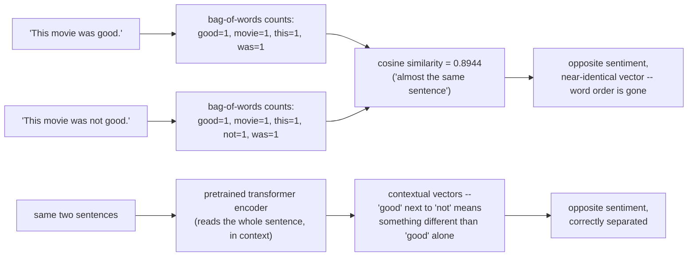
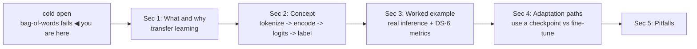
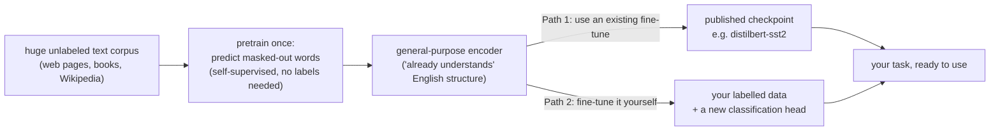
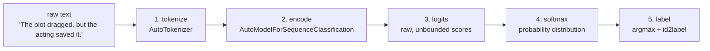
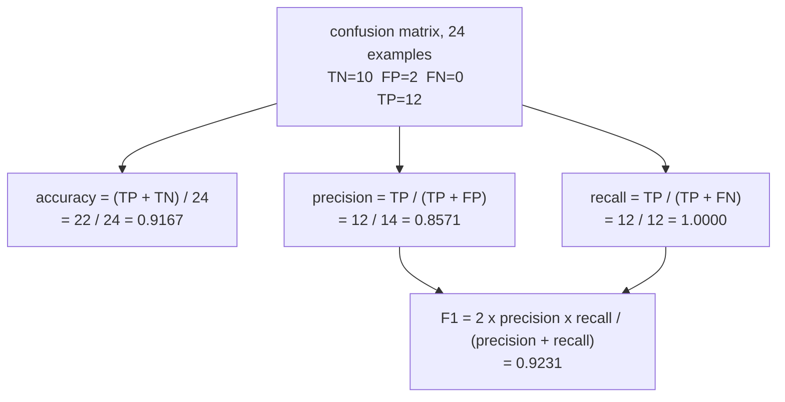
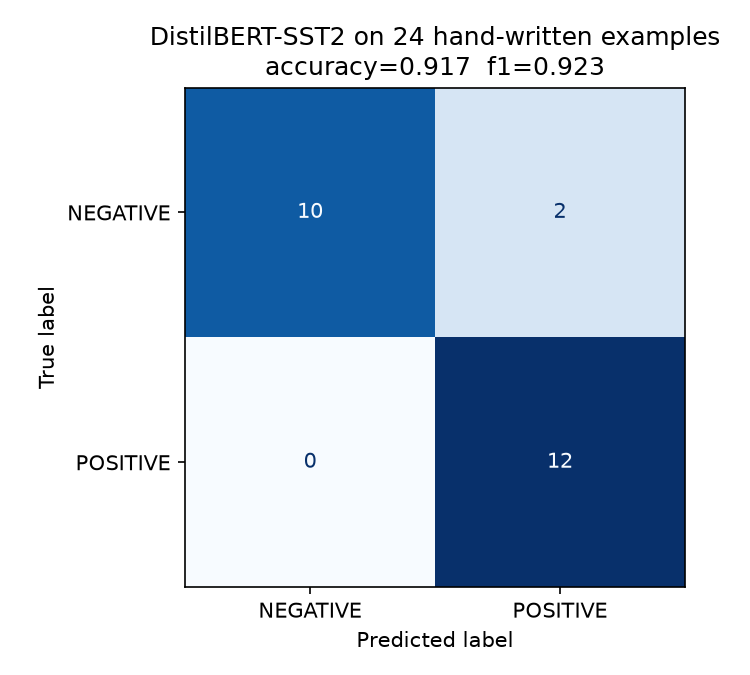
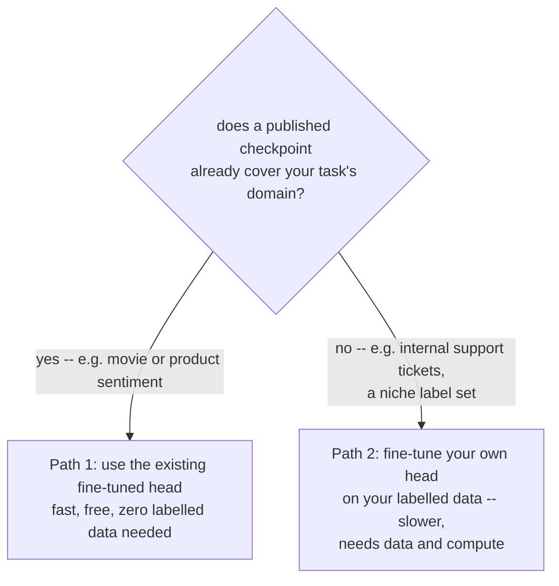

# Text classification with a pretrained transformer encoder

*Machine Learning · Worked Examples · Natural Language · SPEC-ML-8*

## The word counter that can't tell "good" from "not good"

The classical way to classify text — the way you'd have built it five years ago — is to count
words. Tokenize the sentence, count how often each word appears, feed those counts into logistic
regression. It's called **bag-of-words**: throw every word into a bag, keep the counts, throw away
the order they came in. Watch it fail on the simplest possible example.

**Step 1 — count the words in two sentences that mean opposite things.**

```python
from sklearn.feature_extraction.text import CountVectorizer
from sklearn.metrics.pairwise import cosine_similarity

sentences = ["This movie was good.", "This movie was not good."]
vectorizer = CountVectorizer()
bow = vectorizer.fit_transform(sentences)
print("vocabulary:", list(vectorizer.get_feature_names_out()))
print(bow.toarray())
print("cosine similarity:", round(float(cosine_similarity(bow)[0, 1]), 4))
```

```text
vocabulary: ['good', 'movie', 'not', 'this', 'was']
[[1 1 0 1 1]
 [1 1 1 1 1]]
cosine similarity: 0.8944
```

**Step 2 — measure how similar the word-counter thinks they are.** `cosine_similarity` (DS-6's
similarity metric, reused here) says these two vectors are **0.8944 similar out of a possible
1.0** — almost the same sentence, as far as a bag of word counts is concerned.

**Step 3 — notice what that means.** One sentence is positive, the other is its exact negation, and
a bag-of-words model rates them 89% identical. It saw one extra count in the `not` column and
otherwise couldn't tell you these sentences disagree about anything. That's not a bug in the demo —
it's structural: bag-of-words has no representation of *order*, so "not good" and "good, not [bad]"
would count identically, and the model has to re-discover, from your labelled examples alone, that
the word "not" sitting next to "good" flips the verdict. Every classifier built this way starts from
**zero knowledge of English** — it learns whatever your training set teaches it and nothing more.

**Step 4 — name the fix.** What's missing is a representation that reads the whole sentence and
already knows how English works — that "not" negates the word after it, that "dreadful" and
"terrible" mean similar things, that "the plot dragged, but the acting saved it" is a mixed review
leaning positive. A **pretrained transformer encoder** builds exactly that: a vector for each word
that depends on *every other word around it* (a **contextual representation**), learned once from
enormous amounts of text, before it ever saw a single one of your labelled examples.

Here's the one-sentence version you could repeat at dinner: **stand your classifier on a model that
already read a huge slice of the internet, instead of teaching a blank word-counter your language
from scratch.** That reuse — start from a general-purpose base instead of from zero — is called
**transfer learning**, and it's the idea this whole chapter puts to work.



The origin of that pretrained encoder has a specific date attached to it. In October 2018, Devlin,
Chang, Lee, and Toutanova at Google published **BERT** — "Bidirectional Encoder Representations from
Transformers" — a model pretrained on masked-word prediction over huge amounts of unlabelled text,
that could then be fine-tuned to state-of-the-art results across eleven different NLP benchmarks
with only small, task-specific changes
([source: Devlin et al., "BERT: Pre-training of Deep Bidirectional Transformers for Language
Understanding," arXiv:1810.04805](https://arxiv.org/abs/1810.04805), checked 2026-09-03 — submitted
2018-10-11). BERT is what made "download a model that already understands English, then adapt it"
the default way to do NLP, replacing "build a bag-of-words pipeline and hope your training set is
big enough." Everything in this chapter is that same idea, run on your own machine, on CPU, in
seconds.



## 1. What & why — transfer learning beats bag-of-words

A Java service that classifies support tickets by urgency, or reviews by sentiment, used to mean
hand-rolling that bag-of-words pipeline: tokenize, count word frequencies (or the fancier TF-IDF
weighting), feed the counts into logistic regression. That still works, and DS-6 taught you the
metrics that judge any such classifier. What's changed since 2018 is *where the features come
from*. This chapter swaps the hand-built feature pipeline for a **pretrained transformer encoder** —
a model that already learned what language looks like from a huge corpus before it ever saw your
task — and shows the two ways you can put that knowledge to work: use a checkpoint someone already
fine-tuned for a task like yours, or fine-tune your own.

A **pretrained transformer encoder** — BERT, RoBERTa, DistilBERT — is the fix the cold open just
motivated. It was trained (via a self-supervised objective: predict masked-out words from context,
across enormous amounts of unlabelled text) to build those **contextual representations** from the
cold open: a vector for "bank" that differs depending on whether the sentence is about rivers or
money, built from attention over every other token in the sentence, in both directions. That's the
encoder architecture from SPEC-ML-10, applied here as a black box you consume rather than build. In
plain terms: an **encoder** is the half of a transformer whose job is to *read* a full sequence and
produce a representation of it — as opposed to a *decoder*, which generates new tokens one at a
time (that's SPEC-ML-9's job, not this chapter's). **Fine-tuning** means continuing to train that
already-pretrained encoder a little further on your own labelled examples, so it specializes for one
task instead of starting from nothing. Doing that for classification means the classifier starts
from "already understands English" instead of "knows nothing but which words co-occurred in my
training set."

**Java analogy:** think of the difference between hand-rolling a JSON parser for one project versus
depending on a mature, battle-tested parsing library that a thousand other projects have already
exercised. Bag-of-words is the hand-rolled parser — it works, it's yours, but it only knows what
your training data taught it. A pretrained encoder is the mature dependency: general-purpose
language understanding, built once on a vastly larger corpus than any single labelled dataset could
provide, that you specialize with a comparatively small amount of task-specific data (or none at
all, as this chapter's first worked example shows).



Section 4 comes back to this diagram and unpacks the choice between its two branches.

## 2. Concept — tokenizer, model, logits, label

Classifying text with a HuggingFace `transformers` model is four steps, and they're the same four
steps no matter which pretrained encoder you use:

1. **Tokenize.** Text becomes a sequence of subword token IDs — not whole words, and not
   characters, but pieces in between (`AutoTokenizer`). This is the same tokenizer concept from
   embeddings/tokenizers (SPEC-ML-3): a fixed vocabulary of subword pieces, so a novel word like
   "unfathomable" becomes several known pieces rather than one `<UNK>` token.
2. **Encode.** The token IDs pass through the transformer's stacked attention layers
   (`AutoModelForSequenceClassification`), producing one contextual vector per token — the same
   context-aware representations from the cold open — then a classification head reduces that to
   raw, unnormalized scores: **logits**, plain-language "the model's opinion, before it's been
   turned into a probability" — one score per class.
3. **Softmax.** Logits get turned into a probability distribution over classes with `softmax` — the
   same idea as `predict_proba()` in scikit-learn (DS-6), just computed with `torch.softmax`.
4. **Label.** `argmax` over the probabilities gives the predicted class index; `model.config.id2label`
   maps that index back to a human-readable string (`"NEGATIVE"` / `"POSITIVE"`).



`transformers` gives you both a high-level API that does all four steps in one call, and the
low-level pieces so you can see logits directly — this chapter uses both
([source: NOTE-ML-7-nlp-models.md](../../../research/NOTE-ML-7-nlp-models.md);
[pipeline docs](https://huggingface.co/docs/transformers/en/main_classes/pipelines)
(checked 2026-09-02)).

### Environment

```text
torch==2.14.0+cpu
transformers==5.16.1
scikit-learn==1.9.0
matplotlib==3.11.1
Python 3.13.7, CPU only
```

Pinned and verified against the installed shared ML virtualenv (`.venv-ml`) and the transformers
5.16.1 API reference
([source: NOTE-ML-7-nlp-models.md](../../../research/NOTE-ML-7-nlp-models.md), checked
2026-09-02). No GPU is used or required.

### The model

`distilbert/distilbert-base-uncased-finetuned-sst-2-english` — DistilBERT (a distilled, ~40%
smaller version of BERT, ~67M parameters) already fine-tuned for binary sentiment classification on
SST-2 (Stanford Sentiment Treebank). **Apache-2.0 licensed, free to download and use**
([source: NOTE-ML-7-nlp-models.md](../../../research/NOTE-ML-7-nlp-models.md);
[model card](https://huggingface.co/distilbert/distilbert-base-uncased-finetuned-sst-2-english)
(checked 2026-09-02)). First run downloads ~268MB to the local HuggingFace cache
(`~/.cache/huggingface/hub`); every run after that loads from disk. This is Path 1 from the previous
section's diagram: someone already fine-tuned the encoder for you.

## 3. Worked example

Full runnable script:
[`code/text_classification.py`](code/text_classification.py). Run it with:

```text
.venv-ml/Scripts/python.exe "Machine Learning/Worked Examples/natural-language/code/text_classification.py"
```

### 3.1 The fast path — `pipeline()`

```python
from transformers import pipeline

classifier = pipeline("text-classification", model="distilbert/distilbert-base-uncased-finetuned-sst-2-english", device="cpu")
samples = [
    "This movie was a masterpiece from start to finish.",
    "I want my two hours back. Absolutely dreadful.",
]
results = classifier(samples)
for text, result in zip(samples, results):
    print(f"{result['label']:8s} score={result['score']:.4f}  {text!r}")
```

```text
POSITIVE score=0.9997  'This movie was a masterpiece from start to finish.'
NEGATIVE score=0.9998  'I want my two hours back. Absolutely dreadful.'
```

`pipeline()` returns a list of dicts, `{'label': ..., 'score': ...}`, one per input
([source: NOTE-ML-7-nlp-models.md](../../../research/NOTE-ML-7-nlp-models.md)). Both scores here
are near-certain (>0.999) — these are the two "easy" sentences deliberately chosen to sanity-check
the setup before the harder evaluation set in Section 3.3.

### 3.2 The explicit path — tokenizer, logits, softmax, step by step

`pipeline()` is convenient, but it hides exactly the mechanics DS-6 trained you to want to see
before trusting a number. Same code as Section 2's diagram, but you'll watch every intermediate
value:

```python
import torch
from transformers import AutoModelForSequenceClassification, AutoTokenizer

model_id = "distilbert/distilbert-base-uncased-finetuned-sst-2-english"
tokenizer = AutoTokenizer.from_pretrained(model_id)
model = AutoModelForSequenceClassification.from_pretrained(model_id)
model.eval()

text = "The plot dragged, but the acting saved it."
encoded = tokenizer(text, return_tensors="pt")
print("tokens:", tokenizer.convert_ids_to_tokens(encoded["input_ids"][0]))

with torch.no_grad():
    logits = model(**encoded).logits
print("raw logits:", logits.numpy().round(4))

probs = torch.softmax(logits, dim=-1)[0]
print("softmax probs:", probs.numpy().round(4))
print("id2label:", model.config.id2label)
```

```text
tokens: ['[CLS]', 'the', 'plot', 'dragged', ',', 'but', 'the', 'acting', 'saved', 'it', '.', '[SEP]']
raw logits: [[-0.9135  1.0138]]
softmax probs: [0.127 0.873]
id2label: {0: 'NEGATIVE', 1: 'POSITIVE'}
```

Read that output as the pipeline diagram's four steps, one real number at a time:

- **Step 1, tokenize.** `[CLS]` and `[SEP]` are special tokens the tokenizer inserts, not part of
  your text — `[CLS]`'s final hidden state is what the classification head actually reads; `[SEP]`
  marks the end of the sequence. Every word here happened to tokenize whole (`dragged`, `acting`,
  `saved` are all single WordPiece tokens) — a rarer word would split into several subword pieces.
- **Step 2, encode → logits.** The raw logits (`-0.9135`, `1.0138`) are not probabilities — they're
  unbounded scores, the model's raw opinion before calibration. Reading logits directly (without
  softmax) to judge "how confident" a model is would be like reading Java `Comparable` results as
  magnitudes instead of just sign — the raw number isn't calibrated to mean anything on its own.
- **Step 3, softmax → label.** Only after `softmax` do the logits become `[0.127, 0.873]`, a
  distribution that sums to 1. `id2label` is `{0: 'NEGATIVE', 1: 'POSITIVE'}` for this checkpoint —
  read from `model.config`, not assumed. A different checkpoint could order or name its labels
  differently; always check, don't hard-code index 1 as positive (Section 5's pitfalls return to
  this).

The mixed-sentiment sentence "The plot dragged, but the acting saved it." lands at 87.3% POSITIVE —
a genuinely uncertain case scored with genuine (if imperfect) nuance, not the near-100% confidence
of the two clear-cut sentences in 3.1. Compare that to the cold open: a bag-of-words counter had no
way to weigh "dragged" against "saved" at all; this encoder read the whole sentence and landed on a
number that tracks how a human would actually call it — mixed, leaning positive.

### 3.3 Evaluating on a small labelled set (LO3 — DS-6 metrics)

Twenty-four hand-written sentences, each labelled `0` (NEGATIVE) or `1` (POSITIVE), deliberately
mixing easy cases with harder ones — negation ("not the worst"), understatement, and idiom — so the
evaluation produces genuine errors rather than a trivial 100%
([tiny hand-written eval set recommendation: source NOTE-ML-7-nlp-models.md](../../../research/NOTE-ML-7-nlp-models.md)).
The full list is in
[`code/text_classification.py`](code/text_classification.py) (`EVAL_SET`).

```python
texts = [t for t, _ in EVAL_SET]
y_true = [label for _, label in EVAL_SET]

encoded = tokenizer(texts, padding=True, truncation=True, return_tensors="pt")
with torch.no_grad():
    logits = model(**encoded).logits
probs = torch.softmax(logits, dim=-1)
y_pred = torch.argmax(probs, dim=-1).tolist()
```

This is the same evaluation discipline as DS-6: run the model once over a held-out set, then reach
for `sklearn.metrics` — the metric *definitions* don't change because the classifier is now a
transformer instead of logistic regression
([source: NOTE-9-classification-metrics-apis.md](../../../research/NOTE-9-classification-metrics-apis.md)):

```python
from sklearn.metrics import accuracy_score, confusion_matrix, f1_score, precision_score, recall_score

acc = accuracy_score(y_true, y_pred)
prec = precision_score(y_true, y_pred, zero_division=0)
rec = recall_score(y_true, y_pred, zero_division=0)
f1 = f1_score(y_true, y_pred, zero_division=0)
cm = confusion_matrix(y_true, y_pred, labels=[0, 1])
```

```text
accuracy:  0.9167
precision: 0.8571
recall:    1.0000
f1:        0.9231
confusion matrix [[TN, FP], [FN, TP]]:
[[10  2]
 [ 0 12]]
```

22 of 24 correct — **91.7% accuracy**, matching the DS-6 vocabulary exactly:
`confusion_matrix(y_true, y_pred)` returns `[[TN, FP], [FN, TP]]`
([source: NOTE-9-classification-metrics-apis.md](../../../research/NOTE-9-classification-metrics-apis.md)),
here `[[10, 2], [0, 12]]` — 10 true negatives, 2 false positives, 0 false negatives, 12 true
positives. **Recall is a perfect 1.0** (every genuinely positive review was caught) while
**precision is 0.857** (2 of the 14 sentences predicted POSITIVE were actually NEGATIVE) — both
misses run in the same direction. The diagram below walks the same four cells straight into the
four metrics, so you can see exactly which counts feed which formula:



Same visual evidence as a rendered plot
([`artefacts/confusion_matrix.png`](artefacts/confusion_matrix.png)):



The two misclassified sentences, read straight from
[`artefacts/predictions.csv`](artefacts/predictions.csv):

| text | true_label | pred_label | confidence |
|---|---|---|---|
| "Not the worst thing I've seen, but close to it." | NEGATIVE | POSITIVE | 0.9756 |
| "Two hours of my life I will never get back." | NEGATIVE | POSITIVE | 0.7447 |

Both are genuinely hard: "not the worst" contains the word "worst" but negates it into faint praise
— the model reads the negation correctly *as pointing positive*, but a human would still call the
overall sentence lukewarm-negative ("close to it" undercuts it). "Two hours of my life I will never
get back" carries no individually negative words at all; its negativity is entirely idiomatic —
exactly the kind of case bag-of-words would also fail on, for a different reason (no negative
*tokens* to count at all). Neither error is a bug; both are honest evidence that "beats
bag-of-words" doesn't mean "solves language" — Section 5 returns to this.

Full predictions table (first 8 of 24 rows; complete table in
[`artefacts/predictions.csv`](artefacts/predictions.csv)):

| text | true_label | pred_label | confidence | correct |
|---|---|---|---|---|
| This movie was a masterpiece from start to finish. | POSITIVE | POSITIVE | 0.9997 | True |
| I want my two hours back. Absolutely dreadful. | NEGATIVE | NEGATIVE | 0.9998 | True |
| The plot dragged, but the acting saved it. | POSITIVE | POSITIVE | 0.8730 | True |
| One of the worst films I have ever sat through. | NEGATIVE | NEGATIVE | 0.9998 | True |
| A charming, witty, endlessly rewatchable comedy. | POSITIVE | POSITIVE | 0.9999 | True |
| The dialogue was wooden and the pacing was glacial. | NEGATIVE | NEGATIVE | 0.9998 | True |
| I've never laughed so hard in a theater. | POSITIVE | POSITIVE | 0.9996 | True |
| Not the worst thing I've seen, but close to it. | NEGATIVE | POSITIVE | 0.9756 | False |

**Inference speed, measured, not assumed:** batching all 24 examples through the model took 0.111s
on CPU — 4.6ms per example. That's fine for a tutorial-sized batch; classifying a large corpus this
way would need real batching strategy and likely a GPU, a production concern out of this chapter's
scope.

## 4. Two adaptation paths (LO4)

This chapter used exactly one branch of Section 1's transfer-learning diagram. Time to name both:

**Path 1 — use a task-specific pretrained head (what this chapter did).** Someone already
fine-tuned `distilbert-base-uncased` on SST-2 sentiment data and published the result. If your task
is close enough to that checkpoint's training distribution — sentiment on review-style English text
— you get a working classifier for the cost of a download, zero training, zero labelled data of
your own required. This is the "depend on a mature library" move from Section 1, taken literally:
someone else already did the fine-tuning work and shipped the result as a checkpoint.

**Path 2 — fine-tune your own head on your own labelled data.** When your task doesn't match any
published checkpoint closely enough — classifying internal support tickets by urgency, say, where
no public checkpoint has ever seen your domain's vocabulary or your specific label set — you start
from a *base* encoder (no task head, e.g. `AutoModelForSequenceClassification.from_pretrained(
"distilbert-base-uncased", num_labels=N)`, which attaches a freshly-initialized, untrained
classification head) and train on your own labelled examples. Two variants: freeze the encoder and
train only the new head (fast, needs less data, works when the pretrained representations already
separate your classes reasonably well), or fine-tune the whole model end-to-end (slower, needs more
labelled data, but can adapt the encoder's representations themselves to your domain's vocabulary).



The shape of the code, using `transformers`' `Trainer` API — **not run in this chapter**, shown to
convey the shape of the workflow, not as a claim about specific hyperparameters:

```python-pseudocode
from transformers import Trainer, TrainingArguments

model = AutoModelForSequenceClassification.from_pretrained("distilbert-base-uncased", num_labels=2)
training_args = TrainingArguments(output_dir="./out", num_train_epochs=3, learning_rate=2e-5)
trainer = Trainer(model=model, args=training_args, train_dataset=my_labelled_dataset)
trainer.train()  # backprop over your labelled data — needs real compute, out of scope here
```

This chapter stays entirely in Path 1 territory, per SPEC-ML-8's scope: full-scale fine-tuning is
conceptual-only here, deliberately, because it needs a GPU and real training time to be worth
running rather than pseudocode. **The decision between the two paths is a data-and-distribution
question, not a difficulty question**: if a checkpoint already covers your domain, fine-tuning your
own would mostly re-derive what Path 1 already gives you for free; if it doesn't, Path 1's
confidence numbers will look plausible while quietly being wrong on your domain's vocabulary, and
Path 2 becomes necessary.

## 5. Pitfalls

- **Tokenizer/model mismatch is a silent failure, not a loud one.** Always load the tokenizer and
  the model from the *same* checkpoint id
  ([source: NOTE-ML-7-nlp-models.md](../../../research/NOTE-ML-7-nlp-models.md)). A mismatched
  tokenizer doesn't necessarily raise an error — it can produce token IDs the model interprets as
  *different* tokens than intended, degrading predictions without any exception to catch. This is
  the NLP equivalent of deserializing bytes with the wrong charset: no crash, just silently wrong
  data.
- **Sequence length truncation is invisible unless you check for it.** `tokenizer(text,
  truncation=True)` silently drops tokens past the model's maximum sequence length rather than
  raising — text past the cutoff is never seen by the model at all. For a task with long inputs
  (support tickets, full reviews), inspect `len(encoded["input_ids"][0])` against the model's
  `model.config.max_position_embeddings` before trusting a prediction on a long document.
- **Don't hard-code label index → meaning.** Section 3.2 read `id2label` directly from
  `model.config` for exactly this reason — a different checkpoint can order or name its classes
  differently, and assuming "index 1 is always positive" is a bug waiting for the day you swap
  models.
- **A pretrained head trained on one domain doesn't automatically generalize.** SST-2 is movie-review
  text; the two genuine misclassifications in Section 3.3 — a negated-praise sentence and an
  idiomatic put-down with no negative words — show real limits, not fabricated ones. On text further
  from SST-2's register (tweets, product reviews, support tickets), expect accuracy to degrade
  further; that gap is exactly what motivates Path 2 (fine-tuning) in Section 4.
- **"Beats bag-of-words" is not "solves language."** Both of this chapter's errors are cases a naive
  human reader would also find genuinely tricky — negation-with-a-twist and pure idiom. Transfer
  learning raises the ceiling; it doesn't remove the need to look at your confusion matrix before
  shipping.
- **CPU inference is fine at this scale, not at every scale.** 4.6ms/example measured here is a
  non-issue for a 24-row tutorial set; classifying millions of rows the same way, one small batch at
  a time, would not be — batching strategy and hardware choice become real engineering decisions
  outside this chapter's scope.

## 6. Recap & what's next

- **Transfer learning**: the cold open showed a bag-of-words counter rate "good" and "not good" as
  89% similar; a pretrained transformer encoder already knows general language structure from
  large-scale pretraining (BERT, 2018), so fine-tuning it — or, as here, using an already-fine-tuned
  checkpoint — specializes that knowledge for one task instead of learning language *and* the task
  from your labelled data alone.
- **Tokenizer → model → logits → softmax → label** is the full inference pipeline
  ([source: NOTE-ML-7-nlp-models.md](../../../research/NOTE-ML-7-nlp-models.md)); `pipeline()` does
  all four steps in one call, `AutoTokenizer` + `AutoModelForSequenceClassification` expose them —
  this chapter ran both, on `distilbert/distilbert-base-uncased-finetuned-sst-2-english`
  (Apache-2.0).
- **DS-6's metric vocabulary carries over unchanged**: accuracy (0.917), precision (0.857), recall
  (1.000), F1 (0.923), and the `[[TN, FP], [FN, TP]]` confusion matrix
  ([`artefacts/confusion_matrix.png`](artefacts/confusion_matrix.png)) measured this transformer
  exactly the way DS-6 measured logistic regression — the classifier changed, the way you judge it
  didn't.
- **Two adaptation paths**: use an existing task-specific checkpoint (fast, free, domain-limited) or
  fine-tune your own on labelled data (slower, needs data and compute, adapts to your domain) —
  choose based on how well your task's distribution matches an existing checkpoint's training data.
- Real errors on real sentences — negated praise and pure idiom — showed the ceiling transfer
  learning raises, and the ceiling it doesn't remove.

**SPEC-ML-9** (text generation) picks up the natural next question this chapter's encoder-only model
can't answer: DistilBERT reads a sequence and classifies it, but it cannot *generate* new text — its
attention is bidirectional, not causal. That chapter introduces a decoder model (`distilgpt2`) built
for exactly that job, and the decoding strategies (greedy, sampling, beam search) that control what
it produces.

---

### Environment note (for the architect)

No discrepancies to report against NOTE-ML-7's evidence table. `transformers==5.16.1` and
`torch==2.14.0+cpu` (the shared `.venv-ml`) matched the versions NOTE-ML-7 verified exactly; no
substitutions. The `datasets` library is not installed in `.venv-ml` and NOTE-ML-7 offered a
hand-written-examples path as an explicit alternative to the SST-2-subset path, so this chapter uses
24 hand-written examples (within the 15-30 range the assignment specified, above NOTE-ML-7's 5-10
minimum) rather than `datasets.load_dataset`. `pandas`/`seaborn` are also not installed in
`.venv-ml`; the predictions table is written with the standard-library `csv` module instead of
pandas — no behavioural difference for a flat table, just a different (dependency-free) writer.

**Restyle note (2026-09-03):** this chapter was restyled into the storytelling + heavy-visual house
style (`docs/style-guide.md`) after its original review/merge. Every existing `python` code block,
every artefact reference, and every real number from the original merged version is preserved
byte-identical; `code/text_classification.py` and the committed artefacts were not touched. New
material added during the restyle: the cold-open bag-of-words demo (a new, real, runnable
`CountVectorizer`/`cosine_similarity` snippet, executed against the installed `.venv-ml` —
`scikit-learn==1.9.0` — to produce the `0.8944` similarity number quoted above; not present in
`code/text_classification.py`, shown inline only), the BERT/2018 historical citation
(arXiv:1810.04805, checked 2026-09-03), and six Mermaid diagrams (bag-of-words-vs-contextual, the
chapter roadmap, the transfer-learning pretrain/fine-tune idea, the inference pipeline, the
confusion-matrix-to-metrics derivation, and the Path 1 vs Path 2 decision).
