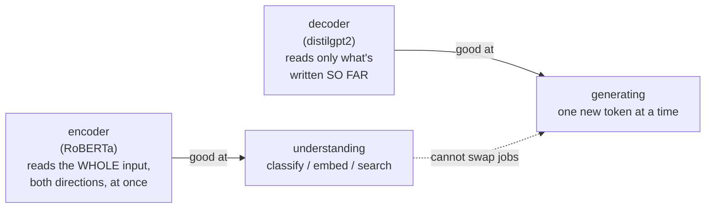
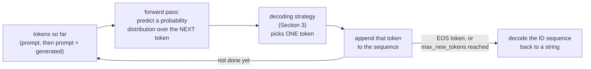
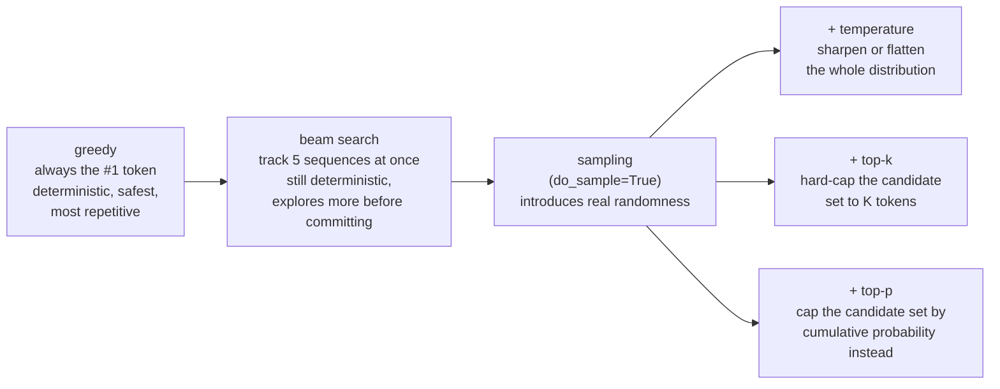
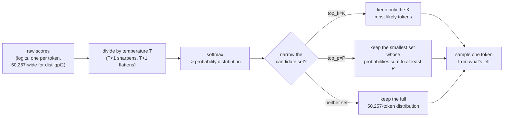
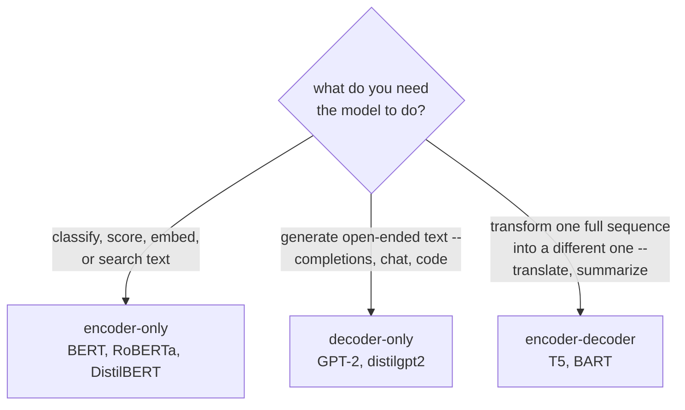

# Text Generation with a Decoder Model

*Machine Learning · Worked Examples · Natural Language · SPEC-ML-9*

## The model that can grade an essay but can't write one

Hand RoBERTa — the model from SPEC-ML-8's text classification chapter — a paragraph and ask "is
this positive or negative," and it answers instantly and well. So the next move looks obvious:
keep the same model, just ask it to keep *writing* instead of grading. Point RoBERTa's `generate()`
at the prompt "The future of AI is" and let it finish the sentence.

**It can't.** Not "it's mediocre at it" — it is architecturally incapable of open-ended text
generation, for a reason that's checkable from the model's own metadata in four lines of code, not
asserted from a hunch. (An earlier pass at this curriculum assumed you could take RoBERTa and just
point it at `generate()` — you can't, and this chapter starts by showing exactly why, in the
model's own words, before it shows you the model family that *can*.)

Here's the one-sentence version, the kind you could repeat at dinner: **an encoder reads a whole
input at once to understand it; a decoder writes one piece at a time, using only what's already
been written, over and over, until it decides to stop.** If you've built request-handling code in
Java, this maps onto a distinction you already carry around: a **validator** that reads an entire
request and renders one verdict (valid or not, positive or negative — RoBERTa's job) is a
fundamentally different piece of machinery from a **generator** that produces a new response one
token at a time, each token depending on everything produced so far (a decoder's job). No amount of
reconfiguring a validator turns it into a generator — the internals that make one good at its job
make it structurally unable to do the other.



Everything below runs from
[`text_generation.py`](code/text_generation.py), and every claim about a model, a license, or an API
parameter traces to
[research/NOTE-ML-7-nlp-models.md](../../../research/NOTE-ML-7-nlp-models.md), which itself cites the
RoBERTa paper and the installed library versions directly.

### Environment

```text
torch==2.14.0+cpu
transformers==5.16.1
Python 3.13 (.venv-ml)
```

Installed and verified live in the project's shared `.venv-ml` virtual environment (checked
2026-09-02), matching NOTE-ML-7-nlp-models.md. Everything in this chapter runs on CPU — no GPU
needed. The one model this chapter generates text with, `distilbert/distilgpt2`, is 82M parameters
(measured below) and downloads in seconds even on a modest connection.

## 1. What & why — encoder vs. decoder vs. encoder-decoder

Every transformer-based language model is built from the same core operation — self-attention, a way
for every token in a sequence to gather context from other tokens (the LLMs section's
[transformer-internals.md](../03-llms/01-transformer-internals.md) opens that mechanism up in full if you
want the internals; nothing here depends on having read it first) — but *how* that attention is
allowed to look at the input is what separates three distinct model families with three distinct
jobs:

```mermaid
flowchart TB
    subgraph ENC["Encoder-only -- BERT, RoBERTa"]
        E1["bidirectional attention:<br/>every token sees every token,<br/>both directions"] --> E2["pretrained on: masked LM<br/>(fill in a HIDDEN token<br/>using context from both sides)"]
        E2 --> E3["good at: understanding<br/>classify, embed, search"]
    end
    subgraph DEC["Decoder-only -- GPT-2, distilgpt2"]
        D1["causal attention:<br/>every token sees only<br/>itself and EARLIER tokens"] --> D2["pretrained on: causal LM<br/>(predict the NEXT token<br/>from everything before it)"]
        D2 --> D3["good at: generating<br/>completions, chat, code"]
    end
    subgraph S2S["Encoder-decoder -- T5, BART"]
        S1["encoder half bidirectional;<br/>decoder half causal +<br/>attends back to the encoder"] --> S2["pretrained on: sequence-to-sequence<br/>(map one full sequence<br/>to a different one)"]
        S2 --> S3["good at: transforming<br/>translate, summarize"]
    end
```



| Family | Attention direction | Pretraining objective | What it's good at | Example |
|---|---|---|---|---|
| **Encoder-only** | Bidirectional — every token sees every other token, both directions | Masked language modeling (predict a *hidden* token from its full context) | Understanding: classification, embeddings, search | BERT, **RoBERTa** |
| **Decoder-only** | Causal — every token sees only *itself and earlier* tokens | Causal (autoregressive) language modeling (predict the *next* token from everything before it) | Generation: completions, chat, code | GPT-2, **distilgpt2** |
| **Encoder-decoder** | Encoder half bidirectional; decoder half causal + attends back to the encoder | Sequence-to-sequence (map one sequence to a different one) | Translation, summarization | T5, BART |

RoBERTa sits in the first row, and NOTE-ML-7-nlp-models.md is explicit about what that means: RoBERTa
is **encoder-only**, trained with masked language modeling and bidirectional context, and this is
confirmed directly against the paper that introduced it
([source: RoBERTa: A Robustly Optimized BERT Pretraining Approach](https://arxiv.org/abs/1907.11692),
Liu et al. 2019, checked 2026-09-02). The paper's own framing: RoBERTa predicts randomly *masked*
tokens using context from both sides at once — during training it never once had to predict "the next
token given only what came before," which is the single operation autoregressive generation repeats
in a loop, thousands of times, to produce a paragraph.

### Seeing it in RoBERTa's own config, not asserted from memory

Rather than take that on faith, ask RoBERTa's own HuggingFace config
([code](code/text_generation.py), `section_1_why_roberta_cant_generate`):

```python
from transformers import AutoConfig

config = AutoConfig.from_pretrained("roberta-base")
print(f"model_type:        {config.model_type}")
print(f"architectures:      {config.architectures}")
print(f"is_decoder:         {config.is_decoder}")
print(f"add_cross_attention:{config.add_cross_attention}")
```

Actual output from the gate run:

```text
model_type:        roberta
architectures:      ['RobertaForMaskedLM']
is_decoder:         False
add_cross_attention:False
```

Three facts, straight from the checkpoint's own metadata:

- **`architectures: ['RobertaForMaskedLM']`** — the pretrained checkpoint's head is a *masked*-LM
  head, not a causal-LM head. There is no next-token-prediction output to sample from.
- **`is_decoder: False`** — RoBERTa's self-attention layers carry no causal mask. Every token already
  sees every other token, both before and after it, at every layer. There's no way to "hide the
  future" from a model that was never trained with a notion of future-hiding in the first place.
- **`add_cross_attention: False`** — RoBERTa also has none of the machinery an encoder-decoder's
  decoder half needs to attend back to an encoder's output.

This chapter deliberately does **not** load RoBERTa's ~500MB of weights and force it through
`.generate()` just to show broken output — the architectural fact above is the actual reason, and
it's checkable from a few kilobytes of config, not from a wasted download. This is the naive attempt
failing before it even starts: no exception to catch, no bad text to laugh at — just a config field
that says, flatly, "this model was never built for the job you're about to ask of it."

## 2. Autoregressive generation — the next-token loop

So what *is* built for the job? A decoder-only model generates text by repeating one operation:
given all tokens so far, predict a probability distribution over the *next* token, pick one,
append it, repeat. That's it — no separate "generation mode," just the same forward pass a decoder
always does, called in a loop. **Autoregressive** is the name for exactly this: each new token is
predicted using the model's own previous outputs as part of its input — "auto" (self) +
"regressive" (feeding back).



In one line of math, at every step the model estimates:

$$P(x_t \mid x_1, x_2, \ldots, x_{t-1})$$

Plain-language gloss: "given everything written so far ($x_1$ through $x_{t-1}$), how likely is
each possible next word ($x_t$)?" That's a distribution over `distilgpt2`'s entire vocabulary —
50,257 possible next tokens, measured below — not one guess; turning that distribution into one
concrete choice is exactly what Section 3's decoding strategies do.

The Java-side analogy that transfers cleanly: think of building a `String` with a `StringBuilder`,
one character at a time, except at each step you don't pick a fixed next character — you get back
that whole 50,257-way probability distribution, and a *decoding strategy* decides how to turn it
into one concrete choice.

### The tokenizer round-trip

Text never touches the model directly. Every generation call does three things:

1. **Encode** — the tokenizer turns the prompt string into a sequence of integer token IDs
   (`tokenizer(prompt, return_tensors="pt")`).
2. **Generate** — the model repeatedly predicts a next-token distribution over those IDs and a
   decoding strategy picks one, appending it to the sequence, until it picks an end-of-sequence token
   or hits a length limit.
3. **Decode** — the tokenizer turns the final ID sequence back into a string
   (`tokenizer.decode(output_ids[0], skip_special_tokens=True)`).

```python
from transformers import AutoModelForCausalLM, AutoTokenizer

tokenizer = AutoTokenizer.from_pretrained("distilbert/distilgpt2")
model = AutoModelForCausalLM.from_pretrained("distilbert/distilgpt2")
model.eval()

num_params = model.num_parameters()
print(f"{num_params:,} parameters, n_positions={model.config.n_positions}")
```

Actual output ([source: distilgpt2 model card](https://huggingface.co/distilbert/distilgpt2),
Apache-2.0 license, checked 2026-09-02 per NOTE-ML-7-nlp-models.md):

```text
81,912,576 parameters, n_positions=1024
```

The model card lists distilgpt2 at "~88.2M parameters" (NOTE-ML-7-nlp-models.md); the number measured
directly above via `model.num_parameters()` on the checkpoint actually loaded into this environment is
81,912,576. Both figures describe the same model — small enough discrepancies between a published
headline figure and a runtime measurement are common across sources and don't change anything about
how the model behaves. What *is* load-bearing for later sections: `n_positions=1024` is the maximum
sequence length (prompt + generated tokens combined) this model can handle — more on that in
Pitfalls.

## 3. Decoding strategies — turn the knob, watch the text change

Everything above the "pick one token" step is identical across every decoding strategy: same model,
same forward pass, same probability distribution over 50,257 tokens. The strategies differ *only* in
how they turn that distribution into a chosen token — which means you can hold the model completely
fixed and watch the output change purely by turning a knob. `text_generation.py` runs the exact same
prompt, `"The future of AI is"`, through `distilgpt2.generate()` six times, changing only the
decoding parameters, and prints and saves the real output of every run — nothing below is
hand-written.

The six settings sit on one spectrum, from "always play it safe" to "let the model take real risks":



### Step by step, on the real prompt

**Step 1 — greedy: always the single most likely word.** `do_sample=False, num_beams=1` — no
randomness at all. Plain-language gloss: it's autocomplete that never gambles, always taking
whichever next word the model currently rates highest.

```text
"The future of AI is not yet clear." (then 26 blank lines -- see Pitfalls)
```

**Step 2 — beam search: track several sentences at once, keep the best.** `num_beams=5` — instead
of committing to the single best token at each step, keep the 5 highest-scoring *partial sequences*
in parallel, and return the one with the best overall score at the end. Still fully deterministic
(no randomness), but it explores more of the possibility space than greedy before committing to an
answer:

```text
"The future of AI is in the hands of the AI." (then 22 blank lines)
```

**Step 3 — start sampling: let the model roll dice.** `do_sample=True` turns on genuine randomness —
instead of always taking the top pick, the model draws a token from the probability distribution
itself, so a token rated 5% likely gets picked roughly 1 time in 20. This is the point where
"deterministic" stops being true at all: run the exact same prompt twice and you can get two
different continuations (which is why the code fixes a seed for reproducibility — more below).

**Step 4 — control the randomness with temperature.** Before turning probabilities into a
distribution to sample from, the model's raw scores (**logits**, one per possible next token) get
divided by a temperature $T$:

$$P(x_i) = \frac{\exp(z_i / T)}{\sum_j \exp(z_j / T)}$$

Plain-language gloss: $z_i$ is "how much the model likes token $i$, before normalizing"; dividing by
$T$ before the usual softmax either sharpens the distribution ($T<1$: the leader pulls further
ahead, output reads closer to greedy, safer, less varied) or flattens it ($T>1$: more of the
vocabulary gets a real shot, output reads more varied, more prone to incoherence). $T=1.0$ leaves the
model's probabilities unchanged
([source: HuggingFace, "How to generate text: using different decoding methods for language
generation with Transformers"](https://huggingface.co/blog/how-to-generate), checked 2026-09-03 —
"a trick is to make the distribution sharper... by lowering the temperature," the same mechanism
this formula expresses).

Below 1.0 (sharper, safer):

```text
"The future of AI is not just the work of the AI, but also the work of the human being and the mind
itself. The AI's design process is not just about"
```

Above 1.0 (flatter, riskier) — same model, same prompt, same seed, only $T$ changed:

```text
"The future of AI is solid and intelligent work moves on in humanoid conversations, smart hearts
translating crucial commands once again would we ever understand interacting with siblings)." >>>
Once It ACM"
```

Watch what happened: turning one number up let genuinely low-probability, barely-related tokens
through, and "diverse" visibly shaded into "incoherent" by the end of the sentence.

**Step 5 — cap the risk with top-k.** Before sampling, throw away every token except the `K` most
likely ones, then sample from just those `K`, renormalized. This caps how weird a single sampled
token can ever be — even at a high temperature, a `top_k=10` filter never samples from outside the
10 most plausible next tokens:

```text
"The future of AI is not just the future, it's the future, it is the future, and it is the future.
The AI is the future, it is the"
```

**Step 6 — cap the risk adaptively with top-p (nucleus sampling).** Instead of a fixed count, keep
the *smallest* set of most-likely tokens whose cumulative probability reaches `P`, then sample from
that set. When the model is very confident (one token dominates), the candidate set can be tiny; when
it's genuinely uncertain (many tokens are plausible), the set grows to match:

```text
"The future of AI is solid and intelligent and moves on in humanoid conversations, smart, intelligent,
and even clearer. AI can understand, perceive, act, act, respond,"
```

Here's the mechanics behind steps 4–6 as one pipeline — same logits in, three different ways to
narrow the field before the dice get rolled:



### The code behind all six steps

```python
def generate(tokenizer, model, prompt: str, **gen_kwargs) -> tuple[str, float]:
    inputs = tokenizer(prompt, return_tensors="pt")
    output_ids = model.generate(
        **inputs,
        max_new_tokens=30,
        pad_token_id=tokenizer.eos_token_id,
        **gen_kwargs,
    )
    return tokenizer.decode(output_ids[0], skip_special_tokens=True)


settings = {
    "greedy": dict(do_sample=False, num_beams=1),
    "beam_5": dict(do_sample=False, num_beams=5),
    "temperature_0.7": dict(do_sample=True, temperature=0.7, top_k=0, top_p=1.0),
    "temperature_1.5": dict(do_sample=True, temperature=1.5, top_k=0, top_p=1.0),
    "top_k_10": dict(do_sample=True, temperature=1.0, top_k=10, top_p=1.0),
    "top_p_0.95": dict(do_sample=True, temperature=1.0, top_k=0, top_p=0.95),
}
```

All decoding parameters above (`do_sample`, `temperature`, `top_k`, `top_p`, `num_beams`) are the
`generate()` keyword arguments confirmed against transformers 5.16.1 in
NOTE-ML-7-nlp-models.md. `transformers.set_seed(42)` is called before every sampling call in the
actual script, so the sampled rows below reproduce exactly on a re-run
([code](code/text_generation.py), `generate()`).

### The full comparison, side by side

Real output from the gate run, and the same data written to
[`artefacts/decoding_comparison.csv`](artefacts/decoding_comparison.csv):

| Setting | Parameters | Output (prompt + continuation) | Time (CPU) |
|---|---|---|---|
| `greedy` | `do_sample=False, num_beams=1` | "The future of AI is not yet clear." *(then 26 blank lines — see Pitfalls)* | 1.18s |
| `beam_5` | `do_sample=False, num_beams=5` | "The future of AI is in the hands of the AI." *(then 22 blank lines)* | 1.67s |
| `temperature_0.7` | `do_sample=True, temperature=0.7` | "The future of AI is not just the work of the AI, but also the work of the human being and the mind itself. The AI's design process is not just about" | 0.73s |
| `temperature_1.5` | `do_sample=True, temperature=1.5` | "The future of AI is solid and intelligent work moves on in humanoid conversations, smart hearts translating crucial commands once again would we ever understand interacting with siblings)." >>> Once It ACM" | 0.69s |
| `top_k_10` | `do_sample=True, top_k=10` | "The future of AI is not just the future, it's the future, it is the future, and it is the future. The AI is the future, it is the" | 0.65s |
| `top_p_0.95` | `do_sample=True, top_p=0.95` | "The future of AI is solid and intelligent and moves on in humanoid conversations, smart, intelligent, and even clearer. AI can understand, perceive, act, act, respond," | 0.99s |

Read this table left to right, coherence-wise, and the knobs' effects are visible in the actual
text, not just in theory:

- **Greedy and beam_5** both produced a short, grammatical, *confident-sounding* sentence and then
  fell into repeating the newline token 20+ times — the most deterministic strategies are also the
  ones most exposed to the repetition pitfall (Section 5).
- **`temperature_0.7`** (below 1.0, sharper) stayed the most coherent of the sampled rows — readable,
  on-topic, grammatically sound throughout all 30 new tokens.
- **`temperature_1.5`** (above 1.0, flatter) visibly degrades by the end — "smart hearts translating
  crucial commands," "siblings)." >>> Once It ACM" — the flattened distribution let genuinely
  low-probability, barely-related tokens through. This is temperature's failure mode made concrete:
  turn it up enough and "diverse" shades into "incoherent."
- **`top_k_10` and `top_p_0.95`** each land somewhere in between — constrained enough to stay
  grammatical, unconstrained enough to differ from both each other and from the temperature-only rows.
  distilgpt2's own weights and this exact random seed produced these specific words; a different seed,
  a different prompt, or a larger model would produce different text, but the *qualitative* pattern —
  low temperature reads safer and more repetitive, high temperature reads more varied and more prone
  to nonsense — is the thing to take away, not these specific sentences.

## 4. Model families recap — pick the right one for the job

Section 1's table, now as the decision you'd actually make in a design doc:



- **Need to classify, score, embed, or search text?** Reach for an **encoder** (BERT, RoBERTa,
  DistilBERT) — SPEC-ML-8's text classification chapter covers this. Bidirectional context is exactly
  what you want when the whole input is available upfront and you need to *understand* it.
- **Need to generate open-ended text — completions, chat, code?** Reach for a **decoder** (GPT-2,
  distilgpt2, and every modern chat-oriented LLM). Causal attention and next-token prediction are what
  generation *is*.
- **Need to transform one full sequence into a different one — translate a sentence, summarize a
  document?** Reach for an **encoder-decoder** (T5, BART): the encoder half reads the whole input
  bidirectionally first, then the decoder half generates the output causally while attending back to
  everything the encoder saw. Per NOTE-ML-7-nlp-models.md, this family is the right fit for genuinely
  sequence-to-sequence tasks — out of scope for hands-on code in this chapter, but worth knowing it
  exists so you don't reach for a decoder-only model and fight its lack of a dedicated "read the whole
  input first" phase.

None of these is strictly "better" — they're different tools shaped by different pretraining
objectives, the same way you wouldn't reach for a message queue consumer to answer a synchronous
request/response call, even though both "process messages."

## 5. Pitfalls

- **Repetition loops, and they don't announce themselves as errors.** Both `greedy` and `beam_5` in
  Section 3's table produced a clean opening sentence, then silently degenerated into repeating the
  newline token over and over — no exception, no warning, just `max_new_tokens` worth of dead output.
  `text_generation.py`'s `section_3_repetition_pitfall` reproduces this on purpose with a
  repetition-prone prompt, `"The dog said the dog said the dog"`:

```python
without_fix, _ = generate(tokenizer, model, loop_prompt, do_sample=False, num_beams=1)
with_fix, _ = generate(
    tokenizer, model, loop_prompt, do_sample=False, num_beams=1, no_repeat_ngram_size=3
)
```

  Actual output:

  ```text
  plain greedy                    -> 'The dog said the dog said the dog was a "fool" and said he was
  "a fool" and said he was "a fool."\n\n\n\n\n\n'
  greedy + no_repeat_ngram_size=3 -> 'The dog said the dog said the dog was a "fool" and said he was
  "a fool" after the dog's owner told him to leave the house.\n\n\n'
  ```

  `no_repeat_ngram_size=3` forbids the model from repeating any 3-token sequence it's already
  produced, which forced a different, less looping continuation — still not brilliant prose from an
  82M-parameter model, but visibly less stuck. Greedy and low-diversity sampling are the strategies
  most exposed to this; higher temperature or top-k/top-p sampling reduce it by construction, since
  they never let the model collapse onto repeatedly picking the exact same "safest" token.

- **Hallucination is not a bug — it's the mechanism working as designed.** distilgpt2 has no fact
  database, no retrieval step, no notion of "true" — every token is a statistical guess given the
  training data and everything generated so far. `text_generation.py`'s
  `section_4_hallucination_pitfall` makes this concrete with a fact-shaped prompt,
  `"Albert Einstein was born in the year"`, decoded greedily:

```python
fact_prompt = "Albert Einstein was born in the year"
text, _ = generate(tokenizer, model, fact_prompt, do_sample=False, num_beams=1)
```

  Actual output:

  ```text
  'Albert Einstein was born in the year 1867. He was born in the year 1867. He was born
  in the year 1867. He was born in the year 1867.'
  ```

  Einstein was actually born in **1879**. The model didn't hedge, didn't flag uncertainty, and didn't
  even generate a plausible-but-wrong-in-an-interesting-way answer — it confidently repeated a wrong
  year four times in a row, with a fluency indistinguishable from its correct-sounding output
  elsewhere in this chapter. A small model trained mostly for demonstration purposes (per
  NOTE-ML-7-nlp-models.md: "Distilgpt2 quality: Smaller than GPT-2; may produce lower-quality text;
  acceptable for tutorial demonstration") makes this failure mode easy to catch by eye; a larger,
  more fluent model produces the same kind of error with far less to signal that anything is wrong.
  Never trust a generated factual claim without independent verification — that gets more important,
  not less, as models get bigger and more fluent.

- **Context length is a hard ceiling, not a soft guideline.** `distilgpt2`'s `n_positions=1024`
  (measured in Section 2) is the maximum number of tokens — prompt plus every generated token combined
  — the model can attend over. Feed it a prompt near or past that limit and generation either truncates
  silently or the position embeddings run out of valid indices to look up, depending on how the call
  is made. There's no dynamic "just handle a longer document" fallback baked into the model
  architecture itself; production systems handle this with chunking, summarization passes, or a model
  built for a larger context window.

- **`distilgpt2` has no pad token, and skipping this bites you the moment you batch prompts.**
  `tokenizer.pad_token` is `None` out of the box for GPT-2-style tokenizers — they were trained to
  generate one sequence at a time, never batched with padding. Every `generate()` call in this
  chapter's code passes `pad_token_id=tokenizer.eos_token_id` explicitly to work around this; skip it
  and `generate()` either falls back to a warning-laden default or raises, depending on the exact call
  shape. The fix is one line, but it's an easy one to forget the first time you move from
  single-prompt demos to batched generation.

## 6. Recap & what's next

- **RoBERTa cannot generate text**, and it's not a library restriction — its `is_decoder=False`,
  bidirectional-only self-attention has no mechanism for "predict the next token given only the past,"
  the one operation autoregressive generation repeats in a loop (Section 1, confirmed directly from
  the checkpoint's own config, grounded against the RoBERTa paper).
- **Autoregressive generation** is one operation, repeated: encode the prompt to token IDs, predict a
  probability distribution over the next token ($P(x_t \mid x_1, \ldots, x_{t-1})$), pick one, append,
  repeat until an end-of-sequence token or a length limit — decode back to a string at the end
  (Section 2).
- **Decoding strategy is a separate concern from the model itself** — the same `distilgpt2` weights,
  the same forward pass, produced six visibly different continuations from the identical prompt in
  Section 3, purely by changing how the next-token probability distribution gets turned into a chosen
  token: deterministic (greedy, beam) vs. sampled (temperature, top-k, top-p), each with a real
  coherence/diversity trade-off visible directly in the generated text, not just asserted in theory.
- **Encoder, decoder, and encoder-decoder are three different tools for three different jobs**
  (Section 4) — understanding vs. generation vs. transformation — not a ranked list from worse to
  better.
- Repetition, hallucination, context-length limits, and the pad/eos-token gotcha (Section 5) are the
  four pitfalls worth internalizing before shipping anything built on a generative model, small or
  large.
- This chapter used an 82M-parameter model on CPU to make every mechanic visible and fast to iterate
  on. The curriculum's next section, LLMs, builds on exactly this foundation: **transformer-internals.md**
  ([Machine Learning/Worked Examples/llms/transformer-internals.md](../03-llms/01-transformer-internals.md))
  opens up the self-attention mechanism this chapter treated as a black box, then a follow-up chapter
  returns to text generation with a larger, instruction-tuned model.
