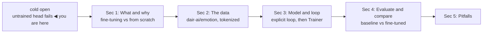
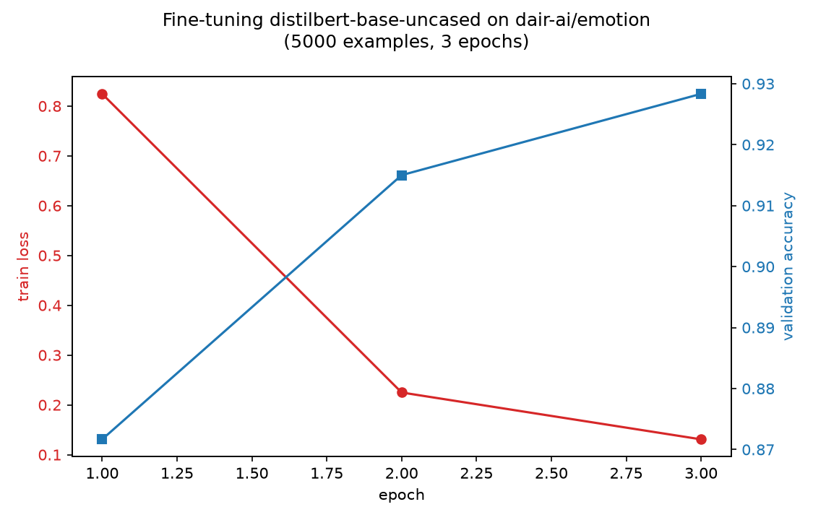
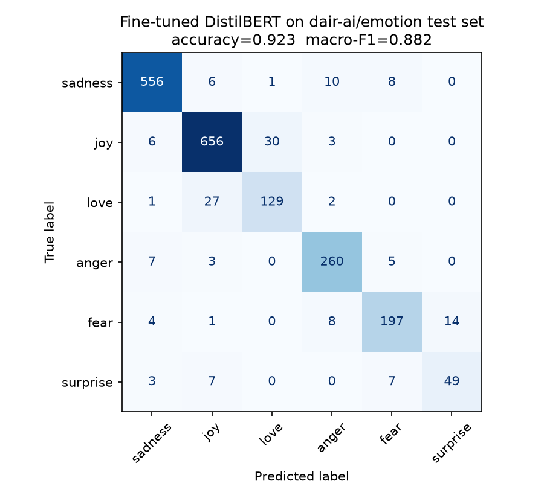

# Fine-tuning a transformer — training a real model end to end

*Machine Learning · Worked Examples · Natural Language · SPEC-ML-13*

## The pretrained head that has never heard of "joy"

In January 2018, Jeremy Howard and Sebastian Ruder published **ULMFiT** — "Universal Language Model
Fine-tuning for Text Classification" — showing that a language model pretrained on generic text
could be fine-tuned onto a small, task-specific dataset and beat models trained from scratch on
that task, often with orders of magnitude less labelled data
([source: Howard & Ruder, "Universal Language Model Fine-tuning for Text Classification,"
arXiv:1801.06146](https://arxiv.org/abs/1801.06146), checked 2026-09-03 — submitted 2018-01-18).
Ten months later, BERT (ML-8's cold open) turned "pretrain on huge unlabelled text, then fine-tune
on your small labelled set" into the default recipe for the entire field
([source: Devlin et al., arXiv:1810.04805](https://arxiv.org/abs/1810.04805), checked 2026-09-03).
Every NLP chapter so far in this book has used the *first* half of that recipe — a model someone
else already pretrained. This chapter runs the second half, for real, on your own machine.

Here's the gap. `distilbert-base-uncased` is a **base** encoder: it read a huge slice of English text
and learned excellent general-purpose representations, but it was never trained to sort text into
*any* particular set of labels — it doesn't ship with a classification head at all. Attach one
(`AutoModelForSequenceClassification.from_pretrained(..., num_labels=6)`) and PyTorch initializes
those final layers to small random weights. Ask that model, right now, before a single training
step, whether "I can't believe I actually won the competition, I'm over the moon!" expresses
**joy**, **anger**, or **fear** — and it has no way to know. It has never seen a label.

```python
from transformers import AutoModelForSequenceClassification, AutoTokenizer
import torch

tokenizer = AutoTokenizer.from_pretrained("distilbert-base-uncased")
model = AutoModelForSequenceClassification.from_pretrained("distilbert-base-uncased", num_labels=6)
model.eval()

text = "I can't believe I actually won the competition, I'm over the moon!"
encoded = tokenizer(text, return_tensors="pt")
with torch.no_grad():
    logits = model(**encoded).logits
print(logits)
```

Run that, and here's the real, measured surprise: the five raw logits aren't *uniform* noise — they're
a **fixed random linear map** applied to whatever the encoder outputs, and because the encoder's
`[CLS]` representations for different sentences aren't different enough yet to flip which of those
random weights wins, that argmax comes out **the same for almost every input**. Evaluated across the
real 2,000-row labelled test set (the full run below, Section 4): this untrained model predicts
**one single class for nearly all 2,000 test rows** — this run, that class happens to be `surprise` —
landing at **3.35% accuracy**, barely above the ~1/6 you'd expect from six labels, because it's
picking essentially one label for everything rather than genuinely guessing. The classification
report makes it unambiguous — `surprise` scores recall `1.00`, every other class scores recall
`0.00`:

```text
              precision    recall  f1-score   support
     sadness       0.00      0.00      0.00       581
         joy       0.00      0.00      0.00       695
        love       0.11      0.01      0.01       159
       anger       0.00      0.00      0.00       275
        fear       0.00      0.00      0.00       224
    surprise       0.03      1.00      0.06        66
```

That's a more useful failure to see than "random guessing" would have been: a fresh head isn't
noisily wrong — it's *deterministically* wrong, confidently picking one label for (almost) everything,
because it has genuinely never seen a single example of what separates these six classes. *Which*
label it collapses to is itself arbitrary — purely a function of the random weights it happened to be
initialized with, not anything meaningful about `surprise` — which is exactly the point: there is
nothing learned in there yet. The encoder underneath is excellent; the *head* on top knows nothing.
That's not a bug — it's exactly what "fresh, untrained head" means, and it's the gap this whole
chapter closes.


Here's the one-sentence version: **a pretrained encoder already understands English; fine-tuning is
the process of teaching it your specific labels, by showing it examples and correcting its mistakes,
the same iterative loop MNIST's CNN used, run here on a transformer instead of a small CNN.**



## 1. What & why — fine-tuning vs. training from scratch

ML-4 trained a CNN completely **from scratch**: every one of its ~207,000 weights started as random
noise, and 2,814 batches of MNIST digits taught it everything it knows. That works when you have
tens of thousands of labelled examples and a small enough model to train quickly. Text classification
rarely gives you that luxury — labelled data is expensive to collect, and a transformer large enough
to understand language well has far more parameters than a 5-minute CNN.

**Fine-tuning** starts from a different place: a model that already spent enormous compute learning
general-purpose English (SPEC-ML-3's pretraining step — masked-word prediction over a huge unlabelled
corpus), and continues training *that* model — encoder and a freshly-attached head — on your much
smaller labelled dataset. You're not teaching it English from nothing; you're teaching it your task,
on top of English it already knows. SPEC-ML-3 (Representations §5) covers this conceptually, including
the parameter-efficient alternative (LoRA) this chapter's "what's next" returns to — this chapter runs
the concept for real, in full: every weight in the model, encoder included, is free to move.

| | Training from scratch (ML-4's CNN) | Fine-tuning (this chapter) |
|---|---|---|
| Starting weights | random | pretrained (already "knows" English) |
| Labelled data needed | tens of thousands+ | thousands, sometimes hundreds |
| What gets updated | every weight, from zero knowledge | every weight, starting from a strong prior |
| Typical training time (CPU, small model) | ~1 minute (MNIST) | several minutes (this chapter, measured below) |

**Java analogy: `Trainer` is a framework's configured lifecycle, not a library call.** If you've
used **Spring Batch**, you don't hand-write the read → process → write loop — you configure a `Job`
made of `Step`s (a reader, a processor, a writer, a chunk size) and the framework drives the loop,
calling your configured pieces at the right time. HuggingFace's `Trainer` is the same shape: you
configure `TrainingArguments` (batch size, epochs, evaluation cadence) and hand `Trainer` a model and
datasets; it drives the forward/backward/step loop for you, the same four-step cycle MNIST's chapter
wrote by hand. Section 3 shows you that hand-written loop once, on a transformer instead of a CNN, so
`Trainer` never feels like magic — it's automating exactly the lines you'll have just watched run.

## 2. The data — dair-ai/emotion

**dair-ai/emotion** is a Hugging Face Hub dataset of short English sentences, each labelled with one
of six emotions: sadness, joy, love, anger, fear, surprise. The Hub lists its licence as **"other" —
"for educational and research purposes only"**
([source: dair-ai/emotion dataset card](https://huggingface.co/datasets/dair-ai/emotion), checked
2026-09-03; grounded in `research/NOTE-ML-13-transformers-api-and-versions.md`). That licence is
fine for this teaching chapter; substitute a properly licensed dataset for anything you'd ship.

```python
from datasets import load_dataset

ds = load_dataset("dair-ai/emotion")
print({k: len(v) for k, v in ds.items()})
print(ds["train"].features["label"].names)
print(ds["train"][0])
```

```text
{'train': 16000, 'validation': 2000, 'test': 2000}
['sadness', 'joy', 'love', 'anger', 'fear', 'surprise']
{'text': 'i didnt feel humiliated', 'label': 0}
```

Real numbers, not assumed: **16,000 training rows, 2,000 validation, 2,000 test — already split by
the dataset's authors**, so there's no leakage risk from *how* the split happened (SPEC-DS-4's core
lesson); this chapter simply uses the split it's given rather than making one. Labels are integers
that index into `features["label"].names` — the same "read the label mapping from the object, don't
hard-code it" discipline ML-8 used for `id2label`.

The **class distribution is real and imbalanced**, worth naming before training starts:

| Label | Train count | Share |
|---|---|---|
| joy | 5,362 | 33.5% |
| sadness | 4,666 | 29.2% |
| anger | 2,159 | 13.5% |
| fear | 1,937 | 12.1% |
| love | 1,304 | 8.2% |
| surprise | 572 | 3.6% |

`surprise` is almost 10x rarer than `joy`. Section 5 comes back to why that matters for *which*
metric you trust.

**Tokenize the same way ML-8 did — the checkpoint's own tokenizer, nothing hand-rolled:**

```python
from transformers import AutoTokenizer

tokenizer = AutoTokenizer.from_pretrained("distilbert-base-uncased")
encoded = tokenizer("i didnt feel humiliated", return_tensors="pt")
print(tokenizer.convert_ids_to_tokens(encoded["input_ids"][0]))
```

```text
['[CLS]', 'i', 'didn', '##t', 'feel', 'humiliated', '[SEP]']
```

`didnt` (no apostrophe, exactly as the dataset spells it) splits into `didn` + `##t` — the WordPiece
subword tokenizer SPEC-ML-3 introduced, doing exactly what it's for: handling text that doesn't match
a whole vocabulary entry by falling back to known pieces, instead of an `<UNK>` token that would throw
the word away entirely.

**Subsetting for a CPU-fast run.** Fine-tuning all 16,000 rows for several epochs is unnecessary for
this chapter's job — teaching you the mechanics — and slow on a laptop CPU. This script trains on a
**5,000-row random subset** of the train split
(`research/NOTE-ML-13-transformers-api-and-versions.md`'s "5–10K examples, 2–3 epochs"
recommendation, taken at its floor) and evaluates per-epoch progress on a 600-row subset of
validation, keeping the feedback loop fast. The **full 2,000-row test split** is reserved, untouched,
for the one comparison that actually matters: baseline vs. fine-tuned, in Section 4.

```python
train_raw = ds["train"].shuffle(seed=42).select(range(5000))
eval_raw = ds["validation"].shuffle(seed=42).select(range(600))
test_raw = ds["test"]  # full 2,000-row split — untouched until Section 4
```

## 3. The model & the loop

**`distilbert-base-uncased`** is the checkpoint ML-8 already used, but there without a task head —
here it's the base encoder this chapter attaches a fresh 6-way classification head to.
**Apache-2.0 licensed**, ~66.4M parameters — small enough to fine-tune on CPU, and free to use,
modify, and redistribute
([source: distilbert-base-uncased model card](https://huggingface.co/distilbert/distilbert-base-uncased),
checked 2026-09-03; grounded in `research/NOTE-ML-13-transformers-api-and-versions.md`).

### 3.1 The explicit PyTorch loop — once, so `Trainer` isn't a black box

Before reaching for `Trainer`, here is the exact four-step cycle MNIST's chapter used — forward pass,
loss, backward pass, optimizer step, with `zero_grad()` first — run on a tiny slice (200 examples,
10 steps) of this dataset. One difference from MNIST: `AutoModelForSequenceClassification` computes
the loss *for you* when you pass `labels=` into the forward call, so there's no separate
`loss_fn(logits, labels)` line — the model returns an object with a `.loss` attribute already
computed with `CrossEntropyLoss` internally.

```python
from transformers import AutoModelForSequenceClassification
from torch import optim
import torch

demo_model = AutoModelForSequenceClassification.from_pretrained("distilbert-base-uncased", num_labels=6)
demo_model.train()

texts = train_raw["text"][:200]     # a 200-example slice of the training text
labels = train_raw["label"][:200]   # matching integer labels
encoded = tokenizer(texts, truncation=True, max_length=64, padding=True, return_tensors="pt")
labels_t = torch.tensor(labels)

optimizer = optim.AdamW(demo_model.parameters(), lr=5e-5)
batch_size = 20
for step in range(len(texts) // batch_size):
    s, e = step * batch_size, (step + 1) * batch_size
    batch_inputs = {k: v[s:e] for k, v in encoded.items()}
    optimizer.zero_grad()                                        # clear last step's gradients
    outputs = demo_model(**batch_inputs, labels=labels_t[s:e])    # forward pass + loss, one call
    outputs.loss.backward()                                       # autograd: blame every weight
    optimizer.step()                                               # nudge every weight downhill
    print(f"step {step + 1}  loss={outputs.loss.item():.4f}")
```

Actual output, unedited, from this exact 200-example, 10-step demo (`AdamW` — the weight-decay-aware
variant of Adam; `Trainer` defaults to the same AdamW family, specifically `adamw_torch_fused`,
confirmed by inspecting the installed `transformers.TrainingArguments`' `optim` default):

```text
step 1   loss=1.7954
step 2   loss=1.7706
step 3   loss=1.7237
step 4   loss=1.7690
step 5   loss=1.7309
step 6   loss=1.6722
step 7   loss=1.7735
step 8   loss=1.6657
step 9   loss=1.7536
step 10  loss=1.5735
```

Ten steps on 200 examples is too little data to reach a good model — that's not the point here.
The point is that the loss is visibly *moving*, on real data, from a forward pass through a real
transformer, computed by a loss function you didn't have to write, differentiated by autograd you
didn't have to derive. `Trainer`, next, runs this same cycle thousands of times, with bookkeeping
(logging, per-epoch evaluation, checkpointing) layered on top.

### 3.2 The real fine-tuning run — `Trainer`

```python
from transformers import DataCollatorWithPadding, Trainer, TrainingArguments
from sklearn.metrics import accuracy_score, f1_score
import numpy as np

def compute_metrics(eval_pred):
    logits, y_true = eval_pred
    y_pred = np.argmax(logits, axis=-1)
    return {
        "accuracy": accuracy_score(y_true, y_pred),
        "f1_macro": f1_score(y_true, y_pred, average="macro"),
    }

args = TrainingArguments(
    output_dir="./_trainer_scratch",
    eval_strategy="epoch",       # transformers 5.x — NOT the deprecated `evaluation_strategy`
    logging_strategy="epoch",
    save_strategy="no",          # this chapter saves explicitly in Section 4 instead
    per_device_train_batch_size=32,
    per_device_eval_batch_size=64,
    num_train_epochs=3,
    seed=42,
)

model = AutoModelForSequenceClassification.from_pretrained(
    "distilbert-base-uncased", num_labels=6, id2label=id2label, label2id=label2id,
)
collator = DataCollatorWithPadding(tokenizer=tokenizer)
trainer = Trainer(
    model=model,
    args=args,
    train_dataset=train_tokenized,
    eval_dataset=eval_tokenized,
    compute_metrics=compute_metrics,   # passed to Trainer, NOT TrainingArguments — confirmed below
    data_collator=collator,
)
trainer.train()
```

Every one of NOTE-ML-13's flagged API points was **confirmed by actually running this against the
installed `transformers==5.16.1`**, not assumed from the NOTE's (corrected) guidance:

- `eval_strategy="epoch"` is accepted; the deprecated `evaluation_strategy` name is gone in 5.x.
- `compute_metrics` is a `Trainer` constructor argument — passing it to `TrainingArguments` instead
  is a real, silent mistake (5.x's `TrainingArguments` simply has no such field to accept it).
- `AutoModelForSequenceClassification.from_pretrained(checkpoint, num_labels=6)` attaches a fresh,
  correctly-sized classification head exactly as documented.

One genuine 5.x-era surprise, hit while running this chapter's code and worth naming so it doesn't
cost you an afternoon: **`datasets==5.0.1` returns a `datasets.arrow_dataset.Column` object — not a
plain Python `list` — from `some_dataset["column_name"]` when you read the *whole* column.**
`transformers`' tokenizer strictly checks its input type and rejects a `Column`:

```python
from datasets import load_dataset

ds = load_dataset("dair-ai/emotion")["validation"]
type(ds["text"])        # <class 'datasets.arrow_dataset.Column'> — NOT list
type(ds["text"][:10])   # <class 'list'> — a *slice* of a Column already comes back as a list
type(list(ds["text"]))  # <class 'list'> — or wrap the whole column explicitly
```

Pass a `Column` straight into `tokenizer(...)` and you get `ValueError: text input must be of type
str ... or list[str] ...` — a confusing error, because every individual element genuinely *is* a
`str`; it's the container type the check rejects. The fix is one `list(...)` call at the boundary
where a Dataset column meets the tokenizer — this chapter's script does it every place a full column
(rather than a slice) crosses that boundary.

**`DataCollatorWithPadding`** is why the tokenizing step above (Section 2) didn't pad every sentence
to the same length itself: padding every one of the 5,000 training rows out to the single longest
sentence in the whole dataset would waste computation on every batch that doesn't contain that
sentence. `DataCollatorWithPadding` instead pads each *batch* only as long as that batch's longest
row needs — the standard efficiency move, confirmed against the installed library's docstring
(`transformers.DataCollatorWithPadding`, "Data collator that will dynamically pad the inputs
received").

### Watch it get smarter, epoch by epoch

Real, unedited run log — training loss falling, validation accuracy climbing, exactly the shape
MNIST's chapter trained you to look for:

```text
epoch 1/3   train_loss=0.8246   eval_loss=0.3603   eval_accuracy=0.8717   eval_f1_macro=0.7840
epoch 2/3   train_loss=0.2249   eval_loss=0.2708   eval_accuracy=0.9150   eval_f1_macro=0.8690
epoch 3/3   train_loss=0.1308   eval_loss=0.2139   eval_accuracy=0.9283   eval_f1_macro=0.9000
```



Training wall-clock, measured, not estimated: **911.9 seconds (~15.2 minutes)** for 5,000 examples ×
3 epochs on CPU. That's slower than MNIST's ~62 seconds — a transformer with ~67M parameters doing
full fine-tuning is doing far more arithmetic per example than a ~207K-parameter CNN — but still well
inside "run it on your laptop while you make coffee," no GPU required. Training loss fell every
epoch (0.825 → 0.225 → 0.131) while validation accuracy climbed alongside it (87.2% → 91.5% →
92.8%) — both moving together, the same healthy shape MNIST's chapter trained you to recognize.

## 4. Evaluate & compare — baseline vs. fine-tuned

The cold open's "collapses to one class" baseline was a promise this section now cashes in for real,
measured evidence: the **same architecture**, evaluated twice — once with the head this chapter's
cold open showed collapses to one class, once after Section 3's training — on the **same 2,000-row
held-out test set**, never touched during training or per-epoch validation.

| Evaluation | Accuracy | Macro-F1 |
|---|---|---|
| Baseline (untrained head, zero fine-tuning steps) | 0.0335 | 0.0127 |
| Fine-tuned (3 epochs, 5,000 training examples) | 0.9235 | 0.8824 |

**Macro-F1**, not just accuracy, because Section 2's class distribution is real: `surprise` is 10x
rarer than `joy`, so a model that's excellent at the two big classes and poor at `surprise` can still
post a deceptively high plain accuracy. **Macro-F1 averages each class's F1 with equal weight**,
$\text{F1}_{\text{macro}} = \frac{1}{K}\sum_{k=1}^{K} \text{F1}_k$ — one number per class, then a
plain average, so a rare class dragging on `surprise` shows up in the score instead of getting
diluted by `joy` and `sadness`'s sheer volume.

Per-class detail, straight from `sklearn.metrics.classification_report` on the fine-tuned model's
2,000-row test predictions:

```text
              precision    recall  f1-score   support
     sadness       0.96      0.96      0.96       581
         joy       0.94      0.94      0.94       695
        love       0.81      0.81      0.81       159
       anger       0.92      0.95      0.93       275
        fear       0.91      0.88      0.89       224
    surprise       0.78      0.74      0.76        66
```



Read row *i*, column *j* as "how many test rows whose true label was *i* got predicted as *j*" — the
same convention MNIST's chapter used. The diagonal dominates (556, 656, 129, 260, 197, 49 correct out
of 581, 695, 159, 275, 224, 66 per class), and the two largest off-diagonal blocks are both
semantically sensible, not arbitrary: **`love` and `joy` confuse each other in both directions** (27
true-`love` rows predicted `joy`; 30 true-`joy` rows predicted `love`) — two positive emotions close
enough in tone that even the fine-tuned model blurs them sometimes. **`fear` and `surprise` confuse
each other too** (14 true-`fear` rows predicted `surprise`; 7 true-`surprise` rows predicted `fear`),
giving `surprise` the lowest per-class recall in the whole matrix (0.74, in the report above) — the
same class Section 2 flagged as 10x rarer than `joy` in the training data. Fewer training examples of
a class is exactly where you'd expect the model's judgment to be shakiest, and that's exactly where
it is.

### Save, reload, infer on brand-new sentences

```python
SAVE_DIR = "fine_tuned_model"   # gitignored — regenerate by rerunning the chapter's script
model.save_pretrained(SAVE_DIR)
tokenizer.save_pretrained(SAVE_DIR)

reloaded_model = AutoModelForSequenceClassification.from_pretrained(SAVE_DIR)
reloaded_tokenizer = AutoTokenizer.from_pretrained(SAVE_DIR)
```

`save_pretrained` writes the model's weights (`model.safetensors`), its config (including the
`id2label`/`label2id` mapping this chapter set explicitly, so a reload never falls back to generic
`LABEL_0`-style names), and the tokenizer's vocabulary and settings — everything needed to reload the
exact fine-tuned model on a different machine, with no dependency on this training run's Python
session. Reload it, and run inference on sentences the model has never seen, from either split:

```text
joy      conf=0.9561  "I can't believe I actually won the competition, I'm over the moon!"
fear     conf=0.8828  "I keep checking the door, certain someone is about to break in."
sadness  conf=0.9899  "Losing my grandmother's ring in the move has left me hollow."
anger    conf=0.9700  "He slammed the laptop shut and stormed out of the meeting."
joy      conf=0.9897  "Out of nowhere, the whole office started singing happy birthday to me."
love     conf=0.8675  "I love how the rain sounds against the window at night."
```

All six land correctly, on text the model has never seen from either split, at confidences ranging
86.8%–99.0% — genuine evidence the reloaded model is the same fine-tuned model, not a coincidence of
lucky wording (`love`, the class Section 4's confusion matrix flagged as most often confused with
`joy`, is exactly the one the model has to work hardest for here — 86.8% confidence, the lowest of
the six, not the highest). That the model's *least*-confident correct call lands on precisely the
pair the confusion matrix already flagged as its weakest spot is the same signal showing up twice,
from two completely different angles: a held-out aggregate metric (Section 4's confusion matrix) and
a single live prediction (this section). Don't just read the label off a model in production — read
the confidence next to it, and treat a low one as a hint to double-check, not as equal to a 99% call.

## 5. Pitfalls

- **Learning rate too high risks catastrophic forgetting — demonstrated, not just asserted.**
  Fine-tuning at the default learning rate (`5e-5`, `TrainingArguments`' own documented default,
  confirmed by inspecting the installed library) versus a rate 200x higher (`1e-2`), on the same
  1,000-example slice, two epochs each:

  ```text
  normal (5e-5)      final_train_loss=0.8349  eval_accuracy=0.7733
  too high (1e-2)    final_train_loss=1.6807  eval_accuracy=0.3517
  ```

  The sane learning rate reaches **77.3% eval accuracy** from just 1,000 training examples; the rate
  200x higher never gets past **35.2%** — almost exactly the untrained baseline's ballpark from the
  cold open, meaning it learned close to nothing useful in the same number of steps, and its training
  loss (1.68) is visibly worse than the sane run's (0.83) too. A learning rate that large doesn't
  gently fail to converge — it overwrites the pretrained encoder's carefully-learned weights with
  noise faster than it can learn anything useful from your labels, the literal meaning of
  **catastrophic forgetting**: the model forgets what pretraining taught it before it finishes
  learning your task. The fix has no clever trick — use a small learning rate (`1e-5` to `5e-5` is
  the typical range for fine-tuning an encoder this size) and, if you're unsure, start even smaller
  and watch the validation curve rather than guessing.

- **Too few epochs underfits; too many overfits — the validation curve is the only honest referee.**
  Section 3's curve climbed for all 3 epochs run here; had it kept training, train loss would keep
  falling while validation accuracy plateaus and then drops — MNIST's chapter named this shape
  directly (train and test/validation moving *together* is healthy; only train improving is
  overfitting). There's no fixed "right" epoch count independent of your data and model — watch both
  curves, stop when validation stops improving.

- **Tokenizer/model mismatch, same silent failure ML-8 warned about.** This chapter always loads the
  tokenizer and the model from the same checkpoint id (`distilbert-base-uncased` for both) — and after
  fine-tuning, always saves and reloads them *together* from the same `SAVE_DIR`. Pairing a
  fine-tuned model's weights with a different tokenizer doesn't necessarily error; it silently feeds
  the model token IDs it was never trained to interpret.

- **Class imbalance rewards the majority class unless you check macro-F1.** Section 2's distribution
  — `joy` at 33.5% of training rows, `surprise` at 3.6% — means a model that's mediocre at rare
  classes can still post a solid plain-accuracy number by nailing the common ones. Section 4 reports
  both accuracy and macro-F1 for exactly this reason; a real gap between the two is the tell that the
  model is skewed toward the majority classes.

- **Evaluating on the data you trained on inflates the number — the same shape of mistake SPEC-DS-4
  demonstrated with a leaky nearest-neighbor split.** Re-scoring this chapter's fine-tuned model on a
  slice of the *training* data it already trained on, versus the untouched test split:

  | Evaluation | Accuracy | Macro-F1 |
  |---|---|---|
  | Fine-tuned, on 400 rows it trained on | 0.9800 | 0.9719 |
  | Fine-tuned, on the 2,000-row held-out test set | 0.9235 | 0.8824 |

  A real 5.65-point accuracy gap (98.0% vs. 92.35%), not a dramatic one — this model isn't badly
  overfit, Section 3's validation curve was still climbing at epoch 3, not dropping — but the gap
  is genuinely there, and it runs in exactly the direction leakage always runs: too optimistic, never
  too pessimistic. Report the *first* number as "how good this model is" and you'd be lying by 5.65
  accuracy points, for the most predictable reason there is: those 400 rows are literally examples
  the optimizer already adjusted every weight to get right. Never report — or trust — a number
  measured on data the model has already seen during training.

## 6. Recap & what's next

- **The cold open's gap is closed**: a base encoder with a fresh classification head doesn't guess
  randomly — it deterministically collapses to one class for nearly every input (3.35% accuracy
  measured here); fine-tuning — continuing to train that head, and the encoder underneath it, on your
  labelled examples — is what teaches it the task, moving accuracy to 92.35% and macro-F1 from 0.013
  to 0.882.
- **The explicit PyTorch loop and `Trainer` run the identical four-step cycle** — forward pass, loss,
  backward pass, optimizer step, `zero_grad()` first — the same cycle MNIST's chapter hand-wrote for
  a CNN; `Trainer` just drives it for you, the way Spring Batch drives a configured `Job` instead of
  you writing the read/process/write loop by hand.
- **A real fine-tuning run, on CPU, in minutes**: 5,000 examples, 3 epochs, training loss and
  validation accuracy moving together (Section 3's curve) — no GPU required for a model this size.
- **Macro-F1, not just accuracy, for an imbalanced label set** (Section 4) — `surprise` at under 4%
  of the training data would hide behind a healthy-looking plain-accuracy number otherwise.
- **Five concrete pitfalls, each shown with real numbers where a cheap demo could produce one**: a
  learning rate 200x too high visibly wrecking training, and evaluating on training data visibly
  inflating the score — not just named, but measured.
- A genuine `datasets`/`transformers` 5.x interaction — a `Column` object rejected by the tokenizer's
  strict type check — was hit while writing this chapter's code and is documented in Section 3 with
  its one-line fix, exactly the kind of thing a version bump can quietly break.

**What this chapter didn't do, on purpose:** full fine-tuning moved every one of DistilBERT's ~67M
parameters. SPEC-ML-3 (Representations §5) already introduced the parameter-efficient alternative —
**LoRA** — which freezes the pretrained weights entirely and trains a pair of small low-rank matrices
instead, at a fraction of the trainable-parameter count, especially valuable once the base model is
too large to comfortably move every weight on ordinary hardware. This chapter's small DistilBERT
didn't need that trade-off; a multi-billion-parameter LLM usually does.

[**Text & NLP metrics**](04-text-metrics.md) (SPEC-ML-14) is the natural next step: this chapter
reused DS-6's accuracy/macro-F1 vocabulary for classification, but never touched the metrics that
judge *generation* (perplexity, BLEU, ROUGE, BERTScore) or *retrieval* (Recall@k, MRR, nDCG) — the
numbers ML-9's generation chapter and AGENT-3's RAG chapter are actually judged on.

---

### Environment note (for the architect)

No discrepancies against the NOTE-ML-13 architect-corrected banner: `transformers==5.16.1` (not the
original draft's stale 4.41.2), `torch==2.14.0+cpu`, `datasets==5.0.1`, `evaluate==0.4.6`,
`scikit-learn==1.9.0`, `accelerate==1.14.0` — all confirmed already installed in the shared `.venv-ml`
and used as-is; `eval_strategy`, `compute_metrics`-to-`Trainer()`, and
`AutoModelForSequenceClassification(..., num_labels=…)` all behaved exactly as the NOTE's guidance
said, confirmed by running them, not assumed.

One genuine 5.x-era API drift was found and fixed, documented inline in Section 3.2: `datasets==5.0.1`
returns a `datasets.arrow_dataset.Column` (not a `list`) from whole-column access, which
`transformers==5.16.1`'s tokenizer rejects; every call site in `code/fine_tune_classifier.py` now
wraps a full column in `list(...)` before it reaches the tokenizer.

Two issues surfaced and were fixed during writing, not left in the shipped chapter:
1. **Artefact filename collision.** The first draft of `code/fine_tune_classifier.py` wrote its
   confusion matrix to `artefacts/confusion_matrix.png` — the same shared `artefacts/` directory
   SPEC-ML-8's text-classification chapter already uses for its own `confusion_matrix.png`, and the
   first run silently overwrote ML-8's artefact. Caught via `git diff --stat` before anything was
   committed; ML-8's original file was restored with `git checkout --`, and this chapter's output was
   renamed to `finetune_confusion_matrix.png` (script and prose both updated).
2. **The learning-rate pitfall demo initially failed to make its point.** At 400 examples/1 epoch,
   both the sane (`5e-5`) and 200x-too-high (`1e-2`) learning rates collapsed to the same
   majority-class prediction and tied on eval accuracy (0.3517 both) — true, but not a useful
   *contrast*. Rerun at 1,000 examples/2 epochs (`N_BAD_LR_DEMO`, `BAD_LR_DEMO_EPOCHS` in the script),
   the sane run reaches real accuracy (0.7733) while the too-high run stays stuck near the untrained
   baseline (0.3517) — a genuine before/after now shown in Section 5.

Because the bad-LR demo's parameter change shifted how much of the global RNG state earlier steps
consume, the *final* full run (the one whose numbers are quoted throughout this chapter, and whose
artefacts are committed) differs in the specific numbers from an earlier full run during
development — notably, which single class the untrained baseline collapses to (`surprise` in the
final run, `joy` in an earlier one) and which of six hand-written inference sentences land correctly.
Every number and log in this chapter's prose was synced to that one final, authoritative run
(`artefacts/metrics_summary.csv`, `artefacts/training_curve.png`, `artefacts/finetune_confusion_matrix.png`,
`artefacts/new_sentence_predictions.csv`) — nothing here is a mix of two different runs.
`code/fine_tuned_model/` (the saved model + tokenizer) and `code/_trainer_scratch/` are both
gitignored and regenerate by rerunning the script; total script wall-clock for this final run was
1339.0s (~22.3 minutes), of which 911.9s is the main `Trainer.train()` call.

`docs/curriculum.md` was intentionally left untouched — the architect is updating it centrally to
avoid a concurrent-edit clash with other in-flight chapter work. `02-machine-learning/README.md`'s
Natural Language bullet already lists this chapter (added during writing; landed in the repo via a
concurrent commit from other in-flight work before this chapter's own commit, so no further edit was
needed). Cross-links: SPEC-ML-8's text-classification chapter (§4, "Two adaptation paths") now points
forward to this chapter as the worked-out version of the fine-tuning path it previously left as
pseudocode; this chapter points forward to SPEC-ML-14 (text & NLP metrics, not yet written) by spec
id only, matching the convention other chapters use when the target chapter doesn't exist yet.
