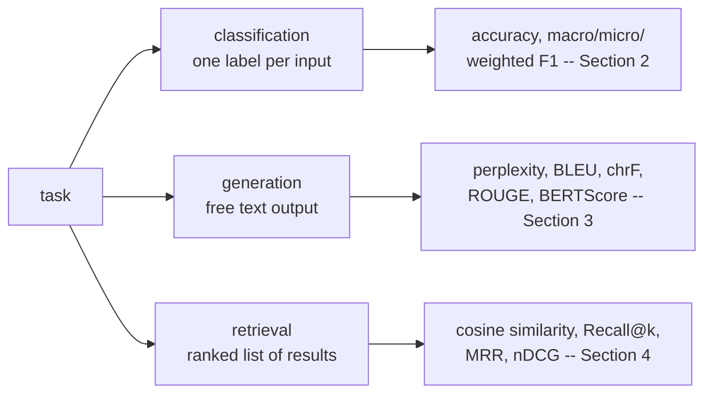
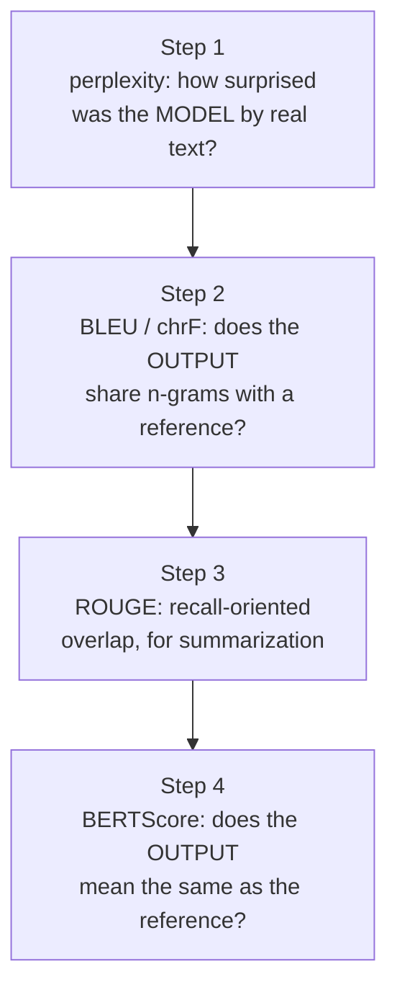
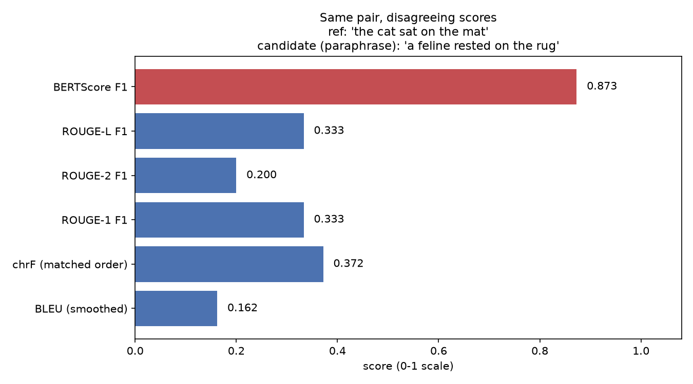
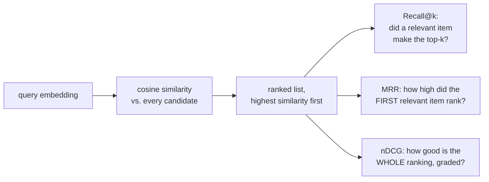

# Text & NLP metrics — measuring classifiers, generators, and retrievers

*Machine Learning · Worked Examples · Natural Language · SPEC-ML-14*

## A perfect answer that scores zero

Reference: **"the cat sat on the mat."** A model answers: **"a feline rested on the rug."**

Read those two sentences yourself. They describe the same scene. A human grading this would say
"correct" without hesitation. Now score it the way a classifier would — exact string match, the tool
a Java engineer already trusts from a thousand `assertEquals`: is the candidate string identical to
the reference string? **No.** Zero words in common except stray function words. Exact match says this
answer is completely wrong.

That gap — a paraphrase that shares almost no words with the reference but means the same thing — is
what this whole chapter is about. Section 4 below runs this exact pair through three real,
industry-standard metrics (BLEU, ROUGE, BERTScore) and gets **three different, disagreeing numbers**:
n-gram overlap stays low (BLEU 0.162, ROUGE-L 0.333) because the words really are different, while an
embedding-based metric recognises the *meaning* is close (BERTScore 0.873). Nobody is broken here —
every metric is doing exactly what it was built to do. The problem is that "what it was built to do"
is not the same question for each of them, and picking the wrong one — or trusting a single number
without knowing what it can't see — is how a text or generation system gets graded on the wrong axis.

## 1. What & why — three task families, three metric families

[SPEC-DS-6](../../../01-data-science/03-worked-examples/06-classification-titanic.md) gave you a
classifier's report card: precision, recall, F1, a confusion matrix — all built on
one assumption, that every prediction is either *exactly right* or *exactly wrong*. `predicted_label
== true_label` either holds or it doesn't; there is nothing in between. That assumption survives text
**classification** completely intact (Section 2 below is DS-6's F1, applied to text labels — nothing
new to invent). It breaks the moment a model's *output is itself text* — a summary, a translation, an
answer — because for most interesting sentences there is no single "correct" string to compare
against. "The economy grew" and "growth accelerated" can both be right. That is **generation**, and it
needs a fundamentally different kind of metric: not "did you match exactly," but "how much overlap /
how much shared meaning is there." A third family, **retrieval**, shows up whenever a system searches
before it answers (a RAG pipeline, [SPEC-AGENT-3](../../../03-agentic-engineering/03-worked-examples/02-rag-over-pdfs.md)) —
there the question is not about a string at all, but about *ranking*: did the right document land near
the top of the list?



A Java analogy for the pivot at the middle of that diagram: precision/recall/F1 are a `boolean`
result graded against ground truth — a unit test either passes or fails. Generation metrics are
closer to grading a **code review comment** — there's no single correct wording, only "does this
capture what needed to be said," and reasonable reviewers can disagree on the number. Every metric in
this chapter is derived by hand first (a plain Python implementation of the formula, so the arithmetic
is never a black box), then reproduced with the pinned library that ships it in production, exactly
the way [CV-metrics](../01-computer-vision/04-cv-metrics.md) (SPEC-ML-7) did for `IoU`/`mAP`/`mAR`.

## Environment

```text
sacrebleu==2.6.0
rouge-score==0.1.2
bert-score==0.3.13
scikit-learn==1.9.0
evaluate==0.4.6
torch==2.14.0+cpu
transformers==5.16.1
sentence-transformers==6.0.1
Python 3.13, CPU only
```

Versions pinned per
([source: NOTE-ML-14-package-versions](../../../research/NOTE-ML-14-package-versions.md)); metric
formulas per
([source: NOTE-ML-14-metric-definitions](../../../research/NOTE-ML-14-metric-definitions.md)); library
call signatures per
([source: NOTE-ML-14-library-apis](../../../research/NOTE-ML-14-library-apis.md)). This chapter runs
in the same **`.venv-ml`** virtualenv as SPEC-ML-8/ML-9/ML-13, and reuses the same cached local models
(`distilgpt2` for perplexity, `distilbert-base-uncased` for the fine-tuning chapter *and* — here —
BERTScore, `sentence-transformers/all-MiniLM-L6-v2` for retrieval, the same embedding model
SPEC-AGENT-3's RAG pipeline uses). Every number below is the literal output of running
`code/text_metrics.py` on this machine.

## 2. Classification metrics for text — macro vs. micro vs. weighted F1

Text classification ([SPEC-ML-8](01-text-classification.md)'s sentiment/emotion labels) already has
ground truth: one correct label per input. DS-6's binary precision/recall/F1 extend directly — the
only new question is **how do you average F1 across more than two classes**, especially when the
classes aren't evenly represented.

A tiny, deliberately imbalanced example: 3 classes (`A`, `B`, `C`), 10 items, `A` far more common than
`B` or `C` — exactly the shape a real label set has
([SPEC-ML-13](03-fine-tuning-a-transformer.md)'s emotion classes ranged from 66 to 695 examples in the
test set).

```text
y_true = [A, A, A, A, A, A, A, B, B, C]
y_pred = [A, A, A, A, A, A, B, B, C, C]
```

Per-class precision/recall/F1, from the raw TP/FP/FN counts
([source: NOTE-ML-14-metric-definitions](../../../research/NOTE-ML-14-metric-definitions.md) —
F1 as the harmonic mean of precision and recall, the same definition DS-6 used for the binary case):

```python
def f1_per_class_by_hand(y_true: list[str], y_pred: list[str], classes: list[str]) -> dict[str, dict]:
    results = {}
    for c in classes:
        tp = sum(1 for t, p in zip(y_true, y_pred) if t == c and p == c)
        fp = sum(1 for t, p in zip(y_true, y_pred) if t != c and p == c)
        fn = sum(1 for t, p in zip(y_true, y_pred) if t == c and p != c)
        support = sum(1 for t in y_true if t == c)
        precision = tp / (tp + fp) if (tp + fp) > 0 else 0.0
        recall = tp / (tp + fn) if (tp + fn) > 0 else 0.0
        f1 = 2 * precision * recall / (precision + recall) if (precision + recall) > 0 else 0.0
        results[c] = {"tp": tp, "fp": fp, "fn": fn, "support": support,
                      "precision": precision, "recall": recall, "f1": f1}
    return results
```

Actual output:

```text
class A: TP=6 FP=0 FN=1 support=7  precision=1.0000 recall=0.8571 f1=0.9231
class B: TP=1 FP=1 FN=1 support=2  precision=0.5000 recall=0.5000 f1=0.5000
class C: TP=1 FP=1 FN=0 support=1  precision=0.5000 recall=1.0000 f1=0.6667
```

By hand: class `A` has 7 true items; 6 are predicted `A` correctly (`TP=6`), the 7th is predicted `B`
(`FN=1`), and nothing else is wrongly predicted `A` (`FP=0`) — precision `6/6=1.0`, recall
`6/7=0.857`. Class `B` has 2 true items; one item's true class was `A` but predicted `B` (`FP=1` for
`B`), one true `B` is correctly predicted (`TP=1`), the other true `B` is predicted `C` (`FN=1`) —
precision `1/2=0.5`, recall `1/2=0.5`. Class `C`'s single true item is correctly predicted, but the
misclassified true-`B` item also landed on `C` (`FP=1`) — precision `1/2=0.5`, recall `1/1=1.0`.

Three ways to combine those three F1 scores into one number:

$$
\text{macro-F1} = \frac{1}{|C|}\sum_{c \in C} F1_c \qquad
\text{weighted-F1} = \frac{\sum_{c \in C} \text{support}_c \cdot F1_c}{\sum_{c \in C} \text{support}_c}
$$

**Macro-F1** treats every class as equally important, regardless of how many examples it has — plain
average of the three F1 values, `(0.9231 + 0.5000 + 0.6667) / 3 = 0.6966`. **Weighted-F1** is the same
average but weighted by each class's support (how many true examples it has), so the dominant class
`A` pulls the number up: `(7·0.9231 + 2·0.5000 + 1·0.6667) / 10 = 0.8128`. **Micro-F1** pools every
class's TP/FP/FN into one giant confusion count *before* computing precision/recall/F1 — for
single-label multiclass classification (each item gets exactly one predicted label) this collapses
to plain accuracy, which the run below confirms exactly: `total TP = 6+1+1 = 8` out of `10` items,
micro-F1 `= 0.8000 =` accuracy `0.8000`.

**Why this matters for imbalance**: macro-F1 (`0.6966`) is nearly 12 points lower than weighted-F1
(`0.8128`) on the *exact same predictions* — because class `B` and `C`'s weak F1 scores (`0.50` and
`0.67`) get full weight in the macro average but are nearly drowned out in the weighted one. A model
report that quotes only weighted-F1 (or accuracy) can hide a model that is genuinely bad on rare
classes — macro-F1 is the number that exposes it. This is the text-classification instance of the
same class-imbalance caveat CV-metrics raised for `mAP` across object classes.

scikit-learn reproduces all three in one call:

```python
from sklearn.metrics import f1_score

sk_macro = f1_score(y_true, y_pred, labels=classes, average="macro")
sk_micro = f1_score(y_true, y_pred, labels=classes, average="micro")
sk_weighted = f1_score(y_true, y_pred, labels=classes, average="weighted")
```

```text
[by hand]      macro_f1=0.6966  micro_f1=0.8000  weighted_f1=0.8128  accuracy=0.8000
[scikit-learn] macro_f1=0.6966  micro_f1=0.8000  weighted_f1=0.8128
```

Exact match, to four decimal places — the by-hand implementation above is precisely what
`f1_score(average=...)` computes internally.

## 3. Generation metrics — perplexity, BLEU, chrF, ROUGE, BERTScore



Perplexity asks a different question from the other four — it scores a language *model*, not a
generated *output*, and needs no reference text at all. BLEU, chrF, ROUGE, and BERTScore all compare a
**candidate** (the model's output) against a **reference** (a human-written correct answer) — the
first three by counting shared substrings, the last by comparing meaning. Sections 3b onward use ONE
candidate/reference pair throughout — the cold open's pair — so you see all four disagree on the exact
same input.

### 3a. Perplexity — how surprised was the model?

**Perplexity is exp(mean negative log-likelihood per token)**
([source: NOTE-ML-14-metric-definitions](../../../research/NOTE-ML-14-metric-definitions.md), item 4;
[HF transformers perplexity docs](https://huggingface.co/docs/transformers/perplexity)): for every
token in a real sentence, ask the model "how much probability did you assign to the token that
actually came next?" — average the surprise (negative log-probability) across tokens, then
exponentiate to bring the number back to a "roughly how many equally-likely choices was the model
choosing among" scale. Lower is better: a perplexity of 1 means the model was never surprised at all.

$$
\text{Perplexity}(x_1, \ldots, x_n) = \exp\left(-\frac{1}{n}\sum_{i=1}^{n}\log p(x_i \mid x_{<i})\right)
$$

Run on `distilgpt2` (the same decoder [SPEC-ML-9](02-text-generation.md) used for generation) and the sentence `"The cat sat on
the mat."`:

```python
encoded = tokenizer(sentence, return_tensors="pt")
with torch.no_grad():
    logits = model(**encoded).logits  # (1, seq_len, vocab_size)

shift_logits = logits[:, :-1, :]           # predict token i+1 from tokens up to i
shift_labels = encoded["input_ids"][:, 1:]
log_probs = torch.log_softmax(shift_logits, dim=-1)
token_log_probs = log_probs.gather(2, shift_labels.unsqueeze(-1)).squeeze(-1)
mean_nll = -token_log_probs.mean().item()
perplexity = math.exp(mean_nll)
```

```text
tokens (7): ['The', 'Ġcat', 'Ġsat', 'Ġon', 'Ġthe', 'Ġmat', '.']
[by hand]      mean NLL/token = 5.4979  ->  perplexity = 244.1679
[transformers] mean NLL/token = 5.4979  ->  perplexity = 244.1679
```

(`Ġ` is GPT-2's byte-level tokenizer marking "a space precedes this token" — not a typo; every
token except the first carries it.) `transformers`' own loss — `model(**encoded,
labels=encoded["input_ids"]).loss` — is exactly the same cross-entropy computation done internally;
passing `labels=` is the "library" way of getting the identical number without writing the
shift/log-softmax/gather yourself. `244` is a high perplexity for a small, generic GPT-2 — this
sentence is ordinary English, but `distilgpt2` is a small, general-purpose model with no fine-tuning
toward this kind of short factual sentence, so its raw next-token probabilities are more spread out
(more "surprised," on average) than a bigger or more specialized model would be.

**Caveat, worth internalizing now**: perplexity is **not comparable across models with different
tokenizers or vocabularies**
([source: NOTE-ML-14-metric-definitions](../../../research/NOTE-ML-14-metric-definitions.md), caveats).
A model with a bigger vocabulary that merges "the mat" into fewer, longer tokens is solving an easier
per-token prediction problem than one that splits into more, shorter tokens — the two perplexity
numbers are not measuring the same thing, even on the identical sentence.

### 3b. BLEU — precision-oriented n-gram overlap

**BLEU = brevity\_penalty × exp(Σ w_n · log P_n)**, where `P_n` is the *modified* (clipped) n-gram
precision at order `n` and the brevity penalty punishes outputs that are suspiciously short
([source: NOTE-ML-14-metric-definitions](../../../research/NOTE-ML-14-metric-definitions.md), item 1
— [Papineni et al. (2002)](https://aclanthology.org/P02-1040.pdf)). "Clipped" means: an n-gram in the
candidate only counts up to how many times it *also* appears in the reference — repeating a matched
word ten times can't inflate the score past what the reference actually contains.

$$
\text{BLEU} = BP \cdot \exp\left(\sum_{n=1}^{4} w_n \log P_n\right), \qquad
BP = \begin{cases} 1 & c > r \\ \exp(1 - r/c) & c \le r \end{cases}
$$

Reference: `"the cat sat on the mat"` (6 words). Candidate: `"a feline rested on the rug"` (6 words).
Clipped n-gram precision at each order, counted by hand:

- **1-grams**: candidate has `{a, feline, rested, on, the, rug}`. Only `on` and `the` also appear in
  the reference. `P1 = 2/6 = 0.3333`.
- **2-grams**: candidate bigrams are `(a,feline) (feline,rested) (rested,on) (on,the) (the,rug)`.
  Only `(on,the)` matches a reference bigram. `P2 = 1/5 = 0.2000`.
- **3-grams**: none of the candidate's 3-grams appear in the reference (`(on,the,rug)` is close to
  `(on,the,mat)` but not identical). `P3 = 0/4 = 0.0000`.
- **4-grams**: same story. `P4 = 0/3 = 0.0000`.

Candidate and reference are the same length (`c = r = 6`), so `BP = 1`. But `P3 = P4 = 0` — and a
**geometric mean with any zero factor is zero**. The raw, unsmoothed BLEU score for this pair is
exactly `0`:

```text
[by hand] P1 = 2/6 = 0.3333   P2 = 1/5 = 0.2000   P3 = 0/4 = 0.0000   P4 = 0/3 = 0.0000
[by hand] brevity_penalty=1.0000  raw (unsmoothed) BLEU = 0.0000
[sacrebleu, smooth_method='none'] score = 0.0000   (matches exactly, on the 0-100 scale)
```

That zero is mathematically correct and also useless — it can't distinguish "shares zero 3-grams
because it's a decent paraphrase" from "shares zero 3-grams because it's random noise." This is
*exactly* why sacrebleu's default is not `smooth_method='none'`: it applies **smoothing**, replacing a
zero count at a given order with a small positive value instead of letting one missing high-order
n-gram zero out the whole score
([source: NOTE-ML-14-package-versions](../../../research/NOTE-ML-14-package-versions.md) — sacrebleu's
corpus-level default is exponential-decay smoothing;
[source: NOTE-ML-14-library-apis](../../../research/NOTE-ML-14-library-apis.md) — sentence-level BLEU
changed in sacrebleu 2.0+ to match this behaviour):

```python
from sacrebleu.metrics import BLEU
bleu = BLEU(effective_order=True, smooth_method="exp")
score = bleu.sentence_score(candidate, [reference])
```

```text
[sacrebleu, smooth_method='exp']  score = 16.2334   -- this is the number you'd actually report
```

`16.23` (out of 100) is low — correctly reflecting that this candidate shares little surface text with
the reference — but it is not the hard, information-destroying `0` the unsmoothed formula gives. Every
BLEU score you see reported in a paper or a leaderboard already has some smoothing method baked in;
**always check which one**, because two papers reporting "BLEU" with different smoothing are not
directly comparable.

### 3c. chrF — the same idea, on characters instead of words

**chrF** is a precision/recall F-score computed over **character** n-grams instead of word n-grams
([source: NOTE-ML-14-metric-definitions](../../../research/NOTE-ML-14-metric-definitions.md), item 2 —
[Popović (2015)](https://aclanthology.org/W15-3049/)). Its big advantage over BLEU: it needs no word
tokenizer at all, so it works identically across languages and doesn't get tripped up by a language
where BLEU's word-splitting rules don't apply cleanly.

$$
\text{chrF}_\beta = \frac{(1+\beta^2) \cdot P \cdot R}{\beta^2 \cdot P + R}
$$

Precision and recall are each computed **per character-n-gram order, then averaged across orders** —
pooling the raw match counts across orders first (the more obvious-looking shortcut) gives a
*different, wrong* number, something the by-hand implementation below only caught by comparing against
the library, not by re-reading the formula:

```python
def chrf_by_hand(candidate: str, reference: str, char_order: int = 2, beta: int = 2) -> dict:
    cand_chars, ref_chars = candidate.replace(" ", ""), reference.replace(" ", "")
    order_precisions, order_recalls = [], []
    for n in range(1, char_order + 1):
        cand_ng = Counter(cand_chars[i:i + n] for i in range(len(cand_chars) - n + 1))
        ref_ng = Counter(ref_chars[i:i + n] for i in range(len(ref_chars) - n + 1))
        matched = sum(min(cnt, ref_ng[g]) for g, cnt in cand_ng.items())
        order_precisions.append(matched / sum(cand_ng.values()))
        order_recalls.append(matched / sum(ref_ng.values()))
    precision = sum(order_precisions) / len(order_precisions)
    recall = sum(order_recalls) / len(order_recalls)
    denom = beta**2 * precision + recall
    return (1 + beta**2) * precision * recall / denom if denom > 0 else 0.0
```

```text
[by hand] per-order precision=['0.4286', '0.2000']  per-order recall=['0.5294', '0.2500']
[by hand, char_order=2] averaged precision=0.3143  recall=0.3897  chrF=0.3719
[sacrebleu CHRF(char_order=2, word_order=0, beta=2)] score = 37.1859   -- matches (37.19 on 0-100 scale)
```

We used a shallow `char_order=2` (character 1- and 2-grams) so the counting stays small enough to
verify by eye — sacrebleu's own default goes to a higher order, which gives a different (lower, here
`19.02`) number on this short pair. Same metric name, same formula, different configuration, different
score: **always report which chrF settings produced a number**, the same discipline BLEU's smoothing
method demands.

### 3d. ROUGE — recall-oriented overlap, built for summarization

Where BLEU asks "how much of the *candidate* is backed up by the reference" (precision), **ROUGE**
asks the opposite question: "how much of the *reference* did the candidate manage to cover"
(recall) — the natural framing for summarization, where missing a key fact is worse than including an
extra word
([source: NOTE-ML-14-metric-definitions](../../../research/NOTE-ML-14-metric-definitions.md), item 3 —
[Lin (2004), "ROUGE: A Package for Automatic Evaluation of Summaries"](https://aclanthology.org/W04-1013/)).
`ROUGE-1`/`ROUGE-2` are n-gram
recall at orders 1 and 2; `ROUGE-L` uses the **longest common subsequence** (LCS) — the longest run of
words that appears *in order* in both texts, not necessarily consecutively — as a recall/precision
pair, reported as their F-measure:

$$
\text{ROUGE-N (recall)} = \frac{\sum_{\text{ref n-grams}} \min(\text{count}_{\text{cand}}, \text{count}_{\text{ref}})}{\sum_{\text{ref n-grams}} \text{count}_{\text{ref}}}
\qquad
\text{ROUGE-L} = \frac{LCS(\text{ref}, \text{cand})}{\text{len}(\text{ref})} \text{ (recall)}
$$

On the same pair: reference unigrams `{the×2, cat, sat, on, mat}` (6 tokens total), candidate
unigrams `{a, feline, rested, on, the, rug}` (6 tokens). Matched (clipped): `on` and `the` — `2`
matches. ROUGE-1 recall `= 2/6 = 0.3333`; since candidate and reference are the same length here,
precision is also `0.3333`, so the F-measure is `0.3333` too. For ROUGE-L: walk both token
sequences — `on` then `the` appear, in that order, in both `[..., on, the, mat]` and `[..., on, the,
rug]`, giving `LCS = 2`; recall `= 2/6 = 0.3333`, same as ROUGE-1 by coincidence of this short example.

```python
def lcs_length(a: list[str], b: list[str]) -> int:
    dp = [[0] * (len(b) + 1) for _ in range(len(a) + 1)]
    for i in range(1, len(a) + 1):
        for j in range(1, len(b) + 1):
            dp[i][j] = dp[i-1][j-1] + 1 if a[i-1] == b[j-1] else max(dp[i-1][j], dp[i][j-1])
    return dp[-1][-1]
```

```text
[by hand]      rouge1: precision=0.3333 recall=0.3333 fmeasure=0.3333
[by hand]      rouge2: precision=0.2000 recall=0.2000 fmeasure=0.2000
[by hand]      rougeL: precision=0.3333 recall=0.3333 fmeasure=0.3333
[rouge-score]  rouge1: precision=0.3333 recall=0.3333 fmeasure=0.3333
[rouge-score]  rouge2: precision=0.2000 recall=0.2000 fmeasure=0.2000
[rouge-score]  rougeL: precision=0.3333 recall=0.3333 fmeasure=0.3333
```

```python
from rouge_score import rouge_scorer
scorer = rouge_scorer.RougeScorer(["rouge1", "rouge2", "rougeL"], use_stemmer=False)
scores = scorer.score(target=reference, prediction=candidate)
```

Exact match — `rouge-score`'s `RougeScorer.score()` does precisely the clipped-count and LCS
arithmetic above.

### 3e. BERTScore — does it mean the same thing?

BLEU, chrF, and ROUGE all agree on this pair: low overlap, roughly `0.16`–`0.37`. That is factually
correct — the candidate really doesn't share much text with the reference — and completely misses
that the sentence means almost the same thing. **BERTScore** fixes exactly that blind spot by
comparing *contextual embeddings* (vectors from a pretrained encoder, one per token, that already
capture meaning-in-context) instead of raw strings
([source: NOTE-ML-14-metric-definitions](../../../research/NOTE-ML-14-metric-definitions.md), item 5
— [Zhang et al. (2020)](https://arxiv.org/pdf/1904.09675)):

$$
P = \underset{\text{cand. tokens}}{\text{mean}}\Big(\max_{\text{ref. tokens}} \cos\text{sim}\Big)
\qquad
R = \underset{\text{ref. tokens}}{\text{mean}}\Big(\max_{\text{cand. tokens}} \cos\text{sim}\Big)
\qquad
F1 = \frac{2PR}{P+R}
$$

Plain language: for every candidate token, find its single *most similar* reference token (by cosine
similarity of their embeddings) and average those best-match scores — that's precision. Do the mirror
computation from the reference's side for recall. This is a greedy, one-token-to-its-best-match
alignment, not requiring word order to line up at all — which is exactly why it can see past "feline"
↔ "cat" and "rested" ↔ "sat" even though neither pair shares a single letter.

We use `distilbert-base-uncased` here — the same small encoder SPEC-ML-13 already fine-tuned — instead
of `bert-score`'s `roberta-large` default (documented in
[NOTE-ML-14-library-apis](../../../research/NOTE-ML-14-library-apis.md)), for a fast, CPU-friendly demo
that reuses a model already on this machine; `model_type=` is a documented override, and production use
should keep the `roberta-large` default for the best correlation with human judgment
([source: NOTE-ML-14-metric-definitions](../../../research/NOTE-ML-14-metric-definitions.md), caveats).

```python
def bertscore_by_hand(candidate, reference, tokenizer, model):
    def token_embeddings(text):
        enc = tokenizer(text, return_tensors="pt")
        with torch.no_grad():
            hidden = model(**enc).last_hidden_state[0]
        return hidden[1:-1]  # drop [CLS] and [SEP] -- BERTScore scores content tokens only

    cand_emb, ref_emb = token_embeddings(candidate), token_embeddings(reference)
    cand_norm = torch.nn.functional.normalize(cand_emb, dim=-1)
    ref_norm = torch.nn.functional.normalize(ref_emb, dim=-1)
    sim = cand_norm @ ref_norm.T                     # (n_cand_tokens, n_ref_tokens)
    precision = sim.max(dim=1).values.mean().item()  # each candidate token's best reference match
    recall = sim.max(dim=0).values.mean().item()     # each reference token's best candidate match
    f1 = 2 * precision * recall / (precision + recall)
    return precision, recall, f1
```

```text
[by hand, distilbert-base-uncased] precision=0.7865  recall=0.8121  F1=0.7991
```

### Pitfall hit live: `num_layers=None` does not mean "the last layer" for every model

The library call:

```python
from bert_score import score
P, R, F1 = score([candidate], [reference], model_type="distilbert-base-uncased",
                  num_layers=None)   # docs: None -> "uses last layer"
```

produced `F1 = 0.8729` — **not** a match with the by-hand `0.7991` above. `bert_score`'s API docs say
`num_layers=None` uses the last layer
([source: NOTE-ML-14-library-apis](../../../research/NOTE-ML-14-library-apis.md)), and that is true
*for the models `bert-score` ships a tuned default for* (it keeps an internal table of the
best-correlating layer per well-known model, from its own WMT16 correlation study). Requesting a model
not in that table — `distilbert-base-uncased`, here — makes `num_layers=None` silently fall back to a
*different* layer than the last one, changing the score. Passing the true last layer explicitly closes
the gap exactly:

```python
P, R, F1 = score([candidate], [reference], model_type="distilbert-base-uncased", num_layers=6)
```

```text
[bert-score, num_layers=None ("last layer" per docs)] F1=0.8729   <- does NOT match by hand
[bert-score, num_layers=6 (the TRUE last layer)]       F1=0.7991   <- matches by hand exactly
```

**Lesson, the same one CV-metrics learned about `MeanAveragePrecision`'s COCO backend:** a documented
default ("uses last layer") can be true only for a subset of configurations. The way to find out is to
actually run it and compare against a hand-computed reference, not to trust the docstring alone.

### The disagreement, side by side

Regardless of which BERTScore number you use (`0.7991` matched-by-hand, or `0.8729` the library's
plain default call), it sits far above every n-gram metric on this pair:

| metric | score (0–1) | what it's measuring |
|---|---|---|
| BLEU (smoothed) | 0.162 | shared word n-grams, precision-weighted |
| chrF (matched order) | 0.372 | shared character n-grams |
| ROUGE-1 F1 | 0.333 | shared unigrams, recall-weighted |
| ROUGE-2 F1 | 0.200 | shared bigrams, recall-weighted |
| ROUGE-L F1 | 0.333 | longest shared word subsequence |
| **BERTScore F1** | **0.873** | embedding similarity — *meaning* |



*(artefacts/textmetrics_generation_disagreement.png — full numbers in
artefacts/textmetrics_generation_disagreement.csv)*

**That gap is the whole chapter's cold open, now measured.** Every n-gram metric independently agrees
this pair scores low; BERTScore alone recognises the paraphrase. Neither side is "wrong" — a system
that must find literal quoted text (a legal citation checker, say) genuinely wants the n-gram metrics'
answer; a system judged on whether it conveyed the right information wants BERTScore's. Reporting only
one number, without saying which question it answers, is how a generation system gets graded on the
wrong axis.

## 4. Retrieval / similarity metrics — the numbers a RAG system is judged on

[SPEC-AGENT-3's RAG pipeline](../../../03-agentic-engineering/03-worked-examples/02-rag-over-pdfs.md)
embeds a question, computes cosine similarity against every indexed chunk, and returns the top-k —
exactly the mechanism this section measures the quality of. Retrieval has no single "the model was
right or wrong" answer either — it returns a **ranked list**, and the question is how good that
ranking is.



### Cosine similarity — the score behind the ranking

$$
\cos\text{sim}(A, B) = \frac{A \cdot B}{\lVert A \rVert \, \lVert B \rVert}
$$

"How much do these two vectors point in the same direction" — `1` means identical direction, `0` means
unrelated, `-1` means opposite
([source: NOTE-ML-14-metric-definitions](../../../research/NOTE-ML-14-metric-definitions.md), item 6).
Using `sentence-transformers/all-MiniLM-L6-v2` — the same embedding model SPEC-AGENT-3 uses — to embed
a query and two candidate documents:

```python
from sentence_transformers import SentenceTransformer
model = SentenceTransformer("sentence-transformers/all-MiniLM-L6-v2")
query_vec = model.encode(["How do I reset my password?"])[0]
doc_vecs = model.encode(["Password reset instructions for your account.",
                          "Our lunch menu changes weekly."])

def cosine_by_hand(a, b):
    return float(np.dot(a, b) / (np.linalg.norm(a) * np.linalg.norm(b)))
```

```text
doc 0 ('Password reset instructions...'): [by hand]=0.8114  [sklearn]=0.8114
doc 1 ('Our lunch menu changes weekly.'): [by hand]=0.0588  [sklearn]=0.0588
```

Exact match against `sklearn.metrics.pairwise.cosine_similarity`, and the ranking is obviously right —
the password-reset document scores `0.81`, the unrelated lunch-menu document scores `0.06`.

### Recall@k — did a relevant result make the cut?

**Recall@k = (relevant items found in the top-k) / (total relevant items that exist)**
([source: NOTE-ML-14-metric-definitions](../../../research/NOTE-ML-14-metric-definitions.md), item 7).
It doesn't care *where* in the top-k a hit landed — rank 1 and rank k score identically, as long as
both are inside the cutoff. Three toy queries, each a ranked list of 5 results with binary relevance
(`1`=relevant, `0`=not), plus how many relevant documents exist in the whole corpus for that query
(which can exceed what's visible in the top-5):

```text
Q1 (relevance=[0, 1, 0, 1, 1], total_relevant=4): R@1=0.0000  R@3=0.2500  R@5=0.7500
Q2 (relevance=[1, 0, 0, 0, 0], total_relevant=1): R@1=1.0000  R@3=1.0000  R@5=1.0000
Q3 (relevance=[0, 0, 0, 0, 1], total_relevant=2): R@1=0.0000  R@3=0.0000  R@5=0.5000
mean Recall@1 across queries = 0.3333
mean Recall@5 across queries = 0.7500
```

Q1 by hand: 3 of its 5 slots are relevant (`[0,1,0,1,1]`), but only `4` relevant documents exist in the
whole corpus for that query — so even a perfect top-5 return can reach at most `Recall@5 = 3/4 =
0.75`, never `1.0`; `Recall@1` looks first at slot 1 only, which is irrelevant, giving `0/4 = 0`. This
is why Recall@k needs a denominator from outside the visible list — a RAG pipeline whose corpus has
more relevant chunks than it retrieves can never hit `1.0` no matter how good its ranking is.

### MRR — how fast did the first correct result show up?

**MRR = mean over queries of `1 / rank_of_first_relevant_result`** (1-indexed)
([source: NOTE-ML-14-metric-definitions](../../../research/NOTE-ML-14-metric-definitions.md), item 8).
Unlike Recall@k, MRR cares intensely about *position*: a relevant result at rank 1 scores `1.0`; the
same result at rank 5 scores only `0.2`.

```text
Q1: first relevant result at rank 2  ->  RR = 0.5000
Q2: first relevant result at rank 1  ->  RR = 1.0000
Q3: first relevant result at rank 5  ->  RR = 0.2000
[by hand] MRR = (0.5 + 1.0 + 0.2) / 3 = 0.5667
```

No dedicated `scikit-learn` function computes Recall@k or MRR — they're retrieval-specific metrics
normally found in a library like `pytrec_eval` or `ranx`, not a general ML toolkit. The by-hand
implementation above **is** the reference implementation here; there's nothing to cross-check it
against beyond re-deriving the formula, which is exactly what the docstring in `code/text_metrics.py`
does.

### nDCG — grading the whole ranking, with graded relevance

Recall@k and MRR both need only binary relevant/not-relevant labels. **nDCG** (Normalized Discounted
Cumulative Gain) handles **graded** relevance — "somewhat relevant" vs. "exactly what I needed" — and
scores the entire ranked list at once, not just the first hit
([source: NOTE-ML-14-metric-definitions](../../../research/NOTE-ML-14-metric-definitions.md), item 9):

$$
DCG@k = \sum_{i=1}^{k} \frac{2^{\text{rel}_i} - 1}{\log_2(i+1)} \qquad
nDCG@k = \frac{DCG@k}{IDCG@k}
$$

`rel_i` is the graded relevance at rank `i` (here, `0`–`3`); the `log_2(i+1)` denominator **discounts**
a hit the further down the list it appears — a highly relevant document buried at rank 20 contributes
almost nothing. `IDCG` is the best possible `DCG` — the same relevance grades, sorted into the ideal
order — so `nDCG` always lands in `[0, 1]`, `1.0` meaning "this is the best ranking the available
results allow."

Graded relevance `[0, 2, 0, 1, 3]` at ranks 1–5 (rank 5's document is the most relevant one, but it's
buried last):

```text
i=1: rel=0 -> (2^0-1)/log2(2) = 0/1.000 = 0.0000
i=2: rel=2 -> (2^2-1)/log2(3) = 3/1.585 = 1.8928
i=3: rel=0 -> 0.0000
i=4: rel=1 -> (2^1-1)/log2(5) = 1/2.322 = 0.4307
i=5: rel=3 -> (2^3-1)/log2(6) = 7/2.585 = 2.7076
DCG@5 = 5.0311

ideal order [3, 2, 1, 0, 0]:
IDCG@5 = 7/1.000 + 3/1.585 + 1/2.000 + 0 + 0 = 9.3928

nDCG@5 = 5.0311 / 9.3928 = 0.5357
```

### Pitfall hit live: `sklearn.metrics.ndcg_score` uses a *different* gain function

```python
from sklearn.metrics import ndcg_score
sk_ndcg = ndcg_score([[0, 2, 0, 1, 3]], [[5, 4, 3, 2, 1]])  # y_score's ORDER encodes the ranking
```

```text
[by hand, exponential gain 2^rel-1] nDCG=0.5357
[sklearn.metrics.ndcg_score]        nDCG = 0.5992   <- does not match
```

`0.5992 ≠ 0.5357` — but it isn't a bug in either implementation. The Discounted Cumulative Gain
formula has two commonly-used variants: the **exponential-gain** version above (`2^rel - 1`, which
strongly rewards highly-relevant results), and an older, plain **linear-gain** version (gain
`= rel_i` directly, no exponent). Recomputing by hand with linear gain instead:

```text
DCG@5 (linear)  = 0/1.000 + 2/1.585 + 0/2.000 + 1/2.322 + 3/2.585 = 2.8531
IDCG@5 (linear) = 3/1.000 + 2/1.585 + 1/2.000 + 0 + 0             = 4.7619
nDCG@5 (linear) = 2.8531 / 4.7619 = 0.5992   <- matches scikit-learn exactly
```

`scikit-learn` implements the linear-gain version by default; most modern search/RAG literature
(including the exponential-gain formula this section grounded first) means the exponential-gain
version when it says "nDCG" without qualification. **Same metric name, two real formulas, two
different numbers on the same data — always confirm which gain function a library uses before you
compare its nDCG against a number from a paper or another tool.**

## 5. When the number lies — automatic metrics vs. human judgement, and LLM-as-judge

Every generation metric in Section 3 reduces "is this a good answer" to arithmetic on strings or
vectors. That arithmetic is fast, free of human effort, and — Section 3's own disagreement table
already proved — dependent on *which* metric you pick to answer a *different* question than "did a
human like this." None of BLEU, chrF, ROUGE, or BERTScore ever reads for factual correctness, asks
whether an answer is helpful, or catches confident nonsense that happens to share vocabulary with the
reference.

One increasingly common fix is **LLM-as-a-judge**: ask a large language model to score or rank
outputs directly, in place of (or alongside) a human. It scales further than paid human annotators and
correlates with human preference better than n-gram metrics on many tasks — but it inherits its own,
well-documented biases, not a clean substitute for either automatic metrics or real human review:

- **Position bias** — a judge's preference can shift by more than 10 percentage points purely from
  *which slot* (A vs. B) a response is shown in, independent of its actual quality
  ([source: Zheng et al. (2024), "Judging LLM-as-a-Judge with MT-Bench and Chatbot
  Arena"](https://arxiv.org/abs/2106.07997)).
- **Verbosity bias** — judges tend to rate longer answers more favourably even when the extra length
  adds no information (same source).
- **Self-preference bias** — a judge model tends to score outputs that resemble its *own* writing
  style more highly, an effect that grows *stronger* in larger, more capable judge models
  ([source: Ding et al. (2024), "Self-Preference Bias in LLM-as-a-Judge"](https://arxiv.org/pdf/2410.21819)).

None of these are solved problems as of the cited research — mitigations exist (randomize response
order, average over several judge models, spot-check against human raters) but none eliminate the
bias outright. The practical takeaway: treat an LLM-judge score the way you'd treat a single
automatic metric — one more signal, informative in aggregate, not something to trust from a single run
or a single judge model. This is the same caution CV-metrics raised about a single `mAP` number
hiding per-class or per-object-size weaknesses — automatic scores compress a lot of nuance into one
float, in vision and in text alike.

## 6. Pitfalls & recap

- **A single generation metric answers a narrower question than "is this good."** BLEU/chrF measure
  precision-style surface overlap; ROUGE measures recall-style surface overlap; BERTScore measures
  embedding similarity. Section 3's disagreement table is the proof, not a hypothetical — pick the
  metric that matches what you actually care about (exact phrasing vs. meaning), and say which one you
  used when you report a number.
- **BLEU needs smoothing to be usable at the sentence level.** The unsmoothed formula hits a hard
  `0` the moment any n-gram order has zero matches — routine for short sentences or genuine paraphrases
  — which is why every practical BLEU implementation applies some smoothing method by default. Report
  which one.
- **Perplexity numbers are not comparable across tokenizers.** Two models with different vocabularies
  are solving different-sized next-token prediction problems; a lower perplexity does not automatically
  mean "a better model" once the tokenizer changes too.
- **A documented library default (`num_layers=None`, `smooth_method` defaults, chrF's character
  order) is not universal — it can be tuned for specific, named configurations.** Section 3e's
  `num_layers=None` pitfall and Section 4's `ndcg_score` gain-function pitfall were both found by
  actually running the code and comparing against a by-hand reference, not by reading documentation
  alone.
- **Recall@k needs a corpus-wide relevant-document count you may not have without labelled data.**
  Without it, "how many relevant documents exist in total" is unknowable, and Recall@k can't be
  computed at all — only Precision@k (which needs no such count) can.
- **Single-reference bias.** Every n-gram metric in this chapter compared against exactly one
  reference string. A candidate that is a perfectly valid *alternative* phrasing scores worse than one
  that happens to reuse the reference's exact words — production BLEU/ROUGE setups often score against
  multiple acceptable references per input specifically to soften this.

| task | metric | library | by-hand vs. library |
|---|---|---|---|
| classification | macro/micro/weighted F1 | `scikit-learn` | exact match |
| generation | perplexity | `transformers` (`labels=`) | exact match |
| generation | BLEU | `sacrebleu` | exact match (unsmoothed); smoothing changes the number by design |
| generation | chrF | `sacrebleu` | exact match, when char order/beta are matched explicitly |
| generation | ROUGE-1/2/L | `rouge-score` | exact match |
| generation | BERTScore | `bert-score` | exact match, with `num_layers` set explicitly |
| retrieval | cosine similarity | `scikit-learn` | exact match |
| retrieval | Recall@k, MRR | *(no standard library)* | by-hand is the reference |
| retrieval | nDCG | `scikit-learn` | matches only under the same gain function |

This chapter closed the metrics gap the book has carried since DS-6: classification metrics extend
cleanly to text (Section 2), but generation broke the one-right-answer assumption entirely, needing a
family of metrics that each capture a different notion of "close enough" (Section 3), and retrieval
needed a ranking-aware family of its own (Section 4) — the exact numbers
[SPEC-AGENT-3's RAG pipeline](../../../03-agentic-engineering/03-worked-examples/02-rag-over-pdfs.md)
is ultimately judged on. Every number in this chapter was checked twice — once by hand, once by a
pinned library — and where they didn't match, that mismatch itself became the lesson, not something
smoothed over. The next Machine Learning chapters (LLMs, from-the-inside) build models whose output
this chapter's metrics are exactly the right tool to grade.
