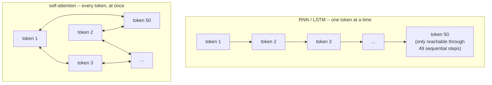
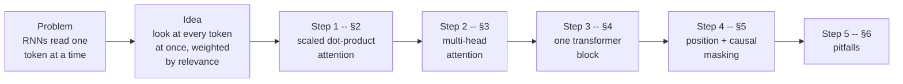
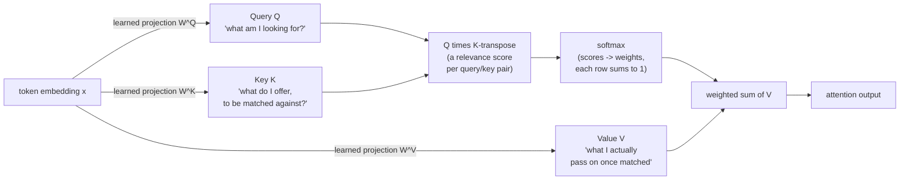
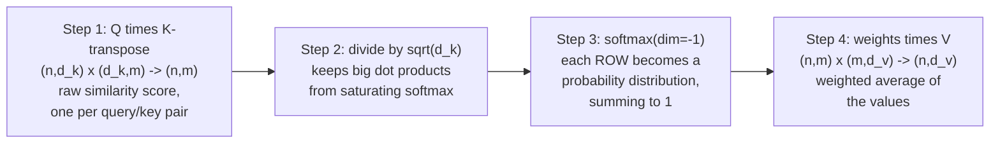
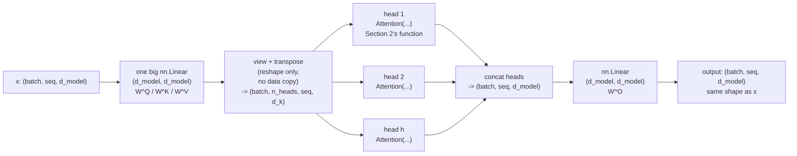
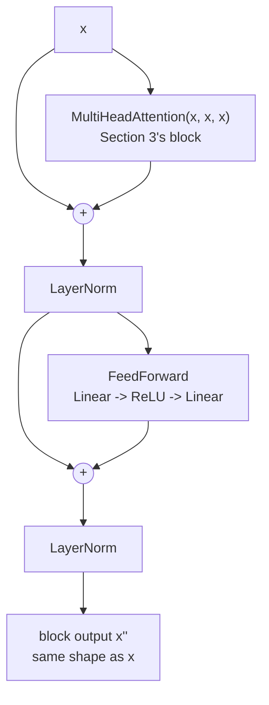
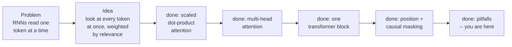

# The Transformer from the Inside

*Machine Learning · Worked Examples · LLMs · SPEC-ML-10*

## The eight-word paper title that ended an era

In June 2017, eight researchers posted a paper to arXiv with a title that reads more like a boast
than a methods section: **"Attention Is All You Need."** No recurrence. No convolutions. Just one
mechanism, repeated. It was accepted at NeurIPS 2017, and within a few years it had become the
architecture underneath essentially every large language model you've heard of — GPT, BERT, Llama,
the model this chapter's companion (SPEC-ML-11) loads and runs
([source: Vaswani et al., "Attention Is All You Need"](https://arxiv.org/pdf/1706.03762) (checked
2026-09-02), via
[research/NOTE-ML-8-transformer-and-llm.md](../../../research/NOTE-ML-8-transformer-and-llm.md)).

Here's the human idea underneath the title, before any code or math: **when you read a sentence,
you don't weigh every word equally.** Read "The trophy didn't fit in the suitcase because *it* was
too big" and your brain doesn't treat "it" as a coin flip between "trophy" and "suitcase" — you
weigh "trophy" far more heavily, instantly, without being taught a rule for it. That weighting —
looking at everything in the sentence at once, but paying more attention to what's relevant right
now — is the entire idea this chapter builds into working code. One plain sentence you could repeat
at dinner: **attention is a model deciding, for every word, how much every other word matters to
it, right now.**

The paper earned that title by solving a problem you can feel the shape of before seeing a single
formula. Walk through the problem, then the fix, then the six steps that turn "pay more attention to
relevant words" into the exact tensor operation this chapter runs.

**The problem.** Before 2017, the standard way to process a sentence was an RNN or LSTM: read one
token, update a hidden state, read the next token, update again, one step at a time — a `for` loop
over a `List<Token>` that never lets go of the loop. Token 50's influence on token 1 has to survive
49 sequential updates to get there, the way a value passed through 49 nested function calls can get
diluted or overwritten along the way. Two concrete costs fall out of that:

- **It's slow to parallelize.** Step 50 can't start until step 49 finishes — no `parallelStream()`
  over independent work, because every step depends on the one before it.
- **Long-range influence fades.** Information from far back in the sequence has to survive being
  repeatedly squeezed through the same fixed-size hidden state, the way a message degrades after
  too many rounds of a game of telephone.



**The fix.** Let every position look directly at every other position in one matrix operation,
weighted by relevance — no loop, no 49-step relay race, full parallelism. That's the whole pitch of
"Attention Is All You Need."

Six steps take you from that one-sentence idea to a real, running transformer block — this is the
map for the whole chapter, and it comes back at the top of every section below so you always know
where you are:



Everything below runs from `transformer_from_scratch.py`
([code](code/transformer_from_scratch.py)) — no `nn.MultiheadAttention`, no
`nn.TransformerEncoderLayer`, nothing that hides the mechanics behind a single framework call. Every
formula is grounded against the paper via
[research/NOTE-ML-8-transformer-and-llm.md](../../../research/NOTE-ML-8-transformer-and-llm.md),
which cites the paper directly:
[source: Attention Is All You Need](https://arxiv.org/pdf/1706.03762) (checked 2026-09-02).

### Environment

```text
torch==2.14.0+cpu
numpy==2.5.2
matplotlib==3.11.1
Python 3.13 (.venv-ml)
```

Installed and verified live in the project's shared `.venv-ml` virtual environment (2026-09-02),
per NOTE-ML-8-transformer-and-llm.md's confirmation that the torch APIs used below
(`nn.Linear`, `F.softmax`, `nn.LayerNorm`) match the installed version. All tensors in this chapter
are tiny and run on CPU — no GPU needed, no training, only forward passes.

## 1. What & why — attention as content-based lookup

*You are here:* Problem → **Idea** → Step 1 → Step 2 → Step 3 → Step 4 → Step 5.

The mental model that actually transfers from Java: **attention is a soft, differentiable
`Map.get()`.** A hash map lookup is: hash the key, find the *one* matching bucket, return its value.
Attention is: compare a **query** against *every* **key** in the collection, turn those comparisons
into a probability distribution (softmax), and return a **weighted average of every value**,
weighted by how well its key matched the query. Instead of "the one exact match", you get "a blend,
weighted by relevance" — which is exactly what lets a token's representation absorb context from the
whole sequence in a single step.

Three tensors drive it, and they map cleanly onto that lookup analogy — this is the flow every
example in this chapter follows, from a token's embedding to the value it actually contributes:



- **Q (query)** — "what am I looking for?", one vector per position that's currently being updated.
- **K (key)** — "what do I have to offer, as a thing to be matched against?", one vector per position
  being looked at.
- **V (value)** — "what do I actually contribute once matched?", one vector per position being
  looked at (can have a different width than K).

In self-attention (used throughout this chapter) Q, K, and V all come from the *same* sequence — each
token queries every token, including itself.

## 2. Scaled dot-product attention

*You are here:* Problem → Idea → **Step 1** → Step 2 → Step 3 → Step 4 → Step 5.

The Q/K/V diagram above is the intuition. Here's the formula it compiles down to, from Section 3.2.1
of the paper
([source: Attention Is All You Need](https://arxiv.org/pdf/1706.03762), checked 2026-09-02; also
recorded in NOTE-ML-8-transformer-and-llm.md):

$$\mathrm{Attention}(Q, K, V) = \mathrm{softmax}\!\left(\frac{QK^T}{\sqrt{d_k}}\right)V$$

Plain-language gloss for every symbol before the pipeline: $Q$ is the query matrix (one row per
position asking a question), $K$ is the key matrix (one row per position offering itself as an
answer), $V$ is the value matrix (one row per position's actual payload), $d_k$ is how wide each
query/key vector is, and $QK^T$ is "every query dotted against every key, all at once, as one matrix
multiply."

Read the formula left to right, as a four-step pipeline — the same four boxes as code, below:



1. **`Q Kᵀ`** — matrix-multiply queries against keys (transposed). If `Q` is `(n, d_k)` and `K` is
   `(m, d_k)`, this produces an `(n, m)` matrix: every query's raw similarity score against every
   key, via dot product (large dot product = the vectors point the same way = "relevant").
2. **`/ √d_k`** — divide every score by the square root of the key dimension. Covered on its own
   below — this is not cosmetic.
3. **`softmax(..., dim=-1)`** — turn each *row* of that `(n, m)` matrix into a probability
   distribution (all non-negative, summing to 1). Row `i` is now "how much should query `i` attend to
   each of the `m` keys."
4. **`... V`** — matrix-multiply those attention weights against `V` (`(m, d_v)`), producing `(n,
   d_v)`: for every query, the weighted average of all values, weighted by that row's attention
   distribution.

In PyTorch, on tensors small enough to read every number in the output
([code](code/transformer_from_scratch.py), section 1):

```python
import math

import torch
import torch.nn.functional as F


def scaled_dot_product_attention(q, k, v, mask=None):
    d_k = q.size(-1)
    scores = torch.matmul(q, k.transpose(-2, -1)) / math.sqrt(d_k)
    if mask is not None:
        scores = scores.masked_fill(mask == 0, float("-inf"))
    weights = F.softmax(scores, dim=-1)
    output = torch.matmul(weights, v)
    return output, weights


torch.manual_seed(42)
n, d_k, d_v = 4, 3, 2  # 4 tokens; 3-dim queries/keys; 2-dim values
q = torch.randn(n, d_k)
k = torch.randn(n, d_k)
v = torch.randn(n, d_v)
output, weights = scaled_dot_product_attention(q, k, v)
print(weights.round(decimals=3))
print("row sums:", weights.sum(dim=-1).round(decimals=3))
print(output.shape)
```

Actual output from the gate run:

```text
Q shape: (4, 3)  K shape: (4, 3)  V shape: (4, 2)
attention weights shape: (4, 4)  (n_queries x n_keys)
attention weights (each row sums to 1):
tensor([[0.2050, 0.3180, 0.2100, 0.2660],
        [0.5660, 0.0650, 0.1870, 0.1830],
        [0.4700, 0.2070, 0.0570, 0.2670],
        [0.0770, 0.4420, 0.2290, 0.2520]])
row sums: tensor([1., 1., 1., 1.])
output shape: (4, 2)  (n_queries x d_v)
```

Two things worth staring at:

- **Every row sums to exactly 1.0.** That's `softmax` doing its job — each query's attention is a
  full probability distribution over all 4 keys, never partial and never over 1.
- **The output shape is `(4, 2)`, matching `V`'s width, not `Q`'s or `K`'s.** The queries and keys
  only decide *how much* to attend to each position; the values decide *what* gets returned. A query
  can be 3-dimensional and still pull back a 2-dimensional answer.

### Why `/ √d_k`? The scaling isn't cosmetic

Here's the failure this step exists to prevent, made concrete instead of asserted: feed softmax a
row with one huge score and several tiny ones and it **saturates** — nearly all of its output "piles
onto" the single largest score, the row becomes essentially one-hot, and the gradient of a saturated
softmax is close to zero almost everywhere. A network in that state stops learning from that
position, silently, with no error thrown.

Per NOTE-ML-8-transformer-and-llm.md: **scaling by `1/√d_k` prevents the dot products from growing
too large in the first place, which is exactly what would push softmax into that saturated,
vanishing-gradient region.** The reason dot products grow with dimension: a dot product of two
random `d_k`-dimensional vectors sums `d_k` independent terms, and variance accumulates with every
term you add — more dimensions summed, more variance, bigger swings between the largest and smallest
score in a row. The code above measures this directly, on this chapter's own tiny `d_k=3` example:

```text
variance of QK^T (unscaled): 1.601  vs scaled by 1/sqrt(d_k)=0.577: 0.534
```

Even at `d_k = 3` (tiny), scaling visibly shrinks the score variance; at the paper's `d_k = 64`, the
effect is large enough to matter for training stability
([source: Attention Is All You Need, Section 3.2.1](https://arxiv.org/pdf/1706.03762), checked
2026-09-02). This is the single most common "worked in the notebook, broken in the real model" bug in
a from-scratch attention implementation — forget the `/ math.sqrt(d_k)` and the model still runs
(no shape error, no exception), it just trains badly. Covered again in Pitfalls.

## 3. Multi-head attention — split, attend, concat

*You are here:* Problem → Idea → Step 1 → **Step 2** → Step 3 → Step 4 → Step 5.

Section 2 gave you exactly one attention computation — one "view" of relevance between positions.
But a sentence carries more than one kind of relationship at once (subject-verb agreement,
coreference, adjective-noun binding) and one shared query/key/value projection has to blend all of
them into a single weighting. **Multi-head attention** runs several attention computations **in
parallel, in different learned subspaces**, then combines them — the paper's Section 3.2.2
motivation: different heads can specialize (one head might end up tracking subject-verb agreement,
another tracking coreference, purely from training, with no explicit instruction to do so).

The formula
([source: Attention Is All You Need, Section 3.2.2](https://arxiv.org/pdf/1706.03762), checked
2026-09-02; also NOTE-ML-8-transformer-and-llm.md):

$$\mathrm{MultiHead}(Q, K, V) = \mathrm{Concat}(\mathrm{head}_1, \ldots, \mathrm{head}_h)\,W^O
\qquad \mathrm{head}_i = \mathrm{Attention}(QW^Q_i,\, KW^K_i,\, VW^V_i)$$

Gloss: $h$ is the number of heads, $W^Q_i / W^K_i / W^V_i$ are head $i$'s own learned projection
matrices (shrinking `d_model` down to a smaller per-head `d_k`), $\mathrm{head}_i$ is plain
scaled-dot-product attention (Section 2's exact function) run inside that smaller subspace, and
$W^O$ is one more learned projection that maps the concatenated heads back to `d_model` width.

**The Java-side gotcha:** you do not — and real implementations never do — allocate `h` separate
small `nn.Linear` layers. One big `nn.Linear(d_model, d_model)` computes all heads' projections in a
single matrix multiply; splitting into heads happens purely by **reshaping the output tensor**
(`view` + `transpose`), the same trick as reinterpreting one wide `int[]` as an `int[h][d_k]` without
copying any data:



```python
class MultiHeadAttention(nn.Module):
    def __init__(self, d_model: int, n_heads: int) -> None:
        super().__init__()
        assert d_model % n_heads == 0
        self.d_model = d_model
        self.n_heads = n_heads
        self.d_k = d_model // n_heads
        self.w_q = nn.Linear(d_model, d_model)
        self.w_k = nn.Linear(d_model, d_model)
        self.w_v = nn.Linear(d_model, d_model)
        self.w_o = nn.Linear(d_model, d_model)

    def split_heads(self, x):
        batch, seq, _ = x.shape
        x = x.view(batch, seq, self.n_heads, self.d_k)
        return x.transpose(1, 2)  # (batch, n_heads, seq, d_k)

    def combine_heads(self, x):
        batch, n_heads, seq, d_k = x.shape
        x = x.transpose(1, 2)
        return x.contiguous().view(batch, seq, n_heads * d_k)

    def forward(self, x_q, x_k, x_v, mask=None):
        q = self.split_heads(self.w_q(x_q))
        k = self.split_heads(self.w_k(x_k))
        v = self.split_heads(self.w_v(x_v))
        head_mask = mask.unsqueeze(1) if mask is not None else None
        attn_out, attn_weights = scaled_dot_product_attention(q, k, v, mask=head_mask)
        combined = self.combine_heads(attn_out)
        return self.w_o(combined), attn_weights
```

Run on a small batch and watch every shape change ([code](code/transformer_from_scratch.py), section
2):

```text
input x shape: (2, 5, 8)  (batch, seq_len, d_model)
after W^Q projection + split_heads: (2, 2, 5, 4)  (batch, n_heads=2, seq_len, d_k=4)
attention weights shape: (2, 2, 5, 5)  (batch, n_heads, seq_q, seq_k)
combined (post concat) + W^O output shape: (2, 5, 8)  (batch, seq_len, d_model)
output shape matches input shape - attention is a shape-preserving layer.
```

Read the shape trail like a stack trace:

- Start: **`(2, 5, 8)`** — 2 sentences in the batch, 5 tokens each, 8-dim embeddings (`d_model=8`,
  `n_heads=2` here — tiny numbers so the whole tensor prints; the paper's originals were `d_model=512`,
  `h=8`, `d_k=d_v=64`, per NOTE-ML-8-transformer-and-llm.md).
- After `w_q` + `split_heads`: **`(2, 2, 5, 4)`** — batch unchanged, a new `n_heads=2` dimension
  appears where it can be treated exactly like an extra batch dimension by every downstream matmul,
  `seq_len=5` unchanged, and the feature width shrank from `d_model=8` to `d_k=4` (`8 / 2 heads`).
- Attention weights: **`(2, 2, 5, 5)`** — one full `seq × seq` attention matrix *per head, per batch
  element*. Two heads on the same input produce two genuinely different `(5, 5)` matrices — different
  learned projections, different relevance patterns.
- After `combine_heads` + `w_o`: back to **`(2, 5, 8)`** — the original shape. **Multi-head attention
  never changes `(batch, seq_len, d_model)`** — it's a shape-preserving transformation, which is
  exactly what lets you stack many of these blocks without a reshape between them.

## 4. A transformer block — attention + residual + LayerNorm + feed-forward

*You are here:* Problem → Idea → Step 1 → Step 2 → **Step 3** → Step 4 → Step 5.

Multi-head attention alone is one sub-layer. A full transformer (encoder) block wraps it with two
more ingredients and stacks a second sub-layer on top, per Sections 3.1 and 3.3 of the paper
([source: Attention Is All You Need](https://arxiv.org/pdf/1706.03762), checked 2026-09-02; also
NOTE-ML-8-transformer-and-llm.md):

$$x' = \mathrm{LayerNorm}(x + \mathrm{MultiHeadAttention}(x, x, x)) \qquad
x'' = \mathrm{LayerNorm}(x' + \mathrm{FeedForward}(x'))$$

This is the **post-LN** arrangement from the original paper (NOTE-ML-8 also records a modern **pre-
LN** variant, `LayerNorm(x) + Sublayer(x)`, used by many newer models for training stability — this
chapter implements the paper's original arrangement, since it's what "Attention Is All You Need"
itself specifies).



Two new pieces, glossed before the code:

- **Residual (skip) connection — `x + Sublayer(x)`.** Add the sub-layer's *input* back onto its
  *output*, unchanged. Mechanically this is one `+` operator on two same-shaped tensors — the
  interesting part is why it's there: it gives gradients a direct path backward through every layer
  during training (nothing has to survive being multiplied through a deep stack to reach an early
  layer), the same problem residual connections solve in `ResNet`-style CNNs.
- **`nn.LayerNorm(d_model)`** — normalizes each token's `d_model`-wide feature vector to zero mean
  and unit variance, *independently per token*, then applies a learned scale and shift. This is
  unlike `BatchNorm`, which normalizes across the batch dimension — `LayerNorm` normalizes across a
  single token's own features, so it works identically whether the batch has 1 sequence or 512, and
  regardless of sequence length. Per NOTE-ML-8-transformer-and-llm.md, `nn.LayerNorm` is the API used
  here — confirmed against the installed torch 2.14.0+cpu.
- **`FeedForward(x) = max(0, xW_1 + b_1)W_2 + b_2`** — two `nn.Linear` layers with a ReLU between
  them, applied identically (same weights) to every position independently. It's the block's only
  non-linearity beyond softmax, and it's applied per-token — no mixing across positions happens here;
  all cross-position mixing is attention's job.

```python
class PositionwiseFeedForward(nn.Module):
    def __init__(self, d_model: int, d_ff: int) -> None:
        super().__init__()
        self.linear1 = nn.Linear(d_model, d_ff)
        self.linear2 = nn.Linear(d_ff, d_model)

    def forward(self, x):
        return self.linear2(F.relu(self.linear1(x)))


class TransformerBlock(nn.Module):
    def __init__(self, d_model: int, n_heads: int, d_ff: int) -> None:
        super().__init__()
        self.attn = MultiHeadAttention(d_model, n_heads)
        self.norm1 = nn.LayerNorm(d_model)
        self.ffn = PositionwiseFeedForward(d_model, d_ff)
        self.norm2 = nn.LayerNorm(d_model)

    def forward(self, x, mask=None):
        attn_out, attn_weights = self.attn(x, x, x, mask=mask)
        x = self.norm1(x + attn_out)       # residual + LayerNorm
        ffn_out = self.ffn(x)
        x = self.norm2(x + ffn_out)        # residual + LayerNorm
        return x, attn_weights
```

Run a `(2, 5, 8)` tensor through one full block and print the shape after *every* step
([code](code/transformer_from_scratch.py), section 3) — this is the chapter's shapes-through-the-
block artefact, generated by the code and saved to
[`artefacts/shapes_through_block.csv`](artefacts/shapes_through_block.csv):

| step | output shape (batch, seq_len, d_model) |
|---|---|
| input x | (2, 5, 8) |
| MultiHeadAttention(x, x, x) | (2, 5, 8) |
| x + attn_out (residual) | (2, 5, 8) |
| LayerNorm(residual1) | (2, 5, 8) |
| FeedForward(x) | (2, 5, 8) |
| x + ffn_out (residual) | (2, 5, 8) |
| LayerNorm(residual2) = block output | (2, 5, 8) |

The punchline is in the "no change" column: **a transformer block never changes `(batch, seq_len,
d_model)`.** Every sub-layer — attention, the residual add, LayerNorm, the feed-forward network,
the second residual add, the second LayerNorm — is shape-preserving. That's precisely what lets a
real model stack N of these blocks back-to-back (GPT-style models stack dozens) with zero glue code
between them: block 2's input shape is guaranteed to match block 1's output shape, always.

## 5. Positional encoding + causal masking

*You are here:* Problem → Idea → Step 1 → Step 2 → Step 3 → **Step 4** → Step 5.

### Positional encoding — attention has no built-in sense of order

Attention computes a weighted sum over positions using only the *content* of Q, K, and V. Shuffle the
input tokens and shuffle the output the same way — attention alone is **permutation-invariant**, the
same mathematical property a `HashSet<Token>` has: it has no memory of what order things went in.
That's fine for a bag of words, useless for language, where "dog bites man" and "man bites dog" must
not look identical.

The fix: add a fixed, deterministic **positional encoding** vector to each token's embedding before
any attention happens, so position becomes part of the *content* attention already looks at. The
paper's sinusoidal formula
([source: Attention Is All You Need, Section 3.5](https://arxiv.org/pdf/1706.03762), checked
2026-09-02; also NOTE-ML-8-transformer-and-llm.md):

$$PE_{(pos,\,2i)} = \sin\!\left(\frac{pos}{10000^{2i/d_{model}}}\right) \qquad
PE_{(pos,\,2i+1)} = \cos\!\left(\frac{pos}{10000^{2i/d_{model}}}\right)$$

Gloss: $pos$ is the token's position in the sequence (0, 1, 2, …), $i$ indexes pairs of dimensions
across the embedding width, and $d_{model}$ is the embedding width itself — even dimensions get a
sine of the position, odd dimensions get a cosine, each pair oscillating at a different frequency.

```python
def positional_encoding(seq_len: int, d_model: int) -> torch.Tensor:
    position = torch.arange(seq_len).unsqueeze(1).float()
    div_term = torch.exp(torch.arange(0, d_model, 2).float() * (-math.log(10000.0) / d_model))
    pe = torch.zeros(seq_len, d_model)
    pe[:, 0::2] = torch.sin(position * div_term)
    pe[:, 1::2] = torch.cos(position * div_term)
    return pe
```

Not learned — computed once from `pos` and the dimension index `i`, then simply added elementwise to
the token embeddings (`x = token_embeddings + positional_encoding(...)`). Different positions get
different sine/cosine values across the `d_model` dimensions, giving every position a distinguishable
"fingerprint" the model can learn to use.

### Causal masking — blocking the future

A model generating text one token at a time must not be allowed to attend to tokens that haven't been
generated yet — otherwise training would let it "cheat" by looking ahead at the answer. The fix:
before softmax, force every score at a "future" position to `-∞`, so softmax sends its weight to
exactly 0
([source: Attention Is All You Need, Section 3.2.3](https://arxiv.org/pdf/1706.03762), checked
2026-09-02; also NOTE-ML-8-transformer-and-llm.md):

```python
def causal_mask(seq_len: int) -> torch.Tensor:
    return torch.tril(torch.ones(seq_len, seq_len))
```

`torch.tril` keeps the lower triangle (including the diagonal) and zeroes everything above it. For
`seq_len=5`:

```text
tensor([[1, 0, 0, 0, 0],
        [1, 1, 0, 0, 0],
        [1, 1, 1, 0, 0],
        [1, 1, 1, 1, 0],
        [1, 1, 1, 1, 1]], dtype=torch.int32)
```

Row `i` (query = token `i`) has `1`s in columns `0..i` and `0`s after — token `i` may attend to
itself and everything before it, never after. This mask feeds straight into
`scaled_dot_product_attention`'s `mask` argument from Section 2: `scores.masked_fill(mask == 0,
float("-inf"))` sets every blocked position to `-∞` before the softmax in step 3 of the pipeline.

### Putting it together: a visualised attention matrix

Take a 5-token toy sentence, embed it (`nn.Embedding`), add positional encoding, run it through
`MultiHeadAttention` with the causal mask applied, and plot one head's attention weights as a heatmap
([code](code/transformer_from_scratch.py), section 4):

```python
tokens = ["The", "cat", "sat", "on", "mat"]
vocab = {w: i for i, w in enumerate(tokens)}
seq_len, d_model, n_heads = len(tokens), 8, 2
token_ids = torch.tensor([[vocab[w] for w in tokens]])

embedding = nn.Embedding(num_embeddings=len(vocab), embedding_dim=d_model)
tok_emb = embedding(token_ids)                       # (1, seq_len, d_model)
x = tok_emb + positional_encoding(seq_len, d_model)  # position added elementwise

mask = causal_mask(seq_len)
mha = MultiHeadAttention(d_model=d_model, n_heads=n_heads)
_, attn_weights = mha(x, x, x, mask=mask.unsqueeze(0))  # (1, n_heads, seq_len, seq_len)
```

Head 0's attention weights, printed:

```text
tensor([[1.0000, 0.0000, 0.0000, 0.0000, 0.0000],
        [0.2720, 0.7280, 0.0000, 0.0000, 0.0000],
        [0.4040, 0.4590, 0.1380, 0.0000, 0.0000],
        [0.1960, 0.3010, 0.3240, 0.1780, 0.0000],
        [0.0550, 0.5060, 0.3970, 0.0310, 0.0100]])
```

And as a heatmap — the chapter's attention-matrix artefact, saved to
[`artefacts/attention_heatmap.png`](artefacts/attention_heatmap.png):


Two things the picture makes obvious that the raw numbers don't:

- **The upper-right triangle is uniformly 0.00** — the exact shape of the mask from `torch.tril`,
  visible directly as dark cells with no attention weight at all. Token `"The"` (row 0) can only
  attend to itself: `1.00`. Token `"cat"` (row 1) splits its attention between `"The"` (0.27) and
  itself (0.73). By the last row (`"mat"`), the query has four real choices to distribute weight
  across (`"The"`, `"cat"`, `"sat"`, `"on"`, plus itself) — and every visible row still sums to 1.0,
  the mask never breaks that softmax guarantee, it just shrinks the set of columns competing for
  weight.
- **Random-init weights already produce a non-uniform pattern** — even though this `MultiHeadAttention`
  was never trained (weights are freshly initialized, not learned from data), the attention isn't
  flat. A *trained* model's heatmap would show the same triangular structure from the mask, but the
  within-row distribution would reflect learned linguistic relationships (e.g. a verb attending
  strongly to its subject) instead of the essentially-random pattern seen here.

## 6. Pitfalls

*You are here:* Problem → Idea → Step 1 → Step 2 → Step 3 → Step 4 → **Step 5**.

- **Forgetting `/ √d_k` doesn't crash — it just trains badly.** Section 2 showed unscaled scores have
  visibly higher variance; at real model dimensions (`d_k=64` and up) that variance is large enough
  to saturate softmax and stall gradient flow. No exception is raised either way — this bug is
  silent, and only shows up as "the model won't learn."
- **Mask direction is easy to invert by accident.** `mask == 0 → -inf` (block) is the convention used
  throughout this chapter; some codebases use the opposite convention (`mask == 1 → block`). Mixing
  the two conventions produces a mask that looks fine shape-wise, runs without error, and silently
  lets the model see the future — verify the mask's numeric convention explicitly (print it, as
  Section 5 does) rather than assuming.
- **`view` after `transpose` can raise, or worse, silently reinterpret data wrong.** `combine_heads`
  calls `.contiguous()` before `.view(...)` for a reason: `transpose` returns a *view* into the same
  underlying memory with new strides, and `.view()` requires contiguous memory to reinterpret shapes
  safely. Skip `.contiguous()` and PyTorch either raises `RuntimeError: view size is not compatible`
  or — depending on the exact shapes — silently produces a tensor with scrambled values instead of
  the intended head-concatenation. Always call `.contiguous()` (or use `.reshape()`, which does it
  for you) after a `transpose`/`permute` and before a `view`.
- **`d_model % n_heads != 0` is a configuration bug, not a modelling choice.** `d_k = d_model //
  n_heads` must divide evenly — `MultiHeadAttention.__init__`'s `assert` catches this immediately at
  construction time rather than letting a shape mismatch surface three layers deep in a stack trace.
- **A shape that "looks right" isn't proof the axes mean what you think.** `(2, 2, 5, 5)` for the
  attention weights in Section 3 could be `(batch, n_heads, seq_q, seq_k)` or, from a transposition
  bug, `(n_heads, batch, seq_k, seq_q)` — the numbers along each axis (2, 2, 5, 5) don't disambiguate
  which. Print the *labelled* shape in a comment or a log line, as every demo in this chapter does,
  rather than trusting a bare tuple of integers.

## 7. Recap & what's next

The whole journey, start to finish — the map from the cold open, now fully walked:



- **Scaled dot-product attention** — `softmax(QKᵀ/√d_k)V` — is a differentiable weighted lookup:
  compare queries against keys, turn the comparison into a probability distribution per query, return
  the weighted average of the values. The `/√d_k` scaling keeps that comparison's variance in a range
  where softmax's gradient doesn't vanish (Section 2, measured directly: unscaled variance 1.601 vs
  scaled 0.534 at `d_k=3`).
- **Multi-head attention** splits `d_model` into `n_heads` smaller subspaces, runs the same attention
  independently in each (`(2, 5, 8) → (2, 2, 5, 4)` after the split), then concatenates and projects
  back — always returning to the exact input shape.
- **A transformer block** — `LayerNorm(x + MultiHeadAttention(x,x,x))` then
  `LayerNorm(x' + FeedForward(x'))` — is shape-preserving end to end (Section 4's table: every one of
  the seven steps stayed at `(2, 5, 8)`), which is precisely what lets real models stack dozens of
  these blocks with no glue code in between.
- **Positional encoding** injects order into an otherwise permutation-invariant operation, by adding a
  fixed sinusoidal vector to each token's embedding before attention ever runs. **Causal masking**
  (`torch.tril`) blocks a query from attending to future positions by forcing their scores to `-∞`
  before softmax — visible directly in Section 5's heatmap as an exactly-zero upper triangle.
- This chapter built the *mechanism*; it deliberately stopped short of a trained, stacked model.
  **SPEC-ML-11** picks up from here with a real, pretrained, instruction-tuned small language model
  (`HuggingFaceTB/SmolLM-135M-Instruct`, per
  [research/NOTE-ML-8-transformer-and-llm.md](../../../research/NOTE-ML-8-transformer-and-llm.md)) —
  loading it, applying its chat template, and generating real text, now that you've seen exactly what
  happens inside every one of its transformer blocks.
