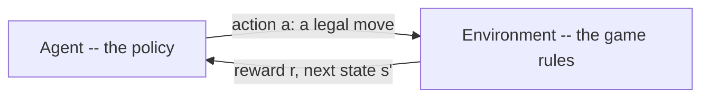
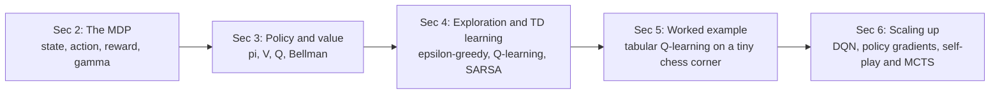
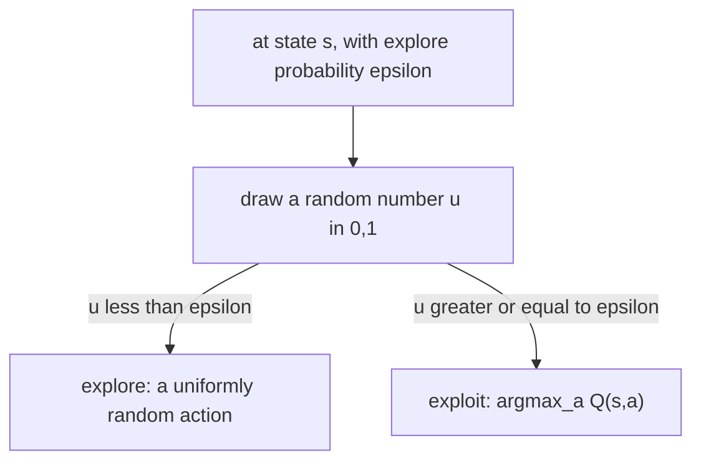
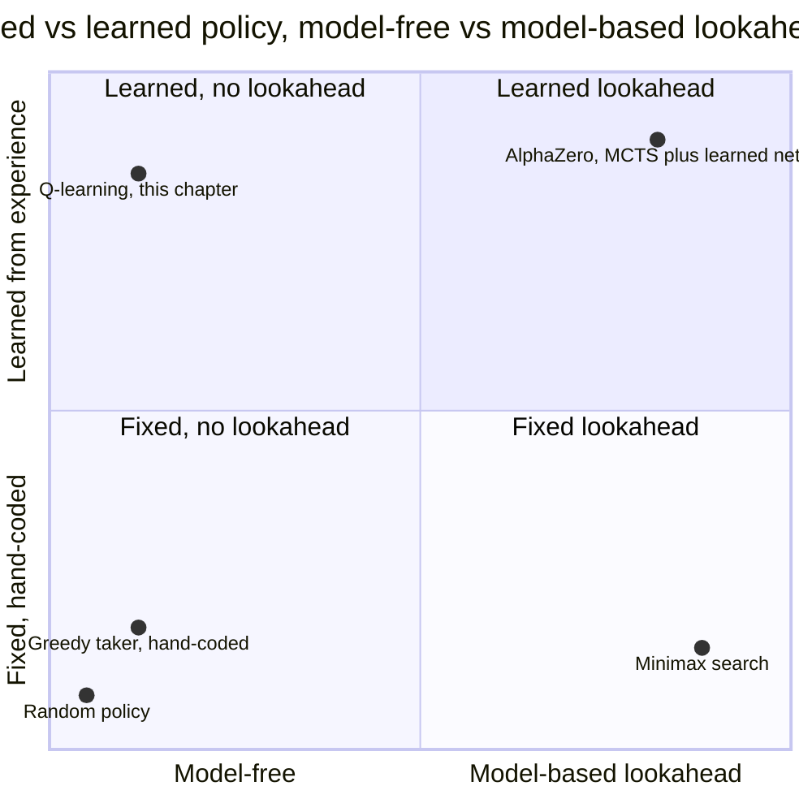
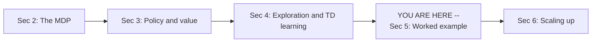
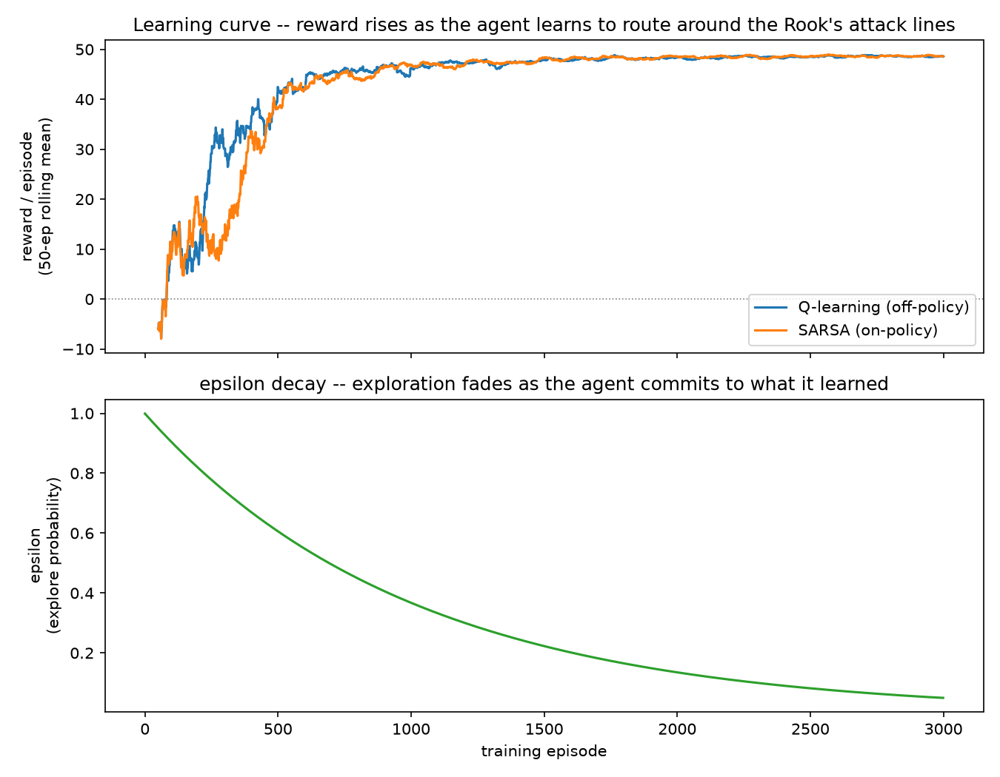
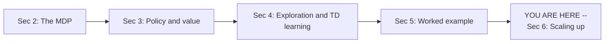
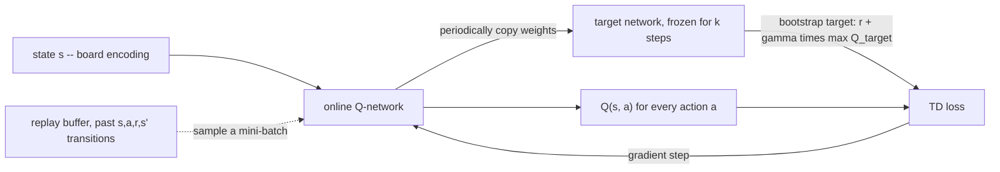
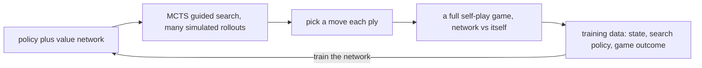
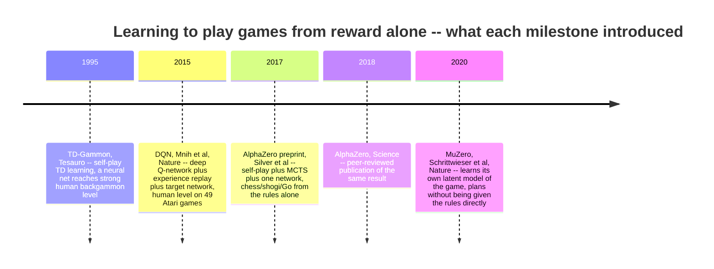

# Reinforcement learning and self-play — teaching an agent to play chess from reward alone

*Machine Learning · Worked Examples · Reinforcement Learning · SPEC-ML-15*

## An evaluation function that taught itself

In March 1995, IBM researcher Gerald Tesauro published an article in *Communications of the ACM*
describing a backgammon program with a strange property: nobody had told it how to play well. Tesauro
built a neural network, had it play 200,000 games of backgammon against **itself**, and after every
move let it nudge its own weights using nothing but the final result of the game and a learning rule
called temporal-difference learning (TD(λ), λ=0.7). No grandmaster's move labels, no hand-written
evaluation function — the network became "an evaluation function for the game of backgammon by
playing against itself and learning from the outcome"
([source: Tesauro, "Temporal Difference Learning and TD-Gammon," 1995](https://www.bkgm.com/articles/tesauro/tdl.html)
(checked 2026-09-03); NOTE-ML-15-3). The result, **TD-Gammon**, reached a level "equal to or slightly
better than the best human players of the era" and discovered opening strategies human experts hadn't
considered (NOTE-ML-15-3).

Twenty years later, DeepMind's **DQN** combined the same core idea — learn from reward, not labels —
with deep neural networks and two stabilising tricks (experience replay, a target network), and hit
human-level play on 49 different Atari games from raw pixels alone, no game-specific tuning
([source: Mnih et al., "Human-level control through deep reinforcement learning," *Nature*, 26 Feb
2015](https://www.nature.com/articles/nature14236) (checked 2026-09-03); NOTE-ML-15-3). Two years after
that, DeepMind pointed the same family of ideas at chess. **AlphaZero** was given the board
representation and the rules — legal moves, check, checkmate — and *nothing else*: no piece values,
no opening book, no Stockfish games to imitate. Playing itself, from random play, it reached
superhuman strength and then beat Stockfish 8 convincingly
([source: Silver et al., "Mastering Chess and Shogi by Self-Play with a General Reinforcement Learning
Algorithm," arXiv:1712.01815, 5 Dec 2017](https://arxiv.org/abs/1712.01815) (checked 2026-09-03);
peer-reviewed and republished in *Science*, 7 Dec 2018, DOI:10.1126/science.aar6404 (science.org
blocks automated fetches with a 403, so this citation is given as plain text rather than a link that
may not resolve for every reader); NOTE-ML-15-3).

Here's the number worth sitting with before anything else in this chapter: getting there took **5,000
first-generation TPUs generating self-play games plus 16 second-generation TPUs training the network**,
and the paper reports chess reaching superhuman strength within 24 hours of that (NOTE-ML-15-3). That
is not a laptop workload. Keep it in mind — this chapter comes back to exactly that gap in §6.

Every other chapter in this course has trained a model on **labelled data**: an image *tagged*
"digit 5," a review *tagged* "positive." Reinforcement learning throws that assumption out. There is
no dataset of "correct chess moves" here — there's a board, a set of legal moves, and, eventually, a
win or a loss. The one hand-tuned thing every chess engine (including the reference material this
chapter draws on) starts from is a simple scoring convention: a pawn is worth 1 point, a knight or
bishop 3, a rook 5, a queen 9
([source: Chess.com, "How Much Is Each Chess Piece Worth?"](https://www.chess.com/terms/chess-piece-value)
(checked 2026-09-03); NOTE-ML-15-4). That table is a **human guess** — a century-old convention based
on how far each piece can move, not a law of chess. TD-Gammon's, DQN's, and AlphaZero's whole premise
is: what if the evaluation function didn't have to be guessed? What if it learned itself, from playing?

**One sentence you could repeat at dinner: instead of being told which moves are good, a
reinforcement-learning agent plays, loses, wins, and slowly works out for itself which moves tend to
lead somewhere good.** This chapter builds that idea from the ground up, on a chess board small enough
to watch it happen.

## 1. What & why — a different kind of "training"

If you've written a game engine — even a toy one, even just tic-tac-toe with minimax — you already
have the two moving parts this chapter needs: a **board** (state) and a **static evaluator**, the
function that scores a position without searching any further ("White is up a rook, call it +5"). What
minimax does with that evaluator is *search*: try every legal move, evaluate what's on the other side of
it, pick the best. Reinforcement learning (RL) asks a different question: **what if the evaluator
itself wasn't hand-written, but learned from playing games?**

| | Supervised learning (every earlier chapter) | Reinforcement learning (this chapter) |
|---|---|---|
| Training signal | a label for every example (`digit = 5`) | a scalar **reward**, often only at the end of a long sequence |
| Feedback timing | immediate, every example | **delayed** — you might not learn a move was a blunder until ten moves later |
| Where the data comes from | a fixed dataset, collected once | the **agent's own actions** generate the data it learns from next |
| What's being learned | a mapping input → label | a **policy**: what to do in each situation, to maximise long-run reward |

That last row is the one with no supervised-learning equivalent: an RL agent's *later* training data
depends on its *earlier* decisions. Play badly early in training and you visit different positions than
if you'd played well — the data distribution is a moving target, generated by the very thing being
trained. Nothing in the MNIST or NLP chapters had to deal with that.



*Figure 1 — the whole loop RL is built from. The agent picks an action; the environment (the rules of
chess, in this chapter) returns a reward and the resulting position; repeat. Every concept in this
chapter is one piece of "how do you get good at picking actions in this loop."*

**The map for the rest of the chapter** — five stops, each building on the last:



*Figure 2 — this chapter's "you are here" map, labelled with the section numbers used throughout (§1,
"What & why," is this map itself). It's reproduced, with your current stop marked, at the Worked
Example and Scaling Up section breaks below.*

### Environment

```text
chess==1.11.2
numpy==2.5.2
matplotlib==3.11.1
Python 3.12+
```

Pinned and verified against PyPI on 2026-09-03 (NOTE-ML-15-1); `chess` on PyPI is the `python-chess`
project (import name `chess`). `gymnasium` is deliberately **not** used — NOTE-ML-15-1's
recommendation for a tabular Q-learning task this small is a hand-rolled environment class over
gymnasium's ~500&nbsp;MB dependency for no benefit at this scale.

```bash
pip install chess==1.11.2 numpy==2.5.2 matplotlib==3.11.1
```

This chapter reuses the `.venv-ml` environment from the Computer Vision chapters. All code and
artefacts below were generated on Python 3.13.7, CPU only — nothing in this chapter needs or uses a
GPU; the whole worked example finishes in single-digit seconds (§5).

## 2. The MDP — state, action, reward, and why delay is the whole difficulty

Formally, RL problems are framed as a **Markov Decision Process (MDP)**: at each timestep $t$ the agent
observes a **state** $S_t$, picks an **action** $A_t$, and the environment returns a **reward** $R_{t+1}$
and a new state $S_{t+1}$. "Markov" means the future only depends on the *current* state, not the
history that led to it — a chess board already encodes everything relevant about how the game got
there (whose move it is, where every piece stands, castling rights); you don't need the move list.

That's four abstract words. Here they are on a real board, using `python-chess` (NOTE-ML-15-1) —
the same library the worked example in §5 is built on:

```python
import chess

board = chess.Board()
print(board)
print()
print("Side to move:", "White" if board.turn else "Black")
print("Legal moves from the start position:", board.legal_moves.count())
```

```text
r n b q k b n r
p p p p p p p p
. . . . . . . .
. . . . . . . .
. . . . . . . .
. . . . . . . .
P P P P P P P P
R N B Q K B N R

Side to move: White
Legal moves from the start position: 20
```

- **State** $S_t$ — the board above, plus whose turn it is (and technically castling rights and en
  passant availability, which `chess.Board` tracks internally). `board.legal_moves.count()` prints
  **20** — confirmed by running the code, not a memorised chess fact.
- **Action** $A_t$ — one legal move, e.g. `e4`. `board.legal_moves` is the *action space* at this
  particular state — and it changes shape every single turn, unlike a fixed action space
  (a robot arm always has the same joints to move).
- **Transition** — `board.push(move)`: the environment applies the move and returns the resulting
  position. In chess this transition is **deterministic** (no dice, no randomness) — the same move from
  the same position always lands on the same next position, which will matter in §5.
- **Reward** $R_{t+1}$ — a single number describing how good that transition was. In *full* chess the
  natural reward is sparse: 0 on every ordinary move, and only $+1$ / $-1$ / $0$ at the very end
  (win/loss/draw). Nothing tells the agent, move by move, whether it's doing well.

**Delayed reward, made concrete.** Push four moves and watch a real game end:

```python
for move in ["f3", "e5", "g4", "Qh4#"]:
    board.push_san(move)

print(board)
print()
print("is_checkmate:", board.is_checkmate())
print("result:", board.result())
```

```text
r n b . k b n r
p p p p . p p p
. . . . . . . .
. . . . p . . .
. . . . . . P q
. . . . . P . .
P P P P P . . P
R N B Q K B N R

is_checkmate: True
result: 0-1
```

That's the real "Fool's Mate" — White's *first* move, `f3`, is the one that loses the game (it opens
the diagonal Black's queen delivers mate on), but the reward signal (`result: 0-1`, White loses) only
arrives four plies later, on `Qh4#`. `f3` itself got **zero** reward when it was played — nothing
marked it as the mistake. **This is the entire difficulty RL exists to solve**: assigning credit (or
blame) for an outcome to the actions, possibly many steps earlier, that actually caused it. Supervised
learning never faces this — every training example already comes with its answer attached.

An **episode** is one full sequence from a starting state to a terminal one — one whole game, here. The
**return** $G_t$ is the total reward collected from time $t$ to the end of the episode, discounted by a
factor $\gamma \in [0, 1]$ that weighs a reward now more than the same reward far in the future
(exactly like a discount rate on future cash flows):

$$
G_t = R_{t+1} + \gamma R_{t+2} + \gamma^2 R_{t+3} + \cdots = \sum_{k=0}^{\infty} \gamma^k R_{t+k+1}
$$

or, written recursively (today's return is this step's reward plus the discounted return from
tomorrow) — the form every update rule in §4 is built from:

$$
G_t = R_{t+1} + \gamma \, G_{t+1}
$$

(Sutton & Barto, *Reinforcement Learning: An Introduction*, 2nd ed., MIT Press, 2018, Ch. 3;
[free draft](https://web.stanford.edu/class/psych209/Readings/SuttonBartoIPRLBook2ndEd.pdf) (checked
2026-09-03); NOTE-ML-15-2.) $\gamma$ close to 1 means "care almost as much about a reward 20 moves from
now as one right now" (patient, but slow to learn); $\gamma$ close to 0 means "only the very next
reward matters" (myopic). The worked example in §5 uses $\gamma = 0.95$: patient enough to route
several squares out of its way to reach a capture, but still preferring the capture *sooner* rather
than later.

## 3. Policies and value — scoring a position, the way you already do by hand

A **policy** $\pi(a \mid s)$ is the agent's strategy: given state $s$, what's the probability of taking
action $a$? (A *deterministic* policy is the special case where one action gets probability 1 and
every other action gets 0 — "always play the best move I know.") Training an RL agent means improving
its policy.

To improve a policy you need a way to judge *how good a state is*, which is exactly what a chess
engine's static evaluator already does. Formalise "how good" as the **state-value function**
$V^\pi(s)$: the expected return, starting from state $s$, if the agent follows policy $\pi$ from here
on. The **action-value function** $Q^\pi(s, a)$ is the same idea, one step more specific: the expected
return of taking action $a$ *right now*, then following $\pi$ afterwards.

**A hand-made $V$ you already know.** The piece-value convention from the cold open — pawn 1, knight/
bishop 3, rook 5, queen 9 (NOTE-ML-15-4) — is precisely a hand-designed, if crude, state-value function:
material balance, White's total minus Black's. Written as real, runnable code, reusing the same `chess`
library:

```python
import chess

PIECE_VALUES = {chess.PAWN: 1, chess.KNIGHT: 3, chess.BISHOP: 3, chess.ROOK: 5, chess.QUEEN: 9}


def material_value(board: chess.Board) -> int:
    """A hand-made state-value function V(s): White's material minus Black's, in the
    conventional pawn=1 / knight=bishop=3 / rook=5 / queen=9 units (NOTE-ML-15-4). Kings are
    excluded -- they are never traded, so they carry no material score.
    """
    score = 0
    for piece_type, value in PIECE_VALUES.items():
        score += value * len(board.pieces(piece_type, chess.WHITE))
        score -= value * len(board.pieces(piece_type, chess.BLACK))
    return score
```

```python
board = chess.Board()
print("start position:", material_value(board))
board.push_san("e4")
board.push_san("d5")
board.push_san("exd5")  # White captures Black's d5 pawn
print("after 1.e4 d5 2.exd5:", material_value(board))
```

```text
start position: 0
after 1.e4 d5 2.exd5: 1
```

Real numbers, from real code: the balanced start position scores `0`; after White wins a pawn, it's
`+1`. That's a $V(s)$ you could plug straight into the static-evaluator slot of a minimax search — and
it's exactly the kind of function `kaggle_chess/evaluation.py`'s material evaluator computes (studied
as reference material for this chapter, not imported — this chapter's `material_value` above is a
from-scratch reimplementation of the same *idea*). It is also, deliberately, a bad value function: it
says nothing about king safety, piece activity, or who's about to get mated — it's a guess, made once,
by a person, decades ago.

**The Bellman equation** is what turns "value" from a static number into something you can compute
recursively — a state's value is this step's expected reward, plus the (discounted) value of wherever
you land next:

$$
V^\pi(s) = \mathbb{E}_\pi\!\left[R_{t+1} + \gamma\, V^\pi(S_{t+1}) \;\middle|\; S_t = s\right]
$$

$$
Q^\pi(s, a) = \mathbb{E}_\pi\!\left[R_{t+1} + \gamma\, Q^\pi(S_{t+1}, A_{t+1}) \;\middle|\; S_t = s,\, A_t = a\right]
$$

(Sutton & Barto 2018, Ch. 4; NOTE-ML-15-2.) Read the first one as: *"a position's value equals what you
get right now, plus (discounted) how good the position you land in is."* It's the same recursive shape
as the return $G_t = R_{t+1} + \gamma G_{t+1}$ from §2 — the Bellman equation is just that recursion,
wrapped in an expectation because the policy (and possibly the environment) can be stochastic. Every
learning rule in §4 is a way of turning this equation — which needs the *true, unknown* $V^\pi$ or
$Q^\pi$ on its right-hand side — into something you can compute from **one sampled experience** instead.

**A policy to beat.** Section 5's worked example needs a *fixed, hand-coded* policy to measure a
learned one against — the RL equivalent of a baseline model. The natural choice, reusing the material
idea above: always move toward whatever's capturable, greedily, with no lookahead — precisely the idea
behind `kaggle_chess/the_taker.py` (studied as reference material; §5 reimplements the idea from
scratch, not the code). §5 will show exactly why "always move toward the target" is a worse policy than
it sounds.

## 4. Exploration and the learning update — turning Bellman into code

### Exploration vs. exploitation, and epsilon-greedy

An agent that always takes the action it currently *believes* is best (**exploit**) can get stuck: if
its very first random guess about some move looked mediocre, it may never try that move again to find
out it was actually great. It needs to sometimes try something else on purpose (**explore**), even
when that looks worse right now. **$\varepsilon$-greedy** is the simplest resolution: with probability
$\varepsilon$, act completely randomly; otherwise, take the current best-known action.



*Figure 3 — one decision, every single step. §5 starts $\varepsilon = 1.0$ (pure exploration — the
agent knows nothing yet) and decays it toward $\varepsilon = 0.05$ as training goes on: explore a lot
early, mostly exploit once the Q-values mean something.*

### Model-free vs. model-based, on a map you already know

A minimax searcher is **model-based**: to decide on a move, it *simulates* several moves ahead using a
perfect model of the rules (it knows exactly what any move leads to, without playing it). The RL
methods in this chapter are **model-free**: the agent never simulates anything — it only learns from
transitions it actually experienced (or, in §5, transitions the environment actually returned when it
tried an action). It has no internal "what if" model of the rules at all; everything it knows lives in
its learned $Q$-values.



*Figure 4 — the map §5's agent and baselines sit on. Minimax (a Java-familiar search algorithm) is
model-based and fixed — brilliant at lookahead, but its evaluator never improves on its own. This
chapter's Q-learning agent is the opposite corner: no lookahead at all, everything learned. AlphaZero,
previewed in §6, is the rare case of both at once — a learned network guiding a model-based search.*

### From Bellman to a sample-based update

The Bellman equation needs the *true* $Q^\pi$ on its right-hand side — which is exactly what you don't
have yet; it's what you're trying to learn. **Temporal-difference (TD) learning**'s move: after one real
transition $(S_t, A_t, R_{t+1}, S_{t+1})$, treat the right-hand side of the Bellman equation, computed
with your *current, still-wrong* $Q$-estimates, as a target to nudge the left-hand side toward:

$$
\underbrace{Q(S_t, A_t)}_{\text{old estimate}} \;\leftarrow\; \underbrace{Q(S_t, A_t)}_{\text{old estimate}} + \alpha \Big[\underbrace{R_{t+1} + \gamma\, (\text{estimate of what comes next}) - Q(S_t, A_t)}_{\text{TD error -- the "surprise"}}\Big]
$$

$\alpha \in (0, 1]$ is the **learning rate** — how big a step to take toward the target each time. The
bracketed term is the **TD error**: the gap between "what I expected" and "what this one experience
suggests" — zero means no surprise, nothing to learn; large (either sign) means update hard. Two
algorithms fill in "(estimate of what comes next)" two different ways, and that one choice is the
entire difference between them:

| | **Q-learning** (off-policy) | **SARSA** (on-policy) |
|---|---|---|
| "what comes next" | the *best possible* action from $S_{t+1}$ | the action the agent *actually takes* next |
| Update rule | $Q(S_t,A_t) \leftarrow Q(S_t,A_t) + \alpha\big[R_{t+1} + \gamma \max_{a'} Q(S_{t+1}, a') - Q(S_t,A_t)\big]$ | $Q(S_t,A_t) \leftarrow Q(S_t,A_t) + \alpha\big[R_{t+1} + \gamma\, Q(S_{t+1}, A_{t+1}) - Q(S_t,A_t)\big]$ |
| Learns about | the greedy policy, even while *behaving* $\varepsilon$-greedily | the policy it's actually following (including its own exploration) |

(Sutton & Barto 2018, Ch. 6, eq. 6.8 and 6.7 respectively; NOTE-ML-15-2.) "Off-policy" means Q-learning
can behave one way (exploring, sometimes randomly) while learning the value of a *different* policy
(the greedy one) — its target uses $\max_{a'}$, the best action available, whether or not the agent is
actually going to take it next. "On-policy" SARSA learns the value of *whatever it's actually doing*,
exploration included — its target plugs in $A_{t+1}$, the specific next action the agent's own
$\varepsilon$-greedy policy chose. §5 trains both, side by side, on the identical environment, so the
difference shows up as data, not just as two formulas.

## 5. Worked example — a tabular Q-learning agent that learns to hunt a Rook

Real chess has roughly $10^{43}$ to $10^{47}$ reachable positions (NOTE-ML-15-1) — no dictionary on any
computer holds a table that size. Tabular Q-learning, the algorithm this section runs, needs a **small,
discrete** state space: one dictionary entry per state, updated directly. So this section trains on a
deliberately tiny slice of real chess, small enough that every state fits in memory and the whole run
finishes in seconds — while staying **genuinely chess**: real piece movement, real captures, a real
terminal win, all validated by `python-chess`'s actual rules engine, not a simplified stand-in.



### The task — "Corner Capture"

A lone White King, confined to the 16-square corner **a1–d4**, must capture a stationary, undefended
Black Rook placed somewhere else in that same corner. A second, inert Black King sits on h8 purely so
`python-chess` accepts the position as legal chess (its rules engine expects both sides to have a king)
— it never moves and never affects anything in the corner.

```text
. . . . . . . k
. . . . . . . .
. . . . . . . .
. . . . . . . .
K . . . . . . .
. . r . . . . .
. . . . . . . .
. . . . . . . .
```

*A real episode's starting position, printed by `env.render()` — White King on a4, Black Rook on c3,
Black's inert King far away on h8.*

**Why this is still real chess, not a simplified stand-in:** every move the King attempts is checked
against `python-chess`'s actual `board.legal_moves`. That includes the one rule that makes this task
non-trivial: a King may **never move onto a square the Rook attacks** along its rank or file — "moving
into check" is illegal even in a one-sided position like this. A move that ignores that rule is
rejected exactly as a real chess engine would reject it, no special-casing.

**State and action space.** State = `(king_square, target_square)`: 16 possible King squares × 15
remaining Rook squares (it can't be wherever the King already is) = **240 states**. Action = one of 8
compass directions (a King's full move set). Total table size: $240 \times 8 = 1{,}920$ — comfortably
inside NOTE-ML-15-1's ~$10^3$–$10^4$ ceiling for a dict-based Q-table, and the whole thing trains on a
CPU laptop in single-digit seconds, confirmed below.

**Reward shaping — the material idea, and its risk.** The environment reuses this chapter's own
material-value convention (§3, NOTE-ML-15-4) to size the one reward that matters:

$$
r = \begin{cases}
+10 \times \text{value(Rook)} = +50 & \text{capture -- episode ends, a win} \\
-1 & \text{an ordinary legal move} \\
-2 & \text{an illegal attempt -- rejected, no state change}
\end{cases}
$$

$-1$ per move is "time pressure": fewer moves to the capture is better technique, not just *a*
technique. $-2$ for an illegal attempt is worse than a wasted legal move — it gives the agent a reason
to learn "don't try that square again from here," instead of shrugging off illegal attempts as free.
**This is reward shaping**: designing a reward signal denser than the bare win/loss/draw full chess
gives you, so a tabular method can learn something in a few thousand episodes instead of never seeing a
non-zero reward at all. It is also a risk — get the relative sizes wrong (say, make the illegal penalty
smaller than the step penalty) and the agent can learn to *prefer* bumping into a wall over making real
progress, because the badly-shaped reward said that was fine. §7 returns to this.

The full environment, reusing exactly the constants and reward values quoted above:

```python
"""A deliberately tiny, genuinely-chess RL environment: "Corner Capture."

The task: a lone White King, confined to a 4x4 corner of a real chess board (files a-d,
ranks 1-4, 16 squares), must capture a stationary, undefended Black Rook placed
somewhere else in that same corner. A second Black King sits inertly on h8 purely so the
position is a legal chess position for python-chess's rules engine -- it never moves and
never matters strategically.

Every move the agent's King makes is validated by python-chess's real legal-move
generator (chess.Board.legal_moves), so illegal moves -- including moving the King onto
a square the Rook attacks along its rank or file ("moving into check") -- are rejected
exactly as a real chess engine would reject them.
"""
from __future__ import annotations

from dataclasses import dataclass

import chess
import numpy as np

FILES = 4
RANKS = 4
REGION_SQUARES: list[int] = [chess.square(f, r) for r in range(RANKS) for f in range(FILES)]

DIRECTIONS: list[tuple[int, int]] = [
    (0, 1), (1, 1), (1, 0), (1, -1), (0, -1), (-1, -1), (-1, 0), (-1, 1),
]
DIRECTION_NAMES = ["N", "NE", "E", "SE", "S", "SW", "W", "NW"]
N_ACTIONS = len(DIRECTIONS)

PIECE_VALUES: dict[chess.PieceType, int] = {
    chess.PAWN: 1, chess.KNIGHT: 3, chess.BISHOP: 3, chess.ROOK: 5, chess.QUEEN: 9,
}
REWARD_SCALE = 10  # capturing the rook (value 5) is worth +50
STEP_PENALTY = -1.0
ILLEGAL_PENALTY = -2.0
INERT_BLACK_KING_SQUARE = chess.H8


def _build_board(king_sq: int, target_sq: int, target_piece: chess.PieceType) -> chess.Board:
    board = chess.Board(None)  # empty board, no starting position
    board.set_piece_at(king_sq, chess.Piece(chess.KING, chess.WHITE))
    board.set_piece_at(target_sq, chess.Piece(target_piece, chess.BLACK))
    board.set_piece_at(INERT_BLACK_KING_SQUARE, chess.Piece(chess.KING, chess.BLACK))
    board.turn = chess.WHITE
    return board


@dataclass
class StepResult:
    state: tuple[int, int]
    reward: float
    done: bool
    won: bool
    legal: bool


class CornerCaptureEnv:
    def __init__(self, target_piece: chess.PieceType = chess.ROOK, max_steps: int = 20):
        self.target_piece = target_piece
        self.max_steps = max_steps
        self.king_sq: int = REGION_SQUARES[0]
        self.target_sq: int = REGION_SQUARES[-1]
        self.board: chess.Board = _build_board(self.king_sq, self.target_sq, self.target_piece)
        self.steps_taken = 0

    def reset(self, rng: np.random.Generator) -> tuple[int, int]:
        king_sq, target_sq = rng.choice(REGION_SQUARES, size=2, replace=False)
        self.king_sq, self.target_sq = int(king_sq), int(target_sq)
        self.board = _build_board(self.king_sq, self.target_sq, self.target_piece)
        self.steps_taken = 0
        return self.state

    @property
    def state(self) -> tuple[int, int]:
        return (self.king_sq, self.target_sq)

    def legal_directions(self) -> dict[int, int]:
        """Which of the 8 compass directions are legal RIGHT NOW, and where each lands --
        delegates entirely to chess.Board.legal_moves, the one place real chess rules
        (including "can't move into check" from the Rook's rank/file) enter the picture.
        """
        legal: dict[int, int] = {}
        kf, kr = chess.square_file(self.king_sq), chess.square_rank(self.king_sq)
        for i, (df, dr) in enumerate(DIRECTIONS):
            f, r = kf + df, kr + dr
            if not (0 <= f < 8 and 0 <= r < 8):
                continue
            dest = chess.square(f, r)
            if dest not in REGION_SQUARES:
                continue
            move = chess.Move(self.king_sq, dest)
            if move in self.board.legal_moves:
                legal[i] = dest
        return legal

    def step(self, action: int) -> StepResult:
        assert self.steps_taken < self.max_steps, "step() called after episode ended"
        self.steps_taken += 1
        legal = self.legal_directions()

        if action not in legal:
            timed_out = self.steps_taken >= self.max_steps
            return StepResult(self.state, ILLEGAL_PENALTY, timed_out, False, legal=False)

        dest = legal[action]
        move = chess.Move(self.king_sq, dest)
        is_capture = self.board.is_capture(move)
        self.board.push(move)
        self.board.turn = chess.WHITE  # Black never gets a turn in this single-agent task
        self.king_sq = dest

        if is_capture:
            reward = REWARD_SCALE * PIECE_VALUES[self.target_piece]
            return StepResult(self.state, reward, True, True, legal=True)

        timed_out = self.steps_taken >= self.max_steps
        return StepResult(self.state, STEP_PENALTY, timed_out, False, legal=True)

    def render(self) -> str:
        return str(self.board)


def chebyshev_distance(a_sq: int, b_sq: int) -> int:
    """King-move distance between two squares -- minimum King steps ignoring legality."""
    af, ar = chess.square_file(a_sq), chess.square_rank(a_sq)
    bf, br = chess.square_file(b_sq), chess.square_rank(b_sq)
    return max(abs(af - bf), abs(ar - br))
```

Every python-chess call above (`Board(None)` for an empty board, `set_piece_at`, `legal_moves`,
`is_capture`, `push`, `square`/`square_file`/`square_rank`) is confirmed against the official docs
([source: python-chess core API reference](https://python-chess.readthedocs.io/en/latest/core.html)
(checked 2026-09-03)).

### The baselines — random, and a "greedy taker" that can't see the Rook's line of fire

Two fixed policies, sharing one call shape `(env, rng) -> action`, so the exact same evaluation harness
can score them and the trained agent side by side:

```python
import chess
import numpy as np

from chess_rl_env import CornerCaptureEnv, DIRECTIONS, N_ACTIONS, chebyshev_distance


def random_policy(env: CornerCaptureEnv, rng: np.random.Generator) -> int:
    """Pick one of the 8 compass directions uniformly at random -- no thinking at all."""
    del env
    return int(rng.integers(0, N_ACTIONS))


def greedy_taker_policy(env: CornerCaptureEnv, rng: np.random.Generator) -> int:
    """Always step toward the target by shortest King-move distance -- no rules awareness.

    Reimplements, from scratch, the idea behind kaggle_chess/the_taker.py: a materially
    greedy bot with no lookahead. It never consults env.legal_directions(), so when its one
    best direction happens to walk into a square the Rook defends, the environment rejects
    the move (-2) and, since nothing about the state changed, the SAME direction gets
    picked again next turn -- it can get stuck bumping into the same illegal square
    repeatedly until the episode times out.
    """
    del rng
    king_sq, target_sq = env.king_sq, env.target_sq
    kf, kr = chess.square_file(king_sq), chess.square_rank(king_sq)
    best_action = 0
    best_distance: int | None = None
    for action, (df, dr) in enumerate(DIRECTIONS):
        f, r = kf + df, kr + dr
        if not (0 <= f < 8 and 0 <= r < 8):
            continue
        dest = chess.square(f, r)
        distance = chebyshev_distance(dest, target_sq)
        if best_distance is None or distance < best_distance:
            best_distance = distance
            best_action = action
    return best_action
```

### The agent — one class, two update rules

The `TabularTDAgent` below implements §4's table exactly: a dict-based Q-table (`Q[state]` is an
8-entry array), $\varepsilon$-greedy action selection, and a single `update()` method that switches
between the Q-learning and SARSA targets with **one line**:

```python
from __future__ import annotations

from dataclasses import dataclass, field

import numpy as np

N_ACTIONS = 8


@dataclass
class TrainingHistory:
    episode_rewards: list[float] = field(default_factory=list)
    epsilon_values: list[float] = field(default_factory=list)
    episode_steps: list[int] = field(default_factory=list)
    episode_wins: list[bool] = field(default_factory=list)


class TabularTDAgent:
    def __init__(
        self,
        n_actions: int = N_ACTIONS,
        alpha: float = 0.2,
        gamma: float = 0.95,
        epsilon_start: float = 1.0,
        epsilon_min: float = 0.05,
        epsilon_decay: float = 0.999,
        update_rule: str = "q_learning",
        seed: int = 42,
    ) -> None:
        if update_rule not in ("q_learning", "sarsa"):
            raise ValueError(f"update_rule must be 'q_learning' or 'sarsa', got {update_rule!r}")
        self.n_actions = n_actions
        self.alpha = alpha
        self.gamma = gamma
        self.epsilon = epsilon_start
        self.epsilon_min = epsilon_min
        self.epsilon_decay = epsilon_decay
        self.update_rule = update_rule
        self.rng = np.random.default_rng(seed)
        self.q: dict[tuple[int, int], np.ndarray] = {}

    def _row(self, state: tuple[int, int]) -> np.ndarray:
        row = self.q.get(state)
        if row is None:
            row = np.zeros(self.n_actions, dtype=np.float64)
            self.q[state] = row
        return row

    def select_action(self, state: tuple[int, int], greedy: bool = False) -> int:
        if not greedy and self.rng.random() < self.epsilon:
            return int(self.rng.integers(0, self.n_actions))
        return int(np.argmax(self._row(state)))

    def update(
        self,
        state: tuple[int, int],
        action: int,
        reward: float,
        next_state: tuple[int, int],
        next_action: int | None,
        done: bool,
    ) -> float:
        row = self._row(state)
        if done:
            target = reward  # no successor state -- the episode ended right here
        elif self.update_rule == "q_learning":
            target = reward + self.gamma * float(np.max(self._row(next_state)))
        else:  # sarsa
            assert next_action is not None, "SARSA needs the actual next action"
            target = reward + self.gamma * float(self._row(next_state)[next_action])
        td_error = target - row[action]
        row[action] += self.alpha * td_error
        return td_error

    def decay_epsilon(self) -> None:
        self.epsilon = max(self.epsilon_min, self.epsilon * self.epsilon_decay)
```

`update()`'s `elif`/`else` branch is the entire off-policy/on-policy distinction from §4's table, in
code: Q-learning re-derives `max_a' Q(s', a')` straight from the row; SARSA plugs in the Q-value of
`next_action`, the specific action the agent's own $\varepsilon$-greedy policy is about to take. One
training loop drives both, so the difference is visible as a one-line branch, not two divergent
programs:

```python
def train(agent: TabularTDAgent, env: CornerCaptureEnv, n_episodes: int, env_rng: np.random.Generator) -> TrainingHistory:
    history = TrainingHistory()
    for _ in range(n_episodes):
        state = env.reset(env_rng)
        action = agent.select_action(state)
        episode_reward = 0.0
        steps = 0
        won = False
        done = False
        while not done:
            result = env.step(action)
            episode_reward += result.reward
            steps += 1
            done = result.done
            won = result.won
            next_state = result.state
            next_action = None if done else agent.select_action(next_state)
            agent.update(state, action, result.reward, next_state, next_action, done)
            state, action = next_state, next_action if next_action is not None else action
        agent.decay_epsilon()
        history.episode_rewards.append(episode_reward)
        history.epsilon_values.append(agent.epsilon)
        history.episode_steps.append(steps)
        history.episode_wins.append(won)
    return history
```

The full, runnable versions of all four modules — `chess_rl_env.py`, `policies.py`,
`q_learning_agent.py`, and the orchestration script `run_experiment.py` (training, evaluation, and all
three plots below) — are at
[`code/`](code/). Reproduce every number and figure in this section with:

```bash
.venv-ml/Scripts/python.exe \
    "02-machine-learning/03-worked-examples/04-reinforcement-learning/code/run_experiment.py"
```

### Running it — watch reward rise and epsilon fall

Both agents train for 3,000 episodes ($\alpha = 0.2$, $\gamma = 0.95$, $\varepsilon$ decaying `1.0 →
0.999` per episode, floored at `0.05`); the script then evaluates all four policies — random,
greedy-taker, the trained Q-learning agent, and the trained SARSA agent, each acting **greedily**
($\varepsilon = 0$, no more exploring) — over 500 fresh episodes each. Actual run log, unedited:

```text
State space: 16 King squares x 15 remaining Rook squares = 240 states x 8 actions = 1920 (state, action) table entries

=== Training Q-learning (off-policy), 3000 episodes ===
  Q-learning episode   500/3000  avg_reward(last 100)= +37.82  epsilon=0.606
  Q-learning episode  1000/3000  avg_reward(last 100)= +45.86  epsilon=0.368
  Q-learning episode  1500/3000  avg_reward(last 100)= +47.78  epsilon=0.223
  Q-learning episode  2000/3000  avg_reward(last 100)= +48.32  epsilon=0.135
  Q-learning episode  2500/3000  avg_reward(last 100)= +48.55  epsilon=0.082
  Q-learning episode  3000/3000  avg_reward(last 100)= +48.52  epsilon=0.050

=== Training SARSA (on-policy), 3000 episodes ===
  SARSA      episode   500/3000  avg_reward(last 100)= +34.89  epsilon=0.606
  SARSA      episode  1000/3000  avg_reward(last 100)= +46.57  epsilon=0.368
  SARSA      episode  1500/3000  avg_reward(last 100)= +47.73  epsilon=0.223
  SARSA      episode  2000/3000  avg_reward(last 100)= +48.58  epsilon=0.135
  SARSA      episode  2500/3000  avg_reward(last 100)= +48.65  epsilon=0.082
  SARSA      episode  3000/3000  avg_reward(last 100)= +48.74  epsilon=0.050

=== Evaluating (greedy, epsilon=0), 500 episodes each ===
  random         win_rate=0.426  avg_reward=  -2.00  avg_steps=15.09
  greedy-taker   win_rate=0.754  avg_reward= +27.29  avg_steps=6.26
  Q-learning     win_rate=1.000  avg_reward= +48.85  avg_steps=2.15
  SARSA          win_rate=1.000  avg_reward= +48.95  avg_steps=2.05
```

**Wall-clock:** training both agents for 3,000 episodes each, evaluating all four policies over 500
episodes each, and generating all three artefacts below took **under 6 seconds**, start to finish, on
this CPU-only machine — comfortably inside NOTE-ML-15-1's "a few minutes" tractability requirement, and
every number above reproduced exactly on a repeat run (both `SEED = 42`).

Reward rises steeply in the first ~500 episodes (Q-learning: `+37.82` average, up from starting near
zero) and keeps climbing toward the ceiling that a perfect policy would hit — roughly `+50` minus one
or two step penalties for the average distance to the target — while $\varepsilon$ falls from `1.0`
toward its `0.05` floor across the same span. The plotted version makes both trends impossible to miss:



*Figure 5 — top: reward per episode (50-episode rolling mean, since any single episode is noisy — King
and Rook start in a different random pair of squares every time). Both algorithms converge to nearly
identical performance; SARSA's curve wobbles slightly more mid-training because, unlike Q-learning, it
factors its own upcoming random exploratory moves into what it's learning. Bottom: the same
$\varepsilon$ schedule driving both runs.*

### What did the table actually learn?

A win rate of 100% is a number; it doesn't show *what* the agent figured out. Fix the target at
**d4** and, for every King square, plot the greedy action (`argmax_a Q(s,a)`, drawn as an arrow) and
the learned state value (`max_a Q(s,a)`, as colour) — the "learned Q-table," made readable:


*Figure 6 — the star is the target Rook at d4. Squares glow brighter (higher learned value) the fewer
steps they're predicted to need.*

Two things pop out, and neither was programmed in — both are things the agent worked out purely from
the $-2$ illegal-move penalty, by trial and error:

- **c3 is the brightest square on the board** (value ≈ 50, an arrow pointing straight at d4). c3 is a
  diagonal neighbour of d4, *and it isn't on the Rook's rank or file* — so the King can safely stand
  there and capture next move. It's the best possible square to be standing on, and the table learned
  that without ever being told "diagonal approach is safe."
- **Squares on d4's own rank (row 4) and file (column d) are systematically darker**, and their arrows
  point *away* from the target first. b4 and c4 sit on rank 4 — the Rook attacks every square along it
  — so a King there can't approach in a straight line; the table learned to route around, off the rank,
  before curving back in. The same happens down file d. **The agent rediscovered "don't walk into the
  Rook's line of fire" from -2 penalties alone** — nobody wrote a rule that says "avoid the attacked
  rank and file."

### Evaluated against the baselines

```console
                win_rate   avg_reward   avg_steps
random             0.426       -2.00       15.09
greedy-taker        0.754      +27.29        6.26
Q-learning          1.000      +48.85        2.15
SARSA               1.000      +48.95        2.05
```


*Figure 7 — the win-rate panel is the headline: both learned agents solve every one of 500 held-out
episodes, greedy-taker solves three in four, and random barely edges out a coin flip. The steps panel
tells the more interesting story: Q-learning and SARSA finish in ~2 moves on average — c3-to-d4-style
direct diagonal captures — while greedy-taker needs 6.26, paying for every wasted turn spent bumping
into the Rook's attack line before it happens to wander off it.*

**Random loses on average** (`avg_reward = -2.00`): with `max_steps = 20` and no idea what it's doing,
most episodes time out, racking up $-1$ per move with no capture bonus to offset it. **Greedy-taker
wins most of the time** (75.4%) — heading straight for the target is a decent heuristic *most* starting
positions reward — but its failures are exactly the mechanism described in the code comment above:
stuck repeating an illegal move against the Rook's attack line until the 20-step clock runs out.
**Q-learning and SARSA both reach a perfect 100% win rate** and do it in about a third of greedy-taker's
average steps, because — unlike greedy-taker — they learned to route around the danger instead of
walking straight at it and hoping.

## 6. Scaling up — from a 1,920-entry table to AlphaZero



Section 5's whole table — every state, every action, every learned number — fits in **1,920** floats.
Full chess has an estimated $10^{43}$ to $10^{47}$ reachable positions (NOTE-ML-15-1). There is no
computer, now or plausibly ever, with a dictionary that large. Tabular Q-learning, exactly as written
in §5, simply cannot run on full chess — not "runs slowly," *cannot run at all*: you'd run out of
memory building the table long before you finished one game. Everything below is how the field got
from "a lookup table" to "plays real chess," and — following this chapter's scope — it's **explained
and grounded, not executed**: none of it is small enough to be a laptop worked example.

### DQN — replace the table with a network

The fix for "the table doesn't fit" is obvious in hindsight: don't store one number per state — learn a
**function** that produces $Q(s, a)$ for any state, including ones never seen during training. A
**Deep Q-Network (DQN)** does exactly this: a neural network (the CNN architectures from
[ML-2](../../01-theory/02-architectures.md) are the natural fit for a board-shaped input) takes a state
and outputs one $Q$-value per action, trained toward the same TD target §5's table used, just now via
gradient descent on the network's weights instead of a direct table update.

Two engineering fixes were needed to make that actually train stably, both introduced by DeepMind's
2015 *Nature* paper on 49 Atari games (NOTE-ML-15-3):

- **Experience replay** — store past $(s, a, r, s')$ transitions in a buffer; train on randomly-sampled
  mini-batches from it, rather than on transitions in the order they were played. Consecutive
  frames of one game are highly correlated (today's board looks a lot like yesterday's); training
  directly on that order destabilises gradient descent the same way an un-shuffled `DataLoader`
  ([ML-4](../01-computer-vision/01-image-classification-mnist.md)) would.
- **A target network** — a second, slower-updating copy of the network supplies the bootstrapped
  target ($\max_{a'} Q(s', a')$ in §5's Q-learning update); the *online* network being trained right
  now is not the same one producing its own targets. Bootstrapping off a network that's changing every
  single step is a moving-target problem; freezing the target network for a batch of steps at a time
  fixes it.



*Figure 8 — DQN's loop. Compare directly to §5's `TabularTDAgent.update()`: the target computation
(`reward + gamma * max(next Q-row)`) is identical in spirit; only *where the Q-values come from*
changed, from a dict lookup to a forward pass through two networks.* With these two fixes, DQN reached
human-level play on 29 of 49 Atari games, from raw pixels, no game-specific tuning (NOTE-ML-15-3) — but
NOTE-ML-15-3 is equally clear that this "requires significant engineering (replay buffer, target
network, hyperparameter tuning) for stability; not a minimal algorithm" — a caution §7 returns to.

### Policy gradients — learn the policy directly, skip the Q-values

Q-learning and SARSA both learn *values*, then derive a policy from them (`argmax_a Q(s,a)`). **Policy
gradient** methods skip the middle step: parameterise the policy itself, $\pi(a \mid s; \theta)$ — a
network that outputs action *probabilities* directly — and adjust $\theta$ by gradient ascent on
expected return: nudge the weights so that actions which led to high return become more probable, and
actions that led to low return become less probable. **REINFORCE**, the simplest member of this family,
does exactly that using the return $G_t$ from §2 as the training signal for each action taken;
**actor-critic** methods add a learned value function (a "critic") alongside the policy (the "actor") to
reduce how noisy that signal is. Both are covered, past this chapter's scope, in Sutton & Barto 2018's
later chapters (NOTE-ML-15-2). The practical reason to reach for a policy-gradient method over DQN: it
extends cleanly to *continuous* action spaces (steering angle, joint torque) where "take the argmax
over all actions" isn't even well-defined — not a concern for chess's discrete move set, but the reason
this family of methods dominates robotics.

### Self-play + MCTS = AlphaZero

AlphaZero combines a policy-and-value network (the two ideas above, in one network with two output
heads) with **Monte Carlo Tree Search (MCTS)**: instead of picking a move straight from the network's
raw policy output, run many simulated rollouts, guided by the network's own value estimates, and pick
the move that search recommends. Every game against itself then becomes one training example: the
network is trained to predict both the outcome of that self-played game *and* the move probabilities
MCTS actually settled on — the network gets better, which makes MCTS's search better next game, which
produces better training data, in a loop:



*Figure 9 — the loop that produced AlphaZero. Notice what's absent: no human games, no opening book, no
hand-written evaluator like §3's `material_value` — the network starts from random weights and the
only external input, ever, is the rules of the game (NOTE-ML-15-3).*

**MuZero** (Schrittwieser et al., *Nature*, 2020) goes one step further: it learns even the *rules'
consequences* as a latent model, rather than being given a simulator to run MCTS against, and does it
with one architecture across Atari, Go, chess, and shogi
([source: Schrittwieser et al., "Mastering Atari, Go, Chess and Shogi by Planning with a Learned
Model," *Nature*, 2020](https://www.nature.com/articles/s41586-020-03051-4) (checked 2026-09-03);
NOTE-ML-15-3). It's meaningfully more complex than anything above and firmly out of this chapter's
scope — a pointer, not a destination.



**The compute gap, honestly.** Section 5's whole experiment — training two agents for 3,000 episodes
each, evaluating four policies, generating three plots — ran in **under 6 seconds** on a CPU laptop.
AlphaZero's training run used **5,000 first-generation TPUs to generate self-play games plus 16
second-generation TPUs to train the network**, reaching superhuman chess strength within **24 hours**
of that (NOTE-ML-15-3) — thousands of accelerators, not one CPU core; a state space around $10^{43}$
to $10^{47}$ positions, not 240. That gap is not a rounding error, and it's the honest reason this
chapter builds a genuinely tiny worked example instead of pretending to scale it up: the *concepts* in
§§2–5 (MDP, Bellman, TD updates, on-policy vs. off-policy) are exactly what AlphaZero runs on — the
compute to run them on real chess is a different problem entirely.

## 7. Pitfalls

- **Reward shaping gone wrong — reward hacking.** §5's environment works because $-2$ (illegal) is more
  punishing than $-1$ (a wasted legal move), which is more punishing than routing a few extra squares
  around danger. Get those relative sizes backwards — say, make the illegal penalty *smaller* than the
  step penalty — and an agent can learn to prefer repeatedly bumping into a wall over making real
  progress, because the (badly-shaped) numbers say that's fine. This is **reward hacking** in miniature:
  the agent optimises exactly what you told it to, not what you meant. **How to see it:** if reward
  keeps climbing during training but the agent's *behaviour* looks obviously wrong when you watch an
  episode play out, suspect the reward function before the algorithm.
- **Non-stationarity in self-play.** In §6's self-play loop, the "opponent" is the same network being
  trained, which keeps changing — the environment an agent is learning against is a moving target,
  unlike §5's environment where the Rook never fights back. NOTE-ML-15-3 confirms AlphaZero's paper
  addresses this directly, through careful exploration and replay buffering — it is a known, actively
  managed problem, not a solved one. **How to see it:** a self-play agent's performance against a fixed
  historical version of itself can *regress* mid-training even while it keeps "winning" against its
  current opponent — because that opponent moved too.
- **Sparse reward.** Full chess gives essentially zero signal until checkmate — §2's Fool's Mate example
  showed the losing move getting exactly zero reward when it happened. §5's shaped, dense reward
  ($-1$/$-2$/$+50$ every single step) is what makes tabular Q-learning converge in 3,000 episodes; the
  *un*-shaped, sparse version of the same task (reward only on capture, nothing per move) would take
  far longer to learn anything, because almost every episode would return a string of zeros with
  nothing to distinguish a good move from a bad one until the very end.
- **Unstable deep-RL training.** NOTE-ML-15-3 is explicit that DQN "requires significant engineering
  (replay buffer, target network, hyperparameter tuning) for stability; not a minimal algorithm" — §5's
  clean, converging Q-learning curve is a property of a *tabular* method on a *tiny* state space, and
  should not be read as "deep RL is this easy." Swap the dict-based Q-table for a neural network and
  every one of §6's stabilisation tricks becomes necessary, not optional.
- **Evaluating against a fixed, weak baseline — and fooling yourself.** §5's Q-learning agent beats
  greedy-taker and random with a perfect score. That is evidence it solved *this specific 240-state
  task* better than *these two specific fixed policies* — it is not evidence of anything resembling
  chess skill. A real evaluation of a real chess-playing agent needs much stronger, more varied
  opponents (ideally other trained agents, or established engines) precisely because a weak, static
  baseline can make almost any learned policy look strong. Keep §5's numbers scoped to what they
  actually measured.

## 8. Recap & what's next

- **RL vs. supervised learning**: no labels, only a scalar **reward**, often delayed — and the agent's
  own actions generate the data it learns from next (§1).
- **The MDP**: state, action, reward, transition, discount $\gamma$, and the **return**
  $G_t = \sum_k \gamma^k R_{t+k+1}$ — demonstrated on a real board, including a real checkmate whose
  reward arrived four moves after the mistake that caused it (§2).
- **Policy, value, and the Bellman equation**: $\pi(a\mid s)$, $V^\pi(s)$, $Q^\pi(s,a)$, and the
  recursive relationship between a state's value and its successor's — with material-eval as a
  hand-made $V$ you built and ran yourself (§3).
- **Exploration, model-free vs. model-based, and the TD update**: $\varepsilon$-greedy balances
  exploring and exploiting; minimax (model-based, fixed) sits on the opposite side of the map from this
  chapter's Q-learning (model-free, learned); Q-learning (off-policy, bootstraps off $\max_{a'}$) and
  SARSA (on-policy, bootstraps off the actual next action) differ by exactly one term (§4).
- **The worked example**: a tabular Q-learning agent, trained on a genuinely-chess 1,920-entry table in
  under 6 seconds, reached a **100% win rate** against both a random policy (42.6%) and a hand-coded
  greedy baseline (75.4%) — and the learned Q-table, visualised, shows it discovered to route around the
  Rook's rank/file attack lines with no rule ever telling it to (§5).
- **Scaling up**: tables don't fit real chess ($10^{43}$–$10^{47}$ states); DQN replaces the table with
  a network plus experience replay and a target network; policy gradients learn $\pi$ directly; AlphaZero
  combines a learned network with MCTS in a self-play loop — grounded, with the honest compute gap
  (thousands of TPUs vs. one CPU laptop) stated plainly, not glossed over (§6).

**Further reading, grounded throughout this chapter:**
[Sutton & Barto, *Reinforcement Learning: An Introduction*, 2nd ed. (free draft)](https://web.stanford.edu/class/psych209/Readings/SuttonBartoIPRLBook2ndEd.pdf)
— the source for every formula in §§2–4;
[Silver et al., AlphaZero (arXiv)](https://arxiv.org/abs/1712.01815) (also published in *Science*,
DOI:10.1126/science.aar6404) — §6's self-play/MCTS section;
[Mnih et al., DQN (*Nature*, 2015)](https://www.nature.com/articles/nature14236) — §6's DQN section;
[Gymnasium](https://pypi.org/project/gymnasium/) — the standard RL environment interface this chapter
deliberately skipped for tabular Q-learning (NOTE-ML-15-1), worth reaching for once an environment
needs a richer action space or continuous observations than a hand-rolled class comfortably supports.

This closes the Machine Learning subject's Worked Examples arc — Computer Vision
([ML-4](../01-computer-vision/01-image-classification-mnist.md)), Natural Language, LLMs, and now
Reinforcement Learning all share the same underlying loop from
[ML-1](../../01-theory/01-neural-network-fundamentals.md): a model, a training signal, and a loop that
nudges weights toward less error. What differs, chapter to chapter, is *where the training signal comes
from* — a label, a reconstruction target, or, here, a reward the agent has to work out the consequences
of for itself. There is no fixed next spec yet for this subject's Cloud Environment Setup section
(GPU/TPU training); the ideas in this chapter's §6 — an agent, an environment, a reward it optimises
for — are also the direct prerequisite vocabulary for **03-agentic-engineering**, the next subject in
this course, whose agents plan and act toward a goal the same way §5's King learned to hunt down a Rook.
