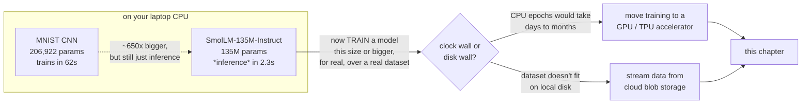
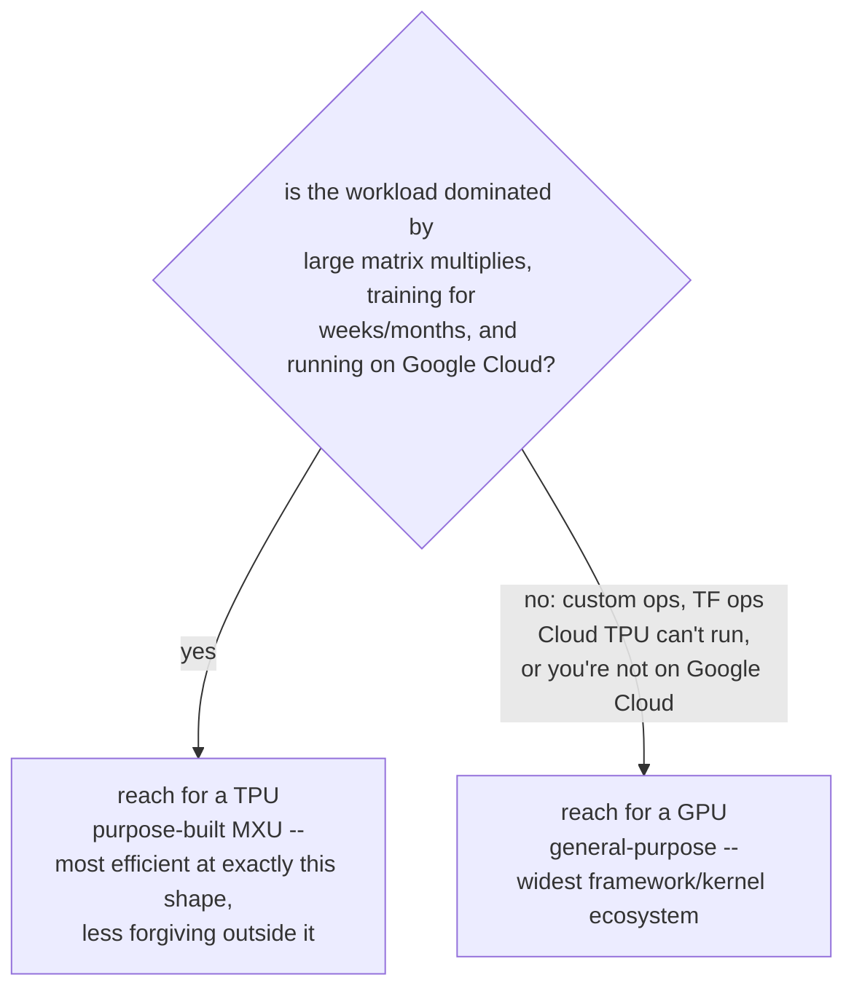
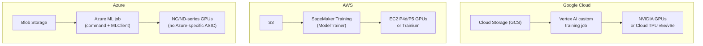
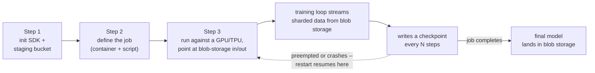
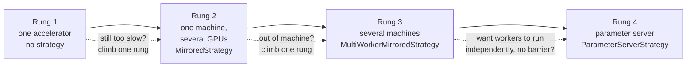
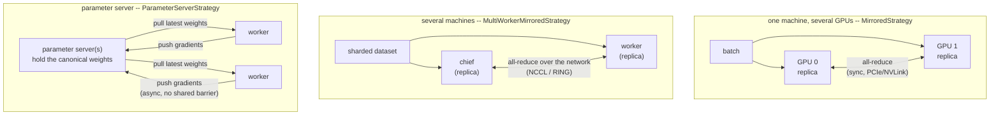

# Cloud GPU/TPU training and blob storage — Google, AWS, Azure

*Machine Learning · Cloud Environment Setup · SPEC-ML-12*

**Nature of this chapter: grounded conceptual.** No cloud account exists in this sandbox, so every
CLI/SDK block below is **reference only** — real, current API surface pulled from each vendor's own
documentation and verified live today, but not executed. Nothing in this chapter is a fabricated
console output: where you'd normally see a job status or a printed number, the text cites the
documented behaviour instead of inventing one. The one piece of code that actually runs is the
workflow diagram generator in `code/`.

## The 62-second model, and the one that won't fit

Earlier in this book, a small CNN learned to read handwritten digits. 206,922 parameters, three
epochs, trained on nothing but a laptop's CPU — wall-clock time **under 62 seconds**
([source: image-classification-mnist.md](../03-worked-examples/01-computer-vision/01-image-classification-mnist.md),
this project's own gated run log). You could rerun that on a coffee break.

Later in this book, a different chapter loads `HuggingFaceTB/SmolLM-135M-Instruct` — 135 million
parameters, about **650 times** the MNIST model's size — and it *also* runs fine on a laptop CPU:
2.3 seconds to load and start generating
([source: llm-text-generation.md](../03-worked-examples/03-llms/02-llm-text-generation.md), this
project's own gated run log). So did the wall move? No — look closer at what that chapter actually
does with the model: it **generates text from weights someone else already trained.** It never runs
a single backward pass. Inference on a laptop CPU stays cheap almost all the way up the size curve;
what doesn't stay cheap is *training* — computing millions of gradients and updating millions of
weights, repeated for every batch, for every epoch, over a real dataset.

Now picture actually training a model that size — not loading pretrained weights, but fitting them
from scratch or fine-tuning them for real, over a real corpus, for enough epochs to matter. Every
matrix multiply in that 62-second MNIST run was already stretching a CPU's handful of general-purpose
cores about as far as this book's toy examples go. A production-scale vision or language model runs
one or two more orders of magnitude past that again, over a dataset that itself may not fit on your
laptop's disk. That combination — a training loop too slow to finish in a useful time, over data too
big to hold locally — is the wall this chapter is about.

Here's the one-line version, the kind you could repeat at dinner: **you only leave the laptop when
the clock or the disk forces you to — never because a bigger tool feels more serious.**



Two clarifying labels before going further, since both show up constantly from here on:

- **GPU** (graphics processing unit) — a chip built to do thousands of small arithmetic operations
  at once. Originally for rendering video-game frames, reused for ML because a neural network's
  forward/backward pass is the same shape of workload: the same operation, repeated over an enormous
  grid of numbers, in parallel.
- **Blob storage** — cloud *object* storage: a flat bucket of named files ("objects"), read as a
  byte stream over the network. Not a filesystem you mount — closer to a key-value store where the
  value happens to be a file.

Section 2 defines the third term, **TPU**, once you've seen why it's a genuinely different kind of
chip rather than just "Google's GPU."

## 1. What & why — the compute/data wall

Every model you've trained so far in this curriculum ran on the CPU build of PyTorch/TensorFlow on
your own machine ([NOTE-ML-1](../../research/NOTE-ML-1-torch-install.md):
`pip install torch==2.14.0 torchvision==0.29.0 torchaudio==2.14.0 --index-url
https://download.pytorch.org/whl/cpu`). That's not a toy setup — MNIST-scale image classification,
a small transformer, a text classifier fine-tune all finish in minutes on a laptop CPU, as the cold
open just showed. Keep using it as long as it works; it's free and it's simpler.

Two things push you off the laptop — the same two the cold open's diagram named:

- **The model doesn't fit the time budget.** A CPU can do the same floating-point matrix multiplies
  a GPU/TPU does — just roughly one to two orders of magnitude slower per step, because a CPU has a
  handful of general-purpose cores where an accelerator has thousands of cores purpose-built for
  exactly the dense matrix-multiply the forward/backward pass is made of. A fine-tune that takes 20
  minutes on a laptop for a toy example takes days on the same laptop for a real model with tens of
  millions of parameters and a real dataset.
- **The data doesn't fit the machine.** Once a training set is bigger than local disk (image/video
  corpora, large text corpora), there's no "download it first" option — it has to stream from
  somewhere durable and shared. That "somewhere" is cloud object storage, whether or not you also
  need a faster processor.

This is the same trade-off a Java engineer already knows from switching a batch job from a laptop
script to a provisioned cluster: you pay for managed compute and you accept operational overhead
(quotas, IAM, network egress) in exchange for a job finishing in hours instead of weeks, or fitting
in memory at all. It is **not** a trade you make by default — Section 7 comes back to exactly when
it's worth it.

## 2. GPU vs TPU — when each wins

Both are accelerators built to do one thing fast: dense matrix multiplication, the operation that
dominates a neural network's forward and backward pass. They get there differently, and the
difference has practical consequences for which one to reach for.

A **GPU** (NVIDIA T4/L4/A100/H100/H200, across all three clouds) is a general-purpose massively
parallel processor: thousands of smaller cores, a mature and very wide software ecosystem (CUDA,
cuDNN, every ML framework), and the ability to run arbitrary custom kernels. A **TPU** (Tensor
Processing Unit — Google's own chip, purpose-built for exactly the matrix multiplication a neural
net needs, and not much else) is Google's purpose-built ASIC for ML: its core is a **128×128
systolic array** called the Matrix Multiply Unit (MXU), paired with high-bandwidth on-chip memory,
built specifically to execute the giant matrix operations training is made of
[source: Cloud TPU introduction](https://docs.cloud.google.com/tpu/docs/intro-to-tpu) (checked
2026-09-02).

Google's own guidance on when to pick which (same source, checked 2026-09-02) is a good working
rule:

- **Reach for a TPU when:** the model is "dominated by matrix computations," it's a large model
  trained with a large effective batch size, or it's going to "train for weeks or months" — the
  MXU's efficiency compounds over a long run.
- **Reach for a GPU when:** the model has "a significant number of custom PyTorch/JAX operations,"
  uses TensorFlow ops that aren't available on Cloud TPU, or is a medium-to-large model where you
  need the flexibility of a mature, general-purpose kernel ecosystem rather than an XLA-compiled,
  matrix-multiply-shaped graph.



For a Java engineer's mental model: a GPU is the JVM of accelerators — general-purpose, huge
ecosystem, runs almost anything you throw at it, at a small efficiency cost. A TPU is closer to a
purpose-built appliance — extremely efficient at exactly the workload it was designed for, less
forgiving outside it. TPUs are also **Google-only**; AWS and Azure answer the "purpose-built
silicon" question differently (Section 3) rather than shipping a TPU equivalent.

Practically, for the worked examples earlier in this curriculum (MNIST classification, a text
classifier fine-tune, small transformer experiments), you're squarely in "GPU, and probably don't
even need a TPU" territory — those models aren't dominated by the kind of massive, sustained
matrix-multiply workload where a TPU's advantage shows up. TPUs earn their keep on much larger,
longer-running training runs.

## 3. Cross-cloud mapping — storage, training service, accelerators

The same three ingredients — a place to put the data, a managed service to run the training job,
and the accelerator hardware itself — exist on every cloud under different names. All verified live
against each vendor's current documentation (checked 2026-09-02):

| | **Google Cloud** | **AWS** | **Azure** |
|---|---|---|---|
| **Blob/object storage** | Cloud Storage (GCS) | S3 | Blob Storage |
| **Managed training service** | Vertex AI custom training jobs — `CustomTrainingJob` / `CustomJob` in the `google-cloud-aiplatform` SDK, pinned `==2.1.0` ([NOTE-18](../../research/NOTE-18-managed-platforms.md); [source: PyPI](https://pypi.org/project/google-cloud-aiplatform/), checked 2026-09-02) | SageMaker Training — the unified `ModelTrainer` class (SDK v3), which now replaces the older per-framework `Estimator` classes (`PyTorch`, `TensorFlow`, `HuggingFace`, `XGBoost`, …) [source: SageMaker checkpointing guide](https://docs.aws.amazon.com/sagemaker/latest/dg/model-checkpoints-enable.html) (checked 2026-09-02) | Azure ML jobs — `command()` submitted via `MLClient` (Python SDK v2, `azure-ai-ml`) [source: Train ML models](https://learn.microsoft.com/en-us/azure/machine-learning/how-to-train-model?view=azureml-api-2) (checked 2026-09-02) |
| **GPU accelerators** | NVIDIA T4, L4, A100 (40/80GB), H100 80GB, H200 141GB — set via `accelerator_type` / `accelerator_count` on the worker pool spec [source: Vertex AI compute config](https://docs.cloud.google.com/vertex-ai/docs/training/configure-compute) (checked 2026-09-02) | EC2 P4d (8×A100), P5 (8×H100 80GB, NVSwitch), P5e/P5en (H200) [source: EC2 accelerated computing](https://aws.amazon.com/ec2/instance-types/accelerated-computing/); [P5 in SageMaker](https://aws.amazon.com/about-aws/whats-new/2025/08/p5-instance-nvidia-h100-gpu-sagemaker-training-processing-jobs/) (checked 2026-09-02) | NC-series (H100 NVL, single-GPU/no-InfiniBand tier) and ND-series (H100 SXM5 with NVLink + InfiniBand, up to 8 GPUs/VM; H200 in preview) [source: NC-family](https://learn.microsoft.com/en-us/azure/virtual-machines/sizes/gpu-accelerated/nc-family), [ND-family](https://learn.microsoft.com/en-us/azure/virtual-machines/sizes/gpu-accelerated/nd-family) (checked 2026-09-02) |
| **Custom ML silicon (non-GPU)** | Cloud TPU v5e / v6e — `ct5lp-hightpu-{1,4,8}t` machine types, `tpuTopology`; requires JAX ≥0.4.6, TensorFlow ≥2.15, or PyTorch ≥2.1 [source: Training with TPU accelerators](https://docs.cloud.google.com/vertex-ai/docs/training/training-with-tpu-vm) (checked 2026-09-02) | Trainium (Trn1/Trn2, training-optimised) and Inferentia (Inf1/Inf2, inference-optimised) — usable from SageMaker with the same `ModelTrainer`/estimator surface, e.g. `ml.trn1.32xlarge` [source: EC2 accelerated computing](https://aws.amazon.com/ec2/instance-types/accelerated-computing/) (checked 2026-09-02) | none — Azure's accelerator story is GPU-only; no Azure-specific training ASIC ships in Azure ML today (checked 2026-09-02, absence confirmed against the same Azure VM sizing docs above) |

The same table, redrawn as a picture — one column per cloud, the arrow always reading storage →
managed training service → accelerator hardware:



**A naming note carried over from the sibling Data Science chapter:** Google rebranded Vertex AI to
"Gemini Enterprise Agent Platform" in 2026, but the underlying services, SDK, and API surface named
above are unchanged — see
[Data Science/Cloud Environment Setup/managed-ml-platforms.md §3](../../01-data-science/04-cloud-environment-setup/01-managed-ml-platforms.md)
for the citation trail. This chapter keeps calling it "Vertex AI" because that's the name the SDK,
its docs, and its PyPI package still use.

Two practical read-throughs of the table:

- **TPUs are the one row that doesn't have a direct AWS/Azure equivalent.** Trainium is AWS's
  answer to "purpose-built training silicon," but it's a different architecture (not a systolic
  array/MXU design) with its own compiler toolchain — it's not a drop-in TPU. If your workload is
  chosen specifically *for* the TPU's MXU, it's a Google Cloud–only decision.
- **The blob storage row is the most portable one.** GCS, S3, and Blob Storage all speak roughly the
  same "bucket of objects, addressed by key, read as a byte stream" model. Data-loading code that
  streams shards (Section 5) ports across clouds far more easily than the training-job submission
  code does.

## 4. A reference training job — Vertex AI, reading from GCS, checkpointing back

LO3. Every cloud's training job answers the same question — "run this container/script on N
accelerators, give it these inputs, keep what it writes" — with a different SDK. Below is the
**Vertex AI** shape end to end (verified against the SDK's own PyPI page and its compute-config
docs, both checked 2026-09-02), followed by the equivalent shape on AWS and Azure so you can
recognise it wherever you land.

The dataset lives in a GCS bucket, **sharded** — split into many moderate-sized files instead of one
giant one, so multiple workers can read it in parallel; Section 5 explains why that matters. The job
streams it in, trains, and writes a **checkpoint** — a snapshot of the model's current weights, saved
mid-training so a restarted job can resume instead of starting from zero — to a second GCS prefix as
it goes. That's the exact loop Figure 1 draws, and the flow below walks the same loop as a sequence
of steps before the code does:




*Figure 1 — generated by `code/training_workflow_diagram.py` (the only executed code in this
chapter). Service names sourced from the table in Section 3.*

**Step 1 — initialise the SDK and point it at a staging bucket.** Same idea as setting an active
AWS profile/region before any `boto3` call: everything after this is scoped to a project, a region,
and a GCS bucket for job artifacts.

```python
from google.cloud import aiplatform

aiplatform.init(
    project="your-gcp-project-id",
    location="us-central1",
    staging_bucket="gs://your-gcp-project-id-training-staging",
)
```

**Step 2 — define the training job against a container and a training script.** `CustomTrainingJob`
wraps a training container/script; `container_uri` is a prebuilt framework image (or your own),
`script_path` is the entry point that runs inside it — the shape shown on the
[`google-cloud-aiplatform` PyPI page](https://pypi.org/project/google-cloud-aiplatform/) (checked
2026-09-02; the exact prebuilt image tag depends on which PyTorch/CUDA version you need — check
[Vertex AI's prebuilt-containers docs](https://docs.cloud.google.com/vertex-ai/docs/training/pre-built-containers)
for the current list rather than hardcoding one here). `gcsfs` is the library the training script
uses to read/write `gs://` paths as if they were local files; `2026.8.0` is its current PyPI release
([source: PyPI `gcsfs`](https://pypi.org/project/gcsfs/), checked 2026-09-02).

```python
job = aiplatform.CustomTrainingJob(
    display_name="resnet-finetune-job",
    script_path="train.py",
    container_uri="us-docker.pkg.dev/vertex-ai/training/pytorch-gpu.<version>:latest",
    requirements=["gcsfs==2026.8.0"],
)
```

**Step 3 — run it against a GPU (or TPU), pointing the script at the GCS input and checkpoint
paths.** `machine_type` picks the VM shape; `accelerator_type`/`accelerator_count` pick the GPU
(current values per
[Vertex AI's compute-config docs](https://docs.cloud.google.com/vertex-ai/docs/training/configure-compute),
checked 2026-09-02 — `NVIDIA_TESLA_T4` used here as a cost-conscious default; swap in
`NVIDIA_A100_80GB` or `NVIDIA_H100_80GB` for a larger job). `args` is how you hand the training
script its GCS input/output locations — the script itself reads/writes GCS paths with `gcsfs` or
the `google-cloud-storage` client, the same way it would read/write local paths.

```python
model = job.run(
    replica_count=1,
    machine_type="n1-standard-8",
    accelerator_type="NVIDIA_TESLA_T4",
    accelerator_count=1,
    args=[
        "--train-data=gs://your-gcp-project-id-data/train-shards/",
        "--checkpoint-dir=gs://your-gcp-project-id-training-staging/checkpoints/",
        "--resume-from-latest",
    ],
    sync=True,
)
```

That `--resume-from-latest` flag is doing real work: it's the training script's own responsibility
to check the checkpoint prefix on startup and resume if a checkpoint exists, rather than assuming a
clean start — exactly the dashed loop back to Step 3 in the diagram above. Section 6 explains why
that's not optional.

**For a TPU instead of a GPU**, the worker pool spec swaps `accelerator_type`/`accelerator_count`
for a TPU `machine_type` and a topology — e.g. `machine_type="ct5lp-hightpu-4t"` with
`tpu_topology="4x4"` — per the
[TPU training docs](https://docs.cloud.google.com/vertex-ai/docs/training/training-with-tpu-vm)
(checked 2026-09-02); everything else about the GCS input/checkpoint pattern is identical.

**The same shape in SageMaker** (`ModelTrainer`, the SDK v3 class that now replaces the older
per-framework `Estimator` classes — verified against
[SageMaker's checkpointing guide](https://docs.aws.amazon.com/sagemaker/latest/dg/model-checkpoints-enable.html),
checked 2026-09-02): input data is an S3 URI passed to `.train()`, the accelerator is chosen via
`Compute(instance_type=...)` (e.g. `ml.p4d.24xlarge` for 8×A100,
[per the framework-estimator docs](https://docs.aws.amazon.com/sagemaker/latest/dg/data-parallel-framework-estimator.html),
checked 2026-09-02), and checkpoints go to S3 via `CheckpointConfig`:

```python
from sagemaker.train import ModelTrainer
from sagemaker.train.configs import Compute, CheckpointConfig, InputData

model_trainer = ModelTrainer(
    training_image="<your-account-id>.dkr.ecr.us-west-2.amazonaws.com/pytorch-training:<tag>-gpu",
    role="arn:aws:iam::123456789012:role/SageMakerExecutionRole",
    compute=Compute(instance_type="ml.p4d.24xlarge", instance_count=1),
    base_job_name="resnet-finetune-job",
    checkpoint_config=CheckpointConfig(
        s3_uri="s3://your-bucket/resnet-finetune-job/checkpoints",
        local_path="/opt/ml/checkpoints",
    ),
)
model_trainer.train(
    input_data_config=[InputData(channel_name="training", data_source="s3://your-bucket/train-shards/")]
)
```

**The same shape in Azure ML** (`command()` + `MLClient`, SDK v2 — verified against
[Microsoft's own training how-to](https://learn.microsoft.com/en-us/azure/machine-learning/how-to-train-model?view=azureml-api-2),
checked 2026-09-02): the compute target is a GPU `AmlCompute` cluster (an NC/ND-series size, e.g.
`Standard_NC24ads_A100_v4`), the input dataset is a Blob-backed `Input(type="uri_folder", path=...)`,
and the job's own code is responsible for writing checkpoints into the run's `outputs/` folder,
which Azure ML automatically syncs back to Blob Storage as the job runs:

```python
from azure.ai.ml import command, Input, MLClient
from azure.ai.ml.entities import AmlCompute
from azure.identity import DefaultAzureCredential

ml_client = MLClient(DefaultAzureCredential(), subscription_id="...", resource_group_name="...", workspace_name="...")

gpu_compute_target = "gpu-cluster"
try:
    ml_client.compute.get(gpu_compute_target)
except Exception:
    ml_client.compute.begin_create_or_update(
        AmlCompute(name=gpu_compute_target, size="Standard_NC24ads_A100_v4", min_instances=0, max_instances=2)
    ).result()

training_job = command(
    code="./src",
    command="python train.py --train-data ${{inputs.train_data}} --checkpoint-dir ./outputs/checkpoints",
    environment="<your-workspace-or-curated-pytorch-gpu-environment>@latest",
    inputs={"train_data": Input(type="uri_folder", path="azureml://datastores/workspaceblobstore/paths/train-shards/")},
    compute=gpu_compute_target,
)
ml_client.jobs.create_or_update(training_job)
```

All three follow the identical shape from Section 1: **object storage in → accelerator compute →
object storage out**, with the vendor filling in the class names and parameter shapes differently.

## 5. Data loading at scale — sharding, streaming, and the I/O bottleneck

An accelerator that costs several times a CPU VM's hourly rate is worthless if it spends half its
time idle waiting on data. This is the part of the workflow a Java engineer will recognise
immediately: it's a throughput problem, and the fix is the same one you'd reach for streaming a
large file into a service — **don't load it all into memory, and don't read it as one giant
sequential blob either.**


- **Sharding.** Instead of one enormous file, the dataset is split into many moderate-sized files
  (commonly tens to hundreds of MB each — think a `.tfrecord`, WebDataset `.tar`, or Parquet shard
  per few thousand examples) sitting in the bucket. Shards can be listed, shuffled, and read in
  parallel by multiple worker threads/processes, which is what actually keeps an accelerator fed —
  a single sequential stream from one huge file caps out at one connection's throughput.
- **Streaming instead of downloading first.** The training script opens a stream against the bucket
  (GCS, S3, or Blob Storage) and reads shards as it consumes them, rather than copying the whole
  dataset to local disk before starting. This is the cloud-storage equivalent of an
  `InputStream`/`Iterator` over a paginated API instead of `.collect(toList())`-ing everything up
  front — it bounds memory use and lets training start immediately instead of waiting on a full
  download.
- **The I/O bottleneck, concretely.** If your data pipeline (download → decode → decompress →
  augment → batch) can't keep pace with the accelerator's consumption rate, the accelerator sits
  idle between batches — you're paying full accelerator-hour price for a job that's actually
  bottlenecked on disk/network/CPU decode. The fix is almost always more parallel shard readers and
  more CPU worker processes for decode/augment (both `tf.data` and PyTorch's `DataLoader` support
  this directly), not a bigger or more expensive accelerator.

## 6. Pitfalls

- **Accelerator quotas.** GPUs and TPUs are not available by default the way a standard CPU VM is —
  every cloud gates them behind a per-project, per-region quota that starts at zero or a small
  number and has to be explicitly requested (and can take hours to days to approve). Requesting the
  quota is the first step, not something to discover after the job submission fails.
- **Egress cost.** Moving data *out* of a cloud region — downloading a trained model to your laptop,
  or worse, moving a dataset between two different clouds — is billed and is often the least
  visible line item in a training bill. Keep data, compute, and checkpoint storage in the same
  region, and only pull out the final artifact you actually need.
- **Tiny-batch underutilisation.** A GPU/TPU's throughput advantage comes from doing many examples'
  worth of matrix multiply in parallel; a batch size too small to fill that parallelism (common when
  code is ported unchanged from a CPU laptop setup) leaves most of the accelerator idle every step.
  If GPU/TPU utilisation metrics are low, check batch size and the data-loading pipeline (Section 5)
  before assuming you need a bigger accelerator.
- **Forgetting to checkpoint.** Spot/preemptible accelerator instances — the cheapest way to rent
  GPUs/TPUs — can be reclaimed by the cloud provider mid-job with little notice. A job that isn't
  periodically writing resumable checkpoints back to object storage (the right-hand loop in Figure
  1, and the dashed edge in Section 4's step diagram) loses all progress on reclaim and starts over
  from zero. This is the single most common way cloud training costs balloon: reruns of jobs that
  should have resumed instead of restarted.

## 7. When do you actually need this — honestly

For a cost-conscious engineer: **not as often as the marketing implies.** The worked examples
earlier in this curriculum — MNIST classification, a small text classifier fine-tune, the
transformer-internals walkthrough — all run acceptably on the CPU build from
[NOTE-ML-1](../../research/NOTE-ML-1-torch-install.md), on a laptop, for free, exactly as the cold
open showed. Reach for a cloud accelerator when at least one of these is concretely true, not
because a bigger tool feels more serious:

- The model is large enough, or the dataset large enough, that a CPU run's wall-clock time is
  measured in days rather than minutes, and that time actually costs you something (a deadline, an
  iteration loop you need to run repeatedly).
- The dataset itself doesn't fit on local disk, so you need cloud object storage and streaming data
  loading (Section 5) regardless of what trains the model — at which point adding a rented GPU next
  to storage you already need is a much smaller incremental cost than provisioning it from nothing.
- You specifically need TPU-scale throughput for a matrix-multiply-dominated model training for
  weeks — a narrow, large-scale case (Section 2), not a default.

And when you do reach for it: start with the smallest GPU that fits the model (a single T4/L4 is
often enough for a fine-tune), use spot/preemptible capacity with checkpointing rather than
on-demand where your workload tolerates interruption, and treat egress and idle-accelerator time as
real line items to watch, not afterthoughts. The cloud accelerator earns its cost when it turns a
week of laptop time into an afternoon — not by being the default starting point.

## 8. Scaling training across devices and machines

**A note before this section, not after it.** Everything in Sections 1–7 could plausibly run on one
cloud VM you provisioned yourself. Multi-machine training genuinely needs a *cluster* — two or more
networked hosts, each with its own accelerator, that can already reach each other by IP before the
first line of Python runs. There is no such cluster in this sandbox, so **nothing below is executed
here.** It's described from a real project the owner has actually run — three complete variants of
the same training job, referenced by file path but not imported or committed into this repository —
cross-checked against TensorFlow's own current documentation. No timing number appears anywhere in
this section, because none was measured here; that would be inventing a console output, which the
top of this chapter already promised not to do.

**The trigger: one accelerator is maxed out, or the model doesn't fit it.** Section 7 said "start
with the smallest GPU that fits." Sooner or later — a bigger model, a longer run, a deadline — that
GPU sits at 100% utilisation and the job still takes three days. Two different moves fix that, and
they're easy to conflate:

| | Data parallelism | Model parallelism |
|---|---|---|
| What gets split | the **data** — each replica trains on a different slice of the batch | the **model** itself — different layers/parameters live on different devices |
| Every replica holds | a full copy of the model | only part of the model |
| Reach for it when | the model fits on one device, but you want more throughput | the model itself doesn't fit in one device's memory |
| Covered below | yes — this is what the rest of this section is about | no — out of scope here; a narrower case with its own tooling (e.g. PyTorch's FSDP) |

For a Java engineer, data parallelism is the familiar move: **the same job, running on a sharded
dataset, across a worker pool, then reduced** — a fork-join over data, not over code. That's the
ladder this section climbs.

### A real case study — the same model, three ways

The owner has three working variants of one training job: an EfficientNetB0-shaped CNN (the
`tf.keras.applications.EfficientNetB0` architecture, but with `weights=None` — trained from scratch,
not fine-tuned from pretrained weights) classifying MNIST digits, upsampled from grayscale 28×28 to
RGB 32×32 to match what the architecture expects. All three variants share the identical
`get_model()`/data-loading code; only the `if __name__ == "__main__":` block — the distribution
strategy — differs. That's the cleanest way to see what each strategy actually changes: everything
except the bottom few lines stays fixed.



**Rung 1 — one accelerator, no strategy.** The owner's `tf-mnist-efficientnetb0-single-node` variant
is the plainest possible script: build the model, build the dataset, call `model.fit(train,
validation_data=valid, epochs=10)`. There's no `tf.distribute` import anywhere in it. Its Docker
image is the stock `tensorflow/tensorflow:latest-gpu` base, launched with `docker run --gpus all`.
With no strategy object, TensorFlow places every op on whichever single device it finds first —
Section 2 and Section 7's "start here" advice, in code.

**Rung 2 — one machine, several GPUs: `MirroredStrategy`.** This is the natural next rung — add more
GPUs to the *same* box before reaching for a second machine — and it's the one piece of this ladder
the owner's case study skips (their jump goes straight from one device to two machines). It's still
worth knowing, because it's usually the cheaper move: no cluster to provision, no network between
hosts to configure. Illustrative only — not run in this sandbox, no multi-GPU host here — the shape
below is verified against TensorFlow's own distributed-training guide
[source: Distributed training with TensorFlow](https://www.tensorflow.org/guide/distributed_training)
(checked 2026-09-03), which describes `MirroredStrategy` as creating "one replica per GPU device,"
with each model variable "mirrored across all the replicas" and "kept in sync with each other by
applying identical updates":

```python
# ILLUSTRATIVE -- one machine, several GPUs. Not executed in this sandbox.
import tensorflow as tf

strategy = tf.distribute.MirroredStrategy()
print(f"replicas in sync: {strategy.num_replicas_in_sync}")  # one per visible GPU

per_replica_batch = 32
global_batch_size = per_replica_batch * strategy.num_replicas_in_sync

with strategy.scope():
    # same get_model() as the single-node script above
    model = get_model(input_size=(28, 28, 1))
    model.compile(
        optimizer=tf.keras.optimizers.Adam(learning_rate=0.001),
        loss=tf.keras.losses.SparseCategoricalCrossentropy(),
        metrics=["accuracy"],
    )

# train, valid = get_data(batch_size=global_batch_size)
# model.fit(train, validation_data=valid, epochs=10)
```

Everything in `strategy.scope()` — model construction, in this sketch — gets replicated across every
visible GPU; TensorFlow handles the "mirror the variables, average the gradients" mechanics.

**"Why we do it this way" — all-reduce, in one sentence.** Each replica computes its own gradients
from its own slice of the batch; before anyone updates a single weight, every replica exchanges
gradients with every other replica and averages them (**all-reduce**), so all copies of the model
stay bit-for-bit identical after every step. For a Java engineer, that's the same shape as a
synchronised barrier followed by a merge in a fork-join pool: every worker must arrive before the
combined result is used, and nobody proceeds on a partial answer.

**Rung 3 — several machines: `MultiWorkerMirroredStrategy`.** This is where the owner's
`tf-mnist-efficientnetb0-multi-node` variant picks up, and it's the same all-reduce idea from Rung 2
stretched across a network instead of a PCIe bus inside one box. Concretely, from that script:

- **`TF_CONFIG`** — an environment variable, built from a `ROLE` variable the container is started
  with (`master` or `worker`) — describes the cluster as JSON: one `chief` at one private IP, one
  `worker` at another, both listening on port `2222`. Every worker process reads this same shape and
  figures out its own identity from it (`strategy.cluster_resolver.task_type` /  `.task_id`).
- **`CommunicationOptions(implementation=... .NCCL)`** picks NCCL (NVIDIA's GPU-to-GPU collective
  communication library) as the transport for the all-reduce step. TensorFlow's current guide
  ([source: Distributed training with TensorFlow](https://www.tensorflow.org/guide/distributed_training),
  checked 2026-09-03) shows this same option under a renamed enum,
  `tf.distribute.experimental.CommunicationImplementation.NCCL`, where the owner's script — built
  against an older, pinned `tf-gpu.2-6` base image — uses
  `tf.distribute.experimental.CollectiveCommunication.NCCL`. Same idea, different TensorFlow minor
  version's spelling of it: distributed-training APIs move faster between TF releases than the
  single-device ones this curriculum has used so far, so pin and re-test against the exact TF version
  your cluster actually runs.
- **The global-vs-per-replica batch size, with real numbers.** The script sets
  `per_worker_batch = 32` and then `global_batch_size = strategy.num_replicas_in_sync *
  per_worker_batch`. With one chief and one worker (two replicas total in this sample cluster), that's
  $32 \times 2 = 64$ — every step, the *effective* batch the optimiser sees is 64 examples, even
  though each machine only ever materialises 32 of them locally. Generalised:
  $$\text{global\_batch\_size} = \text{per\_replica\_batch} \times \text{num\_replicas\_in\_sync}$$
  Get this backwards — hardcode the *global* size as if it were per-replica — and adding machines
  silently shrinks the amount of data each device trains on per step, which is a common, quiet way
  distributed training runs end up *less* stable than the single-GPU version they were scaled up from.
- **Sharding the input pipeline across workers, not just across files.** Section 5 covered sharding a
  dataset into files so one machine can read it in parallel. At this rung there's a second sharding
  layer: `tf.data.Options().experimental_distribute.auto_shard_policy =
  AutoShardPolicy.DATA`, applied to the dataset inside `strategy.scope()`, tells each worker to take
  a different slice of the *same* dataset instead of every worker training on everything. Skip this
  and every machine redundantly trains on the full dataset every epoch — more compute burned, no
  extra signal gained.

**Checkpointing across workers — why "just write a checkpoint" isn't enough here.** Section 6 already
covered why checkpointing matters (preemption resilience). At this rung it gets one wrinkle: every
worker must *participate* in a checkpoint save (it's a collective operation, same as the gradient
all-reduce), but only the chief's copy should land in the final, shared location. TensorFlow's own
multi-worker guide is explicit about why:

> "The reason for saving on the chief and workers at the same time is because you might be
> aggregating variables during checkpointing, which requires both the chief and workers to
> participate in the allreduce communication protocol. On the other hand, letting chief and workers
> save to the same model directory will result in errors due to contention."
> [source: Multi-worker training with Keras](https://www.tensorflow.org/tutorials/distribute/multi_worker_with_keras)
> (checked 2026-09-03)

The documented pattern: every worker calls save, but non-chief workers write to a throwaway
worker-specific temp directory and delete it afterward, while only the chief's write lands — and
persists — in the real checkpoint path.

**Rung 4 — the parameter-server pattern: `ParameterServerStrategy`.** The owner's
`tf-mnist-efficientnetb0-parameter-server` variant adds a third role to the cluster: alongside
`chief` and `worker`, a `ps` (parameter server) at its own IP. This is a genuinely different pattern
from Rungs 2–3, not just "more machines" — worth a full picture:



**Why we do it this way — async instead of a barrier.** In Rungs 2–3, every replica blocks until
all others reach the all-reduce step; a stalled or crashed replica stalls the whole job. Under a
parameter server, workers don't wait on each other at all: each one computes gradients from its own
data, pushes them to the parameter server(s), and pulls back whatever the current weights happen to
be — no synchronised barrier, so one slow or dead worker just falls behind instead of stalling
everyone. For a Java engineer, that's closer to a **shared, write-through cache of the weights** —
workers read/write against it the way a service reads/writes a Redis-backed store that also applies
the `+=` update server-side — than to a synchronised join. The trade-off is real: a worker can compute
gradients against a slightly older version of the weights than the one another worker already pushed
("stale gradients") — a cost the all-reduce pattern doesn't have, because every replica is always
bit-for-bit identical.

| | All-reduce (`MirroredStrategy` / `MultiWorkerMirroredStrategy`) | Parameter server (`ParameterServerStrategy`) |
|---|---|---|
| Who holds the weights | every replica — kept identical | a separate parameter-server process; workers hold none |
| Combining gradients | synchronous barrier, then average (all-reduce) | asynchronous push/pull, no shared barrier |
| A slow or dead worker | stalls every other replica | falls behind; the job keeps going |
| Weight staleness | none — every replica identical each step | possible — a documented trade-off of the pattern |
| API maturity (TF, checked 2026-09-03) | supported for `Model.fit` and custom loops | **experimental**, per TensorFlow's own guide — the API surface moves faster here than anywhere else in this ladder |

TensorFlow's own guide confirms both the maturity gap and the mechanism: `ParameterServerStrategy` is
listed as "Experimental (under active development)" and routes Keras `Model.fit` through a
coordinator process (`tf.distribute.experimental.coordinator.ClusterCoordinator`) rather than having
every worker run the training loop directly
([source: Distributed training with TensorFlow](https://www.tensorflow.org/guide/distributed_training),
checked 2026-09-03) — which is exactly what shows up in the owner's script as two API differences
from Rung 3:

- **`steps_per_execution=10`** in `model.compile(...)`. Under an all-reduce strategy, each `fit` step
  is one network round-trip anyway (the all-reduce itself). Under a parameter server, every gradient
  push/pull is its own RPC to a separate process — more round-trips per step by construction — so
  batching several training steps into one Python-to-TensorFlow-runtime call amortises that overhead.
- **`tf.keras.utils.experimental.DatasetCreator(dataset_fn)`**, not a plain dataset. Each worker calls
  `dataset_fn` itself, independently, to build its *own* input pipeline — a different sharding
  mechanism from Rung 3's shared-dataset `AutoShardPolicy`. Inside it, the owner's script derives the
  per-replica batch size with `input_context.get_per_replica_batch_size(global_batch_size)` (global
  batch fixed at 64) and calls `dataset.shard(...)`, `.batch(...)`, `.prefetch(...)` on it.

**A "why we do it this way" aside, caught by actually reading the code.** Those three calls in the
owner's `dataset_fn` — `dataset.shard(...)`, `.batch(...)`, `.prefetch(...)` — are called but their
return values are never reassigned back to `dataset`. `tf.data.Dataset` methods don't mutate in
place; each one returns a *new* `Dataset`, exactly like a Java `Stream.filter()`/`.map()` call returns
a new stream rather than changing the one you called it on. Written this way, the sharding, batching,
and prefetching silently no-op — the pattern to write instead is `dataset = dataset.shard(...)`,
reassigning at every step of the chain (or chaining the calls: `dataset.shard(...).batch(...)
.prefetch(...)`, using the returned value directly). It's a small, easy-to-miss bug, and it's exactly
the kind a Java engineer's instinct for immutable collection APIs should catch on sight once the
parallel is named.

One more detail worth noticing in the deployment scripts: `run_ps.sh` — the script that launches the
`ps` role — is the only one of the three role-launch scripts that **doesn't** pass `--gpus all` to
`docker run`. A parameter server holds and serves variables; it never runs a forward or backward
pass, so it never needs an accelerator — a cheap CPU host is enough for that role, even in a cluster
where every worker needs a GPU.

### The same idea in PyTorch

TensorFlow's `tf.distribute` strategies aren't a TensorFlow-only concept — PyTorch answers the same
data-parallelism problem with `torch.nn.parallel.DistributedDataParallel` (DDP), launched via
`torchrun` across processes/machines, and it uses the identical all-reduce mechanism under the hood:
"the model is replicated on all the devices; each replica calculates gradients and simultaneously
synchronizes with the others using the ring all-reduce algorithm"
[source: PyTorch Distributed Data Parallel — theory](https://docs.pytorch.org/tutorials/beginner/ddp_series_theory.html)
(checked 2026-09-03). If a future chapter or project moves this curriculum's PyTorch code past a
single GPU, `DistributedDataParallel` is the direct equivalent of Rungs 2–3 above — the same synced,
mirrored-replica pattern, not the parameter-server one.

### The cost/complexity tradeoff — climb the ladder only when you have to

Every rung above adds real operational cost: a cluster to provision and network, a `TF_CONFIG` to get
right per host, a coordination pattern (all-reduce or a parameter server) that has its own failure
modes on top of the ones Section 6 already listed. None of it is worth reaching for until Rung 1 is
demonstrably the bottleneck — the same "don't distribute a batch job until a laptop script genuinely
can't keep up" judgement call from Section 1, one level further out. Concretely: stay on Rung 1 while
a single accelerator's utilisation has headroom; climb to Rung 2 before Rung 3 if the constraint is
throughput and a bigger single machine is available (no cluster to build, no cross-host network to
debug); reach for Rung 3 only once one machine's worth of accelerators is genuinely saturated; and
reach for Rung 4 only when the workload specifically benefits from workers that don't block on each
other — very large clusters where stragglers are common, not a two-machine training job like the
owner's sample cluster above.

## 9. Recap & what's next

- CPU training (this curriculum's default so far) breaks down on wall-clock time or dataset size,
  not because it's the "wrong" tool — a GPU/TPU only pays for itself once one of those two walls is
  actually hit (cold open, Section 1, Section 7).
- GPUs are general-purpose and framework-flexible; TPUs are a purpose-built matrix-multiply ASIC
  (128×128 systolic array MXU) that wins on large, long-running, matrix-dominated training and is
  Google-only (Section 2, grounded against
  [Cloud TPU introduction](https://docs.cloud.google.com/tpu/docs/intro-to-tpu)).
- The same three ingredients — object storage, a managed training service, accelerator hardware —
  exist under different names on every cloud (Section 3's table and diagram); the training-job
  *shape* (object storage in → accelerator compute → object storage out, Figure 1 and Section 4's
  step flow) is identical everywhere even though the SDK classes differ (Section 4).
- Efficient training at scale is a data-loading problem as much as a compute problem: shard the
  dataset, stream it instead of downloading it whole, and keep the pipeline fast enough to keep the
  accelerator fed (Section 5).
- Quotas, egress cost, tiny-batch underutilisation, and skipped checkpointing are the four ways this
  setup quietly wastes money — checkpointing in particular is what makes cheap preemptible
  accelerators usable at all (Section 6).

This closes the Cloud Environment Setup arc for Machine Learning. **Production Considerations**
picks up from here — serving the trained model, quantization, and the ongoing cost of keeping GPU/TPU
capacity around after training finishes, cross-referenced from the Data Science production material
where the concerns overlap.

---

### Environment note (for the architect)

Every service name, SDK entry point, GPU/TPU model, and instance-type string in Sections 2–4 was
verified live today (2026-09-02) against the cited official docs (Vertex AI compute-config,
prebuilt-containers, and TPU-training pages, the `google-cloud-aiplatform` and `gcsfs` PyPI pages,
Google's Cloud TPU introduction, AWS's EC2 accelerated-computing and SageMaker
checkpointing/estimator docs, and Microsoft's Azure ML training how-to plus the NC/ND VM-family
pages, and the `nca100v4-series` page confirming the Azure GPU size used in Section 4's snippet) —
all 14 citation URLs in this chapter return HTTP 200 as of this writing.
[NOTE-18](../../research/NOTE-18-managed-platforms.md) supplied the base managed-platform
service names and the pinned `google-cloud-aiplatform==2.1.0`; the GPU/TPU/accelerator specifics
were outside that NOTE's scope (as flagged in the spec) and were grounded fresh for this chapter
rather than assumed. The `NVIDIA_TESLA_K80` accelerator shown in some cached/older PyPI README
examples for `CustomTrainingJob` was deliberately **not** reused here — K80 is an old generation;
Section 4's snippet uses `NVIDIA_TESLA_T4`, a currently supported type per the Vertex AI
compute-config docs.

**Restyle note (2026-09-03):** this pass restructured the chapter into the house storytelling/visual
style (cold open, numbered steps, plain-language glosses for GPU/TPU/blob storage/checkpoint/
sharding, five Mermaid diagrams) per the style guide. No fact, version, URL, citation date, table
cell, or code snippet changed; `code/training_workflow_diagram.py` and
`artefacts/training_workflow_diagram.png` were not touched. The two new cold-open figures (206,922
MNIST params / 62s; 135M-param SmolLM / 2.3s load) are cross-references to this project's own
already-gated chapters, not new external claims.

**Distributed-training addendum (2026-09-03):** Section 8 ("Scaling training across devices and
machines") was added by this pass; Sections 1–7 and the notes above are untouched, and the former
Section 8 ("Recap") was renumbered to Section 9 with no change to its wording. Section 8's `tf.distribute`
API claims and the checkpoint-contention quote were grounded fresh today against TensorFlow's own
current docs —
[Distributed training with TensorFlow](https://www.tensorflow.org/guide/distributed_training) and
[Multi-worker training with Keras](https://www.tensorflow.org/tutorials/distribute/multi_worker_with_keras),
both fetched and confirmed live (checked 2026-09-03) — and against
[PyTorch's DDP theory tutorial](https://docs.pytorch.org/tutorials/beginner/ddp_series_theory.html)
(checked 2026-09-03) for the one-paragraph PyTorch pointer. The `tensorflow==2.21.0` version cited
reuses [NOTE-ML-1](../../research/NOTE-ML-1-torch-install.md), already grounding that number for this
project. The three-variant case study (single-node / multi-node / parameter-server EfficientNetB0-on-MNIST
training scripts) is real code the owner has run before, read directly from its source files under
`transfer-training-samples/` for this pass — it was **not** imported, copied, or committed into this
repository, and none of its distributed runs were re-executed here (no multi-machine cluster exists
in this sandbox); every fact attributed to it (TF_CONFIG shapes, strategy classes, batch-size math,
the `dataset.shard()`/`.batch()`/`.prefetch()` non-reassignment, the GPU-less `ps` role) was read
directly from those scripts, not inferred or reconstructed from memory.
