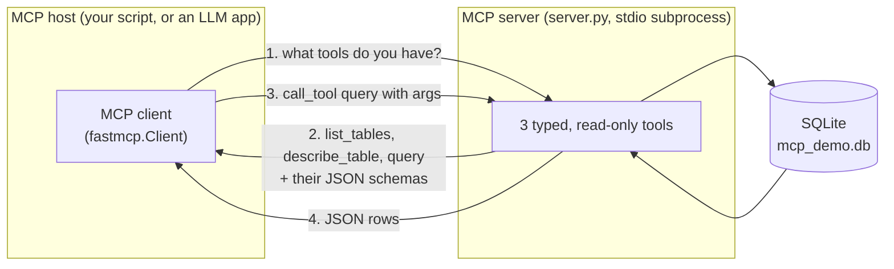
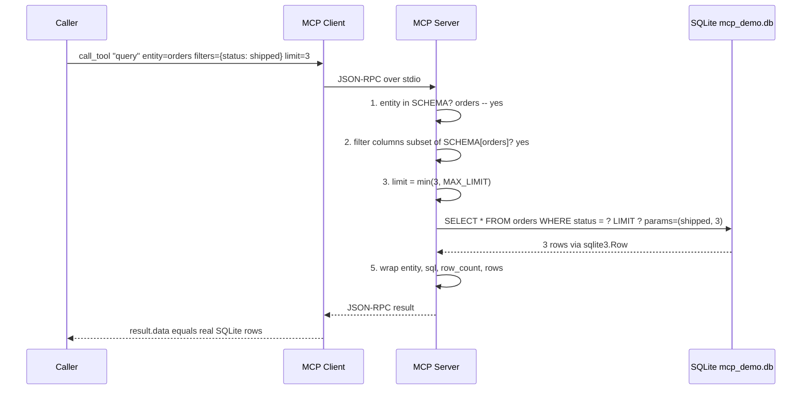
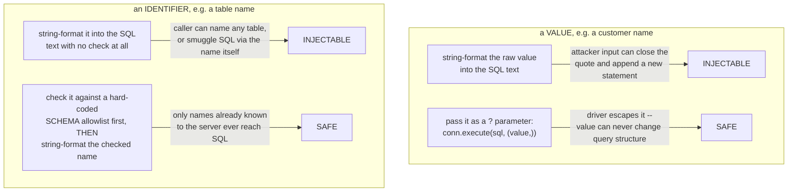
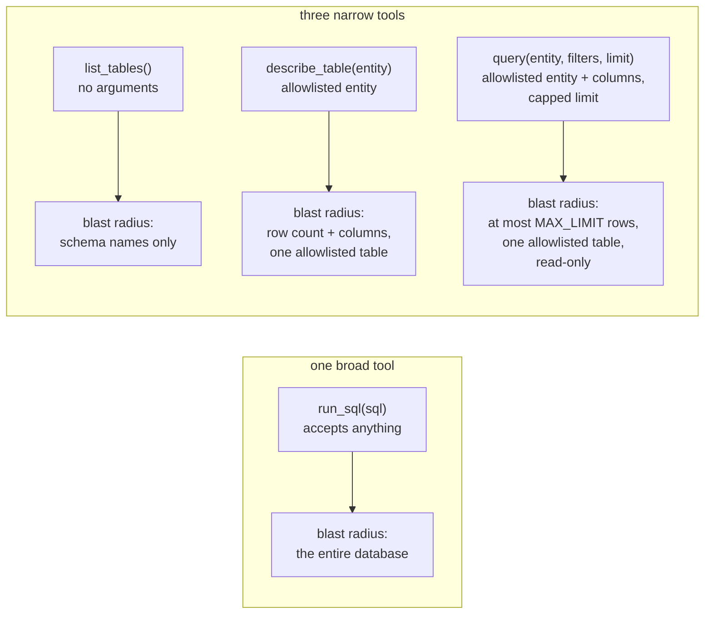

# MCP — A Database Query Layer as a Tool Server

*Agentic Engineering · Worked Examples · SPEC-AGENT-2*

## The demo that should scare you

Picture the fastest way to let an LLM answer "which of our customers in Bulgaria have a shipped
order over $50?" You hand it a live database connection string and a system prompt that says
"write whatever SQL you need." Five minutes of work, and it genuinely answers the question.

Now picture the same setup facing a *different* input — one a user typed, not you: a customer name
field containing `Ana'; DROP TABLE orders; --`. The model is a text generator, not a firewall. It
has no built-in notion of "this is data to filter on" versus "this is a second SQL statement to
execute" unless something in the pipeline draws that line for it. Nothing in "give the model a
connection and let it write SQL" does. This is not a hypothetical — early "AI agent" demos really
did wire an LLM straight to a database — and it means a malicious prompt, or even the model simply
hallucinating a plausible-looking but destructive query, can read, corrupt, or drop anything the
connection string can reach.

You would never accept that shape of risk from a *human* caller. If a code review handed you a
`@RestController` where one `@PostMapping` took a raw SQL string from the request body and executed
it verbatim, you would reject it on sight — no schema to reject a malformed request, no
least-privilege boundary to stop a `DROP TABLE`, no typed contract a test could check. The fix is
not "trust the caller more." It is a narrow, typed service interface in front of the database — and
that fix works just as well when the caller is a model, it just needs a protocol the model can
*discover at run time*, instead of code a person writes once at compile time.

**That protocol is MCP** (the Model Context Protocol), and this chapter builds the narrow service
behind it: a real MCP server, running locally, exposing a seeded SQLite database as three typed,
read-only tools — no `run_sql` tool anywhere in sight. It then drives that server two ways: a plain
Python test client with no LLM involved at all, and an (optional, key-gated) LLM client that
discovers the tools itself and decides which one to call.

One sentence to keep, the kind you could repeat at dinner: **give the model a menu of safe, named
actions — never a live connection and the freedom to write its own SQL.**

If you have ever written a `@RestController` with a handful of narrow endpoints instead of handing
a caller a raw JDBC `Connection`, you already understand the shape of the decision this chapter is
about — just retargeted at a caller that is a language model instead of a browser or another
service.

## 1. What & why — MCP as a typed tool boundary

**Plain-language glosses, before anything else:**

| Term | Plain meaning |
|---|---|
| **MCP** (Model Context Protocol) | An open standard for how an AI application asks an external program "what can you do for me, and how do I ask?" — a USB-C port for AI applications: one standard connector instead of a bespoke integration per tool ([source: MCP docs, "What is MCP?"](https://modelcontextprotocol.io/introduction), checked 2026-09-03). |
| **Tool** | One named, typed action a server offers — the MCP equivalent of a single `@PostMapping` endpoint or one method on a narrow service interface. |
| **Schema** | The typed shape of a tool's input — what a Jackson-annotated DTO is to a REST endpoint, generated here straight from Python type hints. |
| **Parameterised query** | A SQL statement where *values* travel separately from the query text (`?` placeholders), so a value can never change the query's structure. |
| **Least privilege** | Give a caller — human, service, or model — exactly the access its job requires, and no more. |

**MCP follows a client-server architecture.** An MCP *host* (the AI application — Claude Desktop,
an IDE, or, in this chapter, a small Python script) creates one MCP *client* per server it talks to;
each client holds a dedicated connection to one MCP *server*, the program that does the actual work
and answers with data
([source: MCP docs, "Architecture overview"](https://modelcontextprotocol.io/docs/learn/architecture),
checked 2026-09-03). This chapter's server runs locally over stdio, so there is exactly one client,
one server, and no network hop at all:



**MCP is a specification for that typed boundary.** A server declares a small set of *tools* — each
with a name, a description, and a typed input schema (JSON Schema, generated here from Python type
hints) — and a client connects, asks "what tools do you have?", and calls one by name with
arguments that must match its schema. The server is the only thing that ever touches the database;
the model only ever sees the tool names, their schemas, and whatever JSON the tool chooses to
return. That is the direct fix for the cold open above: an LLM that only ever sees
`query(entity, filters, limit)` cannot send `DROP TABLE` no matter what text it produces, because
there is no path from "text the model generated" to "SQL that runs" that skips the tool's own
validation.

**The Java analogy that holds up:** an MCP server is structurally the same idea as a `@RestController`
with a handful of narrow `@PostMapping` endpoints and DTOs, or a `.proto` file's `service` block —
a fixed, typed, discoverable contract standing in front of a resource you do not want to expose
directly. What is genuinely new is *who the client is*: for a REST endpoint, a person writes the
calling code once, at compile time. For an MCP tool, the calling code can be an LLM, at *run* time —
it reads the tool's JSON Schema the way your IDE reads a method signature, and decides on its own,
per request, which tool to call and with what arguments. The server-side discipline (validate at the
boundary, expose the minimum, never trust the caller) does not change; the caller does.

This chapter's server, `server.py`, exposes exactly three tools over a two-table SQLite database:

| Tool | Purpose | Mutates data? |
|---|---|---|
| `list_tables()` | Discover which entities exist and their columns | No |
| `describe_table(entity)` | Row count + columns for one entity | No |
| `query(entity, filters=None, limit=20)` | Filtered rows from one entity | No |

Section 3 grounds the FastMCP API this is built on
([NOTE-AGENT-3-fastmcp.md](../../research/NOTE-AGENT-3-fastmcp.md)); Section 6 works through what
each of these design choices — the allowlist, the read-only surface, the `limit` cap — is actually
defending against.

The rest of this chapter is a discovery walk, one step at a time: **seed a real database → expose
it as three narrow, typed tools → prove a plain Python client can call them and get real rows back,
with no LLM anywhere in the loop → only then wire an LLM in, gated behind an API key.** Each section
below is one of those steps.

## 2. The database — a seeded, deterministic SQLite file

**Step 1 of the discovery walk: seed something real to query.** The example domain is deliberately
small and boring: two tables, five customers, eight orders, so
every number in this chapter is reproducible and every row printed later can be checked by eye.
`seed.py` drops and recreates both tables on every run, so re-running it always produces the exact
same database:

```python
CUSTOMERS = [
    (1, "Ana Petrova", "ana.petrova@example.com", "BG"),
    (2, "Marco Rossi", "marco.rossi@example.com", "IT"),
    (3, "Yuki Tanaka", "yuki.tanaka@example.com", "JP"),
    (4, "Lena Novak", "lena.novak@example.com", "CZ"),
    (5, "Sam O'Brien", "sam.obrien@example.com", "IE"),
]

ORDERS = [
    (1, 1, "USB-C Hub", 29.99, "shipped"),
    (2, 1, "Mechanical Keyboard", 89.00, "shipped"),
    (3, 2, "Espresso Machine", 249.50, "pending"),
    (4, 3, "Standing Desk", 410.00, "shipped"),
    (5, 3, "Monitor Arm", 65.20, "cancelled"),
    (6, 4, "Noise-Cancelling Headphones", 199.99, "pending"),
    (7, 5, "Webcam", 74.99, "shipped"),
    (8, 2, "Office Chair", 320.00, "shipped"),
]
```

```python
def main() -> None:
    conn = sqlite3.connect(DB_PATH)
    try:
        conn.executescript(
            """
            DROP TABLE IF EXISTS orders;
            DROP TABLE IF EXISTS customers;

            CREATE TABLE customers (
                id      INTEGER PRIMARY KEY,
                name    TEXT NOT NULL,
                email   TEXT NOT NULL,
                country TEXT NOT NULL
            );

            CREATE TABLE orders (
                id          INTEGER PRIMARY KEY,
                customer_id INTEGER NOT NULL REFERENCES customers(id),
                item        TEXT NOT NULL,
                amount      REAL NOT NULL,
                status      TEXT NOT NULL
            );
            """
        )
        conn.executemany(
            "INSERT INTO customers (id, name, email, country) VALUES (?, ?, ?, ?)",
            CUSTOMERS,
        )
        conn.executemany(
            "INSERT INTO orders (id, customer_id, item, amount, status) VALUES (?, ?, ?, ?, ?)",
            ORDERS,
        )
        conn.commit()
    finally:
        conn.close()
    print(f"Seeded {DB_PATH.name} with {len(CUSTOMERS)} customers and {len(ORDERS)} orders.")
```

Notice the `INSERT` statements already use `?` placeholders and pass values as a tuple, never
string-formatted into the SQL text — that habit is the entire fix for the injection pitfall in
Section 6, and it starts here, in code that has nothing to do with an LLM at all. Full file:
[code/mcp_db/seed.py](code/mcp_db/seed.py). Run it with the project's dedicated Agentic Engineering
environment (see the box below):

```text
.venv-agent/Scripts/python.exe seed.py
Seeded mcp_demo.db with 5 customers and 8 orders.
```

**Environment for this chapter:**

```text
Python 3.13.7
fastmcp==4.0.1
```

Installed into a separate virtual environment, `.venv-agent`, dedicated to the Agentic Engineering
chapters (heavy, per-subject dependencies live outside the shared `requirements.txt` — see that
file's own comment). FastMCP 4.0.1 is the version verified live against PyPI and the official docs
in [NOTE-AGENT-3-fastmcp.md](../../research/NOTE-AGENT-3-fastmcp.md)
([source: PyPI](https://pypi.org/project/fastmcp/) (checked 2026-09-02)), and reconfirmed installed
in `.venv-agent` while writing this chapter (`pip show fastmcp` → `Version: 4.0.1`). The database
driver is `sqlite3`, Python's standard-library module — no extra dependency, no Docker container, no
server process to run separately from the MCP server itself.

## 3. The FastMCP server — three typed, read-only tools

**Step 2 of the discovery walk: expose the database as narrow, typed tools instead of a raw
connection.** No tool built in this section accepts raw SQL, and every tool checks its inputs
against a hard-coded allowlist before it goes anywhere near the database — the concrete shape
"least privilege" from Section 1's gloss table takes here: the smallest surface that still answers
every question Section 4's client (and, later, an LLM) needs answered.

### 3.1 Declaring a tool

FastMCP's `@mcp.tool()` decorator turns an ordinary, type-hinted Python function into an MCP tool:
it reads the function's parameter type hints to generate the tool's input JSON Schema, and its
docstring becomes the tool's description — the text the model (or a human reading the client's tool
list) sees when deciding whether and how to call it
([source: FastMCP tools docs](https://gofastmcp.com/servers/tools) (checked 2026-09-03), confirmed
in NOTE-AGENT-3). There is no separate schema file to keep in sync with the function signature — the
signature *is* the schema, the same relationship a Java dev gets from a Jackson-annotated DTO record
and the OpenAPI spec generated from it, except here FastMCP generates the schema, you never write it
by hand.

```python
from fastmcp import FastMCP

mcp = FastMCP("Demo")

@mcp.tool()
def add(a: int, b: int) -> int:
    """Add two numbers"""
    return a + b
```

That is the minimal shape (from NOTE-AGENT-3, itself quoting the official docs). This chapter's
server does the same thing three times, against a real database instead of arithmetic.

### 3.2 The allowlist — the mechanism everything else depends on

Before any tool is defined, `server.py` declares exactly which tables and columns exist as far as
this server is concerned:

```python
SCHEMA: dict[str, list[str]] = {
    "customers": ["id", "name", "email", "country"],
    "orders": ["id", "customer_id", "item", "amount", "status"],
}

MAX_LIMIT = 100
```

Every tool below checks a caller-supplied table or column name against `SCHEMA` *before* it goes
anywhere near SQL. This single dict is what makes it safe, a few lines down, to interpolate a table
name into an f-string — something Section 6.1 explains is otherwise exactly the SQL-injection
mistake this chapter is designed to teach you to avoid.

### 3.3 `list_tables()` and `describe_table()` — discovery, read-only, no arguments beyond an entity name

```python
@mcp.tool()
def list_tables() -> dict[str, Any]:
    """List the entities (tables) this server exposes, with their columns.

    Read-only, no arguments. Call this first to discover what can be queried --
    the server exposes nothing beyond this allowlist, so there is no way to
    accidentally (or maliciously) reach a table that isn't listed here.
    """
    return {"entities": SCHEMA}


@mcp.tool()
def describe_table(entity: str) -> dict[str, Any]:
    """Describe one entity: its columns and current row count.

    Args:
        entity: table name. Must be one of the entities returned by list_tables().
    """
    if entity not in SCHEMA:
        return {"error": f"unknown entity '{entity}'. Call list_tables() for the allowed list."}
    conn = _connect()
    try:
        # `entity` is safe to interpolate here only because it was just checked
        # against SCHEMA above -- it can never be arbitrary caller text.
        cur = conn.execute(f"SELECT COUNT(*) FROM {entity}")
        (count,) = cur.fetchone()
    finally:
        conn.close()
    return {"entity": entity, "columns": SCHEMA[entity], "row_count": count}
```

`list_tables()` takes no arguments at all — it exists purely so a caller (human or model) can learn
the server's vocabulary before asking for anything, the same role an OpenAPI/Swagger index page
plays for a REST API. `describe_table` takes exactly one string, and the very first thing it does
with it is reject anything not already in `SCHEMA` — the check happens *before* the `entity` value
is ever placed anywhere near a SQL string.

### 3.4 `query()` — the tool that actually reads data

```python
@mcp.tool()
def query(entity: str, filters: dict[str, Any] | None = None, limit: int = 20) -> dict[str, Any]:
    """Query one entity with optional equality filters. Read-only.

    Args:
        entity: table name. Must be one of the entities returned by list_tables().
        filters: optional {column: value} equality filters. Every column must be
            one of that entity's allowlisted columns (see list_tables()).
        limit: maximum rows to return, capped at 100 so a single call can never
            dump an entire table.
    """
    if entity not in SCHEMA:
        return {"error": f"unknown entity '{entity}'. Call list_tables() for the allowed list."}

    allowed_columns = set(SCHEMA[entity])
    filters = filters or {}
    bad_columns = set(filters) - allowed_columns
    if bad_columns:
        return {"error": f"unknown column(s) {sorted(bad_columns)} for entity '{entity}'"}

    limit = max(1, min(int(limit), MAX_LIMIT))

    # Table and column names below come only from SCHEMA (an allowlist keyed by the
    # already-validated `entity`), never from unvalidated caller text -- that is
    # what makes this f-string safe. Every VALUE, in contrast, goes through a `?`
    # placeholder and is never concatenated into the SQL text.
    sql = f"SELECT * FROM {entity}"
    params: list[Any] = []
    if filters:
        where = " AND ".join(f"{col} = ?" for col in filters)
        sql += f" WHERE {where}"
        params = list(filters.values())
    sql += " LIMIT ?"
    params.append(limit)

    conn = _connect()
    try:
        cur = conn.execute(sql, params)
        rows = [dict(row) for row in cur.fetchall()]
    finally:
        conn.close()
    return {"entity": entity, "sql": sql, "row_count": len(rows), "rows": rows}
```

Walk through what happens to a call like `query(entity="orders", filters={"status": "shipped"},
limit=3)` — this is exactly the request the Section 4 test client makes, and
[artefacts/mcp_query_sequence_diagram.txt](artefacts/mcp_query_sequence_diagram.txt) traces it step
by step:

1. `"orders"` is checked against `SCHEMA` — present, so the call proceeds (LO2).
2. Every key in `filters` (`"status"`) is checked against `SCHEMA["orders"]`'s columns — a caller
   asking to filter on a column that doesn't exist, or one deliberately outside the allowlist, gets
   `{"error": ...}` back and the function returns *before building any SQL at all*.
3. `limit` is clamped into `[1, MAX_LIMIT]` — a caller cannot request `limit=999999999` and force the
   server to materialise an entire table into a response payload.
4. The SQL string is built from two different sources treated two different ways: `entity` and each
   *column name* come only from `SCHEMA` (never from unchecked caller text — that's the allowlist
   doing its job) and are safe to place directly in the f-string; every *value* (`"shipped"`, the
   `limit`) goes through a `?` placeholder and is passed separately to `conn.execute(sql, params)`,
   never concatenated into the string.
5. `sqlite3.Row` turns each result row into something that behaves like a `dict`, so
   `[dict(row) for row in cur.fetchall()]` gives you plain JSON-serialisable dicts back.

The same five steps, drawn as a sequence diagram instead of ASCII art (the committed artefact,
[artefacts/mcp_query_sequence_diagram.txt](artefacts/mcp_query_sequence_diagram.txt), is the plain-text
version of this exact picture):



Request→tool→parameterised SQL→rows, in one picture: the caller never gets closer to the database
than a JSON argument, and the server never lets a name or a value skip validation before it becomes
part of a query.

That distinction in step 4 — *names* are allowlisted, *values* are parameterised — is the one thing
to take away from this section, and Section 6.1 shows exactly what goes wrong if you conflate the
two. Full file: [code/mcp_db/server.py](code/mcp_db/server.py).

### 3.5 Running the server

```python
if __name__ == "__main__":
    # show_banner=False keeps stdout/stderr clean when a client (like test_client.py
    # or llm_client.py) launches this file as a stdio subprocess.
    mcp.run(transport="stdio", show_banner=False)
```

`mcp.run(transport="stdio")` is FastMCP's default: the client launches this file as a subprocess and
talks to it over its stdin/stdout pipes using JSON-RPC — no network port, no separate process to
start by hand, which is exactly why the transcripts in Section 4 show "Starting MCP server" lines
interleaved with the client's own output. The alternative, `mcp.run(transport="http", host=...,
port=...)`, starts a real web server other machines can reach — the right choice once this server
needs to be shared rather than launched per-client, but out of scope here (NOTE-AGENT-3).

## 4. Testing without an LLM — a direct client asserting on real rows

**Step 3 of the discovery walk: prove a plain client can call the tools and get real rows back.**
This is the part of the chapter that runs completely offline, with no API key of any kind, and it is
the part every acceptance criterion for this chapter cares about most: the server and the database
are real, and every row below comes from SQLite, not from a hand-typed fixture (LO3).

```python
from __future__ import annotations

import asyncio
import json
from pathlib import Path

from fastmcp import Client

SERVER_PATH = Path(__file__).parent / "server.py"


async def main() -> None:
    # Passing a Path (not a bare string) selects the stdio transport explicitly --
    # fastmcp 4.0.1 still infers stdio from a plain string but prints a
    # FastMCPDeprecationWarning telling you to do exactly this instead.
    async with Client(SERVER_PATH) as client:
        print("=== list_tables() ===")
        result = await client.call_tool("list_tables", {})
        tables = result.data
        print(json.dumps(tables, indent=2))
        assert "customers" in tables["entities"]
        assert "orders" in tables["entities"]

        print("\n=== describe_table(entity='orders') ===")
        result = await client.call_tool("describe_table", {"entity": "orders"})
        described = result.data
        print(json.dumps(described, indent=2))
        assert described["row_count"] == 8

        print("\n=== query(entity='customers', filters={'country': 'BG'}) ===")
        result = await client.call_tool(
            "query", {"entity": "customers", "filters": {"country": "BG"}}
        )
        customers = result.data
        print(json.dumps(customers, indent=2))
        assert customers["row_count"] == 1
        assert customers["rows"][0]["name"] == "Ana Petrova"
```

`Client(SERVER_PATH)` is FastMCP's client constructor: given a local file path it launches
`server.py` as a stdio subprocess and speaks MCP to it directly — no LLM, no network call, nothing
external at all ([source: FastMCP client docs](https://gofastmcp.com/clients/client) (checked
2026-09-03), confirmed in NOTE-AGENT-3). `async with` is required because the client owns a live
subprocess connection for its duration — closer to Netty's or Vert.x's single-threaded event-loop
model than to Java's `ExecutorService` thread pools: one coroutine, one event loop, no threads, just
cooperative `await` points wherever I/O happens. `call_tool(name, args)` sends one JSON-RPC request
and awaits the matching response; `result.data` is the tool's return value already deserialised back
into Python — the same dict the server function returned.

The full file also probes the two defensive paths from Section 3.4 directly:

```python
# ...continuing inside the same `async with Client(SERVER_PATH) as client:` block
# from the snippet above (this is not a second, separate coroutine):
async def _continued(client):
    print("\n=== query(entity='orders', filters={'status': 'shipped'}, limit=3) ===")
    result = await client.call_tool(
        "query",
        {"entity": "orders", "filters": {"status": "shipped"}, "limit": 3},
    )
    orders = result.data
    print(json.dumps(orders, indent=2))
    assert orders["row_count"] == 3
    assert all(row["status"] == "shipped" for row in orders["rows"])

    print("\n=== query(entity='orders', filters={'dropped_table': 'x'})  [rejected] ===")
    result = await client.call_tool(
        "query", {"entity": "orders", "filters": {"dropped_table": "x"}}
    )
    rejected = result.data
    print(json.dumps(rejected, indent=2))
    assert "error" in rejected
```

That last call asks for a filter on a column, `dropped_table`, that does not exist on `orders` at
all — it is not SQL, it is just a suspicious-looking string in a JSON argument — and the allowlist
check in Section 3.4 rejects it before any SQL is built. Full file:
[code/mcp_db/test_client.py](code/mcp_db/test_client.py).

### Real, captured run

Re-seeded and re-run for this chapter on 2026-09-03 against `.venv-agent`'s `fastmcp==4.0.1`,
Python 3.13.7:

```text
.venv-agent/Scripts/python.exe seed.py
.venv-agent/Scripts/python.exe test_client.py
```

```text
[09/03/26 01:34:52] INFO     Starting MCP server               transport.py:242
                             'db_query_layer' with transport
                             'stdio'
=== list_tables() ===
{
  "entities": {
    "customers": [
      "id",
      "name",
      "email",
      "country"
    ],
    "orders": [
      "id",
      "customer_id",
      "item",
      "amount",
      "status"
    ]
  }
}

=== describe_table(entity='orders') ===
{
  "entity": "orders",
  "columns": [
    "id",
    "customer_id",
    "item",
    "amount",
    "status"
  ],
  "row_count": 8
}

=== query(entity='customers', filters={'country': 'BG'}) ===
{
  "entity": "customers",
  "sql": "SELECT * FROM customers WHERE country = ? LIMIT ?",
  "row_count": 1,
  "rows": [
    {
      "id": 1,
      "name": "Ana Petrova",
      "email": "ana.petrova@example.com",
      "country": "BG"
    }
  ]
}

=== query(entity='orders', filters={'status': 'shipped'}, limit=3) ===
{
  "entity": "orders",
  "sql": "SELECT * FROM orders WHERE status = ? LIMIT ?",
  "row_count": 3,
  "rows": [
    {
      "id": 1,
      "customer_id": 1,
      "item": "USB-C Hub",
      "amount": 29.99,
      "status": "shipped"
    },
    {
      "id": 2,
      "customer_id": 1,
      "item": "Mechanical Keyboard",
      "amount": 89.0,
      "status": "shipped"
    },
    {
      "id": 4,
      "customer_id": 3,
      "item": "Standing Desk",
      "amount": 410.0,
      "status": "shipped"
    }
  ]
}

=== query(entity='orders', filters={'dropped_table': 'x'})  [rejected] ===
{
  "error": "unknown column(s) ['dropped_table'] for entity 'orders'"
}

All assertions passed -- every row above came from the real SQLite
database via the real MCP tool call. No LLM was involved.
```

Every value above — the five column names, the row count of `8`, Ana Petrova's email, the three
shipped orders and their exact amounts — is a real row from `mcp_demo.db`, fetched through a real
MCP tool call, asserted on by the test client, and printed verbatim. Full transcript:
[artefacts/test_client_transcript.txt](artefacts/test_client_transcript.txt). Nothing in this
section was typed by hand into the chapter; it was captured from an actual run and pasted in.

## 5. Wiring an LLM client — key-gated, separate from the runnable path

**Step 4 of the discovery walk: let a model discover and call the same tools, if you choose to.**
Everything so far proves the *server* works without needing a single LLM token. The other half of
MCP's value is that the *same* server, with the *same* tool definitions, is also callable by a model
that has never seen this codebase — it discovers the tools' names, descriptions, and JSON schemas at
connection time and decides for itself which one answers a natural-language question.
`llm_client.py` demonstrates that bridge using Anthropic's Claude and its tool-use (function-calling)
API, and it is **deliberately gated behind an API key** so that running this chapter's core example
never requires one:

```python
async def main() -> None:
    api_key = os.environ.get("ANTHROPIC_API_KEY")
    if not api_key:
        print(
            "ANTHROPIC_API_KEY is not set -- skipping the live LLM call.\n"
            "Set it in .env (never commit it) and set ANTHROPIC_MODEL to a current\n"
            "model id, then re-run to see Claude discover and call the query tool\n"
            "itself. This script makes no network call without a key."
        )
        return
```

With no key set, the script prints that message and returns — no import of the `anthropic` package
is even attempted at that point, and no network call is made. That is not a simplification for the
chapter; it is the actual behaviour, captured for real:

```text
.venv-agent/Scripts/python.exe llm_client.py
```

```text
ANTHROPIC_API_KEY is not set -- skipping the live LLM call.
Set it in .env (never commit it) and set ANTHROPIC_MODEL to a current
model id, then re-run to see Claude discover and call the query tool
itself. This script makes no network call without a key.
```

(Full transcript: [artefacts/llm_client_no_key_transcript.txt](artefacts/llm_client_no_key_transcript.txt).)

Three more gates before any network call happens: `ANTHROPIC_MODEL` must also be set (this chapter
never hard-codes a Claude model id, since those change over time — set it to a current id from
[the Anthropic docs](https://platform.claude.com/docs/en/api/messages) (checked 2026-09-03)); the
`anthropic` package must be installed (it is **not** one of this chapter's pinned, verified
dependencies — only `fastmcp==4.0.1` is, per NOTE-AGENT-3 — install it yourself with
`pip install anthropic` if you want to exercise this path); and only then does the script construct
an `anthropic.Anthropic` client and open the same kind of MCP connection Section 4 used.

If you do set both, here is the whole bridge — the part that turns an MCP tool list into something
Claude's `tools=[...]` parameter understands:

```python
def _mcp_tool_to_anthropic_schema(tool: object) -> dict:
    """Translate one FastMCP tool definition into an Anthropic `tools=[...]` entry."""
    return {
        "name": tool.name,
        "description": tool.description or "",
        "input_schema": tool.input_schema,
    }
```

MCP already describes each tool as `{name, description, input_schema}` — the same three fields
Anthropic's Messages API expects under the same names in its `tools=[...]` parameter (confirmed
2026-09-03 against [platform.claude.com/docs/en/api/messages](https://platform.claude.com/docs/en/api/messages),
which `docs.anthropic.com/en/api/messages` now redirects to) — so the translation is a straight
pass-through here. A different provider's function-calling API would need the same three pieces of
information, just reshaped into its own field names; that reshaping function is the *entire* size of
the adapter MCP saves you from writing per tool, per provider.

The rest of the file is a small loop: ask Claude, execute any `tool_use` blocks it asks for against
the real MCP server, feed the results back as `tool_result` blocks, and repeat until Claude answers
in plain text instead of requesting another tool call:

```python
# ...continuing inside `async with Client(SERVER_PATH) as mcp_client:`, after
# `messages` and `anthropic_tools` have been built (full context in llm_client.py):
async def _drive_tool_loop(client, mcp_client, model, anthropic_tools, messages):
    while True:
        response = client.messages.create(
            model=model,
            max_tokens=1024,
            tools=anthropic_tools,
            messages=messages,
        )
        messages.append({"role": "assistant", "content": response.content})

        tool_uses = [block for block in response.content if block.type == "tool_use"]
        if not tool_uses:
            for block in response.content:
                if block.type == "text":
                    print(block.text)
            break

        tool_results = []
        for call in tool_uses:
            print(f"[Claude called] {call.name}({json.dumps(call.input)})")
            result = await mcp_client.call_tool(call.name, call.input)
            tool_results.append(
                {
                    "type": "tool_result",
                    "tool_use_id": call.id,
                    "content": json.dumps(result.data),
                }
            )
        messages.append({"role": "user", "content": tool_results})
```

This chapter does not paste in a fabricated "Claude called query(entity='orders', ...)" transcript
here — doing so would mean typing out what a live model would say without a live model having said
it, which is exactly the kind of ungrounded claim this project's rules forbid. What you have instead
is stronger: the no-key path above, captured for real, and every line of the bridge itself, which you
can run against your own key to see the live transcript on your own machine. Full file:
[code/mcp_db/llm_client.py](code/mcp_db/llm_client.py).

## 6. Pitfalls — tool design at the boundary (LO4)

### 6.1 SQL injection — and why "parameterise everything" isn't quite the full rule

The vulnerable pattern, almost every SQL-injection example starts here:

```python
name = "'; DROP TABLE users; --"
cursor.execute(f"SELECT * FROM users WHERE name='{name}'")  # SQL injection risk
```

String-formatting a *value* into SQL text lets the value change the query's structure — the
attacker's input closes the quoted string early and appends a second statement. The fix for values
is exactly what Section 2 and Section 3.4 already did throughout: pass them separately, as
parameters, and let the driver's own escaping handle them.

```python
cursor.execute("SELECT * FROM users WHERE name = ?", (name,))
```

`?` is sqlite3's placeholder syntax; the value is never concatenated into the SQL text at all, so
there is no query structure for it to corrupt
([source: NOTE-AGENT-3](../../research/NOTE-AGENT-3-fastmcp.md), citing Python's official sqlite3
docs, checked 2026-09-02).

But "parameterise everything" is only half the rule — values and identifiers (table and column
names) need two *different* defences, and the vulnerable/safe path is different for each:



Here is the detail that trips people up: **table and column names cannot be passed as `?`
parameters** — sqlite3's placeholder syntax is only for values, never for identifiers (NOTE-AGENT-3).
So `query(entity, filters, limit)` in Section 3.4 genuinely does interpolate `entity` and each filter
*column name* into an f-string. That is not a shortcut around the rule; it is the other half of it.
The reason it is safe is that `entity` and every column name are checked against `SCHEMA` — a
hard-coded allowlist the caller cannot extend — *before* they touch the f-string. An attacker (or an
LLM hallucinating a plausible-looking table name) supplying `entity="users; DROP TABLE orders; --"`
never reaches the SQL builder at all: it fails the `entity not in SCHEMA` check on line one and the
function returns `{"error": ...}`. **Values get parameterised. Identifiers get allowlisted. Neither
one substitutes for the other**, and a tool that only does one of the two is still exploitable
through whichever half it skipped.

### 6.2 Over-broad tools — the anti-pattern this server deliberately avoids

Compare the three narrow tools this chapter built against the tool it would have been far less work
to write:

```python
@mcp.tool()
def run_sql(sql: str) -> dict:
    """Run arbitrary SQL against the database."""
    conn = sqlite3.connect(DB_PATH)
    cur = conn.execute(sql)  # whatever the caller sent, verbatim
    return {"rows": cur.fetchall()}
```

This "tool" is one function, works against any query you can imagine, and needs zero allowlist code
— which is precisely the problem. It hands the caller (again: a probabilistic text generator, or
anyone who can get one to misbehave) the same unrestricted SQL surface a raw JDBC connection would.
MCP's tool boundary buys you nothing if a single tool re-opens the whole database behind it. The
discipline is the same one that keeps a REST API's surface reviewable: **narrow, named,
purpose-specific endpoints beat one endpoint that accepts a query language**, because only the
narrow ones are small enough to reason about, test, and allowlist.

### 6.3 Unvalidated inputs and unbounded results

Two smaller instances of the same principle, both already handled in Section 3.4 but worth naming
directly:

- **Unvalidated filter columns.** Without the `bad_columns = set(filters) - allowed_columns` check,
  a caller could request `filters={"customer_id": "1 OR 1=1"}` — the *value* would still be safely
  parameterised (no injection there), but nothing would stop a caller from probing for columns that
  exist but were never meant to be filterable (an internal `is_deleted` flag, say). Validate the
  *set* of allowed inputs, not just the SQL-safety of each one.
- **Unbounded `limit`.** Without `MAX_LIMIT`, a single `query(entity="orders", limit=999999999)`
  call could return the entire table in one response — fine for eight rows, not fine for a table with
  ten million. Capping `limit` server-side (not just documenting a "reasonable" default) is what
  makes "returns a manageable page of rows" a guarantee instead of a suggestion.

### 6.4 Least privilege as the organising principle

Every defence in this chapter is one instance of the same idea: **give the tool exactly the access
its job requires, and no more.** Line up this chapter's three narrow tools against the one-tool
shortcut from Section 6.2 and the difference is a difference in blast radius, not just line count:



No tool in `server.py` can write, update, or delete a row — the
server is read-only by construction, not by convention, because no `INSERT`/`UPDATE`/`DELETE`
statement appears anywhere in the file. No tool can reach a table outside `SCHEMA`. No `query()` call
can filter on a column outside that entity's allowlist, or request an unbounded number of rows. If
this server were extended to write data — the invoice-writing tool a later chapter builds
([SPEC-AGENT-4](../../specs/SPEC-AGENT-4-invoice-agent.md)) — each write tool should be its own
narrow function with its own explicit schema, not a relaxation of `query()`'s read path. A Java dev
would recognise this as the same instinct behind giving a service account the narrowest IAM role
that lets it do its one job, or splitting a `Repository` interface's read and write methods across
separate interfaces — least privilege is not an ML-specific idea, it just matters *more* here because
the caller deciding which tool to invoke, and with what arguments, is a model you do not fully
control.

## 7. Recap & what's next

Back to the cold open: an LLM handed a live connection string could be talked into running
`DROP TABLE orders`. The same LLM, talking MCP to `server.py`, can only ever call three named,
schema-validated, read-only tools — there is no path from "text the model produced" to "SQL that
runs" that skips validation. That gap is what this whole chapter closed.

- **MCP is a typed tool boundary**, not a direct database connection: a server declares narrow,
  named tools with generated JSON schemas; a client — human-written or an LLM — discovers and calls
  them. The Java analogy that holds: a `@RestController`'s fixed set of typed endpoints, except the
  caller can be a model deciding at run time which endpoint to call (LO1, Section 1).
- **`@mcp.tool()`** turns a type-hinted Python function into a discoverable MCP tool; FastMCP
  generates its JSON Schema from the signature and its description from the docstring — verified
  against FastMCP 4.0.1 in NOTE-AGENT-3 and against the live docs on 2026-09-03 (LO1, Section 3).
- **Parameterise values, allowlist identifiers** — the two halves of safe dynamic SQL, and neither
  substitutes for the other. Section 3.4's `query()` does both: `?` placeholders for every value,
  `SCHEMA` membership checks for every table and column name before either is ever placed in a SQL
  string (LO2, Sections 3.4 and 6.1).
- **The server runs, and is tested, with zero LLM involvement.** `test_client.py` calls tools
  directly and asserts on real rows fetched from a real SQLite database — the transcript in Section 4
  is a genuine, freshly captured run, not a hand-typed example (LO3, Section 4).
- **The LLM path is real but optional**, gated behind `ANTHROPIC_API_KEY` and `ANTHROPIC_MODEL`, and
  kept in its own file so the rest of this chapter — and its acceptance criteria — never depend on a
  network call or a billed API request (LO3, Section 5).
- **Tool design is a least-privilege exercise**: narrow, single-purpose, read-only-where-possible
  tools with hard caps (an allowlist of entities/columns, a `MAX_LIMIT` on rows) beat one flexible
  `run_sql`-style tool, for exactly the reason a reviewable REST API beats a single raw-query endpoint
  (LO4, Section 6).

The next Agentic Engineering worked example, RAG over PDFs
([SPEC-AGENT-3](../../specs/SPEC-AGENT-3-rag-over-pdfs.md)), gives an agent a *second* kind of
external capability — semantic retrieval over documents instead of structured rows — using the same
underlying idea of a narrow, typed boundary in front of a resource the model cannot touch directly.
The invoice agent after that ([SPEC-AGENT-4](../../specs/SPEC-AGENT-4-invoice-agent.md)) is where
this chapter's read-only server gets a write-capable sibling, built with the same least-privilege
discipline from Section 6.4.
