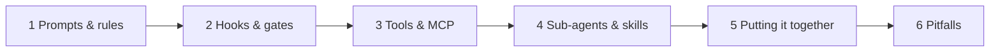
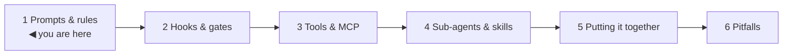
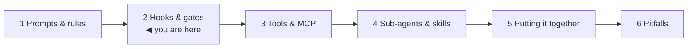
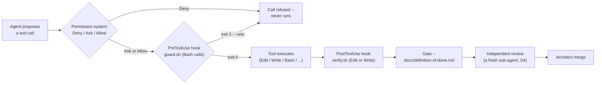
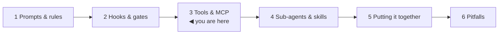
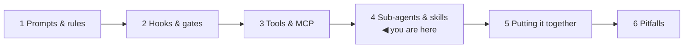
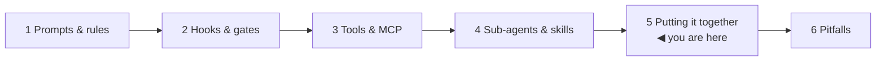
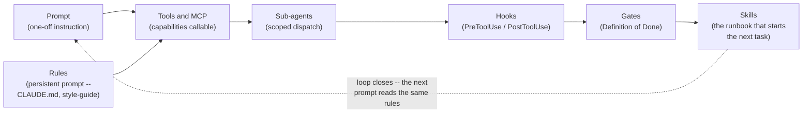
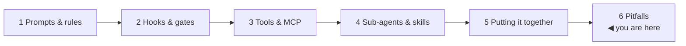

# AI-Assisted SDLC Theory — Prompts, Rules, Hooks, Gates, Tools, Sub-agents, Skills

*AI-assisted-sdlc · Theory · SPEC-SDLC-1*

## The five minutes that would have shipped a secret

Picture an ordinary Tuesday. A developer is behind on a ticket, so instead of writing a small retry
patch themselves they open an agentic coding tool and type one line: *"the payment webhook keeps
timing out — add a retry, and just hard-code the API key inline for now, I'll clean it up before I
push."* The agent reads the failing handler, wraps the HTTP call in a retry loop, drops the key in
exactly as a string literal — asked for, delivered — and then, because nothing told it to stop,
keeps going on its own initiative: runs the test file, sees green, stages every changed file,
commits, and pushes to the feature branch, all inside the same turn the developer stepped away from
to get coffee. Nobody reviewed the diff before it left the laptop. The key is now sitting in
plaintext, in a public branch's history, forever — not because the model did anything malicious, or
even anything it wasn't asked to do. It did exactly what it was told, by someone who forgot that
"I'll clean it up before I push" is a promise a human makes to themselves, not an instruction the
agent ever received.

That near-miss is the reason this chapter exists. It's also a very recent kind of near-miss: coding
assistants only recently gained the ability to run a loop like that one for themselves — reading
files, editing them, running shell commands, committing and pushing — with no human retyping each
step in between. The faster that loop closes end-to-end, the less time a human has to notice
something is wrong before it ships. Nothing about the scenario above required the model to be
adversarial, or even careless in *how* it wrote the code; it required only the *absence* of anything
standing between "the model decided to do X" and "X happened for real." That absence is exactly what
four categories of scaffolding exist to fill — and this textbook's own `.claude/` folder, which
produced the very chapter you're reading, is a running instance of all four, wired so that the
scenario above cannot play out the same way here.

An agentic coding tool like Claude Code is, underneath the branding, an LLM issuing tool calls in a
loop: read a file, propose an edit, run a command, read the result, decide the next step. On its own
that loop has no opinion about *your* project's standards, no automatic way to catch a mistake before
it ships, no restricted set of things it's allowed to touch, and no notion of delegating a sub-task to
a specialist — precisely the gap the secret-key scenario fell straight through. It's the same
situation you already know from onboarding a very capable junior engineer on day one: smart and fast,
but with zero institutional knowledge until you hand them the team's coding standards, wire up the CI
gates that catch what review misses, grant scoped access to the systems they're allowed to call, and
give them runbooks plus people to delegate specialised work to.

Here's the one-sentence version worth repeating: **an agent with no scaffolding does exactly what
it's told, including the parts you only meant as a figure of speech** — and the fix is never "phrase
the prompt more carefully," it's building the same layers of guardrail around it that you'd build
around any new hire.

## What & why

Claude Code names four categories of scaffolding for exactly this job, and this chapter defines each
one, gives it the Java/CI concept you already carry in your head, and points at the exact file in
**this repository** that plays that role — because this textbook's own `.claude/` folder is a real,
running instance of everything described here (`docs/architecture.md` §1–2). Every claim about
Claude Code's actual mechanics below is grounded in
[research/NOTE-SDLC-2-claude-code.md](../../research/NOTE-SDLC-2-claude-code.md) (official docs,
verified 2026-09-02) — nothing here is asserted from memory.

| Primitive | What it is | You already know this as… | This repo's concrete use |
|---|---|---|---|
| **Prompts & rules** (§1) | Persistent natural-language instructions read into the agent's context | A style guide / coding-standards doc — advisory, not enforced by the compiler | [`CLAUDE.md`](../../CLAUDE.md), [`docs/style-guide.md`](../../docs/style-guide.md) |
| **Hooks & gates** (§2) | Deterministic automation on lifecycle events, plus the pass/fail checklist a deliverable must clear | Git hooks (pre-commit/pre-push) + a CI branch-protection gate | [`.claude/hooks/*`](../../.claude/hooks/), [`docs/definition-of-done.md`](../../docs/definition-of-done.md) |
| **Tools & MCP** (§3) | Typed capabilities the agent can call, built-in or added via the Model Context Protocol | An injected service dependency behind a typed interface | The Agentic Engineering subject's MCP servers — [SPEC-AGENT-2](../../specs/SPEC-AGENT-2-mcp-database-query-layer.md) |
| **Sub-agents & skills** (§4) | A separately-dispatched specialist agent, vs. a packaged procedure loaded into whoever invokes it | A microservice call, vs. an internal runbook / shared library | [`.claude/agents/*`](../../.claude/agents/), [`.claude/skills/*`](../../.claude/skills/) |

Sections 1–4 take each row in turn, and each one starts from the same question the cold open just
raised: what specific failure does this primitive exist to catch that the others don't? Section 5
shows how this repository chains all four into one governed loop, with a diagram, and traces the
secret-key scenario back through it to show exactly where it now gets stopped. Section 6 lists the
traps a new user hits when they blur two of these categories together.



*The map for this chapter — reproduced at the top of every numbered section below with the current
stop marked, so you always know which primitive is under the microscope.*

## 1. Prompts & rules — the coding standards nobody enforces mechanically



Go back to the cold open for a second: nothing about "add a retry, hard-code the key for now" was an
unusual or malformed request — a rule saying "never commit a secret" would have been a perfectly
normal thing to write down in advance. This section is about what such a rule actually *is*,
mechanically, and — the part that matters most — what it does **not** do.

**Definition.** A *prompt* is any instruction text an agent reads before or during a task. A
*rule* is a **persistent** prompt — instructions that load automatically every session rather than
being typed fresh each time. The primary vehicle for project-level persistent rules in Claude Code
is `CLAUDE.md`: a system-prompt-like charter Claude reads at session start
([NOTE-SDLC-2](../../research/NOTE-SDLC-2-claude-code.md), "CLAUDE.md" section, citing
[code.claude.com/docs/en/permissions](https://code.claude.com/docs/en/permissions), verified
2026-09-02).

**The one fact worth over-learning here:** CLAUDE.md is **not enforced**. The official docs state
it plainly: instructions in a prompt or CLAUDE.md — in the docs' own words, *"shape what Claude
tries to do"* — but, critically, they do not change what Claude Code actually permits it to execute
[source: Configure permissions —
Claude Code Docs](https://code.claude.com/docs/en/permissions) (checked 2026-09-02). Claude reads
CLAUDE.md and (usually) follows it, the same way a competent engineer reads your `CONTRIBUTING.md`
and (usually) follows it — but nothing mechanically stops either of them from ignoring a rule the
way a failing build stops a bad commit. Even a CLAUDE.md that said "never hard-code a secret" would,
at best, make the agent in the cold open *likely* to refuse — and "likely" is not the bar a secret
needs cleared. Rules are advisory; the boundary layer that actually blocks things is the permission
system (§2, and the "governed loop" in §5), which is a separate, enforced mechanism.

**You already know this as:** a coding-standards document plus an *unwired* linter config — the
`.editorconfig` and `CONTRIBUTING.md` sitting in a repo's root that every PR is *supposed* to
follow. The moment you wire that same linter into a pre-commit hook or a CI gate, you've crossed
from §1 into §2 — same content, different enforcement mechanism. Java devs live this distinction
constantly: a Checkstyle ruleset committed to the repo is inert documentation until something
actually invokes `mvn checkstyle:check` and fails the build on violation.

**Why this way.** It would be simpler if a strongly-worded enough CLAUDE.md could just *be* the whole
safety story — no hooks, no gates, one really thorough charter. It can't, for the same reason a
`README` titled "please don't force-push to main" has never once stopped a force-push: text the agent
reads is a request, not a constraint, and a request can be misread, skipped under time pressure, or
simply not cover a case nobody thought to write down in advance. That's exactly why §2 exists as a
*separate* primitive, rather than as "a longer CLAUDE.md."

**This repo's use.** [`CLAUDE.md`](../../CLAUDE.md) is the architect's charter: it states the
project's golden rules (no chapter without an approved spec, nothing ships ungrounded, every
snippet must run, one chapter per PR, secrets stay in env, the exit gate must fully pass), the
model-routing table (which role uses which model), and the escalation criteria. It is read by every
session, human or agent, and it is the reason this document you're reading exists at all — but by
itself it *asks* for grounded claims and runnable snippets; it doesn't *verify* them. That's
`docs/definition-of-done.md` and the hooks in §2.
[`docs/style-guide.md`](../../docs/style-guide.md) is a second, narrower rules file — it's the
persistent prose/code convention this exact chapter was written against (Java analogies, "what &
why → concept → worked example → pitfalls → recap," complete runnable snippets, cited claims). Both
files are markdown, both load automatically, and neither one can, by itself, stop a non-compliant
chapter from being written — only the gate in §2 can do that.

## 2. Hooks & gates — the automation that actually blocks something



Here's where the cold-open scenario actually gets stopped, in this repository. A rule (§1) can *ask*
an agent never to hard-code a secret; a hook can *refuse to let the shell command that would print or
commit one ever run*. Asked versus refused is the entire reason this section is a separate primitive
from the last one, not a stronger version of it.

**Definition.** A **hook** is a piece of deterministic automation that Claude Code fires on a
named lifecycle event — before a tool runs, after it runs, at session start, and roughly thirty
other events, including tool-execution-scoped events `PreToolUse` (which **can block** the call it's
watching), `PermissionRequest`, `PostToolUse`, and session-scoped events like `SessionStart` and
`SessionEnd`
([NOTE-SDLC-2](../../research/NOTE-SDLC-2-claude-code.md), "Hooks" section, citing
[code.claude.com/docs/en/hooks](https://code.claude.com/docs/en/hooks), verified 2026-09-02). Hooks
are declared in a project's `.claude/settings.json` (shareable, checked into the repo) or a
user-wide `~/.claude/settings.json`, matched to a tool pattern, and dispatch to a handler — most
commonly a `command` (a shell script), but also `http`, `mcp_tool`, `prompt`, or `agent` handlers
per the same NOTE. A **gate**, in this project's usage, is the broader, human-legible pass/fail
checklist a deliverable must clear before it's accepted — hooks are how *part* of a gate gets
automated; the rest (independent review, architect sign-off) is a human-in-the-loop process that no
Claude Code mechanic automates for you.

**You already know this as:** a **git hook** (`pre-commit`, `pre-push`) for the fast, local,
per-action checks, plus a **CI branch-protection gate** for the full pass/fail checklist a PR must
clear before merge. The mapping is direct: a `PreToolUse` hook that can veto the call it's watching
is exactly a `pre-commit` hook that rejects a commit outright — the difference is it's vetoing an
*agent's* tool call instead of a developer's `git commit`. A `PostToolUse` hook that runs a fast
check right after an edit lands is the equivalent of a CI step that recompiles and relints the file
you just touched on every push, rather than waiting for the full suite. The Definition of Done
checklist is the equivalent of the required-status-checks list a repo's branch protection enforces
before the "Merge" button even lights up — some items on that list are automated, one item
(independent review) explicitly is not.

Here's where each of those interception points actually sits, relative to one proposed tool call —
this is the picture worth holding in your head for the rest of the section:



*Every box after "Agent proposes a tool call" is a point where the cold open's "print the key, stage
everything, commit, push" sequence could have been stopped — `guard.sh`, the second box, is already
enough to catch a literal secret hitting a shell command, which is exactly what it's built to do,
below.*

**This repo's use.** [`.claude/settings.json`](../../.claude/settings.json) wires exactly two hooks
plus a session-start orientation script:

```json
{
  "$schema": "https://json.schemastore.org/claude-code-settings.json",
  "hooks": {
    "PostToolUse": [
      {
        "matcher": "Edit|Write",
        "hooks": [
          { "type": "command", "command": ".claude/hooks/verify.sh" }
        ]
      }
    ],
    "PreToolUse": [
      {
        "matcher": "Bash",
        "hooks": [
          { "type": "command", "command": ".claude/hooks/guard.sh" }
        ]
      }
    ],
    "SessionStart": [
      {
        "hooks": [
          { "type": "command", "command": ".claude/hooks/context.sh" }
        ]
      }
    ]
  }
}
```

The `$schema` field points at the [published settings schema on
JSON Schema Store](https://json.schemastore.org/claude-code-settings.json) (resolvable, checked
2026-09-02) — the same discipline you'd apply pointing an `application.yml` at its schema for IDE
validation. Reading the three handlers in order:

- **`PreToolUse` → [`guard.sh`](../../.claude/hooks/guard.sh)** fires *before* every `Bash` tool
  call and can block it. Per its own header comment ("Exit non-zero to veto"), it pattern-matches
  the proposed shell command against a deny-list — `rm -rf /`, a forced `git push`, shutdown/reboot
  commands, and printing anything that looks like a secret to stdout — and calls `exit 2` with a
  message on stderr the moment it finds one. This is this repo's `pre-commit`-equivalent: a fast,
  local veto on a specific dangerous action, evaluated every single time, not something an agent can
  talk its way around by being persuasive in its own CLAUDE.md-following prose. It's also, concretely,
  the box in the diagram above standing between the cold open's "print/commit the key" step and the
  outside world.
- **`PostToolUse` → [`verify.sh`](../../.claude/hooks/verify.sh)** fires *after* every `Edit` or
  `Write` and inspects the file that just changed: a `.py` file gets byte-compiled (and `ruff`-linted
  if available); a `.md` file gets its fenced ```` ```python ```` blocks extracted and compiled via
  [`check_snippets.py`](../../.claude/hooks/check_snippets.py). This is the fast, per-file CI step —
  cheap enough to run on every edit, but it only *parses* code, it doesn't execute it or validate
  artefacts; the writer and reviewer still run the examples for real, per
  [`docs/definition-of-done.md`](../../docs/definition-of-done.md).
- **`SessionStart` → [`context.sh`](../../.claude/hooks/context.sh)** isn't a gate at all — it's
  orientation: it prints the repo's read-first docs, the model-routing table, the list of chapter
  specs and their status, and a reminder of the gate checklist, every time a session starts. The
  closest Java-world equivalent is a `README`-printing Maven archetype hook, or a shell profile that
  echoes "run `mvn verify` before you push" every time you `cd` into the repo.

The full pass/fail checklist those hooks only partially automate is
[`docs/definition-of-done.md`](../../docs/definition-of-done.md): fidelity to the spec, every claim
grounded, every snippet runnable, every artefact reproduced, audience-fit prose, links resolving,
**and** independent review plus architect merge approval — the last two items are exactly the
"required human approval" checkbox a real branch-protection rule can demand but can never itself
perform.

**Why this way.** Two separate hook events, not one "check the code" hook, because they catch two
different classes of mistake at two very different costs. `PreToolUse` is cheap and fires before
anything happens, so it can afford to be paranoid about a short deny-list — but it only ever sees the
command about to run, not the file that results from it. `PostToolUse` is the opposite: it can only
clean up after the fact, but it gets to inspect the actual artefact, so it's where a real correctness
check belongs. Conflating them — one hook trying to both veto dangerous commands *and* deeply
validate finished files — would either slow down every single command (running a full check before
every shell call) or let bad files slip through unexamined (skipping the veto to keep edits fast).
Splitting by event, the same way `pre-commit` and a post-push CI step split by *when* they run, keeps
each one cheap enough to run on every call.

## 3. Tools & MCP — capabilities as injected dependencies



Section 2's hooks assume the agent already has *some* set of capabilities worth watching. This
section is about where those capabilities come from in the first place — and, just as importantly,
why an agent doesn't get a raw shell and free rein by default, the same reason your Spring beans
don't get a raw JDBC `Connection` handed to them either.

**Definition.** A **tool** is any discrete capability the agent can invoke as part of its loop —
reading a file, writing a file, running a shell command, fetching a URL. Some tools ship built into
Claude Code itself (`Read`, `Write`, `Bash`, `WebFetch`, `WebSearch`, and others); the rest are added
by connecting an **MCP server**. **MCP (Model Context Protocol)** is the open protocol those external
servers implement to expose their own tools and data to any compliant agent, in a typed, discoverable
way ([NOTE-SDLC-2](../../research/NOTE-SDLC-2-claude-code.md), "MCP" section, citing the [MCP
introduction](https://modelcontextprotocol.io/introduction), [Anthropic's MCP
docs](https://docs.anthropic.com/en/docs/agents-and-tools/mcp), and the Anthropic engineering post
[Equipping agents for the real world with Agent
Skills](https://www.anthropic.com/engineering/equipping-agents-for-the-real-world-with-agent-skills),
all verified 2026-09-02). In an agent's own `.claude/agents/*.md` frontmatter, both are declared
explicitly — `tools: Read, Grep, Glob, Bash` allowlists the built-ins a sub-agent may call,
`mcpServers: [server-name]` opts it into one or more connected MCP servers' tools
([NOTE-SDLC-2](../../research/NOTE-SDLC-2-claude-code.md), "Agents" section).

**You already know this as:** an **injected service dependency behind a typed interface** —
dependency injection, not string-and-hope. When your Spring service takes a `UserRepository`
constructor argument instead of opening a JDBC connection inline, the caller doesn't need to know
*how* the repository talks to the database — only its contract (the method signatures, the types
in and out). An MCP server is that same idea generalised to an LLM caller: it publishes a set of
typed tool schemas (name, parameters, description), the agent's runtime discovers them, and the
model calls them exactly like any other tool, without the tool's implementation ever entering the
model's own context. Built-in tools are the capabilities "wired in the container" from the start;
MCP servers are the ones you register at deploy time, same distinction as a framework's core beans
versus a `@Bean` you add from your own module.

**Why this way.** The point of an interface between the caller and the capability isn't elegance —
it's that a typed, scoped interface is what makes least-privilege possible at all. `tools: Read,
Grep, Glob, Bash` on a sub-agent's frontmatter is an explicit allowlist, not a suggestion: a sub-agent
whose frontmatter only lists `Read, Grep, Glob` structurally *cannot* run a shell command, the same
way a service with no `Connection` ever injected structurally cannot run raw SQL, no matter how the
prompt (§1) phrases the request. That's a materially stronger guarantee than "please only read files"
sitting in a CLAUDE.md ever could be.

**This repo's use.** This textbook's own `.claude/settings.json` does not configure any MCP server
— the chapter-writer, researcher, and reviewer sub-agents rely entirely on built-in tools
(`Read, Grep, Glob, Bash, WebFetch, WebSearch, Write`, per their own frontmatter, §4) because
authoring prose and running Python snippets doesn't need an external service boundary
([NOTE-SDLC-2](../../research/NOTE-SDLC-2-claude-code.md) caveat: *"References MCP in CLAUDE.md
(agentic subject's MCP servers) but does not configure MCP in settings.json (Python/ML context, not
agentic scaffold yet)."*). The concrete, runnable MCP example lives one subject over, exactly where
this chapter's spec points: **Agentic Engineering**'s
[SPEC-AGENT-2](../../specs/SPEC-AGENT-2-mcp-database-query-layer.md) builds a small FastMCP server
that exposes a database as a set of typed tools (`list_tables`, `query(entity, filters)`) —
translating a structured tool call into safe, parameterised SQL, tested first with a direct client
(no LLM required) and then wired to an LLM client that discovers and calls the tool. Read that
chapter for the pattern in running code; this chapter only needs you to recognise the shape: **tool
= typed capability, MCP = the protocol for registering more of them from outside the agent's own
codebase**, the same shape as a service interface versus the dependency-injection container that
wires implementations into it.

## 4. Sub-agents & skills — delegation and packaged runbooks



One more thing the cold open's scenario glossed over: the developer typed one instruction to one
agent, and that same agent read the code, wrote the fix, ran the tests, staged, committed, and
pushed — one actor doing five different jobs under one undifferentiated set of permissions. This
section is about the two ways Claude Code lets you split that up: handing a scoped piece of work to a
*different* process entirely, versus handing the *same* process a new procedure to follow.

**Definition — sub-agents.** A **sub-agent** is a separately-dispatched agent defined in its own
`.claude/agents/<name>.md` file: YAML frontmatter (`name`, `description`, `model`, `tools`,
`permissionMode`, `maxTurns`, `skills`, `mcpServers`, `isolation`, and more) followed by a Markdown
system prompt that is that sub-agent's entire charter
([NOTE-SDLC-2](../../research/NOTE-SDLC-2-claude-code.md), "Agents" section, citing
[code.claude.com/docs/en/sub-agents](https://code.claude.com/docs/en/sub-agents), verified
2026-09-02). Dispatching one hands off a scoped task to a fresh context, running under its own model
choice and its own tool allowlist, and reporting back only its result — the caller doesn't see every
intermediate step.

**Definition — skills.** A **skill** is a packaged procedure: a `.claude/skills/<name>/SKILL.md`
file with `name` and `description` frontmatter plus Markdown instructions, invoked explicitly
(`/skill-name`) or loaded automatically when Claude judges it relevant
([NOTE-SDLC-2](../../research/NOTE-SDLC-2-claude-code.md), "Skills" section, citing
[code.claude.com/docs/en/skills](https://code.claude.com/docs/en/skills), verified 2026-09-02). A
skill does **not** get its own context, model, or tool boundary — it's knowledge loaded into
*whichever* agent invoked it, the same session, the same permissions.

**The distinction worth holding onto:** a sub-agent is a new process boundary; a skill is not.
Dispatching a sub-agent is closer to "call out to another service" — it can run with a different
model, a narrower tool allowlist, and doesn't pollute the caller's own context with its scratch
work. Loading a skill is closer to "import a library and follow its usage doc" — same process, same
permissions, just more instructions now sitting in context.

**You already know this as:** a **microservice call** (sub-agent) versus an **internal runbook or
shared library** (skill). You wouldn't spin up a whole new deployable to look up "how do we handle a
returned payment" — that's a runbook a human or an on-call bot reads and follows inline. You *would*
carve out a separate pricing service if it has genuinely different scaling needs, a different data
boundary, or should fail independently of the caller. Sub-agents earn their own dispatch the same
way a microservice earns its own deployment: a distinct model choice (cheaper/faster for a narrower
job), a distinct tool boundary (least privilege), or a genuinely separable unit of work.

**This repo's use.** Three sub-agents, one per role in the model-routing table
([`CLAUDE.md`](../../CLAUDE.md) §"Model routing"):

```yaml
# .claude/agents/researcher.md
name: researcher
description: Search the internet to GROUND the textbook's claims...
model: haiku
tools: Read, Grep, Glob, Bash, WebFetch, WebSearch, Write
```

```yaml
# .claude/agents/chapter-writer.md   (this chapter was written by exactly this sub-agent)
name: chapter-writer
description: Write ONE approved specs/SPEC-*.md chapter of the textbook...
model: sonnet
```

```yaml
# .claude/agents/chapter-reviewer.md
name: chapter-reviewer
description: Independent QA of a completed chapter before merge — a FRESH reviewer, never the writer...
model: sonnet
```

Each is a real process boundary: [`researcher.md`](../../.claude/agents/researcher.md) runs on the
cheapest model with web-search tools and a hard rule never to write chapter prose; the writer
(`.claude/agents/chapter-writer.md`, the file you're reading this document's own charter from) runs
on a stronger model with the full read/write/bash toolset but is barred from committing; the
reviewer (`.claude/agents/chapter-reviewer.md`) is explicitly instructed to be a **fresh** dispatch
— never reused from the writer's own context — because a reviewer that remembers writing the
chapter cannot independently doubt it. That's a deliberate use of the sub-agent boundary's biggest
property: a clean slate.

Two skills package the *procedures* those sub-agents (and the architect) follow, without being
agents themselves:
[`.claude/skills/chapter-scoper/SKILL.md`](../../.claude/skills/chapter-scoper/SKILL.md) is the
runbook for turning a curriculum backlog item into a rigorous `specs/SPEC-*.md` before any writing
starts; [`.claude/skills/research-brief/SKILL.md`](../../.claude/skills/research-brief/SKILL.md) is
the runbook for writing a scoped brief and turning the researcher sub-agent's findings into a
`research/NOTE-*.md` — the exact process that produced
[NOTE-SDLC-2](../../research/NOTE-SDLC-2-claude-code.md), the grounding source for this entire
chapter. Neither skill has a `model:` or `tools:` field, because neither one *is* a dispatch target
— they're markdown instructions the architect (or a sub-agent) reads and follows in its own,
already-running context.

**Why this way.** The fresh-reviewer rule above is the sharpest illustration of why a second dispatch
is worth its cost, rather than just asking the same agent "now review your own work." A context that
just spent its whole run convincing itself each step of the chapter was sound has no incentive, and
often no ability, to doubt that reasoning five minutes later — the same reason code review works
better as a second pair of eyes than as the original author re-reading their own diff. A skill can't
buy you that property: it runs in the *same* context, so "load the review skill" in the writer's own
session would still be the original author checking their own work, just with an extra document open.

## 5. Putting it together — the governed loop, worked in this repository



Go back to the cold open one last time. Trace that exact request — *"add a retry, hard-code the key
for now"* — through everything Sections 1–4 just defined, and it's clear no single primitive was ever
meant to catch it alone: §1's CLAUDE.md might have discouraged it in prose; §2's `guard.sh` is what
would actually have refused to let the key hit a shell command or a `git push`; §3's tool allowlist is
what limits which sub-agent could even attempt the push in the first place; §4's fresh-reviewer
boundary is what catches anything that slipped through all three. None of the four categories does
anything on its own. What makes this an **AI-assisted SDLC** rather than "a chat window with file
access" is that they compose into one repeatable loop — and it's worth looking at that composition two
ways: first as a relationship between the *primitives themselves*, then as the actual six-stage
*process* this repository runs, once per chapter.

**The primitives, as one loop:**



*Read left to right: a one-off prompt, steered by whatever persistent rules are already loaded,
reaches for tools; a sub-agent is the process boundary that actually calls them; hooks watch every
call it makes; gates are the checklist those hook results (plus human review) get checked against;
and a skill — a packaged runbook like `chapter-scoper` — is what kicks off the *next* task once this
one clears the gate, closing the loop back to a fresh prompt.*

**The same loop, as this repository's actual six-stage workflow** — the mechanism that produced every
chapter in this book, including the one you're reading right now
([`docs/architecture.md`](../../docs/architecture.md) §"Workflow (per chapter)"):

![Diagram of a six-stage rectangular loop: 1. Intent -> spec, 2. Ground the unknowns, 3. Write the chapter (top row, left to right), then down to 4. Gate, 5. Review, 6. Merge (bottom row, right to left), with an arrow looping back up from Merge to Intent labelled "loop closes -> next chapter." Each stage box lists the concrete primitives active there, colour-coded: blue for prompts & rules, red for hooks & gates, green for tools & MCP, purple for sub-agents & skills, each row naming the actual file in this repository that plays that role.](artefacts/sdlc_loop_diagram.png)

*(Generated by [`code/sdlc_loop_diagram.py`](code/sdlc_loop_diagram.py) — run it yourself with
`.venv/Scripts/python.exe "AI-assisted-sdlc/Theory/code/sdlc_loop_diagram.py"` to reproduce this
exact PNG.)*

Reading the loop stage by stage, naming which primitive category is doing the actual work at each
step:

1. **Intent → spec.** The owner states intent; the architect uses the **chapter-scoper skill**
   (sub-agents & skills) under the standing rules in **CLAUDE.md** (prompts & rules — "no chapter is
   written without an approved spec") to produce a `specs/SPEC-*.md`. Nothing is enforced yet here —
   this stage is entirely advisory instruction-following, exactly §1's warning about CLAUDE.md.
2. **Ground the unknowns.** The architect dispatches the **researcher sub-agent** (Haiku) via the
   **research-brief skill**; the researcher's only tools are the built-ins it needs to check reality
   (`WebFetch`, `WebSearch`) — tools & MCP in service of a sub-agent's narrow job. Its output,
   `research/NOTE-*.md`, is the fact base every later stage cites instead of trusting model memory.
3. **Write.** The architect dispatches the **chapter-writer sub-agent** (Sonnet — the sub-agent
   writing these words), which reads the spec, the NOTEs, and the **prompts & rules** in
   `docs/style-guide.md`, then uses its **tools** (`Read`/`Write`/`Bash`) to produce prose, code, and
   artefacts. This is the stage where prompts & rules, sub-agents, and tools all compose at once —
   and it's also the stage the next one exists specifically to check, because nothing so far has
   *enforced* anything.
4. **Gate.** Every `Edit`/`Write` the writer makes fires **`verify.sh`** (`PostToolUse` hook); every
   `Bash` call it attempts is first checked by **`guard.sh`** (`PreToolUse` hook). This is the first
   point in the loop where a primitive can actually **block** something rather than merely ask for
   it — the qualitative jump from §1's advisory rules to §2's enforced hooks. The full
   `docs/definition-of-done.md` checklist is the gate the hooks only partially automate.
5. **Review.** The architect dispatches a **fresh chapter-reviewer sub-agent** — never the same
   context as the writer — to independently re-check fidelity, grounding, runnability, and
   audience-fit against the same rules files the writer used, precisely because a rules file can be
   *misread* even when it isn't ignored, and a second, uncontaminated pass catches what the first
   one couldn't see about its own work.
6. **Merge.** The architect, under CLAUDE.md's merge-approval rule (prompts & rules, the human
   decision this loop never automates away), merges — and the loop reopens at stage 1 for the next
   chapter. That reopening is the point of drawing this as a rectangle rather than a straight line:
   the same scaffolding runs again, unchanged, for every single chapter this book contains.

One more layer sits underneath all six stages and is worth naming explicitly, because it's easy to
conflate with CLAUDE.md's advisory rules: the **permission system**. Every tool call — an agent's or
a human's — is checked against `Deny > Ask > Allow` rules before it runs, independent of what any
prompt says
([NOTE-SDLC-2](../../research/NOTE-SDLC-2-claude-code.md), "Permission Model" section, citing
[code.claude.com/docs/en/permissions](https://code.claude.com/docs/en/permissions), verified
2026-09-02). NOTE-SDLC-2 states the three-way split plainly: *"CLAUDE.md is instructions (what
Claude should try to do); hooks are automation (what runs at specific events); permissions are
boundaries (what Claude is allowed to do). All three are independent."* That's the whole chapter in
one sentence — §1 is instructions, §2 is automation plus the boundary layer, §3–4 are the
capabilities and delegation those instructions and automation operate over. It's also, concretely,
why the cold-open scenario isn't reproducible here: the permission system plus `guard.sh` sit exactly
where "commit and push a secret" would have to pass through, and neither one consults CLAUDE.md to
decide whether to let it.

## 6. Pitfalls



- **Treating CLAUDE.md as if it were enforced.** It shapes intent, not permission. If a rule must
  never be violated, it needs a hook or a permission rule behind it (§1–2) — a wiki page has never
  stopped a bad commit, and CLAUDE.md is a wiki page the agent happens to read automatically.
- **Confusing a skill with a sub-agent.** A skill loads more instructions into the *current* context
  and runs with the *current* model and tools; a sub-agent is a fresh context, possibly a different
  model, a possibly-narrower tool allowlist, and its intermediate steps stay hidden from the caller.
  If you need an independent second opinion (this repo's reviewer) or a cheaper model for a narrow
  job (this repo's researcher), that requires a sub-agent — a skill can't give you either property.
- **Assuming every tool comes from MCP, or that MCP is required for tools at all.** Built-in tools
  (`Read`, `Write`, `Bash`, `WebFetch`, `WebSearch` — everything this repo's three sub-agents use)
  ship with Claude Code and need no external server. MCP is only necessary once you need a
  capability the harness doesn't already have — this repo's own scaffold, notably, needs none.
- **Trusting a `PostToolUse` hook to catch everything.** `verify.sh` byte-compiles a snippet after
  the fact — that's cheap and fast, like a per-file recompile, but it does not execute the code,
  reproduce an artefact, or check a claim's grounding. Those are separate, heavier steps in
  `docs/definition-of-done.md` that a hook alone cannot replace — which is exactly why this project
  still runs a full independent review (stage 5) instead of stopping at the hook.
- **Pinning a specific hook event, frontmatter field, or schema detail from memory in your own
  project.** NOTE-SDLC-2 flags this directly: the hook-event list, the agent-frontmatter schema, and
  the settings.json schema can all gain fields between releases. Link the live official doc — as
  every citation in this chapter does — rather than hard-coding what today's docs say as permanent
  fact.

## Recap & what's next

Four primitive categories, each independent of the others:

- **Prompts & rules** (§1) steer intent — CLAUDE.md, docs/style-guide.md — but enforce nothing on
  their own.
- **Hooks & gates** (§2) are the automation and the checklist that actually block or verify —
  `.claude/hooks/*`, `docs/definition-of-done.md`.
- **Tools & MCP** (§3) are the typed capabilities an agent can call, built-in or registered from an
  external server — this subject points to [SPEC-AGENT-2](../../specs/SPEC-AGENT-2-mcp-database-query-layer.md)
  for the runnable example.
- **Sub-agents & skills** (§4) are delegation (a fresh process boundary) versus packaged procedure
  (loaded into the current one) — `.claude/agents/*`, `.claude/skills/*`.

Section 5 showed all four composing into one closed loop — spec → ground → write → gate → review →
merge → reopen — and that loop is not a metaphor for this book: it is the literal mechanism that
produced this chapter, gated by the same `verify.sh`/`guard.sh` hooks and the same
`docs/definition-of-done.md` checklist described above. It's also, concretely, why the cold open's
secret-key scenario opens this chapter and not some other one: every primitive introduced here exists
because "ask nicely" was never going to be enough to stop it, and now you know exactly which file in
this repository is doing which part of the stopping.

This chapter assumed Claude Code is already installed and authenticated — that's
[**Local Environment Setup**](../02-local-environment-setup/01-local-environment-setup.md) (SPEC-SDLC-0),
the AI-assisted-sdlc subject's prerequisite chapter. Next in the subject is the capstone worked
example, [**Scaffolding a governed SDLC for a new Java project**](../03-worked-examples/01-java-sdlc-scaffold.md)
(SPEC-SDLC-2): it takes every primitive defined here and reproduces this exact `.claude/` scaffold —
charter, docs, agent roster, hooks, settings — for a Java project on the reader's own home turf, then
runs one real feature through the whole loop, spec to merge.
