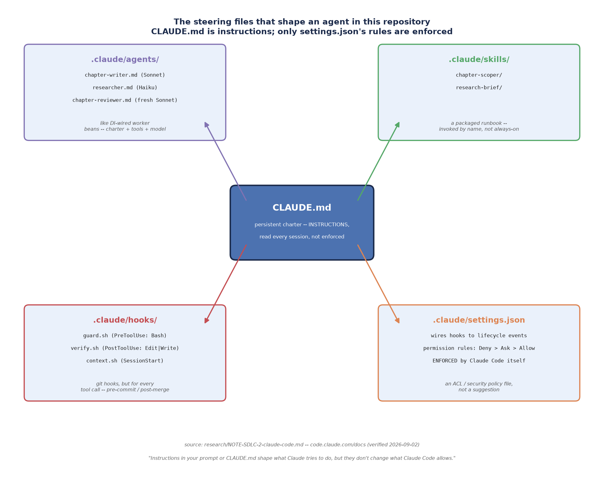

# Local Environment Setup (AI-assisted SDLC)

*AI-assisted SDLC · Local Environment Setup · SPEC-SDLC-0*

Every other chapter in this subject assumes two things are already on your machine: a Java project
you can build and test with a single command, and Claude Code pointed at it. This chapter builds
both, on ground you already own — you have run `mvn test` a thousand times; the new piece is putting
an agent in the loop next to it. By the end you will have a tiny Maven project that compiles and
tests cleanly, Claude Code installed and authenticated, a first task run against that project, and a
map of the files (`CLAUDE.md`, `.claude/`) that steer what the agent does — the same files this
repository itself uses to write its own chapters.

## 1. What & why — AI-assisted SDLC on ground you already own

"AI-assisted SDLC" sounds like it needs a new toolchain. It doesn't. Claude Code is a CLI tool that
sits next to `javac`, `mvn`, and `git` — it reads your project, edits files, runs shell commands
(`mvn test` included), and stops to ask before anything risky, the same posture a careful teammate
would take on their first day. The reason this chapter starts with a **plain Java project, no agent
involved yet**, is to separate two concerns that are easy to tangle together the first time:

1. Does the *project* build and test correctly, independent of any agent? (Section 2 — familiar Java
   ground.)
2. Once it does, what does putting an agent in front of it change? (Sections 3–5 — new ground.)

Keeping these separate matters because when something goes wrong later — a test fails, a build
breaks — you want to know immediately whether it's a Java problem (debug it the way you always have)
or an agent-interaction problem (a permission you denied, a misunderstood instruction). Section 2
gives you a project you've *personally verified* builds clean, so any surprise after that point is
scoped to Sections 3 onward.

## 2. A JDK, Maven, and a starter project

### 2.1 Install a JDK

Install **JDK 25** — the current LTS (Long-Term Support) release, shipped September 2025 and
supported (No-Fee Terms and Conditions) until September 2028. Oracle's support roadmap lists JDK 25
as the current recommended LTS alongside the still-supported 21, 17, 11, and 8, with a one-year
overlap window (through September 2026) for teams migrating off JDK 21
([source: Oracle Java SE Support Roadmap](https://www.oracle.com/java/technologies/java-se-support-roadmap.html),
checked 2026-09-02 — research/NOTE-SDLC-1-java-toolchain.md). Download a native installer from
[Oracle Java SE Downloads](https://www.oracle.com/java/technologies/downloads/), or install via your
platform's package manager (Homebrew on macOS, `apt`/`yum` on Linux). If you're on JDK 21 today,
NOTE-SDLC-1's caveat applies: the 21→25 migration is straightforward, but pin the version explicitly
(`JAVA_HOME`, or a Maven toolchain) if anything in your existing work still targets 21.

Confirm the install:

```bash
java -version
```

### 2.2 Install Maven (or Gradle)

This course uses **Maven 3.9.16**, the current recommended release, which needs JDK 8+ to run its
own tooling (your project can still target a newer release — see 2.3) — quoting Apache's own
download page: "Apache Maven 3.9.16 is the latest release and is recommended for all users"
([source: Apache Maven Download](https://maven.apache.org/download.cgi), checked 2026-09-02 —
NOTE-SDLC-1). Install it from that page, or via your package manager, then confirm:

```bash
mvn -version
```

**If you'd rather use Gradle:** **Gradle 9.7.1** is the current stable release
([source: Gradle Releases](https://gradle.org/releases/), checked 2026-09-02 — NOTE-SDLC-1). Both
tools are equally valid for everything this course does; Maven's XML-and-convention style tends to
feel more familiar coming from an enterprise Java background, Gradle's Groovy/Kotlin DSL is more
concise. Pick whichever matches your team's existing projects. This chapter builds the Maven path;
where the commands differ, the Gradle equivalent is called out alongside.

### 2.3 Scaffold a project

The conventional way to start a Maven project is `mvn archetype:generate`, which asks a series of
interactive questions and generates a `pom.xml` plus a demo `App.java`/`AppTest.java` pair:

```bash
mvn archetype:generate -DgroupId=com.example -DartifactId=hello-java
```

(The Gradle equivalent is `gradle init --type java-application --dsl groovy --test-framework junit`
— see the [Build Init Plugin docs](https://docs.gradle.org/current/userguide/build_init_plugin.html),
checked 2026-09-02 — NOTE-SDLC-1.)

The archetype generates more boilerplate than a teaching example needs, so this chapter's project —
committed at [`code/hello-java/`](code/hello-java/) — is hand-written to the same structure, trimmed
to exactly one class and one test. Everything below is the *actual, complete* content of those three
files; nothing is elided.

**`pom.xml`** — the dependency and build declaration, Maven's equivalent of a `package.json` or a
Gradle `build.gradle`:

```xml
<?xml version="1.0" encoding="UTF-8"?>
<!--
  Minimal Maven project for SPEC-SDLC-0 (Local Environment Setup).

  Versions pinned here are grounded in research/NOTE-SDLC-1-java-toolchain.md (verified against
  Oracle's Java SE Support Roadmap, Apache Maven, and the JUnit 5 release notes, 2026-09-02):
    - maven.compiler.release = 25  (JDK 25 LTS, released Sept 2025 -- current recommended LTS)
    - junit-jupiter            5.14.3
    - maven-surefire-plugin    3.5.6  (stable line; 3.6.0-M1 is a milestone, not used here)

  Build/test with:  mvn clean test
-->
<project xmlns="http://maven.apache.org/POM/4.0.0"
         xmlns:xsi="http://www.w3.org/2001/XMLSchema-instance"
         xsi:schemaLocation="http://maven.apache.org/POM/4.0.0 http://maven.apache.org/xsd/maven-4.0.0.xsd">
  <modelVersion>4.0.0</modelVersion>

  <groupId>com.example</groupId>
  <artifactId>hello-java</artifactId>
  <version>1.0.0</version>
  <packaging>jar</packaging>

  <properties>
    <project.build.sourceEncoding>UTF-8</project.build.sourceEncoding>
    <maven.compiler.release>25</maven.compiler.release>
    <junit.jupiter.version>5.14.3</junit.jupiter.version>
  </properties>

  <dependencies>
    <dependency>
      <groupId>org.junit.jupiter</groupId>
      <artifactId>junit-jupiter</artifactId>
      <version>${junit.jupiter.version}</version>
      <scope>test</scope>
    </dependency>
  </dependencies>

  <build>
    <finalName>hello-java</finalName>
    <plugins>
      <plugin>
        <groupId>org.apache.maven.plugins</groupId>
        <artifactId>maven-surefire-plugin</artifactId>
        <version>3.5.6</version>
      </plugin>
    </plugins>
  </build>
</project>
```

Every version is grounded, not guessed: JUnit 5.14.3 is the current 5.x release — the JUnit team's
own release notes and the `junit-team/junit-framework` GitHub releases page confirm it as the latest
in the 5.x line, with JUnit 6.1.3 existing as a separate, breaking-change major version this course
deliberately does not adopt yet
([source: JUnit 5 Release Notes](https://docs.junit.org/5.13.4/release-notes/) and
[junit-team/junit-framework releases](https://github.com/junit-team/junit5/releases), both checked
2026-09-02 — NOTE-SDLC-1). Surefire 3.5.6 is pinned rather than the 3.6.0-M1 milestone build, for the same reason
you'd avoid a Maven plugin's `-SNAPSHOT` in a course example: milestones aren't guaranteed stable.

**`src/main/java/com/example/hello/Greeter.java`** — the one class this project exists to build and
test:

```java
package com.example.hello;

/**
 * The one class this starter project exists to build and test.
 *
 * <p>Deliberately small: SPEC-SDLC-0 is not teaching Java (the reader already knows it), it is
 * proving the toolchain -- JDK + Maven + JUnit -- builds and tests something real, end to end,
 * before Claude Code ever touches the project.
 */
public class Greeter {

    /**
     * Builds a welcome message for {@code name}.
     *
     * @param name the person to greet; must not be {@code null} or blank
     * @return a greeting string
     * @throws IllegalArgumentException if {@code name} is {@code null} or blank
     */
    public String greet(String name) {
        if (name == null || name.isBlank()) {
            throw new IllegalArgumentException("name must not be blank");
        }
        return "Hello, " + name.trim() + "! Welcome to AI-assisted Java development.";
    }
}
```

**`src/test/java/com/example/hello/GreeterTest.java`** — one JUnit 5 (Jupiter) test class covering
the happy path, whitespace trimming, and both invalid-input branches:

```java
package com.example.hello;

import org.junit.jupiter.api.DisplayName;
import org.junit.jupiter.api.Test;

import static org.junit.jupiter.api.Assertions.assertEquals;
import static org.junit.jupiter.api.Assertions.assertThrows;

class GreeterTest {

    private final Greeter greeter = new Greeter();

    @Test
    @DisplayName("greets a normal name")
    void greetsByName() {
        assertEquals(
                "Hello, Ada! Welcome to AI-assisted Java development.",
                greeter.greet("Ada"));
    }

    @Test
    @DisplayName("trims surrounding whitespace before greeting")
    void trimsWhitespace() {
        assertEquals(
                "Hello, Grace! Welcome to AI-assisted Java development.",
                greeter.greet("  Grace  "));
    }

    @Test
    @DisplayName("rejects a blank name")
    void rejectsBlankName() {
        IllegalArgumentException ex = assertThrows(
                IllegalArgumentException.class,
                () -> greeter.greet("   "));
        assertEquals("name must not be blank", ex.getMessage());
    }

    @Test
    @DisplayName("rejects a null name")
    void rejectsNullName() {
        assertThrows(IllegalArgumentException.class, () -> greeter.greet(null));
    }
}
```

Nothing here should feel unfamiliar — this is the exact shape of a hundred JUnit test classes you've
already written. That familiarity is the point: the toolchain underneath an AI-assisted workflow is
still just Java.

### 2.4 Build and test it

```bash
mvn clean test
```

(Gradle equivalent: `gradle test`, or `./gradlew test` once you've committed the
[Gradle Wrapper](https://docs.gradle.org/current/userguide/gradle_wrapper.html) — NOTE-SDLC-1
recommends always committing the wrapper jar and properties so teammates don't need Gradle installed
globally to build.)

**Honest sandbox note.** This chapter was written and gated in a sandbox that has a JDK installed —
`java -version` reports **OpenJDK 24.0.1** — but no Maven or Gradle on `PATH`. That combination
matters for a subtle reason worth knowing about before you hit it yourself: JDK 24.0.1 **predates**
JDK 25, and a javac cannot target a `--release` newer than itself. Verifying this directly, in this
sandbox:

```text
$ javac --release 25 -d out Greeter.java
error: release version 25 not supported
```

That is real, captured output from this environment, not a guess — it demonstrates exactly the
failure mode you'd see if `pom.xml`'s `<maven.compiler.release>25</maven.compiler.release>` met a
pre-25 JDK. On your own machine, with **JDK 25** and **Maven 3.9.16** installed as Section 2.1–2.2
describe, `mvn clean test` compiles both source files, runs Surefire against the four `@Test`
methods above, and reports a `BUILD SUCCESS` with `Tests run: 4, Failures: 0, Errors: 0, Skipped: 0`.
That expected shape of output — not fabricated numbers from a run that didn't happen here — is what
you're confirming when you run it yourself; it's also exactly what NOTE-SDLC-1 documents as the
standard Surefire summary format
([source: Maven Surefire Plugin Usage](https://maven.apache.org/surefire/maven-surefire-plugin/usage.html),
checked 2026-09-02).

If your own `mvn -version` reports a JDK older than 25, the fix is Section 2.1, not the `pom.xml` —
lower the pin only as a deliberate, temporary compromise, never silently.

## 3. Install and authenticate Claude Code

### 3.1 What it is

Claude Code is an agentic CLI: it reads your codebase, edits files, and runs commands (`mvn test`
among them) in a loop, stopping to ask permission before anything that changes state or leaves your
machine. It ships as a terminal tool first, with the same engine also available as a VS Code
extension, a JetBrains plugin, a standalone desktop app, and a browser-based session at
`claude.ai/code` — "Each surface connects to the same underlying Claude Code engine, so your repo's
CLAUDE.md files, settings, and MCP servers work across all of them"
([source: Claude Code — Overview](https://code.claude.com/docs/en/overview), checked 2026-09-03).
This chapter uses the terminal CLI; the concepts transfer directly if you later prefer the IDE
extension.

### 3.2 Install it

Claude Code's own docs recommend the **native installer** — it self-updates in the background, no
separate runtime required. The exact command depends on your shell
([source: Claude Code — Advanced setup](https://code.claude.com/docs/en/setup), checked 2026-09-03):

```bash
# macOS, Linux, WSL
curl -fsSL https://claude.ai/install.sh | bash
```

```powershell
# Windows PowerShell
irm https://claude.ai/install.ps1 | iex
```

Homebrew (`brew install --cask claude-code`) and npm
(`npm install -g @anthropic-ai/claude-code`) are also supported, documented as manual-update
alternatives to the self-updating native installer (same source, checked 2026-09-03). Confirm the
install:

```bash
claude --version
```

### 3.3 Authenticate

Start Claude Code from anywhere and it prompts you to log in on first use:

```bash
claude
```

Follow the browser prompt to sign in with a Claude Pro, Max, Team, Enterprise, or Console account —
the free claude.ai plan does not include Claude Code access. If you've set the `ANTHROPIC_API_KEY`
environment variable instead, Claude Code skips the browser flow and asks you to approve the key
directly. Once you're logged in, credentials are stored locally and you won't be asked again; to
switch accounts later, run `/login` inside a session
([source: Claude Code — Quickstart](https://code.claude.com/docs/en/quickstart), checked 2026-09-03
— consistent with research/NOTE-SDLC-2-claude-code.md's authentication findings, checked 2026-09-02).

### 3.4 The surfaces, at a glance

| Surface | What it is | Best for |
|---|---|---|
| **Terminal (CLI)** | The `claude` command, run in any project directory | This chapter; scripting, CI, piping other tools into Claude |
| **VS Code / JetBrains** | An extension/plugin embedding the same engine in your editor | Inline diffs, @-mentions, staying in one window |
| **Desktop app** | A standalone app running Claude Code outside any terminal | Reviewing diffs visually, running several sessions side by side |
| **Web** | A browser session at `claude.ai/code`, no local setup | Kicking off long tasks from a machine without your dev environment |

(Source for all four: Claude Code — Overview, checked 2026-09-03, as cited in 3.1.)

## 4. Point Claude Code at the project, and run a first task

### 4.1 Start a session

From the `hello-java` project directory:

```bash
cd "AI-assisted-sdlc/Local Environment Setup/code/hello-java"
claude
```

Claude Code opens an interactive session scoped to that directory — it can read every file under it
without asking (read access within the working directory doesn't prompt), but nothing outside it. A
good first move, before asking for any change, is to let it explore:

```text
what does this project do?
```

Claude Code reads `pom.xml` and the two Java files and summarises the project back to you — no edits,
nothing to approve, just exploration. This mirrors the official quickstart's own recommended first
step: "Claude Code reads your project files as needed. You don't have to manually add context."
([source: Claude Code — Quickstart](https://code.claude.com/docs/en/quickstart), checked 2026-09-03.)

### 4.2 A first real task

Now ask for a small, concrete change — something with an obvious, checkable outcome, the same way
you'd scope a first ticket for a new hire:

```text
add a farewell(String name) method to Greeter that returns "Goodbye, <name>!",
and a test for it in GreeterTest, following the existing style
```

Here is what happens, structurally, from the official docs' own description of this exact kind of
request: "Claude Code finds the appropriate file and shows you the change. If it asks before making
the change, select **Yes** to approve."
([source: Claude Code — Quickstart](https://code.claude.com/docs/en/quickstart), checked 2026-09-03.)
Concretely, for this task, that means:

1. Claude reads `Greeter.java` and `GreeterTest.java` (no prompt — reads within the working
   directory are unrestricted).
2. It proposes an edit to `Greeter.java` adding `farewell`, and an edit to `GreeterTest.java` adding
   a matching `@Test`. Editing a file **is** a state change, so — unless your session is already in
   an auto-approving mode (4.3) — you see a permission prompt for each edit, showing you the diff
   before it lands.
3. You review the diff and choose **Yes** (approve this one edit), **Yes, and don't ask again**
   (approve edits like this for the rest of the session), or **No** (reject it, optionally with a
   comment explaining why, which Claude reads and adjusts its next attempt around).
4. Once both edits are approved, it very likely runs `mvn test` itself to confirm the new test
   passes — that's a Bash command, which gets its own, separate permission prompt the first time,
   for the same reason: it changes state (compiles code, executes it) even though nothing here is
   destructive.

If you try this yourself, you'll see a live version of the diff-then-approve loop described above;
the shape of it (read freely, ask before writing, ask before running commands) is the point to take
away, more than any single transcript.

### 4.3 The permission model, briefly

Every tool call Claude Code makes — read a file, edit a file, run a shell command — is checked
against a permission system before it executes, and that check is enforced by Claude Code itself,
not by the model choosing to be careful: "Permission rules are enforced by Claude Code, not by the
model. Instructions in your prompt or `CLAUDE.md` shape what Claude tries to do, but they don't
change what Claude Code allows."
([source: Claude Code — Configure permissions](https://code.claude.com/docs/en/permissions), checked
2026-09-03.) Three things worth knowing before your first session:

- **Reads are free, writes and commands ask.** File reads (and read-only Bash commands like `ls`,
  `git status`) don't prompt, within the directory you started in. Editing a file or running a
  non-read-only shell command does — every time, the first time you hit that exact command or file,
  in the default ("Manual") mode.
- **Rules are evaluated deny, then ask, then allow — first match wins.** Quoting the same source
  directly: "Rules are evaluated in order: deny, then ask, then allow. The first match in that order
  determines the outcome, and rule specificity doesn't change the order." A broad deny rule always
  beats a narrower allow rule for the same command.
- **"Yes, and don't ask again" persists a rule, not just for that session.** For a Bash command, that
  choice is saved to `.claude/settings.local.json` at your project root and applies to every future
  session in that repository; a file-edit approval, by contrast, lasts only until the current session
  ends (same source).

This is deliberately the *shallow* end of the permission model — enough to understand what you saw in
4.2 and why. SPEC-SDLC-2 goes deep on authoring permission rules, hooks, and sub-agents deliberately;
this chapter only needs you to recognise the prompt and know what your options mean.

## 5. The steering files — a map for what's coming

Two files/directories do the actual steering of a Claude Code session, and this repository — the one
this chapter's markdown lives in — is a live, working example of both:

- **`CLAUDE.md`** — a persistent charter Claude Code reads at the start of every session. It's
  **instructions**, not enforcement: it shapes what Claude *tries* to do (its role, its rules, its
  escalation criteria) but grants no capability by itself.
- **`.claude/`** — a directory of concrete, mostly-enforced configuration: `agents/` (specialised
  sub-agents with their own charter, tools, and model — this chapter was written by one, see the
  banner your session shows), `skills/` (packaged, invoke-by-name procedures), `hooks/`
  (deterministic automation that runs before/after tool calls), and `settings.json` (the permission
  rules from Section 4.3, actually enforced by Claude Code).

The diagram below draws exactly this repository's own `CLAUDE.md` and `.claude/` contents — the same
files that produced the chapter you're reading:



*Generated by [`code/steering_file_map.py`](code/steering_file_map.py) — matplotlib 3.11.1
(installed and confirmed in this project's `.venv`; version pinned in
research/NOTE-2-package-versions.md, checked 2026-09-02). Regenerate it with:*

```bash
.venv/Scripts/python.exe "AI-assisted-sdlc/Local Environment Setup/code/steering_file_map.py"
```

*writing `artefacts/steering_file_map.png`.*

The one distinction most newcomers trip over — the diagram's own headline — is that **CLAUDE.md is
read but not enforced; `settings.json`'s permission rules are enforced.** You could write "never run
`rm -rf`" in CLAUDE.md, and a well-behaved agent will respect it — but the *guarantee* against it
running comes from a `deny` rule in `settings.json`, not from the prose. This repository practises
what it's showing you: its own `CLAUDE.md` (the architect's charter — golden rules, model routing,
escalation criteria) and `.claude/agents/chapter-writer.md` (the charter for the sub-agent that wrote
*this chapter*) are both instructions; `.claude/settings.json` wiring `guard.sh` to every Bash call
and `verify.sh` to every edit is what's actually enforced. SPEC-SDLC-1 (Theory) defines each of these
primitives properly; this map exists so you can orient once you get there.

## 6. Pitfalls

- **Confusing "JDK is installed" with "the pinned JDK is installed."** Section 2.4's captured
  `javac --release 25` failure is the concrete version of this: having *a* JDK on `PATH` doesn't mean
  it's new enough for a project's `<maven.compiler.release>`. Always check `java -version` against
  what the `pom.xml` actually pins, not just "did the command exist."
- **Approving a Bash permission prompt without reading the command.** The diff-then-approve loop in
  4.2 exists specifically so you see what's about to run before it does — treat it the way you'd
  treat a `git push --force` confirmation, not a rubber stamp. "Yes, and don't ask again" persists a
  rule for every future matching command in that repository (4.3); make sure that's the rule you
  actually meant to create.
- **Expecting CLAUDE.md to block something.** Per Section 5, CLAUDE.md is instructions the agent
  tries to follow, not a boundary Claude Code enforces. If something must never happen — a
  destructive command, an edit to a secrets file — that belongs in a `deny` rule in `settings.json`
  (or a `PreToolUse` hook), not a sentence in CLAUDE.md.
- **Running Claude Code from the wrong directory.** Claude Code's file access is scoped to the
  directory you launched it from (plus anything you explicitly add). Starting it one level up or down
  from the actual project root is a common first-session mix-up — check the working directory Claude
  Code prints when it starts.

## 7. Recap & what's next

- **Section 2** built and (in your own environment, with JDK 25 + Maven installed) tested a minimal,
  fully-grounded Maven project — `pom.xml`, `Greeter.java`, `GreeterTest.java` — proving the Java
  toolchain works before any agent touches it. This sandbox's own honest limitation (JDK 24.0.1
  present, no Maven/Gradle, a real captured `--release 25` failure) is documented rather than
  papered over.
- **Section 3** installed and authenticated Claude Code via the official native installer, and
  surveyed its four surfaces — terminal, IDE, desktop, web — all backed by the same engine.
- **Section 4** pointed a session at the `hello-java` project, ran a first exploratory question and a
  first real edit, and introduced the permission model just deep enough to recognise a prompt and
  know what your options mean: reads are free, writes and commands ask, deny beats ask beats allow.
- **Section 5** mapped the files that will steer every agent interaction from here on —
  `CLAUDE.md` (instructions) and `.claude/` (mostly-enforced configuration) — using this repository's
  own files as the live example.

From here, the curriculum's next stop is **SPEC-SDLC-1 (Theory: Prompts, Rules, Hooks, Gates, Tools,
Sub-agents, Skills)** — it takes every primitive this chapter only pointed at (CLAUDE.md, hooks,
sub-agents, skills, MCP) and defines each one properly, still anchored to this same repository as the
worked example.
