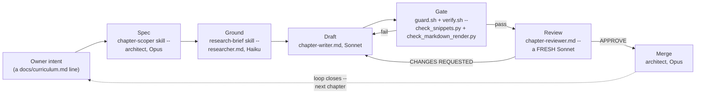

# How this repo was built — a governed multi-agent SDLC, dissected

*AI-assisted-sdlc · Worked Examples · SPEC-SDLC-3*

## You just finished reading the factory's own output

You have, at this point, read [SPEC-SDLC-1 (Theory)](../01-theory/01-theory.md)'s four scaffolding
primitives and watched [SPEC-SDLC-2](01-java-sdlc-scaffold.md) reproduce them for a Java feature. Both
chapters made a quieter claim in passing, easy to skim past: that this book's own `.claude/` folder —
the one sitting in the repository you cloned to read this — is not a diagram of a governed SDLC, it is
one, running for real. This chapter stops gesturing at that claim and makes you check it yourself.

Run this, right now, against the repo you have checked out:

```text
$ git log --oneline -- 02-machine-learning/03-worked-examples/02-natural-language/03-fine-tuning-a-transformer.md
90b1ea0 Add ML-13: Fine-tuning a transformer end to end (new worked-example chapter)
```

One commit, one chapter, a real author, a real timestamp. Every fact this chapter states about *how*
that commit came to exist — which spec authorized it, which grounding note it cites, what its gate
output looked like, where a version number was wrong and got caught — is checkable the same way: by
running a command against your own clone, not by trusting this prose. That is deliberate. A chapter
about "trust the process" that asks you to take the process on faith would be worth nothing. Nothing
below is illustrative or reconstructed; every excerpt is a real file at HEAD or a real command this
chapter's own writer ran while producing it.

Before this chapter has finished, you will have traced one real chapter (this book counts
**45** others alongside it, all discoverable the way the command above just found one) from a one-line
intent through an approved spec, a web-grounded fact-check, a drafted chapter, an automated gate, an
independent review, and a merge — and you will have seen, honestly, the four places that pipeline
needed a human, produced a false alarm, or quietly got something wrong before a later stage caught it.

## 1. The org chart — four roles, one file each

[SPEC-SDLC-1](../01-theory/01-theory.md) named four scaffolding primitives in the abstract — prompts &
rules, hooks & gates, tools & MCP, sub-agents & skills. This repository's own authoring pipeline is
one concrete composition of all four, and every box below names the real file playing that role, per
[`docs/architecture.md`](../../docs/architecture.md) §§1–2 and [`CLAUDE.md`](../../CLAUDE.md) "Model
routing":

| Role | Model | Charter file | Job |
|---|---|---|---|
| **Architect** | Opus 4.8, main session — not a dispatched sub-agent | [`CLAUDE.md`](../../CLAUDE.md) | Scopes chapters into specs, briefs the researcher, dispatches the writer, runs the gate, dispatches a fresh reviewer, merges |
| **Writer** | Sonnet 4.6 | [`.claude/agents/chapter-writer.md`](../../.claude/agents/chapter-writer.md) | Writes exactly ONE approved chapter — prose, runnable code, artefacts — until the gate passes. This chapter was written by exactly this sub-agent, from this exact charter file |
| **Researcher** | Haiku | [`.claude/agents/researcher.md`](../../.claude/agents/researcher.md) | Searches the web to ground a claim, a package version, a dataset licence, an API signature — writes `research/NOTE-*.md`, never chapter prose |
| **Reviewer** | Sonnet, a **fresh** dispatch — never the writer's own context | [`.claude/agents/chapter-reviewer.md`](../../.claude/agents/chapter-reviewer.md) | Independent QA against the spec and the Definition of Done before the architect merges |

Two skills package the *procedures* the architect and researcher follow, without being dispatch
targets themselves:
[`.claude/skills/chapter-scoper/SKILL.md`](../../.claude/skills/chapter-scoper/SKILL.md) turns a
`docs/curriculum.md` backlog line into an approved `specs/SPEC-*.md`;
[`.claude/skills/research-brief/SKILL.md`](../../.claude/skills/research-brief/SKILL.md) turns an
architect's question into a research brief the Haiku researcher can execute, and its findings into a
`research/NOTE-*.md`. Neither has a `model:` field in its frontmatter, because — per SDLC-1 §4 — a
skill is knowledge loaded into whoever invokes it, not a new process boundary.

**Why this split, not "one strong model does everything":** the same reason SDLC-1 §4 gave for a
fresh reviewer applies to every boundary here, and it is worth restating concretely for content work
specifically. Haiku on `researcher.md` is deliberately the *cheapest* model in the roster, because
grounding a package version is "fetch a page, quote a field, record a date" — exactly the kind of
narrow, verifiable lookup that doesn't need a stronger model's judgment, and running it on a cheaper
one means grounding thirty claims doesn't dominate a chapter's cost. Sonnet writes because prose,
runnable code, and Java-analogy judgment calls need more capability than a lookup does. The reviewer
is a **second**, independently-dispatched Sonnet — not the same context reused — because, as SDLC-1
put it, a context that just finished convincing itself a chapter was sound has no fresh angle to find
what it missed; only a clean slate does. None of this is a claim about what Opus, Sonnet, or Haiku can
do in the abstract — it is this repo's own division of labour, stated in
[`CLAUDE.md`](../../CLAUDE.md) "Model routing" and unchanged since the very first commit to this
repository,
[`67729eb`, "Scaffold spec-driven multi-model authoring framework"](https://github.com/b1ck0/ds_ml_ai_starter/commit/67729eba012e641e16c74e82a6cdfb70a55a7b82)
(2026-09-02).

Drawn as one loop — intent in, a merged chapter out, the same loop reopening for the next one:



Section 2 walks one real chapter through every box in that diagram, with the actual file at each
stop.

## 2. One chapter, end to end — ML-13's real trail

Pick the same chapter the cold open's `git log` found: **SPEC-ML-13, "Fine-tuning a transformer —
training a real model end to end."** It has a complete trail — spec, grounding notes, a drafted
chapter, real measured numbers, a gate pass, and a commit — and, as Section 4 will show, it also
contains this chapter's best real example of the pipeline catching its own mistake. One trail, two
jobs; nothing below is staged to make that point, it is simply the chapter that happens to have both.

**Intent → spec.** [`specs/SPEC-ML-13-fine-tuning-a-transformer.md`](../../specs/SPEC-ML-13-fine-tuning-a-transformer.md)
states the gap precisely: every earlier NLP chapter in the book only *ran* a pretrained model; this
one trains one, end to end, on the reader's own machine. Its "Claims to ground" list is explicit about
what must NOT be asserted from memory before writing starts:

```text
- [ ] Package versions to pin: `transformers`, `datasets`, `torch`, `evaluate`, `scikit-learn`,
      `accelerate` (Trainer dependency) — current stable versions on PyPI, with dates.
- [ ] Dataset URL + licence: primary candidate `dair-ai/emotion` (HF Hub) ...
- [ ] API to verify: current `transformers.Trainer` / `TrainingArguments` signature ...
- [ ] Confirm `distilbert-base-uncased` is the right small checkpoint (size, license) or correct it.
```

**Ground the unknowns.** [`research/NOTE-ML-13-transformers-api-and-versions.md`](../../research/NOTE-ML-13-transformers-api-and-versions.md)
answers exactly those four bullets — package versions with PyPI URLs and dates, the `dair-ai/emotion`
dataset's licence terms, the `Trainer`/`TrainingArguments` signatures quoted from HF's own docs, and a
confirmation that `distilbert-base-uncased` is the right checkpoint. It landed in commit
[`273c8e4`, "Add grounding notes for ML-13, ML-14, ML-15, DS-19 (Haiku research)"](https://github.com/b1ck0/ds_ml_ai_starter/commit/273c8e45873f05a0b271233e26da0933fd924a8a) —
one Haiku dispatch, four notes, all before any of those four chapters was drafted. Section 4 covers
this NOTE's other distinction: it is also this repo's clearest recorded case of the grounding step
getting something wrong, and who caught it.

**Write.** The chapter-writer sub-agent produced
[`02-machine-learning/03-worked-examples/02-natural-language/03-fine-tuning-a-transformer.md`](../../02-machine-learning/03-worked-examples/02-natural-language/03-fine-tuning-a-transformer.md),
the runnable
[`code/fine_tune_classifier.py`](../../02-machine-learning/03-worked-examples/02-natural-language/code/fine_tune_classifier.py),
and four artefacts — a training curve, a confusion matrix, and two CSVs — under that chapter's own
`artefacts/`. This is not a toy snippet: it fine-tunes `distilbert-base-uncased` on 5,000 rows of
`dair-ai/emotion` for 3 epochs, on CPU, and the numbers quoted in the chapter are real, measured output
from that run, not estimates — the untrained head (a fresh, randomly-initialized classification layer
on top of the pretrained encoder) scores **3.35% accuracy / 0.0127 macro-F1** on the held-out test
set, because it hasn't learned the label set yet; the same model after fine-tuning scores **92.35%
accuracy / 0.8824 macro-F1**. The full run's wall-clock — 1339.0 seconds, about 22.3 minutes, of which
911.9s is the `Trainer.train()` call itself — is recorded in the chapter's own "Environment note for
the architect," not rounded off for effect.

**Gate.** Every edit to that `.md` file fired [`verify.sh`](../../.claude/hooks/verify.sh)
(`PostToolUse` on `Edit|Write`), which ran
[`check_snippets.py`](../../.claude/hooks/check_snippets.py) (do the fenced Python blocks compile?)
and [`check_markdown_render.py`](../../.claude/hooks/check_markdown_render.py) (will GitHub actually
render this?) — both covered in full in Section 3. Every `Bash` call the writer made — running the
training script, running `py_compile`, running the gate scripts themselves — was first checked by
[`guard.sh`](../../.claude/hooks/guard.sh) (`PreToolUse` on `Bash`).

**Review → merge.** [`docs/definition-of-done.md`](../../docs/definition-of-done.md)'s checklist
requires a fresh-Sonnet review sign-off before merge; the commit itself is the merge event, made by the
architect once the reviewer's verdict came back clean. Reading the actual commit at HEAD — also
[viewable live on GitHub](https://github.com/b1ck0/ds_ml_ai_starter/commit/90b1ea0926988a7127faaa325e9c552d6c7db5df),
since that is where this book is actually read:

```text
$ git show --stat 90b1ea0
commit 90b1ea0926988a7127faaa325e9c552d6c7db5df
Author: Vasil Yordanov <vasil.yordanov88@gmail.com>
Date:   Thu Sep 3 16:12:47 2026 +0300

    Add ML-13: Fine-tuning a transformer end to end (new worked-example chapter)

    Closes the gap that the NLP chapters were inference-only: fine-tunes DistilBERT
    on dair-ai/emotion (6-way) with the explicit PyTorch loop shown once, then the HF
    Trainer. Real measured run (synced into the prose): untrained-head baseline
    0.0335 acc / 0.0127 macro-F1 -> fine-tuned 0.9235 acc / 0.8824 macro-F1 over 3
    epochs (train-slice 0.98 shows an honest overfit gap); ...

    Pinned transformers==5.16.1 (real current; the ML-13 note's 4.41.2 was an
    architect-corrected misread) + datasets==5.0.1 -- documents a real 5.x drift where
    whole-column access returns a Column, not a list. ...

    Co-Authored-By: Claude Opus 4.8 <noreply@anthropic.com>

 .gitignore                                                             |   4 +
 .../02-natural-language/01-text-classification.md                     |  17 +-
 .../02-natural-language/03-fine-tuning-a-transformer.md                | 591 +++++
 .../artefacts/finetune_confusion_matrix.png                           | Bin
 .../artefacts/metrics_summary.csv                                     |   6 +
 .../artefacts/new_sentence_predictions.csv                            |   7 +
 .../artefacts/training_curve.png                                      | Bin
 .../code/fine_tune_classifier.py                                       | 448 +++
 8 files changed, 1066 insertions(+), 7 deletions(-)
```

(Trimmed for width; the untrimmed excerpt, plus this chapter's own real gate output, is committed at
[`artefacts/ml13-trail-excerpt.md`](artefacts/ml13-trail-excerpt.md).) The commit message names its own
correction inline — "the ML-13 note's 4.41.2 was an architect-corrected misread" — which is Section 4's
subject, not a coincidence: an honest trail records the mistake in the same message as the fix.

**Spec → evidence, mapped:**

| Acceptance criterion (SPEC-ML-13) | Evidence |
|---|---|
| AC1 — fine-tunes, evaluates vs. baseline, saves/reloads, infers | `code/fine_tune_classifier.py`; `artefacts/training_curve.png`, `artefacts/finetune_confusion_matrix.png` |
| AC2 — every snippet runs, loss ↓ / accuracy ↑ across epochs | `check_snippets.py` pass; the real run log quoted in the chapter's §4 |
| AC3 — versions/dataset/API grounded | `research/NOTE-ML-13-transformers-api-and-versions.md` (as corrected — Section 4) |
| AC4 — audience-fit, Java analogy for the training loop | the chapter's §4, "`Trainer` just drives it for you, the way Spring Batch drives a configured `Job`" |
| AC5 — renders on GitHub | `check_markdown_render.py` pass, reproduced in Section 3 below |

## 3. The guardrails — what each gate actually checks, and the bug it exists to catch

Four files do the enforcing; everything else in `.claude/` and `docs/` is either advisory (§1's
prompts & rules) or process (independent review). Run these yourself — they are the exact commands
the writer and reviewer ran on this very chapter:

```text
$ python .claude/hooks/check_snippets.py "04-ai-assisted-sdlc/03-worked-examples/02-how-this-repo-was-built.md"
[snippets] OK: all python blocks compiled in 04-ai-assisted-sdlc/03-worked-examples/02-how-this-repo-was-built.md

$ python .claude/hooks/check_markdown_render.py "04-ai-assisted-sdlc/03-worked-examples/02-how-this-repo-was-built.md"
[render] OK: no LaTeX/Mermaid rendering issues in 1 file(s)
```

(This chapter has no fenced ```python blocks — every shell excerpt above is fenced ```text, which
[`check_snippets.py`](../../.claude/hooks/check_snippets.py) skips by design, per its own `SKIP_HINTS`
set — a self-referential nuance worth naming: a chapter *about* the gate is exactly the case where you
must be precise about what the gate does and doesn't check.)

- **[`guard.sh`](../../.claude/hooks/guard.sh)** (`PreToolUse` on every `Bash` call) pattern-matches
  the proposed command against a short deny-list — `rm -rf /`, a forced `git push`, shutdown/reboot
  commands, and, relevant below, **anything that looks like `echo`-ing a secret**:
  ```bash
  printf '%s' "$cmd" | grep -Eiq 'echo[[:space:]].*(SECRET|API_KEY|TOKEN|PASSWORD|SERVICE_ROLE|PRIVATE_KEY)' && \
    deny "printing a secret to stdout"
  ```
  It vetoes by exiting `2` before the shell command ever runs. Section 4 shows this rule firing on
  something that was never a secret.
- **[`verify.sh`](../../.claude/hooks/verify.sh)** (`PostToolUse` on `Edit|Write`) fires after every
  file change: a `.py` file gets byte-compiled; a `.md` file gets both `check_snippets.py` and
  `check_markdown_render.py` run against it, exactly as shown above.
- **[`check_snippets.py`](../../.claude/hooks/check_snippets.py)** extracts every fenced ```python
  block from a chapter and calls Python's own `compile(code, ..., "exec")` on it. This catches a
  syntax error cheaply, cross-platform, in milliseconds — it does **not** execute the code or check
  that a claimed artefact reproduces; that is still a human/writer job per
  [`docs/definition-of-done.md`](../../docs/definition-of-done.md)'s "Runnable" section.
- **[`check_markdown_render.py`](../../.claude/hooks/check_markdown_render.py)** exists because
  `check_snippets.py` only ever sees *Python*, and this book is read on GitHub, which renders LaTeX
  via MathJax and diagrams via Mermaid natively — two whole classes of defect that a Python compiler
  has no opinion about. Section 4 tells this gate's actual origin story. The bug class it targets is
  real and independently documented outside this repo, not invented for this tool: MathJax's TeX
  parser treats `\text{...}` the way LaTeX's `amsmath` package does — plain text, but with
  `_ ^ # % & ~` still reserved as special TeX characters unless escaped — and
  [mathjax/MathJax#1770, "Bug: underscore not handled correctly in `\text{}` macro"](https://github.com/mathjax/MathJax/issues/1770)
  (checked 2026-09-03) is exactly this failure, filed against MathJax itself: an unescaped underscore
  inside `\text{}` does not render as a literal underscore. The general shape of error this produces in
  LaTeX/`amsmath` — "`X` allowed only in math mode" for a math-only construct used where text was
  expected — is a real, documented error family, not this repo's invention
  ([source: "LaTeX Error: \mathrm allowed only in math mode" — Overleaf documentation](https://www.overleaf.com/learn/latex/Errors/LaTeX_Error%3A_%5Cmathrm_allowed_only_in_math_mode),
  checked 2026-09-03), which is the basis for this repo's own convention of citing
  `'_' allowed only in math mode` as the shape of failure a reader hits on GitHub — a formula like
  `$\text{one_hot}$` renders broken, while `$\text{one\_hot}$` renders correctly as $\text{one\_hot}$.
  The tool's own regex, `UNESCAPED_SPECIAL = re.compile(r"(?<!\\)[_^#%&~]")`, matches exactly the
  unescaped case inside any `\text{...}` / `\mathrm{...}` / `\operatorname{...}` run, and nothing else.

The full pass/fail list these four automate only part of is
[`docs/definition-of-done.md`](../../docs/definition-of-done.md). Quoting its "Renders on GitHub"
section verbatim, because it names the exact bug this chapter's own gate output just confirmed clean:

> - [ ] LaTeX + Mermaid render check passes (`.claude/hooks/check_markdown_render.py`): no unescaped
>       `_ ^ # % & ~` inside a `\text{...}` run (MathJax breaks — use `\text{one\_hot}`), no unclosed
>       `$$`/`$` span, no Mermaid with a bad start keyword or an unquoted `(`/`)` in a node label.
> - [ ] Every `$…$` / `$$…$$` formula and every ```mermaid block was eyeballed as rendered (the checker
>       is necessary, not sufficient).

And its process section, which is why this chapter is unmerged prose right now and not yet a commit:

> - [ ] One chapter per PR; PR body maps each acceptance criterion → its evidence (snippet / NOTE / artefact).
> - [ ] Independent review by a **fresh** reviewer (not the writer) — sign-off recorded.
> - [ ] Architect (Opus) merge approval.

## 4. Where it needed a human, and where it broke

This is the section that makes the rest of the chapter worth trusting. A pipeline that only ever
reports clean gates and rubber-stamp reviews would be a marketing page, not a case study — so here are
four real incidents, each checkable the same way as everything above: a fact-check that was wrong and
got caught, a gate born from a real bug report, a hook that just blocked something completely benign
while this very paragraph was being written, and a race condition from running the pipeline on more
than one chapter at once.

### 4.1 A researcher can be confidently wrong — and the architect is the check on that

[`research/NOTE-ML-13-transformers-api-and-versions.md`](../../research/NOTE-ML-13-transformers-api-and-versions.md)'s
original draft pinned `transformers==4.41.2` as "current" — with a PyPI citation, a release date, and
every appearance of having actually been checked. It hadn't been, correctly. The note carries its own
correction, verbatim, at the top of the file:

> **ARCHITECT CORRECTION (2026-09-03):** the original draft of this note misread PyPI and pinned
> `transformers` **4.41.2**, which is a stale major version. The real current stable is
> **`transformers==5.16.1`** (verified against https://pypi.org/pypi/transformers/json, 2026-09-03) —
> the same version grounded for ML-14, so the two adjacent chapters stay consistent.

This is not a hypothetical failure mode this chapter invented for the occasion — it is a real Haiku
research pass that named a stale version with full apparent confidence, caught only because the
architect (or the writer, working from the corrected note — the chapter's own environment note credits
"the ML-13 note's 4.41.2 was an architect-corrected misread") re-checked against PyPI before the number
propagated into a `requirements.txt` a reader would actually install. It is not this repo's only
occurrence of exactly this pattern: [`research/NOTE-DS-19-1-pymc-versions.md`](../../research/NOTE-DS-19-1-pymc-versions.md)
carries a near-identical correction — a drafted `arviz==1.3.0` pin that, per the note's own banner,
"is **not jointly installable**" with the pinned PyMC version, because PyMC 5.28.5's own package
metadata requires `arviz<1.0`. Both corrections were caught the same way: not by a smarter model
refusing to be wrong, but by a **later stage in the loop actually running the thing** — installing the
package, or checking PyPI a second time — rather than trusting the first citation on its face. This is
[`CLAUDE.md`](../../CLAUDE.md) golden rule 2 working as designed ("nothing ships ungrounded ... Package
versions ... verified against the live source, not assumed") — but notice what it actually took: not a
rule that stopped the mistake from being drafted, but a second, independent check that refused to let
the drafted mistake ship unexamined. A rule can ask; only a re-check enforces.

Honest limit: this repo's history does not contain a case where the architect had to stop and escalate
a claim to the human owner as genuinely ungrounded-and-unfixable — [`CLAUDE.md`](../../CLAUDE.md)'s
escalation criteria exist and are stated plainly, but every conflict actually encountered while writing
this book's 45 other chapters was resolved inside the loop itself, the way the transformers version was.
That is a fact about what happened to be hit, not a claim that the escalation path is unnecessary —
name it, rather than implying every difficulty this pipeline hit was self-resolving by nature.

### 4.2 The render lint's origin: a stale screenshot, not a hypothetical

[`check_markdown_render.py`](../../.claude/hooks/check_markdown_render.py) is not this repo's oldest
gate — it was added in commit
[`019e00f`, "Add GitHub-render lint (LaTeX + Mermaid) and rescope QA to require it"](https://github.com/b1ck0/ds_ml_ai_starter/commit/019e00f55c4c86cd4f67a8b27383582684db4b40),
*after* dozens of chapters already existed, because someone looked at a rendered chapter on GitHub and
saw broken math. The commit message records exactly what happened next, and it is not flattering to
the first instinct:

> Snippet-compile checks never saw rendering bugs that break the page on GitHub: an unescaped
> underscore inside a \text{...} run makes MathJax dump raw TeX with '\_ allowed only in math mode',
> and an unquoted paren in a Mermaid node label errors the diagram. New
> .claude/hooks/check_markdown_render.py catches these ... Audit of all 57 chapters: 0 issues (**the
> earlier screenshot was a stale render; HEAD already had `\text{one\_hot}`**).

Read that parenthetical carefully: the bug report that motivated this entire gate turned out, on audit,
to have been a **stale render** — the file at HEAD was already correctly escaped; whatever screenshot
prompted the concern was showing an older version of the page, or a caching artefact, not the actual
committed markdown. The gate got built anyway, and that is the right call, not an overreaction: a false
alarm that happens to be checking a real, previously-undetected failure mode (no earlier tool in this
repo's gate had ever looked at LaTeX or Mermaid rendering specifically) is exactly the kind of alarm
worth acting on even after the specific instance turns out to be a false positive — the *class* of bug
was real and completely unguarded against, even though *this* report of it wasn't.

### 4.3 `guard.sh`, live, blocking something that was never a secret

This is not a reconstruction. While drafting Section 3 of this very chapter, the writer ran this
command to demonstrate `guard.sh`'s deny-list from the inside, choosing deliberately innocuous text
that happens to contain the word the rule watches for:

```text
$ printf '%s' '{"command":"echo \"caching a fresh access token before the retry loop\""}' | bash .claude/hooks/guard.sh
```

It never ran. Claude Code's own harness intercepted it at the `PreToolUse` boundary and surfaced this
back to the session, verbatim:

```text
PreToolUse:Bash hook error: [.claude/hooks/guard.sh]: [guard] BLOCKED: printing a secret to stdout
```

`guard.sh`'s rule is `echo[[:space:]].*(SECRET|API_KEY|TOKEN|PASSWORD|SERVICE_ROLE|PRIVATE_KEY)` —
case-insensitive, and matching **anywhere** after `echo`, not just where an actual secret value would
sit. "caching a fresh access **token** before the retry loop" is a sentence about caching, containing
zero secret material, and the rule vetoed it anyway, for the same reason a Checkstyle rule banning the
literal string `password` would flag a comment that says `// don't log the password field` — the
pattern-matcher has no notion of *intent*, only of *substring*. This is the honest cost of `guard.sh`'s
design, named directly in [SPEC-SDLC-1](../01-theory/01-theory.md#2-hooks--gates--the-automation-that-actually-blocks-something):
a `PreToolUse` veto has to be cheap enough to run before every single shell call, which means it is a
short, blunt deny-list, not a model with judgment. The trade this repo made — a rule that occasionally
blocks a completely benign `echo` about "tokens," versus a rule with no false positives that also
misses a real secret because it required more nuance to write — is the same trade a `pre-commit` regex
grep for `AKIA[0-9A-Z]{16}` makes over a fine-tuned secret-detection model: cheaper, dumber, and
deliberately biased toward refusing too much rather than too little. The fix, when this happens for
real, is not to weaken the rule — it's to rephrase the command (say "a fresh bearer credential" instead
of "token," or write the string to a variable first) the same way you'd work around an overzealous
linter rule you don't control, not disable the linter.

### 4.4 Running many chapters at once: a real git race, caught and one that wasn't

`git log` shows chapters landing minutes — sometimes the *same* minute — apart on 2026-09-03:
`450bbf5` ("Restyle ML-7 CV metrics") and `191b53d` ("Restyle ML-9 text generation") both landed at
12:28; `5726eb5` (ML-6) preceded them at 12:23, `91531f5` (ML-11/ML-12) followed at 12:37. Two
different chapters committed in the same minute is not something one writer working one chapter at a
time start-to-finish produces — it is evidence that more than one writer/reviewer dispatch was in
flight against this repository at overlapping times. Running several agents concurrently against the
same working tree has an obvious hazard: two sub-agents editing a shared file — a subject `README.md`,
the `docs/curriculum.md` backlog — at the same time. This repo hit that hazard for real, twice, in the
ML-13 chapter's own "Environment note for the architect" (not scrubbed from the shipped chapter,
because it's true and instructive):

> `docs/curriculum.md` was intentionally left untouched — the architect is updating it centrally to
> avoid a concurrent-edit clash with other in-flight chapter work. `02-machine-learning/README.md`'s
> Natural Language bullet already lists this chapter (added during writing; landed in the repo via a
> **concurrent commit from other in-flight work** before this chapter's own commit, so no further edit
> was needed).

Two different outcomes from the same underlying hazard, both real: `docs/curriculum.md` was a **known**
shared-write hotspot, so the ML-13 writer's instruction was simply "don't touch it, the architect owns
that edit centrally" — avoidance, decided in advance. `02-machine-learning/README.md` was a race that
actually landed: another in-flight session's commit reached the README first, and by the time the
ML-13 writer got there its own needed edit was already present, so it made none — a race that happened
to resolve harmlessly only because both concurrent writers wanted to make the *same* edit. Had they
wanted different, conflicting edits to the same line, this is exactly the shape of merge conflict that
running many agents at once produces and a single-writer pipeline never can. The honest lesson: this
repo's response was not a locking mechanism or a queue — it was scoping each chapter-writer's
"Boundaries" to *exactly* the files its own spec's "Assets to produce" lists
([`.claude/agents/chapter-writer.md`](../../.claude/agents/chapter-writer.md), "Boundaries"), so a
concurrent collision is at worst on a small, predictable set of shared coordination files
(`README.md`, `docs/curriculum.md`) rather than on the chapter content itself, and even that residual
risk gets absorbed by a human (the architect) making the shared-file edit centrally rather than by
every writer touching it independently.

## 5. Recap — when this pattern earns its cost, and when it's overkill

Four primitives, one governed loop, now proven a third time — once as theory (SDLC-1), once for a
Java feature (SDLC-2), and here, on this book itself, with real commits and two real mistakes caught
before they shipped. The pattern is worth its overhead exactly when three conditions hold together:
the artefact is worth getting right (a shipped chapter a stranger will learn wrong facts from; a
feature real money depends on), the claims involved are checkable against an outside source (a PyPI
version, a licence, a formula — not a subjective judgment call nothing can verify), and the work
repeats enough times that the one-time cost of building specs, hooks, and a reviewer role amortizes —
this repo paid that setup cost once and ran the same loop across 46 chapters now, including this one.

It is overkill for the opposite shape of work: a one-off script you'll run once and throw away, a
change too small to be worth its own spec (SDLC-1's `guard.sh` deny-list is three lines, not a chapter
of scaffolding), or a judgment call no external source can settle, where a second review pass buys
nothing a re-check couldn't already verify. Section 4.3's false positive is the sharpest reminder of
the trade-off in both directions: the same blunt, cheap pattern-match that makes `guard.sh` fast enough
to run before every shell call is exactly what made it wrong about a sentence containing the word
"token." A pipeline this heavy on a task that doesn't need it just adds friction with nothing bought
back.

The transfer back to your own work is the one [SPEC-SDLC-2](01-java-sdlc-scaffold.md) already made
concrete: the settings schema, the agent frontmatter shape, and the permission model port verbatim to
a Java (or any) codebase; what you author yourself is the gate's actual content — `mvn test` plus
Checkstyle/Spotless/SpotBugs there, `check_snippets.py`/`check_markdown_render.py` here — and any
domain-specific rule your own discipline needs that this one didn't (SDLC-2's test-first requirement
has no equivalent in prose-writing; conversely, nothing here needed a render lint until a wrong
screenshot suggested one might be worth having). If you're setting up this pattern on your own
project, [`code/java-project/`](code/java-project/) is still the concrete starting point;
this chapter's job was narrower and now done — showing you the same loop wasn't a diagram, by making
you check it.
