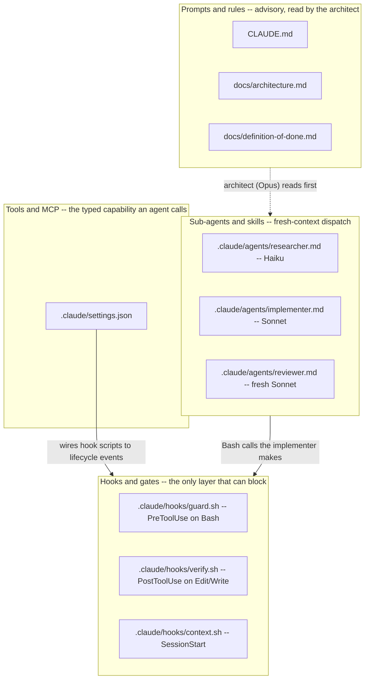
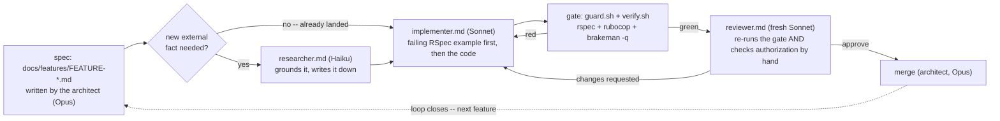

# Governing an AI-Built Rails E-Store — User Login and Checkout Under Gates

*AI-assisted-sdlc · Worked Examples · SPEC-SDLC-4*

## The bug that only requires being logged in as anyone

Ask an agent, with no gates in place, to "let a signed-in user view their past orders," and here is
the fastest path from prompt to a green checkmark: add a route, add an action, look the order up by
the id in the URL, render it. It works the first time you click it — your own order shows up, because
you're testing with your own account. The PR looks done: a controller action, a view, a passing
manual click-through.

```ruby
# app/controllers/checkout/orders_controller.rb — what an ungated agent ships
def show
  @order = Order.find(params[:id])
end
```

Nothing about this line is malformed Ruby, unstyled, or a SQL-injection risk — it will sail through a
linter and a security scanner without a single warning, for reasons this chapter gets to directly.
What it actually does is let *any signed-in user* read *any other user's order* by changing one digit
in the URL: sign in as anyone, visit `/checkout/orders/1`, `/checkout/orders/2`, `/checkout/orders/3`,
and read every customer's order history — names, products, order totals — one increment at a time.
That is not a hypothetical: it is the single most common access-control bug in web applications,
formal enough to have its own name, IDOR (insecure direct object reference), and its own line item in
the [OWASP Top 10](https://owasp.org/Top10/A01_2021-Broken_Access_Control/) (A01:2021 — Broken Access
Control) (checked 2026-09-04). A registration form one `permit()` call away from letting a new
signup set `admin: true` on themselves is the same failure mode wearing a different outfit: the code
runs, the tests (if any exist) are testing the happy path, and the defect is invisible until someone
specifically goes looking for it — usually an attacker, not a code reviewer skimming a diff.

[SPEC-SDLC-2 (the Java scaffold)](01-java-sdlc-scaffold.md) made this same argument for a
`-DskipTests` shortcut on a pure-logic Luhn validator: a hook, not good intentions, is what makes the
shortcut *not run at all*. This chapter raises the stakes on purpose — a different stack (Ruby on
Rails 8.1) and a genuinely security-sensitive app, a small e-store with real login and real checkout
— because login and checkout are exactly the features where an unsupervised AI edit does real
damage, and exactly where "the governance layer makes AI-assisted development safe, not the model's
good intentions" stops being an abstract claim and becomes something you can watch happen, twice,
below.

## 1. What & why — the same four primitives, a higher-stakes stack

[SPEC-SDLC-1 (Theory)](../01-theory/01-theory.md) named four scaffolding primitives an agentic
coding tool needs: **prompts & rules** (`CLAUDE.md` — advisory, read by the architect),
**hooks & gates** (deterministic automation that can actually *block* a bad action),
**tools & MCP** (typed capabilities, here `Bash` running `bundle exec rspec`/`rubocop`/`brakeman`),
and **sub-agents & skills** (fresh-context dispatch: researcher, implementer, fresh reviewer).
[SPEC-SDLC-2](01-java-sdlc-scaffold.md) proved all four port to a Java/Maven codebase unchanged in
shape. This chapter proves the same four port to Ruby/Rails — and adds one thing neither prior
chapter needed: **the gate's content has a threat model.** A textbook chapter's gate asks "does this
compile and render." A Luhn validator's gate asks "does this compile, and did the test fail first."
This app's gate asks those *and* "can a user read another user's data" and "can a user set an
attribute nobody exposed to them" — because this is the first stack in this book with a login form
and a payment integration behind it.

Everything below lives under [`code/rails-estore/`](code/rails-estore/) — a complete Rails project
scaffold with its own `.claude/` governance layer nested inside it, exactly as it would sit in a real
repository. §2–5 tour that scaffold; §6 runs both features — login, then checkout — through the full
loop, including the moment a fresh reviewer catches a real vulnerability that three green automated
gates missed. §7 lists what breaks the loop if you skip a step. §8 is the direct comparison: this
repo's own scaffold, `java-project/`, and `rails-estore/`, side by side.

**Toolchain baseline**, grounded in
[`research/NOTE-SDLC-4-1-versions.md`](../../research/NOTE-SDLC-4-1-versions.md) (checked
2026-09-04): Ruby **4.0.6** ([Ruby 4.0.6 released](https://www.ruby-lang.org/en/news/2026/07/14/ruby-4-0-6-released/),
July 14, 2026), Rails **8.1.3.1** ([Rails 8.0.5 and 8.1.3 released](https://rubyonrails.org/2026/3/24/Rails-Versions-8-0-5-and-8-1-3-have-been-released),
patched to `.1` July 29, 2026), `rspec-rails` **8.0.4**, `rubocop` **1.86.0** + `rubocop-rails`
**2.37.0**, `brakeman` **8.0.6**, `bcrypt` **3.1.22** (includes a CVE-2026-33306 fix), `stripe`
**19.3.0**. Every one of these is pinned by exact version in
[`Gemfile`](code/rails-estore/Gemfile). **This sandbox has no Ruby/Rails toolchain** — §9's
Environment note is explicit about which evidence below is real, captured output, and which is a
grounded reference command you run on a machine that has Ruby and Rails installed.

### The map



Identical shape to [SPEC-SDLC-2's map](01-java-sdlc-scaffold.md#the-map-four-primitives-one-file-each)
— because the settings schema and the agent frontmatter schema genuinely don't know or care what
language the gate checks. §4 is where that stops being true: the *content* of `guard.sh` and
`verify.sh` is where a Rails app's threat model actually shows up.

## 2. The charter + docs — rules, with a security golden rule Java didn't need

[`code/rails-estore/CLAUDE.md`](code/rails-estore/CLAUDE.md) mirrors this repository's own
`CLAUDE.md` and `java-project/CLAUDE.md`'s seven/eight-rule shape, with one rule neither prior
project's charter needed to state:

| This repo (content authoring) | `java-project/` (Java feature) | `rails-estore/` (Rails feature) |
|---|---|---|
| No chapter without an approved `specs/SPEC-*.md` | No code without an approved `docs/features/FEATURE-*.md` | Same |
| Every claim grounded (NOTE or citation) | Every dependency version/API claim grounded | Same, plus: every security/CVE claim |
| Every snippet must run | Every JUnit 5 test must FAIL before the code that satisfies it | Every RSpec example must FAIL before the code that satisfies it |
| *(no equivalent — no auth surface)* | *(no equivalent)* | **Golden rule 4: every `Current.user`-scoped query is authorized; every `permit()` list is minimal** — this repo and `java-project/` have no login or payment surface for this rule to apply to |
| Exit gate: snippet compile + link check + review | Exit gate: `mvn test` + checkstyle + spotless + spotbugs + review | Exit gate: `rspec` + rubocop + `brakeman -q --no-summary` (zero High-confidence warnings) + review |

[`docs/architecture.md`](code/rails-estore/docs/architecture.md) names the same six sections as
both prior scaffolds (operating model, roles, workflow, repository shape, gates, decision log) — its
decision log's second-newest entry records exactly why the Rails 8 *native* auth generator was
chosen over Devise: dependency-light and officially maintained as of Rails 8, sufficient for this
app's scope
[source: NOTE-SDLC-4-2-auth-generator.md]. [`docs/definition-of-done.md`](code/rails-estore/docs/definition-of-done.md)
adds a "Security" section between "Grounded" and "Green gate" that doesn't exist in either prior
project's checklist — authorization, mass assignment, password hashing, and the secret scan are each
their own checkbox with their own required RSpec evidence, not folded into "correctness."

## 3. The agent roster — same three roles, one process addition on the reviewer

[`.claude/agents/researcher.md`](code/rails-estore/.claude/agents/researcher.md) (Haiku) and
[`.claude/agents/implementer.md`](code/rails-estore/.claude/agents/implementer.md) (Sonnet) are
structurally identical to `java-project/`'s — verify a fact/write a note; write a failing test, then
the minimum code, then run the gate. The implementer's process adds one line the Java implementer
didn't need: *"For anything touching authentication, authorization, or mass-assignable params,
default to the MORE restrictive option and let the spec's acceptance criteria justify opening it up
— never the other way round."*

[`.claude/agents/reviewer.md`](code/rails-estore/.claude/agents/reviewer.md) (a fresh Sonnet) is
where the real addition lives. Where `java-project/reviewer.md`'s process is fidelity → test-first →
grounded → green gate → scope, this project's reviewer inserts two explicit, named steps in between:

> 3. **Authorization, by hand, on every controller action touched.** ... confirm the query is
>    actually scoped to the current user (`Current.user.orders.find(...)`, not `Order.find(...)`) —
>    an unscoped `find` on an id from the URL is an IDOR even if every other check passes.
> 4. **Mass assignment, by hand, on every controller action that builds or updates a model from
>    params.** Confirm `permit()` lists ONLY the attributes the feature actually needs, by name.

*Why we do it this way:* a linter and a security scanner both have a fixed catalog of patterns they
check for. Reading `Order.find(params[:id])` and asking "whose order is this allowed to be" is a
judgment call about what the *feature* is supposed to authorize, not a pattern match against a known
CWE — which is exactly why §6's checkout loop shows this line passing RuboCop and Brakeman *both
clean*, and why the reviewer's instructions say "by hand" twice rather than once.

## 4. Hooks + settings — the gate's content is where the stack actually matters

[`.claude/settings.json`](code/rails-estore/.claude/settings.json) is byte-for-byte the same three
events and handler shape as every prior scaffold — validated for real, not just eyeballed, in
[`artefacts/rails-validation-log.md`](artefacts/rails-validation-log.md) §1. The three hook scripts
carry the stack-specific content:

- **[`guard.sh`](code/rails-estore/.claude/hooks/guard.sh)** (`PreToolUse` on `Bash`) keeps every
  deny-rule from this repo's own `guard.sh` (`rm -rf /`, forced push, printing a secret) and adds
  two rules a Java content-authoring project has no use for: it blocks `git commit --no-verify`
  (the Rails-project equivalent of the Java chapter's `-DskipTests` — a way to talk the gate out of
  running at all), and — the flagship new rule — **it blocks any shell command containing a
  live-looking Stripe key** (`sk_live_`/`pk_live_`/`rk_live_`). This is what turns "no real secret
  ever appears in the repo" from a written rule in `CLAUDE.md` into something enforced at the shell
  level, before an agent can even echo a key while debugging, let alone commit one. Real, captured
  proof it fires — five cases, all five correct — is in
  [`artefacts/rails-validation-log.md`](artefacts/rails-validation-log.md) §3.
- **[`verify.sh`](code/rails-estore/.claude/hooks/verify.sh)** (`PostToolUse` on `Edit|Write`) runs
  `bundle exec rspec`, then `rubocop`, then `brakeman -q --no-summary` on any `.rb` edit — the three
  tools §5 grounds as this stack's standard quality/security gate — and `bundle check` on a `Gemfile`
  edit, the same "validate the manifest immediately" pattern `java-project/verify.sh` runs for
  `pom.xml`.
- **[`context.sh`](code/rails-estore/.claude/hooks/context.sh)** (`SessionStart`) prints the same
  orientation banner pattern as both prior projects — read-first docs, the roster, and every
  `docs/features/FEATURE-*.md` with its status. Real output in
  [`artefacts/rails-validation-log.md`](artefacts/rails-validation-log.md) §3.

## 5. Security-first gates, and why each one exists

Four gates, four different failure modes, each named because a real one caught something in this
chapter's own worked example:

**RuboCop** (style/lint) — catches nothing security-specific by default, but `.claude/hooks/verify.sh`
runs it first because it's the fastest signal: a controller action too long to read in one glance
(`Metrics/MethodLength`, capped at 15 lines in
[`.rubocop.yml`](code/rails-estore/.rubocop.yml)) is a controller action too long for a reviewer to
authorize-check by eye, which is exactly the check that matters most on this app.

**RSpec** (`rspec-rails` 8.0.4) — the test-first discipline from `java-project/` ported unchanged:
an example is written and confirmed failing before the code that satisfies it. What's new here is
*what* the examples cover: `spec/requests/registrations_spec.rb` and `spec/requests/checkout_spec.rb`
each carry a security-specific example (mass assignment, IDOR) alongside the functional ones — see
§6.

**Brakeman** (8.0.6) — the standard Rails static security scanner, 86 checks covering SQL injection,
mass assignment, XSS, CSRF, unsafe redirects, and more
[source: NOTE-SDLC-4-3-brakeman-checks.md]. Three worth naming because this chapter's own code
exercises them:
- **Mass assignment** — flags a model built from unpermitted params
  [source: [Brakeman — Mass Assignment](https://brakemanscanner.org/docs/warning_types/mass_assignment/)
  (checked 2026-09-04)]. `RegistrationsController#user_params`'s three-key `permit()` list is why
  this app reports clean.
- **SQL injection** — flags unescaped user input in a raw query (e.g.
  `User.where("email = '#{email}'")`); this app avoids the pattern entirely by using
  ActiveRecord's parameterized finders (`find_by(email_address: ...)`) everywhere.
- **Cross-Site Scripting** — flags unescaped output, most commonly a stray `.html_safe`.
  [`artefacts/rails-validation-log.md`](artefacts/rails-validation-log.md) §4 walks a real example
  of this exact check catching a real early draft of this chapter's own `products/show.html.erb`.

*Why we do it this way:* Brakeman is static analysis — it never runs the app. Its own documentation
is explicit about the boundary that matters most for this chapter: it "will not catch logic errors
(e.g., authorization gaps that require dynamic analysis or test coverage)"
[source: NOTE-SDLC-4-3-brakeman-checks.md, "Caveats"]. §6's checkout loop is built entirely around
that one sentence.

**bcrypt + `has_secure_password`** — the User model's `has_secure_password` call hashes with bcrypt,
a deliberately slow algorithm (~200–300 ms per hash) chosen specifically to make brute-forcing a
stolen password-hash dump impractical
[source: [ActiveModel::SecurePassword — Rails API](https://api.rubyonrails.org/classes/ActiveModel/SecurePassword/ClassMethods.html)
(checked 2026-09-04)]. The `password_digest` column stores only the hash; `spec/models/user_spec.rb`
asserts the digest never equals the plaintext, directly — see §6.

**Strong parameters** — Rails' mass-assignment defence since Rails 4: a controller must explicitly
`permit()` every attribute it will assign from user input, or that attribute is silently dropped
[source: [Rails Strong Parameters Deep Dive](https://blog.saeloun.com/2025/02/18/deep-dive-into-rails-action-controller-strong-parameters/)
(checked 2026-09-04)]. Every controller in `app/controllers/` that builds or updates a model from
`params` uses it; `spec/requests/registrations_spec.rb` proves the `admin` param specifically cannot
be set this way.

**CSRF** — Rails enables `protect_from_forgery` by default for every `ActionController::Base`
subclass (which `ApplicationController` is); this app takes the default rather than opting out of it
anywhere, so it is not called out as a separate feature — it is the one gate here that required no
code to get right, only *not disabling it*.

## 6. The loop in action



The full stage-by-stage narration for both features is
[`artefacts/rails-feature-loop-transcript.md`](artefacts/rails-feature-loop-transcript.md), explicitly
labelled a **reference transcript** — real file names, real spec, real committed code, real review
reasoning; illustrative `bundle exec rspec`/`rubocop`/`brakeman` console bytes, because this sandbox
has no Ruby toolchain (§9). Here is the shape of what it shows.

### FEATURE-1 — user login (clean pass)

[`docs/features/FEATURE-1-user-login.md`](code/rails-estore/docs/features/FEATURE-1-user-login.md)
sets six acceptance criteria. The implementer writes
[`spec/models/user_spec.rb`](code/rails-estore/spec/models/user_spec.rb),
[`spec/requests/registrations_spec.rb`](code/rails-estore/spec/requests/registrations_spec.rb), and
[`spec/requests/sessions_spec.rb`](code/rails-estore/spec/requests/sessions_spec.rb) against stub
controllers first, confirms all eight examples fail for the right reason (the behaviour doesn't
exist yet), then writes the real
[`User`](code/rails-estore/app/models/user.rb)/[`Session`](code/rails-estore/app/models/session.rb)/
[`Current`](code/rails-estore/app/models/current.rb)/
[`Authentication`](code/rails-estore/app/controllers/concerns/authentication.rb) and the two
controllers. The gate goes green on the first pass; the fresh reviewer's authorization check finds
nothing to flag — `CartsController#show` never takes a `params[:id]` at all, the simplest form
authorization can take — and mass assignment is a clean three-key `permit()` list. **APPROVE**,
straight line from spec to merge, same shape as `java-project/`'s FEATURE-1.

### FEATURE-2 — checkout (the planted slip, caught and fixed)

[`docs/features/FEATURE-2-checkout.md`](code/rails-estore/docs/features/FEATURE-2-checkout.md) sets
six acceptance criteria, one of them (AC5) naming the authorization case explicitly: *"not satisfied
by 'the route requires sign-in' alone."* The implementer writes
[`spec/models/order_spec.rb`](code/rails-estore/spec/models/order_spec.rb) and
[`spec/requests/checkout_spec.rb`](code/rails-estore/spec/requests/checkout_spec.rb), confirms the
failures are real, then writes
[`Checkout::OrdersController`](code/rails-estore/app/controllers/checkout/orders_controller.rb).
Under time pressure, `show` ships as `Order.find(params[:id])` — this chapter's cold-open bug, for
real — and AC5's RSpec coverage ships as one positive case only ("returns the order to its own
owner"), missing the negative case the spec's own wording asked for.

The gate runs and reports **all three green**: RSpec is green because nothing exercises the
vulnerable path; RuboCop is green because the line is perfectly idiomatic Ruby; Brakeman is green
because broken access control across records of the same type isn't one of its static checks
(§5). The implementer reports the gate green, honestly believing the feature is done.

The fresh reviewer's process step 3 — **"by hand, on every controller action touched"** — finds it
reading the diff directly, in about the time it takes to read the line:

> **CHANGES REQUESTED.**
> 1. `app/controllers/checkout/orders_controller.rb:26` — `Order.find(params[:id])` is not scoped to
>    `Current.user`. Any signed-in user can read any other user's order by incrementing the id in the
>    URL (IDOR, OWASP A01:2021). Fix: `Current.user.orders.find(params[:id])`.
> 2. `spec/requests/checkout_spec.rb` — AC5's negative case has no RSpec example. Green RSpec is not
>    evidence of anything here.

The implementer adds the missing negative example, confirms it fails against the still-broken
controller (a real `ActiveRecord::RecordNotFound` expectation that raises nothing — the concrete
proof the bug is real, not theoretical), applies the one-line fix, and re-runs the gate — this time
with the negative case actually contributing to a green RSpec run. The reviewer re-checks both
findings, re-runs the gate independently, and returns **APPROVE**. Architect merges.

*Why we do it this way:* this is the chapter's whole argument, concentrated into one diff. Three
automated gates were not lying — each was reporting exactly what it is built to report. None of them
is built to answer "is this the right user's data." A fresh reviewer instructed to ask that question
by hand, on every action, every time, is.

## 7. Pitfalls

- **Trusting a green security scanner to mean "no vulnerabilities."** Brakeman reporting zero
  warnings means zero warnings *in the categories Brakeman checks* — §6's IDOR is the concrete
  counter-example. Read `docs/research/NOTE-SDLC-4-3-brakeman-checks.md`'s own "Caveats" section
  before treating any static scanner's silence as a verdict.
- **A permit list that grows by convenience.** `permit(:email_address, :password,
  :password_confirmation, :admin)` compiles, passes RuboCop, and Brakeman only flags mass assignment
  when a permit call is *missing* — a permit call that exists but is too generous reads as
  intentional. The reviewer's step 4 exists because nothing automated distinguishes "this attribute
  belongs here" from "this attribute happens to be here."
- **Testing the happy path and calling it done.** FEATURE-2's implementer wrote a real, passing test
  for AC5 — just the wrong half of it. A green suite is only as trustworthy as the acceptance
  criteria it actually encodes; "AC5 has a test" and "AC5 is tested" are not the same claim.
- **Skipping the failing-test-first step.** Same risk `java-project/`'s Pitfalls named: write the
  test and the code in the same pass, and you've verified they agree with each other, not that the
  test would have caught the bug it claims to guard against.
- **Storing money as a float.** `Product#price_cents` and `Order#total_cents` are integers on
  purpose — a `decimal`/`float` price accumulates rounding error across enough line items and
  discounts to matter; storing cents as an integer makes that class of bug structurally impossible.
- **A stub that quietly becomes the real call.** `PaymentService`'s test-mode branch
  (`Rails.env.test? || ENV["STRIPE_STUB"] == "true"`) must stay the FIRST branch checked — the
  reviewer's step 8 explicitly flags "a stubbed `PaymentService` accidentally calling the real Stripe
  client" as a scope-creep pattern to watch for, because it's the one bug in this app that would cost
  real money to trigger.

## 8. Reference — three scaffolds, one shape

| Layer | This repo (content) | `java-project/` (Java) | `rails-estore/` (Rails) | Carries over? |
|---|---|---|---|---|
| `.claude/settings.json` schema | 3 events | identical | identical | **Unchanged** |
| Agent frontmatter schema | `name`/`description`/`model`/`tools` | identical | identical | **Unchanged** |
| `guard.sh` deny-list | `rm -rf /`, forced push, secrets | + `mvn -DskipTests` | + `git commit --no-verify`, + live Stripe key pattern | **Extended per stack's actual risk** |
| `verify.sh` gate | byte-compile a snippet | `mvn test` + checkstyle + spotless + spotbugs | `rspec` + rubocop + `brakeman -q` | **Stack-specific — the one place the language matters most** |
| Spec unit | one chapter | one feature (`FEATURE-*.md`) | one feature (`FEATURE-*.md`) | Same shape |
| "Runnable" gate criterion | snippet compiles | test existed and failed first | RSpec example existed and failed first | Same shape |
| Reviewer's extra checklist item | — | test-first commit order | test-first order **+ authorization by hand + mass-assignment by hand** | **New per stack's threat model** |
| Roster | researcher/writer/reviewer/architect | researcher/implementer/reviewer/architect | identical roles | **Unchanged** |
| Model routing | Haiku grounds, Sonnet writes, fresh Sonnet reviews, Opus scopes+merges | identical | identical | **Unchanged** |

The takeaway, sharper this time than in either prior chapter: everything Claude Code itself provides
— the settings schema, the frontmatter schema, the permission model, the hook lifecycle — is
stack-agnostic and ports verbatim, twice proven now. What changes, every time, is what you author
*for* your stack: the gate's actual tool invocations, and — new to this chapter — the specific,
named questions a human-directed reviewer must ask by hand because no available automated tool asks
them. On a content-authoring repo, that extra question doesn't exist. On a Java feature with no
network-facing auth surface, it doesn't either. On a Rails app that stores passwords and talks to a
payment gateway, it is the single most important check in the whole loop.

## 9. Environment note, secret scan, and honesty about what ran where

**This code is correct and idiomatic Ruby/Rails 8.1, written to run in a declared Rails environment
— it was not executed inside this Python book repository**, which has no Ruby toolchain (`which
bundle`, `which rspec`, `which brakeman` all resolve to nothing here). What WAS actually run, for
real, in this repository's own sandbox: `python -m json.tool` against `.claude/settings.json`;
`validate_frontmatter.py` against all three agent files; all three hook scripts
(`context.sh`/`guard.sh`/`verify.sh`) fed real synthetic Claude Code hook payloads on stdin, with
real captured output for every case, including all five `guard.sh` deny-rules; and a real `grep`
secret scan across the entire `code/rails-estore/` tree. Every one of those is in
[`artefacts/rails-validation-log.md`](artefacts/rails-validation-log.md) with its exact command and
output, §§1, 2, 3, and 5 marked real, §4 (RSpec/RuboCop/Brakeman) marked as a grounded reference
reproduction. The feature-loop transcript follows the same convention — see its own header.

**Secret scan, required before this chapter could be reported done:**
`grep -rniE 'sk_live|pk_live|rk_live' code/rails-estore/` and a second pass matching any
`[sp]k_(live|test)_` key-shaped string — every hit is either prose describing the guard rule, or one
of the two `pk_test_XXXX...`/`sk_test_XXXX...` placeholders in `.env.example`, built from literal
`X` characters. No real or real-looking key exists anywhere in this tree. Full output:
[`artefacts/rails-validation-log.md`](artefacts/rails-validation-log.md) §5.

One more honest gap, named rather than hidden: `code/rails-estore/` ships the governed scaffold plus
every feature-specific file FEATURE-1 and FEATURE-2 touch — models, controllers, views, services,
specs. It does **not** include the surrounding files a fresh `rails new rails-estore` generates
(`config/application.rb`, `config/boot.rb`, `bin/rails`, and the rest of the standard app skeleton) —
the same scoping choice `java-project/` made by shipping `pom.xml` + `src/` without a full IDE
project file. To run this for real: `rails new rails-estore --minimal`, then drop this chapter's
`app/`, `config/`, `spec/`, `docs/`, `.claude/`, `Gemfile`, `.rubocop.yml`, and `.env.example` on top,
`bundle install`, `bin/rails db:schema:load` (using the committed
[`db/schema.rb`](code/rails-estore/db/schema.rb)), then `bundle exec rspec`.

## 10. Recap & what's next

The cold open's bug — `Order.find(params[:id])`, any signed-in user reading anyone's order — got
written twice in this chapter: once as an ungoverned agent's actual first attempt at FEATURE-2 (§6),
and once as this chapter's opening hook, deliberately, before you knew a governed loop was about to
catch it. That's the concrete difference a fresh reviewer instructed to check authorization *by
hand, every time* makes, proven against a real diff, not asserted in the abstract.

Four primitive categories, one governed loop, now proven three times: a textbook chapter
([SPEC-SDLC-1](../01-theory/01-theory.md)), a Java feature ([SPEC-SDLC-2](01-java-sdlc-scaffold.md)),
and — this chapter — a security-sensitive Rails feature. What ported unchanged: the settings schema,
the agent frontmatter schema, the roster, the model routing. What didn't: the gate's actual content,
and — the finding this chapter adds to the other two — the specific, named judgment calls a fresh
human-directed reviewer has to make *by hand* because no available automated tool makes them for you.
Brakeman is real and it is good at what it does; it does not do everything, and knowing exactly where
that line falls (`docs/research/NOTE-SDLC-4-3-brakeman-checks.md`'s own words: it "will not catch
logic errors ... that require dynamic analysis or test coverage") is what makes the reviewer's role
non-optional rather than a formality.

If you haven't read them yet, [SPEC-SDLC-1 (Theory)](../01-theory/01-theory.md) is the abstract
version of everything this chapter just proved concretely, and
[SPEC-SDLC-2 (the Java scaffold)](01-java-sdlc-scaffold.md) is the sibling worked example — same
loop, a stack with no login form to get wrong. [**How this repo was built**](02-how-this-repo-was-built.md)
(SPEC-SDLC-3) turns the camera on this very book, tracing the same loop through this repository's
own real commits. If you're setting up a governed loop on your own Rails project right now,
`code/rails-estore/` is a complete, ready-to-adapt starting point — copy `.claude/`, `CLAUDE.md`, and
`docs/`, point `Gemfile` at whatever your own researcher grounds as current when you do it (the
versions pinned here were current 2026-09-04 — check again), replace `FEATURE-1`/`FEATURE-2` with
your project's actual first features, and run the loop for real, with real `bundle` on `PATH`.
