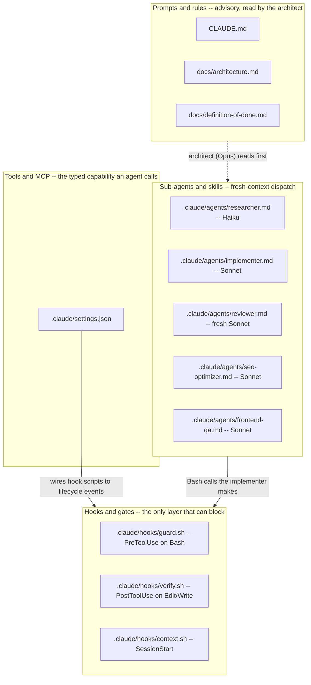
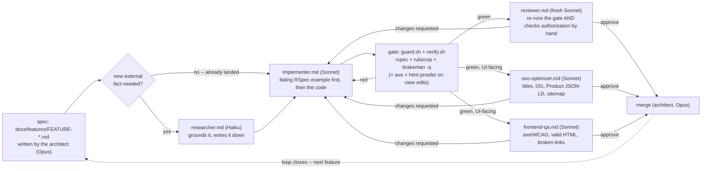
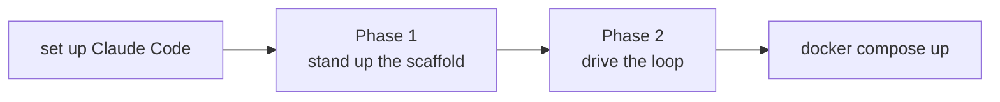
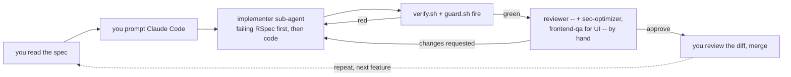

# Управление на изграден от AI Rails магазин — вход на потребител и checkout под gate-ове

*AI-assisted-sdlc · Worked Examples · SPEC-SDLC-4 + SPEC-SDLC-4-ADDENDUM-seo-frontend-qa-agents*

> **Смисълът на тази глава не е да ви подаде готов Rails магазин за четене — а вие сами да го
> построите, заедно със слоя за управление (governance).** Всичко описано по-долу се случи, докато
> управляван цикъл, движен от човек, насочващ Claude Code, изгради това приложение feature по
> feature — но този цикъл не съществуваше сам по себе си; някой първо трябваше да напише
> `CLAUDE.md`, документацията, под-агентите и hook-овете. §6a е стъпка по стъпка версията на двете
> половини, с вашите ръце на клавиатурата — Фаза 1 изгражда скелета за управление, Фаза 2 движи
> цикъла за features, който той налага — а
> [`code/rails-estore/README.md`](code/rails-estore/README.md#build-it-yourself-with-claude-code) е
> същата двуфазова разходка, написана да работи самостоятелно, без тази глава да е отворена.
> Комитнатият код в `rails-estore/` е **дестинацията** — там, където стигате, след като изградите
> скелета и сами движите цикъла — а не смисълът на четенето на тази глава.

## Бъгът, който изисква само да си влязъл в системата, все едно като кого

Помолете агент, без никакви gate-ове, да "позволи на влязъл потребител да види предишните си
поръчки" и ето най-бързия път от prompt до зелена отметка: добавяте route, добавяте action, търсите
поръчката по id-то в URL-а, рендирате я. Работи от първия път, когато кликнете — показва се вашата
собствена поръчка, защото тествате със собствения си акаунт. PR-ът изглежда завършен: controller
action, view, минал ръчен клик тест.

```ruby
# app/controllers/checkout/orders_controller.rb — какво доставя agent без gate-ове
def show
  @order = Order.find(params[:id])
end
```

Няма нищо сгрешено в тази линия Ruby код, не е зле форматирана и не носи риск от SQL инжекция — ще
мине през linter и security scanner без нито едно предупреждение, по причини, до които тази глава
стига директно. Това, което тя всъщност прави, е да позволи на *всеки влязъл потребител* да чете
поръчката на *всеки друг потребител*, само чрез промяна на една цифра в URL-а: влизате като когото и
да е, отваряте `/checkout/orders/1`, `/checkout/orders/2`, `/checkout/orders/3`, и четете историята
на поръчки на всеки клиент — имена, продукти, суми — стъпка по стъпка. Това не е хипотеза: това е
най-често срещаният бъг в контрола на достъп в уеб приложения, достатъчно формализиран, за да има
собствено име, IDOR (insecure direct object reference), и собствена точка в
[OWASP Top 10](https://owasp.org/Top10/A01_2021-Broken_Access_Control/) (A01:2021 — Broken Access
Control) (проверено на 2026-09-04). Регистрационна форма, отдалечена само с едно извикване на
`permit()` от това да позволи на нов регистриран потребител да си сложи `admin: true`, е същият тип
провал в различна опаковка: кодът работи, тестовете (ако изобщо съществуват) тестват happy path-а, а
дефектът е невидим, докато някой изрично не тръгне да го търси — обикновено нападател, а не reviewer,
преглеждащ diff-а.

[SPEC-SDLC-2 (Java скелетът)](01-java-sdlc-scaffold.md) направи същия аргумент за `-DskipTests`
пряк път за чисто логически Luhn валидатор: hook, а не добри намерения, е това, което прави пряката
пътечка *изобщо да не се изпълни*. Тази глава повдига залозите нарочно — различен стек (Ruby on
Rails 8.1) и приложение, реално чувствително по отношение на сигурността, малък е-магазин с реален
вход и реален checkout — защото логин и checkout са точно тези features, при които неконтролирана AI
промяна нанася реална вреда, и точно там, където "слоят за управление прави AI-асистираната
разработка безопасна, не добрите намерения на модела" престава да е абстрактно твърдение и се
превръща в нещо, което можете да наблюдавате как се случва, два пъти, по-долу.

## 1. Какво и защо — същите четири примитива, стек с по-високи залози

[SPEC-SDLC-1 (Theory)](../01-theory/01-theory.md) назова четири примитива за скеле, от които се
нуждае инструмент за agentic coding: **prompts & rules** (`CLAUDE.md` — advisory, четен от
архитекта), **hooks & gates** (детерминистична автоматизация, която реално може да *блокира*
неправилно действие), **tools & MCP** (типизирани възможности, тук `Bash`, изпълняващ `bundle exec
rspec`/`rubocop`/`brakeman`), и **sub-agents & skills** (диспечиране с чист контекст: researcher,
implementer, свеж reviewer). [SPEC-SDLC-2](01-java-sdlc-scaffold.md) доказа, че и четирите се
пренасят непроменени по форма към Java/Maven кодова база. Тази глава доказва, че същите четири се
пренасят и към Ruby/Rails — и добавя едно нещо, от което никоя от предишните две глави нямаше нужда:
**съдържанието на gate-а има модел на заплахата (threat model).** Gate-ът на учебна глава пита "дали
това компилира и се рендира." Gate-ът на Luhn валидатор пита "дали това компилира, и дали тестът
първо се провали." Gate-ът на това приложение пита и двете, *и* "може ли потребител да чете чужди
данни" и "може ли потребител да зададе атрибут, който никой не му е изложил" — защото това е първият
стек в тази книга с форма за вход и платежна интеграция зад нея.

Всичко по-долу живее под [`code/rails-estore/`](code/rails-estore/) — пълен Rails проект скелет със
собствен вложен `.claude/` слой за управление, точно както би седял в реално хранилище. §2–3 обхождат
оригиналния скелет с три роли; §3a въвежда два допълнителни специализирани reviewer-и, добавени от
този addendum — `seo-optimizer` и `frontend-qa`; §4–5 покриват hook-овете и gate-овете. §6 прекарва
и трите features — логин, после checkout, после каталог на продукти — през целия цикъл, включително
момента, в който свеж reviewer улавя реална уязвимост, пропусната от три зелени автоматизирани
gate-а, и момента, в който двата нови специалиста улавят по един дефект всеки в собствената си
област, който същите тези gate-ове дори не се опитват да проверят. §6a ви подава клавиатурата, на
две фази: първо изграждате сами самия слой за управление — `CLAUDE.md`, документацията, под-агентите,
hook-овете, спецификацията на първия feature — с ръка, после движите същия цикъл, сгъстен в
повторяем checklist с готови за копиране prompt-ове, така че построявате FEATURE-1/2/3 сами, вместо
само да четете как е протекло. §7 изброява какво чупи цикъла, ако пропуснете стъпка. §8 е директното
сравнение: собственият скелет на това хранилище, `java-project/`, и `rails-estore/`, едно до друго.
§9 е откровена за това какво реално е било изпълнено и къде, и сочи към
[`code/rails-estore/README.md`](code/rails-estore/README.md) за пускане на цялото нещо за истина на
Mac.

**Базова версия на инструментариума**, обоснована в
[`research/NOTE-SDLC-4-1-versions.md`](../../research/NOTE-SDLC-4-1-versions.md) (проверено
2026-09-04): Ruby **4.0.6** ([Ruby 4.0.6 released](https://www.ruby-lang.org/en/news/2026/07/14/ruby-4-0-6-released/),
14 юли 2026), Rails **8.1.3.1** ([Rails 8.0.5 and 8.1.3 released](https://rubyonrails.org/2026/3/24/Rails-Versions-8-0-5-and-8-1-3-have-been-released),
поправена до `.1` на 29 юли 2026), `rspec-rails` **8.0.4**, `rubocop` **1.90.0** + `rubocop-rails`
**2.37.0** (повдигната спрямо `1.86.0` от grounding бележката — реален `bundle install`, изпълнен за
истина в Docker по SPEC-SDLC-4-ADDENDUM-2, откри, че `rubocop-rails 2.37.0` вече изисква
`rubocop >= 1.89.0`; вижте `artefacts/rails-validation-log.md` §7), `brakeman` **8.0.6**, `bcrypt`
**3.1.22** (включва поправка на CVE-2026-33306), `stripe` **19.3.0**. Всяка от тях е фиксирана с
точна версия в [`Gemfile`](code/rails-estore/Gemfile). **Тази пясъчна кутия (sandbox) няма Ruby/Rails
инструментариум** — бележката за средата в §9 е изрична коя от доказателствата по-долу е реален,
заснет изход, и коя е обоснована референтна команда, която пускате на машина с инсталирани Ruby и
Rails. Единственото изключение е самият Docker, който **е** наличен тук — Docker-compose пътят (§9,
"Running it") реално бе изграден, стартиран и тестван от край до край, а не само описан.

### Картата



Идентична форма на [картата от SPEC-SDLC-2](01-java-sdlc-scaffold.md#the-map-four-primitives-one-file-each)
— защото схемата на settings и схемата на frontmatter-а на агентите наистина не знаят и не се
интересуват на какъв език е gate-проверката. §4 е там, където това престава да е вярно: *съдържанието*
на `guard.sh` и `verify.sh` е мястото, където моделът на заплахата на Rails приложение реално си
проличава.

## 2. Хартата + документацията — правила, със златно правило за сигурност, от каквото Java нямаше нужда

[`code/rails-estore/CLAUDE.md`](code/rails-estore/CLAUDE.md) огледално отразява собствения `CLAUDE.md`
на това хранилище и седмо/осмоправиловата форма на `java-project/CLAUDE.md`, с едно правило, от което
нито един от предишните проектови устави не се нуждаеше да заяви:

| Това хранилище (авторство на съдържание) | `java-project/` (Java feature) | `rails-estore/` (Rails feature) |
|---|---|---|
| Нито една глава без одобрен `specs/SPEC-*.md` | Нито един код без одобрен `docs/features/FEATURE-*.md` | Същото |
| Всяко твърдение обосновано (NOTE или цитат) | Всяка версия на зависимост/API твърдение обосновано | Същото, плюс: всяко security/CVE твърдение |
| Всеки code snippet трябва да работи | Всеки JUnit 5 тест трябва да се ПРОВАЛИ преди кода, който го удовлетворява | Всеки RSpec пример трябва да се ПРОВАЛИ преди кода, който го удовлетворява |
| *(няма еквивалент — няма auth повърхност)* | *(няма еквивалент)* | **Златно правило 4: всяка заявка, scope-ната по `Current.user`, е авторизирана; всеки списък в `permit()` е минимален** — това хранилище и `java-project/` нямат login или платежна повърхност, към която да се прилага това правило |
| Exit gate: компилиране на snippet + проверка на линкове + review | Exit gate: `mvn test` + checkstyle + spotless + spotbugs + review | Exit gate: `rspec` + rubocop + `brakeman -q --no-summary` (нула High-confidence предупреждения) + review |

[`docs/architecture.md`](code/rails-estore/docs/architecture.md) назовава същите шест раздела като
двата предишни скелета (operating model, роли, работен процес, форма на хранилището, gate-ове,
дневник на решенията) — второто по давност записване в дневника на решенията записва точно защо е
избран *нативния* auth генератор на Rails 8, вместо Devise: лек откъм зависимости и официално
поддържан от Rails 8 нататък, достатъчен за обхвата на това приложение
[източник: NOTE-SDLC-4-2-auth-generator.md]. [`docs/definition-of-done.md`](code/rails-estore/docs/definition-of-done.md)
добавя секция "Security" между "Grounded" и "Green gate", която не съществува в checklist-а на нито
един от предишните проекти — авторизация, mass assignment, хеширане на пароли и сканирането за
secrets имат всяка своя отметка със собствено изисквано RSpec доказателство, а не са сложени в
общото "correctness."

## 3. Съставът на агентите — същите три роли, едно допълнение в процеса на reviewer-а

[`.claude/agents/researcher.md`](code/rails-estore/.claude/agents/researcher.md) (Haiku) и
[`.claude/agents/implementer.md`](code/rails-estore/.claude/agents/implementer.md) (Sonnet) са
структурно идентични с тези на `java-project/` — проверява факт/пише бележка; пише провалящ се
тест, после минималния код, после пуска gate-а. Процесът на implementer-а добавя ред, от какъвто
Java implementer-ът нямаше нужда: *"За всичко, засягащо authentication, authorization, или
mass-assignable параметри, по подразбиране избирай ПО-РЕСТРИКТИВНАТА опция и оставяй acceptance
criteria на спецификацията да оправдаят разхлабването ѝ — никога обратното."*

[`.claude/agents/reviewer.md`](code/rails-estore/.claude/agents/reviewer.md) (свеж Sonnet) е мястото,
където живее истинското допълнение. Докато процесът на `java-project/reviewer.md` е fidelity →
test-first → grounded → green gate → scope, reviewer-ът на този проект вмъква две изрични, назовани
стъпки между тях:

> 3. **Авторизация, ръчно, на всеки controller action, който е засегнат.** ... потвърди, че заявката
>    реално е scope-вана към текущия потребител (`Current.user.orders.find(...)`, а не
>    `Order.find(...)`) — не-scope-нат `find` върху id от URL-а е IDOR, дори ако всяка друга проверка
>    премине.
> 4. **Mass assignment, ръчно, на всеки controller action, който строи или обновява модел от params.**
>    Потвърди, че `permit()` изброява САМО атрибутите, от които feature-ът реално се нуждае, поименно.

*Защо го правим така:* linter и security scanner имат всеки фиксиран каталог от шаблони, за които
проверяват. Да прочетеш `Order.find(params[:id])` и да попиташ "чия поръчка е позволено да бъде
това" е преценка за това какво *feature-ът* трябва да авторизира, а не съвпадение с известен CWE
шаблон — точно затова checkout цикълът в §6 показва тази линия да минава RuboCop и Brakeman и
двата *чисто*, и защо инструкциите на reviewer-а казват "ръчно" два пъти, а не веднъж.

## 3a. Още двама специалисти — SEO и качество на фронтенда (този addendum)

FEATURE-1 и FEATURE-2 дадоха на този магазин система за акаунти и checkout, и двете реално
чувствителни по отношение на сигурността. Но нито общият `reviewer.md` по-горе, нито
RuboCop/Brakeman имат каквото и да е мнение по две други измерения, без които е-магазин не може да
се пусне: **може ли търсачка (или споделен линк) да намери и правилно да представи тази страница**, и
**може ли човек, който използва клавиатура или screen reader, реално да я използва**. Това са
различни начини на провал от IDOR — не липсваща проверка за авторизация, а липсваща *цяла категория
проверка*. Каталогът от правила на RuboCop няма правило "полето на формата се нуждае от label";
86-те проверки на Brakeman (§5) покриват класове бъгове от типа инжекция и mass-assignment, никога
WCAG или schema.org. Затова съставът нараства с двама, всеки заслужил мястото си по същия начин,
както `reviewer.md`: като улавя нещо реално, в собствената си област, което нищо друго в gate-а на
този проект не улавя.

| Специалист | Проверява | Реален инструментариум | Улавя това, което security/style gate-овете не улавят |
|---|---|---|---|
| [`seo-optimizer.md`](code/rails-estore/.claude/agents/seo-optimizer.md) | Уникален title/description, canonical, Open Graph, schema.org **Product** JSON-LD, `robots.txt`/sitemap, йерархия на заглавия | `meta-tags` 2.24.0, `sitemap_generator` 7.1.1, `@lhci/cli` 0.15.1 (референтно) | Липсващ/невалиден Product JSON-LD блок — страницата е синтактично наред, рендира се правилно и просто е невидима за резултат от търговски (merchant) листинг в търсачка |
| [`frontend-qa.md`](code/rails-estore/.claude/agents/frontend-qa.md) | WCAG/axe (labels, alt, контраст, ред на заглавията, `lang`, focus/skip link, landmarks), валиден/семантичен/responsive HTML, счупени линкове | `axe-core-rspec`/`axe-core-capybara` 4.13.0, `html-proofer` 5.2.2 | Поле без label или счупен ред на заглавия — код, който е стилистично перфектен Ruby и стилистично перфектен view, неизползваем за потребител на screen reader |

И двата са структурирани точно като `reviewer.md`: номериран checklist, "изведи вердикт, не сливай."
И двата са свързани на същите три места, на които е свързана всяка роля в този проект:
[`CLAUDE.md`](code/rails-estore/CLAUDE.md) в секциите Model routing и Gates ги назовава (feature,
който добавя или променя рендирана страница, допълнително минава и *frontend gate-а*, в допълнение
към `rspec`/`rubocop`/`brakeman`), и
[`docs/definition-of-done.md`](code/rails-estore/docs/definition-of-done.md) получава нова секция
**SEO & Accessibility** — паралелна по форма на съществуващата секция "Security" (checklist-а за
авторизация/mass-assignment/хеширане на пароли от §5), със собствено изисквано доказателство за всяка
отметка, а не сложена в общото "correctness." Собствените инструкции на `frontend-qa.md` носят
същата уговорка, каквато
[NOTE-SDLC-4-ADD-3-wcag-a11y-checks.md](../../research/NOTE-SDLC-4-ADD-3-wcag-a11y-checks.md) заявява
директно: автоматизираните axe проверки улавят приблизително 30–40% от реалните WCAG проблеми, така
че чист axe run е под, а не целия вердикт, за този checklist.

*Защо го правим така:* същият аргумент, който §3 направи за допълнението авторизация/mass-assignment
за сигурността, важи тук с разменени думи. Linter има фиксиран каталог от шаблони; "дали label-ът
на това поле е програмно свързан с него" и "дали този JSON-LD блок е валиден според изискванията на
Google за Merchant Listing" са преценки за това какво трябва да прави *страницата*, а не съвпадение
с известно правило — точно затова checklist-ите на двата нови агента казват "ръчно" и "пусни го сам
отново," вместо "вярвай на доклада на implementer-а," същата дисциплина, която процесът на
reviewer-а в §3 вече установи. Разходката на FEATURE-3 в §6 показва двамата специалисти да улавят
всеки по един реален, планиран дефект — единият в поле от форма, другият в липсващ блок структурирани
данни — за които напълно зелен `rspec`/`rubocop`/`brakeman` run не докладва нищо.

## 4. Hook-ове + settings — съдържанието на gate-а е мястото, където стекът реално има значение

[`.claude/settings.json`](code/rails-estore/.claude/settings.json) е байт по байт същите три event-а
и форма на handler-и като всеки предишен скелет — валидирано за истина, не само на око, в
[`artefacts/rails-validation-log.md`](artefacts/rails-validation-log.md) §1. Трите hook скрипта носят
специфичното за стека съдържание:

- **[`guard.sh`](code/rails-estore/.claude/hooks/guard.sh)** (`PreToolUse` върху `Bash`) пази всяко
  deny-правило от собствения `guard.sh` на това хранилище (`rm -rf /`, принудителен push, отпечатване
  на secret) и добавя две правила, от които Java проект за авторство на съдържание няма нужда: блокира
  `git commit --no-verify` (Rails еквивалентът на `-DskipTests` от Java главата — начин да убедиш
  gate-а изобщо да не се изпълни), и — флагманското ново правило — **блокира всяка shell команда,
  съдържаща стойност, изглеждаща като реален Stripe ключ** (`sk_live_`/`pk_live_`/`rk_live_`). Точно
  това превръща "никога не се появява реален secret в хранилището" от написано правило в `CLAUDE.md`
  в нещо, наложено на ниво shell, преди агент дори да успее да echo-не ключ, докато дебъгва, камо ли
  да го комитне. Реално, заснето доказателство, че се задейства — пет случая, всичките пет
  правилни — е в [`artefacts/rails-validation-log.md`](artefacts/rails-validation-log.md) §3.
- **[`verify.sh`](code/rails-estore/.claude/hooks/verify.sh)** (`PostToolUse` върху `Edit|Write`)
  изпълнява `bundle exec rspec`, после `rubocop`, после `brakeman -q --no-summary` при всяка промяна
  на `.rb` файл — трите инструмента, обосновани в §5 като стандартния quality/security gate за този
  стек — и `bundle check` при промяна на `Gemfile`, същия шаблон "валидирай манифеста веднага," какъвто
  `java-project/verify.sh` изпълнява за `pom.xml`.
- **[`context.sh`](code/rails-estore/.claude/hooks/context.sh)** (`SessionStart`) отпечатва същия
  ориентировъчен банер, какъвто и двата предишни проекта — документи за първо четене, съставът, и
  всеки `docs/features/FEATURE-*.md` със своя статус. Реален изход в
  [`artefacts/rails-validation-log.md`](artefacts/rails-validation-log.md) §3.

## 5. Security-first gate-ове, и защо всеки от тях съществува

Четири gate-а, четири различни начина на провал, всеки назован, защото реален такъв е уловил нещо в
собствения worked example на тази глава:

**RuboCop** (style/lint) — не улавя нищо специфично за сигурността по подразбиране, но
`.claude/hooks/verify.sh` го пуска пръв, защото е най-бързият сигнал: controller action, твърде дълъг,
за да се прочете с един поглед (`Metrics/MethodLength`, ограничен до 15 реда в
[`.rubocop.yml`](code/rails-estore/.rubocop.yml)) е controller action, твърде дълъг за reviewer-а да
провери авторизацията му с око, което е точно проверката, която има най-голямо значение за това
приложение.

**RSpec** (`rspec-rails` 8.0.4) — test-first дисциплината от `java-project/`, пренесена непроменена:
пример се пише и се потвърждава, че се проваля, преди кода, който го удовлетворява. Новото тук е
*какво* покриват примерите: `spec/requests/registrations_spec.rb` и
`spec/requests/checkout_spec.rb` всеки носи специфичен за сигурността пример (mass assignment, IDOR)
редом с функционалните — виж §6.

**Brakeman** (8.0.6) — стандартният статичен security scanner за Rails, 86 проверки, покриващи SQL
инжекция, mass assignment, XSS, CSRF, небезопасни redirect-и, и още
[източник: NOTE-SDLC-4-3-brakeman-checks.md]. Три, заслужаващи да бъдат назовани, защото собственият
код на тази глава ги задейства:
- **Mass assignment** — маркира модел, построен от непозволени params
  [източник: [Brakeman — Mass Assignment](https://brakemanscanner.org/docs/warning_types/mass_assignment/)
  (проверено 2026-09-04)]. Триключовият списък `permit()` на
  `RegistrationsController#user_params` е причината това приложение да докладва чисто.
- **SQL injection** — маркира неескейпнат потребителски вход в raw заявка (напр.
  `User.where("email = '#{email}'")`); това приложение избягва изцяло този шаблон, използвайки
  параметризираните ActiveRecord finders (`find_by(email_address: ...)`) навсякъде.
- **Cross-Site Scripting** — маркира неескейпнат изход, най-често случаен `.html_safe`.
  [`artefacts/rails-validation-log.md`](artefacts/rails-validation-log.md) §4 разглежда реален
  пример точно на тази проверка, уловила реална ранна чернова на собствения
  `products/show.html.erb` на тази глава.

*Защо го правим така:* Brakeman е статичен анализ — никога не изпълнява приложението. Собствената му
документация е изрична относно границата, която има най-голямо значение за тази глава: тя "няма да
улови логически грешки (напр. пропуски в авторизацията, изискващи динамичен анализ или тестово
покритие)" [източник: NOTE-SDLC-4-3-brakeman-checks.md, "Caveats"]. Checkout цикълът в §6 е изграден
изцяло около това единствено изречение.

**bcrypt + `has_secure_password`** — извикването `has_secure_password` на модела User хешира с
bcrypt, умишлено бавен алгоритъм (~200–300 ms на хеш), избран специално, за да направи brute-force
атака срещу откраднат dump на password хешове непрактична
[източник: [ActiveModel::SecurePassword — Rails API](https://api.rubyonrails.org/classes/ActiveModel/SecurePassword/ClassMethods.html)
(проверено 2026-09-04)]. Колоната `password_digest` пази само хеша; `spec/models/user_spec.rb`
твърди директно, че digest-ът никога не е равен на явния текст — виж §6.

**Strong parameters** — механизмът на Rails срещу mass-assignment от Rails 4 насам: controller трябва
изрично да направи `permit()` на всеки атрибут, който ще бъде присвоен от потребителски вход, иначе
този атрибут тихо се отхвърля
[източник: [Rails Strong Parameters Deep Dive](https://blog.saeloun.com/2025/02/18/deep-dive-into-rails-action-controller-strong-parameters/)
(проверено 2026-09-04)]. Всеки controller в `app/controllers/`, който строи или обновява модел от
`params`, го използва; `spec/requests/registrations_spec.rb` доказва, че параметърът `admin`
конкретно не може да бъде зададен по този начин.

**CSRF** — Rails включва `protect_from_forgery` по подразбиране за всеки наследник на
`ActionController::Base` (какъвто е `ApplicationController`); това приложение приема подразбирането,
вместо да го изключва някъде, така че не е отделено като самостоятелен feature — това е единственият
gate тук, който не изисква код, за да бъде верен, само *да не бъде изключван*.

## 6. Цикълът в действие



`seo-optimizer.md` и `frontend-qa.md` работят **паралелно** с общия reviewer, не вместо него, и само
за features, които добавят или променят рендирана страница — формата за вход на FEATURE-1 и checkout
потокът на FEATURE-2 предшестват този addendum и бяха прегледани само от `reviewer.md`; FEATURE-3
(§3a, по-долу) е първият feature, който и трите преглеждат заедно.

Пълната разходка стъпка по стъпка за трите features е
[`artefacts/rails-feature-loop-transcript.md`](artefacts/rails-feature-loop-transcript.md), изрично
обозначена като **референтен транскрипт** — реални имена на файлове, реална спецификация, реален
комитнат код, реални разсъждения на reviewer-а; илюстративни байтове от конзолата на
`bundle exec rspec`/`rubocop`/`brakeman`/axe/html-proofer, защото тази пясъчна кутия няма Ruby
инструментариум и няма браузър (§9). Ето формата на това, което показва.

### FEATURE-1 — вход на потребител (чист пропуск)

[`docs/features/FEATURE-1-user-login.md`](code/rails-estore/docs/features/FEATURE-1-user-login.md)
задава шест acceptance criteria. Implementer-ът пише
[`spec/models/user_spec.rb`](code/rails-estore/spec/models/user_spec.rb),
[`spec/requests/registrations_spec.rb`](code/rails-estore/spec/requests/registrations_spec.rb), и
[`spec/requests/sessions_spec.rb`](code/rails-estore/spec/requests/sessions_spec.rb) срещу stub
controllers първо, потвърждава, че всичките осем примера се провалят по правилната причина
(поведението още не съществува), после пише реалните
[`User`](code/rails-estore/app/models/user.rb)/[`Session`](code/rails-estore/app/models/session.rb)/
[`Current`](code/rails-estore/app/models/current.rb)/
[`Authentication`](code/rails-estore/app/controllers/concerns/authentication.rb) и двата
controller-а. Gate-ът минава зелено още от първия път; ръчната проверка за авторизация на свежия
reviewer не открива нищо за флагиране — `CartsController#show` изобщо не взима `params[:id]`, найпростата форма, която проверката за авторизация може да приеме — и mass assignment е чист списък
`permit()` с три ключа. **APPROVE**, права линия от спецификация до сливане, същата форма като
FEATURE-1 на `java-project/`.

### FEATURE-2 — checkout (планираният пропуск, уловен и поправен)

[`docs/features/FEATURE-2-checkout.md`](code/rails-estore/docs/features/FEATURE-2-checkout.md)
задава шест acceptance criteria, едно от тях (AC5) назовавайки случая с авторизацията изрично: *"не е
удовлетворено само от 'route-ът изисква вход'."* Implementer-ът пише
[`spec/models/order_spec.rb`](code/rails-estore/spec/models/order_spec.rb) и
[`spec/requests/checkout_spec.rb`](code/rails-estore/spec/requests/checkout_spec.rb), потвърждава,
че провалите са реални, после пише
[`Checkout::OrdersController`](code/rails-estore/app/controllers/checkout/orders_controller.rb).
Под времево напрежение `show` се доставя като `Order.find(params[:id])` — бъгът от отварянето на
тази глава, за истина — а RSpec покритието на AC5 се доставя само с един положителен случай ("връща
поръчката на собствения ѝ собственик"), пропускайки отрицателния случай, за какъвто самата
формулировка на спецификацията настояваше.

Gate-ът се изпълнява и докладва **и трите зелени**: RSpec е зелен, защото нищо не задейства
уязвимия път; RuboCop е зелен, защото линията е перфектно идиоматичен Ruby; Brakeman е зелен, защото
счупен контрол на достъп между записи от един и същи тип не е една от статичните му проверки (§5).
Implementer-ът докладва, че gate-ът е зелен, честно вярвайки, че feature-ът е готов.

Стъпка 3 от процеса на свежия reviewer — **"ръчно, на всеки controller action, който е засегнат"** —
я открива, четейки diff-а директно, за времето, необходимо да се прочете самата линия:

> **ИЗИСКВАТ СЕ ПРОМЕНИ.**
> 1. `app/controllers/checkout/orders_controller.rb:26` — `Order.find(params[:id])` не е scope-нат
>    към `Current.user`. Всеки влязъл потребител може да прочете чужда поръчка, само увеличавайки
>    id-то в URL-а (IDOR, OWASP A01:2021). Поправка: `Current.user.orders.find(params[:id])`.
> 2. `spec/requests/checkout_spec.rb` — отрицателният случай на AC5 няма RSpec пример. Зелен RSpec
>    тук не е доказателство за нищо.

Implementer-ът добавя липсващия отрицателен пример, потвърждава, че се проваля срещу все още
счупения controller (реално очакване за `ActiveRecord::RecordNotFound`, което не хвърля нищо —
конкретното доказателство, че бъгът е реален, не хипотетичен), прилага еднолинейната поправка, и
пуска gate-а отново — този път с отрицателния случай реално допринасящ за зелен RSpec run. Reviewer-ът
проверява отново и двете констатации, пуска gate-а независимо, и връща **APPROVE**. Архитектът
сливa.

*Защо го правим така:* това е целият аргумент на главата, концентриран в един diff. Трите
автоматизирани gate-а не лъжеха — всеки докладваше точно това, за което е построен. Никой от тях не
е построен да отговори на "чии данни са тези." Свеж reviewer, инструктиран да задава този въпрос
ръчно, на всеки action, всеки път, е.

### FEATURE-3 — каталог на продукти (два специализирани дефекта, по един за всеки нов агент)

[`docs/features/FEATURE-3-product-catalog-seo-a11y.md`](code/rails-estore/docs/features/FEATURE-3-product-catalog-seo-a11y.md)
(този addendum) задава девет acceptance criteria за публичен, SEO-завършен, достъпен каталог на
продукти — първият feature, който `seo-optimizer.md` и `frontend-qa.md` преглеждат. Implementer-ът
пише [`spec/system/accessibility_spec.rb`](code/rails-estore/spec/system/accessibility_spec.rb) и
[`spec/system/seo_spec.rb`](code/rails-estore/spec/system/seo_spec.rb), потвърждава, че и двата се
провалят по правилната причина, после пише реалните
[`ProductsController`](code/rails-estore/app/controllers/products_controller.rb),
[`ProductsHelper`](code/rails-estore/app/helpers/products_helper.rb), и — ново за този проект —
[`app/views/layouts/application.html.erb`](code/rails-estore/app/views/layouts/application.html.erb),
който не съществуваше преди този addendum. Доставят се два пропуска, по един за областта на всеки
специалист: полето за търсене в каталога се доставя като гол
`<input type="search" name="q" placeholder="Search products">` без `<label>` — placeholder текстът не
е label и изчезва в момента, в който потребителят започне да пише — и страницата за преглед на
продукт се доставя **без** никакъв блок `<script type="application/ld+json">`.

`bundle exec rspec`, `rubocop`, и `brakeman -q --no-summary` докладват всичките чисто, по същата
причина, поради която IDOR случаят в §6 стана: никой от трите няма проверка в тази категория изобщо
— не е сляпо петно в иначе широк инструмент, а категория, която никой от тях никога не е бил
построен да покрие. Implementer-ът докладва всяка проверка, която е могъл да пусне, като зелена.

Пуснат паралелно, `frontend-qa.md` изпълнява axe системния тест наистина и открива липсващия label
незабавно (axe правило `label`, влияние **критично**, WCAG 1.3.1/4.1.2) — **ИЗИСКВАТ СЕ ПРОМЕНИ**.
`seo-optimizer.md` парсва рендираната страница за преглед и не открива никъде Product JSON-LD —
Google Merchant Listing изисква минимум `name`/`image`/`offers.price`/`offers.priceCurrency`
[NOTE-SDLC-4-ADD-2-schema-product.md](../../research/NOTE-SDLC-4-ADD-2-schema-product.md) —
**ИЗИСКВАТ СЕ ПРОМЕНИ**. Implementer-ът добавя липсващия `<%= f.label %>` и двата JSON-LD `<script>`
тага (Product + BreadcrumbList), пуска gate-а отново, и двамата специалисти — плюс общия
`reviewer.md`, който нямаше какво да флагира, тъй като този controller не докосва нито
scope-нато по `Current.user` запитване, нито извикване на `permit()` — връщат **APPROVE**. Архитектът
сливa. Пълен транскрипт, включително и двата вердикта дословно и илюстративния axe/html-proofer
изход: [`artefacts/rails-feature-loop-transcript.md`](artefacts/rails-feature-loop-transcript.md)
Част В; референтен axe/html-proofer/Lighthouse CI изход:
[`artefacts/rails-validation-log.md`](artefacts/rails-validation-log.md) §6.

## 6a. Постройте го сами — изградете скелета, после движете цикъла

§6 разказа какво се случи, когато този цикъл се изпълни — но този цикъл предполага, че вече
съществува слой за управление, а в реален нов проект той не съществува, все още. Този раздел е и
двете половини, написани като нещо, което реално правите: **Фаза 1** пише `CLAUDE.md`, документацията,
под-агентите, и hook-овете сами, ръчно, преди изобщо да съществува `app/` код — същите четири
примитива за скеле, които [SPEC-SDLC-1 (Theory)](../01-theory/01-theory.md) назовава в абстракция,
приложени по начина, по който [SPEC-SDLC-2](01-java-sdlc-scaffold.md) вече ги приложи, за да изгради
скелета на изцяло нов Java проект, сега с вашата ръка на клавиатурата, вместо разказ в глава.
**Фаза 2** е ритъмът от шест стъпки от §6, изпълняван сега върху скелета, произведен от Фаза 1:
инсталирате Claude Code, отваряте `code/rails-estore/`, и движите FEATURE-1 → FEATURE-2 → FEATURE-3
сами. Всяка стъпка по-долу, с готовите за копиране prompt-ове, инструкциите за инсталиране/вход, и
финалната линия `docker compose up`, живее в
[`code/rails-estore/README.md`](code/rails-estore/README.md#build-it-yourself-with-claude-code), така
че работи самостоятелно, без тази глава да е отворена. Ето формата на двете фази.



### Фаза 1 — сами изградете agentic SDLC-то, първо

Преди да докоснете дори един `app/` файл, напишете следните по ред — всеки от тях вече е комитнат в
`code/rails-estore/`; третирайте го като шаблона, който адаптирате, не като нещо, което наследявате
непрочетено:

1. **`CLAUDE.md`** — хартата: златните правила (спецификация преди код, tests-first, всяко
   scope-нато по `Current.user` запитване авторизирано, secrets само в `.env`) и таблицата за
   маршрутизация на модели.
2. **`docs/architecture.md` и `docs/definition-of-done.md`** — формата и изходната летва, включително
   секцията Security, която моделът на заплахата на това приложение заслужава (§2 по-горе разгледа
   и двете изцяло).
3. **Под-агентите в `.claude/agents/`** — `researcher`, `implementer`, `reviewer`, после
   `seo-optimizer` и `frontend-qa` (§3, §3a). Написването на един означава YAML frontmatter
   (`name`/`description`/`tools`/`model`), номериран checklist, и изричен договор "изведи вердикт, не
   сливай"; Claude Code после го диспечира чрез естествен език, `@`-споменаване, или
   session-широк флаг `--agent`
   [източник: [Claude Code — Sub-agents](https://code.claude.com/docs/en/sub-agents) (проверено
   2026-09-04)].
4. **Hook-овете + `.claude/settings.json`** (§4) — `guard.sh` при `PreToolUse` (твърдите блокировки),
   `verify.sh` при `PostToolUse` (бързия gate), `context.sh` при `SessionStart`; `settings.json`
   свързва всеки скрипт с неговия event, три нива дълбоко — event → matcher → handler
   [източник: [Claude Code — Hooks](https://code.claude.com/docs/en/hooks) (проверено 2026-09-04)].
5. **`docs/features/FEATURE-1-user-login.md`** — написан и одобрен преди какъвто и да е `app/` код,
   с acceptance criteria като тестваеми твърдения, не проза, която reviewer трябва да интерпретира.

Секцията Фаза 1 в README-то има готов за копиране prompt за чернова на всеки от петте — молещ Claude
Code да помогне да напишете собствения си `CLAUDE.md`, собствения си под-агент `reviewer`, собствения
си `guard.sh` — с комитнатия файл за сравнение, когато приключите. **Точно това прави безопасни
периодите на Фаза 2 без вашата намеса:** implementer-ът да итерира сам, докато gate-ът стане зелен,
работи само защото gate, който сте написали вие, наблюдава, а вердиктът на reviewer-а е доверен само
защото сте написали checklist-а, по който оценява.

### Фаза 2 — движете цикъла, който току-що изградихте



**Цикълът, веднъж на feature — изпълняван върху скелета, произведен от Фаза 1:**

1. **Прочетете спецификацията.** [`docs/features/FEATURE-1-user-login.md`](code/rails-estore/docs/features/FEATURE-1-user-login.md),
   после `FEATURE-2-checkout.md`, после `FEATURE-3-product-catalog-seo-a11y.md` — acceptance
   criteria са договорът, по който ще държите implementer-а отговорен, а не предложение.
2. **Подканете Claude Code да го имплементира.** Отправна точка:

   > Implement FEATURE-1 (`docs/features/FEATURE-1-user-login.md`). Use the implementer sub-agent:
   > write the failing RSpec examples for every acceptance criterion first, confirm each fails for the
   > right reason, then write the code that makes them pass. Run the full gate before telling me it's
   > done.

   Claude Code диспечира `implementer.md` — чрез изведен от естествен език, или принудено споменаване
   с `@agent-implementer` — който пише провалящия се тест преди дори един ред `app/` код
   [източник: [Claude Code — Sub-agents](https://code.claude.com/docs/en/sub-agents) (проверено
   2026-09-04)].
3. **Наблюдавайте как се задействат gate-овете.** `verify.sh` пуска `rspec`/`rubocop`/`brakeman` при
   всяка промяна на `.rb` (§4); `guard.sh` вето-ва опасен shell, преди изобщо да се изпълни. Червен
   gate при първото минаване — нов RSpec файл с всеки пример провалящ се — е правилно, не счупено;
   това е test-first дисциплината, назована от златно правило 2 в §2, видима сега в собствения ви
   терминал, вместо само прочетена.
4. **Получете независим review.**

   > Use the reviewer sub-agent to review the diff against the spec's acceptance criteria. Check
   > authorization and mass assignment by hand, not just the gate output.

   Това е стъпката, заради която съществува разказът за FEATURE-2 в §6: три зелени gate-а и реален
   IDOR, уловен само защото reviewer-ът прочете `Order.find(params[:id])` и попита чия поръчка е
   реално scope-нато това запитване. За FEATURE-3 добавете `seo-optimizer` и `frontend-qa` към същия
   prompt — те са ролите, които улавят полето за търсене без label и липсващия блок Product JSON-LD,
   които §6 разглежда, за нито едно от които `rspec`/`rubocop`/`brakeman` няма никаква проверка.
5. **Повторете за FEATURE-2, после FEATURE-3.** Същият ритъм; само acceptance criteria — и класа
   дефекти, срещу който пазят — се променят.
6. **Пуснете това, което построихте.** `docker compose up`, после <http://localhost:3000> — витрината,
   която показва снимката в §9.

**Как да насочвате добре:** бъдете конкретни и сочете спецификацията, вместо да описвате feature-а
по памет; оставете gate-овете и reviewer-ите да улавят, вместо ръчно да проверявате всяко RuboCop
правило сами; прегледайте всеки diff, преди да го обявите за слят — **APPROVE** от `reviewer.md` е
силен сигнал, не бутон за сливане.

**Честни бележки:** изходите на модела варират от изпълнение на изпълнение — собственият ви опит за
FEATURE-2 може да достави IDOR-а от §6, а може и да не го достави; и в двата случая стъпката с
reviewer-а е това, което прави цикъла безопасен, не обещание, че първата чернова вече е коректна.
Оставате в цикъла на всяка точка на решение — одобрете, отхвърлете, сливайте — точно това прави
периодите *без вашата намеса* (циклите на implementer-а edit-test-fix вътре в стъпка 2, автоматичното
задействане на gate-а вътре в стъпка 3) безопасни за изпълнение без вие да разказвате всяко
натискане на клавиш.

## 7. Клопки

- **Да се доверите на зелен security scanner, че означава "няма уязвимости."** Brakeman, докладващ
  нула предупреждения, означава нула предупреждения *в категориите, които Brakeman проверява* —
  IDOR-ът от §6 е конкретният контрапример. Прочетете секцията "Caveats" на собствения
  `docs/research/NOTE-SDLC-4-3-brakeman-checks.md`, преди да третирате мълчанието на статичен
  scanner като вердикт.
- **Permit списък, който расте от удобство.** `permit(:email_address, :password,
  :password_confirmation, :admin)` компилира, минава RuboCop, и Brakeman флагира mass assignment
  само когато извикването на permit *липсва* — извикване на permit, което съществува, но е твърде
  щедро, изглежда като умишлено. Стъпка 4 на reviewer-а съществува, защото нищо автоматизирано не
  различава "този атрибут принадлежи тук" от "този атрибут просто се случва да е тук."
- **Тестване само на happy path-а и обявяване на "готово."** Implementer-ът на FEATURE-2 написа
  реален, минаващ тест за AC5 — просто грешната половина от него. Зелен suite е доверен само доколкото
  acceptance criteria, които реално кодира; "AC5 има тест" и "AC5 е тестван" не са едно и също
  твърдение.
- **Пропускане на стъпката провалящ-се-тест-първо.** Същият риск, назован в клопките на
  `java-project/`: напишете теста и кода в един и същи преход, и сте потвърдили само, че си
  съответстват един на друг, не че тестът би уловил бъга, срещу който твърди, че пази.
- **Съхранение на пари като float.** `Product#price_cents` и `Order#total_cents` са integer нарочно
  — цена от тип `decimal`/`float` натрупва грешка от закръгляне, достатъчна при достатъчно позиции и
  отстъпки, за да има значение; съхраняването на центове като integer прави този клас бъгове
  структурно невъзможен.
- **Приемане, че "RSpec/RuboCop/Brakeman всички зелени" означава страницата е готова.** FEATURE-3
  (§3a, §6) е конкретният контрапример за втори клас бъгове, наред с IDOR-а от §6: никой от тези три
  инструмента няма НИКАКВА проверка за липсващ label на форма или липсващ блок структурирани данни —
  не е частична дупка в покритието, а категория извън обхвата им изцяло. `seo-optimizer.md`/
  `frontend-qa.md` съществуват, защото "gate-ът е зелен" и "тази страница е завършена" отново не са
  едно и също твърдение.
- **Stub, който тихо се превръща в реалния call.** Клонът в тестов режим на `PaymentService`
  (`Rails.env.test? || ENV["STRIPE_STUB"] == "true"`) трябва да остане ПЪРВОТО проверявано
  условие — стъпка 8 на reviewer-а изрично флагира "заглушен `PaymentService`, случайно извикващ
  реалния Stripe клиент" като шаблон за скъпо разрастване на обхвата, за който да се внимава, защото
  е единственият бъг в това приложение, който би струвал реални пари, ако се задейства.

## 8. Референция — три скелета, една форма

| Слой | Това хранилище (съдържание) | `java-project/` (Java) | `rails-estore/` (Rails) | Пренася ли се? |
|---|---|---|---|---|
| Схема на `.claude/settings.json` | 3 event-а | идентична | идентична | **Непроменено** |
| Схема на frontmatter-а на агента | `name`/`description`/`model`/`tools` | идентична | идентична | **Непроменено** |
| Deny-списък на `guard.sh` | `rm -rf /`, принудителен push, secrets | + `mvn -DskipTests` | + `git commit --no-verify`, + шаблон за реален Stripe ключ | **Разширен според реалния риск на стека** |
| Gate на `verify.sh` | byte-компилиране на snippet | `mvn test` + checkstyle + spotless + spotbugs | `rspec` + rubocop + `brakeman -q` | **Специфично за стека — мястото, където езикът има най-голямо значение** |
| Единица спецификация | една глава | един feature (`FEATURE-*.md`) | един feature (`FEATURE-*.md`) | Същата форма |
| Критерий за "работещо" в gate-а | snippet-ът компилира | тестът съществуваше и се провали първи | RSpec примерът съществуваше и се провали първи | Същата форма |
| Допълнителна точка от checklist-а на reviewer-а | — | ред на комитите test-first | test-first ред **+ авторизация ръчно + mass-assignment ръчно** | **Ново според модела на заплахата на стека** |
| Състав | researcher/writer/reviewer/architect | researcher/implementer/reviewer/architect | идентични роли | **Непроменено** |
| Маршрутизация на модели | Haiku обосновава, Sonnet пише, свеж Sonnet преглежда, Opus скопва+слива | идентична | идентична | **Непроменено** |

Изводът, по-остър този път от предишните две глави: всичко, което самият Claude Code предоставя —
схемата на settings, схемата на frontmatter-а, моделът на разрешенията, жизненият цикъл на hook-овете
— е независимо от стека и се пренася дословно, доказано вече два пъти. Това, което се променя всеки
път, е това, което вие пишете *за* вашия стек: реалните извиквания на инструменти в gate-а, и — ново
за тази глава — специфичните, назовани въпроси, които насочван от човек reviewer трябва да задава
ръчно, защото никой наличен автоматизиран инструмент не ги задава. В хранилище за авторство на
съдържание този допълнителен въпрос не съществува. В Java feature без network-facing auth повърхност
също не съществува. В Rails приложение, което съхранява пароли и говори с платежен шлюз, това е
единствената най-важна проверка в целия цикъл.

*Бележка под линия за състава (този addendum):* таблицата по-горе сравнява **формата** на трите
скелета, която остава непроменена — съставът на `rails-estore/` нараства от четири роли на шест
(architect, researcher, implementer, reviewer, `seo-optimizer`, `frontend-qa`), без да докосва
схемата на settings, схемата на frontmatter-а, или шаблона за маршрутизация на модели, чрез който
всяка от тези роли е свързана. §3a покрива двете допълнения изцяло; нито `java-project/`, нито
собственият скелет на това хранилище имат UI-обърната повърхност, към която да се приложи която и
да е от двете роли.

## 9. Бележка за средата, сканиране за secrets, и честност за какво реално е било изпълнено къде

**Този код е коректен и идиоматичен Ruby/Rails 8.1, написан да работи в декларирана Rails среда — не
е бил изпълняван вътре в тази Python книга-хранилище**, което няма Ruby инструментариум (`which
bundle`, `which rspec`, `which brakeman` всичките се разрешават в нищо тук) **и няма нито браузър,
нито Node инструментариум** (`which chromedriver`, `which node` също се разрешават в нищо) — така
че frontend gate-ът, добавен от този addendum (axe, html-proofer, `npx lhci autorun`), е само
референтен, по същата причина, поради която е и Ruby gate-ът. Това, което ДЕЙСТВИТЕЛНО е изпълнено,
за истина, в собствената пясъчна кутия на това хранилище:
`python -m json.tool` срещу `.claude/settings.json`; `validate_frontmatter.py` срещу всичките
**пет** agent файла (researcher, implementer, reviewer, `seo-optimizer`, `frontend-qa`); и трите
hook скрипта (`context.sh`/`guard.sh`/`verify.sh`), подадени с реални синтетични Claude Code hook
payload-и на stdin, с реален заснет изход за всеки случай, включително всичките пет deny-правила на
`guard.sh`; и реално `grep` сканиране за secrets в цялото дърво на `code/rails-estore/` — и, добавен
от SPEC-SDLC-4-ADDENDUM-2, реален цикъл `docker compose build`/`up`/`curl`/`bundle exec rspec`/
`down -v`, тъй като Docker (за разлика от Ruby) реално работи в тази пясъчна кутия. Всяко от тях е
в [`artefacts/rails-validation-log.md`](artefacts/rails-validation-log.md) с точната команда и изход,
§§1, 2, 3, 5, и 7 маркирани реални, §4 (RSpec/RuboCop/Brakeman) и §6 (axe/html-proofer/
Lighthouse CI) маркирани като обосновани референтни възпроизвеждания. Транскриптът на feature цикъла
следва същата конвенция — виж собственото му заглавие.

**Пускане.** Всичко по-горе е за това какво е било изпълнено вътре в пясъчната кутия на *тази* книга.
Приложението вече включва **верифициран docker-compose setup** (SPEC-SDLC-4-ADDENDUM-2) —
`docker compose up`, после <http://localhost:3000> — реално изграден, стартиран, и тестван в тази
същата пясъчна кутия (Docker, за разлика от Ruby, реално работи тук): реален изход от
`docker compose build`/`up`/`curl`/`bundle exec rspec` е в
[`artefacts/rails-validation-log.md`](artefacts/rails-validation-log.md) §7, включително три реални
бъга, открити и поправени при пускането (счупено rspec-rails API, `RAILS_ENV`, тихо разрешаващ се до
грешна среда, две липсващи стандартни настройки по подразбиране за `test.rb` на Rails) и един истински
бъг в рендирането, който снимка на работещия контейнер улови, а нито един тест не улови. Ако бихте
предпочели да пуснете Ruby директно на истински Mac — да се регистрирате, да добавите продукт в
количка, да направите checkout, и да пуснете всеки gate, включително frontend gate-а —
[`code/rails-estore/README.md`](code/rails-estore/README.md) е пълно, самостоятелно, ръководство от
нула до работещо: Homebrew → rbenv → Ruby 4.0.6 → Rails 8.1.3.1, `bin/rails db:setup` (засято с
четири примерни продукта), `bin/rails server`, и всеки gate (`rspec`/`rubocop`/`brakeman`, плюс
`axe`/`html-proofer`/`npx lhci autorun` на frontend gate-а), всеки с едноредово "за какво служи" и
секция за отстраняване на проблеми за обичайните капани с native gem-ове/Apple Silicon. Всеки от
двата пътя е написан да се чете самостоятелно — приятел, клониращ само `code/rails-estore/`, няма
нужда от тази глава, за да пусне приложението, само за да разбере *защо* е построено по този начин.

Ето този работещ магазин — засятия каталог, заснет на живо от контейнера по време на верифицирания
run на `docker compose up`:


*Умишлено не носи никакъв CSS — това е учебен скелет за управление, при който чист, семантичен,
достъпен HTML е самата точка (това, което проверяват агентите `frontend-qa` и `seo-optimizer`).
Стилизирането му е естествена първа задача, щом читателят настрои Claude Code и започне сам да
движи цикъла.*

**Сканиране за secrets, изисквано преди тази глава да може да бъде обявена за готова:**
`grep -rniE 'sk_live|pk_live|rk_live' code/rails-estore/` и втори проход, съвпадащ с всеки низ във
формата на ключ `[sp]k_(live|test)_` — всяко попадение е или проза, описваща правилото на guard-а,
или един от двата placeholder-а `pk_test_XXXX...`/`sk_test_XXXX...` в `.env.example`, построени от
буквални символи `X`. Никъде в това дърво не съществува реален или изглеждащ реален ключ. Пълен
изход: [`artefacts/rails-validation-log.md`](artefacts/rails-validation-log.md) §5.

По-ранна версия на тази глава назова тук пропуск: `code/rails-estore/` доставяше управлявания
скелет плюс всеки специфичен за feature файл, но не и заобикалящите boot файлове, които генерира
свеж `rails new`. SPEC-SDLC-4-ADDENDUM-2 затвори този пропуск — `config/application.rb`,
`config/boot.rb`, `config/environment.rb`, трите файла `config/environments/*.rb`,
`config/puma.rb`, `config.ru`, `Rakefile`, `bin/rails`, и `bin/setup` вече всичките са комитнати,
минимални, и — за разлика от всичко останало в пясъчната кутия на тази глава — реално
**стартирани**: `docker compose build && docker compose up` обслужва реалното приложение на
`http://localhost:3000`, `bundle exec rspec` изпълнява реалния suite в контейнера (17/17 model +
request spec-а минават), и `docker compose down -v` го демонтира чисто. Единственият честен пропуск,
който остава, е ограничен, не скрит: петте system spec-а, движени от браузър
(`spec/system/accessibility_spec.rb`, `spec/system/seo_spec.rb`) се нуждаят от реален Chrome +
`chromedriver`, които този минимален, без Node Docker image умишлено не инсталира — пуснете ги през
нативния macOS път в [`code/rails-estore/README.md`](code/rails-estore/README.md) §3 вместо това.
Пълен реален изход, включително четири бъга при стартиране, открити и поправени по пътя от Docker
run-а: [`artefacts/rails-validation-log.md`](artefacts/rails-validation-log.md) §7.

## 10. Обобщение и какво следва

Прочетете последните два раздела отново с една сменена дума: не "*reviewer-ът* го улови," а "*вие*,
след като сте диспечирали reviewer-а, *който сами сте конфигурирали*, наблюдавахте как е уловено."
Това е цялото преосмисляне, към което тази глава градеше — §6a (и самостоятелното
[README](code/rails-estore/README.md)) превръщат всяко улавяне, разказано по-долу, в нещо
възпроизводимо, натискане по натискане на клавиш, следващия път, когато отворите
`code/rails-estore/` в Claude Code сами: Фаза 1 изгражда същия `CLAUDE.md`, същите пет под-агента, и
същите hook-ове, които тази глава току-що обиколи секция по секция; Фаза 2 е това, което работи
върху тях.

Бъгът от отварянето — `Order.find(params[:id])`, всеки влязъл потребител, четящ чужда поръчка — бе
написан два пъти в тази глава: веднъж като реален първи опит на неуправляван агент за FEATURE-2
(§6), и веднъж като отварящата кука на тази глава, умишлено, преди да знаете, че управляван цикъл
предстои да го улови. Това е конкретната разлика, която прави свеж reviewer, инструктиран да
проверява авторизацията *ръчно, всеки път*, доказана срещу реален diff, не твърдяна абстрактно.
FEATURE-3 (§3a, §6) доказва същата форма аргумент още два пъти, по две измерения, които security
reviewer никога не е бил предназначен да покрива: `frontend-qa.md` улови поле за търсене без label,
което axe е построен специално да улавя; `seo-optimizer.md` улови липсващ блок Product JSON-LD,
какъвто собствените изисквания на Google за merchant-listing назовават изрично. Три специализирани
констатации, три различни категории дефекти (авторизация, достъпност, откриваемост), една обща
причина: автоматизиран gate, който е зелен *във всяка категория, която проверява*, не е същото
твърдение като "този feature е готов," и поправката във всеки случай беше една и съща — назована
роля, с checklist, инструктирана да проверява ръчно това, което нищо автоматизирано в този проект не
проверява изобщо.

Четири категории примитиви, един управляван цикъл, вече доказан три пъти през четири features:
учебна глава ([SPEC-SDLC-1](../01-theory/01-theory.md)), Java feature
([SPEC-SDLC-2](01-java-sdlc-scaffold.md)), и — тази глава — реално чувствителен по сигурност, сега
също SEO/accessibility-управляван, набор от Rails features. Какво се пренесе непроменено: схемата на
settings, схемата на frontmatter-а на агентите, *формата* на състава (специалисти с чист контекст,
диспечирани от архитекта, първо обосновани, винаги под gate), маршрутизацията на моделите. Какво не
се пренесе: реалното съдържание на gate-а, и специфичните, назовани преценки, които насочван от човек
reviewer трябва да прави *ръчно*, защото никой наличен автоматизиран инструмент не ги прави вместо
вас — първо за авторизация (§6), сега за достъпност и SEO (§3a, FEATURE-3 на §6). Brakeman е реален
и е добър в това, което прави; не прави всичко, и знанието точно къде минава тази граница
(собствените думи на `docs/research/NOTE-SDLC-4-3-brakeman-checks.md`: няма да улови логически
грешки ... изискващи динамичен анализ или тестово покритие) е това, което прави всяка от тези
специализирани роли не по избор, а задължителна, а не формалност.

Ако още не сте ги чели, [SPEC-SDLC-1 (Theory)](../01-theory/01-theory.md) е абстрактната версия на
всичко, което тази глава току-що доказа конкретно, а
[SPEC-SDLC-2 (Java скелетът)](01-java-sdlc-scaffold.md) е сестринският worked example — същия цикъл,
стек без форма за вход, която може да бъде объркана. [**Как е построено това хранилище**](02-how-this-repo-was-built.md)
(SPEC-SDLC-3) обръща камерата към самата тази книга, проследявайки същия цикъл през собствените
реални комити на това хранилище. Ако настройвате управляван цикъл на собствен Rails проект точно
сега, `code/rails-estore/` е пълна, готова за адаптиране отправна точка — инсталирайте Claude Code
(§6a / секцията "Set up Claude Code" от README-то), копирайте `.claude/`, `CLAUDE.md`, и `docs/`,
насочете `Gemfile` към каквото собственият ви researcher обоснове като актуално, когато го правите
(версиите, фиксирани тук, бяха актуални на 2026-09-04 — проверете отново), заменете
`FEATURE-1`/`FEATURE-2`/`FEATURE-3` с реалните първи features на вашия проект, и пуснете цикъла за
истина, с реален `bundle` на `PATH` — или, за да пуснете просто приложението на собствения си Mac
първо, [`code/rails-estore/README.md`](code/rails-estore/README.md) е самостоятелният път дотам.
