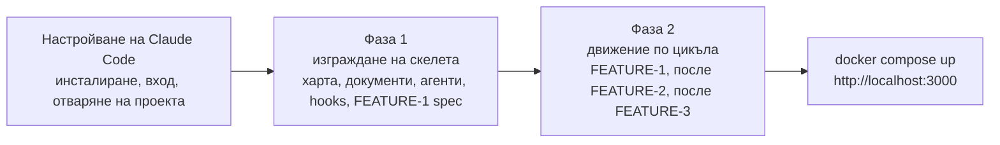
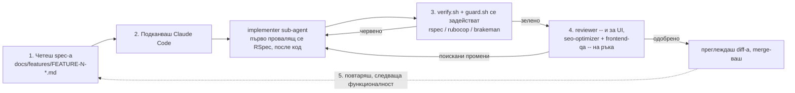

# rails-estore

**Смисълът на този проект не е да четеш готов код — а да го построиш сам, включително управляващия
(governance) слой.** Всичко, закачено тук — моделите, контролерите, изгледите, спецификациите и целият
управляващ слой `.claude/` — е **референтната цел**: това, което получаваш, ако инсталираш Claude
Code, използваш го, за да напишеш сам `CLAUDE.md`, документите, sub-agent-ите и hooks-овете, и чак
ТОГАВА преминеш през регистрация/вход → плащане → каталог през управлявания цикъл, който тези файлове
вече налагат. Този README е точно тази разходка, самостоятелна, за macOS: инсталирай Claude Code,
издигни с него управляващия скелет (хартата, документите architecture/definition-of-done, петте
sub-agent-а, hooks-овете и първия feature spec), СЛЕД това прочети този spec, подкани implementer-а,
наблюдавай как се задействат gate-овете, вземи независим ревю, повтори за всяка функционалност, и
накрая пусни построеното с `docker compose up`. Всичко, от което имаш нужда, е тук — независимо дали
си чел главата, за която този проект служи като работещ пример
([`04-ai-assisted-sdlc/03-worked-examples/03-rails-estore-sdlc.md`](../../03-rails-estore-sdlc.md) —
тя разказва същия цикъл от край до край, включително истински бъг с оторизация, който свеж reviewer
хвана, а три автоматизирани gate-а пропуснаха).

Два пътя през този файл: **„Настройване на Claude Code“**, после **„Построй го сам с Claude Code“**
по-долу — разделено на **Фаза 1** (издигни управляващия скелет) и **Фаза 2** (движи цикъла на
функционалностите, който той налага) — те те превеждат през построяването на този проект със
собствените ти ръце на клавиатурата: истинският смисъл. Ако предпочиташ първо да видиш крайната точка,
**„Най-бърз старт — Docker Compose“** пуска вече закачения код за под минута.

Всяка команда по-долу е обоснована и датирана 2026-09-04
(`docs/research/NOTE-SDLC-4-ADD-macos-setup.md`, `docs/research/NOTE-SDLC-4-ADD-1-gem-npm-versions.md`,
и `research/NOTE-SDLC-4-ADD3-claude-code.md` за секциите за Claude Code, проверени спрямо
[code.claude.com/docs](https://code.claude.com/docs) към 2026-09-04)
— провери актуалните версии, преди да разчиташ на това за нов проект; софтуерът се движи напред.

## Какво получаваш


Каталогът с продукти на `/products`, заснет **на живо от този проект, работещ под `docker compose
up`** (Docker 28.4.0 / Compose v2.39.2). Продуктова страница, с оторизационно-осъзнатата подкана
„Влезте, за да купите“, защото посетителят не е влязъл:


> Тези страници нарочно се пускат **без CSS** — това е учебен скелет, в който чист, семантичен,
> достъпен HTML е смисълът (точно това, което проверяват агентите `frontend-qa` и `seo-optimizer`).
> Стилизирането е естествена първа „vibe-engineering“ задача, веднъж щом си настроен. Страницата за
> вход живее на `/session/new` (`docs/screenshots/login.png`).

## Нов си в Docker? Започни оттук

Ако никога не си ползвал Docker, две идеи покриват всичко, от което имаш нужда за този проект:

- **Container**-ът е самостоятелна кутия, която носи приложението И точните версии на
  Ruby/Rails/SQLite с него — така проблемът „при мен работи“ изчезва, защото машината ти пуска само
  кутията, а не приложението директно. Мисли за него като за JAR файл, който пакетира собствената си
  JVM, а не само собствените си класове.
- **Image**-ът е чертежът само за четене, от който се стартира container (изграден веднъж с
  `docker build`, по инструкциите в `Dockerfile` на този проект); **container**-ът е работещ екземпляр
  на този image, по същия начин, по който обектът е екземпляр на клас.
- **Docker Compose** е слоят над отделния container: един файл `docker-compose.yml` описва
  услугата/услугите (service/services), от които се нуждае приложението (тук — само една: `web`) и
  как са свързани (кой порт към кой се мапва, къде се пази файлът с базата данни), така че една
  команда стартира всичко наведнъж, вместо дълга команда `docker run` с дузина флагове.

**Инсталиране на Docker Desktop на macOS** — свали `.dmg` файла за чипа на твоя Mac (Apple Silicon
или Intel) от [docs.docker.com/desktop/setup/install/mac-install](https://docs.docker.com/desktop/setup/install/mac-install/)
(проверено на 2026-09-04), отвори го и провлачи иконата на Docker в Applications; Docker Desktop се
поддържа на текущата версия на macOS и двете преди нея. Homebrew cask (`brew install --cask
docker`) е често срещана алтернатива, ако вече управляваш всичко останало през Homebrew, макар че
`.dmg` изтеглянето е това, което официалната документация на Docker описва. И в двата случая
**пусни Docker.app веднъж** след инсталирането — Compose говори с фонов daemon, който стартира само
докато приложението работи (търси иконата с кита в лентата с менюта).

Шепата команди, които реално ще ползваш, всяка вършеща по едно нещо:

| Command | Какво прави |
|---|---|
| `docker compose up` | Изгражда image-а (само първия път) и стартира приложението в терминала ти, с логове, течащи на живо. Добави `-d`, за да го пуснеш във фонов режим вместо това. |
| `docker compose ps` | Показва дали услугата `web` е вдигната и към кой порт е мапната. |
| `docker compose logs -f` | Следи логовете на работещия container на живо — полезно, ако си стартирал с `-d`. |
| `docker compose down` | Спира и премахва container-а. Добави `-v`, за да изтриеш и именувания volume, съдържащ базата данни SQLite (истинско рестартиране от нулата, не просто рестарт). |

След това отвори **<http://localhost:3000>** в браузър — това е.

**Защо това е лесният път:** нищо от §1 по-долу (Xcode Command Line Tools, Homebrew, rbenv,
подходяща версия на Ruby, `gem install rails`) не е нужно, ако тръгнеш по този начин. Docker носи
всичко това вътре в image-а; твоят Mac се нуждае само от самия Docker.

## Най-бърз старт — Docker Compose

```bash
docker compose up
```

След това отвори <http://localhost:3000> — ще видиш каталога с продукти, seed-нат с четири примерни
продукта. Това е пътят, който реално е билдван, пускан и верифициран за това допълнение — истински
изход от `docker compose build`, `docker compose up`, `curl` и `bundle exec rspec`, заснет спрямо
**Docker 28.4.0 / Docker Compose v2.39.2** на машината на автора, е в секцията за Docker на
[`artefacts/rails-validation-log.md`](../../artefacts/rails-validation-log.md) — за разлика от
останалата част на този Rails пример (коректна, но неизпълнявана в собственото repo на книгата,
тъй като там няма Ruby toolchain), тази част е единствената, реално изпробвана от край до край.

Всичко по-долу — настройването на Claude Code, построяването на този магазин сам през управлявания
цикъл, нативната настройка за macOS, отделните gate-ове, структурата на проекта и отстраняването на
проблеми — е за случаите, в които искаш да построиш (или пуснеш) това директно на своя Mac, с
достъпен debugger и вграден в редактора test runner, вместо само да гледаш готовия container.

## Настройване на Claude Code

Всичко в този проект — магазинът, спецификациите, управляващият скелет — се построява от **теб**,
докато управляваш [Claude Code](https://code.claude.com/docs/en/overview), агентния инструмент на
Anthropic за писане на код в терминала, проверен спрямо официалната му документация към 2026-09-04.
Насочи го към тази папка и той прави три неща, които обикновен чат прозорец не може: чете
[`CLAUDE.md`](CLAUDE.md) на този проект като постоянни инструкции при всяка сесия, разпраща
специализираните sub-agent-и в [`.claude/agents/`](.claude/agents/) — researcher, implementer,
reviewer, `seo-optimizer`, `frontend-qa` — вместо да прави всичко сам в едно недиференцирано
преминаване, и пуска gate-овете от [`.claude/hooks/`](.claude/hooks/) автоматично при всяка промяна,
така че счупен тест или изтекла тайна биват хванати още преди да видиш diff-а
[източник: `research/NOTE-SDLC-4-ADD3-claude-code.md`].

**Инсталиране.** Препоръчва се нативната инсталация — тя се обновява автоматично във фонов режим;
Homebrew (`brew install --cask claude-code`) и WinGet (`winget install Anthropic.ClaudeCode`) също
работят, но нито един от двата не се обновява автоматично, така че ще трябва сам да пускаш
`brew upgrade claude-code`
[източник: [Claude Code — Overview](https://code.claude.com/docs/en/overview) (проверено на
2026-09-04)]:

```bash
# macOS, Linux, WSL
curl -fsSL https://claude.ai/install.sh | bash
```

```powershell
# Windows PowerShell
irm https://claude.ai/install.ps1 | iex
```

**Влизане.**

```bash
claude
```

Първото пускане те подканва да се удостовериш през браузър — с абонамент Claude Pro, Max, Team или
Enterprise, или с акаунт в Claude Console (API). Ако вече си задал променливата на средата
`ANTHROPIC_API_KEY`, Claude Code пропуска подканата през браузър и вместо това те моли да одобриш
ключа. Идентификационните данни се запазват след това първо влизане; `/login` вътре в работеща сесия
сменя акаунти или удостоверява отново
[източник: [Claude Code — Quickstart](https://code.claude.com/docs/en/quickstart) (проверено на
2026-09-04)].

**Отваряне на този проект.**

```bash
cd code/rails-estore
claude
```

Claude Code чете [`CLAUDE.md`](CLAUDE.md) от тази директория (и от всяка директория над нея) в
началото на сесията — хартата на архитекта, която §2 на главата в книгата разглежда: златните
правила, gate-овете и кой sub-agent какво прави
[източник: [Claude Code — Memory](https://code.claude.com/docs/en/memory) (проверено на 2026-09-04)].

**Режими на разрешения — защо продължава да пита.** Claude Code пита, преди да пусне shell команди
или да редактира файлове, освен ако не си на план, при който **Auto mode** е по подразбиране за
интерактивни сесии (Pro/Max/Team — класификатор преглежда повечето действия, вместо да те подканва);
всички останали стартират в **Manual mode**, който пита всеки път. И в двата случая можеш да одобриш
действие еднократно, или да избереш „Yes, and don't ask again“, за да го запазиш като постоянно
правило за разрешение в `.claude/settings.local.json`
[източник: [Claude Code — Quickstart](https://code.claude.com/docs/en/quickstart) и
[Claude Code — Permissions](https://code.claude.com/docs/en/permissions) (и двете проверени на
2026-09-04)].

Това е вграденият слой. `guard.sh` на този проект седи **отдолу** него като твърда блокада, не като
подкана: той безусловно блокира шепа команди — `git commit --no-verify`, шаблон, наподобяващ жив
Stripe ключ, появил се в която и да е shell команда, `rm -rf /` — независимо от режима на разрешения,
в който си, или колко пъти си натискал „don't ask again“. Подканата за разрешение е чекпойнт, който
можеш да одобриш и да продължиш; ненулевият изход на `guard.sh` е стена.

С инсталиран Claude Code и отворен този проект, естественият следващ ход изглежда като да го помолиш
да построи функционалност. Не го прави — все още не. `guard.sh` е точно от файловете, които правят
останалата част от тази разходка безопасна, а той все още не съществува в проект, който тепърва
започваш от нулата. **„Построй го сам с Claude Code“ → Фаза 1**, по-долу, е мястото, където го
написваш (и всичко останало в `.claude/`) със собствената си ръка, преди изобщо да съществува `app/`
код, който да бъде проверяван (gate-нат).

## 1. Предварителни изисквания

| Tool | Защо ти трябва | Install |
|---|---|---|
| Xcode Command Line Tools | Компилира gems с native extensions (`sqlite3`, `bcrypt`, `nokogiri`, ако бъде издърпан транзитивно) — без него `bundle install` се проваля на първия gem с C код. | `xcode-select --install` |
| Homebrew | Мениджърът на пакети, през който минава всичко останало по-долу. | Виж [brew.sh](https://brew.sh) / [Homebrew install docs](https://docs.brew.sh/Installation) |
| rbenv + ruby-build | Инсталира и превключва версии на Ruby за отделен проект — еквивалентът в света на Ruby на мениджър на версии за Java (sdkman/jenv). | `brew install rbenv ruby-build` |
| Ruby 4.0.6 | Точната версия, която този Gemfile фиксира (`ruby "4.0.6"`). | `rbenv install 4.0.6 && rbenv global 4.0.6` |
| Rails 8.1.3.1 | Фиксираната версия на Rails за този проект — инсталира се като gem, след като Ruby е настроен. | `gem install rails -v 8.1.3.1` |
| Node.js 24 LTS | Нужен е само за стъпката Lighthouse CI на **frontend gate**-а (§6) — не е нужен за пускането на самото приложение. | `brew install node@24` |

**Бележка за Apple Silicon:** Homebrew инсталира под `/opt/homebrew` (не под `/usr/local`, който е
префиксът за Intel). Ако някога добавиш PostgreSQL или друга компилирана зависимост, насочи
`bundle config` към `/opt/homebrew/opt/<formula>` — виж Отстраняване на проблеми по-долу. Този проект
използва **SQLite**, който изобщо не се нуждае от такава конфигурация.

### 1a. Инициализирай rbenv в твоята обвивка (shell)

Добави това в `~/.zshrc` (обвивката по подразбиране на macOS е zsh; обърни внимание на аргумента
`zsh` — самостоятелното `rbenv init -` е bash формата и мълчаливо прави грешното нещо под zsh):

```bash
export PATH="$HOME/.rbenv/bin:$PATH"
eval "$(rbenv init - zsh)"
```

След това презареди обвивката (`source ~/.zshrc` или отвори нов таб в терминала) и провери:

```bash
rbenv versions
# should list 4.0.6 once you've run `rbenv install 4.0.6` above
```

## 2. Пусни проекта да работи

```bash
# From this directory (code/rails-estore/):
bundle install                       # resolves and installs every gem in the Gemfile
cp .env.example .env                 # copy the config template — fill in TEST-mode Stripe keys if
                                      # you want to exercise the real Stripe::Checkout::Session path;
                                      # STRIPE_STUB=true (the default) needs no Stripe account at all
bin/rails db:setup                   # creates db/development.sqlite3 + db/test.sqlite3, loads
                                      # db/schema.rb, and runs db/seeds.rb (a handful of sample
                                      # products so the catalog isn't empty on first load)
bin/rails server                     # starts the app at http://localhost:3000
```

Отвори <http://localhost:3000> — би трябвало да видиш каталога с продукти с четири seed-нати продукта
(чаша, тениска, пакет стикери, тефтер). Регистрирай се на `/registration`, добави нещо в количката и
завърши поръчката (checkout по подразбиране използва stub-натия път на `PaymentService` — без реален
Stripe акаунт, без реално таксуване, виж `app/services/payment_service.rb`).

**Защо SQLite:** той е по подразбиране в Rails 8, вграден е в macOS и не изисква никаква настройка на
сървър — правилният избор за първото пускане на този проект от приятел. `config/database.yml` вече е
конфигуриран за него; няма нищо друго за инсталиране. (Ако по-късно поискаш PostgreSQL за нещо
по-близко до продукционна настройка, `docs/research/NOTE-SDLC-4-ADD-macos-setup.md` §3 има пълната
последователност `brew install postgresql@16` + `libpq` + `bundle config build.pg` — извън обхвата
на този бърз старт.)

## Построй го сам с Claude Code

Това е цикълът, който главата в книгата разказва как се случва (§6) — сега с твоите ръце на
клавиатурата, в **две фази**. `bundle`/`rspec`/`rubocop`/`brakeman` трябва вече да са в твоя `PATH`
за целта (§1–2 по-горе) — Claude Code пуска всяка проверка през твоята обвивка, на твоята машина,
точно както прави [`verify.sh`](.claude/hooks/verify.sh); container, пускащ *готовото* приложение, не
дава на нито една от двете фази нещо, срещу което да проверява (gate), докато все още го строиш.



- **Фаза 1 — сам издигни агентния SDLC, първо.** Преди да помолиш Claude Code да построи дори една
  функционалност, ти построяваш нещото, което я управлява: хартата, документите, дефиниращи „готово“,
  списъка от sub-agent-и, hooks-овете и първия feature spec — същите четири скелетни примитива, които
  [SPEC-SDLC-1 (Theory)](../../../01-theory/01-theory.md) назовава абстрактно, приложени по начина, по
  който [SPEC-SDLC-2](../../01-java-sdlc-scaffold.md) вече ги приложи, за да изгради изцяло нов Java
  проект — само че този път ръката на клавиатурата е твоя, не разказ на глава.
- **Фаза 2 — построй функционалностите през цикъла, който току-що настрои.** Ритъмът от шест стъпки —
  прочети spec-а, подкани implementer-а, гледай как се задействат gate-овете, получи независим ревю,
  итерирай, повтори — сега работи върху скелета, произведен от Фаза 1. Точно това прави безопасно да
  оставиш *hands-off* участъците (цикъла на implementer-а редактирай-тествай-поправи, автоматичното
  задействане на gate-а) да текат без да разказваш всяко натискане на клавиш.

### Фаза 1 — сам издигни агентния SDLC, първо

Всеки файл, споменат по-долу, вече е закачен в тази папка. Чети всеки, който предстои да
(пре)създадеш, като **шаблон**, който адаптираш, а не като черна кутия, наследена непрочетена —
смисълът на тази фаза е да разбираш всяко правило, за което implementer-ът по-късно ще бъде държан
отговорен, защото ти си този, който го е написал. Това е редът, в който pipeline-ът реално се нуждае
от тях.

**1. Хартата — `CLAUDE.md`.** Единственият файл, който Claude Code чете в началото на всяка сесия в
тази директория, и във всяка директория над нея
[източник: [Claude Code — Memory](https://code.claude.com/docs/en/memory) (проверено на 2026-09-04)].
Той залага златните правила, които implementer-ът трябва да следва, преди да напише и ред `app/` код
— без код без одобрен feature spec, тестове преди имплементация, всяка заявка, обхваната от
`Current.user`, оторизирана, тайни само в `.env` — а точно под правилата, таблицата за model-routing,
назоваваща кой модел играе ролята на архитект/implementer/researcher/reviewer/специалист. Начален
prompt:

> Напиши чернова на `CLAUDE.md` за този Rails проект. Трябва да залага: (1) без `app/` код без одобрен
> feature spec в `docs/features/`, (2) провалящ се тест, написан и потвърден като провалящ се, преди
> какъвто и да е производствен код, който го удовлетворява, (3) всяко действие върху запис, обхванат от
> `Current.user`, трябва да бъде оторизирано — никога голо `Model.find(params[:id])`, (4) тайни никога
> не се комитват, само placeholder-и в `.env.example`. Добави секция за model-routing, назоваваща кой
> sub-agent се занимава с имплементация, кой с research, и кой с ревю.

Сравни резултата със закачения [`CLAUDE.md`](CLAUDE.md) — осем златни правила, таблица за
model-routing и секция за ескалация са формата, която си струва да запазиш в следващия stack, който
изграждаш, независимо на какъв език е.

**2. Формата и изходната летва — `docs/architecture.md` и `docs/definition-of-done.md`.**
`CLAUDE.md` залага правилата; тези два файла казват какво означава „готово“ и как частите си пасват —
ролите, workflow-ът от шест стъпки, структурата на repository-то и, в `definition-of-done.md`,
чекбокс за всеки критерий на gate-а, включително цяла секция **Security**, която моделът на заплахи
на този проект заслужава: оторизация, mass assignment, хеширане на пароли, никакви живи тайни.
Начален prompt:

> Напиши чернова на `docs/definition-of-done.md` за този проект като чеклист, не като проза. Всяка
> функционалност трябва да мине: всеки критерий за приемане изпълнен, провалящ се тест, написан преди
> кода, всяка версия на gem, обоснована с източник, изричен RSpec случай, доказващ, че всяка заявка,
> обхваната от `Current.user`, реално е обхваната, изричен RSpec случай, доказващ, че допълнителен
> параметър `admin` не може да бъде mass-assigned, нула High-confidence предупреждения от Brakeman, и
> подпис от независим ревю.

Сравни със закачените [`docs/definition-of-done.md`](docs/definition-of-done.md) и
[`docs/architecture.md`](docs/architecture.md).

**3. Sub-agent-ите — `.claude/agents/`.** Пет роли, написани една по една: `researcher` (Haiku,
обосновава външно твърдение, преди някой да разчита на него), `implementer` (Sonnet, пише
провалящия се тест, после кода), `reviewer` (свеж Sonnet — никога implementer-ът — проверяващ
вярност, ред тест-първо, и оторизация/mass-assignment на ръка), после двата специалисти, които това
допълнение добавя, `seo-optimizer` и `frontend-qa`. Написването на един такъв означава да напишеш
markdown файл с YAML frontmatter — `name`, `description` (изречението, което Claude Code използва, за
да реши кога да делегира на него), `tools` (кои tool извиквания му е позволено да прави), `model` —
последвано от номериран процес, завършващ с изричен договор **„изведи вердикт, не мержвай“** за
всичко, което ревюира, а не пише
[източник: [Claude Code — Sub-agents](https://code.claude.com/docs/en/sub-agents) (проверено на
2026-09-04)]. Можеш да помолиш Claude Code да напише файла вместо теб:

> Създай `reviewer` sub-agent в `.claude/agents/reviewer.md`. Той е СВЕЖ Sonnet reviewer — никога
> implementer-ът — само read-и-Bash (Read, Grep, Glob, Bash; без Edit/Write). Неговият процес: (1)
> съпостави всеки критерий за приемане с RSpec пример, (2) потвърди, че тестът е написан и провалящ се
> преди кода, (3) на ръка потвърди, че всяка заявка, обхваната от `Current.user`, реално е обхваната, а
> не голо `Model.find(params[:id])`, (4) на ръка потвърди, че всеки списък `permit()` е минимален, (5)
> независимо пусни отново `bundle exec rspec`/`rubocop`/`brakeman -q --no-summary`, вместо да се
> доверява на доклада на implementer-а. Трябва да завърши с вердикт — APPROVE или CHANGES REQUESTED —
> и НЕ трябва да комитва или мержва.

Веднъж написан, Claude Code извиква sub-agent по три начина: решава сам от заявка на естествен език
(„use the reviewer sub-agent to...“), принуждаваш го с `@`-споменаване (`@agent-reviewer ...`), или
пускаш цяла сесия срещу конкретен sub-agent с `claude --agent reviewer` или ключа `"agent"` в
`.claude/settings.json`
[източник: [Claude Code — Sub-agents](https://code.claude.com/docs/en/sub-agents) (проверено на
2026-09-04)]. Sub-agent-ите на проекта живеят в `.claude/agents/` именно за да бъдат вкарани във
version control и споделени със следващия човек, който отвори този проект; личен еднократен
sub-agent вместо това отива в `~/.claude/agents/` [същия източник]. Сравни своята чернова с петте,
закачени тук: [`researcher.md`](.claude/agents/researcher.md),
[`implementer.md`](.claude/agents/implementer.md), [`reviewer.md`](.claude/agents/reviewer.md),
[`seo-optimizer.md`](.claude/agents/seo-optimizer.md), [`frontend-qa.md`](.claude/agents/frontend-qa.md).

**4. Hooks-овете + `.claude/settings.json`.** Sub-agent-ът е консултативен — нищо не му пречи да
прескочи стъпка, ако никой не проверява. Hook-ът не е такъв: това е shell команда, която Claude Code
пуска автоматично в определена точка от своя жизнен цикъл, и ненулев изход от `PreToolUse` hook
реално **вето-ва** действието, вместо просто да се оплаче за него впоследствие
[източник: [Claude Code — Hooks](https://code.claude.com/docs/en/hooks) (проверено на 2026-09-04)].
Този проект свързва три: [`guard.sh`](.claude/hooks/guard.sh) на `PreToolUse` за `Bash` — твърдо
блокира `git commit --no-verify`, наглед жив Stripe ключ, `rm -rf /`, и принудителен push, преди
командата изобщо да се изпълни; [`verify.sh`](.claude/hooks/verify.sh) на `PostToolUse` за
`Edit|Write` — пуска `rspec`/`rubocop`/`brakeman` при всяка редакция на `.rb` файл, frontend gate-а
при всяка редакция на `.erb` файл; и [`context.sh`](.claude/hooks/context.sh) на `SessionStart` —
отпечатва състава и статуса на всеки feature spec, за да се ориентира свежа сесия.
`.claude/settings.json` е файлът, който свързва всеки скрипт с неговото събитие, три нива надолу —
събитието (`PreToolUse`), matcher (кой tool, напр. `Bash`), и handler-а
(`{"type": "command", "command": "..."}`) [същия източник]. Начален prompt:

> Напиши `.claude/hooks/guard.sh` — `PreToolUse` hook за `Bash`, който чете JSON-а на tool-call през
> stdin, извлича полето `command`, и излиза с 2 (блокиращо), ако командата съдържа `git commit
> --no-verify`, наглед жив Stripe ключ (`sk_live_`/`pk_live_`/`rk_live_`), `rm -rf /`, или принудителен
> `git push`. Иначе излиза с 0. После го свържи в `.claude/settings.json` под `PreToolUse` с `Bash`
> matcher.

Сравни своята чернова със закачените [`guard.sh`](.claude/hooks/guard.sh),
[`verify.sh`](.claude/hooks/verify.sh) и [`.claude/settings.json`](.claude/settings.json) —
съответно седем deny-правила, три gate команди и три свързани събития.

**5. Първият feature spec — `docs/features/FEATURE-1-user-login.md`.** Написан и одобрен ПРЕДИ да
съществува дори един `app/` файл — златно правило 1 от стъпка 1, сега реално приложено. Той залага
намерението (на посетителя му трябва акаунт, преди да има количка, която да завърши като поръчка) и
критериите за приемане като тестваеми твърдения — „`POST /registration` с допълнителен параметър
`admin: true` създава потребителя БЕЗ да задава `admin`“ — не проза, която ревюърът трябва да
тълкува. Начален prompt:

> Напиши чернова на `docs/features/FEATURE-1-user-login.md`: регистрация, вход, изход, използвайки
> формата на нативния auth генератор на Rails 8 (User + has_secure_password, Session, следена в базата
> данни, Current). Всеки критерий за приемане трябва да бъде тестваемо твърдение, включително такъв,
> доказващ, че непозволен параметър `admin` не може сам да се зададе, и такъв, доказващ, че съхраненият
> password digest никога не е равен на plaintext-а. Обоснови точната форма на auth генератора първо със
> researcher sub-agent-а — не я твърди по памет.

Сравни със закачения
[`docs/features/FEATURE-1-user-login.md`](docs/features/FEATURE-1-user-login.md) — шест критерия за
приемане, всеки — тестваемо твърдение, всеки — проследим до RSpec пример, след като Фаза 2 го
построи.

**Защо това е стъпка едно, не стъпка нула.** Всеки „hands-off“ участък във Фаза 2 по-долу —
implementer-ът, итериращ сам, докато gate-ът стане зелен, вердикт на reviewer, който не се налага да
подлагаш на съмнение ред по ред — е безопасен само защото тези пет файла съществуват и са написани с
намерение, не копирани слепешката. `CLAUDE.md`, който не си написал сам, е правило, за което всъщност
не знаеш дали се спазва; `guard.sh`, който не си чел, е стена, на която се доверяваш невиждано.
Издигни го сам веднъж, тук, и следващият проект, който изградиш с Claude Code, ще тръгне от файлове,
които наистина разбираш.

### Фаза 2 — построй функционалностите през цикъла, който току-що настрои

След като `CLAUDE.md`, документите, петте sub-agent-а, hooks-овете и spec-ът на FEATURE-1 вече стоят
издигнати (Фаза 1), същият ритъм от шест стъпки се повтаря за всяка функционалност — работещ върху
правила, които ти си написал, не наследени: **ти управляваш, implementer-ът строи tests-first,
gate-овете се задействат, свеж reviewer — а за UI функционалности, и двама специалисти — хваща това,
което ти би пропуснал, ти решаваш.**



**1. Прочети feature spec-а.** Отвори
[`docs/features/FEATURE-1-user-login.md`](docs/features/FEATURE-1-user-login.md). Неговите шест
критерия за приемане са договорът — не предложение, което implementer-ът може да закръгли. Прочети
ги всичките, преди да подканиш каквото и да е; ти си този, който предстои да прецени дали diff-ът
наистина удовлетворява AC3 („допълнителен параметър `admin` НЕ трябва да може да се задава“), не
инструментът, който го е написал.

**2. Помоли Claude Code да го имплементира.** Конкретен начален prompt:

> Имплементирай FEATURE-1 (`docs/features/FEATURE-1-user-login.md`). Използвай implementer
> sub-agent-а: първо напиши провалящите се RSpec примери за всичките шест критерия за приемане,
> потвърди, че всеки се проваля по правилната причина (поведението още не съществува, не е печатна
> грешка), после напиши Rails 8 native-auth кода, който ги прави успешни. Пусни целия gate — rspec,
> rubocop, brakeman — преди да ми кажеш, че е готово.

Claude Code или разпраща `implementer.md` сам (естествен език — решава, че sub-agent-ът е
релевантен), или можеш да го принудиш с @-споменаване (`@agent-implementer ...`)
[източник: [Claude Code — Sub-agents](https://code.claude.com/docs/en/sub-agents) (проверено на
2026-09-04)]. И в двата случая очаквай да видиш как RSpec файлът каца първи, се пуска и се проваля —
това е правилно, не счупено; тест, който никога не се е провалял, все още не е доказал нищо.

**3. Наблюдавай как се задействат gate-овете.** Всеки път, когато implementer-ът редактира `.rb`
файл, [`verify.sh`](.claude/hooks/verify.sh) пуска `bundle exec rspec`, после `rubocop`, после
`brakeman -q --no-summary`, автоматично — ще видиш командите и техния изход да текат покрай теб.
**Червен** gate изглежда като провалящ се брой spec-ове (`6 examples, 6 failures` веднага след като
implementer-ът комитне RSpec файла — очаквано) или нарушение на RuboCop (действие на контролер над
лимита от 15 реда `Metrics/MethodLength`, §5 на главата); и в двата случая implementer-ът вижда същия
изход като теб и итерира, докато всяка проверка стане зелена. Отделно,
[`guard.sh`](.claude/hooks/guard.sh) се задейства при всяка shell команда *преди* тя да се изпълни —
ако implementer-ът някога опита `git commit --no-verify` или команда, съдържаща наглед жив Stripe
ключ, `guard.sh` излиза с ненулев код и командата никога не се изпълнява. **Зелен gate е необходим, но
не достатъчен — стъпка 4 е причината.**

**4. Вземи независим ревю.** Веднъж gate-ът е зелен:

> Използвай reviewer sub-agent-а, за да ревюира diff-а на FEATURE-1 спрямо критериите за приемане на
> spec-а. Провери оторизацията и mass assignment на ръка, не само изхода на gate-а.

Това е стъпката, която хваща онова, което RSpec/RuboCop/Brakeman структурно не могат. Собственото
изпълнение на FEATURE-2 в главата (§6) е реалният пример: и трите gate-а докладваха чисто на
`Order.find(params[:id])` — IDOR, който позволява на всеки логнат потребител да прочете чужда
поръчка — защото нито един от трите инструмента няма проверка за „това данните на правилния
потребител ли са“, само reviewer, инструктиран да провери на ръка, я има. За UI-ориентирана
функционалност (каталогът, FEATURE-3), разпрати другите двама специалисти заедно с общия reviewer:

> FEATURE-3 е готов за ревю. Разпрати `seo-optimizer` и `frontend-qa` паралелно върху страниците на
> каталога с продукти, заедно с общия reviewer. Докладвай всеки вердикт поотделно.

`frontend-qa` е този, който хваща поле за търсене, пуснато с `placeholder` вместо `<label>` (axe
правило `label`, impact critical); `seo-optimizer` е този, който хваща продуктова страница, пусната
без никакъв `<script type="application/ld+json">` Product блок изобщо — и двата реални дефекта,
които §6 на главата разказва във FEATURE-3 разходката, и двата невидими за
`rspec`/`rubocop`/`brakeman`. Когато reviewer поиска промени, това не е триене, около което да
заобикаляш — кажи на Claude Code да приложи поправката, нека implementer-ът адресира конкретния
посочен ред, и пусни gate-а отново. **Ти** решаваш кога diff реално се мержва; никой sub-agent не
мержва вместо теб.

**5. Повтори за FEATURE-2 и FEATURE-3.** Същите шест стъпки, същият ритъм —
[`docs/features/FEATURE-2-checkout.md`](docs/features/FEATURE-2-checkout.md), после
[`docs/features/FEATURE-3-product-catalog-seo-a11y.md`](docs/features/FEATURE-3-product-catalog-seo-a11y.md).
Нищо в цикъла не се променя; променя се само срещу кой клас дефекти пазят критериите за приемане на
всеки spec.

**6. Пусни това, което построи.**

```bash
docker compose up
```

Отвори <http://localhost:3000> — витрината в скрийншота в началото на този файл е това, което
напълно управлявано изпълнение на този цикъл произвежда.

### Как да управляваш добре

- **Бъди конкретен и сочи към spec-а.** „Имплементирай FEATURE-1“ плюс критериите му за приемане
  побеждава „добави login“ — провалящите се тестове на implementer-а са толкова добри, колкото
  договорът, който му подаваш.
- **Остави gate-овете и reviewer-ите да хващат нещата.** Не проверявай на ръка всяко RuboCop правило
  сам — за това е `verify.sh`. Похарчи вниманието си върху преценките, които нищо автоматизирано не
  прави, което е точно причината проверките „на ръка“ от стъпка 4 да съществуват — за да ти ги
  извадят на повърхността.
- **Ревюирай всеки diff сам, всеки път.** **APPROVE** от reviewer е силен сигнал, не бутон за merge —
  ти си този, който решава дали промяна реално каца, същата роля на архитект, която описва
  [`CLAUDE.md`](CLAUDE.md).

**Честни бележки.** Изходите на модела варират от пускане до пускане — твоят собствен опит с
FEATURE-2 може да пусне IDOR-а, описан в главата, а може и да не го направи; и в двата случая
стъпката с reviewer е тази, която прави цикъла безопасен, не обещание, че първата чернова вече е
правилна. Ти оставаш в цикъла на всяка точка на решение — одобри, отхвърли, мержни — което е точно
причината да е безопасно да оставиш *hands-off* участъците да текат без сам да разказваш всяко
натискане на клавиш: цикълът на implementer-а редактирай-тествай-поправи вътре в стъпка 2, и
автоматичното задействане на gate-а вътре в стъпка 3.

## 3. Пусни всеки gate

Всяко от тях е това, което `.claude/hooks/verify.sh` пуска автоматично при всяка редакция на файл,
когато управляваш този проект през Claude Code — разходката по-горе вече показа как се задействат на
живо; пускането им на ръка тук са същите проверки, при поискване.

| Command | За какво служи |
|---|---|
| `bundle exec rspec` | Целият test suite — всеки критерий за приемане от `docs/features/FEATURE-*.md` има успешен пример тук. |
| `bundle exec rubocop` | Стил/lint — налага и правилото на този проект „контролерите остават тънки“ (`Metrics/MethodLength: 15`), защото действие на контролер, твърде дълго, за да се прочете с един поглед, е такова, което reviewer не може да провери за оторизация с око. |
| `bundle exec brakeman -q --no-summary` | Статичен security скан — mass assignment, SQL injection, XSS и още. Трябва да докладва нула High-confidence предупреждения. |

```bash
bundle exec rspec
bundle exec rubocop
bundle exec brakeman -q --no-summary
```

### Frontend gate-ът (ново в това допълнение — SEO + достъпност)

Каталогът с продукти на този проект (`/products`) минава през два допълнителни специализирани
reviewer-и, [`seo-optimizer.md`](.claude/agents/seo-optimizer.md) и
[`frontend-qa.md`](.claude/agents/frontend-qa.md), подкрепени от реални инструменти. Проверките на
`frontend-qa` се нуждаят от **истински браузър** — `rack_test` (драйверът по подразбиране на
Capybara, без JS) не може да пуска JavaScript, а axe *е* JavaScript библиотека, която се инжектира в
страницата и се оценява:

```bash
brew install --cask google-chrome     # if you don't already have Chrome
brew install chromedriver             # the WebDriver binary Selenium talks to
```

| Command | За какво служи |
|---|---|
| `bundle exec rspec spec/system/accessibility_spec.rb` | axe (`axe-core-rspec`/`axe-core-capybara`, `be_axe_clean`) — нула автоматизирани WCAG 2.1 AA нарушения на страниците на каталога. Хваща ~30–40% от реалните проблеми с достъпността; все още не е заместител на тестване с реална помощна технология. |
| `bundle exec rspec spec/system/seo_spec.rb` | Уникален `<title>` за всяка страница, изискваните Open Graph тагове, и валиден schema.org Product JSON-LD. |
| `bundle exec rake html_proofer:check` | html-proofer — рендва страниците на каталога в `tmp/html_proofer/` и проверява за счупени вътрешни линкове, невалиден HTML, и липсващи `alt` атрибути. |

```bash
bundle exec rspec spec/system/accessibility_spec.rb spec/system/seo_spec.rb
bundle exec rake html_proofer:check
```

**Lighthouse CI (`@lhci/cli` 0.15.1, Node) — референтен gate, не е задължителен за разработката на
това приложение:**

```bash
npm install                 # installs @lhci/cli from package.json
bin/rails server -p 3000 &  # lhci's own config (.lighthouserc.json) starts/stops this for you too —
                             # this line is only if you want the server up for manual poking as well
npx lhci autorun             # audits SEO/performance/accessibility/best-practices against .lighthouserc.json
```

`npx lhci autorun` е точно затова, за което е — одит с второ мнение, за цялата страница
performance/SEO/accessibility — не заместител на проверките, задвижвани от RSpec по-горе, което е
причината `.claude/hooks/verify.sh` да го споменава в своя изход, но да не го извиква (той е скрипт
само за Ruby; Lighthouse CI е Node инструмент със собствен toolchain).

## 4. Структура на проекта

```
app/
  controllers/   sessions, registrations, products, carts, line_items, checkout/orders
  models/        User, Session, Current, Product, Cart, LineItem, Order
  services/      PaymentService (the Stripe integration seam, stubbed in test/dev by default)
  helpers/       ProductsHelper (schema.org JSON-LD builders)
  views/         layouts/application.html.erb + one view per controller action
config/
  routes.rb, database.yml, sitemap.rb
db/
  schema.rb (hand-maintained snapshot), seeds.rb
docs/
  architecture.md, definition-of-done.md, features/FEATURE-*.md
spec/
  models/, requests/, system/ — RSpec examples, one file per feature area
.claude/
  agents/   researcher · implementer · reviewer · seo-optimizer · frontend-qa
  hooks/    guard.sh (PreToolUse) · verify.sh (PostToolUse) · context.sh (SessionStart)
public/robots.txt, Gemfile, .rubocop.yml, .env.example, .lighthouserc.json, package.json
```

## 5. Отстраняване на проблеми

**„xcrun: error: invalid active developer path“ / `bundle install` се проваля при компилиране на
native gem.**
Xcode Command Line Tools не са инсталирани (или са премахнати от ъпдейт на macOS). Пусни
`xcode-select --install`, изчакай ~500MB изтегляне, после опитай отново.

**`bundle install` се проваля на `sqlite3` или друг gem с C extension.**
Почти винаги липсват Command Line Tools (по-горе). Ако продължава, несъответствия от типа
`rbenv exec gem pdk` между Ruby-то на обвивката ти и това на rbenv могат да са причината — потвърди,
че `which ruby` сочи вътре в `~/.rbenv/versions/4.0.6/...`, а не към `/usr/bin/ruby` (системният Ruby
на macOS, който никога не трябва да ползваш за разработка на приложения).

**Apple Silicon (M-серия) и бъдеща зависимост от Postgres/друга компилирана библиотека.**
Префиксът на Homebrew е `/opt/homebrew` на Apple Silicon (`/usr/local` на Intel). Ако бъдещ gem се
нуждае от `bundle config build.<gem> --with-<lib>-dir=...`, насочи го към
`/opt/homebrew/opt/<formula>`, не към `/usr/local/opt/<formula>` — SQLite по подразбиране на този
проект не изисква такава стъпка, но това е капан №1, ако някога смениш с PostgreSQL
(`docs/research/NOTE-SDLC-4-ADD-macos-setup.md` §3 има пълната последователност).

**`rbenv: version '4.0.6' is not installed` дори след `rbenv install 4.0.6`.**
Обвивката ти още не е прихванала shims-ите на rbenv — потвърди, че редът от §1a
`eval "$(rbenv init - zsh)"` реално е в `~/.zshrc` (не закоментиран — предишно закоментиран ред на
rbenv може да накара rbenv да пропусне повторното инициализиране) и отвори свеж таб в терминала.

**`bundle exec rspec spec/system/*.rb` дава грешка от рода на „unable to find chromedriver“ или
отказана WebDriver връзка.**
Проверките на `frontend-qa` се нуждаят от Chrome + подходящ `chromedriver` в `PATH` (§3).
`bundle exec rspec` без аргумент за път (само model/request специфи) изобщо не се нуждае от браузър —
пусни го първо, за да потвърдиш, че останалата част от приложението е здрава, преди да отстраняваш
проблеми с браузър-задвижваните специфи.

**`npx lhci autorun` увисва или не успява да стартира сървъра.**
`startServerCommand` на `.lighthouserc.json` сам пуска `bin/rails server -p 3000` — ако порт 3000
вече се използва (напр. си оставил `bin/rails server` да работи от §2), спри първо този процес или
промени порта както в `.lighthouserc.json`, така и в командата, която пускаш.

## 6. Какво следва

Ако следва „Построй го сам с Claude Code“ по-горе — скелета на Фаза 1 и цикъла на Фаза 2 — вече си
построил това сам, включително управляващия слой: прочети главата от книгата следващо, за да видиш
същите хващания, разказани изцяло, включително частите, които може да са минали различно при твоето
изпълнение:
[`04-ai-assisted-sdlc/03-worked-examples/03-rails-estore-sdlc.md`](../../03-rails-estore-sdlc.md) —
тя разхожда управлявания цикъл (spec → обосновка → имплементация → gate → ревю → merge) през точно
този codebase, включително истинския бъг с оторизация, който свеж reviewer хвана, а RSpec, RuboCop и
Brakeman всичките докладваха чисто, и истинските пропуски в достъпността/SEO, които
`frontend-qa`/`seo-optimizer` хванаха, а нито един от тези инструменти изобщо не е бил построен да
проверява.
