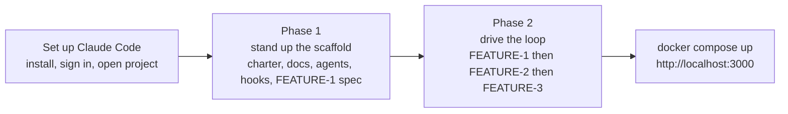
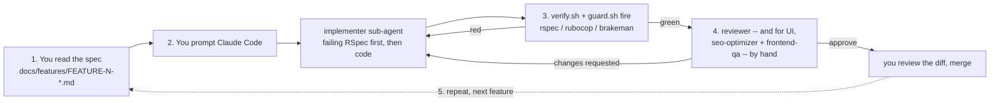

# rails-estore

**The point of this project is not to read finished code — it's to build it yourself, governance
layer included.** Everything committed here — the models, controllers, views, specs, and the whole
`.claude/` governance layer — is the **reference destination**: what you get if you install Claude
Code, use it to author `CLAUDE.md`, the docs, the sub-agents, and the hooks yourself, and only THEN
drive sign-up/login → checkout → catalog through the governed loop those files now enforce. This
README is that walkthrough, standalone, for macOS: install Claude Code, stand up the governance
scaffold with it (the charter, the architecture/definition-of-done docs, the five sub-agents, the
hooks, and the first feature spec), THEN read that spec, prompt the implementer, watch the gates
fire, get an independent review, repeat for every feature, and finally run what you built with
`docker compose up`. Everything you need is here whether or not you've read the chapter this project
ships as a worked example for
([`04-ai-assisted-sdlc/03-worked-examples/03-rails-estore-sdlc.md`](../../03-rails-estore-sdlc.md) —
it narrates the same loop end to end, including a real authorization bug a fresh reviewer caught that
three automated gates missed).

Two ways through this file: **"Set up Claude Code"**, then **"Build it yourself with Claude
Code"** below — split into **Phase 1** (stand up the governance scaffold) and **Phase 2** (drive the
feature loop it enforces) — walk you through building this project with your own hands on the
keyboard: the actual point. If you'd rather see the destination first, **"Quickest start — Docker
Compose"** runs the already-committed code in under a minute.

Every command below is grounded and dated 2026-09-04
(`docs/research/NOTE-SDLC-4-ADD-macos-setup.md`, `docs/research/NOTE-SDLC-4-ADD-1-gem-npm-versions.md`,
and `research/NOTE-SDLC-4-ADD3-claude-code.md` for the Claude Code sections, verified against
[code.claude.com/docs](https://code.claude.com/docs) as of 2026-09-04)
— re-check current versions before you rely on this for a new project; software moves.

## What you get


The product catalog at `/products`, captured **live from this project running under `docker compose up`**
(Docker 28.4.0 / Compose v2.39.2). A product page, with the authorization-aware "Sign in to buy"
prompt because the visitor is not signed in:


> These pages ship **no CSS on purpose** — this is a teaching scaffold where clean, semantic,
> accessible HTML is the point (exactly what the `frontend-qa` and `seo-optimizer` agents check).
> Styling is a natural first "vibe-engineering" task once you're set up. The sign-in page lives at
> `/session/new` (`docs/screenshots/login.png`).

## New to Docker? Start here

If you've never used Docker, two ideas cover everything you need for this project:

- A **container** is a self-contained box that carries the app AND its exact Ruby/Rails/SQLite
  versions with it — so "works on my machine" stops being a problem, because your machine only runs
  the box, not the app directly. Think of it as a JAR that packages its own JVM, not just its own
  classes.
- An **image** is the read-only blueprint a container is started from (built once by `docker build`,
  from the instructions in this project's `Dockerfile`); a **container** is a running instance of
  that image, the way an object is an instance of a class.
- **Docker Compose** is the layer above a single container: one `docker-compose.yml` file describes
  the service(s) an app needs (here, just one: `web`) and how they're wired together (which port maps
  to which, where the database file persists), so one command starts the whole thing instead of a
  long `docker run` invocation with a dozen flags.

**Installing Docker Desktop on macOS** — download the `.dmg` for your Mac's chip (Apple Silicon or
Intel) from [docs.docker.com/desktop/setup/install/mac-install](https://docs.docker.com/desktop/setup/install/mac-install/)
(checked 2026-09-04), open it, and drag the Docker icon into Applications; Docker Desktop is
supported on the current macOS release and the two before it. A Homebrew cask (`brew install --cask
docker`) is a common alternative if you already manage everything else through Homebrew, though the
`.dmg` download is what Docker's own docs walk through. Either way, **launch Docker.app once** after
installing — Compose talks to a background daemon that only starts when the app is running (look for
the whale icon in the menu bar).

The handful of commands you'll actually use, each doing one thing:

| Command | What it does |
|---|---|
| `docker compose up` | Builds the image (first time only) and starts the app in your terminal, logs streaming live. Add `-d` to run it in the background instead. |
| `docker compose ps` | Shows whether the `web` service is up and which port it's mapped to. |
| `docker compose logs -f` | Tails the running container's logs — useful if you started with `-d`. |
| `docker compose down` | Stops and removes the container. Add `-v` to also delete the named volume holding the SQLite database (a real reset, not just a restart). |

Then open **<http://localhost:3000>** in a browser — that's it.

**Why this is the easygoing path:** nothing in §1 below (Xcode Command Line Tools, Homebrew, rbenv,
a matching Ruby, `gem install rails`) is needed when you run this way. Docker carries all of it
inside the image; your Mac only needs Docker itself.

## Quickest start — Docker Compose

```bash
docker compose up
```

Then open <http://localhost:3000> — the product catalog, seeded with four sample products, is what
you'll see. This is the path actually built, run, and verified for this addendum — real `docker
compose build`, `docker compose up`, `curl`, and `bundle exec rspec` output, captured against
**Docker 28.4.0 / Docker Compose v2.39.2** on the authoring machine, is in
[`artefacts/rails-validation-log.md`](../../artefacts/rails-validation-log.md)'s Docker section —
unlike the rest of this Rails example (correct-but-not-executed in the book's own repo, since no
Ruby toolchain runs there), this is the one part that was genuinely exercised end-to-end.

Everything below — setting up Claude Code, building this store yourself through the governed loop,
native macOS setup, the individual gates, project layout, and troubleshooting — is for when you want
to build (or run) this directly on your Mac, with a debugger and an editor's inline test runner
available, rather than only look at the finished container.

## Set up Claude Code

Everything in this project — the store, the specs, the governance scaffold — gets built by **you**,
steering [Claude Code](https://code.claude.com/docs/en/overview), Anthropic's agentic coding tool for
the terminal, checked against its official docs 2026-09-04. Point it at this folder and it does three
things a plain chat window can't: it reads this project's [`CLAUDE.md`](CLAUDE.md) as persistent
instructions every session, it dispatches the specialist sub-agents in
[`.claude/agents/`](.claude/agents/) — researcher, implementer, reviewer, `seo-optimizer`,
`frontend-qa` — instead of doing everything itself in one undifferentiated pass, and it runs the
[`.claude/hooks/`](.claude/hooks/) gates automatically on every edit, so a broken test or a leaked
secret gets caught before you even see the diff [source: `research/NOTE-SDLC-4-ADD3-claude-code.md`].

**Install.** Native install is recommended — it auto-updates in the background; Homebrew
(`brew install --cask claude-code`) and WinGet (`winget install Anthropic.ClaudeCode`) both work too,
but neither auto-updates, so you'd run `brew upgrade claude-code` yourself
[source: [Claude Code — Overview](https://code.claude.com/docs/en/overview) (checked 2026-09-04)]:

```bash
# macOS, Linux, WSL
curl -fsSL https://claude.ai/install.sh | bash
```

```powershell
# Windows PowerShell
irm https://claude.ai/install.ps1 | iex
```

**Sign in.**

```bash
claude
```

First run prompts you to authenticate in a browser — a Claude Pro, Max, Team, or Enterprise
subscription, or a Claude Console (API) account. If you've already set the `ANTHROPIC_API_KEY`
environment variable, Claude Code skips the browser prompt and asks you to approve the key instead.
Credentials are stored after that first login; `/login` inside a running session switches accounts or
re-authenticates
[source: [Claude Code — Quickstart](https://code.claude.com/docs/en/quickstart) (checked 2026-09-04)].

**Open this project.**

```bash
cd code/rails-estore
claude
```

Claude Code reads [`CLAUDE.md`](CLAUDE.md) from this directory (and any directory above it) at the
start of the session — the architect charter the book chapter's §2 walks through: the golden rules,
the gates, and which sub-agent does what
[source: [Claude Code — Memory](https://code.claude.com/docs/en/memory) (checked 2026-09-04)].

**Permission modes — why it keeps asking.** Claude Code asks before it runs shell commands or edits
files, unless you're on a plan where **Auto mode** is the default for interactive sessions
(Pro/Max/Team — a classifier reviews most actions instead of prompting you); everyone else starts in
**Manual mode**, which asks every time. Either way, you can approve an action once, or choose "Yes,
and don't ask again" to save it as a standing allow rule in `.claude/settings.local.json`
[source: [Claude Code — Quickstart](https://code.claude.com/docs/en/quickstart) and
[Claude Code — Permissions](https://code.claude.com/docs/en/permissions) (both checked 2026-09-04)].

That's the built-in layer. This project's [`guard.sh`](.claude/hooks/guard.sh) sits **underneath** it
as a hard block, not a prompt: it vetoes a handful of commands outright — `git commit --no-verify`, a
live-looking Stripe key pattern appearing in any shell command, `rm -rf /` — regardless of which
permission mode you're in or how many times you've clicked "don't ask again." A permission prompt is
a checkpoint you can approve past; `guard.sh`'s non-zero exit is a wall.

With Claude Code installed and this project open, the natural next move feels like asking it to build
a feature. Don't — not yet. `guard.sh` is exactly the kind of file that makes the rest of this
walkthrough safe, and it doesn't exist yet on a project you're starting from scratch. **"Build it
yourself with Claude Code" → Phase 1**, below, is where you author it (and everything else in
`.claude/`) with your own hand, before any `app/` code exists to gate.

## 1. Prerequisites

| Tool | Why you need it | Install |
|---|---|---|
| Xcode Command Line Tools | Compiles native-extension gems (`sqlite3`, `bcrypt`, `nokogiri` if pulled in transitively) — without it `bundle install` fails on the first gem with C code. | `xcode-select --install` |
| Homebrew | The package manager everything else below comes through. | See [brew.sh](https://brew.sh) / [Homebrew install docs](https://docs.brew.sh/Installation) |
| rbenv + ruby-build | Installs and switches Ruby versions per-project — the Ruby equivalent of a Java version manager (sdkman/jenv). | `brew install rbenv ruby-build` |
| Ruby 4.0.6 | The exact version this Gemfile pins (`ruby "4.0.6"`). | `rbenv install 4.0.6 && rbenv global 4.0.6` |
| Rails 8.1.3.1 | This project's pinned Rails version — installed as a gem once Ruby is set up. | `gem install rails -v 8.1.3.1` |
| Node.js 24 LTS | Only needed for the **frontend gate**'s Lighthouse CI step (§6) — not required to run the app itself. | `brew install node@24` |

**Apple Silicon note:** Homebrew installs under `/opt/homebrew` (not `/usr/local`, which is the Intel
prefix). If you ever add PostgreSQL or another compiled dependency, point `bundle config` at
`/opt/homebrew/opt/<formula>` — see Troubleshooting below. This project uses **SQLite**, which needs
no such configuration at all.

### 1a. Initialize rbenv in your shell

Add this to `~/.zshrc` (macOS's default shell is zsh; note the `zsh` argument — `rbenv init -` alone
is the bash form and silently does the wrong thing under zsh):

```bash
export PATH="$HOME/.rbenv/bin:$PATH"
eval "$(rbenv init - zsh)"
```

Then reload your shell (`source ~/.zshrc` or open a new terminal tab) and confirm:

```bash
rbenv versions
# should list 4.0.6 once you've run `rbenv install 4.0.6` above
```

## 2. Get the project running

```bash
# From this directory (code/rails-estore/):
bundle install                       # resolves and installs every gem in the Gemfile
cp .env.example .env                 # copy the config template — fill in TEST-mode Stripe keys if
                                      # you want to exercise the real Stripe::Checkout::Session path;
                                      # STRIPE_STUB=true (the default) needs no Stripe account at all
bin/rails db:setup                   # creates db/development.sqlite3 + db/test.sqlite3, loads
                                      # db/schema.rb, and runs db/seeds.rb (a handful of sample
                                      # products so the catalog isn't empty on first load)
bin/rails server                     # starts the app at http://localhost:3000
```

Open <http://localhost:3000> — you should see the product catalog with four seeded products (a mug,
a T-shirt, a sticker pack, a notebook). Sign up at `/registration`, add something to your cart, and
check out (checkout uses `PaymentService`'s stubbed path by default — no real Stripe account, no real
charge, see `app/services/payment_service.rb`).

**Why SQLite:** it's the Rails 8 default, built into macOS, and needs zero server setup — the right
choice for a friend's first run of this project. `config/database.yml` is already configured for it;
nothing else to install. (If you later want PostgreSQL for something closer to a production setup,
`docs/research/NOTE-SDLC-4-ADD-macos-setup.md` §3 has the full `brew install postgresql@16` +
`libpq` + `bundle config build.pg` sequence — out of scope for this quick-start.)

## Build it yourself with Claude Code

This is the loop the book chapter narrates happening (§6) — now with your hands on the keyboard, in
**two phases**. `bundle`/`rspec`/`rubocop`/`brakeman` need to already be on your `PATH` for this
(§1–2 above) — Claude Code runs every check through your shell, on your machine, exactly the way
[`verify.sh`](.claude/hooks/verify.sh) does; a container running the *finished* app doesn't give
either phase anything to gate against while you're still building it.



- **Phase 1 — stand up the agentic SDLC yourself, first.** Before you ask Claude Code to build a
  single feature, you build the thing that governs it: the charter, the docs that define "done," the
  sub-agent roster, the hooks, and the first feature spec — the same four scaffolding primitives
  [SPEC-SDLC-1 (Theory)](../../../01-theory/01-theory.md) names in the abstract, applied the way
  [SPEC-SDLC-2](../../01-java-sdlc-scaffold.md) already applied them to scaffold a brand-new Java
  project — except this time it's your hand on the keyboard, not a chapter's narration.
- **Phase 2 — build the features through the loop you just set up.** The six-step rhythm — read the
  spec, prompt the implementer, watch the gates fire, get an independent review, iterate, repeat —
  now runs on the scaffold Phase 1 produced. This is what makes the *hands-off* stretches (the
  implementer's edit-test-fix cycle, the gate firing automatically) safe to let run without narrating
  every keystroke.

### Phase 1 — stand up the agentic SDLC yourself, first

Every file named below is already committed in this folder. Read each one you're about to
(re-)create as the **template** you're adapting, not a black box you inherit unread — the point of
this phase is that you understand every rule your implementer will later be held to, because you're
the one who wrote it. This is the order the pipeline actually needs them in.

**1. The charter — `CLAUDE.md`.** The one file Claude Code reads at the start of every session in
this directory, and any directory above it
[source: [Claude Code — Memory](https://code.claude.com/docs/en/memory) (checked 2026-09-04)]. It
states the golden rules an implementer must follow before it writes a line of `app/` code — no code
without an approved feature spec, tests before implementation, every `Current.user`-scoped query
authorized, secrets only ever in `.env` — and, right below the rules, the model-routing table naming
which model plays architect/implementer/researcher/reviewer/specialist. A starting prompt:

> Draft a `CLAUDE.md` for this Rails project. It must state: (1) no `app/` code without an approved
> feature spec in `docs/features/`, (2) a failing test is written and confirmed failing before any
> production code that satisfies it, (3) every action on a `Current.user`-scoped record must be
> authorized — never a bare `Model.find(params[:id])`, (4) secrets are never committed, only
> placeholders in `.env.example`. Add a model-routing section naming which sub-agent handles
> implementation vs. research vs. review.

Compare what comes back against the committed [`CLAUDE.md`](CLAUDE.md) — eight golden rules, a
model-routing table, and an escalation section are the shape worth keeping on the next stack you
scaffold, whatever language it's in.

**2. The shape and the exit bar — `docs/architecture.md` and `docs/definition-of-done.md`.**
`CLAUDE.md` states the rules; these two say what "done" means and how the pieces fit together — the
roles, the six-step workflow, the repository shape, and, in `definition-of-done.md`, a checkbox per
gate criterion, including a whole **Security** section this project's threat model earns:
authorization, mass assignment, password hashing, no live secrets. A starting prompt:

> Draft `docs/definition-of-done.md` for this project as a checklist, not prose. Every feature must
> pass: every acceptance criterion met, a failing test written before the code, every gem version
> grounded to a source, an explicit RSpec case proving every `Current.user`-scoped query is actually
> scoped, an explicit RSpec case proving an extra `admin` param can't be mass-assigned, zero
> High-confidence Brakeman warnings, and independent review sign-off.

Compare against the committed [`docs/definition-of-done.md`](docs/definition-of-done.md) and
[`docs/architecture.md`](docs/architecture.md).

**3. The sub-agents — `.claude/agents/`.** Five roles, authored one at a time: `researcher` (Haiku,
grounds an external claim before anyone relies on it), `implementer` (Sonnet, writes the failing test
then the code), `reviewer` (a fresh Sonnet — never the implementer — checking fidelity, test-first
order, and authorization/mass-assignment by hand), then the two specialists this addendum adds,
`seo-optimizer` and `frontend-qa`. Authoring one means writing a markdown file with YAML frontmatter —
`name`, `description` (the sentence Claude Code uses to decide when to delegate to it), `tools`
(which tool calls it's allowed to make), `model` — followed by a numbered process, ending in an
explicit **"output a verdict, do not merge"** contract for anything that reviews rather than writes
[source: [Claude Code — Sub-agents](https://code.claude.com/docs/en/sub-agents) (checked
2026-09-04)]. You can ask Claude Code to write the file for you:

> Create a `reviewer` sub-agent in `.claude/agents/reviewer.md`. It's a FRESH Sonnet reviewer — never
> the implementer — read-and-Bash only (Read, Grep, Glob, Bash; no Edit/Write). Its process: (1) match
> every acceptance criterion to an RSpec example, (2) confirm the test was written and failing before
> the code, (3) by hand, confirm every `Current.user`-scoped query is actually scoped, not a bare
> `Model.find(params[:id])`, (4) by hand, confirm every `permit()` list is minimal, (5) independently
> re-run `bundle exec rspec`/`rubocop`/`brakeman -q --no-summary` rather than trust the implementer's
> report. It must end with a verdict — APPROVE or CHANGES REQUESTED — and it must NOT commit or merge.

Once written, Claude Code invokes a sub-agent three ways: it decides on its own from a
natural-language request ("use the reviewer sub-agent to..."), you force it with an `@`-mention
(`@agent-reviewer ...`), or you run a whole session against one sub-agent with `claude --agent
reviewer` or the `"agent"` key in `.claude/settings.json`
[source: [Claude Code — Sub-agents](https://code.claude.com/docs/en/sub-agents) (checked
2026-09-04)]. Project sub-agents live in `.claude/agents/` specifically so they're checked into
version control and shared with the next person who opens this project; a personal one-off instead
goes in `~/.claude/agents/` [same source]. Compare your draft against the five committed here:
[`researcher.md`](.claude/agents/researcher.md), [`implementer.md`](.claude/agents/implementer.md),
[`reviewer.md`](.claude/agents/reviewer.md), [`seo-optimizer.md`](.claude/agents/seo-optimizer.md),
[`frontend-qa.md`](.claude/agents/frontend-qa.md).

**4. The hooks + `.claude/settings.json`.** A sub-agent is advisory — nothing stops it from skipping
a step if nobody checks. A hook is not: it's a shell command Claude Code runs automatically at a
fixed point in its lifecycle, and a non-zero exit from a `PreToolUse` hook actually **vetoes** the
action instead of just complaining about it afterward
[source: [Claude Code — Hooks](https://code.claude.com/docs/en/hooks) (checked 2026-09-04)]. This
project wires three: [`guard.sh`](.claude/hooks/guard.sh) on `PreToolUse` for `Bash` — hard-blocks
`git commit --no-verify`, a live-looking Stripe key, `rm -rf /`, and a forced push, before the
command ever runs; [`verify.sh`](.claude/hooks/verify.sh) on `PostToolUse` for `Edit|Write` — runs
`rspec`/`rubocop`/`brakeman` on every `.rb` edit, the frontend gate on every `.erb` edit; and
[`context.sh`](.claude/hooks/context.sh) on `SessionStart` — prints the roster and every feature
spec's status so a fresh session orients itself. `.claude/settings.json` is the file that wires each
script to its event, three levels deep — the event (`PreToolUse`), a matcher (which tool, e.g.
`Bash`), and the handler (`{"type": "command", "command": "..."}`) [same source]. A starting prompt:

> Write `.claude/hooks/guard.sh` — a `PreToolUse` hook for `Bash` that reads the tool-call JSON on
> stdin, extracts the `command` field, and exits 2 (blocking) if the command contains `git commit
> --no-verify`, a live-looking Stripe key (`sk_live_`/`pk_live_`/`rk_live_`), `rm -rf /`, or a forced
> `git push`. Exit 0 otherwise. Then wire it into `.claude/settings.json` under `PreToolUse` with a
> `Bash` matcher.

Compare your draft against the committed [`guard.sh`](.claude/hooks/guard.sh),
[`verify.sh`](.claude/hooks/verify.sh), and [`.claude/settings.json`](.claude/settings.json) — seven
deny-rules, three gate commands, and three wired events, respectively.

**5. The first feature spec — `docs/features/FEATURE-1-user-login.md`.** Written and approved
BEFORE a single `app/` file exists — golden rule 1 from step 1, now actually applied. It states the
intent (a visitor needs an account before there's a cart to check out) and the acceptance criteria as
testable statements — "`POST /registration` with an extra `admin: true` param creates the user
WITHOUT setting `admin`" — not prose a reviewer has to interpret. A starting prompt:

> Draft `docs/features/FEATURE-1-user-login.md`: sign-up, sign-in, sign-out, using Rails 8's native
> auth generator shape (User + has_secure_password, a database-tracked Session, Current). Every
> acceptance criterion must be a testable statement, including one proving a non-permitted `admin`
> param can't set itself, and one proving the stored password digest never equals the plaintext.
> Ground the auth generator's exact shape with the researcher sub-agent first — don't assert it from
> memory.

Compare against the committed
[`docs/features/FEATURE-1-user-login.md`](docs/features/FEATURE-1-user-login.md) — six acceptance
criteria, each a testable statement, each traceable to an RSpec example once Phase 2 builds it.

**Why this is step one, not step zero.** Every "hands-off" stretch in Phase 2 below — the
implementer iterating on its own until the gate is green, a reviewer verdict you don't have to
second-guess line by line — is only safe because these five files exist and were authored with
intent, not copied in blind. A `CLAUDE.md` you didn't write is a rule you don't actually know is
being followed; a `guard.sh` you didn't read is a wall you're trusting sight-unseen. Stand it up
yourself once, here, and the next project you scaffold with Claude Code starts from files you
genuinely understand.

### Phase 2 — build the features through the loop you just set up

With `CLAUDE.md`, the docs, the five sub-agents, the hooks, and FEATURE-1's spec now standing
(Phase 1), the same six-step rhythm repeats for every feature — running on rules you authored, not
inherited: **you steer, the implementer builds tests-first, the gates fire, a fresh reviewer — and,
for UI features, two specialists — catches what you'd miss, you decide.**



**1. Read the feature spec.** Open
[`docs/features/FEATURE-1-user-login.md`](docs/features/FEATURE-1-user-login.md). Its six acceptance
criteria are the contract — not a suggestion the implementer can round off. Read all of them before
you prompt anything; you're about to be the one judging whether the diff actually satisfies AC3 ("an
extra `admin` param must NOT be settable"), not the tool that wrote it.

**2. Ask Claude Code to implement it.** A concrete starting prompt:

> Implement FEATURE-1 (`docs/features/FEATURE-1-user-login.md`). Use the implementer sub-agent: write
> the failing RSpec examples for all six acceptance criteria first, confirm each one fails for the
> right reason (the behaviour doesn't exist yet, not a typo), then write the Rails 8 native-auth code
> that makes them pass. Run the full gate — rspec, rubocop, brakeman — before telling me it's done.

Claude Code either dispatches `implementer.md` on its own (natural language — it decides the
sub-agent is relevant) or you can force it with an @-mention (`@agent-implementer ...`)
[source: [Claude Code — Sub-agents](https://code.claude.com/docs/en/sub-agents) (checked 2026-09-04)].
Either way, expect to see the RSpec file land first, run, and fail — that's correct, not broken; a
test that has never failed hasn't proven anything yet.

**3. Watch the gates fire.** Every time the implementer edits an `.rb` file,
[`verify.sh`](.claude/hooks/verify.sh) runs `bundle exec rspec`, then `rubocop`, then
`brakeman -q --no-summary`, automatically — you'll see the commands and their output stream past. A
**red** gate looks like a failing spec count (`6 examples, 6 failures` right after the implementer
commits the RSpec file — expected) or a RuboCop offense (a controller action over the 15-line
`Metrics/MethodLength` cap, the chapter's §5); either way, the implementer sees the same output you
do and iterates until every check is green. Separately, [`guard.sh`](.claude/hooks/guard.sh) fires on
every shell command *before* it runs — if the implementer ever tries `git commit --no-verify` or a
command containing a live-looking Stripe key, `guard.sh` exits non-zero and the command never
executes. **A green gate is necessary, not sufficient — step 4 is why.**

**4. Get an independent review.** Once the gate is green:

> Use the reviewer sub-agent to review the FEATURE-1 diff against the spec's acceptance criteria.
> Check authorization and mass assignment by hand, not just the gate output.

This is the step that catches what RSpec/RuboCop/Brakeman structurally can't. The chapter's own
FEATURE-2 run (§6) is the real example: all three gates reported clean on `Order.find(params[:id])` —
an IDOR that lets any signed-in user read anyone else's order — because none of the three tools has a
check for "is this the right user's data," only a reviewer instructed to check by hand does. For a
UI-facing feature (the catalog, FEATURE-3), dispatch the other two specialists alongside the general
reviewer:

> FEATURE-3 is ready for review. Dispatch `seo-optimizer` and `frontend-qa` in parallel on the product
> catalog pages, alongside the general reviewer. Report each verdict separately.

`frontend-qa` is the one that catches a search field shipped with a `placeholder` instead of a
`<label>` (axe rule `label`, impact critical); `seo-optimizer` is the one that catches a product page
shipped with no `<script type="application/ld+json">` Product block at all — both real defects the
chapter's §6 FEATURE-3 walkthrough narrates, both invisible to `rspec`/`rubocop`/`brakeman`. When a
reviewer requests changes, that's not friction to route around — tell Claude Code to apply the fix,
let the implementer address the specific line named, and re-run the gate. **You** decide when a diff
actually merges; no sub-agent merges for you.

**5. Repeat for FEATURE-2 and FEATURE-3.** Same six steps, same rhythm —
[`docs/features/FEATURE-2-checkout.md`](docs/features/FEATURE-2-checkout.md), then
[`docs/features/FEATURE-3-product-catalog-seo-a11y.md`](docs/features/FEATURE-3-product-catalog-seo-a11y.md).
Nothing about the loop changes; only which defect class each spec's acceptance criteria guard against
does.

**6. Run what you built.**

```bash
docker compose up
```

Open <http://localhost:3000> — the storefront in the screenshot at the top of this file is what a
fully governed run of this loop produces.

### How to steer well

- **Be specific, and point at the spec.** "Implement FEATURE-1" plus its acceptance criteria beats
  "add login" — the implementer's failing tests are only as good as the contract you hand it.
- **Let the gates and reviewers do the catching.** Don't hand-check every RuboCop rule yourself —
  that's what `verify.sh` is for. Spend your attention on the judgment calls nothing automated makes,
  which is exactly what step 4's "by hand" checks exist to surface for you.
- **Review every diff yourself, every time.** A reviewer's **APPROVE** is a strong signal, not a
  merge button — you're the one who decides a change actually lands, the same architect role
  [`CLAUDE.md`](CLAUDE.md) describes.

**Honest notes.** Model outputs vary run to run — your own FEATURE-2 attempt might ship the IDOR the
chapter describes, or it might not; either way, the reviewer step is what makes the loop safe, not a
promise that the first draft is already correct. You stay in the loop at every decision point —
approve, reject, merge — which is exactly what makes it safe to let the *hands-off* stretches run
without narrating every keystroke yourself: the implementer's edit-test-fix cycle inside step 2, and
the gate firing automatically inside step 3.

## 3. Run every gate

Each of these is what `.claude/hooks/verify.sh` runs automatically on every file edit when you're
driving this project through Claude Code — the walkthrough above already showed them firing live;
running them by hand here is the same checks, on demand.

| Command | What it's for |
|---|---|
| `bundle exec rspec` | The full test suite — every acceptance criterion from `docs/features/FEATURE-*.md` has a passing example here. |
| `bundle exec rubocop` | Style/lint — also enforces this project's "controllers stay thin" rule (`Metrics/MethodLength: 15`), because a controller action too long to read in one glance is one a reviewer can't authorization-check by eye. |
| `bundle exec brakeman -q --no-summary` | Static security scan — mass assignment, SQL injection, XSS, and more. Must report zero High-confidence warnings. |

```bash
bundle exec rspec
bundle exec rubocop
bundle exec brakeman -q --no-summary
```

### The frontend gate (new in this addendum — SEO + accessibility)

This project's product catalog (`/products`) is driven through two additional specialist reviewers,
[`seo-optimizer.md`](.claude/agents/seo-optimizer.md) and
[`frontend-qa.md`](.claude/agents/frontend-qa.md), backed by real tooling. `frontend-qa`'s checks
need a **real browser** — `rack_test` (Capybara's default, no-JS driver) can't run JavaScript, and
axe *is* a JavaScript library that gets injected into the page and evaluated:

```bash
brew install --cask google-chrome     # if you don't already have Chrome
brew install chromedriver             # the WebDriver binary Selenium talks to
```

| Command | What it's for |
|---|---|
| `bundle exec rspec spec/system/accessibility_spec.rb` | axe (`axe-core-rspec`/`axe-core-capybara`, `be_axe_clean`) — zero automated WCAG 2.1 AA violations on the catalog pages. Catches ~30–40% of real accessibility issues; still not a substitute for testing with actual assistive technology. |
| `bundle exec rspec spec/system/seo_spec.rb` | Unique `<title>` per page, the required Open Graph tags, and valid schema.org Product JSON-LD. |
| `bundle exec rake html_proofer:check` | html-proofer — renders the catalog pages to `tmp/html_proofer/` and checks for broken internal links, invalid HTML, and missing `alt` attributes. |

```bash
bundle exec rspec spec/system/accessibility_spec.rb spec/system/seo_spec.rb
bundle exec rake html_proofer:check
```

**Lighthouse CI (`@lhci/cli` 0.15.1, Node) — a reference gate, not required to develop this app:**

```bash
npm install                 # installs @lhci/cli from package.json
bin/rails server -p 3000 &  # lhci's own config (.lighthouserc.json) starts/stops this for you too —
                             # this line is only if you want the server up for manual poking as well
npx lhci autorun             # audits SEO/performance/accessibility/best-practices against .lighthouserc.json
```

`npx lhci autorun` is what it's *for*: a second-opinion, whole-page performance/SEO/accessibility
audit — not a replacement for the RSpec-driven checks above, which is why `.claude/hooks/verify.sh`
references it in its output but does not invoke it (it's a Ruby-only script; Lighthouse CI is a
Node tool with its own toolchain).

## 4. Project layout

```
app/
  controllers/   sessions, registrations, products, carts, line_items, checkout/orders
  models/        User, Session, Current, Product, Cart, LineItem, Order
  services/      PaymentService (the Stripe integration seam, stubbed in test/dev by default)
  helpers/       ProductsHelper (schema.org JSON-LD builders)
  views/         layouts/application.html.erb + one view per controller action
config/
  routes.rb, database.yml, sitemap.rb
db/
  schema.rb (hand-maintained snapshot), seeds.rb
docs/
  architecture.md, definition-of-done.md, features/FEATURE-*.md
spec/
  models/, requests/, system/ — RSpec examples, one file per feature area
.claude/
  agents/   researcher · implementer · reviewer · seo-optimizer · frontend-qa
  hooks/    guard.sh (PreToolUse) · verify.sh (PostToolUse) · context.sh (SessionStart)
public/robots.txt, Gemfile, .rubocop.yml, .env.example, .lighthouserc.json, package.json
```

## 5. Troubleshooting

**"xcrun: error: invalid active developer path" / `bundle install` fails compiling a native gem.**
Xcode Command Line Tools aren't installed (or were removed by a macOS update). Run
`xcode-select --install`, wait for the ~500MB download, then retry.

**`bundle install` fails on `sqlite3` or another gem with a C extension.**
Almost always missing Command Line Tools (above). If it persists, `rbenv exec gem pdk` style
mismatches between your shell's Ruby and rbenv's can be the cause — confirm `which ruby` points
inside `~/.rbenv/versions/4.0.6/...`, not `/usr/bin/ruby` (macOS's system Ruby, which you should
never use for app development).

**Apple Silicon (M-series) and a future Postgres/other compiled dependency.**
Homebrew's prefix is `/opt/homebrew` on Apple Silicon (`/usr/local` on Intel). If a future gem needs
`bundle config build.<gem> --with-<lib>-dir=...`, point it at `/opt/homebrew/opt/<formula>`, not
`/usr/local/opt/<formula>` — this project's SQLite default needs no such step, but it's the #1 snag
if you ever swap in PostgreSQL (`docs/research/NOTE-SDLC-4-ADD-macos-setup.md` §3 has the full
sequence).

**`rbenv: version '4.0.6' is not installed` even after `rbenv install 4.0.6`.**
Your shell hasn't picked up rbenv's shims yet — confirm §1a's `eval "$(rbenv init - zsh)"` line is
actually in `~/.zshrc` (not commented out — a previously-commented rbenv line can make rbenv skip
re-initializing) and open a fresh terminal tab.

**`bundle exec rspec spec/system/*.rb` errors with something like "unable to find chromedriver" or
a WebDriver connection refused.**
`frontend-qa`'s checks need Chrome + a matching `chromedriver` on `PATH` (§3). `bundle exec rspec`
with no path argument (just the model/request specs) does not need a browser at all — run that
first to confirm the rest of the app is healthy before troubleshooting the browser-driven specs.

**`npx lhci autorun` hangs or fails to start the server.**
`.lighthouserc.json`'s `startServerCommand` runs `bin/rails server -p 3000` itself — if port 3000 is
already in use (e.g., you left `bin/rails server` running from §2), stop that process first or edit
the port in both `.lighthouserc.json` and the command you run.

## 6. What's next

If you followed "Build it yourself with Claude Code" above — Phase 1's scaffold and Phase 2's loop —
you already built this yourself, governance layer included: read the book chapter next to see the
same catches narrated in full, including the parts that may have gone differently on your run:
[`04-ai-assisted-sdlc/03-worked-examples/03-rails-estore-sdlc.md`](../../03-rails-estore-sdlc.md) —
it walks the governed loop (spec → ground → implement → gate → review → merge) through this exact
codebase, including the real authorization bug a fresh reviewer caught that RSpec, RuboCop, and
Brakeman all reported clean, and the real accessibility/SEO gaps `frontend-qa`/`seo-optimizer` caught
that neither of those tools was ever built to check.
