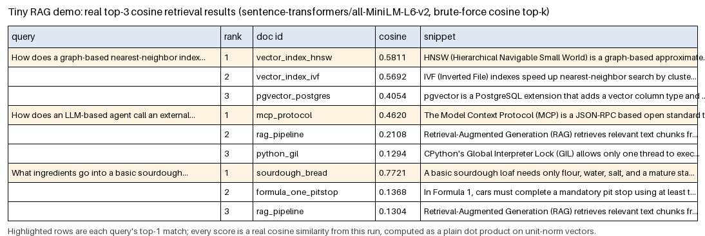

# Vector DBs, RAG, and MCP — the theory behind every agent in this book

*Agentic Engineering · Theory · SPEC-AGENT-1*

Every chapter you're about to write in this subject — a database query layer, a RAG app over PDFs, an
invoice-extraction agent, a multi-agent debate — is, underneath, the same fix applied to the same
problem. [`llm-text-generation.md`](../../Machine%20Learning/Worked%20Examples/llms/llm-text-generation.md)
(SPEC-ML-11) ended by asking SmolLM-135M-Instruct three questions it structurally could not answer:
today's date, a 2026 sports result, and the installed version of a Python library sitting right there
in its own virtual environment. Every hosted model — the 135M-parameter one in that chapter, and the
largest model you'll ever call — shares that same shape of limitation. This chapter is the theory that
explains *why*, and introduces the two standard fixes: **RAG** (give the model the missing facts, in
the prompt, at query time) and **MCP** (give the model a standard way to reach out and *act*, not just
read). Everything after this chapter in Agentic Engineering builds one or both of those.

If you've built a typed service boundary in Java — a REST controller with a request DTO, a repository
interface backed by a real datastore — the shapes here will feel familiar faster than the vocabulary
suggests. An embedding is a cache key you can do arithmetic on. A vector database is an index built for
"find me the K nearest things," not "find me the exact match." MCP is an interface contract, standardised
across vendors instead of invented per project. The ML mechanics behind all of this — what an embedding
actually is, cosine similarity, the trade-offs of quantizing a model's numbers, when to fine-tune —
were covered in [`representations.md`](../../Machine%20Learning/Theory/representations.md) (SPEC-ML-3);
this chapter assumes that vocabulary and builds the agent-shaped structure on top of it.

## Environment

```text
sentence-transformers==6.0.1
numpy==2.5.2
pillow==12.3.0
torch==2.14.0
transformers==5.16.1
Python 3.13.7 (.venv-agent)
```

Installed and verified live in this project's shared `.venv-agent` virtual environment (`pip show` /
`importlib.metadata`, checked 2026-09-03) — matching the pins in
[research/NOTE-AGENT-2-rag-primitives.md](../../research/NOTE-AGENT-2-rag-primitives.md). Everything
below runs on CPU, with no API key, from
[`code/tiny_rag_demo.py`](code/tiny_rag_demo.py):

```bash
.venv-agent/Scripts/python.exe "Agentic Engineering/Theory/code/tiny_rag_demo.py"
```

The first run downloads and caches the ~90 MB `all-MiniLM-L6-v2` model weights from Hugging Face
(NOTE-AGENT-2 caveat 1); every run after that needs no network access at all.

## 1. The problem — LLMs are stateless, bounded, and frozen

An LLM's weights encode a snapshot of everything it saw at training time, and nothing else. Three
consequences fall directly out of that:

- **Stateless.** A call to an LLM API has no memory of any earlier call — this is unlike a Java service
  backed by a session or a database connection that persists state between requests. Every "conversation"
  a chat product shows you is an illusion the *client* maintains, by resending the entire prior transcript
  as part of the next prompt. Nothing is stored on the model's side between calls.
- **Bounded.** Every model has a hard ceiling on how many tokens it can attend over in one call — the
  **context window** (Section 2). It is not a rate limit or a pricing tier; it is an architectural fact
  about the shapes the model's attention computation was built and trained for.
- **Frozen at a cutoff.** Training ends on some date, and the weights never move again after that (outside
  of an explicit fine-tuning run). Anything that happened, changed, or was published after that date is
  invisible to the model — not "unlikely to know," but structurally incapable of knowing, the same way a
  compiled JAR can't see a file created after it was built.

SPEC-ML-11's gate run made this concrete with a real, small model
([source: HuggingFaceTB/SmolLM-135M-Instruct model card](https://huggingface.co/HuggingFaceTB/SmolLM-135M-Instruct),
checked 2026-09-02) asked "What is the current version of the transformers Python library?" — the very
version installed in its own execution environment — and the model's answer trailed off without ever
stating a number, because nothing in its weights has visibility into what's installed in *this*
virtualenv, right now. A bigger model doesn't fix this: it just produces a more fluent, more confident
wrong answer, because fluency is what next-token training optimizes for — correctness about anything
outside the weights is not something the architecture can guarantee at all.

Two structurally different fixes exist, and this chapter covers both:

1. **RAG** — before generating, retrieve the missing facts from an external store and put them *in the
   prompt*. Solves "the model doesn't know this" (Sections 3–4).
2. **MCP** — give the model a standard way to call out to tools and live data sources mid-conversation,
   not just read text you pasted in ahead of time (Section 5).

## 2. Context windows — a finite, shared budget

The context window is the maximum number of tokens a model can hold in one request — **prompt tokens
and generated output tokens combined**, not two separate budgets. A token is a unit from the model's own
vocabulary, not a word and not a character: SPEC-ML-11 measured this directly with SmolLM's tokenizer —
five English words encoded to five raw tokens, but the same five words wrapped in that model's chat
template cost 14 tokens, because the role-marker scaffolding (`<|im_start|>user`, `<|im_end|>`, and so
on) is real token cost paid on every turn, not something that comes free just because it "isn't the
question." That chapter's SmolLM-135M-Instruct has a trained ceiling of 2,048 tokens
(`model.config.max_position_embeddings`, read from the loaded model, not asserted from memory — SPEC-ML-11
Section 2); production hosted models commonly advertise context windows from roughly 128K up to over 1M
tokens, but the mechanics below hold at any size.

Three consequences a Java engineer building against this budget needs to plan for from day one:

- **Cost.** Nearly every hosted LLM API bills per token, input and output separately. Every retrieved
  document, every turn of conversation history you resend, every system-prompt instruction is a line
  item — the same discipline as watching payload size on a metered API, except here it's on *every*
  call, not just the large ones.
- **Truncation, not an error.** SPEC-ML-11 built a prompt deliberately too long (2,221 tokens against a
  2,048-token ceiling) and passed it through `generate()` uncapped: it did not raise. It ran, silently,
  past the boundary the model was ever trained on, with the library's own warning stating plainly that
  the outcome is model-dependent — "exceptions, performance degradation, or nothing at all." A silent,
  ungraceful failure is worse than a loud one: code that treats "no exception" as proof a prompt fit is
  checking the wrong thing. Always count tokens against the real ceiling before calling generate.
- **Positional effects — "lost in the middle."** A model does not attend to every position in a long
  context equally well. Retrieval-augmented pipelines that stuff many documents into one prompt
  routinely see the model favour information near the start or the end of the context and under-use
  information buried in the middle — one more reason retrieval quality (Section 3) matters more than
  raw retrieved *volume*: handing the model ten mediocre-but-related chunks is often worse than handing
  it the three that actually answer the question.

None of this is solved by "just use a bigger context window." A 1M-token window changes *how much* you
could stuff in, not whether stuffing in everything is a good idea — cost and positional effects both
still apply, and RAG's actual job (Section 4) is choosing what's worth the tokens, not merely fitting
inside them.

## 3. Embeddings and vector databases — semantic search on meaning, not keywords

### From "contains the word" to "means the same thing"

A traditional search index (think Lucene, or a SQL `LIKE`/full-text index) matches on tokens: it finds
documents that literally contain your search terms. It has no notion that "car" and "automobile" are
related — to that index they're as unrelated as "car" and "spreadsheet." An **embedding** fixes exactly
that: a dense, fixed-length vector assigned to a piece of text, trained so that semantically similar
texts land near each other in the vector space (`representations.md`, SPEC-ML-3, Section 2 covers the
full mechanism, including the "king − man + woman ≈ queen" geometry that makes this concrete). Retrieval
over embeddings finds documents whose *meaning* is close to your query's meaning, even when they share
almost no words in common.

This chapter's demo uses **`sentence-transformers/all-MiniLM-L6-v2`**: a 384-dimensional dense embedding
model, Apache 2.0 licensed, that runs on CPU with no API key
([source: Hugging Face model card](https://huggingface.co/sentence-transformers/all-MiniLM-L6-v2),
checked 2026-09-02; NOTE-AGENT-2, "Embedding model" section). Its max input length is 256 tokens — longer
input gets truncated (NOTE-AGENT-2), which matters directly for chunking (Section 4). Package version:
`sentence-transformers==6.0.1` (NOTE-AGENT-2, citing [PyPI](https://pypi.org/project/sentence-transformers/),
checked 2026-09-02) — matching the installed version confirmed above.

### A vector database is an index built for "nearest," not "equal"

A **vector database** stores embeddings and answers *nearest-neighbour* queries: "give me the K vectors
closest to this query vector," instead of a B-tree index's "give me the row where `id = 42`." If you've
reached for a `HashMap<String, double[]>` to cache feature vectors before, a vector DB is the answer to
what happens once "which cached vector is *closest* to this one" becomes a real query pattern instead of
an exact-key lookup — no `HashMap` answers that question at all.

Two ways to run one, per NOTE-AGENT-2:

- **pgvector** — a PostgreSQL extension: `CREATE EXTENSION vector;` adds a vector column type and a
  cosine-distance operator, `<=>` (e.g. `SELECT * FROM embeddings ORDER BY embedding <=> query_vector
  LIMIT 10`), so similarity search runs as ordinary SQL instead of standing up a separate system
  ([source: pgvector](https://github.com/pgvector/pgvector), checked 2026-09-02). SPEC-AGENT-0 stands
  this up as the project's local vector store.
- **FAISS** or plain **numpy** — a local, in-process library
  ([source: FAISS](https://github.com/facebookresearch/faiss), checked 2026-09-02) for development,
  testing, or genuinely small corpora, which is exactly what this chapter's demo below uses.

### ANN indexes — why ANN exists, and what it trades away

A **Flat** index is brute-force exact search: compare the query vector against every stored vector, keep
the top K. At ten documents (this chapter's demo) or ten thousand, that's instant. Past some point — a
production RAG corpus can easily hold millions of chunks — a full scan on every query stops being cheap.
**Approximate Nearest Neighbour (ANN)** search exists to fix that: return near-best results much faster
by exploring only a subset of candidates, trading a small amount of recall for a large amount of speed
([source: TiDB, ANN search explained](https://www.pingcap.com/article/approximate-nearest-neighbor-ann-search-explained-ivf-vs-hnsw-vs-pq/),
checked 2026-09-02; NOTE-AGENT-2). Two ANN index families you'll see named constantly:

- **HNSW (Hierarchical Navigable Small World)** — a graph-based index. Vectors are organised into a
  multi-layer graph; higher layers hold long-range shortcuts, lower layers hold fine-grained local
  links, so a search jumps far first, then refines locally, for high recall at low query latency
  ([source: HNSW explained](https://medium.com/@adnanmasood/the-shortcut-through-space-hierarchical-navigable-small-worlds-hnsw-in-vector-search-4df5aa755100),
  checked 2026-09-02; NOTE-AGENT-2). Think of it as a skip-list over a similarity graph rather than a
  sorted array: it takes shortcuts the way a skip-list's higher levels do, except the "distance" it's
  navigating is semantic, not a total order.
- **IVF (Inverted File)** — a clustering-based index. K-means partitions the vector space into cells at
  index-build time; a query only scans the handful of cells nearest the query vector, instead of every
  row (NOTE-AGENT-2, citing the same TiDB source). Closer to a database partition/shard: pick the
  right partition first, then only search inside it.

Both trade *exactness* for *speed* — that trade only starts paying off once brute force stops being fast
enough, which is precisely why this chapter's ten-document demo below deliberately uses a Flat scan,
not an ANN index: at this scale ANN would add complexity for zero measurable benefit, and the honest
teaching point is "this is what HNSW/IVF are approximating," not "here is a production index."

### Worked example — real cosine top-k retrieval, no API key

`code/tiny_rag_demo.py` builds a ten-document knowledge base (deliberately mixed-topic — some passages
about vector search, RAG, and MCP themselves; some unrelated Java/Python trivia; some totally unrelated
bread and motorsport facts — so a correct retrieval has to actually discriminate on meaning), embeds
every document with `all-MiniLM-L6-v2`, and answers three natural-language queries with a brute-force
cosine top-3 search implemented directly in numpy — the exact computation a Flat index or an unindexed
pgvector `<=>` scan performs under the hood:

```python
import numpy as np


def cosine_topk(
    query_vec: np.ndarray, doc_matrix: np.ndarray, doc_ids: list[str], k: int
) -> list[tuple[str, float]]:
    """Ranks every document in doc_matrix against query_vec by cosine similarity and
    returns the top k as (doc_id, score) pairs, highest first. Both query_vec and every
    row of doc_matrix are already unit-norm, so cosine similarity is exactly the dot
    product -- no division needed (representations.md, SPEC-ML-3, Section 3's
    cos_sim(a, b) = (a.b) / (||a|| ||b||) identity, which is just a.b when both vectors
    have unit length). This is a full O(n) scan over every document: an exact "Flat"
    index, not an approximation.
    """
    scores = doc_matrix @ query_vec  # (n_docs,) cosine similarities
    order = np.argsort(-scores)[:k]
    return [(doc_ids[i], float(scores[i])) for i in order]
```

Every score below is a real number from this run, not invented — this is what the gate run printed
verbatim (`.venv-agent/Scripts/python.exe "Agentic Engineering/Theory/code/tiny_rag_demo.py"`, checked
2026-09-03):

```text
query: 'How does a graph-based nearest-neighbor index use layered graphs and long-range
links to avoid scanning every vector?'
  #1  cos=0.5811  vector_index_hnsw   HNSW (Hierarchical Navigable Small World) is a graph-based approximate...
  #2  cos=0.5692  vector_index_ivf    IVF (Inverted File) indexes speed up nearest-neighbor search by cluste...
  #3  cos=0.4054  pgvector_postgres   pgvector is a PostgreSQL extension that adds a vector column type and ...

query: 'How does an LLM-based agent call an external tool through a standardized
protocol instead of a one-off integration?'
  #1  cos=0.4620  mcp_protocol        The Model Context Protocol (MCP) is a JSON-RPC based open standard tha...
  #2  cos=0.2108  rag_pipeline        Retrieval-Augmented Generation (RAG) retrieves relevant text chunks fr...
  #3  cos=0.1294  python_gil          CPython's Global Interpreter Lock (GIL) allows only one thread to exec...

query: 'What ingredients go into a basic sourdough loaf?'
  #1  cos=0.7721  sourdough_bread     A basic sourdough loaf needs only flour, water, salt, and a mature sta...
  #2  cos=0.1368  formula_one_pitstop In Formula 1, cars must complete a mandatory pit stop using at least t...
  #3  cos=0.1304  rag_pipeline        Retrieval-Augmented Generation (RAG) retrieves relevant text chunks fr...
```

The same rows, rendered as the committed artefact:



Read what actually happened, not just the scores: the first query never uses the word "HNSW" — it
describes graph-based search with layered graphs and long-range links, and the correct document wins
anyway, at 0.5811, ahead of the topically-adjacent-but-wrong IVF document at 0.5692. That's semantic
search doing its job: matching *meaning*, not literal keyword overlap. Notice too how close HNSW and
IVF land to each other (0.5811 vs 0.5692) — they're both ANN-index documents, genuinely similar in
topic, and a keyword search would have no way to rank between them at all; embeddings at least separate
them, even if not by a wide margin. Contrast that with the sourdough query: 0.7721 for the actually
relevant document against 0.1368 for the next-best (an unrelated Formula 1 fact) — a wide, unambiguous
margin, because nothing else in the corpus is *about* anything remotely similar. Retrieval confidence is
not uniform; a wide margin is a strong signal, a narrow one is a much weaker one, and Section 6 covers
what to do when the top result's margin over the rest is too thin to trust.

The script asserts every query's top-1 result matches the expected document — if a future model swap
ever silently changed the retrieval geometry, the run fails loudly instead of printing a wrong "example"
(`tiny_rag_demo.py`'s `run_retrieval_demo`). This is precisely the honesty standard `llm-text-generation.md`
set for its own numbers: reproduce, don't assert from memory.

## 4. RAG — the pipeline, chunking, and when it beats the alternatives

### Definition

**Retrieval-Augmented Generation (RAG)** is a technique that enables large language models to retrieve
and incorporate new information from external data sources: a retrieval step is inserted into the
response-generation process, so the model first consults a specified set of documents, then responds,
with those documents supplementing whatever the model's own weights already encode
([source: IBM](https://www.ibm.com/think/topics/retrieval-augmented-generation);
[source: Pinecone](https://www.pinecone.io/learn/retrieval-augmented-generation/), both checked
2026-09-02; NOTE-AGENT-2). RAG originates from Meta AI Research's 2020 paper *Retrieval-Augmented
Generation for Knowledge-Intensive Tasks* (NOTE-AGENT-2).

### The pipeline

RAG splits cleanly into an **offline indexing path**, which runs once per document (and again whenever
the corpus changes), and an **online query path**, which runs on every request:


- **Offline: chunk → embed → store.** Source documents (PDFs, wiki pages, database exports) get split
  into passages (**chunking**), each chunk is embedded with the same model that will embed queries
  later (Section 3), and the resulting vectors go into the vector store's ANN index.
- **Online: query → embed → search → augment → generate.** The user's question gets embedded with that
  *same* embedding model, an ANN search returns the top-k most similar chunks, those chunks get spliced
  into the LLM's prompt alongside the question (**augmentation**), and the LLM generates its answer with
  that retrieved context sitting right there in the context window (Section 2).

The word "same" in both offline and online steps is load-bearing: a query embedded with a different
model than the one that embedded the documents lands in a differently-shaped vector space, and cosine
similarity between the two is meaningless — Section 6 covers this as a concrete pitfall.

### Chunking strategies

Chunk size is a direct trade-off, not a default to leave alone: a chunk too large dilutes relevance (the
embedding averages over multiple unrelated ideas, so it matches *nothing* precisely) and risks exceeding
the embedding model's own input limit — `all-MiniLM-L6-v2`'s 256-token max means anything longer is
silently truncated before it's even embedded (NOTE-AGENT-2). A chunk too small loses the surrounding
context that made it meaningful in the first place — a sentence fragment retrieved without its paragraph
can be technically "the closest match" and still useless to the model reading it. NOTE-AGENT-2's
recommendation for the RAG-over-PDFs worked example (SPEC-AGENT-3) is a concrete starting point: **512
tokens per chunk, 50 tokens of overlap** between consecutive chunks (so an idea that straddles a chunk
boundary doesn't vanish from both sides), tuned from there based on measured retrieval quality — not a
universal constant, a starting point to measure and adjust.

### RAG vs fine-tuning vs long-context

Three different ways to get an LLM to work with information beyond its base training, and they solve
different problems:

- **RAG** — look up relevant documents at query time, put them in the prompt. Solves "the model doesn't
  know *my* data," and does so *updatably*: change the document store, the model's answers change on
  the very next request, with zero retraining. This is the cheapest and fastest of the three to iterate
  on.
- **Fine-tuning** — continue training the model's own weights on your data (`representations.md`,
  SPEC-ML-3, Section 5 covers full fine-tuning vs LoRA in depth). This changes *behaviour* — a
  consistent output format, a specialised skill, a house style — not facts. Fine-tuning a model to
  "know" something that changes over time is the wrong tool: every update means retraining, and the
  model still can't tell you *where* a fact came from.
- **Long context** — some hosted models now advertise context windows large enough to paste an entire
  document, or several, directly into the prompt with no retrieval step at all. This works, and for a
  handful of documents queried occasionally it may be the simplest option — but Section 2's cost and
  "lost in the middle" effects don't go away just because the window is bigger: every token of every
  document you paste is billed on every single call, and a model still doesn't attend uniformly across
  a very long context. RAG's actual advantage over long-context is that it retrieves the *few* chunks
  that are actually relevant instead of paying (in tokens, in dollars, in attention quality) for
  everything all the time.

The rule of thumb `llm-text-generation.md` (SPEC-ML-11, Section 5) and `representations.md` (SPEC-ML-3,
Section 5) both converge on: reach for a better prompt first, RAG when the model needs facts it wasn't
trained on — especially facts that change — and fine-tuning only when the gap is genuinely about
*behaviour* that prompting and retrieved context can't reliably produce.

## 5. MCP — a standard protocol for tools and data, not a bespoke integration per source

### The problem MCP solves

Section 4's RAG pipeline gets an LLM *reading* — retrieving text and putting it in the prompt. It
doesn't get the LLM *acting*: querying a live database, calling an internal API, running a search. Before
a shared standard existed, every one of those capabilities meant a bespoke, one-off integration: custom
code translating between "the LLM decided to call something" and "the actual database/API/service,"
repeated for every tool, for every LLM provider, for every project. That's the same pain a Java shop felt
before REST/OpenAPI standardised "how does a client discover and call this service" — everyone was
reinventing the same wiring.

### Definition and architecture

**The Model Context Protocol (MCP)** is an open protocol that enables seamless integration between LLM
applications and external data sources and tools: a JSON-RPC-based standard that lets any AI application
discover tools, reusable prompts, resources, and other context from remote MCP servers. The protocol
defines four primitives: **Tools** (functions the model can call with structured inputs), **Resources**
(data or content the client can read), **Prompts** (reusable prompt templates), and **Instructions**
(server-wide guidance) ([source: official MCP Specification, 2026-07-28](https://modelcontextprotocol.io/specification/2026-07-28),
checked 2026-09-02; NOTE-AGENT-2).

MCP names three roles: **Hosts** — the LLM applications that initiate connections (an agent, an IDE, a
chat app); **Clients** — connectors living inside the host application, one per server connection; and
**Servers** — the services that actually provide context and capabilities (a database, a filesystem, a
search API) (official MCP Specification, cited above). Concretely:


Each server independently exposes whatever mix of Tools/Resources/Prompts makes sense for what it wraps
— a database server might expose a `run_query` tool and schema documentation as a resource; a filesystem
server might expose `read_file`/`search` tools and file contents as resources. The host never needs a
bespoke integration per data source: it speaks one protocol to every server, and the LLM discovers what's
available at connection time rather than having capabilities hard-coded per project.

### Why a standard matters

The concrete payoff, in terms a backend engineer will recognise immediately: **N tools × M LLM
providers** used to mean up to N×M bespoke integrations, one per pairing. A standard protocol collapses
that to N servers plus M standard clients — write an MCP server for your database once, and any
MCP-compatible host can use it, the same way any HTTP client can call any REST API that publishes an
OpenAPI schema, without the client and server having been built for each other. SPEC-AGENT-2 builds
exactly this: a real FastMCP server exposing a database as a set of tools, tested with a plain client
before any LLM is ever wired to it.

## 6. Pitfalls

**Bad chunking.** Section 4 already named the trade-off; the failure mode is what happens in practice.
Chunks too large embed as a blur of several unrelated ideas and end up matching *no* query precisely —
the resulting embedding is a compromise, not a representation of anything specific. Chunks too small (or
split mid-sentence, mid-table-row, mid-code-block) lose the context that made them meaningful, so even a
"correct" retrieval hands the model a fragment it can't actually use. Always inspect real retrieved
chunks for a handful of real queries before trusting a chunking strategy — Section 3's worked example
did exactly that by printing every retrieved snippet, not just a score.

**Stale index.** The offline indexing path (Section 4) runs once, then again whenever the corpus
changes — it does not run itself. A vector store that isn't re-indexed after the underlying documents
change will confidently retrieve chunks that no longer reflect the current source: an invoice template
that changed, a policy document that was updated, code that was refactored. This is a cache-invalidation
problem with a familiar shape (a Java engineer has almost certainly shipped a stale-cache bug before) —
except unlike a wrong cached value that fails loudly, a stale retrieved chunk fails *fluently*: the LLM
generates a confident answer grounded in the wrong version of the truth, with nothing about the output
signalling that anything is out of date.

**Retrieval misses — including near-misses that look like hits.** Section 3's HNSW-vs-IVF result (0.5811
vs 0.5692) is the mild version of this: two genuinely related documents scored close together, and the
right one happened to win. A harder version: the top result scores far below every clearly-relevant
result seen elsewhere in the corpus (a thin margin over the rest, or a low absolute score), which is a
real signal that nothing in the store actually answers the question — and a RAG pipeline that always
retrieves *something* and always hands it to the LLM will still generate a fluent answer regardless,
because nothing in "retrieve top-k" enforces a minimum relevance bar. Production systems typically set a
similarity-score threshold, or have the LLM explicitly consider whether the retrieved context actually
answers the question, rather than trusting "we retrieved 3 chunks" as proof any of them are relevant.

**Over-stuffing the context.** Section 2's "lost in the middle" effect means retrieving more chunks is
not free even when the token budget technically allows it — ten mediocre chunks can produce a *worse*
answer than the three best ones, both because of position effects and because irrelevant retrieved text
gives the model more surface area to build a plausible-sounding but ungrounded answer from. Tune top-k
by measuring answer quality, not by maximising how much you can fit.

**Embedding a query with a different model than the one that embedded your documents.** Named in Section
4 as a "load-bearing" detail — worth repeating here as the pitfall it actually is. Two different
embedding models place semantically identical text at different, incompatible coordinates; cosine
similarity computed across the two vector spaces is not meaningful, and there is no error message that
tells you this happened — retrieval will still return *something*, ranked by numbers that mean nothing.
Pin the embedding model per vector store and re-embed the whole corpus if you ever change it.

## Recap & what's next

LLMs are stateless, bounded by a hard token ceiling that costs money and affects positional attention,
and frozen at a training cutoff (Section 1–2) — three structural facts, not implementation details a
bigger model quietly fixes. Embeddings turn text into vectors where distance encodes meaning; vector
databases (pgvector, FAISS/numpy) answer nearest-neighbour queries over those vectors; ANN indexes like
HNSW (graph-based) and IVF (clustering-based) trade a little recall for a lot of speed once brute-force
scanning stops being cheap, and this chapter's own retrieval demo showed that trade-off's baseline — an
exact Flat scan — finding the right document by *meaning*, not by keyword overlap (Section 3). RAG
chains chunk → embed → store (offline) and query → embed → search → augment → generate (online) into a
pipeline that updates instantly when the underlying documents change, which is why it beats fine-tuning
for facts and beats raw long-context for cost and relevance (Section 4). MCP standardises how an agent
reaches tools and live data — Hosts, Clients, Servers, and the Tools/Resources/Prompts primitives — so
that giving an LLM a new capability stops meaning a bespoke integration per provider (Section 5).

This is the foundation every remaining Agentic Engineering chapter builds on directly:

- **SPEC-AGENT-2** (MCP — a database query layer) builds a real MCP server from Section 5's
  Tools/Resources primitives, tested with a plain client before any LLM touches it.
- **SPEC-AGENT-3** (RAG over PDFs) builds Section 4's full pipeline for real: parse a PDF, chunk it,
  embed and store the chunks, retrieve top-k for a question, and (key-gated) generate a grounded answer.
- **SPEC-AGENT-4** (Invoice Agent) composes MCP and structured extraction into an agent that turns an
  unstructured PDF into validated rows in a database via an MCP write-tool.
- **SPEC-AGENT-5** (Elders Tribunal) is a multi-agent system, where several LLM-backed "elders" debate
  and a moderator synthesises consensus — Section 1's statelessness becomes a design constraint the
  orchestration layer has to manage explicitly, turn by turn.

Every one of those chapters is runnable and key-free at its core, exactly like this chapter's retrieval
demo — the LLM-calling steps are clearly marked and key-gated, but the mechanics you just saw (embed,
search, rank) are real code you can run right now with nothing but a CPU.
