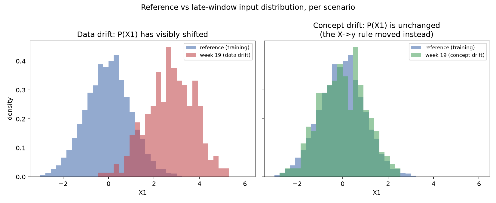
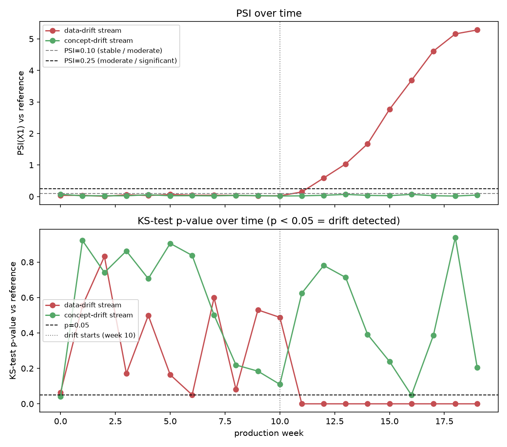
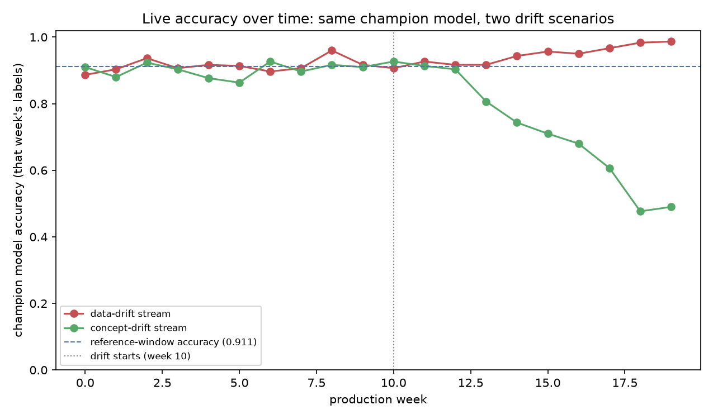
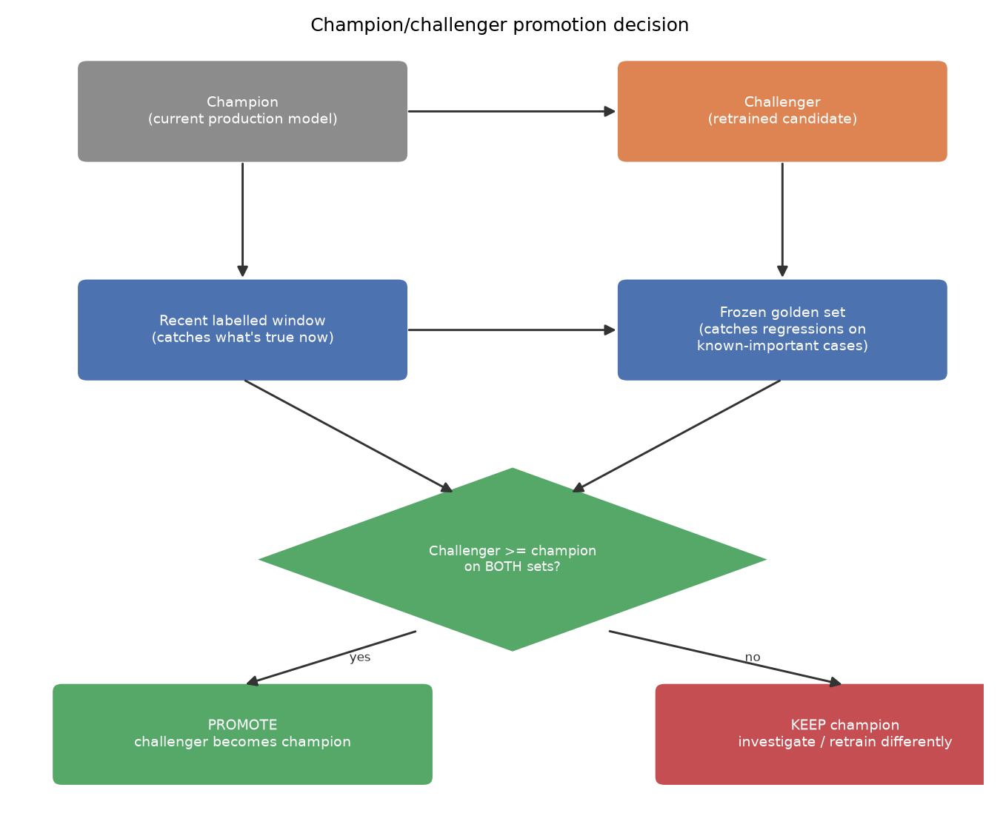

# Production monitoring — drift, retraining, and promotion

*Data Science · Production Considerations · SPEC-DS-17*

A Java service that starts throwing `NullPointerException`s tells you something is wrong the moment
it happens — a stack trace, a log line, a paged on-call engineer. A deployed ML model has no
equivalent failure mode. It keeps returning `200 OK` with a confident-looking prediction on every
single request, right up through the point where those predictions have quietly become wrong,
because the world the model was trained on has moved on without it. There is no exception to catch,
because nothing *throws* — the model's accuracy just erodes, one request at a time, until someone
notices the business metric downstream of it looking off. This chapter is about closing that gap:
the vocabulary for *why* a model rots (**drift**), how to detect it while it's happening, when that
detection should trigger a retrain, and how to decide whether a freshly retrained candidate actually
deserves to replace the model currently in production.

## 1. What & why — a model is an assumption that nothing checks for you

### Environment

```text
numpy==2.5.2
pandas==3.0.5
matplotlib==3.11.1
scipy==1.18.1
scikit-learn==1.9.0
Python 3.11+
```

Pinned and verified against PyPI on 2026-09-02
([source: NOTE-2-package-versions](../../research/NOTE-2-package-versions.md)). This chapter's code
and artefacts were generated and gated on **Python 3.13.7**, with every package above installed at
exactly the pinned version — no substitutions
([source: NOTE-20-drift-detection](../../research/NOTE-20-drift-detection.md) for the PSI formula,
thresholds, and `scipy.stats.ks_2samp` signature;
[source: NOTE-3-scipy-test-apis](../../research/NOTE-3-scipy-test-apis.md) and
[source: NOTE-5-sklearn-core-apis](../../research/NOTE-5-sklearn-core-apis.md) for the scikit-learn
and scipy call shapes used below).

### The assumption every trained model makes

Every supervised model is fit under one implicit assumption: the data it sees in production will
look statistically like the data it was trained on. Nothing in `model.fit(X_train, y_train)` checks
that assumption at prediction time — `model.predict(X_new)` will happily return an answer for *any*
`X_new` you hand it, whether or not that row resembles anything the model ever learned from. Compare
that to a Java interface: a method signature is a contract the compiler enforces on every caller.
A trained model's real contract — "the inputs I see should resemble the inputs I was trained on" —
is enforced by nobody, unless you build the enforcement yourself. **Drift monitoring is that missing
enforcement layer**, bolted on after the fact because the language and the ML library can't provide
it for you.

That "resemble" word is doing a lot of work, and it splits into three distinct failure modes, which
is where the vocabulary starts.

## 2. The three drifts

([source: NOTE-20-drift-detection](../../research/NOTE-20-drift-detection.md), grounded against
[Evidently AI — concept drift](https://www.evidentlyai.com/ml-in-production/concept-drift) (checked
2026-09-02), [Deepchecks — data drift vs concept drift](https://deepchecks.com/data-drift-vs-concept-drift-what-are-the-main-differences/)
(checked 2026-09-02), and [Wikipedia — concept drift](https://en.wikipedia.org/wiki/Concept_drift)
(checked 2026-09-02).)

- **Data drift** — the input distribution `P(X)` changes, while the true relationship between inputs
  and outputs (`X → y`) stays the same. Example: a churn model trained on a customer base whose
  average account age was two years starts seeing a wave of brand-new signups after a marketing
  campaign. The *inputs* look different (younger accounts, different usage patterns), but "a customer
  who stops logging in for 30 days is likely to churn" is still just as true as it was in training.

- **Concept drift** — the relationship `X → y` itself changes, while the inputs can look completely
  unchanged. Also called **model drift**. Example: a fraud model where "transaction amount just under
  $10,000, single merchant, new device" used to be a strong fraud signal — until fraudsters learn the
  pattern the model keys on and deliberately route around it. The transactions arriving today can be
  statistically indistinguishable from the transactions in training; what changed is which *label*
  those same features now deserve.

- **Model / prediction drift** — the distribution of the model's own *outputs* changes over time.
  This one is usually a **symptom**, not a distinct root cause: it shows up whenever the *inputs* the
  model scores have shifted (a fixed model's `predict(X)` is a deterministic function of `X`, so its
  output distribution can only move if `X`'s distribution moves) — whether that shift is real-world
  data drift or a broken upstream feature pipeline quietly feeding the model garbage. Its practical
  value is that it needs **no ground-truth labels** to compute: you always have the model's own
  predictions, even when the true outcome (did this transaction turn out to be fraud?) won't be known
  for days or weeks. Its practical limit is the flip side of the same fact: because `predict(X)`
  never looks at `y`, prediction drift is exactly as blind to *pure* concept drift as PSI and the
  KS-test are — Section 3 measures this directly instead of asserting it.

Data drift is visible on the *inputs* and detectable without any labels. Concept drift is invisible
on the inputs and detectable only once labels arrive. That distinction is not just semantic — it
determines which detector below catches which failure, and Section 3 demonstrates the gap directly
instead of just asserting it.

## 3. Detect it — PSI, a KS-test, and a metric that decays (RUNNABLE)

The full script behind this section is
[`code/drift_detection.py`](code/drift_detection.py). It trains one "champion" model on a reference
distribution, then streams 20 weeks of synthetic production data down **two separate paths** — a
pure data-drift scenario and a pure concept-drift scenario — so the two failure modes from Section 2
can be told apart by what actually happens to the numbers, not just by definition.

### The reference model and the two streams

```python
import numpy as np
from sklearn.linear_model import LogisticRegression
from sklearn.metrics import accuracy_score

RNG_SEED = 42
N_REFERENCE = 4000
N_PER_WEEK = 300
N_WEEKS = 20
DRIFT_START_WEEK = 10


def true_label(x1: np.ndarray, x2: np.ndarray, coef1: float, rng: np.random.Generator) -> np.ndarray:
    """y = 1{coef1*X1 - 1.1*X2 + noise > 0}. coef1 IS the 'concept' -- change it
    and the SAME (X1, X2) maps to a different y."""
    logit = coef1 * x1 - 1.1 * x2
    noise = rng.normal(scale=0.5, size=x1.shape)
    return (logit + noise > 0).astype(int)


rng = np.random.default_rng(RNG_SEED)
x1 = rng.normal(size=N_REFERENCE)
x2 = rng.normal(size=N_REFERENCE)
y_ref = true_label(x1, x2, coef1=1.4, rng=rng)
X_ref = np.column_stack([x1, x2])

champion = LogisticRegression(random_state=RNG_SEED)
champion.fit(X_ref, y_ref)
print(f"reference accuracy: {accuracy_score(y_ref, champion.predict(X_ref)):.4f}")
```

```text
reference accuracy: 0.9115
```

The champion is trained once, on 4,000 reference rows with a 49.3% positive rate, and never
retrained during the simulation — it plays the role of "the model already sitting in production."
From week 10 onward, two separate 20-week streams diverge from that same reference generator:

- **`data_drift` stream** — `X1`'s mean ramps upward (0 at week 10, +2.7 standard deviations by week
  19); `coef1` stays fixed at `1.4` the entire time, so the *rule* mapping inputs to labels never
  changes.
- **`concept_drift` stream** — `X1` and `X2` are drawn exactly like the reference in **every** week,
  no shift at all; instead `coef1` itself ramps from `1.4` down to `-1.0` across weeks 10–19, so the
  same input values increasingly deserve the opposite label.

That is Section 2's distinction, made mechanical: one stream moves the inputs and freezes the rule,
the other freezes the inputs and moves the rule.



The artefact above is the first tell: the **data-drift** panel (left) shows the week-19 histogram
plainly shifted to the right of the reference. The **concept-drift** panel (right) shows the two
histograms sitting almost exactly on top of each other — because in that stream, `P(X1)` truly never
moved. Anyone staring at input distributions alone would conclude "nothing changed" in the
concept-drift stream, and they would be right about the inputs and catastrophically wrong about the
model.

### PSI — population stability index

PSI compares a reference distribution against a current one, bin by bin
([source: NOTE-20-drift-detection](../../research/NOTE-20-drift-detection.md);
[source: Fiddler AI — measuring data drift with PSI](https://www.fiddler.ai/blog/measuring-data-drift-population-stability-index)
(checked 2026-09-02)):

```text
PSI = sum_i (Actual%_i - Expected%_i) * ln(Actual%_i / Expected%_i)
```

`Expected%` is the reference (training-time) proportion in bin `i`; `Actual%` is the current
(production) proportion in that same bin. Summed over every bin, it is zero only when the two
distributions match exactly, and it grows without bound as they diverge. The industry-standard
reading of the number, per NOTE-20:

| PSI | Interpretation |
|---|---|
| < 0.10 | stable — no significant change |
| 0.10 – 0.25 | moderate shift — investigate |
| ≥ 0.25 | significant drift — retrain recommended |

```python
def compute_psi(reference: np.ndarray, current: np.ndarray, n_bins: int = 10,
                 eps: float = 1e-4) -> float:
    """PSI = sum_i (actual_pct_i - expected_pct_i) * ln(actual_pct_i / expected_pct_i).
    Bin edges are the REFERENCE sample's deciles (equal-frequency bins over the
    reference window), widened to +-inf at the ends so any out-of-range current
    value still lands in a bin. `eps` floors every proportion so an empty bin never
    triggers log(0) or division by zero."""
    quantiles = np.linspace(0, 1, n_bins + 1)
    edges = np.quantile(reference, quantiles)
    edges[0], edges[-1] = -np.inf, np.inf

    ref_counts, _ = np.histogram(reference, bins=edges)
    cur_counts, _ = np.histogram(current, bins=edges)

    ref_pct = np.clip(ref_counts / ref_counts.sum(), eps, None)
    cur_pct = np.clip(cur_counts / cur_counts.sum(), eps, None)
    return float(np.sum((cur_pct - ref_pct) * np.log(cur_pct / ref_pct)))
```

Ten equal-frequency bins are carved out of the reference sample's own deciles — a standard PSI
binning choice, since it guarantees `PSI == 0` exactly when `current` matches `reference` bin for
bin. `eps=1e-4` is a smoothing floor, not part of the formula: without it, one empty bin in either
sample turns `ln(0)` into `-inf` and the whole PSI value into garbage.

### The KS-test

`scipy.stats.ks_2samp` runs the two-sample Kolmogorov–Smirnov test — it compares two samples'
empirical distributions directly, without any binning choice to make, and returns a test statistic
plus a p-value
([source: NOTE-20-drift-detection](../../research/NOTE-20-drift-detection.md);
[source: scipy.stats.ks_2samp docs](https://docs.scipy.org/doc/scipy/reference/generated/scipy.stats.ks_2samp.html)
(checked 2026-09-02)):

```python
from scipy.stats import ks_2samp

def run_ks_test(reference: np.ndarray, current: np.ndarray) -> tuple[float, float]:
    """p < 0.05 rejects the null hypothesis that both samples are drawn from the
    same distribution -- i.e., drift is detected."""
    result = ks_2samp(reference, current, alternative="two-sided", method="auto")
    return float(result.statistic), float(result.pvalue)
```

### Running both streams, week by week

```python
def run_stream(stream: str, champion, reference_x1: np.ndarray, rng):
    rows = []
    for week in range(N_WEEKS):
        X_week, y_week = make_week(week, stream, rng)   # see drift_detection.py
        x1_week = X_week[:, 0]

        psi = compute_psi(reference_x1, x1_week)
        ks_stat, ks_pvalue = run_ks_test(reference_x1, x1_week)

        y_pred = champion.predict(X_week)
        acc = accuracy_score(y_week, y_pred)
        pred_positive_rate = float(y_pred.mean())   # label-free prediction-drift proxy

        rows.append({"stream": stream, "week": week, "psi": psi,
                      "ks_statistic": ks_stat, "ks_pvalue": ks_pvalue,
                      "accuracy": acc, "pred_positive_rate": pred_positive_rate})
    return rows
```

Selected weeks from the actual run (full 20-week table for both streams:
[`artefacts/drift_metrics_by_week.csv`](artefacts/drift_metrics_by_week.csv)):

| week | stream | PSI(X1) | KS p-value | accuracy |
|---:|---|---:|---:|---:|
| 9 | data_drift | 0.022 | 0.530 | 0.917 |
| 10 | data_drift | 0.025 | 0.488 | 0.907 |
| 11 | data_drift | 0.144 | 0.0000 | 0.927 |
| 12 | data_drift | 0.588 | 0.0000 | 0.917 |
| 19 | data_drift | **5.283** | 0.0000 | 0.987 |
| 9 | concept_drift | 0.027 | 0.184 | 0.910 |
| 10 | concept_drift | 0.017 | 0.110 | 0.927 |
| 13 | concept_drift | 0.067 | 0.713 | 0.807 |
| 16 | concept_drift | 0.069 | 0.049 | 0.680 |
| 19 | concept_drift | **0.047** | 0.204 | **0.490** |



Read straight off the table: `data_drift`'s PSI crosses the 0.10 "moderate" line the very first
drifted week (0.144 at week 11) and blows past the 0.25 "significant" line the week after (0.588 at
week 12), climbing to **5.283** — over 20x the significance threshold — by week 19. Its KS-test
agrees: the p-value collapses to essentially zero (`2.47e-197`) from week 11 onward. Both detectors
are doing exactly their job: the input distribution moved, and they saw it.

`concept_drift` tells the opposite story. Its PSI never exceeds 0.070 across all 20 weeks — every
single reading stays comfortably inside the "stable" band — and its KS p-value bounces around
noisily above and below 0.05, exactly the pattern you'd expect from a distribution that hasn't
actually moved (a KS-test run on 20 independent weeks against the same reference will cross p<0.05 by
chance now and then even with zero real drift — that noise, and why chasing every single crossing is
a mistake, comes back in Section 6). **Neither distribution detector ever flags this stream as
drifting**, because — by construction — the inputs never drifted. Only the relationship did, and PSI
and KS-tests only ever look at inputs.

### The metric that actually decays



This is where the two scenarios trade places. `data_drift`'s accuracy **never drops below the
reference baseline (0.9115)** — it actually climbs to 0.987 by week 19. That is not a bug in the
simulation: pushing `X1` further from zero makes the `coef1 * X1` term dominate the label-generating
noise, which makes the label *easier* to predict correctly for a model that already has the right
sign on `coef1`. `concept_drift`'s accuracy falls off a cliff: 0.927 at week 10, down to 0.807 by
week 13, and bottoming out at **0.490** by week 19 — on a roughly 50/50-balanced label, that is
barely better than flipping a coin.

Put the two artefacts side by side and the point of this whole section is unavoidable: **a PSI of
5.28 (screaming "significant drift") came with a model that got *more* accurate, and a PSI of 0.05
(reading "stable") came with a model that collapsed to coin-flip accuracy.** That is not a
contradiction — it is exactly what NOTE-20's grounded caveat states: *"Drift ≠ model degradation; a
drifted input distribution might not hurt a robust model,"* and its mirror image, unstated there but
just as true and directly demonstrated here: a *lack* of input drift does not mean the model is safe.
PSI and KS-tests monitor an assumption (the inputs still look familiar); they say nothing directly
about the thing you actually care about (is the model still right). You need both a distribution
detector and a live performance metric, because each one is blind to the failure mode the other one
catches.

The champion's own predicted-positive rate (`pred_positive_rate` in the CSV, computed from
`y_pred.mean()` with no labels involved) confirms the mechanism rather than just the symptom: on
`data_drift` it climbs from 0.437 (week 0) to 0.977 (week 19), tracking the PSI signal almost exactly
— because `predict(X)`'s output distribution can only move if `X` moves, and here it did. On
`concept_drift` it stays noisy and flat between 0.46 and 0.57 across all 20 weeks, with no trend at
all — because `X` never moved in that stream, so the *same fixed model* scoring the *same input
distribution* has no way to produce a shifted output distribution, no matter how wrong its labels
have become underneath it. Prediction drift, in other words, is a data-drift detector wearing a
different name; it cannot see concept drift, for the identical structural reason PSI and the
KS-test cannot.

### In practice: Evidently

Hand-rolling PSI and a KS-test, as above, is exactly what a monitoring library like **Evidently**
automates at scale — multiple statistical tests, automatic binning, and dashboards, run across every
feature instead of one column at a time
([source: NOTE-20-drift-detection](../../research/NOTE-20-drift-detection.md);
[source: Evidently on PyPI](https://pypi.org/project/evidently/) (checked 2026-09-02), version
**0.7.21**, released 2026-03-10). It is named here as a reference, not installed in this chapter's
environment:

```python
# Reference only -- not installed or run in this chapter's environment.
from evidently.report import Report
from evidently.metrics import DataDriftTable

report = Report(metrics=[DataDriftTable()])
report.run(reference_data=train_df, current_data=production_df)
```

NOTE-20 also flags NannyML and Alibi Detect as other open-source options, less widely maintained than
Evidently as of this chapter's grounding date.

## 4. When to retrain — schedule vs trigger

Two policies decide *when* a retrain happens, and they are not mutually exclusive:

- **Scheduled retraining** — retrain every week / month / quarter, regardless of whether anything
  measurably drifted. Simple, predictable, and it bounds how stale the model can ever get. Its
  weakness is exactly the asymmetry Section 3 just demonstrated: a fixed schedule retrains
  unnecessarily during quiet periods (burning compute and re-introducing promotion risk on a model
  that didn't need to change) and reacts too slowly if something breaks the week after a retrain just
  ran.
- **Triggered retraining** — retrain when a detector crosses a threshold: PSI ≥ 0.25 on a key
  feature, or live accuracy dropping more than some absolute amount below its reference baseline.
  Applied to this chapter's own numbers: a trigger at "accuracy falls more than 0.10 below the
  0.9115 reference" (i.e. below ~0.81) would have fired on the `concept_drift` stream at **week 13**
  (accuracy 0.807) — while a PSI-only trigger would have stayed silent the entire time, because that
  stream's PSI never left the "stable" band. Meanwhile a PSI-only trigger set at 0.25 would have
  fired on `data_drift` at week 12 — for a model whose accuracy was, if anything, improving. That
  second case is a real cost of triggering on distribution alone: it burns a retrain-and-promote cycle
  on a model that wasn't broken.

The practical answer most teams land on is **both**: a loose schedule as a backstop (nothing goes
untouched for a full quarter even if every detector stays quiet), plus triggers on the metrics that
actually matter for the specific model, tuned to that model's own noise floor rather than borrowed
verbatim from a blog post's default.

### Why a pipeline makes this cheap

None of the above matters if a "retrain" is a multi-day manual project — someone re-pulling data by
hand, re-running notebook cells in the right order, and remembering which hyperparameters last
worked. The entire point of automating the training pipeline — the same pipeline that produced the
model currently in production, wired end to end from data pull through evaluation, with each run's
parameters, metrics, and resulting model version logged to a registry (the model-registry chapter,
**SPEC-DS-12**) and served through the same containerised interface every other version uses (the
inference-serving chapter, **SPEC-DS-16**) — is that "retrain" stops being a project and becomes
**re-running a pipeline you already trust**, the same way a Java team re-running its CI/CD pipeline
on a new commit is routine rather than an event. Once that pipeline exists, the question in Section 4
stops being "can we afford to retrain" and becomes purely "should we, based on what the detectors
are telling us" — which is exactly the decision the next section formalises.

## 5. Should the new model win? — champion/challenger and the golden set

A freshly retrained model — the **challenger** — earns its promotion over the model currently serving
traffic — the **champion** — only by beating it on **two** separate evaluation sets, not one:

- **A recent labelled window** — the latest slice of production data with true labels attached. This
  is what tells you the challenger has actually adapted to whatever changed. It is also,
  by itself, dangerous to trust alone: a challenger retrained purely on recent (already-drifted) data
  can look great on more recent data almost by construction, while quietly forgetting how to handle
  cases that were common before the drift and are still going to show up again.
- **A frozen golden dataset** — a fixed, curated set of examples that never changes, covering the
  cases you never want a new model to get wrong: known edge cases, past incidents, rare-but-critical
  categories that might be thin or absent in this month's recent traffic. Evaluating against it is the
  ML analogue of a regression test suite: it exists specifically to catch a candidate that improved on
  the thing everyone's watching while quietly breaking something nobody thought to check this time.



The rule the diagram encodes: **promote the challenger only if it is at least as good as the champion
on *both* sets.** Winning on the recent window alone is not sufficient — that is precisely the
scenario the golden set exists to catch. Winning on the golden set alone is not sufficient either —
that would mean shipping a model that hasn't demonstrated it actually addresses whatever drift
motivated the retrain in the first place. This double-gate is also why the *reference window* used
for PSI/KS in Section 3 and the *golden set* used here are conceptually related but not the same
artefact: the reference window is "what training looked like," used to detect that something moved;
the golden set is "what must never break," used to gate whether a candidate is safe to ship. A
mature setup usually keeps them separate, because the second one should be curated by hand, not just
snapshotted from whatever data happened to be around at training time.

## 6. Pitfalls

- **Chasing noise.** A KS-test run weekly against the same reference will occasionally cross p < 0.05
  by pure chance even when nothing has actually drifted — that is what a 5% significance level means,
  applied repeatedly. `concept_drift`'s own KS p-value in Section 3 dipped to 0.049 at week 16 for a
  stream whose inputs never moved at all. Reacting to any single crossing, instead of a sustained
  trend or a PSI reading that has crossed into "significant," turns a monitoring system into a
  false-alarm generator that trains the team to ignore it.

- **No golden set.** Comparing a challenger to the champion only on recent data lets a model that has
  overfit to *this month's* drifted traffic sail through promotion while silently regressing on
  everything the golden set in Section 5 exists to protect. This is the single most common way a
  well-intentioned "the new model is clearly better" retrain ships a worse model overall.

- **Silent label delay, and nothing label-free can fill the gap for concept drift specifically.**
  Live accuracy — the *only* metric in this chapter that caught `concept_drift` — requires
  ground-truth labels, and labels for fraud, churn, or loan default can lag production predictions by
  days, weeks, or months. During that gap, accuracy-based triggers are blind by definition — not
  wrong, just silent, because there is no signal yet to compute them from. Section 3 showed why
  reaching for the label-free **prediction drift** metric (`pred_positive_rate`) does not close that
  gap here: it moved only for `data_drift` (0.437 → 0.977, tracking PSI), and sat flat and noisy for
  `concept_drift` (0.46–0.57, no trend) — because it is exactly as blind to concept drift as PSI is,
  for the same reason. Concept drift can only be caught by something that looks at labels, which
  means a real, unavoidable detection lag equal to however long labels take to arrive — plan retrain
  triggers, and how anxious to be about the silence in between, around that lag rather than assuming
  a label-free proxy is watching your back.

- **Retraining on drifted-but-wrong data.** Not every distribution shift is the world changing —
  plenty are an upstream bug: a broken join silently nulling out a feature, a units change nobody
  announced, a schema migration that shifted an encoding. PSI and KS-tests cannot tell "the world
  changed" apart from "the pipeline is broken" — both look identical to a distribution test. Retrain
  on the second case without investigating first, and the new model doesn't fix anything; it just
  bakes the bug into a fresh model version and resets the clock on when someone notices.

## 7. Recap & what's next

- **Three drifts, three different footprints.** Data drift moves `P(X)` and is visible on the inputs;
  concept drift moves `X → y` and is invisible on the inputs; prediction drift moves the model's own
  output distribution and needs no labels at all — but, because it is computed from `predict(X)`
  alone, it is exactly as blind to concept drift as PSI and the KS-test are
  ([NOTE-20](../../research/NOTE-20-drift-detection.md)).
- **PSI and a KS-test detect data drift, and only data drift.** This chapter's own simulation put
  that to the test directly: `data_drift`'s PSI hit **5.283** (>20x the "significant" threshold of
  0.25) while accuracy *improved* to 0.987; `concept_drift`'s PSI stayed under 0.07 the entire time
  (comfortably "stable") while accuracy **collapsed from 0.9115 to 0.490** — a real demonstration,
  not an assertion, that distribution tests and live-performance metrics catch different failures and
  neither one alone is sufficient.
- **Retrain on a schedule, a trigger, or both** — and only bother maintaining that decision logic
  once retraining is already a re-runnable pipeline (SPEC-DS-12's model registry, SPEC-DS-16's
  serving layer), not a manual project.
- **Promotion needs two gates, not one:** a recent labelled window (proves the challenger adapted)
  and a frozen golden set (proves it didn't forget anything that still matters). Promote only on
  winning both.
- **The next chapter, In-Database ML (SPEC-DS-18),** picks up a different production trade-off: what
  changes when the model runs as SQL inside the warehouse (BigQuery ML, Redshift ML) instead of
  behind the kind of served endpoint this chapter's champion/challenger logic assumes.
