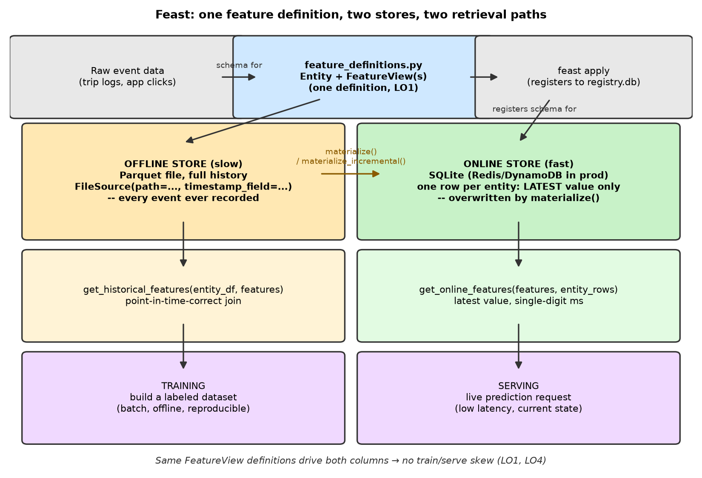

# Feature Stores — Slow vs. Fast Features with Feast

*Data Science · Worked Examples · SPEC-DS-13*

DS-5 ([Regression: NYC Taxi](regression-nyc-taxi.md)) and DS-6
([Classification: Titanic](classification-titanic.md)) both built a feature matrix once, in a
notebook, and fed it straight into `fit()`. That's fine for a one-off model. It falls apart the
moment the same model needs to run twice — once offline, to produce the training set, and once
online, to answer a live prediction request in milliseconds — because now two different pieces of
code have to compute the *same* feature, and they will eventually disagree. This chapter is about
the tool built specifically to stop that from happening: a **feature store**, worked through with
[Feast](https://github.com/feast-dev/feast), on a small, fully local, fully reproducible example.

If you've ever maintained a REST DTO and its corresponding JPA entity by hand and watched them drift
out of sync after six months of "quick" changes on one side only, you already understand the failure
mode this chapter exists to prevent — just applied to features instead of fields.

## 1. What & why — train/serve skew

Say you're scoring delivery drivers for a "likely to complete this trip" model. Training needs a
column like `conv_rate` (the driver's historical accepted-trip rate) computed for thousands of
historical rows, each timestamped to when the *training example* happened — a batch job, run once,
reading from a data warehouse. Serving needs the *same* `conv_rate`, for *one* driver, computed fresh,
returned in single-digit milliseconds as part of a live API call.

Two different systems end up computing "the same" feature: a batch SQL/Spark job for training, and
some hand-rolled online lookup (a cache, a microservice, an inline computation) for serving. They are
never actually the same code. Column names drift (`conv_rate` vs. `conversion_rate`), a `NULL`-handling
rule differs, a rolling window is "30 days" in one and "last calendar month" in the other, a unit
changes. The model was trained on one definition and is scored in production against a *silently
different* one. This is **train/serve skew**, and it is one of the most common causes of a model that
validates beautifully offline and then quietly underperforms — or actively misbehaves — once it's live,
with no exception thrown anywhere to tell you why.

The fix a feature store provides: **define each feature exactly once**, and hand both the training
path and the serving path the same SDK to fetch it, so there is only ever one implementation to drift
from. This chapter's whole worked example is that one definition — a Feast `FeatureView` — read by
two different retrieval calls, `get_historical_features()` (training) and `get_online_features()`
(serving) (LO1).

## 2. Concept — slow vs. fast features, offline vs. online stores

**Slow (batch) features** are aggregates over history: a driver's 30-day acceptance rate, a
customer's lifetime spend, a product's average rating. They change gradually, tolerate being computed
by an overnight job, and a training set needs *years* of them.

**Fast (near-real-time) features** are recent, high-frequency signals: how many trips this driver has
completed *today*, minutes since their last trip, the last five clicks on a product page. Staleness of
minutes, not days, actively hurts prediction quality, and only the *current* value is ever needed for
serving.

Feast keeps these on two physically different stores behind one API, per
[NOTE-17-feast-api.md](../../research/NOTE-17-feast-api.md) (verified against Feast 0.66.0 on
2026-09-02):

| | Offline store | Online store |
|---|---|---|
| **Holds** | Every historical value, timestamped | Only the *latest* value per entity |
| **Backing** in this chapter | A local Parquet file (`FileSource`) | A local SQLite file — Redis or DynamoDB in production |
| **Read by** | `get_historical_features()` | `get_online_features()` |
| **Used for** | Building a training set | Answering a live prediction request |
| **Latency** | Seconds to minutes (batch scan) | Single-digit milliseconds |

A JVM analogy: the offline store is like an audit-log table you replay to reconstruct state as of any
past point in time; the online store is a `ConcurrentHashMap<EntityId, LatestValue>` you look up by
key. Same underlying data, two access patterns, two very different latency budgets — and Feast is the
one client library that knows how to talk to both, keyed off the exact same feature definitions.

Crucially, "slow vs. fast" is a property of *how the feature is computed and refreshed*, not of which
store holds it — both `driver_stats` (slow) and `driver_activity` (fast) in this chapter's demo end up
in the *same kind* of online store once materialized. What differs is how often new values arrive and
how short a staleness window is tolerable, which is why each `FeatureView` below declares its own
`ttl` (time-to-live) — Section 3.

## 3. Feast setup — repo, entity, feature views, offline + online stores

### Environment

```text
Python 3.13.7
feast==0.66.0
pandas==2.3.3
numpy==2.5.2
matplotlib==3.11.1
```

Installed 2026-09-02 into a **dedicated virtual environment**, `.venv-feast`, separate from this
project's main `.venv` (`pip install feast==0.66.0 pandas`), per
[NOTE-17-feast-api.md](../../research/NOTE-17-feast-api.md), which confirmed Feast 0.66.0 installs
cleanly and runs a local (file offline + SQLite online) demo on Python 3.13. One real wrinkle worth
flagging up front: `feast==0.66.0` constrains `pandas<3`, so `pip install feast pandas` resolved
`pandas==2.3.3` here — *older* than the `pandas==3.0.5` pinned elsewhere in this project
([NOTE-2-package-versions](../../research/NOTE-2-package-versions.md)). That's exactly why this
chapter uses its own venv rather than installing Feast into the shared one: a feature-store client is
a separate deployable (it runs inside your training pipeline and your serving process, not inside
every notebook), and pinning it apart from the rest of your data-science tooling is realistic, not
just a workaround.

### 3.1 The scenario

A delivery-driver risk-scoring model, the same shape of problem Feast's own quickstart docs use
([source: Feast Quickstart](https://docs.feast.dev/getting-started/quickstart) (checked 2026-09-02),
confirmed in NOTE-17). One entity, `driver`, keyed by `driver_id`, with two feature groups:

- `driver_stats` — **slow**: `conv_rate` and `avg_daily_trips`, one row per driver per day, standing
  in for a nightly batch aggregation job.
- `driver_activity` — **fast**: `trips_today` and `minutes_since_last_trip`, several rows per driver
  on the final day, standing in for a frequently-updated live counter.

### 3.2 `feature_store.yaml` — where the two stores live

Every Feast repo has exactly one of these, declaring the offline provider, the online store backend,
and where the registry (the catalog of every entity/feature view ever applied) is kept:

```yaml
project: driver_demo
provider: local
registry: data/registry.db
online_store:
  type: sqlite
  path: data/online_store.db
entity_key_serialization_version: 3
```

`provider: local` plus `online_store.type: sqlite` is exactly the "local demo" combination NOTE-17
confirmed as installable and runnable — no cloud account, no Docker, nothing beyond this project's
`.venv-feast`. `entity_key_serialization_version: 3` silences a deprecation warning Feast 0.66.0 emits
otherwise (a newer key-encoding format is becoming mandatory; observed directly when first running
`feast apply` without it, then fixed).

### 3.3 `feature_definitions.py` — the ONE definition (LO1)

This is the file that matters most in the whole chapter. `feast apply` scans it and registers
everything it finds; `get_historical_features()` and `get_online_features()` both read *these exact*
objects — there is no second copy anywhere.

```python
from __future__ import annotations

from datetime import timedelta

from feast import Entity, FeatureView, Field, FileSource
from feast.types import Float32, Int64
from feast.value_type import ValueType

# --- Entity ---------------------------------------------------------------
# The join key every feature view below is keyed on. In a Java service, think
# of this as the primary key a feature lookup is always parameterised by.
driver = Entity(
    name="driver",
    join_keys=["driver_id"],
    value_type=ValueType.INT64,
    description="A delivery driver, identified by driver_id.",
)

# --- Offline sources (Parquet, generated by generate_data.py) -------------
driver_stats_source = FileSource(
    name="driver_stats_source",
    path="data/driver_stats.parquet",
    timestamp_field="event_timestamp",
)

driver_activity_source = FileSource(
    name="driver_activity_source",
    path="data/driver_activity.parquet",
    timestamp_field="event_timestamp",
)

# --- Feature views ----------------------------------------------------------
# SLOW / batch features: nightly-aggregated trip history. Updated once a day
# in production (e.g. an overnight Spark/SQL job), so `ttl` is generous.
driver_stats_fv = FeatureView(
    name="driver_stats",
    entities=[driver],
    ttl=timedelta(days=21),
    schema=[
        Field(name="conv_rate", dtype=Float32),
        Field(name="avg_daily_trips", dtype=Float32),
    ],
    online=True,
    source=driver_stats_source,
)

# FAST / near-real-time features: updated every few minutes from live app
# activity in production (a streaming job, not shown here -- see the chapter's
# Pitfalls section). Short `ttl`: a value older than a couple of hours is
# considered stale for serving.
driver_activity_fv = FeatureView(
    name="driver_activity",
    entities=[driver],
    ttl=timedelta(hours=3),
    schema=[
        Field(name="trips_today", dtype=Int64),
        Field(name="minutes_since_last_trip", dtype=Float32),
    ],
    online=True,
    source=driver_activity_source,
)
```

`Entity`, `FeatureView`, `FileSource`, `Field`, and the `feast.types` scalar types (`Float32`,
`Int64`) are the confirmed 0.66.0 API surface per NOTE-17 — this chapter deliberately does not use
`EntityDataSet` or Spark-based batch retrieval, which NOTE-17 flags as the old, pre-0.66 interface.
`ttl` is the mechanism that ties back to Section 2: it's Feast's way of encoding "how stale is too
stale for this *particular* feature" per feature view, independently of how the offline/online split
itself works.

### 3.4 Registering it — `feast apply`

Run from the directory containing `feature_store.yaml` (`code/feast_demo/feature_repo/`):

```bash
cd feature_repo
../../../../../.venv-feast/Scripts/feast.exe apply
```

Real captured output ([artefacts/feast_retrieval_output.txt](artefacts/feast_retrieval_output.txt)
has the full session):

```text
No project found in the repository. Using project name driver_demo defined in feature_store.yaml
Applying changes for project driver_demo
Created project driver_demo
Created entity driver
Created feature view driver_activity
Created feature view driver_stats

Created sqlite table driver_demo_driver_activity
Created sqlite table driver_demo_driver_stats
```

`feast apply` did three things: wrote the entity/feature-view metadata to `registry.db` (the
catalog), and created one empty SQLite table *per feature view* in `online_store.db` — nothing is
populated with actual values yet. That's `materialize()`'s job, Section 4.

## 4. Worked example — training features and online features, one SDK

### 4.1 Generating the two sources

`generate_data.py` writes the two Parquet files `feature_definitions.py` points at. One detail worth
reading before the code: the demo's synthetic timestamps are anchored to `datetime.now(timezone.utc)`
at generation time — not a fixed calendar date — because Feast's online store enforces each
`FeatureView`'s `ttl` against the *real* wall clock when you query it, not against whatever date the
demo data happens to use. A fixed date would make this chapter's online retrieval silently start
returning nulls the day real time drifted past that `ttl` window. The anchor is written to
`data/anchor_time.txt` so every later step reads back the exact same "now":

```python
from __future__ import annotations

from datetime import datetime, timedelta, timezone
from pathlib import Path

import numpy as np
import pandas as pd

SEED = 42
DATA_DIR = Path(__file__).parent / "feature_repo" / "data"
ANCHOR_FILE = DATA_DIR / "anchor_time.txt"
DRIVER_IDS = [1001, 1002, 1003, 1004, 1005]

NOW = datetime.now(timezone.utc).replace(minute=0, second=0, microsecond=0)


def make_driver_stats() -> pd.DataFrame:
    """SLOW features: one row per driver per day, 14 days back from NOW."""
    rng = np.random.default_rng(SEED)
    rows = []
    for driver_id in DRIVER_IDS:
        base_conv = rng.uniform(0.55, 0.95)
        base_trips = rng.uniform(8, 25)
        for day_offset in range(14, -1, -1):  # oldest first
            ts = NOW - timedelta(days=day_offset)
            drift = (14 - day_offset) * rng.uniform(-0.01, 0.01)
            rows.append({
                "driver_id": driver_id,
                "event_timestamp": ts,
                "conv_rate": float(np.clip(base_conv + drift, 0.0, 1.0)),
                "avg_daily_trips": float(max(0.0, base_trips + drift * 10)),
            })
    df = pd.DataFrame(rows)
    df["created"] = NOW  # Feast convention: a second timestamp for write-time dedup
    return df
```

(`make_driver_activity()` follows the same shape for the fast feature group — full listing:
[code/feast_demo/generate_data.py](code/feast_demo/generate_data.py).)

```bash
.venv-feast/Scripts/python.exe generate_data.py
```

```text
anchor NOW = 2026-09-02T19:00:00+00:00 -> .../feature_repo/data/anchor_time.txt
wrote 75 rows -> .../feature_repo/data/driver_stats.parquet
wrote 40 rows -> .../feature_repo/data/driver_activity.parquet
 driver_id           event_timestamp  conv_rate  avg_daily_trips                   created
      1005 2026-08-31 19:00:00+00:00   0.637692        16.177845 2026-09-02 19:00:00+00:00
      1005 2026-09-01 19:00:00+00:00   0.475740        14.558325 2026-09-02 19:00:00+00:00
      1005 2026-09-02 19:00:00+00:00   0.428687        14.087789 2026-09-02 19:00:00+00:00
```

### 4.2 `materialize()` — copying offline into online

Materialization is the bridge in the architecture diagram below: it reads a time window from the
offline store and writes, per entity, whichever row is *most recent* into the online store —
overwriting whatever was there before.

```python
def run_materialize(store: FeatureStore) -> None:
    """Copy feature values from the offline (Parquet) store into the online
    (SQLite) store, for the window covering all generated data."""
    start = NOW - timedelta(days=21)
    end = NOW
    store.materialize(start_date=start, end_date=end)
    print("[materialize] offline -> online copy complete.\n")
```

`FeatureStore.materialize(start_date, end_date, feature_views=None, ...)` — signature confirmed
directly against the installed 0.66.0 package (`inspect.signature`), per NOTE-17. In production this
runs on a schedule (Airflow, a cron job, an orchestrator step) — every few minutes for fast features,
nightly for slow ones — via `materialize_incremental()`, which picks up from wherever the last run
left off instead of re-scanning the whole window each time.

### 4.3 `get_historical_features()` — point-in-time-correct training rows (LO3)

This is the retrieval call training code uses, and its defining behaviour is the **point-in-time
join**: you hand it an `entity_df` of `(driver_id, event_timestamp)` pairs — one per training
example — and for *every row*, Feast attaches whichever feature value was the most recently known
**as of that row's own timestamp**, never a value from after it
([NOTE-17-feast-api.md](../../research/NOTE-17-feast-api.md), confirmed against the official Feast
docs). That per-row timestamp bound is exactly what prevents point-in-time leakage: a training example
dated ten days ago cannot see a feature value that was only computed yesterday.

```python
def run_historical_retrieval(store: FeatureStore) -> pd.DataFrame:
    """TRAINING path: point-in-time-correct join. For each (driver_id,
    event_timestamp) row in entity_df, Feast attaches the feature values that
    were the MOST RECENT AS OF that timestamp -- never a value from the future
    relative to that row."""
    entity_df = pd.DataFrame({
        "driver_id": [1001, 1001, 1002, 1003],
        "event_timestamp": [
            NOW - timedelta(days=10),   # driver 1001, 10 days ago
            NOW,                         # driver 1001, right now
            NOW - timedelta(days=5),    # driver 1002, 5 days ago
            NOW,                         # driver 1003, right now
        ],
    })
    job = store.get_historical_features(
        entity_df=entity_df,
        features=[
            "driver_stats:conv_rate",
            "driver_stats:avg_daily_trips",
        ],
    )
    df = job.to_df()
    print("[get_historical_features] point-in-time-correct training rows:")
    print(df.sort_values(["driver_id", "event_timestamp"]).to_string(index=False))
    return df
```

Real output:

```text
[get_historical_features] point-in-time-correct training rows:
 driver_id           event_timestamp  conv_rate  avg_daily_trips
      1001 2026-08-23 19:00:00+00:00   0.880474        15.669845
      1001 2026-09-02 19:00:00+00:00   0.874866        15.613771
      1002 2026-08-28 19:00:00+00:00   0.513299        21.447451
      1003 2026-09-02 19:00:00+00:00   0.653797        10.380756
```

Read the two driver-1001 rows side by side: the row timestamped ten days ago gets `conv_rate=0.8805`,
and the row timestamped *now* gets `0.8749` — a **different** value for the **same driver**, because
each row correctly only sees the trip history that existed as of *its own* timestamp. A naive "just
join on `driver_id` and grab whatever's latest" implementation would have handed *both* rows the same
(newer) number — silently leaking ten days of future information into an "historical" training
example. `get_historical_features()` never does that; the join key is `(entity, time)`, not just
`entity`.

### 4.4 `get_online_features()` — the serving path (LO3)

The other retrieval call, used by whatever process answers live prediction requests. No timestamp
argument at all — just the entity you're scoring *right now*:

```python
def run_online_retrieval(store: FeatureStore) -> pd.DataFrame:
    """SERVING path: latest known value per entity, right now -- the fields a
    live prediction request would fetch in single-digit milliseconds from
    SQLite (Redis/DynamoDB in production), no Parquet scan involved."""
    response = store.get_online_features(
        features=[
            "driver_stats:conv_rate",
            "driver_stats:avg_daily_trips",
            "driver_activity:trips_today",
            "driver_activity:minutes_since_last_trip",
        ],
        entity_rows=[
            {"driver_id": 1001},
            {"driver_id": 1002},
            {"driver_id": 1003},
        ],
    )
    df = response.to_df()
    print("[get_online_features] latest values for a live request:")
    print(df.to_string(index=False))
    return df
```

Real output:

```text
[get_online_features] latest values for a live request:
 driver_id  conv_rate  avg_daily_trips  trips_today  minutes_since_last_trip
      1001   0.874866        15.613770            6                40.243675
      1002   0.539256        21.707018            3                42.486187
      1003   0.653797        10.380756            6                 6.243503
```

Notice `features=[...]` in both calls names the **exact same** `driver_stats:conv_rate` string — the
same `FeatureView`, defined once in `feature_definitions.py` — from two different functions with two
different performance profiles. That's LO1 made concrete, not asserted: one definition, two retrieval
paths, and this script proves it by calling both against the identically-registered feature view.

### 4.5 The train/serve-skew punchline

Driver 1001's `conv_rate`, "as of now," retrieved two ways:

```text
driver 1001 conv_rate via get_historical_features (row timestamped NOW): np.float64(0.874866159786819)
driver 1001 conv_rate via get_online_features       (latest, right now): np.float64(0.8748661875724792)
agree to within 1e-6 (both retrieval paths, same FeatureView): True
```

Same feature, same underlying source row, two different code paths — and the numbers agree to six
decimal places, not bit-for-bit. That tiny residual (~2×10⁻⁸) is real and worth understanding rather
than hand-waving away: `driver_stats`' schema declares `conv_rate` as `Field(..., dtype=Float32)`
(Section 3.3), and the online store round-trips every value through that 32-bit protobuf
representation on write, while the offline Parquet path stays float64 throughout. **This is not
train/serve skew** — it's floating-point storage precision, a completely different (and much smaller)
phenomenon — but it's exactly the kind of thing that looks alarming in a diff until you know which
`Field` declaration is responsible. The full session, including this comparison, is captured verbatim
in [artefacts/feast_retrieval_output.txt](artefacts/feast_retrieval_output.txt).

Compare that to driver 1002: the historical row (5 days ago) shows `conv_rate=0.5133`, but the online
(right now) value is `0.5393` — a real, meaningful difference, because `driver_stats` drifts day to
day and five days is enough time for it to move. That's the legitimate reason offline and online
values differ for the *same* feature: not skew, just time passing between the training example's
timestamp and "now."

## 5. Where a feature store fits in production (LO4)



Read the diagram top to bottom: `feature_definitions.py` is the single source of truth at the top;
`feast apply` registers it; the offline store accumulates full history, the online store holds only
the latest row per entity, and `materialize()` is the one-directional bridge between them; training
and serving each call a different retrieval function, but both functions are reading the *same*
registered `FeatureView`.

**When this is worth adopting**: once more than one model — or more than one *version* of the same
model — needs the same features, and once training and serving are genuinely separate systems (a
batch training job vs. a live API), a feature store earns its keep by removing the duplicate
implementation that would otherwise drift. It also gives you a **catalog**: `feast apply`'s registry
is a place to see every feature that exists, who defined it, and what reads it — the same value a
schema registry or an API gateway's route table gives you in a services architecture, instead of
every team re-deriving "what does `conv_rate` mean here" from tribal knowledge.

**When it's not worth it yet** (this is Section 6.3's pitfall, previewed here): a single model, a
single team, features computed once and read once, with no separate low-latency serving path — a
feature store is pure operational overhead (a registry to keep in sync, an online store to run, a
materialization job to schedule) for a problem you don't have yet. Reach for one when you *feel*
duplicate feature logic starting to exist, not before.

## 6. Pitfalls

### 6.1 Point-in-time leakage — the mistake a feature store is built to prevent

Section 4.3's point-in-time join isn't a nice-to-have; it's the whole reason `get_historical_features`
takes a timestamped `entity_df` instead of just a list of entity IDs. Skip it — join training labels to
features on `driver_id` alone, taking whichever row is simply "latest" — and every training example
implicitly sees feature values computed *after* the event it's supposed to be predicting. The model
then trains on information it could never have had at prediction time, validates suspiciously well
offline, and underperforms the moment it's serving live traffic where that future information doesn't
exist yet. NOTE-17 is explicit that this join is "implicit in `get_historical_features()`" — meaning
you get it for free by using the API correctly, and you lose it entirely by reconstructing the join
yourself with a plain merge.

### 6.2 Materialization staleness

`materialize()` is not automatic or continuous — it's a job you (or an orchestrator) run on a
schedule. Between runs, the online store serves whatever was written last time, however old that is.
Section 3.3's `ttl=timedelta(hours=3)` on `driver_activity` is Feast's guardrail against serving a
value that's aged past being useful: query the online store for a value older than its `ttl` and
Feast returns a null for that field instead of a stale number silently masquerading as fresh. Set
`ttl` too generous, though, and a genuinely stale value slips through *without* triggering that
guardrail — there's no substitute for actually knowing how often your materialization job runs
relative to how fast each feature actually changes.

### 6.3 Adopting a feature store before you need one

A feature store buys you exactly one thing: **one feature definition serving two retrieval paths that
would otherwise be two hand-written implementations**. If your project only has one of those paths —
say, a batch model with no live serving at all — Feast is pure ceremony: a registry, an online store,
a materialization schedule, all maintaining a train/serve consistency guarantee you don't need because
there's no second "serve" system to drift from the first. Section 5's rule of thumb applies here
directly: adopt this once duplicate feature logic is a real, felt problem, not preemptively because
"production ML systems use feature stores."

## 7. Recap & what's next

- **Train/serve skew** happens when training and serving compute "the same" feature with two
  different implementations that quietly drift apart. Feast's fix is structural: define a
  `FeatureView` exactly once and read it through two retrieval calls instead of two codebases (LO1).
- **Slow (batch) and fast (near-real-time) features** aren't a property of the store — they're a
  property of how often a feature is recomputed and how short a staleness window it can tolerate,
  encoded per `FeatureView` as `ttl` (LO2).
- The Feast workflow — `Entity` → `FileSource` → `FeatureView` → `feast apply` → `materialize()` →
  `get_historical_features()` / `get_online_features()` — ran fully locally in this chapter (Parquet
  offline store, SQLite online store), captured end-to-end in
  [artefacts/feast_retrieval_output.txt](artefacts/feast_retrieval_output.txt) (LO3).
- `get_historical_features()`'s **point-in-time join** attaches, to every training row, only the
  feature values that existed as of that row's own timestamp — Section 4.3 showed the same driver
  getting two legitimately different `conv_rate` values ten days apart, proving the join respects time
  per row rather than just grabbing "the latest" (LO3).
- A feature store earns its cost once **more than one system** needs the **same** feature with
  **different** latency requirements — not before (LO4).

DS-12 (Model Registry with MLflow) covers the adjacent piece of production ML infrastructure — not
*what features* a model saw, but *which model artifact*, with *which hyperparameters*, is the one
actually deployed. DS-17 (Production Monitoring & Drift) picks up what happens after both are in
place: watching whether the features a deployed model sees in production keep matching the
distribution it was trained on.
