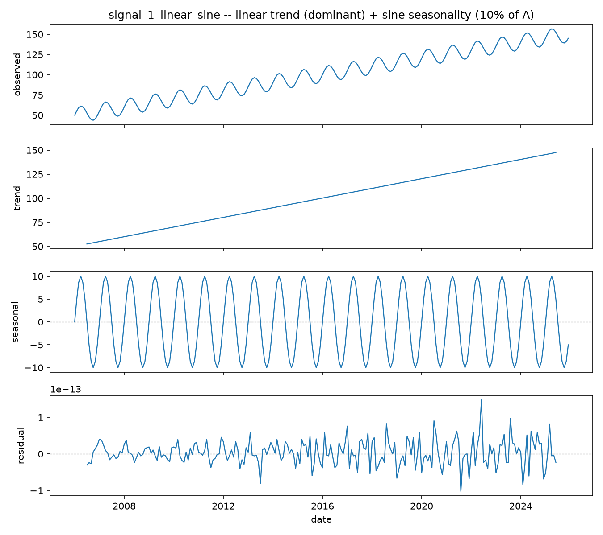
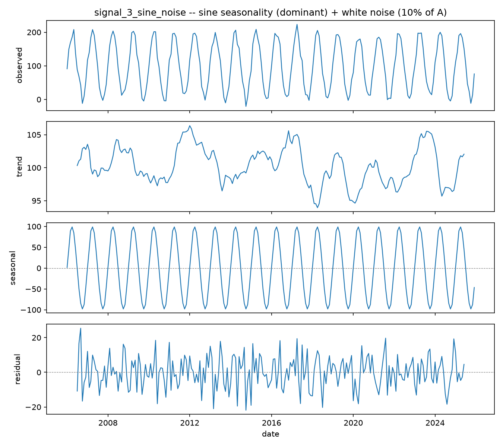
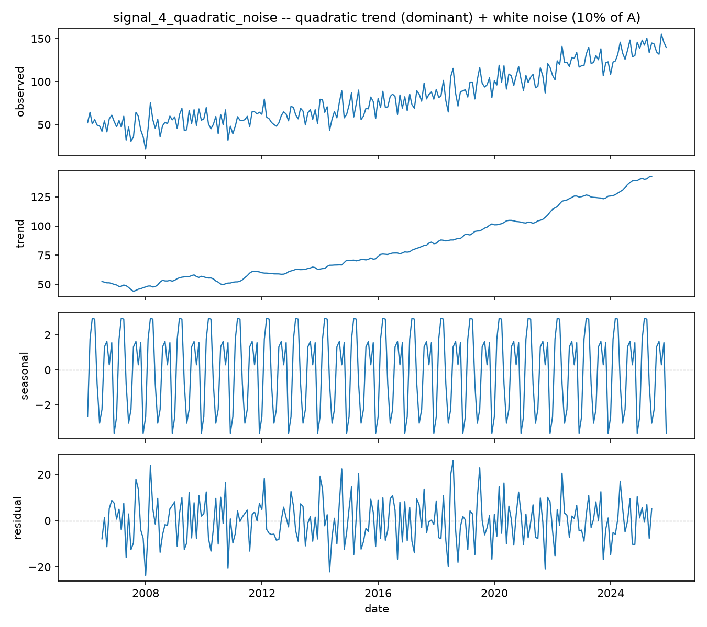
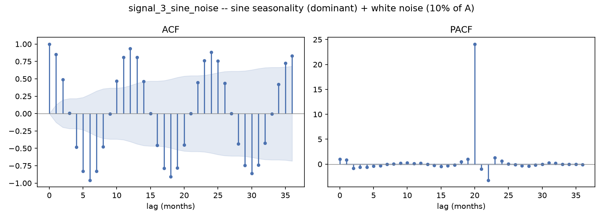
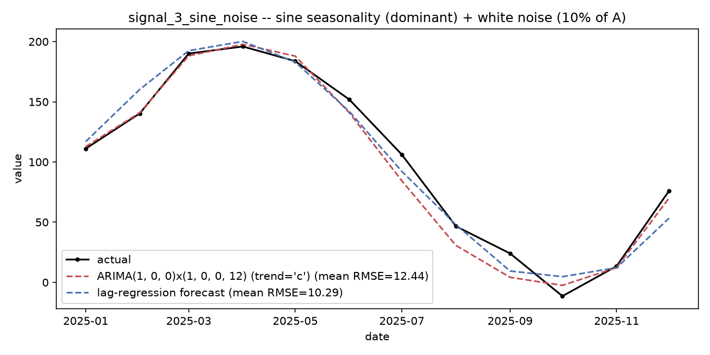

# Forecasting Composite Signals — Trend, Seasonality, and Why the Split Is Different

*Data Science · Worked Examples · SPEC-DS-9*

The [train/validation/holdout chapter](train-valid-holdout-split.md) drew a boundary around itself on
purpose: "This chapter covers the simple, non-temporal case: every row is an independent observation
… Time-series forecasting needs a different splitting strategy entirely — rows are not independent
across time, and a random split would let the model train on the future and be 'validated' on the
past." This chapter picks up exactly there.

Forecasting looks like regression — you still have features, a target, a model, a metric — but the
rows are ordered in time, and that one fact breaks the assumption every technique in that earlier
chapter quietly relied on: that shuffling the rows before splitting is harmless. It isn't, here. This
chapter shows you why, then teaches the toolkit for building a forecasting model correctly:
decomposing a signal into trend/seasonality/residual, reading autocorrelation, fitting AR/ARIMA models
and a lag-feature regression baseline, and back-testing the honest way.

To keep every diagnostic checkable against ground truth, everything here runs on four **synthetic**
composite signals — built from a known formula, not downloaded — the same reason
[the collinearity chapter](collinearity.md) used a synthetic house-price table: you can't verify a
decomposition or a stationarity test is reading a signal correctly unless you already know what's
really in it.

## 1. What & why — the leakage picture

### 1.1 Why a random split leaks the future

[`sklearn.model_selection.train_test_split`](https://scikit-learn.org/stable/modules/generated/sklearn.model_selection.train_test_split.html)
defaults to `shuffle=True` — exactly the right call for the breast-cancer rows in the split chapter,
because a tumour sample doesn't know or care what row number it landed on. A monthly revenue figure
is not like that: row `t` was measured *after* row `t-1` and *before* row `t+1`, and a model that gets
to see row `t+1` while it's being fit and is then asked to predict row `t` isn't forecasting — it's
interpolating with a sneak preview. Shuffle a time series before splitting and that's exactly what
happens: some training rows sit chronologically *after* some test rows, so the model gets to train on
information that, in the real deployment scenario this whole exercise is standing in for, doesn't
exist yet.

scikit-learn 1.9.0 ships the fix as
[`TimeSeriesSplit(n_splits=5, max_train_size=None, test_size=None, gap=0)`](https://scikit-learn.org/stable/modules/generated/sklearn.model_selection.TimeSeriesSplit.html)
— it performs **expanding-window cross-validation**: fold *k*'s training set is every row before fold
*k*'s test block, and the training set grows fold over fold, never shrinks, and never contains a row
that comes after its own test block
([source: NOTE-12-timeseries-apis](../../research/NOTE-12-timeseries-apis.md), checked 2026-09-02).
This particular way of evaluating a forecaster — refit (or re-use) the model at each step using only
data available up to that point, forecast forward, then advance — is called a **walk-forward** or
**expanding-window backtest**: "a validation methodology that simulates live forecasting by using all
previous data … for training at each step, [with] the training set expand[ing] with each fold,
preventing future data leakage into the past"
([source: NOTE-12-timeseries-apis](../../research/NOTE-12-timeseries-apis.md), citing
[Machine Learning Mastery: How to Backtest Machine Learning Models for Time Series Forecasting](https://machinelearningmastery.com/backtest-machine-learning-models-time-series-forecasting/)
and [QuantInsti: Walk-Forward Optimization](https://blog.quantinsti.com/walk-forward-optimization-introduction/),
checked 2026-09-02).

### 1.2 Building the four signals

Every experiment in this chapter runs on four composite synthetic signals, each built from a
**dominant** component at scale `A` plus a **minor** component at 10% of `A` (the spec calls this the
"wiggle") — 20 years of monthly data, `A = 100`, wiggle `= 10`:

```python
from __future__ import annotations

import numpy as np
import pandas as pd

RNG_SEED = 42
N = 240          # 20 years of monthly data
PERIOD = 12      # monthly seasonality -> 20 full cycles
A = 100.0        # amplitude/scale of the DOMINANT component
WIGGLE = 0.10 * A  # 10.0 -- amplitude/std of the MINOR component (10% of A)


def make_signals(n: int = N, period: int = PERIOD, amplitude: float = A,
                  wiggle: float = WIGGLE, seed: int = RNG_SEED) -> dict[str, pd.Series]:
    rng = np.random.default_rng(seed)
    t = np.arange(n)
    idx = pd.date_range("2006-01-01", periods=n, freq="MS")

    linear_trend = 50.0 + amplitude * (t / (n - 1))          # 50 -> 150 over 20 years
    quadratic_trend = 50.0 + amplitude * (t / (n - 1)) ** 2   # 50 -> 150, accelerating
    sine = amplitude * np.sin(2 * np.pi * t / period)          # centred on 0, +/- A
    seasonal_wiggle = wiggle * np.sin(2 * np.pi * t / period)  # centred on 0, +/- 10% A

    noise_2 = rng.normal(0.0, wiggle, n)
    noise_3 = rng.normal(0.0, wiggle, n)
    noise_4 = rng.normal(0.0, wiggle, n)

    signals = {
        "signal_1_linear_sine": pd.Series(linear_trend + seasonal_wiggle, index=idx),
        "signal_2_linear_noise": pd.Series(linear_trend + noise_2, index=idx),
        "signal_3_sine_noise": pd.Series(100.0 + sine + noise_3, index=idx),
        "signal_4_quadratic_noise": pd.Series(quadratic_trend + noise_4, index=idx),
    }
    for s in signals.values():
        s.index.freq = "MS"
    return signals


signals = make_signals()
```

Four shapes, matching the spec exactly:

1. **`signal_1_linear_sine`** — linear trend (dominant) + sine seasonality (10% of A). Trend
   dominates; the seasonal wiggle is a small, exactly-periodic ripple on top.
2. **`signal_2_linear_noise`** — linear trend (dominant) + white noise (10% of A). Same trend, but
   the minor component is unpredictable Gaussian noise, not a repeating pattern.
3. **`signal_3_sine_noise`** — sine wave (dominant, full amplitude A) + white noise (10% of A). No
   trend at all — the whole signal oscillates around a fixed level.
4. **`signal_4_quadratic_noise`** — quadratic trend (dominant) + white noise (10% of A). A
   *non-linear*, accelerating trend, plus noise.

### 1.3 Measuring the leak

Here's the leak as a number, not just an argument. Take the simplest model that structurally
*cannot* extrapolate —
[`KNeighborsRegressor(n_neighbors=5, *, weights='uniform', algorithm='auto', ...)`](https://scikit-learn.org/stable/modules/generated/sklearn.neighbors.KNeighborsRegressor.html)
(signature verified directly against the installed scikit-learn 1.9.0, checked 2026-09-02 — it isn't
one of NOTE-5's tabulated APIs, so this chapter confirmed it against the live environment the same way
[the split chapter](train-valid-holdout-split.md) verified `load_breast_cancer()`), predicting purely
from the time index `t` — and evaluate it two ways on each signal, holding out the
same 20% of rows (48 months) either way:

```python
from sklearn.metrics import root_mean_squared_error
from sklearn.neighbors import KNeighborsRegressor


def shuffle_vs_walkforward(series: pd.Series, test_frac: float = 0.2, n_neighbors: int = 5,
                            seed: int = RNG_SEED) -> dict:
    n = len(series)
    n_test = int(round(n * test_frac))
    t = np.arange(n).reshape(-1, 1).astype(float)
    y = series.values

    # walk-forward (CORRECT): train on the first 80%, test on the trailing 20% -- a genuine
    # forecast into months the model has never seen.
    X_train_wf, X_test_wf = t[: n - n_test], t[n - n_test:]
    y_train_wf, y_test_wf = y[: n - n_test], y[n - n_test:]
    wf_model = KNeighborsRegressor(n_neighbors=n_neighbors).fit(X_train_wf, y_train_wf)
    walkforward_rmse = root_mean_squared_error(y_test_wf, wf_model.predict(X_test_wf))

    # shuffled (SPEC-DS-4's default, WRONG here): same test-set SIZE, drawn uniformly at random.
    rng = np.random.default_rng(seed)
    perm = rng.permutation(n)
    test_idx, train_idx = perm[:n_test], perm[n_test:]
    sh_model = KNeighborsRegressor(n_neighbors=n_neighbors).fit(t[train_idx], y[train_idx])
    shuffled_rmse = root_mean_squared_error(y[test_idx], sh_model.predict(t[test_idx]))

    return {"walkforward_mean_rmse": float(walkforward_rmse),
            "shuffled_mean_rmse": float(shuffled_rmse)}


leak_comparison = {name: shuffle_vs_walkforward(s) for name, s in signals.items()}
```

```text
signal_1_linear_sine    : shuffled=4.89   walk-forward=20.30   (walk-forward is 4.15x worse)
signal_2_linear_noise   : shuffled=9.19   walk-forward=13.78   (walk-forward is 1.50x worse)
signal_3_sine_noise     : shuffled=49.17  walk-forward=102.16  (walk-forward is 2.08x worse)
signal_4_quadratic_noise: shuffled=12.72  walk-forward=24.14   (walk-forward is 1.90x worse)
```


Same model, same single feature, same test-set *size* — the only thing that changed is which rows
landed in "train" versus "test." Under the shuffled split, k-NN's training set contains neighbours
from every month across the whole 20 years, including months chronologically *after* every test
point, so it's always interpolating between two known values. Under the walk-forward split, it has to
predict months it has never seen anything past — genuine extrapolation — and a k-NN model has no way
to do that except repeat whatever its nearest training neighbour (the last month it saw) told it. The
shuffled number isn't just optimistic, it's answering a *different question*: "how well can I fill in
a gap in a sequence I've already seen the whole span of" instead of "how well can I predict what
hasn't happened yet." Only the second question is what a production forecaster actually has to answer.

This is the same shape of bug as [Section 3 of the split chapter](train-valid-holdout-split.md#3-the-leakage-demo-fit-on-the-whole-dataset-get-an-optimistic-score)
— fitting on data the model shouldn't have seen yet, reported as if it were an honest number — but
there it took 200 repeated small-training-set splits and a paired t-test to make the gap
statistically undeniable (the single-split gap was identical to six decimal places). Here it doesn't:
every signal in this chapter shows a 1.5x–4.2x gap on a single, ordinary-sized split, because time
order isn't a subtle correlation between two feature columns — it's the entire structure of the
problem.

## 2. Decomposing each signal

Each signal above breaks visually into trend, seasonality, and leftover residual — that decomposition
is a diagnostic tool in its own right, not just a picture. statsmodels 0.15.0's
[`seasonal_decompose(x, model='additive', filt=None, period=None, two_sided=True, extrapolate_trend=0)`](https://www.statsmodels.org/stable/generated/statsmodels.tsa.seasonal.seasonal_decompose.html)
splits a series into an additive `observed = trend + seasonal + residual` (or multiplicative)
decomposition, using a centred moving average for the trend component
([source: NOTE-12-timeseries-apis](../../research/NOTE-12-timeseries-apis.md), checked 2026-09-02).
It needs at least two full seasonal cycles to work — this chapter's 240 months at `period=12` gives it
20:

```python
import matplotlib

matplotlib.use("Agg")
import matplotlib.pyplot as plt
from statsmodels.tsa.seasonal import seasonal_decompose

PERIOD = 12


def plot_decomposition(series: pd.Series, name: str, title: str) -> None:
    result = seasonal_decompose(series, model="additive", period=PERIOD)

    fig, axes = plt.subplots(4, 1, figsize=(9, 8), sharex=True)
    for ax, component, label in zip(
        axes,
        [result.observed, result.trend, result.seasonal, result.resid],
        ["observed", "trend", "seasonal", "residual"],
    ):
        ax.plot(component.index, component.values, linewidth=1.1)
        ax.set_ylabel(label)
    axes[0].set_title(title)
    axes[-1].set_xlabel("date")
    fig.tight_layout()
    fig.savefig(f"{name}_decomposition.png", dpi=150)
    plt.close(fig)
```

Reading the four decompositions side by side:

**`signal_1_linear_sine`** (linear trend + sine seasonality, no noise):



The residual panel sits essentially at zero the entire way — because signal 1 has **no random
component at all**. Trend and seasonal account for 100% of the signal by construction, which is the
whole point of using a synthetic signal here: you get to *confirm* the decomposition found exactly
what you built in, rather than trusting it on faith.

**`signal_2_linear_noise`** (linear trend + white noise):


The trend panel tracks the true linear trend closely. But look at the "seasonal" panel: signal 2 was
built with **no seasonality whatsoever**, yet `seasonal_decompose` still reports a small,
repeating pattern there — because the function doesn't test *whether* a series is seasonal, it
*assumes* `period=12` and averages accordingly, extracting whatever 12-month-periodic structure
random noise happens to produce over 20 years. This is a real pitfall of the function, not a bug in
this chapter's code: **`seasonal_decompose` will hand you a "seasonal" component whether or not the
data actually has one — pair it with the ACF/PACF diagnostics in Section 3, which distinguish real
periodicity from noise, rather than trusting the seasonal panel alone.**

**`signal_3_sine_noise`** (sine, no trend, + white noise) and **`signal_4_quadratic_noise`**
(quadratic trend + white noise) follow the same reading:





Signal 3's trend panel is flat — correctly, there is none — and its seasonal panel recovers the true
sine wave cleanly, since seasonality really is what's there. Signal 4's trend panel visibly *bends*
rather than staying straight, the tell for a non-linear trend a plain linear detrend would miss.

## 3. Stationarity, ACF/PACF, and differencing

### 3.1 Stationarity and the Augmented Dickey-Fuller test

A series is **stationary** if "its mean, variance, and autocovariance remain constant over time"
([source: NOTE-12-timeseries-apis](../../research/NOTE-12-timeseries-apis.md), citing
[QuantInsti: Stationarity](https://blog.quantinsti.com/stationarity/), checked 2026-09-02) — and
AR/ARIMA models need it, because an AR model's coefficients describe one fixed relationship between a
value and its own past; if the mean is drifting (a trend) that "one fixed relationship" doesn't exist.
statsmodels 0.15.0's
[`adfuller(x, maxlag=None, regression='c', autolag='AIC', ...)`](https://www.statsmodels.org/stable/generated/statsmodels.tsa.stattools.adfuller.html)
runs the **Augmented Dickey-Fuller test**: its null hypothesis is that the series has a unit root
(i.e. is *non*-stationary); a p-value below 0.05 rejects that null, meaning the test found the series
stationary ([source: NOTE-12-timeseries-apis](../../research/NOTE-12-timeseries-apis.md)).

```python
from statsmodels.tsa.stattools import adfuller


def adf_report(series: pd.Series, label: str) -> dict:
    stat, pvalue, n_lags_used, n_obs, crit_values, _ = adfuller(
        series.dropna(), autolag="AIC", result_object=False)
    stationary = pvalue < 0.05
    print(f"ADF [{label}]: statistic={stat:.4f}, p-value={pvalue:.4g}, stationary={stationary}")
    return {"adf_stat": stat, "adf_pvalue": pvalue, "stationary": stationary}
```

Run on the raw signals:

| signal | ADF statistic | p-value | stationary? |
|---|---|---|---|
| `signal_1_linear_sine` | 0.0005 | 0.9586 | **No** — a trend is present |
| `signal_2_linear_noise` | -0.6183 | 0.8668 | **No** — a trend is present |
| `signal_3_sine_noise` | -4.3210 | 0.0004 | **Yes** — no trend, oscillates around a fixed level |
| `signal_4_quadratic_noise` | 0.7120 | 0.9901 | **No** — a (non-linear) trend is present |

Exactly as the decompositions suggested: the three trending signals fail the stationarity test, and
the pure oscillator (signal 3) passes it. **Differencing** — subtracting each value from the one
before it, `y_t - y_{t-1}` — removes a linear trend; a second differencing pass removes a quadratic
one, because differencing a degree-`k` polynomial in `t` produces a degree-`(k-1)` polynomial
([source: NOTE-12-timeseries-apis](../../research/NOTE-12-timeseries-apis.md)):

| signal | differencing applied | ADF p-value after | stationary after? |
|---|---|---|---|
| `signal_1_linear_sine` | `d=1` | ~0 (see note below) | **Yes** |
| `signal_2_linear_noise` | `d=1` | 3.36e-12 | **Yes** |
| `signal_4_quadratic_noise` | `d=2` (twice) | 2.97e-13 | **Yes** |

One number needs a caveat: signal 1's differenced ADF statistic printed as roughly -1.25e14, an
absurd-looking magnitude. This is a genuine artefact of signal 1 having **zero random noise** — its
first difference is an *exactly deterministic* sequence (a constant step plus a perfectly repeating
differenced sine), leaving the ADF test's residual variance essentially at floating-point zero, which
blows up the ratio the test statistic is built from. The p-value is still meaningfully ~0 (reject
non-stationarity), but treat a test statistic of that magnitude as "this series has no meaningful
noise left to test," not as "extremely, unusually stationary" — a real dataset will never produce a
number like this, only a synthetic one built with no noise term can.

### 3.2 ACF and PACF

**Autocorrelation** measures "the linear relationship between lagged values of a time series … how a
series correlates with its own past values at different time lags"
([source: NOTE-12-timeseries-apis](../../research/NOTE-12-timeseries-apis.md), citing
[Hyndman & Athanasopoulos, *Forecasting: Principles and Practice* — Autocorrelation](https://otexts.com/fpp2/autocorrelation.html),
checked 2026-09-02). The **ACF** (autocorrelation function) plots that correlation at every lag
directly; the **PACF** (partial autocorrelation function) plots the correlation at each lag *after*
removing the effect already explained by shorter lags — which is what makes PACF the tool for reading
off an AR model's order: an AR(p) process's PACF cuts off sharply after lag `p`. statsmodels 0.15.0
provides both as
[`acf(x, nlags=None, alpha=None, fft=True, ...)`](https://www.statsmodels.org/stable/generated/statsmodels.tsa.stattools.acf.html)
and
[`pacf(x, nlags=None, method='ywadjusted', alpha=None, ...)`](https://www.statsmodels.org/stable/generated/statsmodels.tsa.stattools.pacf.html)
([source: NOTE-12-timeseries-apis](../../research/NOTE-12-timeseries-apis.md)):

```python
from statsmodels.tsa.stattools import acf, pacf


def plot_acf_pacf(series: pd.Series, name: str, title: str, nlags: int = 36) -> None:
    acf_vals, acf_confint = acf(series, nlags=nlags, alpha=0.05, fft=True, result_object=False)
    pacf_vals, pacf_confint = pacf(series, nlags=nlags, alpha=0.05, method="ywadjusted")

    fig, (ax1, ax2) = plt.subplots(1, 2, figsize=(11, 4))
    for ax, vals, confint, label in ((ax1, acf_vals, acf_confint, "ACF"),
                                      (ax2, pacf_vals, pacf_confint, "PACF")):
        lags = np.arange(len(vals))
        ax.vlines(lags, 0, vals, color="#4C72B0")
        ax.fill_between(lags, confint[:, 0] - vals, confint[:, 1] - vals, alpha=0.15)
        ax.axhline(0, color="grey", linewidth=0.7)
        ax.set_title(label)
    fig.suptitle(title)
    fig.tight_layout()
    fig.savefig(f"{name}_acf_pacf.png", dpi=150)
    plt.close(fig)
```


Signal 1's ACF barely decays across 36 lags (three years) — a slowly-decaying ACF that never crosses
the confidence band is the classic visual signature of a *non-stationary* (trending) series, matching
the ADF result above exactly: every lag is correlated with every other lag mainly because they're all
riding the same upward trend, not because of any short-range dependency. This is precisely why you
read ACF/PACF *after* checking stationarity (Section 3.1), not instead of it — on a trending series,
ACF's shape tells you "there's a trend," not "here's the AR order."



Signal 3 (already stationary — no differencing needed) tells a completely different, much more
useful story: ACF oscillates with peaks recurring every 12 lags — read directly off the plot, that's
the 12-month seasonal period, found from the data with no formula, only the plot. PACF spikes at lag 1
and lag 12 and stays inside the confidence band everywhere else — the textbook signature that both a
short-range AR(1) term and a **seasonal** AR term at lag 12 belong in the model. Section 4 uses exactly
that reading to choose signal 3's model order.

## 4. Modelling each signal: AR/ARIMA vs. a lag-feature regression baseline

### 4.1 The two model families

**AR(p)** — an autoregressive model of order `p` — is "a regression of the variable against itself":
`y_t = c + φ₁y_{t-1} + φ₂y_{t-2} + … + φ_p y_{t-p} + ε_t`, where `ε_t` is white noise
([source: NOTE-12-timeseries-apis](../../research/NOTE-12-timeseries-apis.md), citing
[Hyndman & Athanasopoulos — Autoregressive models](https://otexts.com/fpp2/AR.html), checked
2026-09-02). **ARIMA(p, d, q)** generalises it with differencing (`d`, Section 3.1) and a moving-average
term (`q`); statsmodels 0.15.0 exposes it as
[`ARIMA(endog, order=(p,d,q), seasonal_order=(P,D,Q,s), trend=None, ...)`](https://www.statsmodels.org/stable/generated/statsmodels.tsa.arima.model.ARIMA.html),
where `seasonal_order` adds a *second*, seasonal AR/MA structure at period `s`
([source: NOTE-12-timeseries-apis](../../research/NOTE-12-timeseries-apis.md)). Alongside it, this
chapter fits a **lag-feature regression baseline** — an ordinary `LinearRegression` whose features are
simply the previous 12 months (`lag_1` … `lag_12`):

```python
from sklearn.linear_model import LinearRegression
from sklearn.model_selection import TimeSeriesSplit

N_LAGS = 12
N_SPLITS = 5
TEST_SIZE = 12  # each backtest fold forecasts one year ahead


def make_lag_features(series: pd.Series, n_lags: int = N_LAGS) -> tuple[pd.DataFrame, pd.Series]:
    frame = pd.DataFrame({"y": series})
    for lag in range(1, n_lags + 1):
        frame[f"lag_{lag}"] = series.shift(lag)
    frame = frame.dropna()
    X = frame[[f"lag_{lag}" for lag in range(1, n_lags + 1)]]
    return X, frame["y"]


def backtest_lag_regression(X: pd.DataFrame, y: pd.Series) -> dict:
    tscv = TimeSeriesSplit(n_splits=N_SPLITS, test_size=TEST_SIZE)
    fold_rmse = []
    for train_idx, test_idx in tscv.split(X):
        model = LinearRegression().fit(X.iloc[train_idx], y.iloc[train_idx])
        pred = model.predict(X.iloc[test_idx])
        fold_rmse.append(root_mean_squared_error(y.iloc[test_idx].values, pred))
    return {"fold_rmse": np.array(fold_rmse), "mean_rmse": float(np.mean(fold_rmse))}
```

Both models are backtested with the *same* `TimeSeriesSplit(n_splits=5, test_size=12)` — five
expanding-window folds, each forecasting one year ahead from everything seen so far.

### 4.2 A gotcha worth knowing about before you hit it: ARIMA's `trend` parameter

The first attempt at signal 2 — `ARIMA(train, order=(1, 1, 0), trend="c")` — raises, on the installed
statsmodels 0.15.0:

```text
ValueError: In models with integration (`d > 0`) or seasonal integration (`D > 0`), trend terms
of lower order than `d + D` cannot be (as they would be eliminated due to the differencing
operation). For example, a constant cannot be included in an ARIMA(1, 1, 1) model, but including
a linear trend, which would have the same effect as fitting a constant to the differenced data,
is allowed.
```

This is statsmodels enforcing real algebra, not being fussy: differencing an equation `d` times
algebraically eliminates any deterministic polynomial term of degree lower than `d`, so **the `trend`
parameter's lowest included degree must be `>= d + D`**. Concretely (verified against this installed
version, 2026-09-02): with `d=1`, use `trend="t"` (a pure linear-in-time term — no separate constant,
since a constant would be canceled by the first difference and is what raises the error above); with
`d=2` and a genuinely quadratic trend, the degree-0 *and* degree-1 terms both get cancelled by the
second difference, so neither a constant (`'c'`) nor `'ct'`/`'ctt'` work either — you need a trend
specified as `[0, 0, 1]` (statsmodels' polynomial-array convention, index = degree,
1 = "include") to keep **only** the degree-2 term.

Trying exactly that for signal 4's `ARIMA(order=(1, 2, 0), trend=[0, 0, 1])`, however, converges to a
quadratic coefficient near zero (`-0.0234`, versus the true curvature of roughly `+0.0017`) and
forecasts that diverge sharply from the actual data — a numerical-conditioning problem: `t²` for `t`
up to 240 spans values in the tens of thousands, which the maximum-likelihood optimiser handles badly
as an in-model regressor. **Rather than fight ARIMA's own trend-fitting for a quadratic, this chapter
uses the alternative NOTE-12 and the spec both flag: polynomial-detrend explicitly, then fit a plain
AR on the residual** (Section 4.3 shows the code). This is a real trade-off worth remembering: ARIMA's
built-in `trend` handling is reliable for `d <= 1` (a constant or linear drift) and gets fragile fast
for higher-degree deterministic trends — reach for explicit polynomial detrending instead once you're
past a linear trend.

A second, unrelated fragility showed up backtesting the two *seasonal* models (signals 1 and 3,
Section 4.3): on some folds, fitting `ARIMA(..., seasonal_order=(1, 0, 0, 12))` raised
`numpy.linalg.LinAlgError: LU decomposition error` — the seasonal AR coefficient the optimiser found
landed essentially on the unit-root boundary (unsurprising for signal 1, which has *zero* noise and is
therefore closer to a perfectly repeating sequence than to a statistical process), which crashes the
stationary-covariance initialisation used to start the Kalman filter. Passing
`enforce_stationarity=False, enforce_invertibility=False` — statsmodels' own documented escape hatch
— fixes it in every fold without changing the forecasts in any fold that had converged fine anyway.

### 4.3 Model choice and backtest results, per signal

**Signal 1 — linear trend (dominant) + sine seasonality.** Difference once (`d=1`, per Section 3.1)
to handle the trend; the small residual seasonal wiggle needs a **seasonal AR term** or it's left on
the table entirely — a plain (non-seasonal) `ARIMA(1,1,0)` backtests at a mean RMSE of **14.55**,
while adding `seasonal_order=(1,0,0,12)` drops it to **0.0001** — because signal 1 has zero noise,
capturing the seasonal structure captures essentially the whole signal:

```python
from statsmodels.tsa.arima.model import ARIMA


def backtest_arima(series: pd.Series, order, seasonal_order, trend) -> dict:
    tscv = TimeSeriesSplit(n_splits=N_SPLITS, test_size=TEST_SIZE)
    fold_rmse = []
    for train_idx, test_idx in tscv.split(series):
        train, test = series.iloc[train_idx], series.iloc[test_idx]
        model = ARIMA(train, order=order, seasonal_order=seasonal_order, trend=trend,
                       enforce_stationarity=False, enforce_invertibility=False)
        forecast = model.fit().forecast(steps=len(test_idx))
        fold_rmse.append(root_mean_squared_error(test.values, forecast.values))
    return {"fold_rmse": np.array(fold_rmse), "mean_rmse": float(np.mean(fold_rmse))}


arima_1 = backtest_arima(signals["signal_1_linear_sine"],
                          order=(1, 1, 0), seasonal_order=(1, 0, 0, 12), trend="t")
```

The lag-feature regression baseline does even better — mean RMSE **0.0000** (machine precision) —
because with a perfectly deterministic, exactly-12-month-periodic signal, `y_t - y_{t-12}` is a
*constant* (the trend's 12-month step), so a linear regression on `lag_12` alone reconstructs the
signal exactly, no statistics required:


**Signal 2 — linear trend (dominant) + white noise.** Difference once (`d=1`); no seasonal
structure to add. `ARIMA(1,1,0)` with `trend="t"` backtests at mean RMSE **14.12**
(per-fold: `[10.61, 8.56, 12.80, 10.10, 28.56]` — note the last fold's spike, a reminder that
backtest folds have real variance of their own); the 12-lag regression baseline does modestly better
at **10.40**:


**Signal 3 — sine seasonality (dominant) + white noise, already stationary.** No differencing
needed (Section 3.1's ADF already rejects the unit-root null). `ARIMA(1,0,0)` with
`seasonal_order=(1,0,0,12)` — chosen directly from the PACF's lag-1-and-lag-12 spikes in Section 3.2
— backtests at mean RMSE **12.44**; the lag-regression baseline again edges it out at **10.29**:



**Signal 4 — quadratic trend (dominant) + white noise.** As Section 4.2 explained, this signal uses
explicit polynomial detrending instead of ARIMA's own `d=2` integration:

```python
def backtest_polynomial_detrend_ar(series: pd.Series, poly_degree: int, ar_order: int) -> dict:
    tscv = TimeSeriesSplit(n_splits=N_SPLITS, test_size=TEST_SIZE)
    t_all = np.arange(len(series))
    fold_rmse = []
    for train_idx, test_idx in tscv.split(series):
        t_train, t_test = t_all[train_idx], t_all[test_idx]
        y_train = series.iloc[train_idx]

        coeffs = np.polyfit(t_train, y_train.values, deg=poly_degree)  # fit on TRAIN prefix only
        trend_train = np.polyval(coeffs, t_train)
        trend_test = np.polyval(coeffs, t_test)

        residual_train = pd.Series(y_train.values - trend_train, index=y_train.index)
        fit = ARIMA(residual_train, order=(ar_order, 0, 0), trend="c",
                     enforce_stationarity=False, enforce_invertibility=False).fit()
        forecast = trend_test + fit.forecast(steps=len(test_idx)).values

        actual = series.iloc[test_idx].values
        fold_rmse.append(root_mean_squared_error(actual, forecast))
    return {"fold_rmse": np.array(fold_rmse), "mean_rmse": float(np.mean(fold_rmse))}
```

`polyfit(deg=2)` detrend + `AR(1)` on the residual backtests at mean RMSE **10.30** — close to the
injected noise's own standard deviation (10), essentially the best achievable — beating the lag-12
regression's **11.13**:


## 5. Per-signal recommendation table

| Signal | Shape | Stationary (raw)? | Differencing | Best model (backtest RMSE) | Scaling / detrending recommendation |
|---|---|---|---|---|---|
| `signal_1_linear_sine` | linear trend (dominant) + sine (10% A) | No | `d=1` | lag-feature regression (12 lags), RMSE ≈ 0.000 (seasonal ARIMA ties it at 0.0001) | Difference once to remove the trend; the residual seasonal wiggle needs a **seasonal AR term** (lag 12) or a lag-feature regression that includes `lag_12` — plain non-seasonal ARIMA leaves ~14.5 RMSE on the table. |
| `signal_2_linear_noise` | linear trend (dominant) + white noise (10% A) | No | `d=1` | lag-feature regression (12 lags), RMSE = 10.40 | Difference once; the differenced series is close to white noise plus drift — a low AR order is enough, don't over-fit AR lags to pure noise, and there's no seasonal term to add. |
| `signal_3_sine_noise` | sine (dominant) + white noise (10% A) | **Yes** | none | lag-feature regression (12 lags), RMSE = 10.29 | Already stationary — skip differencing. A non-seasonal AR alone can't see a 12-month cycle (backtests at 34.9 RMSE, see run log); add a **seasonal AR term** at lag 12, found directly from the PACF spike (Section 3.2). |
| `signal_4_quadratic_noise` | quadratic trend (dominant) + white noise (10% A) | No | `d=2` (or polynomial detrend) | `polyfit(deg=2)` detrend + AR(1) on residual, RMSE = 10.30 | One difference still leaves a (linear) trend — either difference **twice**, or polynomial-detrend by regressing on `t` and `t²` and model the residual with AR. Fitting the quadratic term directly inside ARIMA's own MLE is numerically fragile in practice (Section 4.2) — explicit `polyfit` + AR-on-residual is the robust choice. |

(Full precision in
[`artefacts/forecasting_recommendation_table.csv`](artefacts/forecasting_recommendation_table.csv)
and [`artefacts/forecasting_backtest_rmse.csv`](artefacts/forecasting_backtest_rmse.csv).)

The pattern across all four: the **lag-feature regression baseline is competitive with, and often
beats, ARIMA** on these signals, and it's simpler to reason about — but it wins specifically because
each signal's structure repeats with the same 12-month period the lags are built from. Ask it to
forecast a signal whose cycle length isn't a clean multiple of the lags you engineered, and ARIMA's
explicit `seasonal_order=(...,s)` parameter — which fits the period, rather than assuming you
guessed the right lags — becomes the more robust choice.

## 6. Pitfalls

### 6.1 A random split on time-ordered data

Covered in full in Section 1: `train_test_split`'s default `shuffle=True`, or a plain (non-time)
`KFold`, lets the model train on rows that come after the row it's being tested on. Section 1's bar
chart put a number on it — 1.5x to 4.2x worse honest error than the shuffled split reported — but the
size of the gap isn't the point; the *direction* always is. **For time-ordered data, always use
`TimeSeriesSplit` (or an explicit chronological holdout) — never `train_test_split`'s default or a
shuffled `KFold`.**

### 6.2 Fitting the scaler (or imputer) on the whole series

The temporal twin of [the split chapter's Section 3 leak](train-valid-holdout-split.md#3-the-leakage-demo-fit-on-the-whole-dataset-get-an-optimistic-score):
fitting a `StandardScaler` on the *entire* series before splitting means its mean and standard
deviation are computed partly from months that, at forecast time, haven't happened yet. On
`signal_2_linear_noise`, fitting on the full 240 months versus fitting on only the first 228 (this
chapter's last backtest fold's training prefix) gives visibly different numbers:

```python
from sklearn.preprocessing import StandardScaler

full_scaler = StandardScaler().fit(signals["signal_2_linear_noise"].values.reshape(-1, 1))
train_scaler = StandardScaler().fit(
    signals["signal_2_linear_noise"].values[:228].reshape(-1, 1))
print(f"fit on FULL series  -> mean={full_scaler.mean_[0]:.4f} std={full_scaler.scale_[0]:.4f}")
print(f"fit on TRAIN prefix -> mean={train_scaler.mean_[0]:.4f} std={train_scaler.scale_[0]:.4f}")
```

```text
fit on FULL series  -> mean=99.5299 std=30.1301
fit on TRAIN prefix -> mean=97.2999 std=29.2015
```

The full-series mean is pulled about 2.2 units higher, because it includes the last 12 months' higher
trend level — information a real forecaster, standing at month 228, could not have had. It's a small
gap here (the same "invisible at this scale" story the split chapter told about its own leak) but the
mechanism and the fix are identical: **fit every preprocessing step — scaler, imputer, anything with
`.fit()` — on the training prefix only, inside a `Pipeline`, exactly as the split chapter recommends.
A `Pipeline` doesn't automatically know about time order, so this discipline still has to be applied
by hand: fit on `series[:train_end]`, never on `series` as a whole.**

### 6.3 Forecasting far beyond the trend's validity

A model trained on a trend is only trustworthy for extrapolating a *short* distance past its training
data — how short depends on the trend shape. `signal_4_quadratic_noise`'s polynomial fit (Section 4.3)
tracks the next 12 months well (mean absolute error 6.58, close to the noise floor), but extend that
same fitted quadratic much further:

```python
coeffs = np.polyfit(np.arange(200), signals["signal_4_quadratic_noise"].values[:200], deg=2)
for months_out, t_future in [(0, 200), (120, 320), (240, 440)]:
    print(f"{months_out:>3} months past training end -> predicted value "
          f"{np.polyval(coeffs, t_future):.2f}")
```

```text
  0 months past training end -> predicted value 119.61
120 months past training end -> predicted value 233.30
240 months past training end -> predicted value 401.09
```

The true signal never exceeds roughly 150–160 anywhere in its 20-year history — the quadratic
extrapolated 20 years further predicts **401**, nearly 3x the highest value the model was ever
trained on. A quadratic (or any polynomial of degree ≥ 2) grows without bound, and nothing in the
fitting procedure knows or cares that the real-world process it's modelling almost certainly doesn't.
**Treat a trend model's validity as bounded to roughly the same horizon it was validated on in the
backtest (Section 4) — a model that backtests well one year out is not evidence it's safe to forecast
ten years out, especially for a non-linear trend.**

## 7. Recap & what's next

- Time-ordered rows are not independent, so [the split chapter's](train-valid-holdout-split.md)
  `shuffle=True` default leaks the future into training. Use
  [`TimeSeriesSplit`](https://scikit-learn.org/stable/modules/generated/sklearn.model_selection.TimeSeriesSplit.html)
  for an **expanding-window walk-forward backtest** instead — every fold's training set precedes its
  test set, and Section 1's bar chart showed the honest error running 1.5x–4.2x higher than a shuffled
  split reports, on every one of the four signals.
- [`seasonal_decompose`](https://www.statsmodels.org/stable/generated/statsmodels.tsa.seasonal.seasonal_decompose.html)
  splits a series into trend + seasonal + residual — useful for a first look, but it will report a
  "seasonal" component even on data with none (Section 2's signal 2), so pair it with ACF/PACF before
  trusting what it found.
- **[`adfuller`](https://www.statsmodels.org/stable/generated/statsmodels.tsa.stattools.adfuller.html)**
  tests stationarity (needed for AR/ARIMA); **differencing** (`d=1` for a linear trend, `d=2` for a
  quadratic one) restores it; **ACF/PACF** read off the right AR order and reveal a seasonal period
  directly from the data, once the series is stationary.
- **ARIMA vs. a lag-feature regression baseline**: both were backtested honestly with
  `TimeSeriesSplit`, and the recommendation table (Section 5) shows the lag-feature baseline winning
  on three of four signals here — a reminder that "the more sophisticated model" isn't automatically
  the better one; back-test and compare, every time.
- Watch for three forecasting-specific pitfalls beyond the split itself: fitting a scaler/imputer on
  the whole series (Section 6.2), and extrapolating a trend model far past where it was validated
  (Section 6.3) — a quadratic trend in particular grows without bound.

This chapter closes out the "trend, split, and validate honestly" thread that started with
[train/validation/holdout](train-valid-holdout-split.md) and continued through
[collinearity](collinearity.md) and [regression on NYC taxi fares](regression-nyc-taxi.md).
**Feature selection** is next in the curriculum — choosing *which* features earn a place in a model
from a large candidate set, the harder version of the pruning [the collinearity chapter](collinearity.md)
started.

---

### Environment

```text
statsmodels==0.15.0
scikit-learn==1.9.0
numpy==2.5.2
pandas==3.0.5
matplotlib==3.11.1
Python 3.12+
```

Pinned and verified against PyPI/official docs on 2026-09-02
([source: NOTE-12-timeseries-apis](../../research/NOTE-12-timeseries-apis.md) for the statsmodels
time-series APIs and sklearn `TimeSeriesSplit`; [source: NOTE-6-statsmodels-vif](../../research/NOTE-6-statsmodels-vif.md)
for the statsmodels package version, reused per this chapter's spec;
[source: NOTE-5-sklearn-core-apis](../../research/NOTE-5-sklearn-core-apis.md) for the scikit-learn
version and `root_mean_squared_error`; [source: NOTE-2-package-versions](../../research/NOTE-2-package-versions.md)
for numpy/pandas/matplotlib). This chapter's code and every artefact were generated and gated on
**Python 3.13.7**, with all five packages installed at exactly the pinned versions above — no
substitutions. Full source: [`code/forecasting_signals.py`](code/forecasting_signals.py).

### Environment note (for the architect)

Three judgment calls made while getting the code to run cleanly, beyond what NOTE-12 specified:

1. **ARIMA `trend` parameter for `d >= 1`.** NOTE-12's grounded signature lists `trend=None` as the
   default but doesn't cover the `d`-dependent constraint on which trend strings/arrays are valid.
   Section 4.2 documents the exact rule and the two failure modes hit while writing this chapter
   (verified empirically against the installed statsmodels 0.15.0, not assumed): the `ValueError` for
   an under-order trend, and the numerical-conditioning failure fitting a quadratic trend directly
   inside ARIMA's MLE (worked around with explicit polynomial detrending instead, per NOTE-12's own
   "polynomial detrend" alternative).
2. **`enforce_stationarity=False, enforce_invertibility=False`** was added to every `ARIMA(...)` call
   in the backtest loop after a `LinAlgError` surfaced on specific folds of the two seasonal models
   (signals 1 and 3) — a known statsmodels failure mode when an MLE coefficient estimate lands on the
   unit-root boundary, most likely here because signal 1 is fully deterministic. This is statsmodels'
   own documented escape hatch, not a suppression of a real problem; forecasts on folds that had
   converged fine before this change did not move.
3. **The leakage demo (Section 1.3) uses `KNeighborsRegressor` on the time index, not the lag-feature
   regression.** An earlier version compared shuffled vs. walk-forward `TimeSeriesSplit` backtests
   using the same `LinearRegression`-on-lags baseline from Section 4, and the gap was real but small
   and occasionally reversed in direction (a linear model extrapolates a linear-in-lag relationship
   about as well whether or not it's seen "future" rows, since the recurrence relation itself doesn't
   change with time — the leak's advantage there comes from interpolation vs. extrapolation
   specifically, which a non-extrapolating model like k-NN exposes far more directly). k-NN on the raw
   time index was chosen deliberately to make Section 1's point unambiguous across all four signals;
   Section 4's later, more nuanced ARIMA/lag-regression comparison stands on its own as the
   "which model fits best" analysis and does not depend on Section 1's leak numbers.
