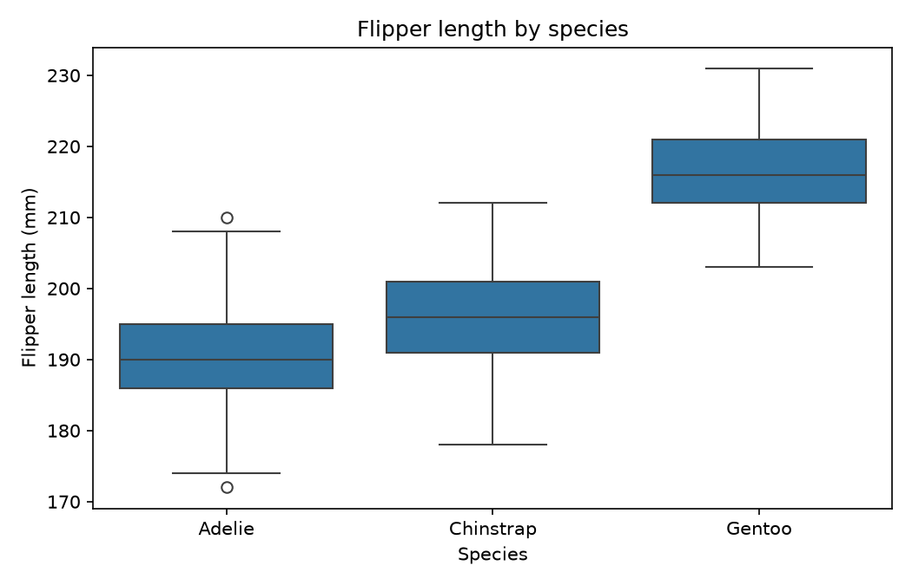

# Hypothesis Testing & Exploratory Data Analysis

*Data Science · Worked Examples · SPEC-DS-1*

You already do hypothesis testing. Every time a CI run goes red once in twenty runs, you ask
"is this test actually flaky, or did I just get unlucky this one time?" You don't have a formal
name for that instinct, but it's the same instinct statisticians use to compare two groups of
numbers. This chapter puts a name and a number on it: **the null hypothesis**, **the p-value**,
and **effect size** — the three ideas you need before you can look at two distributions and say
something more precise than "these seem different."

## 1. What & why

In Java, "this build is flaky" is a hypothesis you test by running the suite many times and
counting failures. Data science formalizes that same move:

- **Null hypothesis (H0)** — the boring, default explanation: "there is no real difference; what
  I'm seeing is just sampling noise." Think of it as the *presumption of innocence* in a
  courtroom, or the default `assertTrue` that a flaky test is "probably just flaky, not
  actually broken."
- **Alternative hypothesis (H1)** — the claim you're actually interested in: "there *is* a real
  difference."
- **p-value** — given that H0 is true, the probability of seeing a difference at least this
  extreme by chance alone. A small p-value is evidence *against* H0 — it does **not** tell you
  the probability that H0 is true, and it does **not** tell you how *big* the difference is.
  That second gap is why this chapter also covers **effect size**.

A courtroom never *proves* innocence — it only says the evidence wasn't strong enough to convict.
Hypothesis testing works the same way: you never "prove" H0 true, you just fail to reject it. And
just like a flaky-test investigation, the answer depends entirely on how much evidence (how much
data) you collected — which is exactly the trap in the Pitfalls section below.

## 2. The dataset: Palmer Penguins

This chapter uses the **Palmer Penguins** dataset — 344 penguins across three species (Adelie,
Chinstrap, Gentoo) measured on three islands in the Palmer Archipelago, Antarctica, by Dr. Kristen
Gorman for the Palmer Station Long Term Ecological Research Program (2007–2009). It's the modern,
actively-maintained successor to the 1936 Iris dataset for teaching EDA: it has real missing
values (Iris doesn't), a clean two-group and three-group comparison, and both numeric and
categorical columns.

- **License:** CC0 ("No Rights Reserved"), per the Palmer Station Data Policy.
- **Source / documentation:** https://allisonhorst.github.io/palmerpenguins/articles/intro.html
  (checked 2026-09-02)
- **Load method:** bundled with seaborn — `seaborn.load_dataset("penguins")` downloads from
  https://github.com/mwaskom/seaborn-data on first call and caches it locally (~36 KB); every
  later call is offline.

[source: NOTE-1-eda-dataset](../../research/NOTE-1-eda-dataset.md) (checked 2026-09-02)

### Environment

```text
pandas==3.0.5
numpy==2.5.2
matplotlib==3.11.1
scipy==1.18.1
seaborn==0.13.2
Python 3.11+
```

Pinned and verified against PyPI on 2026-09-02
([source: NOTE-2-package-versions](../../research/NOTE-2-package-versions.md)). This chapter's
code and artefacts were generated and gated on **Python 3.13.7**, and every package above
installed at exactly the pinned version with no substitutions — see the *Environment note* at the
end of this chapter for the one wrinkle NOTE-2 flagged (Python-version compatibility) that turned
out not to matter here.

## 3. EDA pass

Before testing anything, look at the data the way you'd read a stack trace before touching code —
shape first, then types, then what's missing, then the summary stats.

```python
import seaborn as sns

penguins = sns.load_dataset("penguins")

print(penguins.shape)
print(penguins.dtypes)
print(penguins.isna().sum())
print(penguins.describe())
```

Running this prints:

```text
=== shape ===
(344, 7)

=== dtypes ===
species                  str
island                   str
bill_length_mm       float64
bill_depth_mm        float64
flipper_length_mm    float64
body_mass_g          float64
sex                      str
dtype: object

=== missingness (NaN count per column) ===
species               0
island                0
bill_length_mm        2
bill_depth_mm         2
flipper_length_mm     2
body_mass_g           2
sex                  11
dtype: int64

=== describe() (numeric columns) ===
       bill_length_mm  bill_depth_mm  flipper_length_mm  body_mass_g
count      342.000000     342.000000         342.000000   342.000000
mean        43.921930      17.151170         200.915205  4201.754386
std          5.459584       1.974793          14.061714   801.954536
min         32.100000      13.100000         172.000000  2700.000000
25%         39.225000      15.600000         190.000000  3550.000000
50%         44.450000      17.300000         197.000000  4050.000000
75%         48.500000      18.700000         213.000000  4750.000000
max         59.600000      21.500000         231.000000  6300.000000
```

A few things worth noticing, the way you'd notice something off in a log dump:

- **`dtypes` shows `str`, not `object`.** In older pandas you'd see `object` for text columns —
  pandas 3.0 (pinned here per NOTE-2) infers a native string dtype by default. If you've read
  older pandas tutorials, expect `object` there instead; the behaviour is otherwise the same.
- **Missingness is small but nonzero (2–11 rows per column)** — that's `DataFrame.isna().sum()`,
  pandas' equivalent of grepping a log for `null`. This chapter treats missing rows by dropping
  them per-test (`dropna(subset=[...])`, only on the columns each test actually uses); a full
  chapter on smarter imputation strategies follows in DS-2.
- **The four numeric columns describe() covers are exactly `bill_length_mm`, `bill_depth_mm`,
  `flipper_length_mm`, `body_mass_g`.** `species`, `island`, and `sex` are categorical and don't
  show up in `describe()`'s default numeric summary — same reason `Stream<String>.summaryStatistics()`
  doesn't apply to a `Stream<Foo>`.

Two plots make the shape of the numeric data visible. First, the raw distribution of
`flipper_length_mm` across all 344 penguins:

```python
import matplotlib

matplotlib.use("Agg")  # headless: save figures, never call plt.show()
import matplotlib.pyplot as plt

fig, ax = plt.subplots(figsize=(7, 4.5))
ax.hist(penguins["flipper_length_mm"].dropna(), bins=20, color="#4C72B0", edgecolor="white")
ax.set_xlabel("Flipper length (mm)")
ax.set_ylabel("Count")
ax.set_title("Distribution of flipper length -- all species")
fig.tight_layout()
fig.savefig("flipper_length_histogram.png", dpi=150)
```


That histogram is clearly **bimodal** — two humps, not one bell curve. That's your first hint that
"all penguins" is hiding a mixture of different groups. A boxplot split by species confirms it:

```python
import seaborn as sns

fig, ax = plt.subplots(figsize=(7, 4.5))
order = ["Adelie", "Chinstrap", "Gentoo"]
sns.boxplot(data=penguins, x="species", y="flipper_length_mm", order=order, ax=ax)
ax.set_xlabel("Species")
ax.set_ylabel("Flipper length (mm)")
ax.set_title("Flipper length by species")
fig.tight_layout()
fig.savefig("flipper_length_boxplot_by_species.png", dpi=150)
```



Gentoo penguins are obviously bigger-flippered than the other two. Adelie and Chinstrap overlap a
lot more — which makes them the more interesting pair to actually *test*, rather than eyeball.

## 4. A concrete question → a test

### 4.1 "Does flipper length differ between Adelie and Chinstrap?" → t-test

This is a **two independent samples, one numeric variable** question — exactly what a two-sample
t-test answers. In `scipy.stats`, that's `ttest_ind`:

```python
from scipy.stats import ttest_ind

clean = penguins.dropna(subset=["flipper_length_mm", "species"])
adelie = clean.loc[clean["species"] == "Adelie", "flipper_length_mm"]
chinstrap = clean.loc[clean["species"] == "Chinstrap", "flipper_length_mm"]

result = ttest_ind(adelie, chinstrap, equal_var=False)  # Welch's t-test
print(result)
```

```text
TtestResult(statistic=-5.780384584564813, pvalue=6.049266635901903e-08, df=119.67695503084703)
```

`equal_var=False` matters: it switches from the *Student's* t-test (assumes both groups have the
same variance) to *Welch's* t-test (doesn't assume that). Verified against the scipy 1.18.1 docs:
`ttest_ind`'s default is `equal_var=True`, and you opt into Welch's explicitly
([source: NOTE-3-scipy-test-apis](../../research/NOTE-3-scipy-test-apis.md), checked 2026-09-02).
Since nothing here told us the two species have equal flipper-length variance, Welch's is the
safer default — the same instinct as not assuming two systems have identical error-rate
distributions just because they're both APIs.

`result` is a `TtestResult` namedtuple: `.statistic` is the t-statistic, `.pvalue` is what you
came for, `.df` is the degrees of freedom. Reading it: with 151 Adelie and 68 Chinstrap
penguins, mean flipper length is 189.95mm vs 195.82mm, and `p = 6.0e-08` — far below any
conventional threshold (0.05, 0.01). **If there were truly no difference between the species,
seeing a gap this large by chance alone would happen about 6 times in 100 million samples.**
That's strong evidence against H0.

### 4.2 "Is species associated with island?" → chi-square test

This is a **two categorical variables** question — the right tool is a chi-square test of
independence on a contingency table (a cross-tab, same shape as a pivot table in a spreadsheet):

```python
import pandas as pd
from scipy.stats import chi2_contingency

clean = penguins.dropna(subset=["species", "island"])
contingency = pd.crosstab(clean["species"], clean["island"])
print(contingency)

chi2, p, dof, expected = chi2_contingency(contingency)
print(f"chi2={chi2:.3f}, p={p:.3e}, dof={dof}")
```

```text
island     Biscoe  Dream  Torgersen
species
Adelie         44     56         52
Chinstrap       0     68          0
Gentoo        124      0          0

chi2=299.550, p=1.355e-63, dof=4
```

`chi2_contingency` returns a `Chi2ContingencyResult` with `.statistic`, `.pvalue`, `.dof`, and
`.expected_freq` — the counts you'd expect under H0 ("species and island are independent")
([source: NOTE-3-scipy-test-apis](../../research/NOTE-3-scipy-test-apis.md)). Looking at the raw
table explains the astronomically small p-value before you even need the math: **Chinstrap only
appears on Dream, Gentoo only on Biscoe.** Species and island are almost perfectly entangled in
this dataset — likely because each species mostly breeds on one island. That's not a subtle
statistical effect; it's visible by eye, and the test just quantifies how implausible that pattern
would be if species and island were truly unrelated.

## 5. p-value & effect size — the "so what"

Both tests above rejected their null hypothesis emphatically. But a p-value only answers
*"is there probably a real difference?"* — it says nothing about *how big* that difference is in
terms you'd actually care about. That's what **effect size** measures, and — like a lot of the
most-used stats in applied work — **neither Cohen's d nor Cramér's V ships in `scipy.stats`**;
you compute both by hand
([source: NOTE-4-effect-sizes](../../research/NOTE-4-effect-sizes.md), checked 2026-09-02).

**Cohen's d** (for two-group numeric comparisons) is the mean difference, standardized by the
pooled standard deviation — "how many standard deviations apart are these two group means?":

```python
import numpy as np


def cohens_d(x, y):
    """Cohen's d for two independent samples (pooled standard deviation)."""
    n1, n2 = len(x), len(y)
    var1, var2 = np.var(x, ddof=1), np.var(y, ddof=1)
    pooled_std = np.sqrt(((n1 - 1) * var1 + (n2 - 1) * var2) / (n1 + n2 - 2))
    return (np.mean(x) - np.mean(y)) / pooled_std


d = cohens_d(adelie, chinstrap)
print(f"Cohen's d = {d:.3f}")
```

```text
Cohen's d = -0.872
```

Conventional thresholds from Cohen (1988): **0.2 small, 0.5 medium, 0.8 large**
([source: NOTE-4-effect-sizes](../../research/NOTE-4-effect-sizes.md)). `|d| = 0.872` is a
**large** effect — this isn't just "detectable with enough data," the species really do have
substantially different flipper lengths.

**Cramér's V** (for two categorical variables) rescales the chi-square statistic into a 0–1
range so it's comparable across differently-sized tables:

```python
def cramers_v(chi2_stat, n, rows, cols):
    """Cramer's V for an r x c contingency table."""
    min_dim = min(rows - 1, cols - 1)
    return np.sqrt(chi2_stat / (n * min_dim)) if min_dim > 0 else np.nan


n = int(contingency.to_numpy().sum())
v = cramers_v(chi2, n, *contingency.shape)
print(f"Cramer's V = {v:.3f}")
```

```text
Cramer's V = 0.660
```

Thresholds: **<0.10 negligible, 0.10–0.30 weak, 0.30–0.50 moderate, >0.50 strong**
([source: NOTE-4-effect-sizes](../../research/NOTE-4-effect-sizes.md)). `V = 0.660` is a
**strong** association — consistent with what the contingency table already showed by eye.

Both results, plus the raw test statistics, are written to a small CSV artefact:

| test | statistic | p_value | effect_size_name | effect_size |
|---|---|---|---|---|
| Welch t-test: flipper_length_mm, Adelie vs Chinstrap | -5.780 | 6.05e-08 | Cohen's d | -0.872 |
| Chi-square: species vs island | 299.550 | 1.35e-63 | Cramer's V | 0.660 |

(full precision in [`artefacts/hypothesis_test_results.csv`](artefacts/hypothesis_test_results.csv))

The rule of thumb going forward: **report both numbers, always.** The p-value tells you whether to
trust that a difference is real; the effect size tells you whether that difference is *worth
caring about*. Section 6 shows exactly how far apart those two questions can drift.

## 6. Pitfalls

### 6.1 Huge N makes anything "significant"

This is the pitfall most Java engineers haven't internalized, because it doesn't have a direct
testing analogy: **with enough samples, a p-value can be tiny even when the real difference is
trivial.** p-values are sensitive to sample size in a way effect sizes are not.

Take `bill_depth_mm` between Adelie and Chinstrap — on the real sample sizes (151 vs 68), the test
finds *nothing* interesting:

```python
clean_bd = penguins.dropna(subset=["bill_depth_mm", "species"])
adelie_bill_depth = clean_bd.loc[clean_bd["species"] == "Adelie", "bill_depth_mm"].to_numpy()
chinstrap_bill_depth = clean_bd.loc[clean_bd["species"] == "Chinstrap", "bill_depth_mm"].to_numpy()

small_result = ttest_ind(adelie_bill_depth, chinstrap_bill_depth, equal_var=False)
print(f"t={small_result.statistic:.3f}, p={small_result.pvalue:.3f}, "
      f"d={cohens_d(adelie_bill_depth, chinstrap_bill_depth):.3f}")
```

```text
t=-0.438, p=0.662, d=-0.062
```

`p = 0.662` — not remotely significant, and `d = -0.062` says the effect is negligible even if it
were real. Now simulate what happens if we had 50,000 penguins of each species instead, by
resampling (with replacement) from the *same* real distributions:

```python
rng = np.random.default_rng(42)
adelie_big = rng.choice(adelie_bill_depth, size=50_000, replace=True)
chinstrap_big = rng.choice(chinstrap_bill_depth, size=50_000, replace=True)

big_result = ttest_ind(adelie_big, chinstrap_big, equal_var=False)
print(f"p={big_result.pvalue:.3e}, d={cohens_d(adelie_big, chinstrap_big):.3f}")
```

```text
p=4.424e-21, d=-0.060
```

The p-value collapsed from 0.662 to `4.4e-21` — you'd report that as "wildly significant." **But
Cohen's d barely moved (-0.062 → -0.060).** The underlying difference between the species never
changed; we just gathered enough evidence to detect a tiny, practically meaningless gap with
extreme confidence. This is exactly why Section 5's rule matters: a p-value alone, on a big
enough dataset, will eventually flag *any* nonzero difference as "significant." Report the effect
size, every time, or you will ship a model change chasing noise a stakeholder will call "real."

### 6.2 p-hacking

If you test enough hypotheses on the same dataset — different column pairs, different subgroups,
different thresholds — roughly 1 in 20 will look "significant" at `p < 0.05` by pure chance, even
if nothing is really going on. That's the same failure mode as re-running a flaky test until it
passes and calling the code correct. Decide your question *before* you look at the data, and if
you must run many comparisons, correct for it (Bonferroni is the simplest: divide your significance
threshold by the number of tests). A full treatment of multiple-testing correction is out of scope
here — this is the one-line warning to have in your head.

### 6.3 Assuming normality / equal variance without checking

The t-test's exact p-value depends on distributional assumptions. Section 4.1 used
`equal_var=False` (Welch's t-test) specifically to avoid *assuming* the two species have equal
variance — that assumption is often wrong in real data and Welch's correction is the safer
default, per the scipy 1.18.1 docs
([source: NOTE-3-scipy-test-apis](../../research/NOTE-3-scipy-test-apis.md)). For the chi-square
test, the standard caveat is that every cell's *expected* frequency should be at least 5 for the
test to be reliable — check `expected_freq` from `chi2_contingency`'s return value before trusting
a small or sparse table.

## 7. Recap & what's next

- A **null hypothesis** is the boring default ("no real difference") that a test tries to find
  evidence against — same shape as a courtroom's presumption of innocence.
- **`scipy.stats.ttest_ind`** compares means of two numeric groups; **`scipy.stats.chi2_contingency`**
  tests association between two categorical variables. Both return namedtuple-like results
  (`.statistic`, `.pvalue`, plus test-specific fields) — verified against scipy 1.18.1
  ([NOTE-3](../../research/NOTE-3-scipy-test-apis.md)).
- A small **p-value** is evidence the difference is real, not evidence it's *big*.
  **Effect size** (Cohen's d for means, Cramér's V for categorical association) tells you how big
  — and neither ships in scipy, so you compute them by hand
  ([NOTE-4](../../research/NOTE-4-effect-sizes.md)).
- On a big enough sample, almost any real-world difference becomes "significant." Always report
  effect size alongside the p-value.

This chapter dropped rows with missing values per-test — good enough for a clean teaching example,
but throwing away data is rarely the right production move. **DS-2 (imputation)** picks up exactly
here: smarter strategies for filling in `bill_depth_mm`, `sex`, and friends, and how each strategy
changes both your test results *and* your effect sizes. **DS-3 (collinearity)** then asks the
natural follow-up once you have several numeric columns: which of `bill_length_mm`, `bill_depth_mm`,
`flipper_length_mm`, and `body_mass_g` are actually telling you *different* things about a penguin,
and which are redundant.

---

### Environment note (for the architect)

NOTE-2 flagged that `numpy>=2.5.2` and `scipy>=1.18.1` require Python `>=3.12`, while `pandas` and
`matplotlib` support `3.11+`, and recommended pinning `numpy==1.26.x` / `scipy==1.17.x` if
targeting Python 3.11 specifically. This chapter's gate ran on **Python 3.13.7**, where all five
pinned versions from NOTE-2 (`pandas==3.0.5`, `numpy==2.5.2`, `matplotlib==3.11.1`,
`scipy==1.18.1`, `seaborn==0.13.2`) installed and ran with no substitution — so there is no
discrepancy to report for this environment. If a future chapter's gate runs on Python 3.11, revisit
NOTE-2's fallback recommendation for `numpy`/`scipy` before pinning `requirements.txt`.
