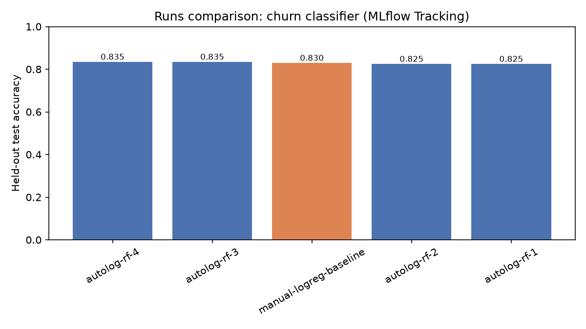

# Model Registry — Tracking Experiments with MLflow

*Data Science · Worked Examples · SPEC-DS-12*

You've got an artifact repository (Nexus, Artifactory) that answers "which commit produced
`service-1.4.2.jar`, and what were its dependency versions?" without you having to ask — every build
records its own provenance. You've also got a CI dashboard that lines up the last ten builds side by
side so you can see which one broke the integration test. Machine learning experimentation, left to
its own devices, has neither. A Jupyter notebook re-run six times with six slightly different
hyperparameters leaves you with one `model` variable in memory and no record of which of those six
runs it came from, what data it saw, or what score it got — the ML equivalent of overwriting the same
JAR on every build with no version number, no changelog, and no way to answer "which build is this?"
six months later when it's in production and something's wrong. This chapter is about the tool that
fixes that: **MLflow**, an experiment tracker (the CI dashboard) plus a **model registry** (the
artifact repository), both running entirely on your own machine.

## 1. What & why

Three things go missing the moment you stop tracking runs deliberately:

- **Which parameters produced this score.** You tweaked `max_depth`, re-ran the cell, the accuracy
  went up — but which value of `max_depth`? If you didn't write it down, that information existed for
  exactly as long as the notebook kernel was alive.
- **Which exact code and data produced this model.** A `.pkl` file on disk doesn't say what script
  trained it, what commit that script was at, or what version of scikit-learn was installed when it
  ran. Six months later, "reproduce this result" is a research project, not a lookup.
- **A comparable record across many attempts.** One run's metric in your head is not a comparison.
  You need all of them, side by side, sortable by score — the thing a CI dashboard gives you for free
  across builds.

**MLflow Tracking** solves the first two: every training run becomes a **run** — a database row plus
a folder of artifacts — holding whatever parameters, metrics, and files you tell it to record.
**MLflow Model Registry** solves a fourth problem that shows up once a model reaches production:
*which registered, versioned model is currently serving traffic, and how do I move a new one into
that slot without editing code?* That's the artifact-repository half of the analogy: a registry entry
is a named, versioned model — `churn_classifier` version `1`, version `2`, ... — the same shape as
`service-1.4.2.jar`, `service-1.4.3.jar` in Nexus, each version an immutable, retrievable build.

This chapter runs everything **locally**: a local SQLite database as the tracking store, a local
folder as the artifact store. No hosted MLflow server, no cloud registry — those are a forward link
to a Data Science cloud-environment chapter. Package version: **MLflow 3.15.2**, verified against
PyPI and installed in a sandbox on 2026-09-02
([NOTE-16-mlflow-api](../../research/NOTE-16-mlflow-api.md)).

## 2. Concept

Four nouns, and one critical version-specific fact:

- **Experiment** — a named folder for runs that belong together (e.g. "churn model iterations").
  Created once; every run after that is filed under it.
- **Run** — one execution of your training code. Has a unique `run_id`, a start/end time, and holds:
  - **Params** — the inputs you chose (`n_estimators=300`), logged with `mlflow.log_param`.
  - **Metrics** — the outputs you measured (`test_accuracy=0.835`), logged with `mlflow.log_metric`.
  - **Artifacts** — arbitrary files (a model, a plot, a report), logged with `mlflow.log_artifact` or
    a model-specific call like `mlflow.sklearn.log_model`.
- **Registered model** — a named entry in the Model Registry (e.g. `churn_classifier`). Each time you
  register a run's model artifact against that name, MLflow creates a new, immutable **version**
  (`1`, `2`, `3`, ...) — you never overwrite a version, you only add new ones, exactly like you never
  overwrite `service-1.4.2.jar`, you publish `1.4.3`.
- **Alias** — a named, **mutable** pointer from a registered-model name to one specific version, e.g.
  `champion` → version `2`. This is the piece that changed recently and is the one fact in this
  chapter most worth getting right:

> **Stages are deprecated; use aliases.** Older MLflow material (and a lot of blog posts still
> online) teaches moving a model version through fixed **stages** — `Staging` → `Production` →
> `Archived` — via `transition_model_version_stage()`. As of the version this chapter uses, that
> workflow is deprecated in favour of **aliases**: mutable, arbitrarily-named references you create
> yourself (`champion`, `candidate`, `shadow`, whatever your team calls it) via
> `MlflowClient.set_registered_model_alias()`. Per the MLflow docs (model-registry/workflow),
> "Model Stages are deprecated globally in favour of model aliases... Stage-transition APIs are
> entirely unavailable on Unity Catalog-backed registries and slated for removal elsewhere."
> ([NOTE-16-mlflow-api](../../research/NOTE-16-mlflow-api.md), checked 2026-09-02). This chapter
> teaches **only** aliases — Section 4.5 is where you'll use `set_registered_model_alias`.

The Java analogy that holds up well here: a registry **version** is like an immutable release tag
(`v1.4.3` — points at one commit, forever); an **alias** is like a movable tag or a `latest`/`stable`
branch pointer — you re-point it at a new version whenever you promote, and rolling back is just
re-pointing it at the old one. Nothing about the underlying versions changes either way.

## 3. Local environment setup

This chapter's code gets its **own** virtualenv, `.venv-mlflow`, separate from the shared Data
Science `.venv` the rest of this subject uses. Same reasoning as the Machine Learning subject's
`.venv-ml` for deep learning: a dependency that only one chapter needs shouldn't constrain every
other chapter's pins. Here it's concrete, not hypothetical — installing MLflow 3.15.2 pulls in
`pandas<3` as a hard constraint:

```text
$ .venv-mlflow/Scripts/python -m pip install "mlflow==3.15.2" "scikit-learn==1.9.0" pandas matplotlib
...
$ .venv-mlflow/Scripts/python -m pip show mlflow | grep Requires
Requires: aiohttp, alembic, cryptography, docker, Flask, Flask-CORS, graphene, huey, matplotlib,
mlflow-skinny, mlflow-tracing, numpy, pandas, pyarrow, scikit-learn, scipy, skops, sqlalchemy, waitress
```

`pyarrow` (an MLflow dependency) caps `pandas` below 3.0, so `pip` resolves `pandas==2.3.3` here —
one full major version behind the `pandas==3.0.5` other Data Science chapters pin. Installing that
into the *shared* `.venv` would silently downgrade pandas for every other chapter that imports it;
installing it into its own venv contains the conflict the same way an isolated Maven module or Gradle
subproject keeps one dependency's version constraint from rippling through a whole multi-module build.

Set up and confirm the environment:

```bash
python -m venv .venv-mlflow
# Windows (PowerShell)
.venv-mlflow\Scripts\Activate.ps1
# macOS / Linux
source .venv-mlflow/bin/activate

pip install "mlflow==3.15.2" "scikit-learn==1.9.0" pandas matplotlib
```

Installed and verified in this chapter's `.venv-mlflow` on 2026-09-02, Python 3.13.7:

```text
mlflow==3.15.2
mlflow-skinny==3.15.2
mlflow-tracing==3.15.2
scikit-learn==1.9.0
pandas==2.3.3
numpy==2.5.2
matplotlib==3.11.1
```

`mlflow==3.15.2` and `scikit-learn==1.9.0` per
[NOTE-16-mlflow-api](../../research/NOTE-16-mlflow-api.md) and
[NOTE-5-sklearn-core-apis](../../research/NOTE-5-sklearn-core-apis.md), both checked 2026-09-02;
`pandas`/`numpy`/`matplotlib` are whatever `pip` resolved against those two pins, confirmed by the
`pip list` output above rather than assumed.

## 4. Worked example

Full runnable script:
[`code/mlflow_tracking.py`](code/mlflow_tracking.py). Run it from inside the `code/` directory so the
local SQLite store and the artifact folder land in a predictable place:

```bash
cd "Data Science/Worked Examples/code"
../../../.venv-mlflow/Scripts/python.exe mlflow_tracking.py
```

### 4.1 The dataset and the tracking store

A synthetic subscription-churn dataset — 800 customers, five features, a `churn` label generated
through a logistic relationship plus noise, seeded for reproducibility (the same "known ground truth"
approach used throughout this course, e.g.
[collinearity.md](collinearity.md)). One fixed train/test split is shared by **every** run below, so
comparing runs compares models, not data:

```python
from __future__ import annotations

from pathlib import Path

import numpy as np
import pandas as pd
from sklearn.model_selection import train_test_split

RNG_SEED = 42


def make_churn_data(n: int = 800, seed: int = RNG_SEED) -> pd.DataFrame:
    rng = np.random.default_rng(seed)
    tenure_months = rng.uniform(0, 60, n)
    monthly_spend = rng.uniform(10, 200, n)
    support_tickets = rng.poisson(1.5, n).astype(float)
    discount_pct = rng.uniform(0, 30, n)
    age = rng.integers(18, 75, n).astype(float)

    linear_score = (
        -0.055 * tenure_months
        + 0.35 * support_tickets
        - 0.03 * discount_pct
        + 0.01 * monthly_spend
        - 0.01 * age
        - 1.0
        + rng.normal(0, 0.6, n)
    )
    churn_probability = 1 / (1 + np.exp(-linear_score))
    churn = rng.binomial(1, churn_probability)

    return pd.DataFrame(
        {
            "tenure_months": tenure_months,
            "monthly_spend": monthly_spend,
            "support_tickets": support_tickets,
            "discount_pct": discount_pct,
            "age": age,
            "churn": churn,
        }
    )


df = make_churn_data()
feature_cols = ["tenure_months", "monthly_spend", "support_tickets", "discount_pct", "age"]
X_train, X_test, y_train, y_test = train_test_split(
    df[feature_cols], df["churn"], test_size=0.25, random_state=RNG_SEED, stratify=df["churn"]
)
```

The tracking store is a **local SQLite database**, not the plain-file store older MLflow tutorials
show. Per NOTE-16: "the filesystem tracking backend is in maintenance mode" as of this version —
pointing `mlflow.set_tracking_uri` at a bare `file://` path now prints a maintenance-mode warning and
is not the recommended path. SQLite (or Postgres/MySQL for a real multi-user deployment) is:

```python
import mlflow
from mlflow import MlflowClient
from pathlib import Path

HERE = Path(__file__).resolve().parent
TRACKING_DB = HERE / "mlflow.db"
MLRUNS_DIR = HERE / "mlruns"
EXPERIMENT_NAME = "ds12-churn-model-registry-demo"

mlflow.set_tracking_uri(f"sqlite:///{TRACKING_DB.as_posix()}")

client = MlflowClient()
experiment = client.get_experiment_by_name(EXPERIMENT_NAME)
if experiment is None:
    # Pin the artifact location explicitly: MLflow's default artifact root is
    # relative to the process's CURRENT WORKING DIRECTORY, not the tracking DB's
    # location -- confirmed by running this both from the repo root and from this
    # directory and watching mlruns/ land in two different places. Pinning it here
    # makes the run reproducible regardless of where you invoke the script from.
    experiment_id = client.create_experiment(
        EXPERIMENT_NAME, artifact_location=MLRUNS_DIR.as_uri()
    )
else:
    experiment_id = experiment.experiment_id
mlflow.set_experiment(experiment_id=experiment_id)
```

First run creates the database:

```text
2026/09/02 22:33:53 INFO mlflow.store.db.utils: Creating initial MLflow database tables...
2026/09/02 22:33:53 INFO mlflow.store.db.utils: Updating database tables
```

### 4.2 Explicit tracking — the primitives

Before reaching for any convenience wrapper, log one run entirely by hand, so every later
abstraction has a concrete thing it's abstracting *over*:

```python
from sklearn.linear_model import LogisticRegression
from sklearn.metrics import accuracy_score, f1_score


def eval_holdout(model, X_test, y_test):
    preds = model.predict(X_test)
    return float(accuracy_score(y_test, preds)), float(f1_score(y_test, preds))


params = {"model": "LogisticRegression", "solver": "lbfgs", "C": 1.0, "max_iter": 500}
with mlflow.start_run(run_name="manual-logreg-baseline") as run:
    for key, value in params.items():
        mlflow.log_param(key, value)

    model = LogisticRegression(solver=params["solver"], C=params["C"], max_iter=params["max_iter"])
    model.fit(X_train, y_train)

    test_accuracy, test_f1 = eval_holdout(model, X_test, y_test)
    mlflow.log_metric("test_accuracy", test_accuracy)
    mlflow.log_metric("test_f1", test_f1)

    report_path = HERE / "_scratch_feature_notes.txt"
    report_path.write_text(f"Train rows: {len(X_train)}  Test rows: {len(X_test)}\n", encoding="utf-8")
    mlflow.log_artifact(str(report_path), artifact_path="notes")  # any file becomes a run artifact
    report_path.unlink()

    mlflow.sklearn.log_model(model, name="model")
    print(f"[manual run] run_id={run.info.run_id} test_accuracy={test_accuracy:.4f} test_f1={test_f1:.4f}")
```

`mlflow.start_run()` is a context manager: entering it opens a run (think: `git commit --amend`-proof
build record), everything logged inside is attached to that run's `run_id`, and exiting the block
closes it out with a `FINISHED` status. Real output from running this:

```text
[manual run] run_id=fd62b88bf7484eb488edac6a7ecbca24 test_accuracy=0.8300 test_f1=0.3462
```

### 4.3 `autolog` — the convenience wrapper, across several runs

Writing `log_param`/`log_metric` calls for every hyperparameter of every model gets old fast.
`mlflow.sklearn.autolog()` patches scikit-learn so that a plain `.fit()` call inside an active run
logs the estimator's full parameter set, a battery of standard metrics, the fitted model, and — for
classifiers — a confusion matrix, ROC curve, and precision-recall curve, automatically
([NOTE-16-mlflow-api](../../research/NOTE-16-mlflow-api.md): "Autolog for sklearn works: confirmed
available; tested no issues"). Four `RandomForestClassifier` configurations, each its own run:

```python
from sklearn.ensemble import RandomForestClassifier

mlflow.sklearn.autolog(log_models=True)
configs = [
    {"n_estimators": 50, "max_depth": 3},
    {"n_estimators": 50, "max_depth": None},
    {"n_estimators": 150, "max_depth": 5},
    {"n_estimators": 300, "max_depth": 8},
]
for i, cfg in enumerate(configs, start=1):
    with mlflow.start_run(run_name=f"autolog-rf-{i}") as run:
        model = RandomForestClassifier(random_state=RNG_SEED, **cfg)
        model.fit(X_train, y_train)
        # autolog's own metrics are computed on X_train/y_train (see Pitfalls, 5.1) --
        # log the number that actually matters, the held-out score, yourself.
        test_accuracy, test_f1 = eval_holdout(model, X_test, y_test)
        mlflow.log_metric("test_accuracy", test_accuracy)
        mlflow.log_metric("test_f1", test_f1)
        print(f"[autolog run {i}] run_id={run.info.run_id} cfg={cfg} "
              f"test_accuracy={test_accuracy:.4f} test_f1={test_f1:.4f}")
mlflow.sklearn.autolog(disable=True)
```

Real output, five runs in total now on record:

```text
[manual run]     run_id=fd62b88bf7484eb488edac6a7ecbca24 test_accuracy=0.8300 test_f1=0.3462
[autolog run 1]  run_id=e767795b2fff490f870a15cb2da38c67 cfg={'n_estimators': 50, 'max_depth': 3}   test_accuracy=0.8250 test_f1=0.2222
[autolog run 2]  run_id=93e445fcadd748689442f9613c20b88d cfg={'n_estimators': 50, 'max_depth': None} test_accuracy=0.8250 test_f1=0.3636
[autolog run 3]  run_id=1f3f0587664f453dae87f87dbec29974 cfg={'n_estimators': 150, 'max_depth': 5}   test_accuracy=0.8350 test_f1=0.3265
[autolog run 4]  run_id=a323ce7498784cd29ffa2c00ce71bb04 cfg={'n_estimators': 300, 'max_depth': 8}   test_accuracy=0.8350 test_f1=0.3529
```

Each autolog run's artifact folder also picked up, without an explicit `log_artifact` call:
`estimator.html` (a rendered summary of the fitted estimator), `training_confusion_matrix.png`,
`training_precision_recall_curve.png`, `training_roc_curve.png` — confirmed by listing a run's
artifacts directly (`MlflowClient().list_artifacts(run_id)`) after running this chapter's code.

### 4.4 Comparing runs — in the UI, and as an exported artefact

`mlflow ui --backend-store-uri sqlite:///mlflow.db` starts a local web server (confirmed running
against this chapter's store on 2026-09-02: `Uvicorn running on http://127.0.0.1:5551`, HTTP 200 on
the home page, and the REST API correctly listing the `ds12-churn-model-registry-demo` experiment).
What you'd see, navigating it:

```text
Home
 └─ sidebar: Experiments / Prompts / MCP registry / AI Gateway  ("GenAI" vs "Model training" toggle)

Experiments → ds12-churn-model-registry-demo → Runs
 - a table: one row per run, columns for run name, start time, every logged param and metric
   (37 columns total once autolog's full parameter set is included)
 - "6 matching runs" once the tuned run from Section 4.5 is added
 - checkboxes per row + a "Compare" action -> parallel-coordinates / scatter plots across the
   selected runs' params and metrics

Model registry → churn_classifier
 - a table: Name | Latest version | Aliased versions | Created by | Last modified
 - "Aliased versions" column literally reads "@champion : Version 2" once Section 4.5 runs --
   there is no "Stage" column in this version's UI, matching NOTE-16's stages-deprecated finding
```

Rather than a screenshot of that (which would go stale the moment the UI is redesigned), this
chapter exports the same comparison as a real, regenerable artefact — `mlflow.search_runs()` pulls
every run in the experiment back out as a DataFrame, the same data the UI's Runs table renders from:

```python
def build_comparison_table(experiment_id: str) -> pd.DataFrame:
    runs = mlflow.search_runs(experiment_ids=[experiment_id], order_by=["start_time ASC"])
    cols = {
        "run_id": runs["run_id"],
        "run_name": runs["tags.mlflow.runName"],
        "test_accuracy": runs["metrics.test_accuracy"],
        "test_f1": runs["metrics.test_f1"],
        "n_estimators": runs.get("params.n_estimators"),
        "max_depth": runs.get("params.max_depth"),
        "solver": runs.get("params.solver"),
    }
    table = pd.DataFrame(cols).sort_values("test_accuracy", ascending=False).reset_index(drop=True)
    return table


table = build_comparison_table(experiment_id)
table.to_csv("mlflow_runs_comparison.csv", index=False)
```

The exported table (full file:
[`artefacts/mlflow_runs_comparison.csv`](artefacts/mlflow_runs_comparison.csv)):

```text
run_id                            run_name                 test_accuracy  test_f1   n_estimators  max_depth  solver
a323ce7498784cd29ffa2c00ce71bb04  autolog-rf-4              0.835         0.352941  300           8          NaN
1f3f0587664f453dae87f87dbec29974  autolog-rf-3              0.835         0.326531  150           5          NaN
fd62b88bf7484eb488edac6a7ecbca24  manual-logreg-baseline    0.830         0.346154  NaN           NaN        lbfgs
93e445fcadd748689442f9613c20b88d  autolog-rf-2              0.825         0.363636  50            None       NaN
e767795b2fff490f870a15cb2da38c67  autolog-rf-1              0.825         0.222222  50            3          NaN
```

And the same numbers, plotted (real output, [`artefacts/mlflow_runs_comparison.png`](artefacts/mlflow_runs_comparison.png)):



`autolog-rf-4` (300 trees, `max_depth=8`) edges out the rest at 0.835 test accuracy — the pick for
Section 4.5. Note the F1 column swings much more than accuracy across runs (0.22 to 0.36): this
dataset's churn rate is 18.2%, so "always predict no-churn" already scores ~82% accuracy, and F1
(which cares about catching the rare positive class) is the metric doing the real discriminating
work here — this is the class-imbalance lesson from
[class-imbalance.md](class-imbalance.md) resurfacing inside a tracking table, exactly why you log
more than one metric per run.

### 4.5 Registering a model and promoting it with an alias

Pick the best run (`autolog-rf-4`, 0.835), register its logged model artifact under a name, and point
a `champion` alias at the resulting version:

```python
REGISTRY_MODEL_NAME = "churn_classifier"


def register_and_alias(run_id: str, alias: str) -> int:
    model_uri = f"runs:/{run_id}/model"
    model_version = mlflow.register_model(model_uri=model_uri, name=REGISTRY_MODEL_NAME)

    client = MlflowClient()
    client.set_registered_model_alias(
        name=REGISTRY_MODEL_NAME, alias=alias, version=model_version.version
    )
    print(f"[registry] {REGISTRY_MODEL_NAME} version {model_version.version} <- run {run_id}; "
          f"alias '{alias}' now points at version {model_version.version}")
    return int(model_version.version)


v1 = register_and_alias(best_run_id, alias="champion")
```

Real output — note MLflow auto-creates the registered model entry on first use, no separate
"create model" step required:

```text
Successfully registered model 'churn_classifier'.
Created version '1' of model 'churn_classifier'.
[registry] churn_classifier version 1 <- run a323ce7498784cd29ffa2c00ce71bb04; alias 'champion' now points at version 1
```

Now simulate the next iteration: a further-tuned model that beats the first batch, registered as a
**second, immutable version** of the same name, with `champion` **re-pointed** at it — the promotion
step, and the exact mechanism a rollback would use in reverse:

```python
with mlflow.start_run(run_name="autolog-rf-tuned") as run:
    mlflow.sklearn.autolog(log_models=True)
    tuned_model = RandomForestClassifier(
        n_estimators=400, max_depth=6, min_samples_leaf=2, random_state=RNG_SEED
    )
    tuned_model.fit(X_train, y_train)
    tuned_accuracy, tuned_f1 = eval_holdout(tuned_model, X_test, y_test)
    mlflow.log_metric("test_accuracy", tuned_accuracy)
    mlflow.log_metric("test_f1", tuned_f1)
    mlflow.sklearn.autolog(disable=True)
    tuned_run_id = run.info.run_id

v2 = register_and_alias(tuned_run_id, alias="champion")
```

```text
[tuned run] run_id=96aacd69ba8f43039ee529749e60d617 test_accuracy=0.8400 test_f1=0.3333
Registered model 'churn_classifier' already exists. Creating a new version of this model...
Created version '2' of model 'churn_classifier'.
[registry] churn_classifier version 2 <- run 96aacd69ba8f43039ee529749e60d617; alias 'champion' now points at version 2

'champion' alias moved: version 1 -> version 2
```

Version `1` is untouched and still retrievable — nothing was overwritten, only the `champion` pointer
moved. Rolling back is one more call: `set_registered_model_alias(name="churn_classifier",
alias="champion", version=1)`.

**A version-3.x nuance worth knowing, seen directly in this run's logs:** `mlflow.sklearn.log_model`
in this version creates a "Logged Model" entity (URI shape `models:/m-<hash>`), not the older
"artifact glued to a run" shape. Registering through the classic `runs:/<run_id>/model` URI still
works, but MLflow prints a compatibility note and resolves it internally:

```text
WARNING mlflow.tracking._model_registry.fluent: Run with id a323ce7498784cd29ffa2c00ce71bb04 has no
artifacts at artifact path 'model', registering model based on models:/m-a41568dd5a264cac94b479af808de56b instead
```

Nothing to fix here — it's backward-compatibility machinery working as intended — but if you see that
warning, that's why: it's normal in 3.15.2, not a broken run.

### 4.6 Reloading the registered model for inference

The point of a registry: a serving process doesn't need to know which run produced the current
model, which hyperparameters it used, or where its pickle file lives on disk — it asks for
`models:/<name>@<alias>` and gets back a ready-to-predict object:

```python
champion_model = mlflow.sklearn.load_model(f"models:/{REGISTRY_MODEL_NAME}@champion")
reload_preds = champion_model.predict(X_test)
reload_accuracy = float(accuracy_score(y_test, reload_preds))
print(f"[reload for inference] models:/{REGISTRY_MODEL_NAME}@champion test_accuracy={reload_accuracy:.4f}")
```

```text
[reload for inference] models:/churn_classifier@champion test_accuracy=0.8400 (should match tuned run: 0.8400)
```

0.8400 reloaded, 0.8400 at training time — the model you get back from the registry is *bit-for-bit*
the one that was scored, not a re-trained approximation of it. That equality is the whole
reproducibility payoff of this chapter: nobody had to remember which script, which hyperparameters,
or which library versions produced the number in the spreadsheet.

### 4.7 The registry structure, captured

A text snapshot of the registered model, its versions, its alias, and the on-disk artifact tree —
the "captured listing" this chapter uses in place of a registry-page screenshot
(full file: [`artefacts/mlflow_registry_listing.txt`](artefacts/mlflow_registry_listing.txt)):

```text
Experiment: ds12-churn-model-registry-demo (id=1)
Tracking URI: sqlite:///.../Data Science/Worked Examples/code/mlflow.db

Registered model: churn_classifier
  alias '@champion' -> version 2
  versions:
    version=2  source_run_id=96aacd69ba8f43039ee529749e60d617  status=READY (aliases: @champion)
    version=1  source_run_id=a323ce7498784cd29ffa2c00ce71bb04  status=READY

On-disk artifact tree (mlruns/), directories only:
    e767795b2fff490f870a15cb2da38c67/
      artifacts/
    96aacd69ba8f43039ee529749e60d617/
      artifacts/
    ...
    models/
      m-07f7154881e94444b4e200b5e10d9c49/
        artifacts/
      ...
```

Six run folders (one per `run_id`), each holding its own `artifacts/`; a `models/` folder holding the
"Logged Model" entities from Section 4.5's nuance, each with its own `artifacts/`. The SQLite file
(`mlflow.db`) holds every param, metric, and tag as queryable rows; the `mlruns/` folder holds the
larger binary artifacts (models, plots) referenced by path from those rows — the same split a Java
build tool makes between metadata (a POM, a build log) and binary output (a JAR in a repository).

## 5. Pitfalls

### 5.1 Autolog's metrics are training-set metrics, not the number you care about

Every run above logged its own `test_accuracy`/`test_f1` on top of what `autolog` captured — on
purpose. Autolog's `training_accuracy_score`, `training_f1_score`, and friends are computed by
calling the fitted estimator's scoring methods on **the data passed to `.fit()`** — the training
split, not a held-out one. Pulled directly from this chapter's own tracking database, run
`autolog-rf-4`:

```text
metrics.training_accuracy_score = 0.945     metrics.test_accuracy = 0.835
metrics.training_f1_score       = 0.941     metrics.test_f1       = 0.353
```

Nearly a 20-point accuracy gap and a *2.6x* F1 gap between the training-set number autolog hands you
for free and the held-out number that actually predicts production behaviour — exactly the
train/test discipline from [train-valid-holdout-split.md](train-valid-holdout-split.md) and
[splitting_and_leakage.py](code/splitting_and_leakage.py). If you sort runs by
`metrics.training_accuracy_score` in the MLflow UI instead of a held-out metric you logged yourself,
you'll pick the run that memorized its training data best, not the one that generalizes best.

### 5.2 Untracked randomness makes "the same run" a different run

Every random draw in this chapter's script — the synthetic data, the train/test split, every
estimator's `random_state` — is seeded from one constant, `RNG_SEED = 42`. Drop the seed (or use a
different one per run without logging it) and re-running "the same" experiment produces a
different-but-plausible score every time, with no way to tell later whether a metric moved because
you changed a hyperparameter or because you got a luckier random split. If a hyperparameter isn't
worth `log_param`-ing, ask whether it's actually fixed — if it's a random seed, it's a parameter too,
and MLflow will happily record it (`mlflow.log_param("seed", RNG_SEED)`) right alongside the ones you
chose on purpose.

### 5.3 Environment drift — the registry snapshots more than the pickle

`mlflow.sklearn.log_model` writes a `requirements.txt` next to every model artifact, capturing the
**exact** library versions present at training time — not the project's `requirements.txt`, this
model's own, generated automatically (real file, from the tuned run:
[`artefacts/mlflow_logged_model_requirements.txt`](artefacts/mlflow_logged_model_requirements.txt)):

```text
mlflow==3.15.2
cloudpickle==3.1.2
numpy==2.5.2
pandas==2.3.3
scikit-learn==1.9.0
scipy==1.18.1
```

Load this model into an environment with a different scikit-learn version and there's no guarantee
its predictions match what was scored at training time — a pickled `RandomForestClassifier` is tied
to the internals of the library version that created it, the same way a serialized Java object can
fail to deserialize against a class whose `serialVersionUID` moved on. This file is MLflow's
equivalent of a build's dependency lockfile: read it before you "just pip install and load the model"
on a different machine.

### 5.4 Logging huge artifacts bloats the tracking store

Every `log_artifact` / `log_model` call writes a real file under `mlruns/`, and every `log_param` /
`log_metric` call writes a real row into `mlflow.db`. Six small runs in this chapter already produced
a multi-megabyte SQLite file. Log a full training dataset, a large image dump, or a checkpoint per
epoch on every run and the tracking store grows without bound — treat it like any other generated
build artifact: gitignored (`mlruns/`, `*.db` are already excluded in this project's `.gitignore`),
pruned periodically, and never the place to park something you'd otherwise store in a proper data
lake or object store.

## 6. Recap & what's next

- **The problem MLflow solves**: ad-hoc notebook re-runs lose the mapping from "this score" back to
  "these parameters, this code, this data" — an experiment tracker is the CI-dashboard analogue for
  training runs; a model registry is the artifact-repository analogue for trained models.
- **Tracking**: `mlflow.start_run()` opens a run; `log_param`/`log_metric`/`log_artifact` attach
  facts to it; `mlflow.sklearn.autolog()` does the same automatically for scikit-learn estimators,
  plus classifier diagnostic plots — but its metrics are training-set metrics, log your own
  held-out number too.
- **Comparing runs**: `mlflow.search_runs()` returns every run as a DataFrame — the same data the
  MLflow UI's Runs table renders — exportable as a real table/plot instead of a screenshot.
- **Registry**: `mlflow.register_model()` creates immutable, numbered versions of a named model;
  **aliases** (`MlflowClient.set_registered_model_alias`), not the deprecated Staging/Production
  **stages**, are the current way to mark and move which version is "the one in production"
  ([NOTE-16-mlflow-api](../../research/NOTE-16-mlflow-api.md)).
  Reloading `models:/<name>@<alias>` reproduces the exact scored model, byte for byte.
- **Pitfalls**: training-set-only autolog metrics, untracked randomness, environment drift (the
  auto-captured `requirements.txt`), and unbounded tracking-store growth from oversized artifacts.

This chapter tracked and registered a model entirely on one machine. The forward links: a Data
Science cloud-environment chapter covers a **hosted** MLflow tracking server and cloud-backed model
registries (multi-user, remote artifact stores); the **AI-assisted SDLC** subject covers wiring a
registry lookup like `models:/churn_classifier@champion` into an actual CI/CD deploy pipeline, so
promoting a model is a pipeline step, not a manual `set_registered_model_alias` call.
