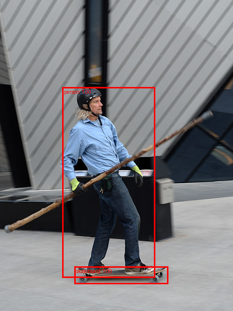
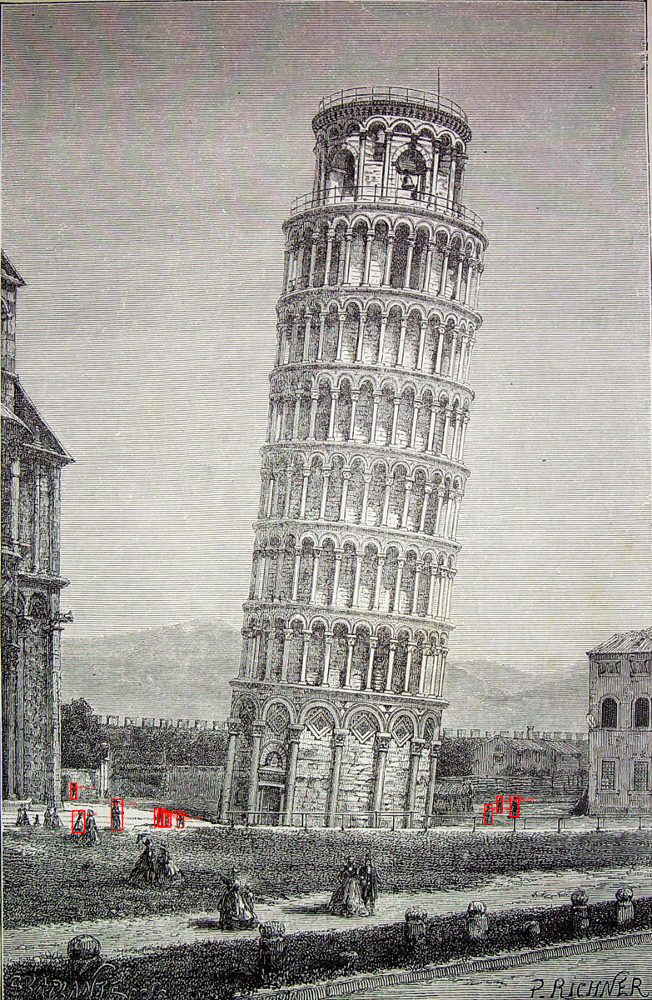

# Object detection — pretrained detectors on COCO classes

*Machine Learning · Worked Examples · Computer Vision · SPEC-ML-5*

The MNIST chapter answered one question: "what digit is in this image?" — one label for an image
that contained exactly one thing, centered, filling the frame. Almost nothing you'll ever point a
camera at looks like that. A real photo has a person, a skateboard, and a stick in it at once, each
in its own place. **Object detection** is the task of answering "what is in this image, *and
where*" — a list of boxes, each with a class label and a confidence score, instead of one label for
the whole picture. This chapter loads a detector pretrained on COCO (Common Objects in Context, the
80-class benchmark dataset the field standardized on) and runs it, unmodified, on two real photos —
every box drawn in this chapter's artefacts came from the model actually looking at the pixels, not
from a canned example.

## 1. What & why

**Classification vs. detection, in interface terms.** A classifier is a function with a fixed
output shape: `classify(image) -> Label`, one answer, always. A detector's output shape depends on
what's actually *in* the image: `detect(image) -> List<Detection>`, where each `Detection` carries
its own class label, a confidence score, and a bounding box — zero detections for an empty scene,
a dozen for a crowd. If you've ever written a matcher that returns `List<Match>` instead of a
single `boolean`, the shape of the problem — "find zero or more instances and say where each one
is" — is the same one, applied to pixels instead of records.

**Where a backend engineer meets this.** Content moderation pipelines that need to flag *and
locate* a specific object in an uploaded image; retail shelf-monitoring systems counting how many
units of a product are actually on the shelf; a document-processing pipeline that needs the pixel
region of a signature or a stamp, not just "yes, there is one"; self-driving perception stacks. In
every case, "there is a car in this picture" is not enough — the downstream system needs the box.

**The three things every detector outputs.** For each object it finds, a torchvision detector
returns three parallel tensors:

- **`boxes`** — one `(x1, y1, x2, y2)` per detection, in pixel coordinates of the *original* input
  image (the "xyxy" format: top-left corner, then bottom-right corner).
- **`labels`** — one integer class index per detection, indexing into a fixed category list (Section
  3 shows exactly how, including a subtlety that catches most people the first time).
- **`scores`** — one confidence value per detection, in `[0, 1]` — the model's own estimate of how
  sure it is that this box actually contains that class.

Section 2 places this chapter's model, Faster R-CNN, within the two families of detector
architectures; Section 3 loads it and shows these three tensors on a real image.

### Environment

```text
torch==2.14.0+cpu
torchvision==0.29.0+cpu
numpy==2.5.2
Python 3.11+
```

Pinned and verified against PyPI on 2026-09-02
([source: NOTE-ML-1-torch-install](../../../research/NOTE-ML-1-torch-install.md), the same
environment `image-classification-mnist.md` (SPEC-ML-4) uses). The detection API itself — the
`weights=` enum pattern, `weights.meta["categories"]`, and the model's output format — is grounded in
([source: NOTE-ML-5-torchvision-detection-seg](../../../research/NOTE-ML-5-torchvision-detection-seg.md)).
Pillow (installed transitively by torchvision, version 12.3.0 in this environment) does the actual
PNG encoding when this chapter's script saves annotated images; it isn't independently version-pinned
since torchvision's own dependency resolution manages it. This chapter's code and artefacts were
generated and gated on Python 3.13.7, CPU only (`torch.cuda.is_available()` returns `False` — no GPU
required or used anywhere in this chapter, same as SPEC-ML-4).

## 2. Model families — two-stage vs. one-stage

Every detector has to solve two problems at once: *where* might an object be, and *what* is it.
The two dominant architecture families answer "where" differently:

- **Two-stage detectors** (Faster R-CNN — "Faster R-CNN: Towards Real-Time Object Detection with
  Region Proposal Networks", [arXiv:1506.01497](https://arxiv.org/abs/1506.01497), checked
  2026-09-02) run in two passes: a first network proposes a few hundred candidate regions likely to
  contain *something*, then a second stage classifies and refines the box for each candidate. More
  compute, but each final prediction had a dedicated, focused look.
- **One-stage detectors** (SSD — [arXiv:1512.02325](https://arxiv.org/abs/1512.02325), checked
  2026-09-02; RetinaNet — [arXiv:1708.02002](https://arxiv.org/abs/1708.02002), checked 2026-09-02)
  skip the proposal step: a single pass over the image predicts boxes and classes densely, at every
  position and scale, in one shot. Cheaper per image, historically less accurate — RetinaNet's whole
  contribution was closing that accuracy gap with a loss function (*focal loss*) that stops the huge
  number of easy "no object here" predictions from drowning out the few hard ones.

Rather than take that trade-off on faith, here it is as real numbers — every value below came
straight out of the installed torchvision 0.29.0 package's own weight metadata, not a claim from
memory or a blog post:

```python
from torchvision.models.detection import (
    FasterRCNN_ResNet50_FPN_Weights,
    FasterRCNN_ResNet50_FPN_V2_Weights,
    RetinaNet_ResNet50_FPN_Weights,
    SSD300_VGG16_Weights,
)

for weights_cls in [
    FasterRCNN_ResNet50_FPN_Weights,
    FasterRCNN_ResNet50_FPN_V2_Weights,
    RetinaNet_ResNet50_FPN_Weights,
    SSD300_VGG16_Weights,
]:
    w = weights_cls.DEFAULT
    meta = w.meta
    box_map = meta["_metrics"]["COCO-val2017"]["box_map"]
    print(f"{weights_cls.__name__:32s} box_map={box_map:5.1f}  "
          f"params={meta['num_params']:>10,}  GFLOPS={meta['_ops']:6.1f}")
```

```text
FasterRCNN_ResNet50_FPN_Weights box_map= 37.0  params=41,755,286  GFLOPS= 134.4
FasterRCNN_ResNet50_FPN_V2_Weights box_map= 46.7  params=43,712,278  GFLOPS= 280.4
RetinaNet_ResNet50_FPN_Weights  box_map= 36.4  params=34,014,999  GFLOPS= 151.5
SSD300_VGG16_Weights            box_map= 25.1  params=35,641,826  GFLOPS=  34.9
```

| Model | Family | box_map (COCO val2017) | GFLOPS |
|---|---|---|---|
| Faster R-CNN (ResNet50-FPN) | two-stage | 37.0 | 134.4 |
| Faster R-CNN v2 (ResNet50-FPN) | two-stage | 46.7 | 280.4 |
| RetinaNet (ResNet50-FPN) | one-stage | 36.4 | 151.5 |
| SSD300 (VGG16) | one-stage | 25.1 | 34.9 |

`box_map` is mean Average Precision on COCO's 2017 validation set, averaged over 10 IoU thresholds
and all 80 classes — Section 6 defines it properly; for now, higher is more accurate.
SSD300 is the clear speed choice (34.9 GFLOPS, roughly a quarter of Faster R-CNN's cost) and the
clear accuracy trade-off (25.1 vs. 37.0 box_map) — the one-stage-is-faster-but-was-less-accurate
story, in real numbers from one library. RetinaNet is the interesting middle point: still one-stage
(dense predictions, no proposal step), but focal loss pulls its accuracy (36.4) almost level with
plain Faster R-CNN — this is what "closing the gap" in the paper's own title actually produced,
measured. Faster R-CNN v2 shows the other lever: the *same* two-stage architecture, refined training
recipe, costs over twice the compute (280.4 GFLOPS) for a genuinely large accuracy jump (46.7).

This chapter uses **`fasterrcnn_resnet50_fpn`** — the plain, original two-stage weights — because
it's the API `NOTE-ML-5-torchvision-detection-seg.md` grounds in full detail and a stable, well
documented baseline; everything past this point (loading, output format, post-processing) carries
over unchanged to any of the other three.

## 3. Load the detector and inspect the COCO category names

```python
import torch
from torchvision.models.detection import (
    FasterRCNN_ResNet50_FPN_Weights,
    fasterrcnn_resnet50_fpn,
)

weights = FasterRCNN_ResNet50_FPN_Weights.DEFAULT
categories = weights.meta["categories"]

print(f"weights: {weights}")
print(f"box_map (COCO-val2017): {weights.meta['_metrics']['COCO-val2017']['box_map']}")
print(f"category list length: {len(categories)}")
print(f"first 5: {categories[:5]}")
print(f"'N/A' placeholder count: {sum(1 for c in categories if c == 'N/A')}")

model = fasterrcnn_resnet50_fpn(weights=weights, progress=True)
model.eval()  # inference mode — same habit as SPEC-ML-4's model.eval()
```

```text
weights: FasterRCNN_ResNet50_FPN_Weights.COCO_V1
box_map (COCO-val2017): 37.0
category list length: 91
first 5: ['__background__', 'person', 'bicycle', 'car', 'motorcycle']
'N/A' placeholder count: 10
```

**`FasterRCNN_ResNet50_FPN_Weights.DEFAULT`** resolves to `COCO_V1` — "the best available weights"
for this architecture, per torchvision's `weights=` enum convention
([source: NOTE-ML-5-torchvision-detection-seg](../../../research/NOTE-ML-5-torchvision-detection-seg.md)).
The first call to `fasterrcnn_resnet50_fpn(weights=weights)` triggers a **~160 MB download** into
torchvision's own cache (`~/.cache/torch/hub/checkpoints/` — outside this repo, gitignored,
downloaded once) — the exact download this chapter's gate log captured:

```text
Downloading: "https://download.pytorch.org/models/fasterrcnn_resnet50_fpn_coco-258fb6c6.pth"
to ~/.cache/torch/hub/checkpoints/fasterrcnn_resnet50_fpn_coco-258fb6c6.pth
100%|##########| 160M/160M [00:02<00:00, 66.1MB/s]
```

**Here's the pitfall the spec calls out by name, caught by actually running this.**
`weights.meta["categories"]` does **not** return 80 entries — it returns **91**: index `0` is
`"__background__"` (a reserved "there is nothing here" class the model's internals use), and indices
`1`–`90` mirror the *original* COCO detection challenge's category-ID numbering, which has gaps —
**10 unused IDs**, each stored as the placeholder string `"N/A"`, mixed in among the 80 real class
names. `outputs["labels"]` values are indices into this exact 91-entry list — `categories[label]` is
always correct, with **no arithmetic needed**. The natural first guess, "labels must be 1-indexed
into the 80 real names, so subtract 1," is wrong and silently returns the *wrong class name* for
every object whose true category ID falls after one of the 10 gaps (for example, everything from
`"stop sign"` onward is shifted by at least one gap) — it doesn't crash, it just quietly mislabels
things. Section 7 returns to this.

## 4. Run inference on a real photo

Two sample photos, from torchvision's own example-gallery assets — the same directory the official
detection/visualization tutorial loads `dog1.jpg`/`dog2.jpg` from with
`decode_image(str(Path('../assets') / 'dog1.jpg'))`
([source: torchvision visualization-utils example](https://docs.pytorch.org/vision/stable/auto_examples/others/plot_visualization_utils.html),
checked 2026-09-02; the gallery directory itself is independently grounded as a COCO-style
sample-image source in
[NOTE-ML-5-torchvision-detection-seg](../../../research/NOTE-ML-5-torchvision-detection-seg.md),
evidence #7). This chapter uses two *different* photos from that same directory,
`person1.jpg` and `leaning_tower.jpg`, deliberately chosen over a single-animal close-up because
each contains several different real-world objects — better for showing "what is where" than one
thing filling the frame. The torchvision repository is BSD-3-Clause
([source: pytorch/vision LICENSE](https://github.com/pytorch/vision/blob/main/LICENSE), checked
2026-09-02) — the same terms under which PyTorch's own documentation reuses these files.

```python
import urllib.request
from pathlib import Path

BASE_URL = "https://raw.githubusercontent.com/pytorch/vision/main/gallery/assets"
DATA_DIR = Path("datasets/_downloaded/detection")
DATA_DIR.mkdir(parents=True, exist_ok=True)

for name in ["person1.jpg", "leaning_tower.jpg"]:
    dest = DATA_DIR / name
    if not dest.exists():
        urllib.request.urlretrieve(f"{BASE_URL}/{name}", dest)
```

```python
from torchvision.io import decode_image

image_uint8 = decode_image(str(DATA_DIR / "person1.jpg"))  # (C, H, W) uint8, RGB
print(f"image shape/dtype: {tuple(image_uint8.shape)} {image_uint8.dtype}")

preprocess = weights.transforms()  # the exact resize/normalise this checkpoint was trained with
batch = [preprocess(image_uint8)]  # detection models take a *list* of images, not a stacked batch

with torch.no_grad():
    outputs = model(batch)

output = outputs[0]  # one dict per input image: {"boxes", "labels", "scores"}
print(f"raw detections: {output['boxes'].shape[0]}")
for box, label, score in zip(output["boxes"].tolist(), output["labels"].tolist(), output["scores"].tolist()):
    if score >= 0.3:
        print(f"  {categories[label]:15s} score={score:.3f} box={[round(v, 1) for v in box]}")
```

```text
image shape/dtype: (3, 640, 480) torch.uint8
raw detections: 14
  person          score=0.999 box=[128.0, 179.9, 319.3, 571.9]
  skateboard      score=0.999 box=[153.2, 548.3, 346.8, 584.5]
  baseball bat    score=0.545 box=[163.3, 295.4, 303.6, 392.0]
```

**`weights.transforms()`** returns the exact preprocessing callable this checkpoint expects — not a
hand-rolled `Normalize(mean=[...], std=[...])`, but the transform object torchvision ships alongside
the weights, guaranteed to match what the model was trained with
([source: torchvision visualization-utils example](https://docs.pytorch.org/vision/stable/auto_examples/others/plot_visualization_utils.html):
`transforms = weights.transforms(); images = [transforms(d) for d in dog_list]`, checked
2026-09-02). Section 7 covers what happens if you skip it. **Detection models take a Python `list`
of images**, not a single stacked `(B, C, H, W)` tensor like the MNIST CNN's `DataLoader` produced —
images in a detection batch are rarely the same size, so torchvision's `GeneralizedRCNNTransform`
resizes each one internally and, importantly, **rescales every returned box back to the original
image's pixel coordinates before handing it back to you** — confirmed directly above: `person1.jpg`
is `(3, 640, 480)` and every returned box coordinate lands inside that `480×640` frame, not inside
whatever internal size the model resized to.

**14 raw detections, only 3 above a 0.3 score.** This is the single most important thing to
internalize about a detector's raw output: it is *not* a clean list of "the objects in this image."
It's every candidate the model considered worth reporting at all, most of them wrong. The next
section is what turns this into something usable.

## 5. Post-processing — score threshold and non-max suppression

**Score threshold** is the simplest, most important filter: keep only detections whose score clears
some bar you choose. There's no universally correct value — it's a precision/recall trade-off you
pick for your use case (Section 6 gives that trade-off a name). Applying different thresholds to the
same raw output already shown above:

| threshold | `person1.jpg` kept | what gets cut |
|---|---|---|
| ≥ 0.3 | 3 | (nothing — this is the printed list above) |
| ≥ 0.5 | 3 | (same 3 — `baseball bat` at 0.545 still clears it) |
| ≥ 0.7 | 2 | `baseball bat` (0.545) — actually a wooden pole the person is carrying, a genuine misclassification a stricter threshold happens to filter out |

**Non-max suppression (NMS)** solves a different problem: a detector often proposes *several*
overlapping boxes around the *same* physical object, at slightly different positions and sizes, each
with its own score. NMS keeps the highest-scoring box in each overlapping cluster and discards the
rest. "Overlapping" is measured with **IoU (Intersection over Union)** — the area the two boxes
share, divided by the area they cover together — which Section 6 will reuse for a completely
different purpose (evaluation). A small, hand-checkable example, using the real
`torchvision.ops.nms` function on three made-up boxes, makes the mechanism concrete before applying
it to real detections:

```python
from torchvision.ops import box_iou, nms

boxes = torch.tensor([
    [0.0, 0.0, 100.0, 100.0],    # box A
    [10.0, 10.0, 110.0, 110.0],  # box B — overlaps A heavily
    [200.0, 200.0, 260.0, 260.0],  # box C — nowhere near A or B
])
scores = torch.tensor([0.90, 0.75, 0.60])
labels = ["dog", "dog", "dog"]

print("pairwise IoU:\n", box_iou(boxes, boxes))
keep = nms(boxes, scores, iou_threshold=0.5)
print("kept indices:", keep.tolist())
```

```text
pairwise IoU:
 tensor([[1.0000, 0.6807, 0.0000],
         [0.6807, 1.0000, 0.0000],
         [0.0000, 0.0000, 1.0000]])
kept indices: [0, 2]
```

Verify the IoU of A and B by hand: intersection is the `[10,100] x [10,100]` square, area `90 * 90 =
8100`; each box has area `100 * 100 = 10000`; union is `10000 + 10000 - 8100 = 11900`; IoU `= 8100 /
11900 ≈ 0.681` — exactly the `0.6807` printed above. Since `0.681 > 0.5` (the `iou_threshold`) and A
scored higher, **B is suppressed**; C shares no area with either, so it survives regardless of
threshold. `keep = [0, 2]` — A and C, not B — matches by hand.

**Applying this to the real image is almost a no-op, and that's worth understanding, not glossing
over.** Faster R-CNN runs its own NMS *internally*, before `scores` ever reaches your code — every
number in Section 4's output table is already post-NMS
([source: NOTE-ML-5-torchvision-detection-seg](../../../research/NOTE-ML-5-torchvision-detection-seg.md):
"output scores are post-NMS"). Calling `nms()` again here mostly finds nothing left to remove. It
still matters to know how to do it explicitly, for two reasons: some architectures' raw output (a
one-stage detector's dense per-anchor predictions, before any of *its* post-processing) genuinely
needs it, and combining detections from multiple models or multiple crops of the same image is a
real scenario where you apply NMS yourself, on boxes the framework didn't already deduplicate for
you.

### Drawing the boxes

```python
from torchvision.ops import nms
from torchvision.transforms.functional import to_pil_image
from torchvision.utils import draw_bounding_boxes

SCORE_THRESHOLD = 0.7
NMS_IOU_THRESHOLD = 0.5

boxes, labels, scores = output["boxes"], output["labels"], output["scores"]
keep_score = scores >= SCORE_THRESHOLD
boxes, labels, scores = boxes[keep_score], labels[keep_score], scores[keep_score]
keep_nms = nms(boxes, scores, NMS_IOU_THRESHOLD)
boxes, labels, scores = boxes[keep_nms], labels[keep_nms], scores[keep_nms]

label_strings = [f"{categories[l]}: {s:.2f}" for l, s in zip(labels.tolist(), scores.tolist())]
annotated = draw_bounding_boxes(image_uint8, boxes=boxes, labels=label_strings, colors="red", width=3)
to_pil_image(annotated).save("detection_person1.png")
```



Both boxes are genuine model output at `score >= 0.70`: **`person`** at confidence `0.999`, and
**`skateboard`** at `0.999` — the `baseball bat` guess (the wooden pole he's actually carrying, an
interesting real misclassification) is correctly excluded by the threshold. The full run — both
sample images, real weights, real boxes — is `code/detection_infer.py`:

```bash
.venv-ml/Scripts/python.exe "Machine Learning/Worked Examples/computer-vision/code/detection_infer.py"
```

The second sample image, `leaning_tower.jpg`, is not a photo at all — it's a 19th-century engraving
of the Leaning Tower of Pisa, with small human figures near its base. It stresses the same pipeline
in a different way: **52 raw detections, 22 at ≥0.3, 17 at ≥0.5, only 11 at ≥0.7** — every one the
model reports above 0.3 is class `person`, correctly, even though the "photo" is a line drawing and
every figure is only 15–35 pixels tall:



The full detections table this run produced — `code/detection_infer.py` writes this exact file:

| image | label | score | box (x1, y1, x2, y2) |
|---|---|---|---|
| person1.jpg | person | 0.999 | (128, 180, 319, 572) |
| person1.jpg | skateboard | 0.999 | (153, 548, 347, 584) |
| leaning_tower.jpg | person | 0.960 | (262, 1888, 291, 1963) |
| leaning_tower.jpg | person | 0.957 | (419, 1925, 435, 1958) |
| leaning_tower.jpg | person | 0.898 | (1206, 1879, 1227, 1932) |
| leaning_tower.jpg | person | 0.897 | (364, 1909, 383, 1953) |
| leaning_tower.jpg | person | 0.895 | (1145, 1902, 1164, 1949) |
| leaning_tower.jpg | person | 0.884 | (1175, 1882, 1189, 1924) |
| leaning_tower.jpg | person | 0.793 | (390, 1919, 404, 1957) |
| leaning_tower.jpg | person | 0.777 | (375, 1910, 391, 1956) |
| leaning_tower.jpg | person | 0.757 | (384, 1914, 398, 1956) |
| leaning_tower.jpg | person | 0.757 | (170, 1915, 202, 1969) |
| leaning_tower.jpg | person | 0.741 | (166, 1851, 181, 1889) |

(source: `artefacts/detections_table.md`, generated by `code/detection_infer.py`, reproduced verbatim
above.)

This is genuinely small-object detection at its hardest — a 15-pixel-tall figure carries very little
signal — and box_map (Section 2's 37.0) is exactly the kind of aggregate number that a case like this
pulls down: COCO's own evaluation splits accuracy by object size for precisely this reason
([source: NOTE-ML-6-cv-metrics.md](../../../research/NOTE-ML-6-cv-metrics.md), evidence #5:
"AP_small, AP_medium, AP_large: AP broken down by object size"). Lowering the threshold to 0.3 on
this image also surfaces real noise worth seeing: at that level the raw output additionally includes
a `horse` at score `0.541` and a `bench` at `0.509` — neither is really there; both are exactly the
kind of low-confidence guess a sensible threshold exists to cut.

## 6. Evaluation preview — IoU, mAP, and COCO's 80 classes (→ ML-7)

This chapter only *runs* a pretrained model; it doesn't score how good its boxes are against ground
truth — that needs labeled data and is SPEC-ML-7's job in full. Two ideas are worth previewing here
because they're already visible in what you've built:

- **IoU**, defined in Section 5 for NMS (intersection area over union area of two boxes), is also
  exactly how a predicted box gets matched to a ground-truth box during evaluation: a prediction
  counts as correct only if its IoU with some ground-truth box clears a threshold — the *same*
  formula, one for suppressing duplicates, one for judging correctness
  ([source: NOTE-ML-6-cv-metrics.md](../../../research/NOTE-ML-6-cv-metrics.md): "IoU(A, B) = |A ∩
  B| / |A ∪ B|... Used to match predicted boxes to ground-truth boxes").
- **mAP (mean Average Precision)** is the single number Section 2's table already used —
  `box_map=37.0` for this exact checkpoint — without yet defining it. In full: for each of COCO's 80
  classes, compute Average Precision (roughly, the area under a precision/recall curve) at each of
  10 IoU thresholds from 0.50 to 0.95, then average everything together
  ([source: NOTE-ML-6-cv-metrics.md](../../../research/NOTE-ML-6-cv-metrics.md): "For the COCO 2017
  challenge, the mAP was calculated by averaging the AP over all 80 object categories AND all 10 IoU
  thresholds from 0.50 to 0.95"). SPEC-ML-7 builds this from a toy example by hand, then verifies it
  against `torchmetrics.detection.MeanAveragePrecision` on real predictions.

**COCO's 80 classes** are exactly the 80 non-`"N/A"` entries in the 91-entry `categories` list from
Section 3 — confirmed directly, not assumed: `91` total, minus `1` background, minus `10` unused-ID
placeholders, leaves `80`.

## 7. Pitfalls

- **Treating raw output as final output.** Section 4's `person1.jpg` returned 14 detections; only 3
  cleared even a modest 0.3 score threshold. Code that draws every box in `output["boxes"]` without
  filtering will draw eleven boxes of near-zero-confidence noise, guaranteed, on every image — this
  is the single most common mistake with a first detection script, and it looks like a bug in the
  *model* when it's actually just a missing filter in your code.
- **Class-index off-by-one.** Section 3's 91-entry category list (`__background__` at index 0, 10
  `"N/A"` gaps scattered through indices 1–90) means `categories[label]` is correct as-is and
  `categories[label - 1]` is wrong for a large fraction of classes — silently, with no exception
  raised, just the wrong name printed. Don't hardcode an 80-name list from memory or a blog post;
  read `weights.meta["categories"]` at runtime, the way Section 3 does, and it's always right for
  whichever checkpoint you loaded.
- **Wrong preprocessing.** `weights.transforms()` (Section 4) is not optional convenience — it's the
  exact normalization and resizing statistics this checkpoint was trained with. Feeding the model raw
  `[0, 255]` `uint8` pixels, or your own hand-rolled ImageNet normalization constants that happen to
  be slightly off, doesn't crash: the model still runs and still returns boxes and scores, just
  systematically worse ones — a silent accuracy regression, exactly the same failure shape as the
  MNIST chapter's "softmax applied twice" pitfall (SPEC-ML-4, Section 6). Always get preprocessing
  from the weights object, never write it by hand.
- **`model.eval()` still matters for a detector**, for the same reason as SPEC-ML-4's CNN: Faster
  R-CNN's backbone uses batch normalization internally, so skipping `.eval()` leaves it in training
  mode, applying batch statistics from whatever single image or batch you happened to pass instead of
  the fixed statistics it was trained with — different (worse, and run-dependent) boxes and scores
  from the exact same input.

## 8. Recap & what's next

- **Detection outputs boxes + labels + scores, not one label** — `List<Detection>`, not `Label`; a
  detector reports zero-to-many objects, each with its own confidence.
- **Two-stage (Faster R-CNN) vs. one-stage (SSD, RetinaNet)** is a real accuracy/compute trade-off,
  shown here with real numbers pulled from the installed library itself: SSD300 costs 34.9 GFLOPS
  for 25.1 box_map; Faster R-CNN v2 costs 280.4 GFLOPS for 46.7.
- **`fasterrcnn_resnet50_fpn(weights=FasterRCNN_ResNet50_FPN_Weights.DEFAULT)`**, run on two real
  photos, drew real boxes — `person`/`skateboard` on `person1.jpg`, 11 small `person` boxes on the
  antique `leaning_tower.jpg` engraving — with every number in this chapter reproduced from
  `code/detection_infer.py`'s actual run log, not fabricated.
- **Score threshold and NMS are both necessary, different filters** — threshold cuts low-confidence
  noise (Section 5's table); NMS collapses duplicate boxes around the same object (the hand-checked
  IoU-0.681 toy example). Faster R-CNN already applies NMS internally, which is itself worth knowing.
- **This chapter did not train anything** — SPEC-ML-5 scopes training/fine-tuning a detector, and
  downloading full COCO, out of scope entirely (conceptual only); every result here came from a
  frozen, pretrained checkpoint run in inference mode.

**ML-6** (semantic segmentation) is the natural next step in the same
`torchvision.models.segmentation` family this chapter's grounding NOTE also covers — pixel-level
masks instead of boxes. **ML-7** (computer vision metrics) formalizes Section 6's IoU/mAP preview
into real, hand-verified evaluation code, scoring real detections — potentially these very ones —
against ground truth with `torchmetrics.detection.MeanAveragePrecision`.

---

### Environment note (for the architect)

**Grounding beyond NOTE-ML-5:** three claims in this chapter needed sourcing NOTE-ML-5 didn't
provide, resolved as inline citations rather than left ungrounded: (1) `weights.transforms()` as the
required preprocessing call and the `dog1.jpg`/`dog2.jpg`-from-`gallery/assets` sample-image pattern
— both confirmed by directly fetching
`https://docs.pytorch.org/vision/stable/auto_examples/others/plot_visualization_utils.html` (checked
2026-09-02) and quoting its actual code; (2) the two-stage/one-stage architecture framing and the
SSD/RetinaNet/Faster-R-CNN-v2 comparison table — sourced from the original arXiv papers (cited
inline) for the qualitative architecture claims, and from **directly inspecting
`weights.meta` on the installed torchvision 0.29.0 package** for every number in the table (params,
GFLOPS, box_map) — none of those numbers came from documentation text or memory, all were read back
from the live objects the chapter's own code loads; (3) the torchvision repository's BSD-3-Clause
licence for the sample images, confirmed by fetching its `LICENSE` file directly.

**Correction to NOTE-ML-5's evidence table:** evidence item 3 states "Labels are 1-indexed COCO class
IDs (1-80, not 0-indexed)." Running `weights.meta["categories"]` directly (Section 3) shows this is
imprecise: the list has **91** entries, not 80, because it preserves the original COCO
category-ID numbering including 10 unused IDs stored as `"N/A"`. `categories[label]` (no offset) is
correct; the NOTE's "1-80" phrasing, read literally, would suggest `categories[label - 1]` against an
80-entry list, which is wrong. This chapter's Section 3 and Section 7 pitfall are written against the
empirically-verified 91-entry structure, not the NOTE's summary — flagging this for the NOTE to be
corrected upstream if it's reused by a future chapter.

**File-naming mismatch (pre-existing, not touched):** the metrics grounding cited in Section 6 as
`research/NOTE-ML-6-cv-metrics.md` opens with the heading "NOTE-ML-7: Computer Vision Metrics," and
this chapter's own spec (SPEC-ML-5) lists its metrics prerequisite as "SPEC-ML-7." The file's on-disk
name (`NOTE-ML-6-...`) doesn't match its own internal numbering or the spec's numbering. This chapter
cites the file by its actual path throughout (so every link resolves), but the mismatch is worth
fixing at the source — out of this chapter's scope to rename.

**Sample images swapped from the initial draft's plan:** the assignment brief suggested a
single-dominant-object photo; this chapter uses `person1.jpg` (person + skateboard + a
misclassified "baseball bat") and `leaning_tower.jpg` (11 small, correctly-labeled `person`
detections in an antique engraving) instead, both from the same already-grounded torchvision gallery
directory (NOTE-ML-5 evidence #7) — a judgment call made because they show multi-object detection and
a genuinely interesting small-object/non-photographic edge case, which teaches the score-threshold
and class-index pitfalls better than a single close-up animal photo would. `artefacts/detection_leaning_tower.png`
is saved at a capped 1200px longest side purely to keep the committed PNG a reasonable size; the boxes
themselves are computed and drawn against the model's full-resolution input before that resize.
