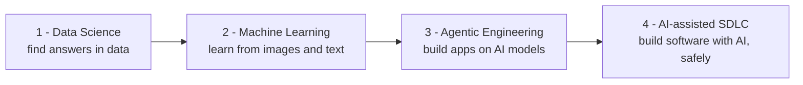

# ds_ml_ai_starter

A hands-on **textbook and crash course** that takes you from "I've never done this" to building real
things in **Data Science, Machine Learning, Agentic Engineering, and AI-assisted software
development**.

It's written for an experienced software engineer who is **new to Python and to this whole field** —
but you don't need to be one to follow along. Every idea is explained from scratch, with a story and a
picture before any equation, and every idea lands as **code you can actually run** and a **result you
can actually see** (a chart, a table, a number), not just prose you nod along to.

> **New to all of this?** Read the four parts below in order. Each one starts gently and assumes only
> what the parts before it taught you.

---

## What's inside, in plain language

The book is four "parts," each a folder. Here's what each one is really about — no jargon.

### 1. [Data Science](01-data-science/) — *finding real answers in data*
Before anything called "AI," there's a humbler, more useful question: you have **data** — a table of
rows and columns (customers, taxi trips, ship passengers) — and you want to (a) **understand it**, (b)
decide whether a pattern you spot is **real or just luck**, and (c) **predict something you don't yet
know**: a number (a price) or a category (will this customer churn? did this passenger survive?).

This part builds that skill from the ground up: the statistics, how to **clean messy real-world
data**, how to build prediction models and — crucially — how to **check honestly whether they work**,
and how to keep them running once real decisions depend on them.

*You'll meet:* exploring data and testing whether a difference is real · filling in missing values ·
the classic traps that make a model look great and secretly be wrong · **regression** (predict a
number, e.g. a taxi fare) · **classification** (predict a category, e.g. who survived the Titanic) ·
**forecasting** (predict the next values of a time series) · **Bayesian inference** (predictions that
come with honest uncertainty) · and the "operations" side — tracking experiments, serving models, and
noticing when a model has gone stale.

### 2. [Machine Learning](02-machine-learning/) — *teaching computers by example*
Where Data Science often uses small, explainable models, this part is about **neural networks**:
systems with millions of tiny tunable dials that learn patterns straight from raw **images** and
**text**. It builds the idea from a single artificial "neuron" all the way up to the **Transformer**,
the architecture behind today's AI.

And you don't just read about it — you **train real models**: recognize handwritten digits, **fine-tune
a language model** to sort text by emotion, and train an agent to win a small chess endgame purely by
trial and error (**reinforcement learning**).

*You'll meet:* how a neural network actually learns · the main families (CNNs for images, RNNs and
Transformers for sequences) · **computer vision** (classify, detect, and outline objects in images) ·
**natural language** (classify text, generate text, and measure how good the output is) ·
**reinforcement learning** · and how to train big models on cloud GPUs.

### 3. [Agentic Engineering](03-agentic-engineering/) — *building applications on top of AI models*
A raw language model is just a very good text-predictor: it has **no memory**, can't **look things
up**, and can't **do anything** in the outside world. This part is about wrapping one into a genuinely
useful application — an **agent** that can search your own documents, call tools and databases, and
even coordinate with other agents.

*You'll build:* a system that answers questions from your PDFs (**RAG** — retrieval-augmented
generation) · an agent that turns messy PDF invoices into clean database rows (via **MCP**, the Model
Context Protocol — a standard way for AI to call tools) · and a multi-agent "tribunal" that debates a
question and reports a consensus — then how to **deploy** all of it to the cloud.

### 4. [AI-assisted SDLC](04-ai-assisted-sdlc/) — *using AI to build software, safely*
"SDLC" just means **software development lifecycle** — how software actually gets built. This part is
the meta-skill: how to let AI agents **write and review real production code** without it going off the
rails, using written rules, automated safety gates, and specialized helper agents.

The final chapter is the fun one: it **turns the camera on this very repository**, which was itself
built by exactly the process it teaches — and is honest about where that process broke and had to be
fixed.

---

## How every chapter is organized

Inside each part, chapters follow the same five-section shape, so you always know where you are:

| Section | What it gives you |
|---|---|
| **Theory** | The concept explained from zero — story, analogy, and a diagram *before* any math. |
| **Local Environment Setup** | Exactly what to install to run the examples on your own laptop. |
| **Worked Examples** | The heart of the book: a real dataset → real, runnable code → a real result (a plot, a table, a number) that you can reproduce yourself. |
| **Cloud Environment Setup** | How to do the same thing at scale on Google / AWS / Azure when a laptop isn't enough. |
| **Production Considerations** | What changes once real users depend on it — monitoring, drift, and when to retrain. |

Not every part uses all five (for example, the SDLC part stops at worked examples). Each part's own
`README` lists its chapters in reading order.



---

## Repository layout

```
01-data-science/          20 chapters — stats, EDA, regression, classification,
                          forecasting, Bayesian inference, and MLOps
02-machine-learning/      16 chapters — neural nets, computer vision, NLP,
                          reinforcement learning, LLMs (PyTorch / TensorFlow)
03-agentic-engineering/    7 chapters — vector DBs, RAG, MCP, multi-agent apps
04-ai-assisted-sdlc/       4 chapters — specs, gates, hooks, sub-agents; how this repo was built

docs/                     architecture, curriculum (the full chapter list),
                          style guide, and the "definition of done" quality bar
specs/                    one design spec per chapter (SPEC-*.md)
research/                 grounding notes — the sourced facts behind every claim (NOTE-*.md)
.claude/                  the automation: agent definitions, skills, and safety hooks
```

The single best index of everything is **[`docs/curriculum.md`](docs/curriculum.md)** — the complete,
ordered list of every chapter and what it covers.

---

## How this book was built (it eats its own dog food)

This isn't just *about* AI-assisted development — it **is** an example of it. The whole book was
written by a governed, multi-model pipeline, which is exactly what Part 4 teaches:

| Role | Does |
|---|---|
| **Architect** | Scopes each chapter into a written spec, reviews the result, and merges it |
| **Writer** | Writes one approved chapter at a time: prose + runnable code + artefacts |
| **Researcher** | Searches the web to **ground every claim**, package version, and dataset link |
| **Reviewer** | A fresh, independent pass before anything is merged |

Two rules keep it honest: **no chapter is written without an approved spec**
([`specs/`](specs/)), and **nothing ships ungrounded** — every technical claim traces to a sourced
note ([`research/`](research/)) or an inline citation. Automated hooks check that every code snippet
compiles and every formula and diagram renders correctly before it lands. The full, warts-and-all
story is Part 4's chapter *"How this repo was built."*

The rules live in [`CLAUDE.md`](CLAUDE.md) · the workflow in
[`docs/architecture.md`](docs/architecture.md) · the audience and voice in
[`docs/style-guide.md`](docs/style-guide.md) · the quality bar in
[`docs/definition-of-done.md`](docs/definition-of-done.md).

---

## Running the code

You need **Python 3.12 or newer**. Create a virtual environment (Python's version of an isolated
project sandbox) and install the shared tooling:

```bash
python -m venv .venv
source .venv/bin/activate      # on Windows: .venv\Scripts\activate
pip install -r requirements.txt
```

The heavy, subject-specific libraries (PyTorch, PyMC, and friends) are installed **per chapter**, as
each chapter's setup section tells you — so you only install what the chapter you're reading actually
needs.
